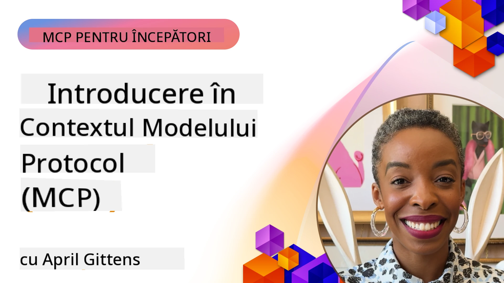
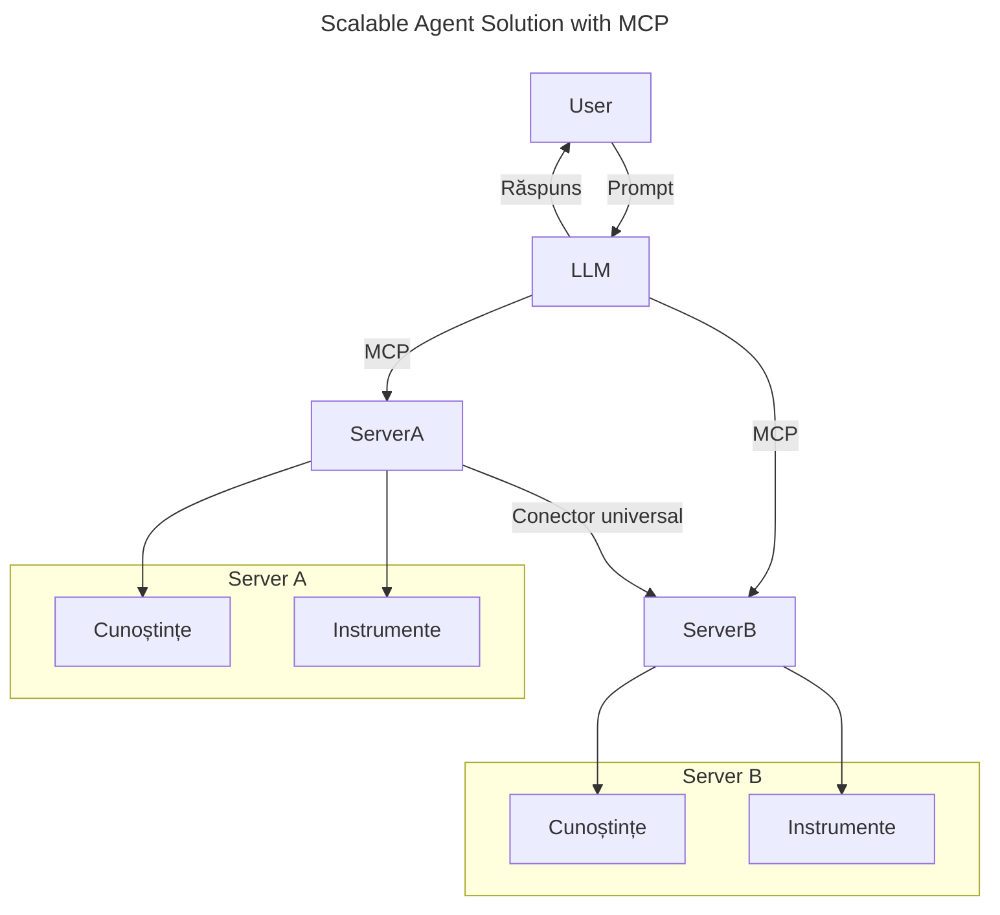
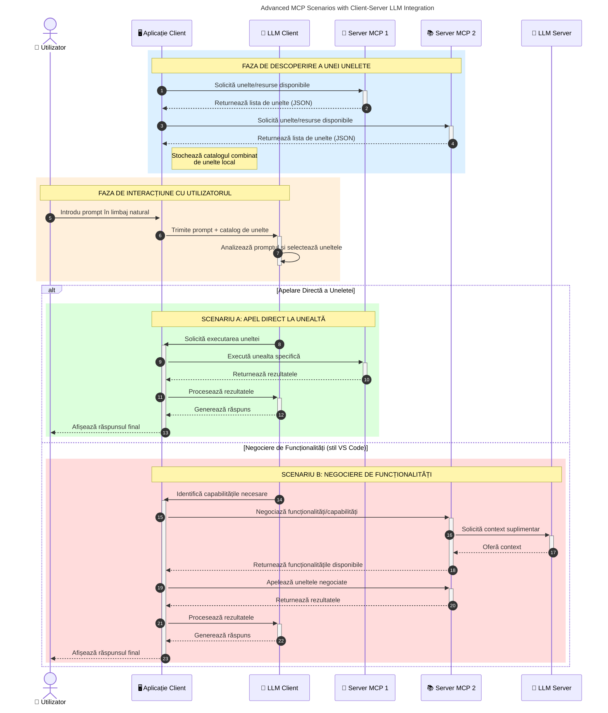

# Introducere în Model Context Protocol (MCP): De ce contează pentru aplicațiile AI scalabile

[](https://youtu.be/agBbdiOPLQA)

_(Click pe imaginea de mai sus pentru a viziona videoclipul acestei lecții)_

Aplicațiile AI generative sunt un mare pas înainte, deoarece adesea permit utilizatorului să interacționeze cu aplicația folosind instrucțiuni în limbaj natural. Totuși, pe măsură ce se investește mai mult timp și resurse în astfel de aplicații, vrei să te asiguri că poți integra funcționalități și resurse în mod facil, astfel încât să fie ușor de extins, ca aplicația ta să poată deservi mai mult de un model utilizat și să gestioneze diversele particularități ale modelelor. Pe scurt, construirea aplicațiilor Gen AI este ușoară la început, dar pe măsură ce acestea cresc și devin mai complexe, trebuie să începi să definiți o arhitectură și probabil vei avea nevoie să te bazezi pe un standard pentru a asigura că aplicațiile tale sunt construite într-un mod consecvent. Aici intervine MCP pentru a organiza lucrurile și a oferi un standard.

---

## **🔍 Ce este Model Context Protocol (MCP)?**

**Model Context Protocol (MCP)** este o **interfață deschisă, standardizată** care permite modelelor lingvistice mari (LLM) să interacționeze fără probleme cu instrumente externe, API-uri și surse de date. Oferă o arhitectură consistentă pentru a extinde funcționalitatea modelelor AI dincolo de datele lor de antrenament, permițând sisteme AI mai inteligente, scalabile și mai receptive.

---

## **🎯 De ce contează standardizarea în AI**

Pe măsură ce aplicațiile AI generative devin mai complexe, este esențial să adopți standarde care să asigure **scalabilitate, extensibilitate, întreținere** și **evitarea blocării în furnizori**. MCP răspunde acestor nevoi prin:

- Unificarea integrărilor model-instrument
- Reducerea soluțiilor fragile și personalizate, unice
- Permite coexistența mai multor modele de la furnizori diferiți într-un singur ecosistem

**Notă:** Deși MCP se promovează ca un standard deschis, nu există planuri pentru standardizarea MCP prin vreun organism de standardizare existent precum IEEE, IETF, W3C, ISO sau alt organism de standardizare.

---

## **📚 Obiective de învățare**

La sfârșitul acestui articol, vei putea:

- Definiți **Model Context Protocol (MCP)** și cazurile sale de utilizare
- Înțelegeți cum MCP standardizează comunicarea model-instrument
- Identifica componentele principale ale arhitecturii MCP
- Explora aplicații reale ale MCP în contexte enterprise și de dezvoltare

---

## **💡 De ce Model Context Protocol (MCP) este un schimbător de joc**

### **🔗 MCP rezolvă fragmentarea în interacțiunile AI**

Înainte de MCP, integrarea modelelor cu instrumente necesita:

- Cod personalizat pentru fiecare pereche instrument-model
- API-uri nestandardizate pentru fiecare furnizor
- Frecvente întreruperi cauzate de actualizări
- Scalabilitate slabă pe măsură ce apar mai multe instrumente

### **✅ Beneficiile standardizării MCP**

| **Beneficiu**            | **Descriere**                                                                 |
|--------------------------|-------------------------------------------------------------------------------|
| Interoperabilitate       | LLM-urile lucrează fără probleme cu instrumente de la diferiți furnizori     |
| Consistență              | Comportament uniform pe platforme și instrumente                            |
| Reutilizabilitate        | Instrumentele construite o dată pot fi folosite în proiecte și sisteme multiple |
| Dezvoltare accelerată    | Reduce timpul de dezvoltare folosind interfețe standardizate și plug-and-play |

---

## **🧱 Prezentare generală arhitectură MCP la nivel înalt**

MCP urmează un **model client-server**, unde:

- **Gazdele MCP** rulează modelele AI
- **Clienții MCP** inițiază solicitările
- **Serverele MCP** oferă context, instrumente și capabilități

### **Componente cheie:**

- **Resurse** – Date statice sau dinamice pentru modele  
- **Prompts** – Fluxuri de lucru predefinite pentru generare ghidată  
- **Instrumente** – Funcții executabile cum ar fi căutare, calcule  
- **Sampling** – Comportament agentic prin interacțiuni recursive (învechit în
    MCP `2026-07-28`; implementările noi ar trebui să integreze direct un furnizor LLM)

- **Elicitation** – Solicitări inițiate de server pentru input de la utilizator
- **Roots** – Locații informaționale în sistemul de fișiere relevante pentru un server
    (învechit în MCP `2026-07-28`; se recomandă parametri ai instrumentelor, URI-uri de resurse sau
    configurare de server)

### **Arhitectura protocolului:**

MCP folosește o arhitectură în două straturi:
- **Stratul de date**: Mesaje JSON-RPC 2.0, metadata per solicitare, descoperire și
    primitive de protocol
- **Stratul de transport**: stdio pentru subprocese locale și Streamable HTTP pentru
    servere remote. Streamable HTTP poate folosi încadrare SSE pentru răspunsuri
    în flux, dar transportul mai vechi HTTP+SSE este învechit.

---

## Cum funcționează Serverele MCP

Serverele MCP operează după cum urmează:

- **Fluxul solicitării**:
    1. O solicitare este inițiată de un utilizator final sau un software care acționează în numele său.
    2. **Clientul MCP** trimite solicitarea către un **Gazdă MCP**, care gestionează runtime-ul modelului AI.
    3. **Modelul AI** primește promptul utilizatorului și poate cere acces la instrumente sau date externe prin una sau mai multe apeluri către instrumente.
    4. **Gazda MCP**, nu modelul direct, comunică cu **Serverele MCP** corespunzătoare folosind protocolul standardizat.
- **Funcționalitatea Gazdei MCP**:
    - **Registrul Instrumentelor**: Menține un catalog de instrumente disponibile și capabilitățile lor.
    - **Autentificare**: Verifică permisiunile pentru accesul la instrumente.
    - **Gestionarea solicitărilor**: Procesează solicitările de instrumente primite de la model.
    - **Formatarea răspunsurilor**: Structurează rezultatele instrumentelor într-un format înțeles de model.
- **Executarea Serverului MCP**:
    - **Gazda MCP** direcționează apelurile către unul sau mai multe **Servere MCP**, fiecare expunând funcții specializate (de exemplu căutare, calcule, interogări baze de date).
    - **Serverele MCP** efectuează operațiunile respective și returnează rezultatele către **Gazda MCP** într-un format consistent.
    - **Gazda MCP** formatează și transmit aceste rezultate către **Modelul AI**.
- **Finalizarea răspunsului**:
    - **Modelul AI** încorporează rezultatele instrumentelor într-un răspuns final.
    - **Gazda MCP** trimite acest răspuns înapoi către **Clientul MCP**, care îl livrează utilizatorului final sau software-ului care a apelat.
    

```mermaid
---
title: MCP Architecture and Component Interactions
description: A diagram showing the flows of the components in MCP.
---
graph TD
    Client[Client/Aplicație MCP] -->|Trimite Cerere| H[Gazdă MCP]
    H -->|Invocă| A[Model AI]
    A -->|Cerere Apel Instrument| H
    H -->|MCP Protocol| T1[MCP Server Tool 01: Căutare Web
    H -->|MCP Protocol| T2[MCP Server Tool 02: Instrument Calculator
    H -->|MCP Protocol| T3[MCP Server Tool 03: Instrument Acces Bază de Date
    H -->|MCP Protocol| T4[MCP Server Tool 04: Instrument Sistem de Fișiere
    H -->|Trimite Răspuns| Client

    subgraph "Componentele Gazdei MCP"
        H
        G[Registru Instrumente]
        I[Autentificare]
        J[Gestionar Cereri]
        K[Formatare Răspuns]
    end

    H <--> G
    H <--> I
    H <--> J
    H <--> K

    style A fill:#f9d5e5,stroke:#333,stroke-width:2px
    style H fill:#eeeeee,stroke:#333,stroke-width:2px
    style Client fill:#d5e8f9,stroke:#333,stroke-width:2px
    style G fill:#fffbe6,stroke:#333,stroke-width:1px
    style I fill:#fffbe6,stroke:#333,stroke-width:1px
    style J fill:#fffbe6,stroke:#333,stroke-width:1px
    style K fill:#fffbe6,stroke:#333,stroke-width:1px
    style T1 fill:#c2f0c2,stroke:#333,stroke-width:1px
    style T2 fill:#c2f0c2,stroke:#333,stroke-width:1px
    style T3 fill:#c2f0c2,stroke:#333,stroke-width:1px
    style T4 fill:#c2f0c2,stroke:#333,stroke-width:1px
```

## 👨‍💻 Cum să construiești un Server MCP (Cu exemple)

Serverele MCP îți permit să extinzi capabilitățile LLM oferind date și funcționalitate.

Ești gata să încerci? Iată SDK-uri specifice limbajelor și/sau stack-urilor cu exemple de creare a unor servere MCP simple în diferite limbaje/stack-uri:

- **SDK Python**: https://github.com/modelcontextprotocol/python-sdk

- **SDK TypeScript**: https://github.com/modelcontextprotocol/typescript-sdk

- **SDK Java**: https://github.com/modelcontextprotocol/java-sdk

- **SDK C#/.NET**: https://github.com/modelcontextprotocol/csharp-sdk


## 🌍 Cazuri reale de utilizare ale MCP

MCP permite o gamă largă de aplicații prin extinderea capabilităților AI:

| **Aplicație**                 | **Descriere**                                                               |
|------------------------------|-----------------------------------------------------------------------------|
| Integrarea datelor enterprise | Conectează LLM-uri la baze de date, CRM-uri sau instrumente interne         |
| Sisteme AI agentice          | Permite agenți autonomi cu acces la instrumente și fluxuri decizionale      |
| Aplicații multi-modale       | Combină instrumente de text, imagine și audio într-o singură aplicație AI  |
| Integrarea datelor în timp real | Adu date live în interacțiunile AI pentru rezultate mai precise și actuale |


### 🧠 MCP = Standard universal pentru interacțiunile AI

Model Context Protocol (MCP) acționează ca un standard universal pentru interacțiunile AI, la fel cum USB-C a standardizat conexiunile fizice pentru dispozitive. În lumea AI, MCP oferă o interfață consistentă, permițând modelelor (clienți) să se integreze fără probleme cu instrumente externe și furnizori de date (servere). Aceasta elimină necesitatea unor protocoale diverse, personalizate pentru fiecare API sau sursă de date.

Sub MCP, un instrument compatibil MCP (denumit server MCP) urmează un standard unificat. Aceste servere pot lista instrumentele sau acțiunile pe care le oferă și pot executa aceste acțiuni când sunt solicitate de un agent AI. Platformele agent AI care suportă MCP sunt capabile să descopere instrumentele disponibile de la servere și să le invoce prin acest protocol standard.

### 💡 Facilitează accesul la cunoaștere

Dincolo de oferirea instrumentelor, MCP facilitează și accesul la cunoaștere. Permite aplicațiilor să ofere context modelelor lingvistice mari (LLM) prin conectarea lor la diverse surse de date. De exemplu, un server MCP ar putea reprezenta un depozit de documente al unei companii, permițând agenților să obțină informații relevante la cerere. Un alt server ar putea gestiona acțiuni specifice, cum ar fi trimiterea de e-mailuri sau actualizarea înregistrărilor. Din perspectiva agentului, acestea sunt pur și simplu instrumente pe care le poate folosi – unele instrumente returnează date (context de cunoaștere), altele execută acțiuni. MCP gestionează eficient ambele.

Un agent care se conectează la un server MCP învață automat capabilitățile serverului și datele accesibile printr-un format standard. Această standardizare permite disponibilitatea dinamică a instrumentelor. De exemplu, adăugarea unui nou server MCP în sistemul unui agent face funcțiile acestuia imediat utilizabile fără a necesita personalizări suplimentare ale instrucțiunilor agentului.

Această integrare simplificată se aliniază fluxului ilustrat în diagrama următoare, unde serverele oferă atât instrumente cât și cunoaștere, asigurând o colaborare fără probleme între sisteme.

### 👉 Exemplu: Soluție agent scalabilă


Conectorul Universal permite serverelor MCP să comunice și să își partajeze capabilitățile, permițând ServerA să delegheze sarcini lui ServerB sau să îi acceseze instrumentele și cunoștințele. Aceasta federă instrumentele și datele între servere, sprijinind arhitecturi agentice scalabile și modulare. Deoarece MCP standardizează expunerea instrumentelor, agenții pot descoperi dinamic și direcționa solicitările între servere fără integrări hardcodate.


Federația instrumentelor și cunoștințelor: Instrumentele și datele pot fi accesate între servere, permițând arhitecturi agentice mai scalabile și modulare.

### 🔄 Scenarii avansate MCP cu integrare LLM pe partea clientului

Dincolo de arhitectura MCP de bază, există scenarii avansate în care atât clientul, cât și serverul conțin LLM-uri, permițând interacțiuni mai sofisticate. În diagrama următoare, **Aplicația Client** ar putea fi un IDE cu un număr de instrumente MCP disponibile pentru utilizarea de către LLM:



## 🔐 Beneficii practice ale MCP

Iată beneficiile practice ale utilizării MCP:

- **Actualitate**: Modelele pot accesa informații actualizate dincolo de datele lor de antrenament
- **Extinderea capabilităților**: Modelele pot folosi instrumente specializate pentru sarcini pentru care nu au fost antrenate
- **Reducerea halucinațiilor**: Sursele de date externe oferă fundament factual
- **Confidențialitate**: Datele sensibile pot rămâne în medii securizate în loc să fie încorporate în prompturi

## 📌 Concluzii cheie

Următoarele sunt concluzii cheie pentru utilizarea MCP:

- **MCP** standardizează modul în care modelele AI interacționează cu instrumente și date
- Promovează **extensibilitate, consistență și interoperabilitate**
- MCP ajută la **reducerea timpului de dezvoltare, îmbunătățirea fiabilității și extinderea capabilităților modelului**
- Arhitectura client-server **permite aplicații AI flexibile și extensibile**

## 🧠 Exercițiu

Gândește-te la o aplicație AI pe care ești interesat să o construiești.

- Ce **instrumente externe sau date** ar putea îmbunătăți capabilitățile acesteia?
- Cum ar putea MCP să facă integrarea **mai simplă și mai fiabilă?**

## Resurse suplimentare

- [MCP GitHub Repository](https://github.com/modelcontextprotocol)


## Următorul pas

Următorul: [Capitolul 1: Concepte de bază](../01-CoreConcepts/README.md)

---

<!-- CO-OP TRANSLATOR DISCLAIMER START -->
**Declinare a responsabilității**:
Acest document a fost tradus folosind serviciul de traducere AI [Co-op Translator](https://github.com/Azure/co-op-translator). În timp ce ne străduim pentru acuratețe, vă rugăm să rețineți că traducerile automate pot conține erori sau inexactități. Documentul original în limba sa nativă trebuie considerat sursa autorizată. Pentru informații critice, se recomandă traducerea profesională realizată de un om. Nu ne asumăm responsabilitatea pentru eventualele neînțelegeri sau interpretări greșite care decurg din utilizarea acestei traduceri.
<!-- CO-OP TRANSLATOR DISCLAIMER END -->