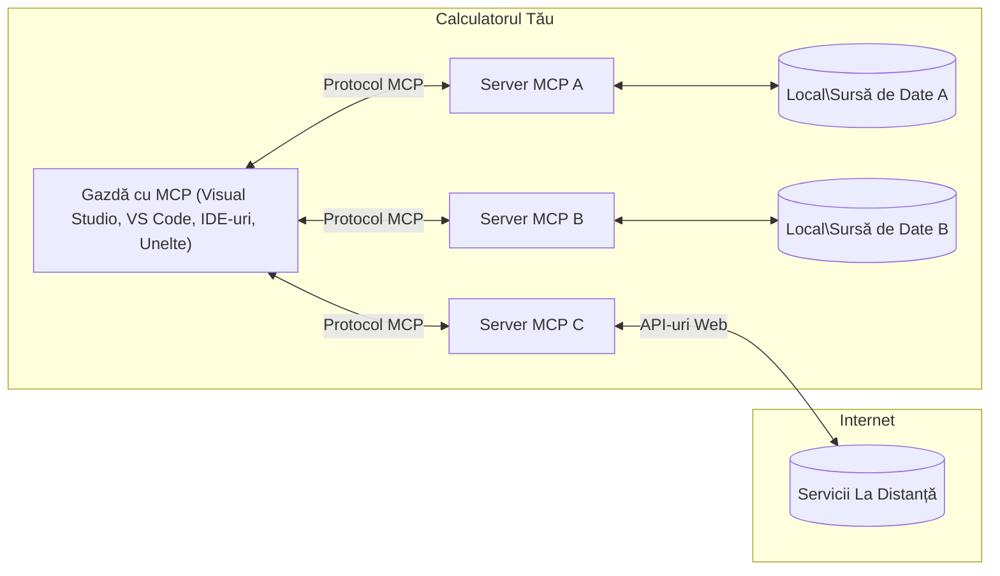

# Concepte de bază MCP: Stăpânirea Protocolului Contextului Modelului pentru Integrarea AI

[](https://youtu.be/earDzWGtE84)

_(Faceți clic pe imaginea de mai sus pentru a viziona videoclipul acestei lecții)_

[Model Context Protocol (MCP)](https://github.com/modelcontextprotocol) este un cadru puternic și standardizat care optimizează comunicarea între Modelele Mari de Limbaj (LLM-uri) și unelte externe, aplicații și surse de date.  
Acest ghid vă va conduce prin conceptele de bază ale MCP. Veți învăța despre arhitectura client-server, componentele esențiale, mecanismele de comunicare și cele mai bune practici de implementare.

- **Consimțământ Explicit al Utilizatorului**: Toate accesările și operațiunile asupra datelor necesită aprobarea explicită a utilizatorului înainte de execuție. Utilizatorii trebuie să înțeleagă clar ce date vor fi accesate și ce acțiuni vor fi efectuate, cu control granular asupra permisiunilor și autorizărilor.

- **Protecția Confidențialității Datelor**: Datele utilizatorului sunt expuse doar cu consimțământ explicit și trebuie protejate prin controale robuste de acces pe tot parcursul ciclului de viață al interacțiunii. Implementările trebuie să prevină transmiterea neautorizată a datelor și să mențină limite stricte de confidențialitate.

- **Siguranța Execuției Uneltelor**: Fiecare invocare a unei unelte necesită consimțământ explicit al utilizatorului, cu înțelegerea clară a funcționalității uneltei, parametrilor și impactului potențial. Limitele de securitate robuste trebuie să prevină execuția neintenționată, nesigură sau malițioasă a uneltelor.

- **Securitatea Stratului de Transport**: Toate canalele de comunicare trebuie să utilizeze mecanisme adecvate de criptare și autentificare. Conexiunile la distanță trebuie să implementeze protocoale de transport securizate și gestionare corespunzătoare a acreditărilor.

#### Linii directoare de implementare:

- **Gestionarea Permisiunilor**: Implementați sisteme de permisiuni detaliate care permit utilizatorilor să controleze ce servere, unelte și resurse sunt accesibile  
- **Autentificare și Autorizare**: Folosiți metode sigure de autentificare (OAuth, chei API) cu gestionare corectă a tokenurilor și expirare  
- **Validarea Intrărilor**: Validați toți parametrii și datele de intrare conform schemelor definite pentru a preveni atacurile de tip injecție  
- **Jurnalizare Audit**: Mențineți jurnale cuprinzătoare ale tuturor operațiunilor pentru monitorizarea securității și conformitate

## Prezentare generală

Această lecție explorează arhitectura fundamentală și componentele care alcătuiesc ecosistemul Model Context Protocol (MCP). Veți învăța despre arhitectura client-server, componentele cheie și mecanismele de comunicare care alimentează interacțiunile MCP.

## Obiective cheie de învățare

La finalul acestei lecții, veți:

- Înțelege arhitectura client-server MCP.  
- Identifica rolurile și responsabilitățile gazdelor, clienților și serverelor.  
- Analiza caracteristicile de bază care fac din MCP un strat flexibil de integrare.  
- Înțelege cum circulă informația în ecosistemul MCP.  
- Obține perspective practice prin exemple de cod în .NET, Java, Python și JavaScript.

## Arhitectura MCP: O privire mai profundă

Ecosistemul MCP este construit pe un model client-server. Această structură modulară permite aplicațiilor AI să interacționeze eficient cu unelte, baze de date, API-uri și resurse contextuale. Să descompunem această arhitectură în componentele sale de bază.

În esență, MCP urmează o arhitectură client-server în care o aplicație gazdă se poate conecta la mai multe servere:


- **Gazdele MCP**: Programe precum VSCode, Claude Desktop, IDE-uri sau unelte AI care doresc să acceseze date prin MCP  
- **Clienții MCP**: Clienți de protocol care mențin conexiuni 1:1 cu serverele  
- **Serverele MCP**: Programe ușoare care expun fiecare capabilități specifice prin Protocolul Contextului Modelului standardizat  
- **Surse locale de date**: Fișierele, bazele de date și serviciile calculatorului dvs. la care serverele MCP pot accesa în siguranță  
- **Servicii la distanță**: Sisteme externe disponibile prin internet la care serverele MCP se pot conecta prin API-uri.

Protocolul MCP este un standard în evoluție care folosește versiuni bazate pe dată (formatul YYYY-MM-DD). Versiunea curentă a protocolului este **2025-11-25**. Puteți vedea cele mai recente actualizări ale [specificației protocolului](https://modelcontextprotocol.io/specification/2025-11-25/)

### 1. Gazde

În Model Context Protocol (MCP), **Gazdele** sunt aplicații AI care servesc ca interfața principală prin care utilizatorii interacționează cu protocolul. Gazdele coordonează și gestionează conexiunile către mai multe servere MCP prin crearea de clienți MCP dedicați pentru fiecare conexiune la server. Exemple de gazde includ:

- **Aplicații AI**: Claude Desktop, Visual Studio Code, Claude Code  
- **Mediile de dezvoltare**: IDE-uri și editoare de cod cu integrare MCP  
- **Aplicații personalizate**: Agenți și unelte AI construite pentru scopuri specifice

**Gazdele** sunt aplicații care coordonează interacțiunile cu modelele AI. Ele:

- **Orchestrarea modelelor AI**: Execută sau interacționează cu LLM-uri pentru a genera răspunsuri și a coordona fluxuri de lucru AI  
- **Gestionarea conexiunilor client**: Creează și mențin un client MCP pentru fiecare conexiune la server MCP  
- **Controlul interfeței utilizator**: Gestionează fluxul conversației, interacțiunile utilizatorului și prezentarea răspunsurilor  
- **Aplicarea securității**: Controlează permisiunile, constrângerile de securitate și autentificarea  
- **Gestionarea consimțământului utilizatorului**: Administrează aprobarea utilizatorului pentru partajarea datelor și execuția uneltelor

### 2. Clienți

**Clienții** sunt componente esențiale care mențin conexiuni dedicate unu-la-unu între gazde și serverele MCP. Fiecare client MCP este instanțiat de gazdă pentru a se conecta la un server MCP specific, asigurând canale de comunicare organizate și sigure. Mai mulți clienți permit gazdelor să se conecteze simultan la mai multe servere.

**Clienții** sunt componente de conectare în cadrul aplicației gazdă. Ei:

- **Comunicare protocol**: Trimit cereri JSON-RPC 2.0 către servere cu prompturi și instrucțiuni  
- **Negocierea capabilităților**: Negociază caracteristicile și versiunile protocolului suportate cu serverele în timpul inițializării  
- **Execuția uneltelor**: Gestionează cererile de execuție a uneltelor de la modele și procesează răspunsurile  
- **Actualizări în timp real**: Gestionează notificările și actualizările în timp real de la servere  
- **Procesarea răspunsurilor**: Procesează și formatează răspunsurile serverului pentru afișarea către utilizatori

### 3. Servere

**Serverele** sunt programe care oferă context, unelte și capabilități clienților MCP. Ele pot rula local (pe aceeași mașină cu gazda) sau la distanță (pe platforme externe) și sunt responsabile pentru gestionarea cererilor clientului și furnizarea răspunsurilor structurate. Serverele expun funcționalități specifice prin Protocolul Contextului Modelului standardizat.

**Serverele** sunt servicii care oferă context și capabilități. Ele:

- **Înregistrarea caracteristicilor**: Înregistrează și expun primitive disponibile (resurse, prompturi, unelte) către clienți  
- **Procesarea cererilor**: Primesc și execută apeluri de unelte, cereri de resurse și cereri de prompturi de la clienți  
- **Furnizarea contextului**: Oferă informații contextuale și date pentru a îmbunătăți răspunsurile modelului  
- **Gestionarea stării**: Mențin starea sesiunii și gestionează interacțiuni cu stare când este necesar  
- **Notificări în timp real**: Trimit notificări despre schimbări de capabilități și actualizări către clienții conectați

Serverele pot fi dezvoltate de oricine pentru a extinde capabilitățile modelului cu funcționalitate specializată și suportă scenarii de implementare atât locale, cât și la distanță.

### 4. Primitivele serverului

Serverele din Model Context Protocol (MCP) oferă trei **primitive** de bază care definesc blocurile fundamentale pentru interacțiuni bogate între clienți, gazde și modele de limbaj. Aceste primitive specifică tipurile de informații contextuale și acțiuni disponibile prin protocol.

Serverele MCP pot expune orice combinație dintre următoarele trei primitive de bază:

#### Resurse

**Resursele** sunt surse de date care oferă informații contextuale aplicațiilor AI. Ele reprezintă conținut static sau dinamic care poate îmbunătăți înțelegerea și luarea deciziilor modelului:

- **Date contextuale**: Informații structurate și context pentru consumul modelului AI  
- **Baze de cunoștințe**: Repozitorii de documente, articole, manuale și lucrări de cercetare  
- **Surse locale de date**: Fișiere, baze de date și informații locale ale sistemului  
- **Date externe**: Răspunsuri API, servicii web și date de la sisteme la distanță  
- **Conținut dinamic**: Date în timp real care se actualizează în funcție de condiții externe

Resursele sunt identificate prin URI-uri și suportă descoperirea prin metodele `resources/list` și accesarea prin `resources/read`:

```text
file://documents/project-spec.md
database://production/users/schema
api://weather/current
```

#### Prompturi

**Prompturile** sunt șabloane reutilizabile care ajută la structurarea interacțiunilor cu modelele de limbaj. Ele oferă modele standardizate de interacțiune și fluxuri de lucru șablonizate:

- **Interacțiuni bazate pe șabloane**: Mesaje pre-structurate și începuturi de conversație  
- **Șabloane de flux de lucru**: Secvențe standardizate pentru sarcini și interacțiuni comune  
- **Exemple few-shot**: Șabloane bazate pe exemple pentru instruirea modelului  
- **Prompturi de sistem**: Prompturi fundamentale care definesc comportamentul și contextul modelului  
- **Șabloane dinamice**: Prompturi parametrizate care se adaptează la contexte specifice

Prompturile suportă substituirea variabilelor și pot fi descoperite prin `prompts/list` și accesate cu `prompts/get`:

```markdown
Generate a {{task_type}} for {{product}} targeting {{audience}} with the following requirements: {{requirements}}
```

#### Unelte

**Uneltele** sunt funcții executabile pe care modelele AI le pot invoca pentru a efectua acțiuni specifice. Ele reprezintă „verbele” ecosistemului MCP, permițând modelelor să interacționeze cu sisteme externe:

- **Funcții executabile**: Operațiuni discrete pe care modelele le pot invoca cu parametri specifici  
- **Integrare cu sisteme externe**: Apeluri API, interogări baze de date, operațiuni pe fișiere, calcule  
- **Identitate unică**: Fiecare unealtă are un nume distinct, descriere și schemă de parametri  
- **I/O structurat**: Uneltele acceptă parametri validați și returnează răspunsuri structurate, tipizate  
- **Capabilități de acțiune**: Permit modelelor să efectueze acțiuni reale și să recupereze date live

Uneltele sunt definite cu JSON Schema pentru validarea parametrilor și descoperite prin `tools/list` și executate prin `tools/call`:

```typescript
server.tool(
  "search_products", 
  {
    query: z.string().describe("Search query for products"),
    category: z.string().optional().describe("Product category filter"),
    max_results: z.number().default(10).describe("Maximum results to return")
  }, 
  async (params) => {
    // Execută căutarea și returnează rezultate structurate
    return await productService.search(params);
  }
);
```

## Primitivele clientului

În Model Context Protocol (MCP), **clienții** pot expune primitive care permit serverelor să solicite capabilități suplimentare de la aplicația gazdă. Aceste primitive pe partea clientului permit implementări server mai bogate și interactive care pot accesa capabilitățile modelului AI și interacțiunile utilizatorului.

### Sampling

**Sampling** permite serverelor să solicite completări ale modelului de limbaj din aplicația AI a clientului. Această primitivă permite serverelor să acceseze capabilitățile LLM fără a-și încorpora propriile dependențe de model:

- **Acces independent de model**: Serverele pot solicita completări fără a include SDK-uri LLM sau a gestiona accesul la model  
- **AI inițiat de server**: Permite serverelor să genereze autonom conținut folosind modelul AI al clientului  
- **Interacțiuni recursive LLM**: Suportă scenarii complexe în care serverele au nevoie de asistență AI pentru procesare  
- **Generare dinamică de conținut**: Permite serverelor să creeze răspunsuri contextuale folosind modelul gazdei

Sampling este inițiat prin metoda `sampling/complete`, unde serverele trimit cereri de completare către clienți.

### Elicitation

**Elicitation** permite serverelor să solicite informații suplimentare sau confirmare de la utilizatori prin interfața clientului:

- **Cereri de input utilizator**: Serverele pot cere informații suplimentare când sunt necesare pentru execuția uneltei  
- **Dialoguri de confirmare**: Solicită aprobarea utilizatorului pentru operațiuni sensibile sau cu impact  
- **Fluxuri de lucru interactive**: Permit serverelor să creeze interacțiuni pas cu pas cu utilizatorul  
- **Colectare dinamică de parametri**: Adună parametri lipsă sau opționali în timpul execuției uneltei

Cererile de elicitation se fac folosind metoda `elicitation/request` pentru a colecta input de la utilizator prin interfața clientului.

### Logging

**Logging** permite serverelor să trimită mesaje structurate de jurnal către clienți pentru depanare, monitorizare și vizibilitate operațională:

- **Suport pentru depanare**: Permite serverelor să ofere jurnale detaliate de execuție pentru depanare  
- **Monitorizare operațională**: Trimite actualizări de stare și metrici de performanță către clienți  
- **Raportare erori**: Oferă context detaliat al erorilor și informații de diagnostic  
- **Trasee de audit**: Creează jurnale cuprinzătoare ale operațiunilor și deciziilor serverului

Mesajele de logging sunt trimise către clienți pentru a oferi transparență în operațiunile serverului și a facilita depanarea.

## Fluxul informației în MCP

Model Context Protocol (MCP) definește un flux structurat de informații între gazde, clienți, servere și modele. Înțelegerea acestui flux ajută la clarificarea modului în care cererile utilizatorului sunt procesate și cum uneltele și datele externe sunt integrate în răspunsurile modelului.

- **Gazda inițiază conexiunea**  
  Aplicația gazdă (cum ar fi un IDE sau o interfață de chat) stabilește o conexiune către un server MCP, de obicei prin STDIO, WebSocket sau alt transport suportat.

- **Negocierea capabilităților**  
  Clientul (încorporat în gazdă) și serverul schimbă informații despre caracteristicile, uneltele, resursele și versiunile protocolului suportate. Acest lucru asigură că ambele părți înțeleg ce capabilități sunt disponibile pentru sesiune.

- **Cererea utilizatorului**  
  Utilizatorul interacționează cu gazda (de exemplu, introduce un prompt sau o comandă). Gazda colectează această intrare și o transmite clientului pentru procesare.

- **Utilizarea resurselor sau uneltelor**  
  - Clientul poate solicita context suplimentar sau resurse de la server (cum ar fi fișiere, înregistrări din baze de date sau articole din baze de cunoștințe) pentru a îmbogăți înțelegerea modelului.  
  - Dacă modelul determină că este necesară o unealtă (de exemplu, pentru a prelua date, a efectua un calcul sau a apela un API), clientul trimite o cerere de invocare a uneltei către server, specificând numele uneltei și parametrii.

- **Execuția serverului**  
  Serverul primește cererea de resurse sau unealtă, execută operațiunile necesare (cum ar fi rularea unei funcții, interogarea unei baze de date sau recuperarea unui fișier) și returnează rezultatele clientului într-un format structurat.

- **Generarea răspunsului**  
  Clientul integrează răspunsurile serverului (datele resursei, rezultatele uneltelor etc.) în interacțiunea curentă cu modelul. Modelul folosește aceste informații pentru a genera un răspuns cuprinzător și relevant contextual.

- **Prezentarea rezultatului**  
  Gazda primește rezultatul final de la client și îl prezintă utilizatorului, adesea incluzând atât textul generat de model, cât și orice rezultate din execuțiile uneltelor sau căutările de resurse.

Acest flux permite MCP să susțină aplicații AI avansate, interactive și conștiente de context prin conectarea fără întreruperi a modelelor cu unelte și surse de date externe.

## Arhitectura și straturile protocolului

MCP constă din două straturi arhitecturale distincte care lucrează împreună pentru a oferi un cadru complet de comunicare:

### Strat de date

**Stratul de date** implementează protocolul MCP de bază folosind **JSON-RPC 2.0** ca fundament. Acest strat definește structura mesajelor, semantica și modelele de interacțiune:

#### Componente de bază:

- **Protocol JSON-RPC 2.0**: Toată comunicarea folosește formatul standardizat JSON-RPC 2.0 pentru apeluri de metode, răspunsuri și notificări
- **Gestionarea ciclului de viață**: Gestionează inițializarea conexiunii, negocierea capabilităților și terminarea sesiunii între clienți și servere  
- **Primitive de server**: Permite serverelor să ofere funcționalitate de bază prin instrumente, resurse și prompturi  
- **Primitive de client**: Permite serverelor să solicite eșantionare de la LLM-uri, să obțină input de la utilizator și să trimită mesaje de jurnal  
- **Notificări în timp real**: Suportă notificări asincrone pentru actualizări dinamice fără interogare continuă  

#### Caracteristici cheie:

- **Negocierea versiunii protocolului**: Folosește versiuni bazate pe dată (AAAA-LL-ZZ) pentru a asigura compatibilitatea  
- **Descoperirea capabilităților**: Clienții și serverele schimbă informații despre funcționalitățile suportate în timpul inițializării  
- **Sesiuni cu stare**: Menține starea conexiunii pe parcursul mai multor interacțiuni pentru continuitatea contextului  

### Strat de transport

**Stratul de transport** gestionează canalele de comunicare, încadrările mesajelor și autentificarea între participanții MCP:

#### Mecanisme de transport suportate:

1. **Transport STDIO**:  
   - Folosește fluxurile standard de intrare/ieșire pentru comunicare directă între procese  
   - Optim pentru procese locale pe aceeași mașină, fără overhead de rețea  
   - Utilizat frecvent pentru implementări locale ale serverului MCP  

2. **Transport HTTP streamabil**:  
   - Folosește HTTP POST pentru mesaje client-către-server  
   - Opțional Server-Sent Events (SSE) pentru streaming server-către-client  
   - Permite comunicarea cu servere la distanță prin rețele  
   - Suportă autentificare HTTP standard (token-uri bearer, chei API, antete personalizate)  
   - MCP recomandă OAuth pentru autentificare securizată bazată pe token-uri  

#### Abstracția transportului:

Stratul de transport abstractizează detaliile comunicării față de stratul de date, permițând același format de mesaj JSON-RPC 2.0 pentru toate mecanismele de transport. Această abstracție permite aplicațiilor să comute fără probleme între servere locale și la distanță.

### Considerații de securitate

Implementările MCP trebuie să respecte mai multe principii critice de securitate pentru a asigura interacțiuni sigure, de încredere și protejate pe tot parcursul operațiunilor protocolului:

- **Consimțământul și controlul utilizatorului**: Utilizatorii trebuie să ofere consimțământ explicit înainte ca orice date să fie accesate sau operațiuni să fie efectuate. Ei trebuie să aibă control clar asupra datelor partajate și acțiunilor autorizate, susținut de interfețe intuitive pentru revizuirea și aprobarea activităților.

- **Confidențialitatea datelor**: Datele utilizatorilor trebuie expuse doar cu consimțământ explicit și protejate prin controale adecvate de acces. Implementările MCP trebuie să prevină transmiterea neautorizată a datelor și să asigure menținerea confidențialității pe tot parcursul interacțiunilor.

- **Siguranța instrumentelor**: Înainte de a invoca orice instrument, este necesar consimțământ explicit al utilizatorului. Utilizatorii trebuie să înțeleagă clar funcționalitatea fiecărui instrument, iar limitele de securitate robuste trebuie aplicate pentru a preveni execuția neintenționată sau nesigură a instrumentelor.

Urmând aceste principii de securitate, MCP asigură încrederea, confidențialitatea și siguranța utilizatorilor în toate interacțiunile protocolului, oferind în același timp integrări AI puternice.

## Exemple de cod: Componente cheie

Mai jos sunt exemple de cod în mai multe limbaje populare care ilustrează cum să implementați componente cheie ale serverului MCP și instrumente.

### Exemplu .NET: Crearea unui server MCP simplu cu instrumente

Iată un exemplu practic în .NET care demonstrează cum să implementați un server MCP simplu cu instrumente personalizate. Acest exemplu arată cum să definiți și să înregistrați instrumente, să gestionați cererile și să conectați serverul folosind Model Context Protocol.

```csharp
using System;
using System.Threading.Tasks;
using ModelContextProtocol.Server;
using ModelContextProtocol.Server.Transport;
using ModelContextProtocol.Server.Tools;

public class WeatherServer
{
    public static async Task Main(string[] args)
    {
        // Create an MCP server
        var server = new McpServer(
            name: "Weather MCP Server",
            version: "1.0.0"
        );
        
        // Register our custom weather tool
        server.AddTool<string, WeatherData>("weatherTool", 
            description: "Gets current weather for a location",
            execute: async (location) => {
                // Call weather API (simplified)
                var weatherData = await GetWeatherDataAsync(location);
                return weatherData;
            });
        
        // Connect the server using stdio transport
        var transport = new StdioServerTransport();
        await server.ConnectAsync(transport);
        
        Console.WriteLine("Weather MCP Server started");
        
        // Keep the server running until process is terminated
        await Task.Delay(-1);
    }
    
    private static async Task<WeatherData> GetWeatherDataAsync(string location)
    {
        // This would normally call a weather API
        // Simplified for demonstration
        await Task.Delay(100); // Simulate API call
        return new WeatherData { 
            Temperature = 72.5,
            Conditions = "Sunny",
            Location = location
        };
    }
}

public class WeatherData
{
    public double Temperature { get; set; }
    public string Conditions { get; set; }
    public string Location { get; set; }
}
```

### Exemplu Java: Componente server MCP

Acest exemplu demonstrează același server MCP și înregistrarea instrumentelor ca exemplul .NET de mai sus, dar implementat în Java.

```java
import io.modelcontextprotocol.server.McpServer;
import io.modelcontextprotocol.server.McpToolDefinition;
import io.modelcontextprotocol.server.transport.StdioServerTransport;
import io.modelcontextprotocol.server.tool.ToolExecutionContext;
import io.modelcontextprotocol.server.tool.ToolResponse;

public class WeatherMcpServer {
    public static void main(String[] args) throws Exception {
        // Creează un server MCP
        McpServer server = McpServer.builder()
            .name("Weather MCP Server")
            .version("1.0.0")
            .build();
            
        // Înregistrează un instrument meteo
        server.registerTool(McpToolDefinition.builder("weatherTool")
            .description("Gets current weather for a location")
            .parameter("location", String.class)
            .execute((ToolExecutionContext ctx) -> {
                String location = ctx.getParameter("location", String.class);
                
                // Obține date meteo (simplificat)
                WeatherData data = getWeatherData(location);
                
                // Returnează răspunsul formatat
                return ToolResponse.content(
                    String.format("Temperature: %.1f°F, Conditions: %s, Location: %s", 
                    data.getTemperature(), 
                    data.getConditions(), 
                    data.getLocation())
                );
            })
            .build());
        
        // Conectează serverul folosind transport stdio
        try (StdioServerTransport transport = new StdioServerTransport()) {
            server.connect(transport);
            System.out.println("Weather MCP Server started");
            // Menține serverul activ până când procesul este terminat
            Thread.currentThread().join();
        }
    }
    
    private static WeatherData getWeatherData(String location) {
        // Implementarea ar apela o API meteo
        // Simplificat pentru scopuri de exemplu
        return new WeatherData(72.5, "Sunny", location);
    }
}

class WeatherData {
    private double temperature;
    private String conditions;
    private String location;
    
    public WeatherData(double temperature, String conditions, String location) {
        this.temperature = temperature;
        this.conditions = conditions;
        this.location = location;
    }
    
    public double getTemperature() {
        return temperature;
    }
    
    public String getConditions() {
        return conditions;
    }
    
    public String getLocation() {
        return location;
    }
}
```

### Exemplu Python: Construirea unui server MCP

Acest exemplu folosește fastmcp, așa că vă rugăm să îl instalați mai întâi:

```python
pip install fastmcp
```
Exemplu de cod:

```python
#!/usr/bin/env python3
import asyncio
from fastmcp import FastMCP
from fastmcp.transports.stdio import serve_stdio

# Creează un server FastMCP
mcp = FastMCP(
    name="Weather MCP Server",
    version="1.0.0"
)

@mcp.tool()
def get_weather(location: str) -> dict:
    """Gets current weather for a location."""
    return {
        "temperature": 72.5,
        "conditions": "Sunny",
        "location": location
    }

# Abordare alternativă folosind o clasă
class WeatherTools:
    @mcp.tool()
    def forecast(self, location: str, days: int = 1) -> dict:
        """Gets weather forecast for a location for the specified number of days."""
        return {
            "location": location,
            "forecast": [
                {"day": i+1, "temperature": 70 + i, "conditions": "Partly Cloudy"}
                for i in range(days)
            ]
        }

# Înregistrează uneltele clasei
weather_tools = WeatherTools()

# Pornește serverul
if __name__ == "__main__":
    asyncio.run(serve_stdio(mcp))
```

### Exemplu JavaScript: Crearea unui server MCP

Acest exemplu arată crearea unui server MCP în JavaScript și cum să înregistrați două instrumente legate de vreme.

```javascript
// Folosind SDK-ul oficial Model Context Protocol
import { McpServer } from "@modelcontextprotocol/sdk/server/mcp.js";
import { StdioServerTransport } from "@modelcontextprotocol/sdk/server/stdio.js";
import { z } from "zod"; // Pentru validarea parametrilor

// Creează un server MCP
const server = new McpServer({
  name: "Weather MCP Server",
  version: "1.0.0"
});

// Definește un instrument meteo
server.tool(
  "weatherTool",
  {
    location: z.string().describe("The location to get weather for")
  },
  async ({ location }) => {
    // Acesta ar apela în mod normal o API meteo
    // Simplificat pentru demonstrație
    const weatherData = await getWeatherData(location);
    
    return {
      content: [
        { 
          type: "text", 
          text: `Temperature: ${weatherData.temperature}°F, Conditions: ${weatherData.conditions}, Location: ${weatherData.location}` 
        }
      ]
    };
  }
);

// Definește un instrument de prognoză
server.tool(
  "forecastTool",
  {
    location: z.string(),
    days: z.number().default(3).describe("Number of days for forecast")
  },
  async ({ location, days }) => {
    // Acesta ar apela în mod normal o API meteo
    // Simplificat pentru demonstrație
    const forecast = await getForecastData(location, days);
    
    return {
      content: [
        { 
          type: "text", 
          text: `${days}-day forecast for ${location}: ${JSON.stringify(forecast)}` 
        }
      ]
    };
  }
);

// Funcții ajutătoare
async function getWeatherData(location) {
  // Simulează apelul API
  return {
    temperature: 72.5,
    conditions: "Sunny",
    location: location
  };
}

async function getForecastData(location, days) {
  // Simulează apelul API
  return Array.from({ length: days }, (_, i) => ({
    day: i + 1,
    temperature: 70 + Math.floor(Math.random() * 10),
    conditions: i % 2 === 0 ? "Sunny" : "Partly Cloudy"
  }));
}

// Conectează serverul folosind transportul stdio
const transport = new StdioServerTransport();
server.connect(transport).catch(console.error);

console.log("Weather MCP Server started");
```

Acest exemplu JavaScript demonstrează cum să creați un client MCP care se conectează la un server, trimite un prompt și procesează răspunsul, inclusiv orice apeluri către instrumente care au fost făcute.

## Securitate și autorizare

MCP include mai multe concepte și mecanisme încorporate pentru gestionarea securității și autorizării pe tot parcursul protocolului:

1. **Controlul permisiunilor pentru instrumente**:  
   Clienții pot specifica ce instrumente poate folosi un model în timpul unei sesiuni. Aceasta asigură că doar instrumentele autorizate explicit sunt accesibile, reducând riscul operațiunilor neintenționate sau nesigure. Permisiunile pot fi configurate dinamic în funcție de preferințele utilizatorului, politicile organizaționale sau contextul interacțiunii.

2. **Autentificare**:  
   Serverele pot solicita autentificare înainte de a acorda acces la instrumente, resurse sau operațiuni sensibile. Aceasta poate implica chei API, token-uri OAuth sau alte scheme de autentificare. Autentificarea corectă asigură că doar clienții și utilizatorii de încredere pot invoca capabilitățile serverului.

3. **Validare**:  
   Validarea parametrilor este aplicată pentru toate invocările instrumentelor. Fiecare instrument definește tipurile, formatele și constrângerile așteptate pentru parametrii săi, iar serverul validează cererile primite în consecință. Aceasta previne intrările incorecte sau malițioase să ajungă la implementările instrumentelor și ajută la menținerea integrității operațiunilor.

4. **Limitarea ratei**:  
   Pentru a preveni abuzul și a asigura utilizarea echitabilă a resurselor serverului, serverele MCP pot implementa limitarea ratei pentru apelurile instrumentelor și accesul la resurse. Limitele pot fi aplicate per utilizator, per sesiune sau global și ajută la protejarea împotriva atacurilor de tip denial-of-service sau consumului excesiv de resurse.

Combinând aceste mecanisme, MCP oferă o bază sigură pentru integrarea modelelor de limbaj cu instrumente și surse de date externe, oferind utilizatorilor și dezvoltatorilor control detaliat asupra accesului și utilizării.

## Mesaje de protocol și fluxul de comunicare

Comunicarea MCP folosește mesaje structurate **JSON-RPC 2.0** pentru a facilita interacțiuni clare și fiabile între gazde, clienți și servere. Protocolul definește tipare specifice de mesaje pentru diferite tipuri de operațiuni:

### Tipuri principale de mesaje:

#### **Mesaje de inițializare**
- Cerere **`initialize`**: Stabilește conexiunea și negociază versiunea protocolului și capabilitățile  
- Răspuns **`initialize`**: Confirmă funcționalitățile suportate și informațiile serverului  
- **`notifications/initialized`**: Semnalează că inițializarea este completă și sesiunea este gata  

#### **Mesaje de descoperire**
- Cerere **`tools/list`**: Descoperă instrumentele disponibile de la server  
- Cerere **`resources/list`**: Listează resursele disponibile (surse de date)  
- Cerere **`prompts/list`**: Recuperează șabloanele de prompturi disponibile  

#### **Mesaje de execuție**  
- Cerere **`tools/call`**: Execută un instrument specific cu parametrii furnizați  
- Cerere **`resources/read`**: Recuperează conținutul unei resurse specifice  
- Cerere **`prompts/get`**: Obține un șablon de prompt cu parametri opționali  

#### **Mesaje de partea clientului**
- Cerere **`sampling/complete`**: Serverul solicită completarea LLM de la client  
- **`elicitation/request`**: Serverul solicită input de la utilizator prin interfața clientului  
- Mesaje de jurnalizare: Serverul trimite mesaje structurate de jurnal către client  

#### **Mesaje de notificare**
- **`notifications/tools/list_changed`**: Serverul notifică clientul despre modificări ale instrumentelor  
- **`notifications/resources/list_changed`**: Serverul notifică clientul despre modificări ale resurselor  
- **`notifications/prompts/list_changed`**: Serverul notifică clientul despre modificări ale prompturilor  

### Structura mesajelor:

Toate mesajele MCP urmează formatul JSON-RPC 2.0 cu:  
- **Mesaje de cerere**: includ `id`, `method` și opțional `params`  
- **Mesaje de răspuns**: includ `id` și fie `result`, fie `error`  
- **Mesaje de notificare**: includ `method` și opțional `params` (fără `id` și fără răspuns așteptat)  

Această comunicare structurată asigură interacțiuni fiabile, trasabile și extensibile, suportând scenarii avansate precum actualizări în timp real, concatenarea instrumentelor și gestionarea robustă a erorilor.

## Concluzii cheie

- **Arhitectură**: MCP folosește o arhitectură client-server unde gazdele gestionează multiple conexiuni client către servere  
- **Participanți**: Ecosistemul include gazde (aplicații AI), clienți (conectori de protocol) și servere (furnizori de capabilități)  
- **Mecanisme de transport**: Comunicarea suportă STDIO (local) și HTTP streamabil cu SSE opțional (la distanță)  
- **Primitive de bază**: Serverele expun instrumente (funcții executabile), resurse (surse de date) și prompturi (șabloane)  
- **Primitive de client**: Serverele pot solicita eșantionare (completări LLM), elicitație (input utilizator) și jurnalizare de la clienți  
- **Bază de protocol**: Construit pe JSON-RPC 2.0 cu versiuni bazate pe dată (curent: 2025-11-25)  
- **Capabilități în timp real**: Suportă notificări pentru actualizări dinamice și sincronizare în timp real  
- **Securitate prioritară**: Consimțământ explicit al utilizatorului, protecția confidențialității datelor și transport securizat sunt cerințe fundamentale  

## Exercițiu

Proiectați un instrument MCP simplu care ar fi util în domeniul dumneavoastră. Definiți:  
1. Cum s-ar numi instrumentul  
2. Ce parametri ar accepta  
3. Ce rezultat ar returna  
4. Cum ar putea un model să folosească acest instrument pentru a rezolva problemele utilizatorului  

---

## Ce urmează

Următorul capitol: [Capitolul 2: Securitate](../02-Security/README.md)

---

<!-- CO-OP TRANSLATOR DISCLAIMER START -->
**Declinare de responsabilitate**:  
Acest document a fost tradus folosind serviciul de traducere AI [Co-op Translator](https://github.com/Azure/co-op-translator). Deși ne străduim pentru acuratețe, vă rugăm să rețineți că traducerile automate pot conține erori sau inexactități. Documentul original în limba sa nativă trebuie considerat sursa autorizată. Pentru informații critice, se recomandă traducerea profesională realizată de un specialist uman. Nu ne asumăm răspunderea pentru eventualele neînțelegeri sau interpretări greșite rezultate din utilizarea acestei traduceri.
<!-- CO-OP TRANSLATOR DISCLAIMER END -->