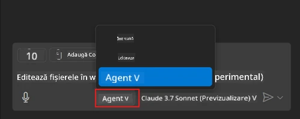
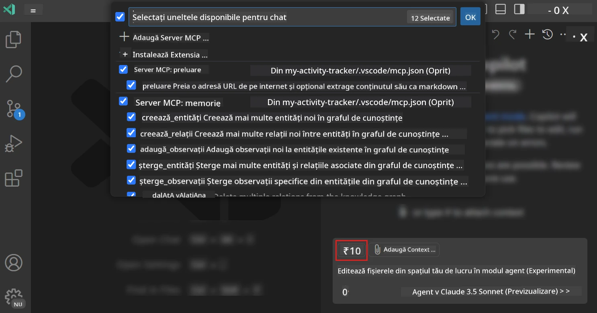
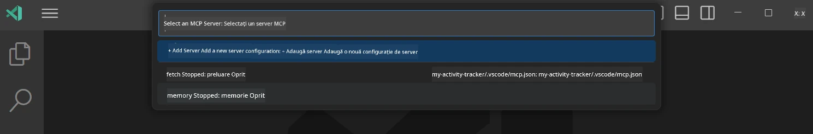
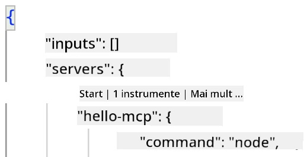
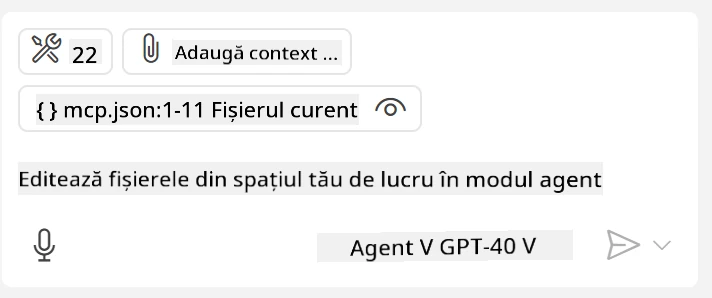
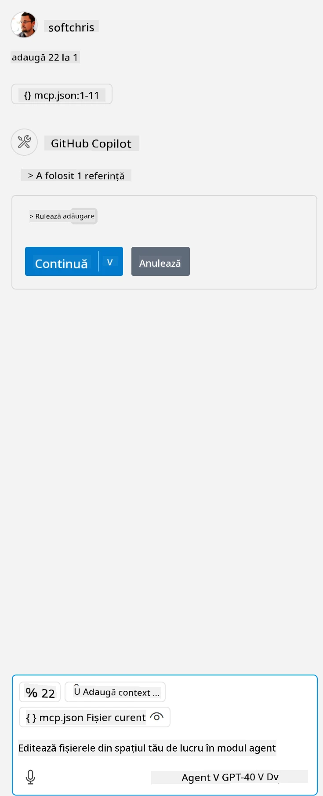

# Consumarea unui server din modul GitHub Copilot Agent

Visual Studio Code și GitHub Copilot pot acționa ca un client și pot consuma un Server MCP. Te-ai putea întreba de ce am vrea să facem asta? Ei bine, asta înseamnă că orice funcționalități are Serverul MCP pot fi acum folosite din interiorul IDE-ului tău. Imaginează-ți că adaugi, de exemplu, serverul MCP de la GitHub, acest lucru ar permite controlul GitHub-ului prin prompturi în loc să tastezi comenzi specifice în terminal. Sau imaginează-ți orice în general care ar putea îmbunătăți experiența ta de dezvoltator, totul controlat prin limbaj natural. Acum începi să vezi avantajul, nu?

## Prezentare generală

Această lecție acoperă cum să folosești Visual Studio Code și modul Agent al GitHub Copilot ca un client pentru Serverul tău MCP.

## Obiective de învățare

La sfârșitul acestei lecții, vei putea să:

- Consumi un Server MCP prin Visual Studio Code.
- Rulezi capabilități precum unelte prin GitHub Copilot.
- Configurezi Visual Studio Code pentru a găsi și gestiona Serverul tău MCP.

## Utilizare

Poți controla serverul MCP în două moduri diferite:

- Interfață utilizator, vei vedea mai târziu în acest capitol cum se face asta.
- Terminal, este posibil să controlezi lucrurile din terminal folosind executabilul `code`:

  Pentru a adăuga un server MCP la profilul tău de utilizator, folosește opțiunea liniei de comandă --add-mcp și oferă configurația serverului în format JSON sub forma {\"name\":\"server-name\",\"command\":...}.

  ```
  code --add-mcp "{\"name\":\"my-server\",\"command\": \"uvx\",\"args\": [\"mcp-server-fetch\"]}"
  ```

### Capturi de ecran





Hai să vorbim mai mult despre cum folosim interfața vizuală în secțiunile următoare.

## Abordare

Iată cum trebuie să abordăm acest lucru la un nivel general:

- Configurăm un fișier pentru a găsi Serverul nostru MCP.
- Pornim/Ne conectăm la serverul respectiv pentru a lista capabilitățile sale.
- Folosim aceste capabilități prin interfața GitHub Copilot Chat.

Grozav, acum că înțelegem fluxul, hai să încercăm să folosim un Server MCP prin Visual Studio Code printr-un exercițiu.

## Exercițiu: Consumarea unui server

În acest exercițiu, vom configura Visual Studio Code să găsească serverul tău MCP astfel încât să poată fi folosit din interfața GitHub Copilot Chat.

### -0- Pas preliminar, activează descoperirea serverului MCP

Este posibil să fie nevoie să activezi descoperirea Serverelor MCP.

1. Du-te la `File -> Preferences -> Settings` în Visual Studio Code.

1. Caută „MCP” și activează `chat.mcp.discovery.enabled` în fișierul settings.json.

### -1- Creează fișierul de configurare

Începe prin a crea un fișier de configurare în rădăcina proiectului tău, ai nevoie de un fișier numit MCP.json pe care să îl plasezi într-un folder numit .vscode. Ar trebui să arate astfel:

```text
.vscode
|-- mcp.json
```

Apoi, să vedem cum putem adăuga o intrare la server.

### -2- Configurează un server

Adaugă următorul conținut în *mcp.json*:

```json
{
    "inputs": [],
    "servers": {
       "hello-mcp": {
           "command": "node",
           "args": [
               "build/index.js"
           ]
       }
    }
}
```

Mai sus este un exemplu simplu despre cum să pornești un server scris în Node.js, pentru alte runtime-uri specifică comanda corectă pentru a porni serverul folosind `command` și `args`.

### -3- Pornește serverul

Acum că ai adăugat o intrare, să pornim serverul:

1. Găsește intrarea ta în *mcp.json* și asigură-te că vezi pictograma „play”:

    

1. Apasă pictograma „play”, ar trebui să vezi că pictograma pentru unelte în GitHub Copilot Chat crește numărul de unelte disponibile. Dacă apeși pe această pictogramă, vei vedea o listă cu uneltele înregistrate. Poți bifa/debifa fiecare unealtă în funcție de faptul dacă dorești ca GitHub Copilot să le folosească ca context:

  

1. Pentru a rula o unealtă, tastează un prompt pe care știi că se potrivește cu descrierea uneia dintre uneltele tale, de exemplu un prompt de genul „adauga 22 la 1”:

  

  Ar trebui să vezi un răspuns care spune 23.

## Temă

Încearcă să adaugi o intrare de server în fișierul *mcp.json* și asigură-te că poți porni/opri serverul. Asigură-te că poți comunica și cu uneltele de pe server prin interfața GitHub Copilot Chat.

## Soluție

[Soluție](./solution/README.md)

## Repere cheie

Reperele din acest capitol sunt următoarele:

- Visual Studio Code este un client excelent care vă permite să consumați mai multe servere MCP și uneltele lor.
- Interfața GitHub Copilot Chat este modul în care interacționezi cu serverele.
- Poți solicita utilizatorului să introducă date precum chei API care pot fi transmise Serverului MCP la configurarea intrării serverului în fișierul *mcp.json*.

## Exemple

- [Calculator Java](../samples/java/calculator/README.md)
- [Calculator .Net](../../../../03-GettingStarted/samples/csharp)
- [Calculator JavaScript](../samples/javascript/README.md)
- [Calculator TypeScript](../samples/typescript/README.md)
- [Calculator Python](../../../../03-GettingStarted/samples/python)

## Resurse suplimentare

- [Documentație Visual Studio](https://code.visualstudio.com/docs/copilot/chat/mcp-servers)

## Ce urmează

- Următorul: [Crearea unui Server stdio](../05-stdio-server/README.md)

---

<!-- CO-OP TRANSLATOR DISCLAIMER START -->
**Declinare a responsabilității**:
Acest document a fost tradus folosind serviciul de traducere AI [Co-op Translator](https://github.com/Azure/co-op-translator). În timp ce ne străduim pentru acuratețe, vă rugăm să rețineți că traducerile automate pot conține erori sau inexactități. Documentul original în limba sa nativă trebuie considerat sursa autorizată. Pentru informații critice, se recomandă traducerea profesională realizată de un om. Nu ne asumăm responsabilitatea pentru eventualele neînțelegeri sau interpretări greșite care decurg din utilizarea acestei traduceri.
<!-- CO-OP TRANSLATOR DISCLAIMER END -->