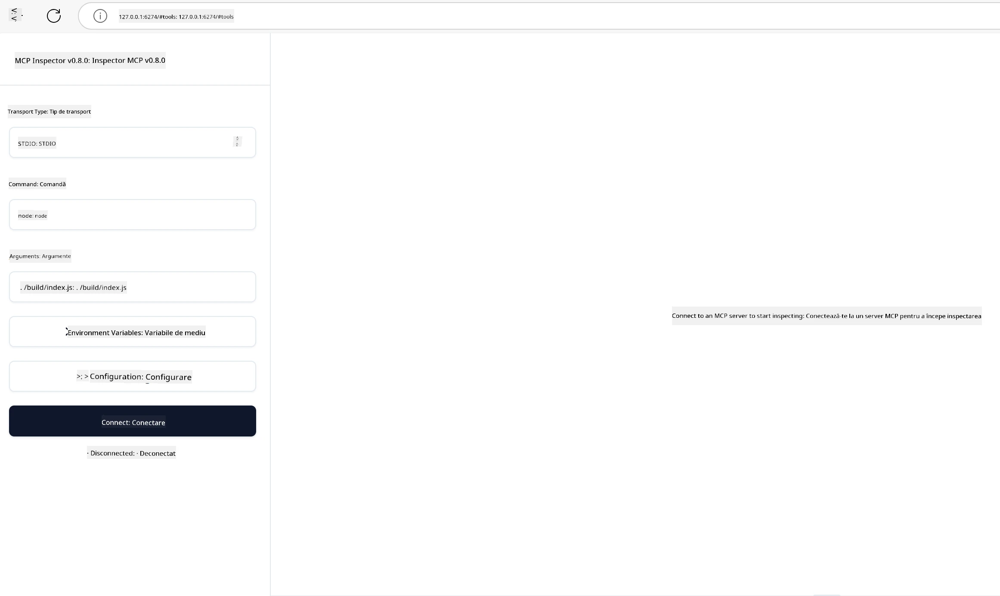

## Testare și depanare

Înainte de a începe testarea serverului tău MCP, este important să înțelegi instrumentele disponibile și cele mai bune practici pentru depanare. Testarea eficientă asigură că serverul tău funcționează conform așteptărilor și te ajută să identifici și să rezolvi rapid problemele. Secțiunea următoare descrie abordările recomandate pentru validarea implementării MCP.

## Prezentare generală

Această lecție acoperă modul de alegere a metodei potrivite de testare și cel mai eficient instrument de testare.

## Obiectivele de învățare

La finalul acestei lecții, vei putea:

- Descrie diverse abordări pentru testare.
- Utiliza diferite instrumente pentru a testa codul eficient.


## Testarea serverelor MCP

MCP oferă instrumente care te ajută să testezi și să depanezi serverele:

- **MCP Inspector**: Un instrument de linie de comandă care poate fi folosit atât ca CLI, cât și ca unealtă vizuală.
- **Testare manuală**: Poți folosi un instrument ca curl pentru a rula cereri web, însă orice instrument capabil să folosească HTTP este potrivit.
- **Testare unitară**: Este posibil să folosești cadrul tău de testare preferat pentru a testa funcționalitățile atât ale serverului, cât și ale clientului.

### Folosind MCP Inspector

Am descris utilizarea acestui instrument în lecțiile anterioare, dar să discutăm puțin despre el la nivel general. Este un instrument construit în Node.js și îl poți folosi apelând executabilul `npx` care va descărca și instala temporar instrumentul și se va curăța după ce îți termină cererea.

[MCP Inspector](https://github.com/modelcontextprotocol/inspector) te ajută să:

- **Descoperi funcționalitățile serverului**: Detectează automat resursele, instrumentele și prompturile disponibile
- **Testezi execuția instrumentelor**: Încearcă diferiți parametri și vezi răspunsurile în timp real
- **Vizualizezi metadatele serverului**: Examinează informațiile serverului, schemele și configurațiile

O rulare tipică a instrumentului arată astfel:

```bash
npx @modelcontextprotocol/inspector node build/index.js
```

Comanda de mai sus pornește un MCP și interfața sa vizuală și lansează o interfață web locală în browserul tău. Te poți aștepta să vezi un panou care afișează serverele MCP înregistrate, instrumentele lor disponibile, resursele și prompturile. Interfața îți permite să testezi interactiv execuția instrumentelor, să inspectezi metadatele serverului și să vizualizezi răspunsuri în timp real, facilitând validarea și depanarea implementărilor serverului MCP.

Iată cum poate arăta: 

Poți rula acest instrument și în modul CLI, caz în care adaugi atributul `--cli`. Iată un exemplu de rulare a instrumentului în modul „CLI” care listează toate instrumentele de pe server:

```sh
npx @modelcontextprotocol/inspector --cli node build/index.js --method tools/list
```

### Testare manuală

Pe lângă rularea instrumentului inspector pentru testarea funcționalităților serverului, o altă abordare similară este rularea unui client capabil să folosească HTTP, precum curl.

Cu curl, poți testa serverele MCP direct prin cereri HTTP:

```bash
# Exemplu: Metadate ale serverului de test
curl http://localhost:3000/v1/metadata

# Exemplu: Execută un instrument
curl -X POST http://localhost:3000/v1/tools/execute \
  -H "Content-Type: application/json" \
  -d '{"name": "calculator", "parameters": {"expression": "2+2"}}'
```

După cum poți vedea din utilizarea de mai sus a curl, folosești o cerere POST pentru a invoca un instrument folosind un payload care constă în numele instrumentului și parametrii săi. Folosește abordarea care ți se potrivește cel mai bine. Instrumentele CLI, în general, tind să fie mai rapide și permit scriptarea, ceea ce poate fi util într-un mediu CI/CD.

### Testare unitară

Creează teste unitare pentru instrumentele și resursele tale pentru a te asigura că funcționează conform așteptărilor. Iată un exemplu de cod de testare.

```python
import pytest

from mcp.server.fastmcp import FastMCP
from mcp.shared.memory import (
    create_connected_server_and_client_session as create_session,
)

# Marchează întregul modul pentru teste asincrone
pytestmark = pytest.mark.anyio


async def test_list_tools_cursor_parameter():
    """Test that the cursor parameter is accepted for list_tools.

    Note: FastMCP doesn't currently implement pagination, so this test
    only verifies that the cursor parameter is accepted by the client.
    """

 server = FastMCP("test")

    # Creează câteva instrumente de testare
    @server.tool(name="test_tool_1")
    async def test_tool_1() -> str:
        """First test tool"""
        return "Result 1"

    @server.tool(name="test_tool_2")
    async def test_tool_2() -> str:
        """Second test tool"""
        return "Result 2"

    async with create_session(server._mcp_server) as client_session:
        # Test fără parametru cursor (omis)
        result1 = await client_session.list_tools()
        assert len(result1.tools) == 2

        # Test cu cursor=None
        result2 = await client_session.list_tools(cursor=None)
        assert len(result2.tools) == 2

        # Test cu cursor ca șir de caractere
        result3 = await client_session.list_tools(cursor="some_cursor_value")
        assert len(result3.tools) == 2

        # Test cu cursor ca șir gol
        result4 = await client_session.list_tools(cursor="")
        assert len(result4.tools) == 2
    
```

Codul precedent face următoarele:

- Folosește cadrul pytest care îți permite să creezi teste ca funcții și să folosești afirmații assert.
- Creează un server MCP cu două instrumente diferite.
- Folosește instrucțiunea `assert` pentru a verifica dacă anumite condiții sunt îndeplinite.

Aruncă o privire pe [fișierul complet aici](https://github.com/modelcontextprotocol/python-sdk/blob/main/tests/client/test_list_methods_cursor.py)

Având acest fișier, poți testa propriul server pentru a te asigura că funcționalitățile sunt create corespunzător.

Toate SDK-urile principale au secțiuni similare de testare, astfel că le poți adapta la mediul tău de rulare.

## Exemple

- [Java Calculator](../samples/java/calculator/README.md)
- [.Net Calculator](../../../../03-GettingStarted/samples/csharp)
- [JavaScript Calculator](../samples/javascript/README.md)
- [TypeScript Calculator](../samples/typescript/README.md)
- [Python Calculator](../../../../03-GettingStarted/samples/python) 

## Resurse suplimentare

- [Python SDK](https://github.com/modelcontextprotocol/python-sdk)

## Următorul pas

- Următorul: [Deployment](../09-deployment/README.md)

---

<!-- CO-OP TRANSLATOR DISCLAIMER START -->
**Declinare de responsabilitate**:  
Acest document a fost tradus utilizând serviciul de traducere AI [Co-op Translator](https://github.com/Azure/co-op-translator). Deși ne străduim pentru acuratețe, vă rugăm să rețineți că traducerile automate pot conține erori sau inexactități. Documentul original în limba sa nativă trebuie considerat sursa autorizată. Pentru informații critice, se recomandă traducerea profesională realizată de un traducător uman. Nu ne asumăm răspunderea pentru eventualele neînțelegeri sau interpretări greșite care pot apărea din utilizarea acestei traduceri.
<!-- CO-OP TRANSLATOR DISCLAIMER END -->