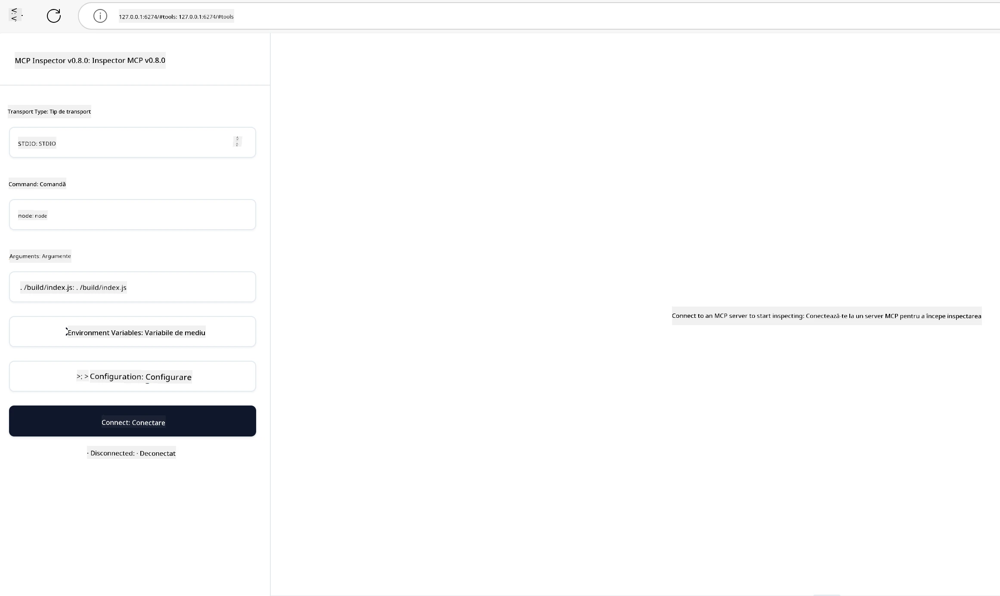

## Testare și depanare

Înainte de a începe să testezi serverul MCP, este important să înțelegi instrumentele disponibile și cele mai bune practici pentru depanare. Testarea eficientă asigură că serverul tău se comportă conform așteptărilor și te ajută să identifici și să rezolvi rapid problemele. Secțiunea următoare prezintă abordările recomandate pentru validarea implementării MCP.

## Prezentare generală

Această lecție acoperă cum să selectezi abordarea potrivită pentru testare și cel mai eficient instrument de testare.

## Obiective de învățare

La sfârșitul acestei lecții, vei fi capabil să:

- Descrii diverse abordări pentru testare.
- Folosești diverse instrumente pentru a testa codul eficient.


## Testarea serverelor MCP

MCP oferă instrumente care te ajută să testezi și să depanezi serverele:

- **MCP Inspector**: Un instrument în linie de comandă care poate fi folosit atât ca instrument CLI, cât și ca instrument vizual.
- **Testare manuală**: Poți folosi un instrument precum curl pentru a efectua cereri web, dar orice instrument capabil să ruleze HTTP este potrivit.
- **Testare unitară**: Este posibil să folosești cadrul tău de testare preferat pentru a testa funcționalitățile atât ale serverului, cât și ale clientului.

### Folosind MCP Inspector

Am descris utilizarea acestui instrument în lecții anterioare, dar să discutăm puțin la un nivel înalt. Este un instrument construit în Node.js și îl poți folosi apelând executabilul `npx` care va descărca și instala temporar instrumentul și îl va curăța după ce și-a terminat cererea.

[MCP Inspector](https://github.com/modelcontextprotocol/inspector) te ajută să:

- **Descoperi capacitățile serverului**: Detectează automat resursele disponibile, instrumentele și prompturile
- **Testezi execuția instrumentelor**: Încearcă parametri diferiți și vezi răspunsurile în timp real
- **Vizualizezi metadatele serverului**: Examinează informațiile serverului, schemele și configurațiile

O rulare tipică a instrumentului arată astfel:

```bash
npx @modelcontextprotocol/inspector node build/index.js
```

Comanda de mai sus pornește un MCP și interfața sa vizuală și lansează o interfață web locală în browser-ul tău. Te poți aștepta să vezi un panou de control care afișează serverele MCP înregistrate, instrumentele lor disponibile, resursele și prompturile. Interfața îți permite să testezi interactiv execuția instrumentelor, să inspectezi metadatele serverului și să vizualizezi răspunsurile în timp real, făcând mai ușoară validarea și depanarea implementărilor serverului MCP.

Iată cum poate arăta: 

De asemenea, poți rula acest instrument în modul CLI, caz în care adaugi atributul `--cli`. Iată un exemplu de rulare a instrumentului în modul "CLI" care listează toate instrumentele pe server:

```sh
npx @modelcontextprotocol/inspector --cli node build/index.js --method tools/list
```

### Testare manuală

Pe lângă rularea instrumentului inspector pentru a testa capacitățile serverului, o altă abordare similară este rularea unui client capabil să folosească HTTP, cum ar fi curl.

Cu curl, poți testa serverele MCP direct folosind cereri HTTP:

```bash
# Exemplu: Metadatele serverului de test
curl http://localhost:3000/v1/metadata

# Exemplu: Execută un instrument
curl -X POST http://localhost:3000/v1/tools/execute \
  -H "Content-Type: application/json" \
  -d '{"name": "calculator", "parameters": {"expression": "2+2"}}'
```

După cum vezi din exemplul de mai sus cu curl, folosești o cerere POST pentru a invoca un instrument folosind o încărcătură care conține numele instrumentului și parametrii săi. Folosește abordarea care ți se potrivește cel mai bine. În general, instrumentele CLI sunt mai rapide în utilizare și permit să fie scriptate, ceea ce poate fi util într-un mediu CI/CD.

### Testare unitară

Creează teste unitare pentru instrumentele și resursele tale pentru a te asigura că funcționează conform așteptărilor. Iată un exemplu de cod de testare.

```python
import pytest

from mcp.server.fastmcp import FastMCP
from mcp.shared.memory import (
    create_connected_server_and_client_session as create_session,
)

# Marchează întregul modul pentru teste asincrone
pytestmark = pytest.mark.anyio


async def test_list_tools_cursor_parameter():
    """Test that the cursor parameter is accepted for list_tools.

    Note: FastMCP doesn't currently implement pagination, so this test
    only verifies that the cursor parameter is accepted by the client.
    """

 server = FastMCP("test")

    # Creează câteva unelte de testare
    @server.tool(name="test_tool_1")
    async def test_tool_1() -> str:
        """First test tool"""
        return "Result 1"

    @server.tool(name="test_tool_2")
    async def test_tool_2() -> str:
        """Second test tool"""
        return "Result 2"

    async with create_session(server._mcp_server) as client_session:
        # Testează fără parametrul cursor (omiterea)
        result1 = await client_session.list_tools()
        assert len(result1.tools) == 2

        # Testează cu cursor=None
        result2 = await client_session.list_tools(cursor=None)
        assert len(result2.tools) == 2

        # Testează cu cursor ca șir de caractere
        result3 = await client_session.list_tools(cursor="some_cursor_value")
        assert len(result3.tools) == 2

        # Testează cu cursor ca șir gol
        result4 = await client_session.list_tools(cursor="")
        assert len(result4.tools) == 2
    
```

Codul de mai sus face următoarele:

- Utilizează cadrul pytest care îți permite să creezi teste ca funcții și să folosești declarații assert.
- Creează un Server MCP cu două instrumente diferite.
- Folosește declarația `assert` pentru a verifica că anumite condiții sunt îndeplinite.

Aruncă o privire la [fișierul complet aici](https://github.com/modelcontextprotocol/python-sdk/blob/main/tests/client/test_list_methods_cursor.py)

Având fișierul de mai sus, poți testa propriul tău server pentru a te asigura că capacitățile sunt create corect.

Toate SDK-urile majore au secțiuni similare de testare, așa că poți să te adaptezi la mediul tău de execuție ales.

## Exemple

- [Calculator Java](../samples/java/calculator/README.md)
- [Calculator .Net](../../../../03-GettingStarted/samples/csharp)
- [Calculator JavaScript](../samples/javascript/README.md)
- [Calculator TypeScript](../samples/typescript/README.md)
- [Calculator Python](../../../../03-GettingStarted/samples/python)

## Resurse suplimentare

- [Python SDK](https://github.com/modelcontextprotocol/python-sdk)

## Ce urmează

- Următorul: [Implementare](../09-deployment/README.md)

---

<!-- CO-OP TRANSLATOR DISCLAIMER START -->
**Declinare a responsabilității**:
Acest document a fost tradus folosind serviciul de traducere AI [Co-op Translator](https://github.com/Azure/co-op-translator). În timp ce ne străduim pentru acuratețe, vă rugăm să rețineți că traducerile automate pot conține erori sau inexactități. Documentul original în limba sa nativă trebuie considerat sursa autorizată. Pentru informații critice, se recomandă traducerea profesională realizată de un om. Nu ne asumăm responsabilitatea pentru eventualele neînțelegeri sau interpretări greșite care decurg din utilizarea acestei traduceri.
<!-- CO-OP TRANSLATOR DISCLAIMER END -->