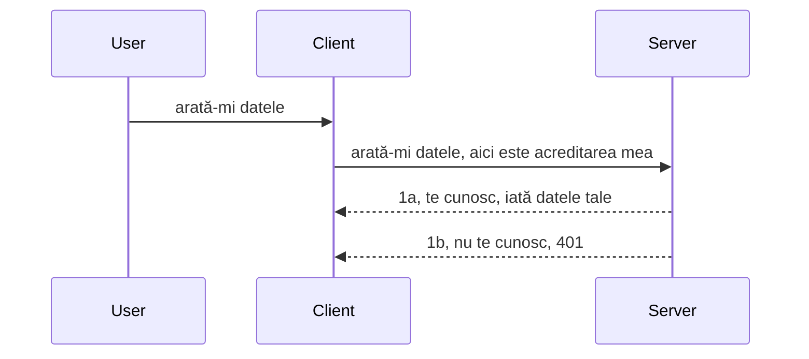

# Autentificare simplă

SDK-urile MCP suportă utilizarea OAuth 2.1, care, să fim corecți, este un proces destul de complex ce implică concepte precum server de autentificare, server de resurse, trimiterea de acreditări, obținerea unui cod, schimbarea codului pentru un token bearer până când în final poți accesa datele resursei. Dacă nu ești obișnuit cu OAuth, ceea ce este un lucru grozav de implementat, este o idee bună să începi cu un nivel de bază de autentificare și să avansezi spre o securitate din ce în ce mai bună. De aceea există acest capitol, pentru a te ajuta să ajungi la autentificarea mai avansată.

## Autentificare, ce înțelegem prin asta?

Autentificarea este prescurtarea pentru autentificare și autorizare. Ideea este că trebuie să facem două lucruri:

- **Autentificare**, care este procesul de a afla dacă lăsăm o persoană să intre în casa noastră, dacă are dreptul să fie „aici”, adică să aibă acces la serverul nostru de resurse unde funcțiile serverului MCP trăiesc.
- **Autorizare**, este procesul de a afla dacă un utilizator ar trebui să aibă acces la resursele specifice pentru care cere, de exemplu aceste comenzi sau aceste produse sau dacă i se permite să citească conținutul, dar nu să șteargă, ca alt exemplu.

## Acreditări: cum îi spunem sistemului cine suntem

Ei bine, majoritatea dezvoltatorilor web încep să se gândească în termeni de a oferi o acreditare serverului, de obicei un secret care spune dacă au voie să fie aici „Autentificare”. Această acreditare este de obicei o versiune codificată în base64 a numelui de utilizator și parolei sau o cheie API care identifică unic un utilizator specific.

Acest lucru implică trimiterea printr-un header numit "Authorization" astfel:

```json
{ "Authorization": "secret123" }
```

Acesta este de obicei denumit autentificare basică. Modul în care funcționează fluxul general este următorul:


Acum că înțelegem cum funcționează din punct de vedere al fluxului, cum îl implementăm? Ei bine, majoritatea serverelor web au un concept numit middleware, o bucată de cod care rulează ca parte a cererii și poate verifica acreditările, iar dacă acreditările sunt valide poate lăsa cererea să treacă. Dacă cererea nu are acreditări valide, vei primi o eroare de autentificare. Hai să vedem cum poate fi implementat acest lucru:

**Python**

```python
class AuthMiddleware(BaseHTTPMiddleware):
    async def dispatch(self, request, call_next):

        has_header = request.headers.get("Authorization")
        if not has_header:
            print("-> Missing Authorization header!")
            return Response(status_code=401, content="Unauthorized")

        if not valid_token(has_header):
            print("-> Invalid token!")
            return Response(status_code=403, content="Forbidden")

        print("Valid token, proceeding...")
       
        response = await call_next(request)
        # adaugă orice antete pentru client sau modifică în vreun fel răspunsul
        return response


starlette_app.add_middleware(CustomHeaderMiddleware)
```

Aici avem:

- Creat un middleware numit `AuthMiddleware` unde metoda sa `dispatch` este invocată de serverul web.
- Adăugat middleware-ul la serverul web:

    ```python
    starlette_app.add_middleware(AuthMiddleware)
    ```

- Scris logica de validare care verifică dacă header-ul Authorization este prezent și dacă secretul trimis este valid:

    ```python
    has_header = request.headers.get("Authorization")
    if not has_header:
        print("-> Missing Authorization header!")
        return Response(status_code=401, content="Unauthorized")

    if not valid_token(has_header):
        print("-> Invalid token!")
        return Response(status_code=403, content="Forbidden")
    ```

    dacă secretul este prezent și valid, atunci lăsăm cererea să treacă apelând `call_next` și returnăm răspunsul.

    ```python
    response = await call_next(request)
    # adaugă orice anteturi pentru client sau modifică răspunsul într-un fel
    return response
    ```

Cum funcționează este că dacă o cerere web este făcută către server, middleware-ul va fi invocat și, având implementarea sa, fie va lăsa cererea să treacă, fie va returna o eroare care indică faptul că clientul nu are voie să continue.

**TypeScript**

Aici creăm un middleware cu framework-ul popular Express și interceptăm cererea înainte să ajungă la MCP Server. Iată codul pentru asta:

```typescript
function isValid(secret) {
    return secret === "secret123";
}

app.use((req, res, next) => {
    // 1. Headerul de autorizare este prezent?
    if(!req.headers["Authorization"]) {
        res.status(401).send('Unauthorized');
    }
    
    let token = req.headers["Authorization"];

    // 2. Verifică validitatea.
    if(!isValid(token)) {
        res.status(403).send('Forbidden');
    }

   
    console.log('Middleware executed');
    // 3. Trimite cererea la următorul pas din fluxul de cereri.
    next();
});
```

În acest cod:

1. Verificăm dacă header-ul Authorization este prezent, dacă nu, trimitem o eroare 401.
2. Asigurăm că acreditarea/tokenul este valid, dacă nu, trimitem o eroare 403.
3. În final, trecem cererea mai departe în pipeline-ul de cereri și returnăm resursa cerută.

## Exercițiu: Implementează autentificarea

Hai să ne folosim cunoștințele și să încercăm să implementăm asta. Planul este:

Server

- Crează un server web și o instanță MCP.
- Implementează un middleware pentru server.

Client

- Trimite cerere web, cu acreditare, prin header.

### -1- Crează un server web și o instanță MCP

În primul pas, trebuie să creăm instanța serverului web și MCP Server.

**Python**

Aici creăm o instanță MCP server, creăm o aplicație web starlette și o găzduim cu uvicorn.

```python
# crearea serverului MCP

app = FastMCP(
    name="MCP Resource Server",
    instructions="Resource Server that validates tokens via Authorization Server introspection",
    host=settings["host"],
    port=settings["port"],
    debug=True
)

# crearea aplicației web starlette
starlette_app = app.streamable_http_app()

# servirea aplicației prin uvicorn
async def run(starlette_app):
    import uvicorn
    config = uvicorn.Config(
            starlette_app,
            host=app.settings.host,
            port=app.settings.port,
            log_level=app.settings.log_level.lower(),
        )
    server = uvicorn.Server(config)
    await server.serve()

run(starlette_app)
```

În acest cod:

- Creăm MCP Server.
- Construim aplicația web starlette din MCP Server, `app.streamable_http_app()`.
- Găzduim și servim aplicația web folosind uvicorn `server.serve()`.

**TypeScript**

Aici creăm o instanță MCP Server.

```typescript
const server = new McpServer({
      name: "example-server",
      version: "1.0.0"
    });

    // ... configurează resursele serverului, instrumentele și mesajele ...
```

Această creare a MCP Server trebuie să se întâmple în definiția rutei POST /mcp, așa că hai să luăm codul de mai sus și să îl mutăm astfel:

```typescript
import express from "express";
import { randomUUID } from "node:crypto";
import { McpServer } from "@modelcontextprotocol/sdk/server/mcp.js";
import { StreamableHTTPServerTransport } from "@modelcontextprotocol/sdk/server/streamableHttp.js";
import { isInitializeRequest } from "@modelcontextprotocol/sdk/types.js"

const app = express();
app.use(express.json());

// Hartă pentru a stoca transporturile după ID-ul sesiunii
const transports: { [sessionId: string]: StreamableHTTPServerTransport } = {};

// Gestionează cererile POST pentru comunicarea client-server
app.post('/mcp', async (req, res) => {
  // Verifică dacă există un ID de sesiune
  const sessionId = req.headers['mcp-session-id'] as string | undefined;
  let transport: StreamableHTTPServerTransport;

  if (sessionId && transports[sessionId]) {
    // Reutilizează transportul existent
    transport = transports[sessionId];
  } else if (!sessionId && isInitializeRequest(req.body)) {
    // Cerere nouă de inițializare
    transport = new StreamableHTTPServerTransport({
      sessionIdGenerator: () => randomUUID(),
      onsessioninitialized: (sessionId) => {
        // Stochează transportul după ID-ul sesiunii
        transports[sessionId] = transport;
      },
      // Protecția împotriva rebinding-ului DNS este dezactivată implicit pentru compatibilitate inversă. Dacă rulați acest server
      // local, asigurați-vă că setați:
      // enableDnsRebindingProtection: true,
      // allowedHosts: ['127.0.0.1'],
    });

    // Curăță transportul când este închis
    transport.onclose = () => {
      if (transport.sessionId) {
        delete transports[transport.sessionId];
      }
    };
    const server = new McpServer({
      name: "example-server",
      version: "1.0.0"
    });

    // ... configurează resursele serverului, instrumentele și prompturile ...

    // Conectează-te la serverul MCP
    await server.connect(transport);
  } else {
    // Cerere invalidă
    res.status(400).json({
      jsonrpc: '2.0',
      error: {
        code: -32000,
        message: 'Bad Request: No valid session ID provided',
      },
      id: null,
    });
    return;
  }

  // Gestionează cererea
  await transport.handleRequest(req, res, req.body);
});

// Handler reutilizabil pentru cererile GET și DELETE
const handleSessionRequest = async (req: express.Request, res: express.Response) => {
  const sessionId = req.headers['mcp-session-id'] as string | undefined;
  if (!sessionId || !transports[sessionId]) {
    res.status(400).send('Invalid or missing session ID');
    return;
  }
  
  const transport = transports[sessionId];
  await transport.handleRequest(req, res);
};

// Gestionează cererile GET pentru notificările server-către-client prin SSE
app.get('/mcp', handleSessionRequest);

// Gestionează cererile DELETE pentru terminarea sesiunii
app.delete('/mcp', handleSessionRequest);

app.listen(3000);
```

Acum vezi cum crearea MCP Server a fost mutată în interiorul `app.post("/mcp")`.

Să trecem la pasul următor de creare a middleware-ului pentru a putea valida acreditarea primită.

### -2- Implementează un middleware pentru server

Să trecem la partea de middleware. Aici vom crea un middleware care caută o acreditare în header-ul `Authorization` și o validează. Dacă e acceptabilă, atunci cererea va continua să facă ce trebuie (ex: lista de unelte, citirea unei resurse sau orice funcționalitate MCP cerută de client).

**Python**

Pentru a crea middleware-ul, trebuie să creăm o clasă care să moștenească `BaseHTTPMiddleware`. Sunt două părți interesante:

- Cererea `request`, din care citim informațiile din header.
- `call_next`, callback-ul pe care trebuie să-l invocăm dacă clientul ne-a adus o acreditare pe care o acceptăm.

Mai întâi, trebuie să gestionăm cazul în care header-ul `Authorization` lipsește:

```python
has_header = request.headers.get("Authorization")

# nu există antet, eșuează cu 401, altfel continuă.
if not has_header:
    print("-> Missing Authorization header!")
    return Response(status_code=401, content="Unauthorized")
```

Aici trimitem un mesaj 401 unauthorized deoarece clientul nu reușește autentificarea.

Apoi, dacă o acreditare a fost transmisă, trebuie să-i verificăm valabilitatea astfel:

```python
 if not valid_token(has_header):
    print("-> Invalid token!")
    return Response(status_code=403, content="Forbidden")
```

Observă cum trimitem un mesaj 403 forbidden deasupra. Hai să vedem middleware-ul complet implementând tot ce am menționat mai sus:

```python
class AuthMiddleware(BaseHTTPMiddleware):
    async def dispatch(self, request, call_next):

        has_header = request.headers.get("Authorization")
        if not has_header:
            print("-> Missing Authorization header!")
            return Response(status_code=401, content="Unauthorized")

        if not valid_token(has_header):
            print("-> Invalid token!")
            return Response(status_code=403, content="Forbidden")

        print("Valid token, proceeding...")
        print(f"-> Received {request.method} {request.url}")
        response = await call_next(request)
        response.headers['Custom'] = 'Example'
        return response

```

Groza, dar ce este funcția `valid_token`? Iat-o mai jos:

```python
# NU folosiți pentru producție - îmbunătățiți-l !!
def valid_token(token: str) -> bool:
    # eliminați prefixul "Bearer "
    if token.startswith("Bearer "):
        token = token[7:]
        return token == "secret-token"
    return False
```

Asta evident trebuie îmbunătățit.

IMPORTANT: Niciodată nu ar trebui să ai secrete astfel în cod. Ideal ar fi să preiei valoarea de comparat dintr-o sursă de date sau de la un IDP (furnizor de servicii de identitate) sau și mai bine, să lași IDP-ul să facă validarea.

**TypeScript**

Pentru a implementa asta cu Express, trebuie să apelăm metoda `use` care ia funcții middleware.

Trebuie să:

- Interacționăm cu variabila cererii pentru a verifica acreditarea transmisă în proprietatea `Authorization`.
- Validăm acreditarea și, dacă este validă, lăsăm cererea să continue și cererea MCP a clientului să facă ce trebuie (ex: lista de unelte, citirea unei resurse sau orice altceva legat de MCP).

Aici verificăm dacă header-ul `Authorization` este prezent și dacă nu, oprim cererea să treacă:

```typescript
if(!req.headers["authorization"]) {
    res.status(401).send('Unauthorized');
    return;
}
```

Dacă header-ul nu este trimis deloc, primești un 401.

În continuare, verificăm dacă acreditarea este validă, dacă nu, iarăși oprim cererea, dar cu un mesaj puțin diferit:

```typescript
if(!isValid(token)) {
    res.status(403).send('Forbidden');
    return;
} 
```

Observă cum acum primești o eroare 403.

Iată codul complet:

```typescript
app.use((req, res, next) => {
    console.log('Request received:', req.method, req.url, req.headers);
    console.log('Headers:', req.headers["authorization"]);
    if(!req.headers["authorization"]) {
        res.status(401).send('Unauthorized');
        return;
    }
    
    let token = req.headers["authorization"];

    if(!isValid(token)) {
        res.status(403).send('Forbidden');
        return;
    }  

    console.log('Middleware executed');
    next();
});
```

Am configurat serverul web să accepte un middleware care să verifice acreditarea pe care clientul sperăm să ne-o trimită. Dar cum rămâne cu clientul în sine?

### -3- Trimite cerere web cu acreditare prin header

Trebuie să ne asigurăm că clientul trimite acreditarea prin header. Cum vom folosi un client MCP, trebuie să aflăm cum se face asta.

**Python**

Pentru client, trebuie să trimitem un header cu acreditarea astfel:

```python
# NU codifica valoarea direct, păstreaz-o cel puțin într-o variabilă de mediu sau într-un depozit mai sigur
token = "secret-token"

async with streamablehttp_client(
        url = f"http://localhost:{port}/mcp",
        headers = {"Authorization": f"Bearer {token}"}
    ) as (
        read_stream,
        write_stream,
        session_callback,
    ):
        async with ClientSession(
            read_stream,
            write_stream
        ) as session:
            await session.initialize()
      
            # TODO, ce dorești să se facă în client, de ex. listarea uneltelor, apelarea uneltelor etc.
```

Observă cum completăm proprietatea `headers` astfel: ` headers = {"Authorization": f"Bearer {token}"}`.

**TypeScript**

Putem rezolva asta în doi pași:

1. Completăm un obiect de configurare cu acreditarea noastră.
2. Transmitem obiectul de configurare către transport.

```typescript

// NU codifica valoarea direct așa cum este prezentat aici. Cel puțin păstreaz-o ca o variabilă de mediu și folosește ceva de genul dotenv (în modul de dezvoltare).
let token = "secret123"

// definește un obiect de opțiuni pentru transportul clientului
let options: StreamableHTTPClientTransportOptions = {
  sessionId: sessionId,
  requestInit: {
    headers: {
      "Authorization": "secret123"
    }
  }
};

// transmite obiectul de opțiuni către transport
async function main() {
   const transport = new StreamableHTTPClientTransport(
      new URL(serverUrl),
      options
   );
```

Aici vezi cum am fost nevoiți să creăm un obiect `options` și să plasăm headerele sub proprietatea `requestInit`.

IMPORTANT: Cum îmbunătățim asta de aici înainte? Ei bine, implementarea curentă are unele probleme. În primul rând, transmiterea unei acreditări astfel este destul de riscantă, cu excepția cazului în care ai cel puțin HTTPS. Chiar și atunci, acreditarea poate fi furată, așa că ai nevoie de un sistem în care să poți revoca tokenul ușor și să adaugi verificări suplimentare, cum ar fi de unde vine cererea, dacă cererea se întâmplă mult prea des (comportament de tip bot), pe scurt, există o întreagă listă de preocupări.

Totuși, trebuie spus că, pentru API-uri foarte simple unde nu vrei ca oricine să-ți apeleze API-ul fără autentificare, ceea ce avem aici este un început bun.

Cu toate acestea, să încercăm să întărim securitatea puțin folosind un format standardizat precum JSON Web Token, cunoscut și ca JWT sau „JOT”.

## JSON Web Tokens, JWT

Deci, încercăm să îmbunătățim lucrurile față de trimiterea de acreditări foarte simple. Care sunt îmbunătățirile imediate pe care le obținem adoptând JWT?

- **Îmbunătățiri de securitate**. În autentificarea basică, transmiți numele de utilizator și parola ca un token codificat în base64 (sau trimiți o cheie API) iar și iar, ceea ce crește riscul. Cu JWT, îți trimiți numele de utilizator și parola și primești un token în schimb, iar tokenul este limitat în timp, adică expiră. JWT îți permite controlul fin al accesului folosind roluri, scope-uri și permisiuni.
- **Statelessness și scalabilitate**. JWT-urile sunt autonome, conțin toate informațiile utilizatorului și elimină nevoia de stocare de sesiune pe server. Tokenul poate fi și validat local.
- **Interoperabilitate și federație**. JWT este central în Open ID Connect și este folosit cu furnizori cunoscuți de identitate precum Entra ID, Google Identity și Auth0. Permite de asemenea single sign-on și mult mai mult, făcându-l adecvat pentru nivel enterprise.
- **Modularitate și flexibilitate**. JWT-urile pot fi folosite și cu API Gateways precum Azure API Management, NGINX și altele. Susține scenarii de autentificare de utilizator și comunicație server-to-service inclusiv scenarii de impersonare și delegare.
- **Performanță și caching**. JWT-urile pot fi puse în cache după decodare, ceea ce reduce nevoia de parsare repetată. Acest lucru ajută în special aplicațiile cu trafic ridicat, îmbunătățind debitul și reducând încărcarea infrastructurii alese.
- **Funcționalități avansate**. Suportă și introspecție (verificarea valabilității pe server) și revocare (facând tokenul invalid).

Cu toate aceste beneficii, să vedem cum putem duce implementarea noastră la nivelul următor.

## Transformarea autentificării basic în JWT

Deci, schimbările pe care trebuie să le facem la nivel înalt sunt:

- **Să învățăm să construim un token JWT** și să îl pregătim pentru a fi trimis de client la server.
- **Să validăm un token JWT** și dacă este valid, să permitem clientului să acceseze resursele noastre.
- **Stocare securizată a tokenului**. Cum stocăm acest token.
- **Protejarea rutelor**. Trebuie să protejăm rutele, în cazul nostru, să protejăm rutele și funcționalitățile MCP specifice.
- **Adăugarea tokenurilor de refresh**. Să ne asigurăm că generăm token-uri cu viață scurtă, dar și token-uri de refresh cu viață lungă, care pot fi folosite pentru a obține token-uri noi dacă expiră. De asemenea, să existe un endpoint de refresh și o strategie de rotație.

### -1- Construiește un token JWT

În primul rând, un token JWT are următoarele părți:

- **header**, algoritmul folosit și tipul tokenului.
- **payload**, declarațiile, cum ar fi sub (utilizatorul sau entitatea pe care tokenul o reprezintă - într-un scenariu de autentificare acesta este de obicei userid), exp (când expiră), role (rolul)
- **semnătura**, semnată cu un secret sau o cheie privată.

Pentru asta, va trebui să construim header-ul, payload-ul și tokenul codificat.

**Python**

```python

import jwt
import jwt
from jwt.exceptions import ExpiredSignatureError, InvalidTokenError
import datetime

# Cheie secretă folosită pentru a semna JWT-ul
secret_key = 'your-secret-key'

header = {
    "alg": "HS256",
    "typ": "JWT"
}

# informațiile utilizatorului, revendicările sale și timpul de expirare
payload = {
    "sub": "1234567890",               # Subiect (ID utilizator)
    "name": "User Userson",                # Revendicare personalizată
    "admin": True,                     # Revendicare personalizată
    "iat": datetime.datetime.utcnow(),# Emis la
    "exp": datetime.datetime.utcnow() + datetime.timedelta(hours=1)  # Expirare
}

# codifică-l
encoded_jwt = jwt.encode(payload, secret_key, algorithm="HS256", headers=header)
```

În codul de mai sus am:

- Definit un header folosind algoritmul HS256 și tipul JWT.
- Construim un payload care conține un subiect sau user id, un nume de utilizator, un rol, când a fost emis și când expiră, implementând astfel aspectul limitat în timp menționat anterior.

**TypeScript**

Aici vom avea nevoie de niște dependențe care ne vor ajuta să construim token-ul JWT.

Dependențe

```sh

npm install jsonwebtoken
npm install --save-dev @types/jsonwebtoken
```

Acum că avem asta la locul său, hai să creăm header-ul, payload-ul și prin asta să generăm tokenul codificat.

```typescript
import jwt from 'jsonwebtoken';

const secretKey = 'your-secret-key'; // Folosește variabile de mediu în producție

// Definește payload-ul
const payload = {
  sub: '1234567890',
  name: 'User usersson',
  admin: true,
  iat: Math.floor(Date.now() / 1000), // Emitat la
  exp: Math.floor(Date.now() / 1000) + 60 * 60 // Expiră în 1 oră
};

// Definește antetul (opțional, jsonwebtoken setează valorile implicite)
const header = {
  alg: 'HS256',
  typ: 'JWT'
};

// Creează tokenul
const token = jwt.sign(payload, secretKey, {
  algorithm: 'HS256',
  header: header
});

console.log('JWT:', token);
```

Acest token este:

Semnat folosind HS256  
Valid o oră  
Include declarații precum sub, name, admin, iat și exp.

### -2- Validează un token

De asemenea, va trebui să validăm un token, lucru pe care ar trebui să-l facem pe server pentru a ne asigura că ceea ce clientul ne trimite este într-adevăr valid. Există multe verificări ce trebuie făcute aici, de la validarea structurii până la validitatea propriu-zisă. E recomandat să adaugi și alte verificări, precum dacă utilizatorul există în sistemul tău și altele.

Pentru a valida un token, trebuie să-l decodăm ca să-l putem citi și apoi să începem să verificăm validitatea:

**Python**

```python

# Decodează și verifică JWT-ul
try:
    decoded = jwt.decode(token, secret_key, algorithms=["HS256"])
    print("✅ Token is valid.")
    print("Decoded claims:")
    for key, value in decoded.items():
        print(f"  {key}: {value}")
except ExpiredSignatureError:
    print("❌ Token has expired.")
except InvalidTokenError as e:
    print(f"❌ Invalid token: {e}")

```

În acest cod, apelăm `jwt.decode` folosind tokenul, cheia secretă și algoritmul ales ca input. Observă cum folosim o construcție try-catch pentru că o validare eșuată duce la o eroare.

**TypeScript**

Aici trebuie să apelăm `jwt.verify` pentru a obține o versiune decodată a tokenului pe care o putem analiza mai departe. Dacă acest apel eșuează, înseamnă că structura tokenului nu este corectă sau nu mai este valid.

```typescript

try {
  const decoded = jwt.verify(token, secretKey);
  console.log('Decoded Payload:', decoded);
} catch (err) {
  console.error('Token verification failed:', err);
}
```

NOTĂ: așa cum s-a menționat anterior, ar trebui să efectuăm verificări suplimentare pentru a ne asigura că tokenul indică un utilizator din sistem și că utilizatorul are drepturile pe care le revendică.

În continuare, să privim controlul bazat pe roluri, cunoscut ca RBAC.
## Adăugarea controlului accesului bazat pe roluri

Ideea este că vrem să exprimăm că diferitele roluri au permisiuni diferite. De exemplu, presupunem că un administrator poate face totul, utilizatorii normali pot citi/scrie, iar un invitat poate doar să citescă. Prin urmare, iată câteva niveluri posibile de permisiuni:

- Admin.Write 
- User.Read
- Guest.Read

Să vedem cum putem implementa un astfel de control cu middleware. Middleware-urile pot fi adăugate per rută, precum și pentru toate rutele.

**Python**

```python
from starlette.middleware.base import BaseHTTPMiddleware
from starlette.responses import JSONResponse
import jwt

# NU păstra secretul în cod, aceasta este doar pentru scopuri demonstrative. Citește-l dintr-un loc sigur.
SECRET_KEY = "your-secret-key" # pune asta într-o variabilă de mediu
REQUIRED_PERMISSION = "User.Read"

class JWTPermissionMiddleware(BaseHTTPMiddleware):
    async def dispatch(self, request, call_next):
        auth_header = request.headers.get("Authorization")
        if not auth_header or not auth_header.startswith("Bearer "):
            return JSONResponse({"error": "Missing or invalid Authorization header"}, status_code=401)

        token = auth_header.split(" ")[1]
        try:
            decoded = jwt.decode(token, SECRET_KEY, algorithms=["HS256"])
        except jwt.ExpiredSignatureError:
            return JSONResponse({"error": "Token expired"}, status_code=401)
        except jwt.InvalidTokenError:
            return JSONResponse({"error": "Invalid token"}, status_code=401)

        permissions = decoded.get("permissions", [])
        if REQUIRED_PERMISSION not in permissions:
            return JSONResponse({"error": "Permission denied"}, status_code=403)

        request.state.user = decoded
        return await call_next(request)


```

Există câteva moduri diferite de a adăuga middleware-ul, ca în exemplul de mai jos:

```python

# Alt 1: adaugă middleware în timp ce construiești aplicația starlette
middleware = [
    Middleware(JWTPermissionMiddleware)
]

app = Starlette(routes=routes, middleware=middleware)

# Alt 2: adaugă middleware după ce aplicația starlette este deja construită
starlette_app.add_middleware(JWTPermissionMiddleware)

# Alt 3: adaugă middleware pe fiecare rută
routes = [
    Route(
        "/mcp",
        endpoint=..., # handler
        middleware=[Middleware(JWTPermissionMiddleware)]
    )
]
```

**TypeScript**

Putem folosi `app.use` și un middleware care va rula pentru toate cererile.

```typescript
app.use((req, res, next) => {
    console.log('Request received:', req.method, req.url, req.headers);
    console.log('Headers:', req.headers["authorization"]);

    // 1. Verifică dacă antetul de autorizare a fost trimis

    if(!req.headers["authorization"]) {
        res.status(401).send('Unauthorized');
        return;
    }
    
    let token = req.headers["authorization"];

    // 2. Verifică dacă tokenul este valid
    if(!isValid(token)) {
        res.status(403).send('Forbidden');
        return;
    }  

    // 3. Verifică dacă utilizatorul tokenului există în sistemul nostru
    if(!isExistingUser(token)) {
        res.status(403).send('Forbidden');
        console.log("User does not exist");
        return;
    }
    console.log("User exists");

    // 4. Verifică dacă tokenul are permisiunile corespunzătoare
    if(!hasScopes(token, ["User.Read"])){
        res.status(403).send('Forbidden - insufficient scopes');
    }

    console.log("User has required scopes");

    console.log('Middleware executed');
    next();
});

```

Există destul de multe lucruri pe care le putem lăsa să le facă middleware-ul nostru și pe care middleware-ul AR TREBUI să le facă, și anume:

1. Verifică dacă există antetul de autorizare
2. Verifică dacă tokenul este valid, apelăm `isValid`, care este o metodă scrisă de noi pentru a verifica integritatea și validitatea tokenului JWT.
3. Verifică dacă utilizatorul există în sistemul nostru, acest lucru trebuie verificat.

   ```typescript
    // utilizatori în baza de date
   const users = [
     "user1",
     "User usersson",
   ]

   function isExistingUser(token) {
     let decodedToken = verifyToken(token);

     // TODO, verifică dacă utilizatorul există în baza de date
     return users.includes(decodedToken?.name || "");
   }
   ```

   Mai sus, am creat o listă foarte simplă `users`, care, evident, ar trebui să fie într-o bază de date.

4. În plus, ar trebui să verificăm dacă tokenul are permisiunile corecte.

   ```typescript
   if(!hasScopes(token, ["User.Read"])){
        res.status(403).send('Forbidden - insufficient scopes');
   }
   ```

   În acest cod din middleware, verificăm că tokenul conține permisiunea User.Read, dacă nu, trimitem o eroare 403. Mai jos se află metoda helper `hasScopes`.

   ```typescript
   function hasScopes(scope: string, requiredScopes: string[]) {
     let decodedToken = verifyToken(scope);
    return requiredScopes.every(scope => decodedToken?.scopes.includes(scope));
  }
   ```

Have a think which additional checks you should be doing, but these are the absolute minimum of checks you should be doing.

Using Express as a web framework is a common choice. There are helpers library when you use JWT so you can write less code.

- `express-jwt`, helper library that provides a middleware that helps decode your token.
- `express-jwt-permissions`, this provides a middleware `guard` that helps check if a certain permission is on the token.

Here's what these libraries can look like when used:

```typescript
const express = require('express');
const jwt = require('express-jwt');
const guard = require('express-jwt-permissions')();

const app = express();
const secretKey = 'your-secret-key'; // put this in env variable

// Decode JWT and attach to req.user
app.use(jwt({ secret: secretKey, algorithms: ['HS256'] }));

// Check for User.Read permission
app.use(guard.check('User.Read'));

// multiple permissions
// app.use(guard.check(['User.Read', 'Admin.Access']));

app.get('/protected', (req, res) => {
  res.json({ message: `Welcome ${req.user.name}` });
});

// Error handler
app.use((err, req, res, next) => {
  if (err.code === 'permission_denied') {
    return res.status(403).send('Forbidden');
  }
  next(err);
});

```

Acum ați văzut cum poate fi folosit middleware-ul atât pentru autentificare, cât și pentru autorizare, dar ce se întâmplă cu MCP, schimbă aceasta modul în care facem autentificarea? Să aflăm în secțiunea următoare.

### -3- Adăugarea RBAC la MCP

Până acum ați văzut cum puteți adăuga RBAC prin middleware, totuși, pentru MCP nu există o metodă ușoară de a adăuga RBAC per funcționalitate MCP, așa că ce facem? Ei bine, pur și simplu trebuie să adăugăm un cod ca acesta care verifică, în acest caz, dacă clientul are drepturile să apeleze un anumit instrument:

Aveți câteva opțiuni diferite pentru a realiza RBAC per funcționalitate, iată câteva:

- Adăugați o verificare pentru fiecare instrument, resursă, prompt unde trebuie să verificați nivelul de permisiune.

   **python**

   ```python
   @tool()
   def delete_product(id: int):
      try:
          check_permissions(role="Admin.Write", request)
      catch:
        pass # clientul a eșuat autorizarea, ridică o eroare de autorizare
   ```

   **typescript**

   ```typescript
   server.registerTool(
    "delete-product",
    {
      title: Delete a product",
      description: "Deletes a product",
      inputSchema: { id: z.number() }
    },
    async ({ id }) => {
      
      try {
        checkPermissions("Admin.Write", request);
        // de făcut, trimite id la productService și punctul de intrare la distanță
      } catch(Exception e) {
        console.log("Authorization error, you're not allowed");  
      }

      return {
        content: [{ type: "text", text: `Deletected product with id ${id}` }]
      };
    }
   );
   ```


- Folosiți o abordare avansată cu serverul și handler-ele cererilor astfel încât să minimizați locurile unde trebuie să faceți verificarea.

   **Python**

   ```python
   
   tool_permission = {
      "create_product": ["User.Write", "Admin.Write"],
      "delete_product": ["Admin.Write"]
   }

   def has_permission(user_permissions, required_permissions) -> bool:
      # permisiunile_utilizatorului: lista permisiunilor pe care le are utilizatorul
      # permisiunile_necesare: lista permisiunilor necesare pentru instrument
      return any(perm in user_permissions for perm in required_permissions)

   @server.call_tool()
   async def handle_call_tool(
     name: str, arguments: dict[str, str] | None
   ) -> list[types.TextContent]:
    # Se presupune că request.user.permissions este o listă de permisiuni pentru utilizator
     user_permissions = request.user.permissions
     required_permissions = tool_permission.get(name, [])
     if not has_permission(user_permissions, required_permissions):
        # Aruncă eroare "Nu ai permisiunea să folosești instrumentul {name}"
        raise Exception(f"You don't have permission to call tool {name}")
     # continuă și apelează instrumentul
     # ...
   ```   
   

   **TypeScript**

   ```typescript
   function hasPermission(userPermissions: string[], requiredPermissions: string[]): boolean {
       if (!Array.isArray(userPermissions) || !Array.isArray(requiredPermissions)) return false;
       // Returnează true dacă utilizatorul are cel puțin o permisiune necesară
       
       return requiredPermissions.some(perm => userPermissions.includes(perm));
   }
  
   server.setRequestHandler(CallToolRequestSchema, async (request) => {
      const { params: { name } } = request;
  
      let permissions = request.user.permissions;
  
      if (!hasPermission(permissions, toolPermissions[name])) {
         return new Error(`You don't have permission to call ${name}`);
      }
  
      // continuă..
   });
   ```

   Atenție, va trebui să vă asigurați că middleware-ul dvs. atribuie un token decodat proprietății user din cerere pentru ca codul de mai sus să fie simplu.

### În concluzie

Acum că am discutat cum să adăugăm suport pentru RBAC în general și pentru MCP în particular, este momentul să încercați să implementați securitatea pe cont propriu pentru a vă asigura că ați înțeles conceptele prezentate.

## Temă 1: Construiește un server mcp și un client mcp folosind autentificarea de bază

Aici veți pune în practică ceea ce ați învățat în ceea ce privește trimiterea credențialelor prin antete.

## Soluția 1

[Solution 1](./code/basic/README.md)

## Temă 2: Actualizează soluția din Tema 1 pentru a folosi JWT

Folosiți prima soluție, dar de data aceasta, să o îmbunătățim.

În loc de Basic Auth, să folosim JWT.

## Soluția 2

[Solution 2](./solution/jwt-solution/README.md)

## Provocare

Adaugă RBAC per instrument așa cum am descris în secțiunea "Add RBAC to MCP".

## Rezumat

Sperăm că ați învățat multe în acest capitol, de la lipsa totală a securității, la securitatea de bază, până la JWT și cum poate fi adăugat la MCP.

Am construit o fundație solidă cu JWT-uri personalizate, dar pe măsură ce scalăm, ne îndreptăm spre un model de identitate bazat pe standarde. Adoptarea unui IdP precum Entra sau Keycloak ne permite să externalizăm emiterea, validarea și gestionarea ciclului de viață al tokenurilor către o platformă de încredere — eliberându-ne să ne concentrăm pe logica aplicației și experiența utilizatorului.

Pentru aceasta, avem un capitol mai [avansat despre Entra](../../05-AdvancedTopics/mcp-security-entra/README.md)

## Ce urmează

- Următorul: [Configurarea gazdelor MCP](../12-mcp-hosts/README.md)

---

<!-- CO-OP TRANSLATOR DISCLAIMER START -->
**Declinare a responsabilității**:
Acest document a fost tradus folosind serviciul de traducere AI [Co-op Translator](https://github.com/Azure/co-op-translator). Deși depunem eforturi pentru acuratețe, vă rugăm să rețineți că traducerile automate pot conține erori sau inexactități. Documentul original în limba sa nativă trebuie considerat sursa autoritară. Pentru informații critice, se recomandă traducerea profesională realizată de un specialist uman. Nu ne asumăm răspunderea pentru eventualele neînțelegeri sau interpretări greșite rezultate din utilizarea acestei traduceri.
<!-- CO-OP TRANSLATOR DISCLAIMER END -->