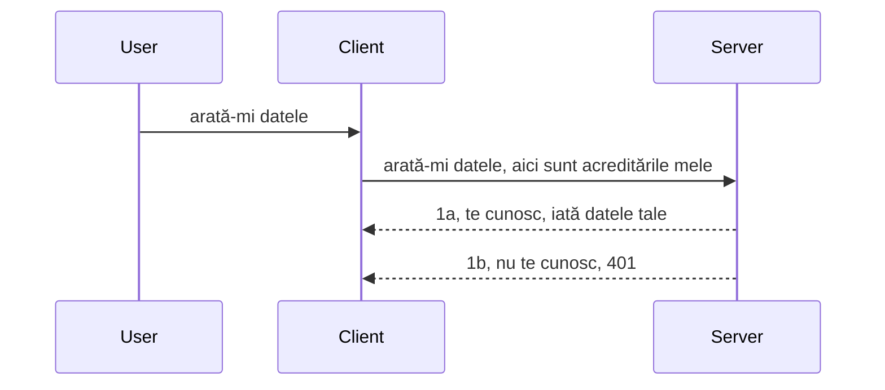

# Autentificare simplă

SDK-urile MCP acceptă utilizarea OAuth 2.1, care, să fim cinstiți, este un proces destul de complex ce implică concepte precum server de autentificare, server de resurse, trimiterea de acreditări, obținerea unui cod, schimbarea codului pentru un token de tip bearer până când poți în cele din urmă să obții datele resursei tale. Dacă nu ești obișnuit cu OAuth, care este un lucru grozav de implementat, este o idee bună să începi cu un nivel de autentificare de bază și să construiești treptat spre o securitate tot mai bună. De aceea există acest capitol, să te ajute să avansezi spre o autentificare mai complexă.

## Autentificare, ce înțelegem prin asta?

Autentificarea este prescurtarea pentru autentificare și autorizare. Ideea este că trebuie să facem două lucruri:

- **Autentificare**, care este procesul de a descoperi dacă permitem unei persoane să intre în casa noastră, dacă are dreptul să fie „aici”, adică să aibă acces la serverul nostru de resurse unde se află funcționalitățile MCP Server.
- **Autorizare**, este procesul de a afla dacă un utilizator ar trebui să aibă acces la anumite resurse specifice pe care le cere, de exemplu aceste comenzi sau aceste produse sau dacă are voie să citească conținutul dar nu să îl șteargă, ca alt exemplu.

## Acreditări: cum spui sistemului cine ești

Ei bine, cei mai mulți dezvoltatori web încep să gândească în termeni de a furniza o acreditare serverului, de obicei un secret care spune dacă sunt sau nu autorizați să fie aici („Autentificare”). Această acreditare este de obicei o versiune codificată base64 a numelui de utilizator și parolei sau o cheie API care identifică în mod unic un utilizator specific.

Aceasta implică trimiterea ei printr-un header numit „Authorization” astfel:

```json
{ "Authorization": "secret123" }
```

Aceasta este de obicei denumită autentificare de bază. Cum funcționează fluxul general este în felul următor:


```mermaid
sequenceDiagram
   participant User
   participant Client
   participant Server

   User->>Client: arată-mi datele
   Client->>Server: arată-mi datele, aici sunt acreditările mele
   Server-->>Client: 1a, te cunosc, iată datele tale
   Server-->>Client: 1b, nu te cunosc, 401 
```

Acum că înțelegem cum funcționează din punct de vedere al fluxului, cum o implementăm? Ei bine, majoritatea serverelor web au un concept numit middleware, o bucată de cod care rulează ca parte a cererii și poate verifica acreditările și, dacă acestea sunt valide, poate permite cererii să treacă. Dacă cererea nu are acreditări valide, primești o eroare de autentificare. Să vedem cum poate fi implementat asta:

**Python**

```python
class AuthMiddleware(BaseHTTPMiddleware):
    async def dispatch(self, request, call_next):

        has_header = request.headers.get("Authorization")
        if not has_header:
            print("-> Missing Authorization header!")
            return Response(status_code=401, content="Unauthorized")

        if not valid_token(has_header):
            print("-> Invalid token!")
            return Response(status_code=403, content="Forbidden")

        print("Valid token, proceeding...")
       
        response = await call_next(request)
        # adaugă orice anteturi ale clientului sau schimbă răspunsul într-un fel
        return response


starlette_app.add_middleware(CustomHeaderMiddleware)
```

Aici avem:

- Am creat un middleware numit `AuthMiddleware` unde metoda sa `dispatch` este invocată de serverul web.
- Am adăugat middleware-ul la serverul web:

    ```python
    starlette_app.add_middleware(AuthMiddleware)
    ```

- Am scris o logică de validare care verifică dacă header-ul Authorization este prezent și dacă secretul trimis este valid:

    ```python
    has_header = request.headers.get("Authorization")
    if not has_header:
        print("-> Missing Authorization header!")
        return Response(status_code=401, content="Unauthorized")

    if not valid_token(has_header):
        print("-> Invalid token!")
        return Response(status_code=403, content="Forbidden")
    ```

    dacă secretul este prezent și valid, atunci permitem cererii să treacă prin apelarea lui `call_next` și returnăm răspunsul.

    ```python
    response = await call_next(request)
    # adaugă orice anteturi personalizate ale clientului sau modifică răspunsul într-un anumit fel
    return response
    ```

Cum funcționează este că dacă se face o cerere web către server, middleware-ul va fi invocat și, dată fiind implementarea sa, fie va permite cererii să treacă, fie va returna o eroare care indică faptul că clientul nu are permisiunea să continue.

**TypeScript**

Aici creăm un middleware cu popularul framework Express și interceptăm cererea înainte să ajungă la MCP Server. Iată codul pentru asta:

```typescript
function isValid(secret) {
    return secret === "secret123";
}

app.use((req, res, next) => {
    // 1. Antet autorizare prezent?
    if(!req.headers["Authorization"]) {
        res.status(401).send('Unauthorized');
    }
    
    let token = req.headers["Authorization"];

    // 2. Verifică valabilitatea.
    if(!isValid(token)) {
        res.status(403).send('Forbidden');
    }

   
    console.log('Middleware executed');
    // 3. Trimite cererea către următorul pas din fluxul de procesare a cererilor.
    next();
});
```

În acest cod:

1. Verificăm dacă header-ul Authorization este prezent în primul rând, dacă nu, trimitem o eroare 401.
2. Ne asigurăm că acreditarea/tokenul este valid, dacă nu, trimitem o eroare 403.
3. În cele din urmă, cererea este transmisă în lanțul de procesare și returnează resursa cerută.

## Exercițiu: Implementarea autentificării

Să preluăm cunoștințele noastre și să încercăm să le implementăm. Iată planul:

Server

- Creăm un server web și o instanță MCP.
- Implementăm un middleware pentru server.

Client

- Trimitem o cerere web, cu acreditări, prin header.

### -1- Crearea unui server web și a unei instanțe MCP

> [!WARNING]
> Exemplul TypeScript de mai jos țintește MCP `2025-11-25`. Acesta monitorizează transporturile
> prin `mcp-session-id` și nu este un exemplu actual de transport `2026-07-28`. MCP
> `2026-07-28` elimină „initialize” handshake și protocolul session ID; noile
> implementări folosesc cereri autonome. Vezi
> [Ce s-a schimbat în MCP: Specificația 2026-07-28](../../01-CoreConcepts/mcp-2026-07-28.md).

În primul pas, trebuie să creăm instanța serverului web și MCP Server.

**Python**

Aici creăm o instanță MCP server, construim o aplicație web starlette și o găzduim cu uvicorn.

```python
# crearea serverului MCP

app = FastMCP(
    name="MCP Resource Server",
    instructions="Resource Server that validates tokens via Authorization Server introspection",
    host=settings["host"],
    port=settings["port"],
    debug=True
)

# crearea aplicației web starlette
starlette_app = app.streamable_http_app()

# servirea aplicației prin uvicorn
async def run(starlette_app):
    import uvicorn
    config = uvicorn.Config(
            starlette_app,
            host=app.settings.host,
            port=app.settings.port,
            log_level=app.settings.log_level.lower(),
        )
    server = uvicorn.Server(config)
    await server.serve()

run(starlette_app)
```

În acest cod:

- Creăm MCP Server.
- Construim aplicația web starlette din MCP Server, `app.streamable_http_app()`.
- Găzduim și servim aplicația web folosind uvicorn `server.serve()`.

**TypeScript**

Aici creăm o instanță MCP Server.

```typescript
const server = new McpServer({
      name: "example-server",
      version: "1.0.0"
    });

    // ... configura resursele serverului, uneltele și prompturile ...
```

Această creare a MCP Server trebuie să se întâmple în definiția rutei noastre POST /mcp, așa că să mutăm codul de mai sus astfel:

```typescript
import express from "express";
import { randomUUID } from "node:crypto";
import { McpServer } from "@modelcontextprotocol/sdk/server/mcp.js";
import { StreamableHTTPServerTransport } from "@modelcontextprotocol/sdk/server/streamableHttp.js";
import { isInitializeRequest } from "@modelcontextprotocol/sdk/types.js"

const app = express();
app.use(express.json());

// Hartă pentru a stoca transporturile după ID-ul sesiunii
const transports: { [sessionId: string]: StreamableHTTPServerTransport } = {};

// Gestionează cererile POST pentru comunicarea client-server
app.post('/mcp', async (req, res) => {
  // Verifică existența ID-ului sesiunii
  const sessionId = req.headers['mcp-session-id'] as string | undefined;
  let transport: StreamableHTTPServerTransport;

  if (sessionId && transports[sessionId]) {
    // Refolosește transportul existent
    transport = transports[sessionId];
  } else if (!sessionId && isInitializeRequest(req.body)) {
    // Cerere nouă de inițializare
    transport = new StreamableHTTPServerTransport({
      sessionIdGenerator: () => randomUUID(),
      onsessioninitialized: (sessionId) => {
        // Stochează transportul după ID-ul sesiunii
        transports[sessionId] = transport;
      },
      // Protecția împotriva rebinding-ului DNS este dezactivată implicit pentru compatibilitate cu versiunile anterioare. Dacă rulezi acest server
      // local, asigură-te că setezi:
      // enableDnsRebindingProtection: true,
      // allowedHosts: ['127.0.0.1'],
    });

    // Curăță transportul când este închis
    transport.onclose = () => {
      if (transport.sessionId) {
        delete transports[transport.sessionId];
      }
    };
    const server = new McpServer({
      name: "example-server",
      version: "1.0.0"
    });

    // ... configurare resurse server, unelte și indicii ...

    // Conectează-te la serverul MCP
    await server.connect(transport);
  } else {
    // Cerere invalidă
    res.status(400).json({
      jsonrpc: '2.0',
      error: {
        code: -32000,
        message: 'Bad Request: No valid session ID provided',
      },
      id: null,
    });
    return;
  }

  // Gestionează cererea
  await transport.handleRequest(req, res, req.body);
});

// Handler reutilizabil pentru cererile GET și DELETE
const handleSessionRequest = async (req: express.Request, res: express.Response) => {
  const sessionId = req.headers['mcp-session-id'] as string | undefined;
  if (!sessionId || !transports[sessionId]) {
    res.status(400).send('Invalid or missing session ID');
    return;
  }
  
  const transport = transports[sessionId];
  await transport.handleRequest(req, res);
};

// Gestionează cererile GET pentru notificările server-către-client prin SSE
app.get('/mcp', handleSessionRequest);

// Gestionează cererile DELETE pentru terminarea sesiunii
app.delete('/mcp', handleSessionRequest);

app.listen(3000);
```

Acum vezi cum crearea MCP Server a fost mutată în `app.post("/mcp")`.

Să trecem la pasul următor de a crea middleware-ul pentru validarea acreditărilor primite.

### -2- Implementarea unui middleware pentru server

Să trecem la partea de middleware. Aici vom crea un middleware care caută o acreditare în header-ul `Authorization` și o validează. Dacă este acceptabilă, cererea va merge mai departe să facă ce trebuie (ex: listare unelte, citirea unei resurse sau orice funcționalitate MCP cerută de client).

**Python**

Pentru a crea middleware-ul, trebuie să creăm o clasă care moștenește de la `BaseHTTPMiddleware`. Sunt două piese interesante:

- Cererea `request`, de unde citim informația din header.
- `call_next`, callback-ul pe care trebuie să-l invocăm dacă clientul a adus o acreditare pe care o acceptăm.

Mai întâi, trebuie să gestionăm cazul în care header-ul `Authorization` lipsește:

```python
has_header = request.headers.get("Authorization")

# niciun antet prezent, eșuează cu 401, altfel continuă.
if not has_header:
    print("-> Missing Authorization header!")
    return Response(status_code=401, content="Unauthorized")
```

Aici trimitem un mesaj 401 unauthorized deoarece clientul nu trece autentificarea.

Următorul pas, dacă o acreditare a fost trimisă, trebuie să verificăm validitatea acesteia astfel:

```python
 if not valid_token(has_header):
    print("-> Invalid token!")
    return Response(status_code=403, content="Forbidden")
```

Observă cum trimitem un mesaj 403 forbidden mai sus. Să vedem întreg middleware-ul mai jos implementând tot ce am menționat:

```python
class AuthMiddleware(BaseHTTPMiddleware):
    async def dispatch(self, request, call_next):

        has_header = request.headers.get("Authorization")
        if not has_header:
            print("-> Missing Authorization header!")
            return Response(status_code=401, content="Unauthorized")

        if not valid_token(has_header):
            print("-> Invalid token!")
            return Response(status_code=403, content="Forbidden")

        print("Valid token, proceeding...")
        print(f"-> Received {request.method} {request.url}")
        response = await call_next(request)
        response.headers['Custom'] = 'Example'
        return response

```

Minunat, dar ce este funcția `valid_token`? Iată-o mai jos:

```python
# NU folosiți pentru producție - îmbunătățiți-l !!
def valid_token(token: str) -> bool:
    # eliminați prefixul "Bearer "
    if token.startswith("Bearer "):
        token = token[7:]
        return token == "secret-token"
    return False
```

Evident, asta ar trebui îmbunătățit.

IMPORTANT: Nu ar trebui NICIODATĂ să ai astfel de secrete în cod. Ideal ar fi să recuperezi valoarea de comparat dintr-o sursă de date sau de la un IDP (provider serviciu de identitate) sau și mai bine, să lași IDP să facă validarea.

**TypeScript**

Pentru a implementa asta cu Express, trebuie să apelăm metoda `use` care primește funcții middleware.

Trebuie să:

- Interacționăm cu variabila request pentru a verifica acreditarea transmisă în proprietatea `Authorization`.
- Validăm acreditarea, iar dacă este validă, lăsăm cererea să continue și să facă ce trebuie (de ex: listarea uneltelor, citirea resursei sau orice funcționalitate MCP).

Aici verificăm dacă header-ul `Authorization` este prezent, iar dacă nu, oprim cererea să intre:

```typescript
if(!req.headers["authorization"]) {
    res.status(401).send('Unauthorized');
    return;
}
```

Dacă header-ul nici măcar nu este trimis, primești o eroare 401.

Următorul pas, verificăm dacă acreditarea este validă, iar dacă nu, oprim din nou cererea, dar cu un mesaj puțin diferit:

```typescript
if(!isValid(token)) {
    res.status(403).send('Forbidden');
    return;
} 
```

Observă cum primești acum o eroare 403.

Iată codul complet:

```typescript
app.use((req, res, next) => {
    console.log('Request received:', req.method, req.url, req.headers);
    console.log('Headers:', req.headers["authorization"]);
    if(!req.headers["authorization"]) {
        res.status(401).send('Unauthorized');
        return;
    }
    
    let token = req.headers["authorization"];

    if(!isValid(token)) {
        res.status(403).send('Forbidden');
        return;
    }  

    console.log('Middleware executed');
    next();
});
```

Am configurat serverul web pentru a accepta un middleware care să verifice acreditarea pe care clientul sperăm să ne-o trimită. Dar clientul însuși?

### -3- Trimiterea cererii web cu acreditări prin header

Trebuie să ne asigurăm că clientul transmite acreditarea prin header. Cum o facem, atunci când folosim un client MCP, trebuie să aflăm.

**Python**

Pentru client, trebuie să trimitem un header cu acreditarea noastră astfel:

```python
# NU codifica valoarea direct, cel puțin păstreaz-o într-o variabilă de mediu sau într-un spațiu de stocare mai sigur
token = "secret-token"

async with streamablehttp_client(
        url = f"http://localhost:{port}/mcp",
        headers = {"Authorization": f"Bearer {token}"}
    ) as (
        read_stream,
        write_stream,
        session_callback,
    ):
        async with ClientSession(
            read_stream,
            write_stream
        ) as session:
            await session.initialize()
      
            # TODO, ce vrei să faci în client, de ex. listarea uneltelor, apelarea uneltelor etc.
```

Observă cum populăm proprietatea `headers` astfel: ` headers = {"Authorization": f"Bearer {token}"}`.

**TypeScript**

Putem rezolva asta în doi pași:

1. Populăm un obiect de configurare cu acreditarea noastră.
2. Transmitem obiectul de configurare către transport.

```typescript

// NU codifica valoarea direct așa cum este prezentat aici. Cel puțin să fie o variabilă de mediu și folosește ceva precum dotenv (în modul de dezvoltare).
let token = "secret123"

// definește un obiect de opțiuni de transport pentru client
let options: StreamableHTTPClientTransportOptions = {
  sessionId: sessionId,
  requestInit: {
    headers: {
      "Authorization": "secret123"
    }
  }
};

// transmite obiectul de opțiuni către transport
async function main() {
   const transport = new StreamableHTTPClientTransport(
      new URL(serverUrl),
      options
   );
```

Aici vezi deasupra cum a trebuit să creăm un obiect `options` și să punem header-ele sub proprietatea `requestInit`.

IMPORTANT: Cum îl îmbunătățim de aici încolo? Ei bine, implementarea curentă are unele probleme. În primul rând, trimiterea unei acreditări așa este destul de riscantă decât dacă ai HTTPS cel puțin. Chiar și așa, acreditarea poate fi furată, așa că trebuie un sistem unde poți revoca ușor tokenul și să adaugi verificări suplimentare precum de unde vine în lume, dacă cererea se face prea des (comportament de bot), pe scurt, sunt o mulțime de preocupări.

Totuși, trebuie spus că pentru API-uri foarte simple unde nu vrei ca oricine să apeleze API-ul fără autentificare ceea ce avem aici este un început bun.

Cu toate acestea, să încercăm să întărim securitatea puțin folosind un format standardizat precum JSON Web Token, cunoscut și ca JWT sau tokens „JOT”.

## JSON Web Tokens, JWT

Așadar, încercăm să îmbunătățim lucrurile față de trimiterea unor acreditări foarte simple. Care sunt îmbunătățirile imediate pe care le obținem adoptând JWT?

- **Îmbunătățiri de securitate**. În autentificarea de bază, trimiți numele de utilizator și parola ca un token codificat base64 (sau o cheie API) iar și iar, ceea ce crește riscul. Cu JWT, trimiți numele de utilizator și parola și primești un token în schimb și acesta are și o limită de timp după care expiră. JWT îți permite să folosești cu ușurință controlul accesului granulare folosind roluri, domenii și permisiuni.
- **Statelessness și scalabilitate**. JWT-urile sunt autonome, poartă toate informațiile despre utilizator și elimină nevoia de a stoca sesiune pe server. Tokenul poate fi validat și local.
- **Interoperabilitate și federare**. JWT-urile sunt centrale pentru Open ID Connect și sunt folosite cu provideri de identitate cunoscuți precum Entra ID, Google Identity și Auth0. Ele permit, de asemenea, folosirea single sign on și multe altele făcându-le de clasă enterprise.
- **Modularitate și flexibilitate**. JWT-urile pot fi folosite și cu API Gateways precum Azure API Management, NGINX și altele. De asemenea, suportă scenarii de autentificare și comunicare server-la-server inclusiv de impersonare și delegare.
- **Performanță și caching**. JWT-urile pot fi memorate în cache după decodare, reducând nevoia de parsare. Acest lucru ajută în special aplicațiile cu trafic mare deoarece îmbunătățește debitul și reduce încărcarea infrastructurii alese.
- **Funcționalități avansate**. De asemenea suportă introspecția (verificarea validității pe server) și revocarea (face tokenul invalid).

Cu toate aceste beneficii, să vedem cum putem duce implementarea noastră la nivelul următor.

## Transformarea autentificării de bază în JWT

Deci, schimbările pe care trebuie să le facem, la un nivel înalt, sunt:

- **Învățarea construirii unui token JWT** și pregătirea lui pentru a fi trimis de la client la server.
- **Validarea unui token JWT** și, dacă este valid, să permitem clientului accesul la resursele noastre.
- **Stocarea securizată a token-ului**. Cum stocăm acest token.
- **Protejarea rutelor**. Trebuie să protejăm rutele și funcționalitățile MCP specifice.
- **Adăugarea token-urilor de reîmprospătare**. Asigurăm că creăm token-uri cu durată scurtă, dar și token-uri de reîmprospătare cu durată lungă care pot fi folosite pentru a obține token-uri noi dacă acestea expiră. De asemenea, asigurăm o rută de refresh și o strategie de rotație.

### -1- Construirea unui token JWT

În primul rând, un token JWT are următoarele părți:

- **header**, algoritmul folosit și tipul token-ului.
- **payload**, revendicări (claims), cum ar fi sub (subiectul - utilizatorul sau entitatea pe care o reprezintă tokenul. Într-un scenariu de autentificare, de obicei este userid-ul), exp (data expirării) role (rolul)
- **semnătura**, semnată cu un secret sau o cheie privată.

Pentru asta, trebuie să construim header-ul, payload-ul și tokenul codificat.

**Python**

```python

import jwt
import jwt
from jwt.exceptions import ExpiredSignatureError, InvalidTokenError
import datetime

# Cheie secretă folosită pentru a semna JWT-ul
secret_key = 'your-secret-key'

header = {
    "alg": "HS256",
    "typ": "JWT"
}

# informațiile utilizatorului și revendicările sale și timpul de expirare
payload = {
    "sub": "1234567890",               # Subiect (ID utilizator)
    "name": "User Userson",                # Revendicare personalizată
    "admin": True,                     # Revendicare personalizată
    "iat": datetime.datetime.utcnow(),# Data emiterii
    "exp": datetime.datetime.utcnow() + datetime.timedelta(hours=1)  # Expirare
}

# codifică-l
encoded_jwt = jwt.encode(payload, secret_key, algorithm="HS256", headers=header)
```

În codul de mai sus am:

- Definit header-ul folosind algoritmul HS256 și tipul JWT.
- Construit un payload care conține un subject sau user id, un nume de utilizator, un rol, când a fost emis și când expiră, implementând astfel aspectul de limitare în timp menționat.

**TypeScript**

Aici vom avea nevoie de câteva dependențe care ne vor ajuta să construim tokenul JWT.

Dependențe

```sh

npm install jsonwebtoken
npm install --save-dev @types/jsonwebtoken
```

Acum că avem toate acestea, să construim header-ul, payload-ul și astfel să generăm tokenul codificat.

```typescript
import jwt from 'jsonwebtoken';

const secretKey = 'your-secret-key'; // Folosește variabilele de mediu în producție

// Definește încărcătura
const payload = {
  sub: '1234567890',
  name: 'User usersson',
  admin: true,
  iat: Math.floor(Date.now() / 1000), // Emitat la
  exp: Math.floor(Date.now() / 1000) + 60 * 60 // Expiră în 1 oră
};

// Definește antetul (opțional, jsonwebtoken setează valori implicite)
const header = {
  alg: 'HS256',
  typ: 'JWT'
};

// Creează token-ul
const token = jwt.sign(payload, secretKey, {
  algorithm: 'HS256',
  header: header
});

console.log('JWT:', token);
```

Acest token este:

Semnat folosind HS256
Valabil o oră
Include revendicări precum sub, name, admin, iat și exp.

### -2- Validarea unui token

De asemenea, trebuie să validăm un token, acesta este un lucru pe care ar trebui să-l facem pe server pentru a ne asigura că ceea ce clientul ne trimite este de fapt valid. Există multe verificări pe care ar trebui să le facem, de la validarea structurii până la validitate. E recomandat să adaugi și alte verificări pentru a vedea dacă utilizatorul este în sistemul tău și altele.

Pentru a valida un token, trebuie să-l decodăm pentru a-l citi și apoi să începem să-i verificăm validitatea:

**Python**

```python

# Decodează și verifică JWT-ul
try:
    decoded = jwt.decode(token, secret_key, algorithms=["HS256"])
    print("✅ Token is valid.")
    print("Decoded claims:")
    for key, value in decoded.items():
        print(f"  {key}: {value}")
except ExpiredSignatureError:
    print("❌ Token has expired.")
except InvalidTokenError as e:
    print(f"❌ Invalid token: {e}")

```


În acest cod, apelăm `jwt.decode` folosind tokenul, cheia secretă și algoritmul ales ca intrare. Observați cum folosim o construcție try-catch deoarece o validare nereușită duce la generarea unei erori.

**TypeScript**

Aici trebuie să apelăm `jwt.verify` pentru a obține o versiune decodată a tokenului pe care o putem analiza mai departe. Dacă acest apel eșuează, înseamnă că structura tokenului este incorectă sau nu mai este valid.

```typescript

try {
  const decoded = jwt.verify(token, secretKey);
  console.log('Decoded Payload:', decoded);
} catch (err) {
  console.error('Token verification failed:', err);
}
```

NOTĂ: așa cum s-a menționat anterior, ar trebui să efectuăm verificări suplimentare pentru a ne asigura că acest token indică un utilizator din sistemul nostru și să ne asigurăm că utilizatorul are drepturile pe care le afirmă.

Următorul, să analizăm controlul accesului bazat pe roluri, cunoscut și sub denumirea RBAC.

## Adăugarea controlului accesului bazat pe roluri

Ideea este că dorim să exprimăm că roluri diferite au permisiuni diferite. De exemplu, presupunem că un administrator poate face totul, un utilizator normal poate citi/scrie, iar un oaspete poate doar citi. Prin urmare, iată câteva niveluri posibile de permisiuni:

- Admin.Write 
- User.Read
- Guest.Read

Să vedem cum putem implementa un astfel de control cu middleware. Middleware-urile pot fi adăugate per rută, precum și pentru toate rutele.

**Python**

```python
from starlette.middleware.base import BaseHTTPMiddleware
from starlette.responses import JSONResponse
import jwt

# NU păstra secretul în cod, cum este aici, aceasta este doar pentru scopuri demonstrative. Citește-l dintr-un loc sigur.
SECRET_KEY = "your-secret-key" # pune asta într-o variabilă de mediu
REQUIRED_PERMISSION = "User.Read"

class JWTPermissionMiddleware(BaseHTTPMiddleware):
    async def dispatch(self, request, call_next):
        auth_header = request.headers.get("Authorization")
        if not auth_header or not auth_header.startswith("Bearer "):
            return JSONResponse({"error": "Missing or invalid Authorization header"}, status_code=401)

        token = auth_header.split(" ")[1]
        try:
            decoded = jwt.decode(token, SECRET_KEY, algorithms=["HS256"])
        except jwt.ExpiredSignatureError:
            return JSONResponse({"error": "Token expired"}, status_code=401)
        except jwt.InvalidTokenError:
            return JSONResponse({"error": "Invalid token"}, status_code=401)

        permissions = decoded.get("permissions", [])
        if REQUIRED_PERMISSION not in permissions:
            return JSONResponse({"error": "Permission denied"}, status_code=403)

        request.state.user = decoded
        return await call_next(request)


```

Există câteva moduri diferite de a adăuga middleware, ca mai jos:

```python

# Alt 1: adaugă middleware în timp ce construiești aplicația starlette
middleware = [
    Middleware(JWTPermissionMiddleware)
]

app = Starlette(routes=routes, middleware=middleware)

# Alt 2: adaugă middleware după ce aplicația starlette este deja construită
starlette_app.add_middleware(JWTPermissionMiddleware)

# Alt 3: adaugă middleware pentru fiecare rută
routes = [
    Route(
        "/mcp",
        endpoint=..., # handler
        middleware=[Middleware(JWTPermissionMiddleware)]
    )
]
```

**TypeScript**

Putem folosi `app.use` și un middleware care va rula pentru toate cererile.

```typescript
app.use((req, res, next) => {
    console.log('Request received:', req.method, req.url, req.headers);
    console.log('Headers:', req.headers["authorization"]);

    // 1. Verifică dacă antetul de autorizare a fost trimis

    if(!req.headers["authorization"]) {
        res.status(401).send('Unauthorized');
        return;
    }
    
    let token = req.headers["authorization"];

    // 2. Verifică dacă tokenul este valid
    if(!isValid(token)) {
        res.status(403).send('Forbidden');
        return;
    }  

    // 3. Verifică dacă utilizatorul tokenului există în sistemul nostru
    if(!isExistingUser(token)) {
        res.status(403).send('Forbidden');
        console.log("User does not exist");
        return;
    }
    console.log("User exists");

    // 4. Verifică dacă tokenul are permisiunile corecte
    if(!hasScopes(token, ["User.Read"])){
        res.status(403).send('Forbidden - insufficient scopes');
    }

    console.log("User has required scopes");

    console.log('Middleware executed');
    next();
});

```

Sunt destule lucruri pe care le putem lăsa middleware-ului nostru și pe care middleware-ul nostru AR TREBUI să le facă, și anume:

1. Verifică dacă headerul de autorizare este prezent
2. Verifică dacă tokenul este valid, apelăm `isValid`, o metodă pe care am scris-o și care verifică integritatea și validitatea tokenului JWT.
3. Verifică dacă utilizatorul există în sistemul nostru, ar trebui să verificăm asta.

   ```typescript
    // utilizatori în baza de date
   const users = [
     "user1",
     "User usersson",
   ]

   function isExistingUser(token) {
     let decodedToken = verifyToken(token);

     // DE FĂCUT, verifică dacă utilizatorul există în baza de date
     return users.includes(decodedToken?.name || "");
   }
   ```

   Mai sus, am creat o listă foarte simplă `users`, care ar trebui desigur să fie într-o bază de date.

4. În plus, ar trebui să verificăm și dacă tokenul are permisiunile corecte.

   ```typescript
   if(!hasScopes(token, ["User.Read"])){
        res.status(403).send('Forbidden - insufficient scopes');
   }
   ```

   În acest cod de mai sus din middleware, verificăm că tokenul conține permisiunea User.Read, dacă nu, trimitem o eroare 403. Mai jos este metoda helper `hasScopes`.

   ```typescript
   function hasScopes(scope: string, requiredScopes: string[]) {
     let decodedToken = verifyToken(scope);
    return requiredScopes.every(scope => decodedToken?.scopes.includes(scope));
  }
   ```

Have a think which additional checks you should be doing, but these are the absolute minimum of checks you should be doing.

Using Express as a web framework is a common choice. There are helpers library when you use JWT so you can write less code.

- `express-jwt`, helper library that provides a middleware that helps decode your token.
- `express-jwt-permissions`, this provides a middleware `guard` that helps check if a certain permission is on the token.

Here's what these libraries can look like when used:

```typescript
const express = require('express');
const jwt = require('express-jwt');
const guard = require('express-jwt-permissions')();

const app = express();
const secretKey = 'your-secret-key'; // put this in env variable

// Decode JWT and attach to req.user
app.use(jwt({ secret: secretKey, algorithms: ['HS256'] }));

// Check for User.Read permission
app.use(guard.check('User.Read'));

// multiple permissions
// app.use(guard.check(['User.Read', 'Admin.Access']));

app.get('/protected', (req, res) => {
  res.json({ message: `Welcome ${req.user.name}` });
});

// Error handler
app.use((err, req, res, next) => {
  if (err.code === 'permission_denied') {
    return res.status(403).send('Forbidden');
  }
  next(err);
});

```

Acum că ați văzut cum middleware-ul poate fi folosit atât pentru autentificare cât și pentru autorizare, dar despre MCP, cum schimbă asta modul în care facem autentificarea? Hai să aflăm în secțiunea următoare.

### -3- Adăugarea RBAC la MCP

Până acum ați văzut cum puteți adăuga RBAC prin middleware, însă pentru MCP nu există o modalitate ușoară de a adăuga RBAC per caracteristică MCP, așa că ce facem? Ei bine, trebuie doar să adăugăm un cod ca acesta care verifică în acest caz dacă clientul are drepturile să apeleze un anumit instrument:

Aveți câteva opțiuni diferite pentru a realiza RBAC per caracteristică, iată câteva:

- Adăugați o verificare pentru fiecare instrument, resursă, prompt unde trebuie să verificați nivelul de permisiune.

   **python**

   ```python
   @tool()
   def delete_product(id: int):
      try:
          check_permissions(role="Admin.Write", request)
      catch:
        pass # clientul a eșuat la autorizare, ridică eroarea de autorizare
   ```

   **typescript**

   ```typescript
   server.registerTool(
    "delete-product",
    {
      title: Delete a product",
      description: "Deletes a product",
      inputSchema: { id: z.number() }
    },
    async ({ id }) => {
      
      try {
        checkPermissions("Admin.Write", request);
        // de făcut, trimite id-ul către productService și intrarea la distanță
      } catch(Exception e) {
        console.log("Authorization error, you're not allowed");  
      }

      return {
        content: [{ type: "text", text: `Deletected product with id ${id}` }]
      };
    }
   );
   ```


- Folosiți o abordare avansată pe server și handler-ele de cereri astfel încât să minimizați numărul de locuri unde trebuie făcută verificarea.

   **Python**

   ```python
   
   tool_permission = {
      "create_product": ["User.Write", "Admin.Write"],
      "delete_product": ["Admin.Write"]
   }

   def has_permission(user_permissions, required_permissions) -> bool:
      # user_permissions: listă de permisiuni pe care le are utilizatorul
      # required_permissions: listă de permisiuni necesare pentru instrument
      return any(perm in user_permissions for perm in required_permissions)

   @server.call_tool()
   async def handle_call_tool(
     name: str, arguments: dict[str, str] | None
   ) -> list[types.TextContent]:
    # Se presupune că request.user.permissions este o listă de permisiuni pentru utilizator
     user_permissions = request.user.permissions
     required_permissions = tool_permission.get(name, [])
     if not has_permission(user_permissions, required_permissions):
        # Ridică eroarea "Nu aveți permisiunea de a apela instrumentul {name}"
        raise Exception(f"You don't have permission to call tool {name}")
     # continuă și apelează instrumentul
     # ...
   ```   
   

   **TypeScript**

   ```typescript
   function hasPermission(userPermissions: string[], requiredPermissions: string[]): boolean {
       if (!Array.isArray(userPermissions) || !Array.isArray(requiredPermissions)) return false;
       // Returnează true dacă utilizatorul are cel puțin o permisiune necesară
       
       return requiredPermissions.some(perm => userPermissions.includes(perm));
   }
  
   server.setRequestHandler(CallToolRequestSchema, async (request) => {
      const { params: { name } } = request;
  
      let permissions = request.user.permissions;
  
      if (!hasPermission(permissions, toolPermissions[name])) {
         return new Error(`You don't have permission to call ${name}`);
      }
  
      // continuă..
   });
   ```

   Notă, va trebui să vă asigurați că middleware-ul atribuie un token decodat proprietății user a cererii pentru ca codul de mai sus să fie simplificat.

### Rezumat

Acum că am discutat cum să adăugăm suport pentru RBAC în general și pentru MCP în particular, este timpul să încercați să implementați securitatea pe cont propriu pentru a vă asigura că ați înțeles conceptele prezentate.

## Tema 1: Construiește un server mcp și client mcp folosind autentificare de bază

Aici veți aplica ceea ce ați învățat în ceea ce privește trimiterea acreditărilor prin header-e.

## Soluția 1

[Soluția 1](./code/basic/README.md)

## Tema 2: Actualizați soluția de la Tema 1 să folosească JWT

Luați prima soluție, dar de data aceasta hai să o îmbunătățim.

În loc să folosim Basic Auth, să folosim JWT.

## Soluția 2

[Soluția 2](./solution/jwt-solution/README.md)

## Provocare

Adăugați RBAC per instrument așa cum descriem în secțiunea „Adăugarea RBAC la MCP”.

## Rezumat

Sperăm că ați învățat multe în acest capitol, de la lipsa totală de securitate, la securitatea de bază, la JWT și cum poate fi adăugat la MCP.

Am construit o fundație solidă cu JWT-uri personalizate, însă pe măsură ce creștem, ne îndreptăm către un model de identitate bazat pe standarde. Adoptarea unui IdP precum Entra sau Keycloak ne permite să externalizăm emiterea, validarea și gestionarea ciclului de viață al tokenurilor către o platformă de încredere — eliberându-ne să ne concentrăm pe logica aplicației și experiența utilizatorului.

Pentru asta, avem un capitol mai [avansat despre Entra](../../05-AdvancedTopics/mcp-security-entra/README.md)

## Ce urmează

- Următor: [Configurarea gazdelor MCP](../12-mcp-hosts/README.md)

---

<!-- CO-OP TRANSLATOR DISCLAIMER START -->
**Declinare a responsabilității**:
Acest document a fost tradus folosind serviciul de traducere AI [Co-op Translator](https://github.com/Azure/co-op-translator). În timp ce ne străduim pentru acuratețe, vă rugăm să rețineți că traducerile automate pot conține erori sau inexactități. Documentul original în limba sa nativă trebuie considerat sursa autorizată. Pentru informații critice, se recomandă traducerea profesională realizată de un om. Nu ne asumăm responsabilitatea pentru eventualele neînțelegeri sau interpretări greșite care decurg din utilizarea acestei traduceri.
<!-- CO-OP TRANSLATOR DISCLAIMER END -->