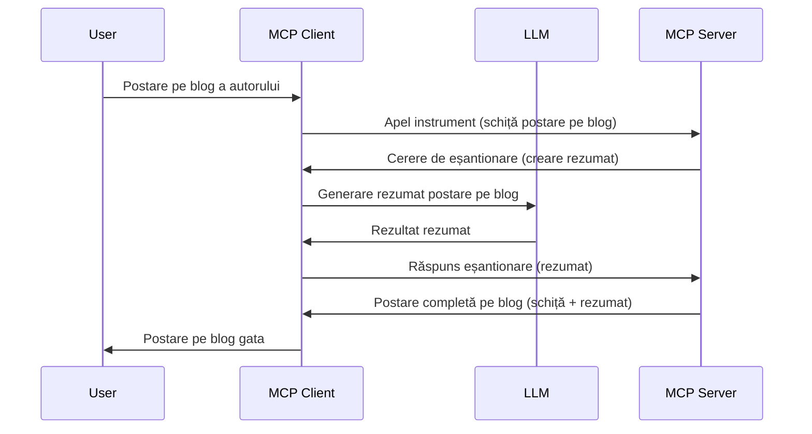

> [!WARNING]
> Sampling-ul este depreciat în MCP `2026-07-28`. Această lecție este păstrată pentru
> implementările vechi. Serverele noi ar trebui să se integreze direct cu un API
> al unui furnizor LLM.

# Sampling - delegarea funcțiilor către Client

> Sampling-ul rămâne în specificația `2026-07-28` pentru compatibilitate și este
> eligibil pentru eliminare în prima revizie lansată în sau după 28 iulie
> 2027. Exemplele din această lecție pot folosi API-uri SDK care implementează `2025-11-25`.
> Vezi [What's Changed in MCP: The 2026-07-28 Specification](../../01-CoreConcepts/mcp-2026-07-28.md).

În implementările vechi, Sampling permite unui server MCP să ceară ajutor de la un LLM
gestionat de client. Pentru implementările noi, apelează direct furnizorul LLM ales
în schimb.

Să explorăm câteva cazuri de utilizare și cum să construim o soluție care implică sampling.

## Prezentare generală

În această lecție ne concentrăm să explicăm când și unde să folosești Sampling și cum să-l configurezi.

## Obiective de învățare

În acest capitol, vom:

- Explica ce este Sampling-ul și când să îl folosești.
- Arăta cum să configurezi Sampling în MCP.
- Oferi exemple din practica Sampling.

## Ce este Sampling și de ce să-l folosești?

Sampling este o funcție avansată care funcționează în felul următor:



### Cererea de Sampling

Ok, acum avem o vedere de ansamblu la nivel înalt asupra unui scenariu credibil, să vorbim despre cererea de sampling pe care serverul o trimite înapoi către client. Iată cum poate arăta o astfel de cerere în format JSON-RPC:

```json
{
  "jsonrpc": "2.0",
  "id": 1,
  "method": "sampling/createMessage",
  "params": {
    "messages": [
      {
        "role": "user",
        "content": {
          "type": "text",
          "text": "Create a blog post summary of the following blog post: <BLOG POST>"
        }
      }
    ],
    "modelPreferences": {
      "hints": [
        {
          "name": "claude-3-sonnet"
        }
      ],
      "intelligencePriority": 0.8,
      "speedPriority": 0.5
    },
    "systemPrompt": "You are a helpful assistant.",
    "maxTokens": 100
  }
}
```

Sunt câteva lucruri demne de remarcat:

- Prompt, sub content -> text, este promptul nostru care este o instrucțiune pentru LLM de a rezuma conținutul unui articol de blog.

- **modelPreferences**. Această secțiune este exact asta, o preferință, o recomandare a ce configurație să se folosească cu LLM. Utilizatorul poate alege dacă urmează aceste recomandări sau le schimbă. În acest caz sunt recomandări despre modelul de folosit și prioritatea vitezei și inteligenței.
- **systemPrompt**, acesta este promptul tău normal de sistem care oferă LLM-ului tău o personalitate și conține instrucțiuni de ghidare.
- **maxTokens**, este o altă proprietate folosită pentru a specifica câți tokeni sunt recomandați pentru această sarcină.

### Răspunsul de Sampling

Acest răspuns este ceea ce Clientul MCP ajunge să trimită înapoi Serverului MCP și este rezultatul clientului care apelează LLM-ul, așteaptă acel răspuns și apoi construiește acest mesaj. Iată cum poate arăta în JSON-RPC:

```json
{
  "jsonrpc": "2.0",
  "id": 1,
  "result": {
    "role": "assistant",
    "content": {
      "type": "text",
      "text": "Here's your abstract <ABSTRACT>"
    },
    "model": "gpt-5",
    "stopReason": "endTurn"
  }
}
```

Observă cum răspunsul este un rezumat al articolului de blog exact cum am cerut. De asemenea, observă cum modelul folosit nu este ceea ce am cerut ci "gpt-5" în loc de "claude-3-sonnet". Acest lucru ilustrează că utilizatorul își poate schimba părerea legată de ce să folosească și că cererea ta de sampling este o recomandare.

Ok, acum că înțelegem fluxul principal și o sarcină utilă pentru a-l folosi "creare articol blog + rezumat", să vedem ce trebuie să facem pentru a-l face să funcționeze.

### Tipuri de mesaje

Mesajele Sampling nu sunt limitate doar la text, ci poți trimite și imagini și audio. Iată cum diferă JSON-RPC-ul:

**Text**

```json
{
  "type": "text",
  "text": "The message content"
}
```

**Conținut de imagine**


```json
{
  "type": "image",
  "data": "base64-encoded-image-data",
  "mimeType": "image/jpeg"
}
```

**Conținut audio**

```json
{
  "type": "audio",
  "data": "base64-encoded-audio-data",
  "mimeType": "audio/wav"
}
```

> NOTĂ: Pentru starea curentă și ghidajul de migrare, vezi
> [documentația de Sampling învechită](https://modelcontextprotocol.io/specification/2026-07-28/client/sampling).

## Cum să configurezi Sampling în Client

> Notă: dacă construiești doar un server, nu trebuie să faci prea multe aici.

Într-un client, trebuie să specifici următoarea funcționalitate astfel:

```json
{
  "capabilities": {
    "sampling": {}
  }
}
```

Aceasta va fi apoi preluată când clientul ales se inițializează cu serverul.

## Exemplu de Sampling în Acțiune - Crearea unei Postări pe Blog

Hai să programăm împreună un server de sampling, va trebui să facem următoarele:

1. Crează un tool pe Server.
1. Tool-ul respectiv ar trebui să creeze o cerere de sampling
1. Tool-ul ar trebui să aștepte să i se răspundă la cererea de sampling a clientului.
1. Apoi trebuie să fie produs rezultatul tool-ului.

Hai să vedem codul pas cu pas:

### -1- Crearea tool-ului

**python**

```python
@mcp.tool()
async def create_blog(title: str, content: str, ctx: Context[ServerSession, None]) -> str:
    """Create a blog post and generate a summary"""

```

### -2- Crearea unei cereri de sampling

Extinde tool-ul cu următorul cod:

**python**

```python
post = BlogPost(
        id=len(posts) + 1,
        title=title,
        content=content,
        abstract=""
    )

prompt = f"Create an abstract of the following blog post: title: {title} and draft: {content} "

result = await ctx.session.create_message(
        messages=[
            SamplingMessage(
                role="user",
                content=TextContent(type="text", text=prompt),
            )
        ],
        max_tokens=100,
)

```

### -3- Așteaptă răspunsul și returnează răspunsul

**python**

```python
post.abstract = result.content.text

posts.append(post)

# returnează produsul complet
return json.dumps({
    "id": post.title,
    "abstract": post.abstract
})
```

### -4- Codul complet

**python**

```python
from starlette.applications import Starlette
from starlette.routing import Mount, Host

from mcp.server.fastmcp import Context, FastMCP

from mcp.server.session import ServerSession
from mcp.types import SamplingMessage, TextContent

import json


from uuid import uuid4
from typing import List
from pydantic import BaseModel


mcp = FastMCP("Blog post generator")

# app = FastAPI()

posts = []

class BlogPost(BaseModel):
    id: int
    title: str
    content: str
    abstract: str

posts: List[BlogPost] = []

@mcp.tool()
async def create_blog(title: str, content: str, ctx: Context[ServerSession, None]) -> str:
    """Create a blog post and generate a summary"""

    post = BlogPost(
        id=len(posts) + 1,
        title=title,
        content=content,
        abstract=""
    )

    prompt = f"Create an abstract of the following blog post: title: {title} and draft: {content} "

    result = await ctx.session.create_message(
        messages=[
            SamplingMessage(
                role="user",
                content=TextContent(type="text", text=prompt),
            )
        ],
        max_tokens=100,
    )

    post.abstract = result.content.text

    posts.append(post)

    # returnează postarea completă de blog
    return json.dumps({
        "id": post.title,
        "abstract": post.abstract
    })

if __name__ == "__main__":
    print("Starting server...")
    # mcp.run()
    mcp.run(transport="streamable-http")

# rulează aplicația cu: python server.py
```

### -5- Testarea în Visual Studio Code

Pentru a testa asta în Visual Studio Code, fă următoarele:

1. Pornește serverul în terminal
1. Adaugă-l în *mcp.json* (și asigură-te că este pornit) ceva de genul:

   ```json
   "servers": {
      "blog-server": {
        "type": "http",
        "url": "http://localhost:8000/mcp"
      }
   }
   ```

1. Tastează un prompt:

   ```text
   create a blog post named "Where Python comes from", the content is "Python is actually named after Monty Python Flying Circus"
   ```

1. Permite samplingul să aibă loc. Prima dată când testezi asta, ți se va afișa un dialog suplimentar pe care trebuie să-l accepți, apoi vei vedea dialogul normal prin care ți se cere să rulezi un tool

1. Inspectează rezultatele. Vei vedea rezultatele atât frumos afișate în GitHub Copilot Chat, cât și în forma brută JSON.

**Bonus**. Uneltele din Visual Studio Code oferă suport excelent pentru sampling. Poți configura accesul la Sampling pe serverul instalat navigând astfel:

1. Navighează la secțiunea extensii.
1. Selectează pictograma de setări pentru serverul instalat din secțiunea "MCP SERVERS - INSTALLED".
1 Selectează "Configure Model Access", aici poți selecta modelele pe care GitHub Copilot este permis să le folosească pentru sampling. De asemenea, poți vedea toate cererile de sampling recente selectând "Show Sampling requests".

## Exercițiu

În acest exercițiu, vei crea un Sampling ușor diferit, și anume o integrare de sampling care suportă generarea unei descrieri de produs. Iată scenariul tău:

**Scenariu**: Angajatul din back office la un magazin online are nevoie de ajutor, durează prea mult să genereze descrieri de produse. Prin urmare, trebuie să construiești o soluție în care poți apela un tool "create_product" cu argumentele "title" și "keywords" și care ar trebui să producă un produs complet, inclusiv un câmp "description" care să fie populat de un LLM al clientului.

SUGESTIE: folosește ce ai învățat mai devreme pentru a construi acest server și tool-ul său folosind o cerere de sampling.

## Soluție

[Soluție](./solution/README.md)

## Aspecte cheie de reținut


Eșantionarea este o funcționalitate puternică care permite serverului să delega sarcini clientului atunci când are nevoie de ajutorul unui LLM.

## Ce urmează

- [Capitolul 4 - Implementare practică](../../04-PracticalImplementation/README.md)

---

<!-- CO-OP TRANSLATOR DISCLAIMER START -->
**Declinare a responsabilității**:
Acest document a fost tradus folosind serviciul de traducere AI [Co-op Translator](https://github.com/Azure/co-op-translator). În timp ce ne străduim pentru acuratețe, vă rugăm să rețineți că traducerile automate pot conține erori sau inexactități. Documentul original în limba sa nativă trebuie considerat sursa autorizată. Pentru informații critice, se recomandă traducerea profesională realizată de un om. Nu ne asumăm responsabilitatea pentru eventualele neînțelegeri sau interpretări greșite care decurg din utilizarea acestei traduceri.
<!-- CO-OP TRANSLATOR DISCLAIMER END -->