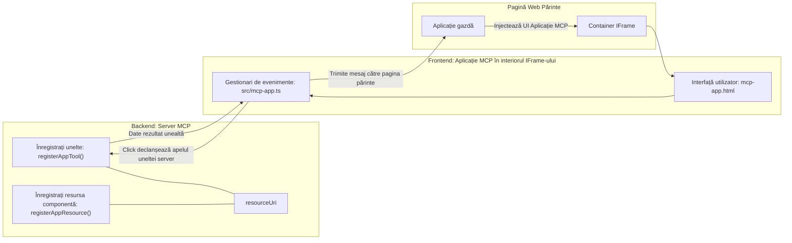
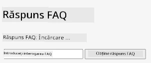
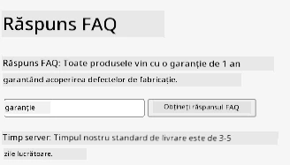
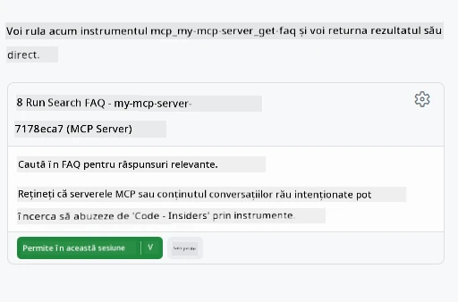
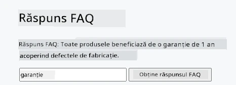

# Aplicații MCP

Aplicațiile MCP reprezintă un nou concept în MCP. Ideea este că nu doar răspunzi cu date în urma unui apel către un instrument, ci și oferi informații despre modul în care aceste informații ar trebui să fie interacționate. Asta înseamnă că rezultatele instrumentelor pot conține acum informații despre interfața utilizator. De ce am vrea asta? Ei bine, ia în considerare cum faci lucrurile astăzi. Probabil consumi rezultatele unui MCP Server punând un fel de interfață front-end în fața lui, cod pe care trebuie să îl scrii și să îl întreții. Uneori asta este ceea ce vrei, dar alteori ar fi grozav dacă ai putea să aduci doar un fragment de informație care este auto-conținută și are totul, de la date la interfața utilizator.

## Prezentare generală

Această lecție oferă îndrumări practice despre Aplicațiile MCP, cum să începi cu ele și cum să le integrezi în Aplicațiile Web existente. Aplicațiile MCP sunt o completare foarte nouă la Standardul MCP.

## Obiective de învățare

La finalul acestei lecții, vei fi capabil să:

- Explici ce sunt Aplicațiile MCP.
- Când să folosești Aplicațiile MCP.
- Construiești și să integrezi propriile tale Aplicații MCP.

## Aplicațiile MCP - cum funcționează

Ideea cu Aplicațiile MCP este să oferi un răspuns care este, în esență, un component ce trebuie redat. Un astfel de component poate avea atât elemente vizuale, cât și interactivitate, de exemplu clicuri pe butoane, input de la utilizator și altele. Să începem cu partea de server și MCP Server-ul nostru. Pentru a crea un component MCP App trebuie să creezi un instrument dar și resursa aplicației. Aceste două părți sunt legate printr-un resourceUri.

Iată un exemplu. Să încercăm să vizualizăm ce implică și ce parte face ce:

```text
server.ts -- responsible for registering tools and the component as a UI component
src/
  mcp-app.ts -- wiring up event handlers
mcp-app.html -- the user interface
```

Această reprezentare vizuală descrie arhitectura pentru crearea unui component și logica sa.


Să încercăm să descriem responsabilitățile pentru backend și frontend, respectiv.

### Backend-ul

Sunt două lucruri pe care trebuie să le realizăm aici:

- Înregistrarea instrumentelor cu care vrem să interacționăm.
- Definirea componentului.

**Înregistrarea instrumentului**

```typescript
registerAppTool(
    server,
    "get-time",
    {
      title: "Get Time",
      description: "Returns the current server time.",
      inputSchema: {},
      _meta: { ui: { resourceUri } }, // Leagă acest instrument de resursa sa UI
    },
    async () => {
      const time = new Date().toISOString();
      return { content: [{ type: "text", text: time }] };
    },
  );

```

Codul precedent descrie comportamentul, unde expune un instrument numit `get-time`. Nu are inputuri, dar produce timpul curent. Avem posibilitatea să definim un `inputSchema` pentru instrumente unde trebuie să putem accepta input de la utilizatori.

**Înregistrarea componentului**

În același fișier, trebuie de asemenea să înregistrăm componentul:

```typescript
const resourceUri = "ui://get-time/mcp-app.html";

// Înregistrează resursa, care returnează HTML/JavaScript-ul pachetizat pentru interfața utilizator.
registerAppResource(
  server,
  resourceUri,
  resourceUri,
  { mimeType: RESOURCE_MIME_TYPE },
  async () => {
    const html = await fs.readFile(path.join(DIST_DIR, "mcp-app.html"), "utf-8");

    return {
    contents: [
        { uri: resourceUri, mimeType: RESOURCE_MIME_TYPE, text: html },
    ],
    };
  },
);
```

Observă cum menționăm `resourceUri` pentru a conecta componentul cu instrumentele sale. De interes este și callback-ul unde încărcăm fișierul UI și returnăm componentul.

### Frontend-ul componentului

La fel ca backend-ul, sunt două părți aici:

- Un frontend scris în HTML pur.
- Cod care gestionează evenimentele și ce trebuie făcut, de exemplu, apelarea instrumentelor sau trimiterea de mesaje către fereastra părinte.

**Interfața utilizator**

Să aruncăm o privire asupra interfeței utilizator.

```html
<!-- mcp-app.html -->
<!DOCTYPE html>
<html lang="en">
  <head>
    <meta charset="UTF-8" />
    <title>Get Time App</title>
  </head>
  <body>
    <p>
      <strong>Server Time:</strong> <code id="server-time">Loading...</code>
    </p>
    <button id="get-time-btn">Get Server Time</button>
    <script type="module" src="/src/mcp-app.ts"></script>
  </body>
</html>
```

**Conectarea evenimentelor**

Ultima parte este legarea evenimentelor. Asta înseamnă că identificăm care parte din UI-ul nostru are nevoie de manipulatori de evenimente și ce facem dacă aceste evenimente sunt declanșate:

```typescript
// mcp-app.ts

import { App } from "@modelcontextprotocol/ext-apps";

// Obține referințe la elemente
const serverTimeEl = document.getElementById("server-time")!;
const getTimeBtn = document.getElementById("get-time-btn")!;

// Creează o instanță a aplicației
const app = new App({ name: "Get Time App", version: "1.0.0" });

// Gestionează rezultatele uneltelor de la server. Setează înainte de `app.connect()` pentru a evita
// pierderea rezultatului inițial al uneltei.
app.ontoolresult = (result) => {
  const time = result.content?.find((c) => c.type === "text")?.text;
  serverTimeEl.textContent = time ?? "[ERROR]";
};

// Conectează evenimentul de clic pe buton
getTimeBtn.addEventListener("click", async () => {
  // `app.callServerTool()` permite interfeței să solicite date noi de la server
  const result = await app.callServerTool({ name: "get-time", arguments: {} });
  const time = result.content?.find((c) => c.type === "text")?.text;
  serverTimeEl.textContent = time ?? "[ERROR]";
});

// Conectează la gazdă
app.connect();
```

După cum poți vedea în exemplul de mai sus, acesta este cod obișnuit pentru conectarea elementelor DOM la evenimente. Este util de menționat apelul către `callServerTool` care ajunge să apeleze un instrument pe backend.

## Gestionarea inputului de la utilizator

Până acum am văzut un component care are un buton și când este apăsat apelează un instrument. Să vedem dacă putem adăuga mai multe elemente UI, cum ar fi un câmp de input și să trimitem argumente către un instrument. Să implementăm o funcționalitate FAQ. Iată cum ar trebui să funcționeze:

- Ar trebui să existe un buton și un element input unde utilizatorul scrie un cuvânt-cheie, de exemplu „Shipping”. Acesta va apela un instrument pe backend care face o căutare în datele FAQ.
- Un instrument care suportă căutarea FAQ menționată.

Să adăugăm mai întâi suportul necesar pe backend:

```typescript
const faq: { [key: string]: string } = {
    "shipping": "Our standard shipping time is 3-5 business days.",
    "return policy": "You can return any item within 30 days of purchase.",
    "warranty": "All products come with a 1-year warranty covering manufacturing defects.",
  }

registerAppTool(
    server,
    "get-faq",
    {
      title: "Search FAQ",
      description: "Searches the FAQ for relevant answers.",
      inputSchema: zod.object({
        query: zod.string().default("shipping"),
      }),
      _meta: { ui: { resourceUri: faqResourceUri } }, // Leagă acest instrument de resursa sa UI
    },
    async ({ query }) => {
      const answer: string = faq[query.toLowerCase()] || "Sorry, I don't have an answer for that.";
      return { content: [{ type: "text", text: answer }] };
    },
  );
```

Ce vedem aici este cum populăm `inputSchema` și îi dăm un schema `zod` astfel:

```typescript
inputSchema: zod.object({
  query: zod.string().default("shipping"),
})
```

În schema de mai sus declarăm că avem un parametru de input numit `query` și că este opțional cu o valoare implicită "shipping".

Ok, să trecem la *mcp-app.html* să vedem ce UI trebuie să creăm pentru asta:

```html
<div class="faq">
    <h1>FAQ response</h1>
    <p>FAQ Response: <code id="faq-response">Loading...</code></p>
    <input type="text" id="faq-query" placeholder="Enter FAQ query" />
    <button id="get-faq-btn">Get FAQ Response</button>
  </div>
```

Groza, acum avem un element de input și un buton. Să mergem la *mcp-app.ts* pentru a lega aceste evenimente:

```typescript
const getFaqBtn = document.getElementById("get-faq-btn")!;
const faqQueryInput = document.getElementById("faq-query") as HTMLInputElement;

getFaqBtn.addEventListener("click", async () => {
  const query = faqQueryInput.value;
  const result = await app.callServerTool({ name: "get-faq", arguments: { query } });
  const faq = result.content?.find((c) => c.type === "text")?.text;
  faqResponseEl.textContent = faq ?? "[ERROR]";
});
```

În codul de mai sus noi:

- Cream referințe la elementele UI interesante.
- Gestionăm clicul pe buton pentru a extrage valoarea din elementul de input și de asemenea apelăm `app.callServerTool()` cu `name` și `arguments`, unde ultimul trece `query` ca valoare.

Ce se întâmplă de fapt când apelezi `callServerTool` este că trimite un mesaj ferestrei părinte și acea fereastră ajunge să apeleze MCP Server-ul.

### Încearcă

Dacă încerci asta ar trebui să vezi acum următoarele:



iar aici încercăm cu input "warranty"



Pentru a rula acest cod, du-te la [Secțiunea Cod](./code/README.md)

## Testarea în Visual Studio Code

Visual Studio Code oferă suport excelent pentru Aplicațiile MVP și probabil este una dintre cele mai simple metode de testare a Aplicațiilor MCP. Pentru a utiliza Visual Studio Code, adaugă o intrare de server în *mcp.json* astfel:

```json
"my-mcp-server-7178eca7": {
    "url": "http://localhost:3001/mcp",
    "type": "http"
  }
```

Apoi pornește serverul, ar trebui să poți comunica cu aplicația ta MVP prin fereastra de chat, presupunând că ai instalat GitHub Copilot.

activând prin prompt, de exemplu "#get-faq":



și la fel cum ai rulat-o printr-un browser web, se redă în același mod astfel:



## Tema

Creează un joc de piatră-hârtie-foarfece. Ar trebui să conțină următoarele:

UI:

- o listă derulantă cu opțiuni
- un buton pentru a trimite o alegere
- o etichetă care arată cine a ales ce și cine a câștigat

Server:

- ar trebui să existe un instrument rock paper scissor care primește "choice" ca input. De asemenea, ar trebui să redea o alegere a calculatorului și să determine câștigătorul

## Soluție

[Soluție](./assignment/README.md)

## Rezumat

Am învățat despre acest nou concept Aplicațiile MCP. Este un nou concept care permite MCP Serverelor să aibă o opinie nu doar despre date, ci și despre modul în care aceste date ar trebui prezentate.

În plus, am învățat că aceste Aplicații MCP sunt găzduite într-un IFrame și pentru a comunica cu MCP Serverele trebuie să trimită mesaje către aplicația web părinte. Există mai multe biblioteci disponibile atât pentru JavaScript simplu cât și pentru React și altele, care fac această comunicare mai ușoară.

## Aspecte importante

Iată ce ai învățat:

- Aplicațiile MCP sunt un standard nou care poate fi util atunci când vrei să livrezi atât date, cât și funcționalități UI.
- Aceste tipuri de aplicații rulează într-un IFrame din motive de securitate.

## Ce urmează

- [Capitolul 4](../../04-PracticalImplementation/README.md)

---

<!-- CO-OP TRANSLATOR DISCLAIMER START -->
**Declinare de responsabilitate**:  
Acest document a fost tradus folosind serviciul de traducere automată [Co-op Translator](https://github.com/Azure/co-op-translator). Deși ne străduim să asigurăm acuratețea, vă rugăm să rețineți că traducerile automate pot conține erori sau inexactități. Documentul original, în limba sa nativă, trebuie considerat sursa autorizată. Pentru informații critice, se recomandă o traducere profesională realizată de un traducător uman. Nu ne asumăm responsabilitatea pentru eventualele neînțelegeri sau interpretări greșite rezultate din utilizarea acestei traduceri.
<!-- CO-OP TRANSLATOR DISCLAIMER END -->