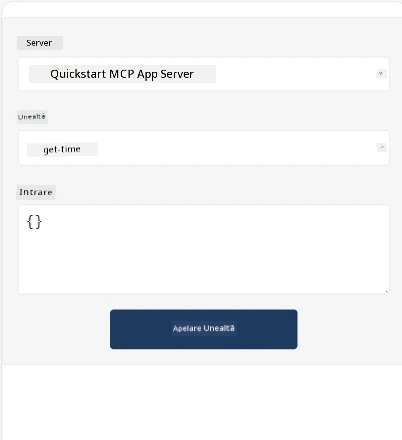
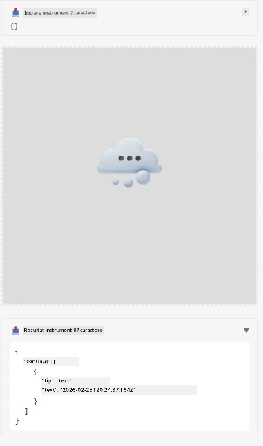

Here's a sample demonstrating MCP App

## Install 

1. Navigați la folderul *mcp-app*
1. Rulați `npm install`, asta ar trebui să instaleze dependențele frontend și backend

Verificați dacă backend-ul compilează rulând:

```sh
npx tsc --noEmit
```

Nu ar trebui să apară niciun output dacă totul este în regulă.

## Rulați backend-ul

> Acest lucru necesită puțin efort suplimentar dacă sunteți pe o mașină Windows deoarece soluția MCP Apps utilizează biblioteca `concurrently` pe care trebuie să o înlocuiți. Iată linia problematică din *package.json* pentru MCP App:

    ```json
    "start": "concurrently \"cross-env NODE_ENV=development INPUT=mcp-app.html vite build --watch\" \"tsx watch main.ts\""
    ```

Această aplicație are două părți, o parte backend și o parte host.

Porniți backend-ul apelând:

```sh
npm start
```

Aceasta ar trebui să pornească backend-ul la `http://localhost:3001/mcp`. 

> Notă, dacă sunteți într-un Codespace, poate fi nevoie să setați vizibilitatea portului ca publică. Verificați că puteți accesa endpoint-ul în browser prin https://<numele Codespace-ului>.app.github.dev/mcp

## Opțiunea -1 Testați aplicația în Visual Studio Code

Pentru a testa soluția în Visual Studio Code, procedați astfel:

- Adăugați o intrare server în `mcp.json` astfel:

    ```json
    {
        "servers": {
            "my-mcp-server-7178eca7": {
                "url": "http://localhost:3001/mcp",
                "type": "http"
            }
        },
        "inputs": []
    }
    ```

1. Apăsați butonul "start" în *mcp.json*
1. Asigurați-vă că o fereastră de chat este deschisă și tastați `get-faq`, ar trebui să vedeți un rezultat ca acesta:

    

## Opțiunea -2- Testați aplicația cu un host

Repozitoriul <https://github.com/modelcontextprotocol/ext-apps> conține mai mulți hosturi diferiți pe care îi puteți folosi pentru a testa aplicațiile MVP. 

Vă prezentăm aici două opțiuni diferite:

### Mașina locală

- Navigați la *ext-apps* după ce ați clonat repo-ul.

- Instalați dependențele

   ```sh
   npm install
   ```

- Într-o fereastră de terminal separată, navigați la *ext-apps/examples/basic-host*

    > dacă sunteți în Codespace, trebuie să navigați la serve.ts, linia 27 și să înlocuiți http://localhost:3001/mcp cu URL-ul Codespace pentru backend, de exemplu https://psychic-xylophone-657rpjgvxpc5g64-3001.app.github.dev/mcp

- Rulați host-ul:

    ```sh
    npm start
    ```

    Aceasta ar trebui să conecteze host-ul cu backend-ul și veți vedea aplicația rulând astfel:

    

### Codespace

Necesită puțin efort suplimentar pentru a face un mediu Codespace să funcționeze. Pentru a utiliza un host prin Codespace:

- Consultați directorul *ext-apps* și mergeți la *examples/basic-host*.
- Rulați `npm install` pentru a instala dependențele
- Rulați `npm start` pentru a porni host-ul.

## Testați aplicația

Încercați aplicația în următorul mod:

- Selectați butonul "Call Tool" și ar trebui să vedeți rezultatele astfel:

    

Groaznic, totul funcționează.

---

<!-- CO-OP TRANSLATOR DISCLAIMER START -->
**Declinare de responsabilitate**:  
Acest document a fost tradus folosind serviciul de traducere AI [Co-op Translator](https://github.com/Azure/co-op-translator). Deși ne străduim pentru acuratețe, vă rugăm să țineți cont că traducerile automate pot conține erori sau inexactități. Documentul original, în limba sa nativă, trebuie considerat sursa autorizată. Pentru informații critice, se recomandă traducerea profesională realizată de un specialist uman. Nu ne asumăm nicio răspundere pentru eventualele neînțelegeri sau interpretări greșite care pot apărea în urma utilizării acestei traduceri.
<!-- CO-OP TRANSLATOR DISCLAIMER END -->