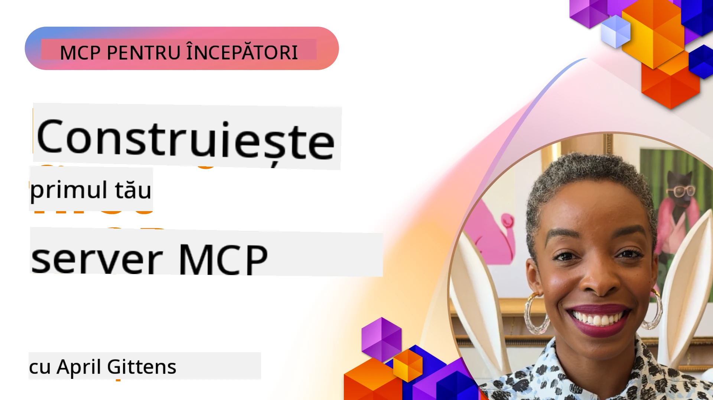

## Început  

_(Faceți clic pe imaginea de mai sus pentru a viziona videoclipul acestei lecții)_

Această secțiune constă în mai multe lecții:

- **1 Primul tău server**, în această prima lecție, vei învăța cum să creezi primul tău server și să-l inspectezi cu instrumentul inspector, o metodă valoroasă de a testa și depana serverul tău, [la lecție](01-first-server/README.md)

- **2 Client**, în această lecție, vei învăța cum să scrii un client care se poate conecta la serverul tău, [la lecție](02-client/README.md)

- **3 Client cu LLM**, o metodă și mai bună de a scrie un client este adăugând un LLM astfel încât să poată „negocia” cu serverul tău ce trebuie făcut, [la lecție](03-llm-client/README.md)

- **4 Utilizarea modului Agent GitHub Copilot al unui server în Visual Studio Code**. Aici analizăm rularea serverului nostru MCP din interiorul Visual Studio Code, [la lecție](04-vscode/README.md)

- **5 Server de transport stdio** transportul stdio este standardul recomandat pentru comunicația locală server-client MCP, oferind o comunicare sigură bazată pe subproces cu izolare integrată a proceselor [la lecție](05-stdio-server/README.md)

- **6 Streaming HTTP cu MCP (HTTP Streamingabil)**. Învață despre transportul modern de streaming HTTP (abordarea recomandată pentru serverele MCP remote conform [Specificatiei MCP 2025-11-25](https://spec.modelcontextprotocol.io/specification/2025-11-25/basic/transports/#streamable-http)), notificări de progres și cum să implementezi servere și clienți MCP scalabili și în timp real folosind HTTP Streamingabil. [la lecție](06-http-streaming/README.md)

- **7 Utilizarea AI Toolkit pentru VSCode** pentru a consuma și testa Clienții și Serverele MCP [la lecție](07-aitk/README.md)

- **8 Testare**. Aici ne vom concentra în special pe cum putem testa serverul și clientul în diferite moduri, [la lecție](08-testing/README.md)

- **9 Implementare**. Acest capitol va analiza diferite moduri de a implementa soluțiile tale MCP, [la lecție](09-deployment/README.md)

- **10 Utilizare avansată a serverului**. Acest capitol acoperă utilizarea avansată a serverului, [la lecție](./10-advanced/README.md)

- **11 Autentificare**. Acest capitol acoperă cum să adaugi autentificare simplă, de la Basic Auth la folosirea JWT și RBAC. Ești încurajat să începi de aici și apoi să consulți Temele Avansate din Capitolul 5 și să efectuezi întăriri suplimentare de securitate prin recomandările din Capitolul 2, [la lecție](./11-simple-auth/README.md)

- **12 Gazde MCP**. Configurează și folosește clienți populare MCP host, inclusiv Claude Desktop, Cursor, Cline și Windsurf. Învață tipuri de transport și depanare, [la lecție](./12-mcp-hosts/README.md)

- **13 Inspector MCP**. Depanează și testează serverele MCP interactiv folosind instrumentul MCP Inspector. Învață să rezolvi probleme legate de instrumente, resurse și mesaje de protocol, [la lecție](./13-mcp-inspector/README.md)

- **14 Eșantionare**. Creează servere MCP care colaborează cu clienții MCP în sarcini legate de LLM. [la lecție](./14-sampling/README.md)

- **15 Aplicații MCP**. Construiește servere MCP care răspund și cu instrucțiuni UI, [la lecție](./15-mcp-apps/README.md)

Model Context Protocol (MCP) este un protocol deschis care standardizează modul în care aplicațiile oferă context către LLM-uri. Gândește-te la MCP ca la un port USB-C pentru aplicații AI - oferă o metodă standardizată de conectare a modelelor AI la diferite surse de date și instrumente.

## Obiective de învățare

La finalul acestei lecții, vei putea:

- Configura medii de dezvoltare pentru MCP în C#, Java, Python, TypeScript și JavaScript
- Construi și implementa servere MCP de bază cu funcționalități personalizate (resurse, prompturi și instrumente)
- Creea aplicații host care se conectează la servere MCP
- Testa și depana implementările MCP
- Înțelege provocările comune de configurare și soluțiile acestora
- Conecta implementările MCP la servicii populare LLM

## Configurarea mediului tău MCP

Înainte de a începe să lucrezi cu MCP, este important să pregătești mediul de dezvoltare și să înțelegi fluxul de lucru de bază. Această secțiune te va ghida prin pașii inițiali pentru a asigura un start lin cu MCP.

### Cerințe preliminare

Înainte să începi dezvoltarea MCP, asigură-te că ai:

- **Mediu de dezvoltare**: Pentru limbajul ales (C#, Java, Python, TypeScript sau JavaScript)
- **IDE/Editor**: Visual Studio, Visual Studio Code, IntelliJ, Eclipse, PyCharm sau orice editor modern de cod
- **Manageri de pachete**: NuGet, Maven/Gradle, pip sau npm/yarn
- **Chei API**: Pentru orice servicii AI pe care intenționezi să le folosești în aplicațiile tale host

### SDK-uri oficiale

În capitolele următoare vei vedea soluții construite folosind Python, TypeScript, Java și .NET. Iată toate SDK-urile oficial suportate.

MCP oferă SDK-uri oficiale pentru mai multe limbaje (aliniate cu [Specificatia MCP 2025-11-25](https://spec.modelcontextprotocol.io/specification/2025-11-25/)):
- [SDK C#](https://github.com/modelcontextprotocol/csharp-sdk) - Menținut în colaborare cu Microsoft
- [SDK Java](https://github.com/modelcontextprotocol/java-sdk) - Menținut în colaborare cu Spring AI
- [SDK TypeScript](https://github.com/modelcontextprotocol/typescript-sdk) - Implementarea oficială TypeScript
- [SDK Python](https://github.com/modelcontextprotocol/python-sdk) - Implementarea oficială Python (FastMCP)
- [SDK Kotlin](https://github.com/modelcontextprotocol/kotlin-sdk) - Implementarea oficială Kotlin
- [SDK Swift](https://github.com/modelcontextprotocol/swift-sdk) - Menținut în colaborare cu Loopwork AI
- [SDK Rust](https://github.com/modelcontextprotocol/rust-sdk) - Implementarea oficială Rust
- [SDK Go](https://github.com/modelcontextprotocol/go-sdk) - Implementarea oficială Go

## Concluzii cheie

- Configurarea unui mediu de dezvoltare MCP este simplă cu SDK-uri specifice limbajelor
- Construirea serverelor MCP implică crearea și înregistrarea de instrumente cu scheme clare
- Clienții MCP se conectează la servere și modele pentru a valorifica capabilități extinse
- Testarea și depanarea sunt esențiale pentru implementări MCP fiabile
- Opțiunile de implementare variază de la dezvoltare locală la soluții bazate pe cloud

## Practică

Avem un set de exemple care completează exercițiile pe care le vei vedea în toate capitolele acestei secțiuni. În plus, fiecare capitol are proprii săi exerciții și teme.

- [Calculator Java](./samples/java/calculator/README.md)
- [Calculator .Net](../../../03-GettingStarted/samples/csharp)
- [Calculator JavaScript](./samples/javascript/README.md)
- [Calculator TypeScript](./samples/typescript/README.md)
- [Calculator Python](../../../03-GettingStarted/samples/python)

## Resurse suplimentare

- [Construirea de Agenți folosind Model Context Protocol pe Azure](https://learn.microsoft.com/azure/developer/ai/intro-agents-mcp)
- [MCP remote cu Azure Container Apps (Node.js/TypeScript/JavaScript)](https://learn.microsoft.com/samples/azure-samples/mcp-container-ts/mcp-container-ts/)
- [Agent MCP OpenAI .NET](https://learn.microsoft.com/samples/azure-samples/openai-mcp-agent-dotnet/openai-mcp-agent-dotnet/)

## Ce urmează

Începe cu prima lecție: [Crearea primului tău server MCP](01-first-server/README.md)

După ce ai terminat acest modul, continuă cu: [Modulul 4: Implementare practică](../04-PracticalImplementation/README.md)

---

<!-- CO-OP TRANSLATOR DISCLAIMER START -->
**Declinare de responsabilitate**:  
Acest document a fost tradus folosind serviciul de traducere AI [Co-op Translator](https://github.com/Azure/co-op-translator). Deși ne străduim pentru acuratețe, vă rugăm să rețineți că traducerile automate pot conține erori sau inexactități. Documentul original în limba sa nativă trebuie considerat sursa autoritară. Pentru informații critice, se recomandă traducerea profesională realizată de un specialist uman. Nu ne asumăm răspunderea pentru eventualele neînțelegeri sau interpretări greșite rezultate din utilizarea acestei traduceri.
<!-- CO-OP TRANSLATOR DISCLAIMER END -->