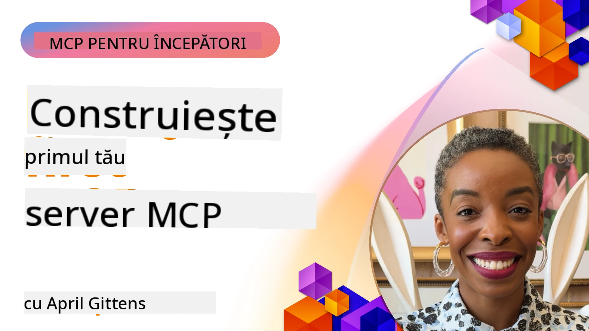

## Începutul  

_(Faceți clic pe imaginea de mai sus pentru a vedea videoclipul acestei lecții)_

Această secțiune constă din mai multe lecții:

- **1 Primul tău server**, în această primă lecție vei învăța cum să creezi primul server și să-l inspectezi cu instrumentul inspector, o metodă valoroasă pentru testarea și depanarea serverului tău, [la lecție](01-first-server/README.md)

- **2 Client**, în această lecție vei învăța cum să scrii un client care poate să se conecteze la serverul tău, [la lecție](02-client/README.md)

- **3 Client cu LLM**, o metodă și mai bună de a scrie un client este să adaugi un LLM astfel încât să poată "negocia" cu serverul tău ce trebuie făcut, [la lecție](03-llm-client/README.md)

- **4 Consumând modul Agent GitHub Copilot al serverului în Visual Studio Code**. Aici explorăm rularea serverului MCP din interiorul Visual Studio Code, [la lecție](04-vscode/README.md)

- **5 Server de transport stdio** stdio transport este standardul recomandat pentru comunicarea locală între server MCP și client, oferind comunicare securizată bazată pe subproces cu izolare integrată a procesului [la lecție](05-stdio-server/README.md)

- **6 Streaming HTTP cu MCP (HTTP Streamabil)**. Află despre transportul
	standard de la distanță în [Specificația MCP 2026-07-28](https://modelcontextprotocol.io/specification/2026-07-28/basic/transports/streamable-http),
	plus implementarea veche bazată pe sesiuni păstrată în lecție.
	[la lecție](06-http-streaming/README.md)

- **7 Utilizarea AI Toolkit pentru VSCode** pentru a consuma și testa clienții și serverele MCP [la lecție](07-aitk/README.md)

- **8 Testare**. Aici ne vom concentra în special pe cum putem testa serverul și clientul nostru în diferite moduri, [la lecție](08-testing/README.md)

- **9 Implementare**. Acest capitol examinează diferite metode de a implementa soluțiile tale MCP, [la lecție](09-deployment/README.md)

- **10 Utilizare avansată a serverului**. Acest capitol acoperă utilizarea avansată a serverului, [la lecție](./10-advanced/README.md)

- **11 Autentificare**. Acest capitol acoperă cum să adaugi autentificare simplă, de la Basic Auth la utilizarea JWT și RBAC. Ești încurajat să începi aici, apoi să explorezi Subiectele avansate din Capitolul 5 și să aplici întăriri suplimentare de securitate conform recomandărilor din Capitolul 2, [la lecție](./11-simple-auth/README.md)

- **12 Gazde MCP**. Configurează și folosește clienți populari MCP host incluzând Claude Desktop, Cursor, Cline și Windsurf. Află despre tipuri de transport și depanare, [la lecție](./12-mcp-hosts/README.md)

- **13 Inspector MCP**. Depanează și testează serverele tale MCP interactiv folosind instrumentul MCP Inspector. Învață să rezolvi problemele cu instrumentele, resursele și mesajele protocolului, [la lecție](./13-mcp-inspector/README.md)

- **14 Sampling**. Învață primitiva veche Sampling pentru `2025-11-25` și
	cum să migrezi noile concepte la integrarea directă cu furnizorul LLM. Sampling este
	depreciat în MCP `2026-07-28`. [la lecție](./14-sampling/README.md)

- **15 Aplicații MCP**. Construiește servere MCP care răspund și cu instrucțiuni UI, [la lecție](./15-mcp-apps/README.md)

Protocolul Model Context (MCP) este un protocol deschis care standardizează modul în care aplicațiile oferă context pentru LLM-uri. Gândește-te la MCP ca la un port USB-C pentru aplicațiile AI - oferă o metodă standardizată de a conecta modelele AI la diferite surse de date și instrumente.

## Obiective de învățare

La finalul acestei lecții vei fi capabil să:

- Configurezi mediile de dezvoltare pentru MCP în C#, Java, Python, TypeScript și JavaScript
- Construiești și implementezi servere MCP de bază cu funcționalități personalizate (resurse, prompturi și instrumente)
- Creezi aplicații host care se conectează la serverele MCP
- Testezi și depanezi implementările MCP
- Înțelegi provocările comune de configurare și soluțiile lor
- Conectezi implementările MCP la servicii LLM populare

## Configurarea mediului tău MCP

Înainte de a începe să lucrezi cu MCP, este important să-ți pregătești mediul de dezvoltare și să înțelegi fluxul de lucru de bază. Această secțiune te va ghida prin pașii inițiali pentru a asigura un început fără probleme cu MCP.

### Cerințe preliminare

Înainte de a te apuca de dezvoltarea MCP, asigură-te că ai:

- **Mediul de dezvoltare**: Pentru limbajul ales (C#, Java, Python, TypeScript sau JavaScript)
- **IDE/Editor**: Visual Studio, Visual Studio Code, IntelliJ, Eclipse, PyCharm sau orice editor de cod modern
- **Manageri de pachete**: NuGet, Maven/Gradle, pip sau npm/yarn
- **Chei API**: Pentru orice servicii AI pe care plănuiești să le folosești în aplicațiile tale host

### SDK-uri oficiale

În capitolele următoare vei vedea soluții construite utilizând Python, TypeScript,
Java și .NET. Iată SDK-urile oficiale.

Suportul SDK pentru MCP `2026-07-28` este lansat independent pe limbaje.
Înainte să rulezi un exemplu, verifică versiunea pachetului și notele de lansare
ale SDK pentru reviziile protocolului suportate. Vezi
[lista oficială SDK](https://modelcontextprotocol.io/docs/sdk):
- [SDK C#](https://github.com/modelcontextprotocol/csharp-sdk) - Mentenanță în colaborare cu Microsoft
- [SDK Java](https://github.com/modelcontextprotocol/java-sdk) - Mentenanță în colaborare cu Spring AI
- [SDK TypeScript](https://github.com/modelcontextprotocol/typescript-sdk) - Implementarea oficială TypeScript
- [SDK Python](https://github.com/modelcontextprotocol/python-sdk) - Implementarea oficială Python (FastMCP)
- [SDK Kotlin](https://github.com/modelcontextprotocol/kotlin-sdk) - Implementarea oficială Kotlin
- [SDK Swift](https://github.com/modelcontextprotocol/swift-sdk) - Mentenanță în colaborare cu Loopwork AI
- [SDK Rust](https://github.com/modelcontextprotocol/rust-sdk) - Implementarea oficială Rust
- [SDK Go](https://github.com/modelcontextprotocol/go-sdk) - Implementarea oficială Go

## Puncte cheie

- Configurarea unui mediu de dezvoltare MCP este simplă cu SDK-uri specifice fiecărui limbaj
- Construirea serverelor MCP implică crearea și înregistrarea de instrumente cu scheme clare
- Clienții MCP se conectează la servere și modele pentru a valorifica capabilități extinse
- Testarea și depanarea sunt esențiale pentru implementări MCP fiabile
- Opțiunile de implementare variază de la dezvoltare locală la soluții cloud

## Exersarea

Avem un set de exemple care completează exercițiile pe care le vei vedea în toate capitolele din această secțiune. În plus, fiecare capitol are și propriile exerciții și teme

- [Calculator Java](./samples/java/calculator/README.md)
- [Calculator .NET](../../../03-GettingStarted/samples/csharp)
- [Calculator JavaScript](./samples/javascript/README.md)
- [Calculator TypeScript](./samples/typescript/README.md)
- [Calculator Python](../../../03-GettingStarted/samples/python)

## Resurse suplimentare

- [Construiește agenți folosind Model Context Protocol pe Azure](https://learn.microsoft.com/azure/developer/ai/intro-agents-mcp)
- [MCP la distanță cu Azure Container Apps (Node.js/TypeScript/JavaScript)](https://learn.microsoft.com/samples/azure-samples/mcp-container-ts/mcp-container-ts/)
- [Agent MCP OpenAI .NET](https://learn.microsoft.com/samples/azure-samples/openai-mcp-agent-dotnet/openai-mcp-agent-dotnet/)

## Ce urmează

Începe cu prima lecție: [Crearea primului tău server MCP](01-first-server/README.md)

După ce ai terminat acest modul, continuă cu: [Modulul 4: Implementarea practică](../04-PracticalImplementation/README.md)

---

<!-- CO-OP TRANSLATOR DISCLAIMER START -->
**Declinare a responsabilității**:
Acest document a fost tradus folosind serviciul de traducere AI [Co-op Translator](https://github.com/Azure/co-op-translator). În timp ce ne străduim pentru acuratețe, vă rugăm să rețineți că traducerile automate pot conține erori sau inexactități. Documentul original în limba sa nativă trebuie considerat sursa autorizată. Pentru informații critice, se recomandă traducerea profesională realizată de un om. Nu ne asumăm responsabilitatea pentru eventualele neînțelegeri sau interpretări greșite care decurg din utilizarea acestei traduceri.
<!-- CO-OP TRANSLATOR DISCLAIMER END -->