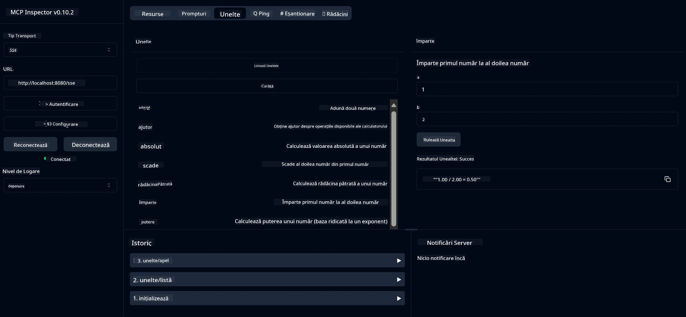

# Serviciu Calculator de Bază MCP

> [!NOTE]
> Acest exemplu folosește transportul HTTP+SSE vechi și țintește un SDK compatibil
> cu MCP `2025-11-25`. Noile servere la distanță ar trebui să utilizeze suportul HTTP Streamable
> `2026-07-28`.

Acest serviciu oferă operații de calculator de bază prin Protocolul Contextului Modelului (MCP) folosind Spring Boot cu transport WebFlux. Este conceput ca un exemplu simplu pentru începătorii care învață despre implementările MCP.

Pentru mai multe informații, consultați documentația de referință [MCP Server Boot Starter](https://docs.spring.io/spring-ai/reference/api/mcp/mcp-server-boot-starter-docs.html).

## Prezentare generală

Serviciul demonstrează:
- Suport pentru SSE (Server-Sent Events)
- Înregistrare automată a instrumentelor folosind adnotarea `@Tool` din Spring AI
- Funcții de calculator de bază:
  - Adunare, scădere, înmulțire, împărțire
  - Calcul putere și rădăcină pătrată
  - Modul (rest) și valoare absolută
  - Funcție de ajutor pentru descrierea operațiilor

## Caracteristici

Acest serviciu de calculator oferă următoarele capabilități:

1. **Operații aritmetice de bază**:
   - Adunarea a două numere
   - Scăderea unui număr din altul
   - Înmulțirea a două numere
   - Împărțirea unui număr la altul (cu verificare la împărțirea la zero)

2. **Operații avansate**:
   - Calculul puterii (ridicarea bazei la un exponent)
   - Calculul rădăcinii pătrate (cu verificare pentru numere negative)
   - Calculul modulului (restului)
   - Calculul valorii absolute

3. **Sistem de ajutor**:
   - Funcție de ajutor integrată care explică toate operațiile disponibile

## Utilizarea Serviciului

Serviciul expune următoarele puncte finale API prin protocolul MCP:

- `add(a, b)`: Adună două numere
- `subtract(a, b)`: Scade al doilea număr din primul
- `multiply(a, b)`: Înmulțește două numere
- `divide(a, b)`: Împarte primul număr la al doilea (cu verificare zero)
- `power(base, exponent)`: Calculează puterea unui număr
- `squareRoot(number)`: Calculează rădăcina pătrată (cu verificare număr negativ)
- `modulus(a, b)`: Calculează restul împărțirii
- `absolute(number)`: Calculează valoarea absolută
- `help()`: Obține informații despre operațiile disponibile

## Client de Testare

Un client simplu de testare este inclus în pachetul `com.microsoft.mcp.sample.client`. Clasa `SampleCalculatorClient` demonstrează operațiile disponibile ale serviciului de calculator.

## Utilizarea Clientului LangChain4j

Proiectul include un client exemplu LangChain4j în `com.microsoft.mcp.sample.client.LangChain4jClient` care demonstrează cum să integrezi serviciul de calculator cu LangChain4j și modelele GitHub:

### Cerințe prealabile

1. **Configurare Token GitHub**:
   
   Pentru a folosi modelele AI GitHub (precum phi-4), ai nevoie de un token de acces personal GitHub:

   a. Mergi în setările contului tău GitHub: https://github.com/settings/tokens
   
   b. Apasă pe "Generate new token" → "Generate new token (classic)"
   
   c. Dă token-ului un nume descriptiv
   
   d. Selectează următoarele permisiuni:
      - `repo` (Control complet asupra depozitelor private)
      - `read:org` (Citire organizație și membri echipe, citire proiecte organizație)
      - `gist` (Creare gists)
      - `user:email` (Acces la adresele de email ale utilizatorilor (doar citire))
   
   e. Click pe "Generate token" și copiază token-ul nou generat
   
   f. Setează-l ca variabilă de mediu:
      
      Pe Windows:
      ```
      set GITHUB_TOKEN=your-github-token
      ```
      
      Pe macOS/Linux:
      ```bash
      export GITHUB_TOKEN=your-github-token
      ```

   g. Pentru setare persistentă, adaugă-l în variabilele de mediu prin setările sistemului

2. Adaugă dependența LangChain4j GitHub în proiectul tău (deja inclusă în pom.xml):
   ```xml
   <dependency>
       <groupId>dev.langchain4j</groupId>
       <artifactId>langchain4j-github</artifactId>
       <version>${langchain4j.version}</version>
   </dependency>
   ```

3. Asigură-te că serverul calculator este pornit pe `localhost:8080`

### Rularea Clientului LangChain4j

Acest exemplu demonstrează:
- Conectarea la serverul MCP calculator prin transport SSE
- Folosirea LangChain4j pentru a crea un chatbot care folosește operațiile calculatorului
- Integrarea cu modelele AI GitHub (folosind acum modelul phi-4)

Clientul trimite următoarele interogări de probă pentru a demonstra funcționalitatea:
1. Calcularea sumei a două numere
2. Găsirea rădăcinii pătrate a unui număr
3. Obținerea informațiilor de ajutor despre operațiile disponibile ale calculatorului

Rulează exemplul și verifică ieșirea din consolă pentru a vedea cum modelul AI folosește instrumentele calculatorului pentru a răspunde la interogări.

### Configurarea Modelului GitHub

Clientul LangChain4j este configurat să folosească modelul phi-4 GitHub cu următoarele setări:

```java
ChatLanguageModel model = GitHubChatModel.builder()
    .apiKey(System.getenv("GITHUB_TOKEN"))
    .timeout(Duration.ofSeconds(60))
    .modelName("phi-4")
    .logRequests(true)
    .logResponses(true)
    .build();
```

Pentru a folosi modele GitHub diferite, modifică pur și simplu parametrul `modelName` la un alt model suportat (de ex., "claude-3-haiku-20240307", "llama-3-70b-8192", etc.).

## Dependențe

Proiectul necesită următoarele dependențe cheie:

```xml
<!-- For MCP Server -->
<dependency>
    <groupId>org.springframework.ai</groupId>
    <artifactId>spring-ai-starter-mcp-server-webflux</artifactId>
</dependency>

<!-- For LangChain4j integration -->
<dependency>
    <groupId>dev.langchain4j</groupId>
    <artifactId>langchain4j-mcp</artifactId>
    <version>${langchain4j.version}</version>
</dependency>

<!-- For GitHub models support -->
<dependency>
    <groupId>dev.langchain4j</groupId>
    <artifactId>langchain4j-github</artifactId>
    <version>${langchain4j.version}</version>
</dependency>
```

## Construirea Proiectului

Construiește proiectul folosind Maven:
```bash
./mvnw clean install -DskipTests
```

## Rularea Serverului

### Folosind Java

```bash
java -jar target/calculator-server-0.0.1-SNAPSHOT.jar
```

### Folosind MCP Inspector

MCP Inspector este un instrument util pentru interacțiunea cu serviciile MCP. Pentru a-l folosi cu acest serviciu calculator:

1. **Instalează și pornește MCP Inspector** într-o fereastră nouă de terminal:
   ```bash
   npx @modelcontextprotocol/inspector
   ```

2. **Accesează interfața web** dând click pe URL-ul afișat de aplicație (de obicei http://localhost:6274)

3. **Configurează conexiunea**:
   - Setează tipul de transport la "SSE"
   - Setează URL-ul pentru endpoint-ul SSE al serverului tău: `http://localhost:8080/sse`
   - Apasă "Connect"

4. **Folosește instrumentele**:
   - Apasă "List Tools" pentru a vedea operațiile calculatorului disponibile
   - Selectează un instrument și apasă "Run Tool" pentru a executa o operație



### Folosind Docker

Proiectul include un Dockerfile pentru implementarea containerizată:

1. **Construiește imaginea Docker**:
   ```bash
   docker build -t calculator-mcp-service .
   ```

2. **Rulează containerul Docker**:
   ```bash
   docker run -p 8080:8080 calculator-mcp-service
   ```

Aceasta va:
- Construi o imagine Docker multi-stadiu cu Maven 3.9.9 și Eclipse Temurin 24 JDK
- Crea o imagine container optimizată
- Expune serviciul pe portul 8080
- Porni serviciul MCP calculator în interiorul containerului

Poți accesa serviciul la `http://localhost:8080` odată ce containerul este pornit.

## Depanare

### Probleme comune cu token-ul GitHub

1. **Probleme de permisiuni ale token-ului**: Dacă primești o eroare 403 Forbidden, verifică dacă token-ul tău are permisiunile corecte conform cerințelor prealabile.

2. **Token neînregistrat**: Dacă primești o eroare „No API key found”, asigură-te că variabila de mediu GITHUB_TOKEN este setată corect.

3. **Limitare de rată**: API-ul GitHub are limite de acces. Dacă întâlnești o eroare de tip limită de rată (cod de stare 429), așteaptă câteva minute înainte să încerci din nou.

4. **Expirarea token-ului**: Token-urile GitHub pot expira. Dacă primești erori de autentificare după o perioadă, generează un token nou și actualizează variabila de mediu.

Dacă ai nevoie de asistență suplimentară, consultă [documentația LangChain4j](https://github.com/langchain4j/langchain4j) sau [documentația API GitHub](https://docs.github.com/en/rest).

---

<!-- CO-OP TRANSLATOR DISCLAIMER START -->
**Declinare a responsabilității**:
Acest document a fost tradus folosind serviciul de traducere AI [Co-op Translator](https://github.com/Azure/co-op-translator). În timp ce ne străduim pentru acuratețe, vă rugăm să rețineți că traducerile automate pot conține erori sau inexactități. Documentul original în limba sa nativă trebuie considerat sursa autorizată. Pentru informații critice, se recomandă traducerea profesională realizată de un om. Nu ne asumăm responsabilitatea pentru eventualele neînțelegeri sau interpretări greșite care decurg din utilizarea acestei traduceri.
<!-- CO-OP TRANSLATOR DISCLAIMER END -->