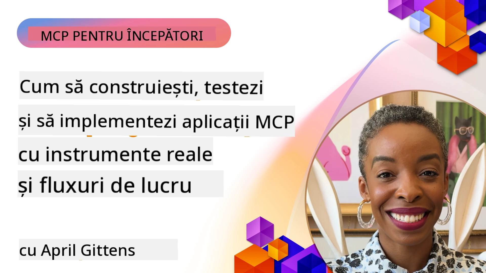

# Implementare practică

[](https://youtu.be/vCN9-mKBDfQ)

_(Click pe imaginea de mai sus pentru a viziona videoclipul acestei lecții)_

Implementarea practică este locul unde puterea Model Context Protocol (MCP) devine tangibilă. Deși înțelegerea teoriei și arhitecturii din spatele MCP este importantă, valoarea reală apare atunci când aplici aceste concepte pentru a construi, testa și implementa soluții care rezolvă probleme din lumea reală. Acest capitol face legătura între cunoștințele conceptuale și dezvoltarea practică, ghidându-te prin procesul de aducere la viață a aplicațiilor bazate pe MCP.

Indiferent dacă dezvolți asistenți inteligenți, integrezi AI în fluxuri de lucru de afaceri sau construiești unelte personalizate pentru procesarea datelor, MCP oferă o fundație flexibilă. Designul său independent de limbaj și SDK-urile oficiale pentru limbaje populare de programare îl fac accesibil pentru o gamă largă de dezvoltatori. Folosind aceste SDK-uri, poți prototipa rapid, itera și scala soluțiile tale pe diferite platforme și medii.

În secțiunile următoare vei găsi exemple practice, cod de probă și strategii de implementare care demonstrează cum să implementezi MCP în C#, Java cu Spring, TypeScript, JavaScript și Python. De asemenea, vei învăța cum să depanezi și să testezi serverele MCP, să gestionezi API-urile și să implementezi soluții în cloud folosind Azure. Aceste resurse practice sunt concepute să accelereze învățarea și să te ajute să construiești cu încredere aplicații MCP robuste, pregătite pentru producție.

## Prezentare generală

Această lecție se concentrează pe aspectele practice ale implementării MCP în mai multe limbaje de programare. Vom explora cum să folosești SDK-urile MCP în C#, Java cu Spring, TypeScript, JavaScript și Python pentru a construi aplicații robuste, a depana și testa serverele MCP și a crea resurse, prompturi și unelte reutilizabile.

## Obiective de învățare

La finalul acestei lecții vei putea să:

- Implementezi soluții MCP folosind SDK-urile oficiale în diverse limbaje de programare
- Depanezi și testezi sistematic serverele MCP
- Creezi și folosești caracteristici ale serverului (Resurse, Prompturi și Unelte)
- Proiectezi fluxuri de lucru MCP eficiente pentru sarcini complexe
- Optimizezi implementările MCP pentru performanță și fiabilitate

## Resurse SDK oficiale

Model Context Protocol oferă SDK-uri oficiale pentru mai multe limbaje (aliniate cu [Specificația MCP 2025-11-25](https://spec.modelcontextprotocol.io/specification/2025-11-25/)):

- [SDK C#](https://github.com/modelcontextprotocol/csharp-sdk)
- [SDK Java cu Spring](https://github.com/modelcontextprotocol/java-sdk) **Notă:** necesită dependență de [Project Reactor](https://projectreactor.io). (Vezi [discuția issue 246](https://github.com/orgs/modelcontextprotocol/discussions/246).)
- [SDK TypeScript](https://github.com/modelcontextprotocol/typescript-sdk)
- [SDK Python](https://github.com/modelcontextprotocol/python-sdk)
- [SDK Kotlin](https://github.com/modelcontextprotocol/kotlin-sdk)
- [SDK Go](https://github.com/modelcontextprotocol/go-sdk)

## Lucrul cu SDK-urile MCP

Această secțiune oferă exemple practice de implementare MCP în mai multe limbaje de programare. Poți găsi cod de probă în directorul `samples` organizat pe limbaje.

### Exemple disponibile

Repositorul include [implementări de probă](../../../04-PracticalImplementation/samples) în următoarele limbaje:

- [C#](./samples/csharp/README.md)
- [Java cu Spring](./samples/java/containerapp/README.md)
- [TypeScript](./samples/typescript/README.md)
- [JavaScript](./samples/javascript/README.md)
- [Python](./samples/python/README.md)

Fiecare exemplu demonstrează concepte cheie MCP și modele de implementare pentru limbajul și ecosistemul respectiv.

### Ghiduri practice

Ghiduri suplimentare pentru implementarea practică MCP:

- [Paginare și seturi mari de rezultate](./pagination/README.md) - Gestionarea paginării bazate pe cursor pentru unelte, resurse și seturi mari de date

## Caracteristici principale ale serverului

Serverele MCP pot implementa orice combinație a acestor caracteristici:

### Resurse

Resursele oferă context și date pentru utilizator sau modelul AI:

- Repozitoare de documente
- Baze de cunoștințe
- Surse de date structurate
- Sisteme de fișiere

### Prompturi

Prompturile sunt mesaje șablon și fluxuri de lucru pentru utilizatori:

- Șabloane predefinite de conversații
- Tipare ghidate de interacțiune
- Structuri de dialog specializate

### Unelte

Uneltele sunt funcții pentru modelul AI de executat:

- Utilitare de procesare a datelor
- Integrări API externe
- Capacități computaționale
- Funcționalitate de căutare

## Implementări de probă: Implementare C#

Repositorul oficial SDK C# conține mai multe implementări de probă care demonstrează diferite aspecte MCP:

- **Client MCP de bază**: Exemplu simplu care arată cum să creezi un client MCP și să apelezi unelte
- **Server MCP de bază**: Implementare minimală a unui server cu înregistrare de unelte de bază
- **Server MCP avansat**: Server complet echipat cu înregistrare de unelte, autentificare și gestionare a erorilor
- **Integrare ASP.NET**: Exemple care demonstrează integrarea cu ASP.NET Core
- **Modele de implementare a uneltelor**: Diverse modele pentru implementarea uneltelor cu diferite nivele de complexitate

SDK-ul MCP C# este în preview și API-urile pot suferi modificări. Vom actualiza continuu acest blog pe măsură ce SDK-ul evoluează.

### Caracteristici cheie

- [Nuget ModelContextProtocol pentru C#](https://www.nuget.org/packages/ModelContextProtocol)
- Construirea [primului tău server MCP](https://devblogs.microsoft.com/dotnet/build-a-model-context-protocol-mcp-server-in-csharp/).

Pentru implementări complete în C#, vizitează [repositoriul oficial de exemple SDK C#](https://github.com/modelcontextprotocol/csharp-sdk)

## Implementare de probă: Implementare Java cu Spring

SDK-ul Java cu Spring oferă opțiuni robuste pentru implementarea MCP cu caracteristici enterprise-grade.

### Caracteristici cheie

- Integrare Spring Framework
- Siguranță puternică a tipurilor
- Suport pentru programare reactivă
- Gestionare completă a erorilor

Pentru un exemplu complet de implementare Java cu Spring, vezi [exemplul Java cu Spring](samples/java/containerapp/README.md) din directorul de exemple.

## Implementare de probă: Implementare JavaScript

SDK-ul JavaScript oferă o abordare ușoară și flexibilă pentru implementarea MCP.

### Caracteristici cheie

- Suport Node.js și browser
- API bazat pe Promise
- Integrare ușoară cu Express și alte framework-uri
- Suport WebSocket pentru streaming

Pentru un exemplu complet de implementare JavaScript, vezi [exemplul JavaScript](samples/javascript/README.md) în directorul de exemple.

## Implementare de probă: Implementare Python

SDK-ul Python oferă o abordare pythonică pentru implementarea MCP cu integrări excelente pentru framework-uri ML.

### Caracteristici cheie

- Suport async/await cu asyncio
- Integrare FastAPI``
- Înregistrare simplă a uneltelor
- Integrare nativă cu librării ML populare

Pentru un exemplu complet de implementare Python, vezi [exemplul Python](samples/python/README.md) în directorul de exemple.

## Gestionarea API-urilor

Azure API Management este o soluție excelentă pentru securizarea serverelor MCP. Ideea este să pui o instanță Azure API Management în fața serverului tău MCP și să lași aceasta să gestioneze caracteristici pe care probabil le dorești, cum ar fi:

- limitarea ratei
- gestionarea token-urilor
- monitorizare
- echilibrare a încărcării
- securitate

### Exemplu Azure

Iată un exemplu Azure care face exact asta, adică [crearea unui server MCP și securizarea lui cu Azure API Management](https://github.com/Azure-Samples/remote-mcp-apim-functions-python).

Vezi cum are loc fluxul de autorizare în imaginea de mai jos:


În imaginea de mai sus, se petrec următoarele:

- Are loc autentificarea/autorizarea utilizând Microsoft Entra.
- Azure API Management acționează ca un gateway și folosește politici pentru a direcționa și gestiona traficul.
- Azure Monitor înregistrează toate cererile pentru analiza ulterioară.

#### Fluxul de autorizare

Să aruncăm o privire mai detaliată asupra fluxului de autorizare:


#### Specificația autorizării MCP

Află mai multe despre [specificația autorizării MCP](https://spec.modelcontextprotocol.io/specification/2025-11-25/basic/authorization/)

## Implementarea serverului MCP Remote pe Azure

Să vedem dacă putem implementa exemplul menționat anterior:

1. Clonează repository-ul

    ```bash
    git clone https://github.com/Azure-Samples/remote-mcp-apim-functions-python.git
    cd remote-mcp-apim-functions-python
    ```

1. Înregistrează providerul de resurse `Microsoft.App`.

   - Dacă folosești Azure CLI, rulează `az provider register --namespace Microsoft.App --wait`.
   - Dacă folosești Azure PowerShell, rulează `Register-AzResourceProvider -ProviderNamespace Microsoft.App`. Apoi rulează `(Get-AzResourceProvider -ProviderNamespace Microsoft.App).RegistrationState` după un timp pentru a verifica dacă înregistrarea s-a finalizat.

1. Rulează această comandă [azd](https://aka.ms/azd) pentru a provisiona serviciul API Management, aplicația Function (cu cod) și toate celelalte resurse Azure necesare

    ```shell
    azd up
    ```

    Această comandă ar trebui să deploy-eze toate resursele în cloud pe Azure

### Testarea serverului cu MCP Inspector

1. Într-o **fereastră de terminal nouă**, instalează și rulează MCP Inspector

    ```shell
    npx @modelcontextprotocol/inspector
    ```

    Ar trebui să vezi o interfață similară cu:

    

1. Click CTRL pentru a încărca aplicația web MCP Inspector de la URL-ul afișat de aplicație (de ex. [http://127.0.0.1:6274/#resources](http://127.0.0.1:6274/#resources))
1. Setează tipul de transport la `SSE`
1. Setează URL-ul la endpoint-ul tău API Management SSE afișat după comanda `azd up` și apăsă **Connect**:

    ```shell
    https://<apim-servicename-from-azd-output>.azure-api.net/mcp/sse
    ```

1. **Listare unelte**. Click pe o unealtă și **Rulează unealta**.  

Dacă toate pașii au funcționat, acum ar trebui să fii conectat la serverul MCP și să fi reușit să apelezi o unealtă.

## Servere MCP pentru Azure

[Remote-mcp-functions](https://github.com/Azure-Samples/remote-mcp-functions-dotnet): Acest set de repositorii sunt template-uri de pornire rapidă pentru construirea și implementarea serverelor MCP (Model Context Protocol) personalizate la distanță utilizând Azure Functions cu Python, C# .NET sau Node/TypeScript.

Sample-urile oferă o soluție completă care permite dezvoltatorilor să:

- Dezvolte și ruleze local: Dezvoltă și depanează un server MCP pe o mașină locală
- Implementeze în Azure: Deploy facil în cloud cu o comandă simplă azd up
- Conecteze de la clienți: Conectare la serverul MCP de la diverși clienți, inclusiv modul agent Copilot din VS Code și unealta MCP Inspector

### Caracteristici cheie

- Securitate prin design: Serverul MCP este securizat folosind chei și HTTPS
- Opțiuni de autentificare: Suportă OAuth folosind autentificare încorporată și/sau API Management
- Izolare a rețelei: Permite izolarea rețelei folosind Azure Virtual Networks (VNET)
- Arhitectură serverless: Folosește Azure Functions pentru execuție scalabilă și bazată pe evenimente
- Dezvoltare locală: Suport complet pentru dezvoltare și depanare locală
- Implementare simplă: Proces simplificat de deploy în Azure

Repository-ul include toate fișierele de configurare necesare, codul sursă și definițiile infrastructurii pentru a începe rapid cu o implementare MCP pregătită pentru producție.

- [Azure Remote MCP Functions Python](https://github.com/Azure-Samples/remote-mcp-functions-python) - Exemplu de implementare MCP folosind Azure Functions cu Python

- [Azure Remote MCP Functions .NET](https://github.com/Azure-Samples/remote-mcp-functions-dotnet) - Exemplu de implementare MCP folosind Azure Functions cu C# .NET

- [Azure Remote MCP Functions Node/Typescript](https://github.com/Azure-Samples/remote-mcp-functions-typescript) - Exemplu de implementare MCP folosind Azure Functions cu Node/TypeScript.

## Concluzii importante

- SDK-urile MCP oferă unelte specifice limbajului pentru implementarea soluțiilor MCP robuste
- Procesul de depanare și testare este critic pentru aplicații MCP fiabile
- Șabloanele prompt reutilizabile permit interacțiuni AI consistente
- Fluxurile de lucru bine proiectate pot orchestra sarcini complexe folosind unelte multiple
- Implementarea soluțiilor MCP necesită atenție asupra securității, performanței și gestionării erorilor

## Exercițiu

Proiectează un flux de lucru MCP practic care abordează o problemă reală din domeniul tău:

1. Identifică 3-4 unelte care ar fi utile pentru rezolvarea acestei probleme
2. Creează un diagramă de flux care să arate cum interacționează aceste unelte
3. Implementează o versiune de bază a uneia dintre unelte folosind limbajul tău preferat
4. Creează un șablon de prompt care să ajute modelul să folosească eficient unealta ta

## Resurse suplimentare

---

## Ce urmează

Următorul capitol: [Subiecte Avansate](../05-AdvancedTopics/README.md)

---

<!-- CO-OP TRANSLATOR DISCLAIMER START -->
**Declinare de responsabilitate**:
Acest document a fost tradus folosind serviciul de traducere AI [Co-op Translator](https://github.com/Azure/co-op-translator). Deși ne străduim pentru acuratețe, vă rugăm să fiți conștienți că traducerile automate pot conține erori sau inexactități. Documentul original în limba sa nativă trebuie considerat sursa autorizată. Pentru informații critice, se recomandă traducerea profesională realizată de un specialist uman. Nu ne asumăm responsabilitatea pentru eventualele neînțelegeri sau interpretări greșite rezultate din utilizarea acestei traduceri.
<!-- CO-OP TRANSLATOR DISCLAIMER END -->