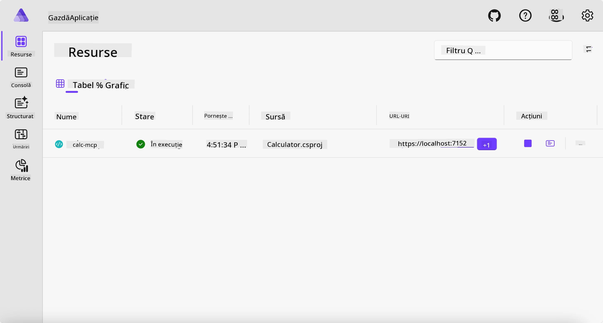
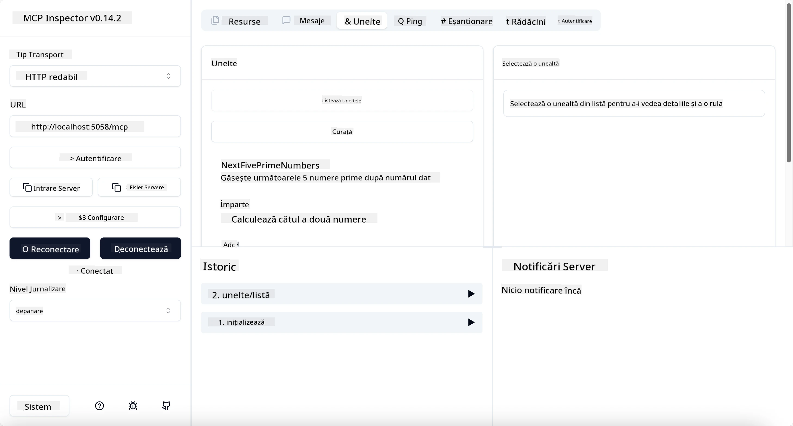
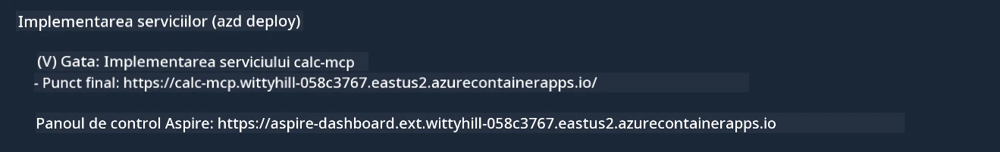

# Exemplu

Exemplul anterior arată cum să folosești un proiect .NET local cu tipul `stdio`. Și cum să rulezi serverul local într-un container. Aceasta este o soluție bună în multe situații. Totuși, poate fi util să ai serverul care rulează de la distanță, cum ar fi într-un mediu cloud. Aici intervine tipul `http`.

Uitându-ne la soluția din folderul `04-PracticalImplementation`, poate părea mult mai complexă decât cea precedentă. Dar în realitate, nu este. Dacă privești cu atenție proiectul `src/Calculator`, vei vedea că este în mare parte același cod ca în exemplul anterior. Singura diferență este că folosim o bibliotecă diferită `ModelContextProtocol.AspNetCore` pentru a gestiona cererile HTTP. Și schimbăm metoda `IsPrime` pentru a o face privată, doar pentru a arăta că poți avea metode private în codul tău. Restul codului este la fel ca înainte.

Celelalte proiecte sunt de la [Aspire](https://aspire.dev/get-started/what-is-aspire/). Având Aspire în soluție va îmbunătăți experiența dezvoltatorului în timpul dezvoltării și testării și va ajuta la observabilitate. Nu este necesar pentru a rula serverul, dar este o bună practică să-l ai în soluția ta.

## Pornește serverul local

1. Din VS Code (cu extensia C# DevKit), navighează în directorul `04-PracticalImplementation/samples/csharp`.
1. Execută următoarea comandă pentru a porni serverul:

   ```bash
    dotnet watch run --project ./src/AppHost
   ```

1. Când un browser web deschide panoul Aspire, notează URL-ul `http`. Ar trebui să fie ceva de genul `http://localhost:5058/`.

   

## Testează Streamable HTTP cu MCP Inspector

Dacă ai Node.js versiunea 22.7.5 sau mai nouă, poți folosi MCP Inspector pentru a testa serverul.

Pornește serverul și execută următoarea comandă într-un terminal:

```bash
npx @modelcontextprotocol/inspector http://localhost:5058
```



- Selectează tipul Transport „Streamable HTTP”.
- În câmpul Url, introdu URL-ul serverului notat mai devreme și adaugă `/mcp`. Ar trebui să fie `http` (nu `https`), ceva de genul `http://localhost:5058/mcp`.
- selectează butonul Connect.

Un lucru frumos la Inspector este că oferă o vizibilitate bună asupra a ceea ce se întâmplă.

- Încearcă să listezi uneltele disponibile
- Încearcă câteva dintre ele, ar trebui să funcționeze la fel ca înainte.

## Testează serverul MCP cu GitHub Copilot Chat în VS Code

Pentru a folosi transportul Streamable HTTP cu GitHub Copilot Chat, schimbă configurația serverului `calc-mcp` creat anterior să arate așa:

```jsonc
// .vscode/mcp.json
{
  "servers": {
    "calc-mcp": {
      "type": "http",
      "url": "http://localhost:5058/mcp"
    }
  }
}
```

Fă câteva teste:

- Cere „3 numere prime după 6780”. Observă cum Copilot va folosi noile unelte `NextFivePrimeNumbers` și va returna doar primele 3 numere prime.
- Cere „7 numere prime după 111”, să vezi ce se întâmplă.
- Cere „John are 24 de acadele și vrea să le distribuie pe toate celor 3 copii ai săi. Câte acadele are fiecare copil?”, să vezi ce se întâmplă.

## Desfășurarea serverului în Azure

Să desfășurăm serverul în Azure astfel încât mai multe persoane să-l poată utiliza.

Dintr-un terminal, navighează în folderul `04-PracticalImplementation/samples/csharp` și execută următoarea comandă:

```bash
azd up
```

După ce desfășurarea se termină, ar trebui să vezi un mesaj ca acesta:



Copiază URL-ul și folosește-l în MCP Inspector și în GitHub Copilot Chat.

```jsonc
// .vscode/mcp.json
{
  "servers": {
    "calc-mcp": {
      "type": "http",
      "url": "https://calc-mcp.gentleriver-3977fbcf.australiaeast.azurecontainerapps.io/mcp"
    }
  }
}
```

## Ce urmează?

Am încercat diferite tipuri de transport și instrumente de testare. De asemenea, am desfășurat serverul MCP în Azure. Dar ce se întâmplă dacă serverul nostru trebuie să acceseze resurse private? De exemplu, o bază de date sau o API privată? În capitolul următor, vom vedea cum putem îmbunătăți securitatea serverului nostru.

---

<!-- CO-OP TRANSLATOR DISCLAIMER START -->
**Declinare a responsabilității**:
Acest document a fost tradus folosind serviciul de traducere AI [Co-op Translator](https://github.com/Azure/co-op-translator). În timp ce ne străduim pentru acuratețe, vă rugăm să rețineți că traducerile automate pot conține erori sau inexactități. Documentul original în limba sa nativă trebuie considerat sursa autorizată. Pentru informații critice, se recomandă traducerea profesională realizată de un om. Nu ne asumăm responsabilitatea pentru eventualele neînțelegeri sau interpretări greșite care decurg din utilizarea acestei traduceri.
<!-- CO-OP TRANSLATOR DISCLAIMER END -->