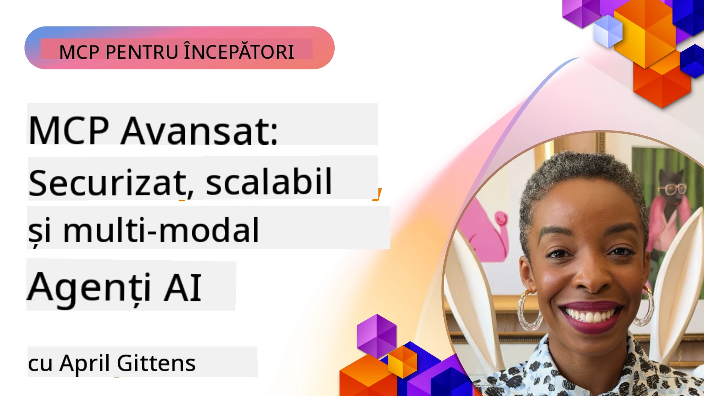

# Subiecte Avansate în MCP

_(Faceți clic pe imaginea de mai sus pentru a viziona videoclipul acestei lecții)_

Acest capitol acoperă o serie de subiecte avansate în implementarea Protocolului Contextului Modelului (MCP), inclusiv integrarea multi-modală, scalabilitatea, cele mai bune practici de securitate și integrarea în mediul enterprise. Aceste subiecte sunt esențiale pentru construirea aplicațiilor MCP robuste și gata de producție, care pot satisface cerințele sistemelor AI moderne.

## Prezentare generală

Această lecție explorează concepte avansate în implementarea Protocolului Contextului Modelului, concentrându-se pe integrarea multi-modală, scalabilitate, cele mai bune practici de securitate și integrarea în mediul enterprise. Aceste subiecte sunt esențiale pentru construirea aplicațiilor MCP de nivel producție, capabile să gestioneze cerințe complexe în medii enterprise.

> **Notă privind specificația curentă:** MCP `2026-07-28` depreciază primitivele Roots și
> Sampling acoperite în lecțiile 5.4 și 5.6. De asemenea, mută
> funcționalitatea experimentală Tasks menționată în Protocol Features (5.16) într-o
> extensie dedicată Tasks. Aceste lecții sunt păstrate pentru implementările
> legacy `2025-11-25` și includ indicații pentru migrație. Vezi
> [Ce s-a schimbat în MCP: Specificația 2026-07-28](../01-CoreConcepts/mcp-2026-07-28.md).

## Obiective de învățare

Până la finalul acestei lecții, vei putea:

- Implementa capabilități multi-modale în cadrul MCP
- Proiecta arhitecturi scalabile MCP pentru scenarii cu cerere ridicată
- Aplica cele mai bune practici de securitate aliniate cu principiile MCP
- Integra MCP cu sisteme și cadre AI din mediul enterprise
- Optimiza performanța și fiabilitatea în medii de producție

## Lecții și proiecte exemplu

| Link | Titlu | Descriere |
|------|-------|-------------|
| [5.1 Integrare cu Azure](./mcp-integration/README.md) | Integrare cu Azure | Învață cum să integrezi serverul MCP pe Azure |
| [5.2 Exemplu multi-modal](./mcp-multi-modality/README.md) | Exemple MCP multi-modale  | Exemple pentru răspuns audio, imagine și multi-modal |
| [5.3 Exemplu MCP OAuth2](../../../05-AdvancedTopics/mcp-oauth2-demo) | Demo MCP OAuth2 | Aplicație minimă Spring Boot care arată OAuth2 cu MCP, atât ca Server de Autorizare, cât și de Resurse. Demonstrează emiterea securizată a token-urilor, endpoint-uri protejate, implementare pe Azure Container Apps și integrarea API Management. |
| [5.4 Contexturi Root](./mcp-root-contexts/README.md) | Contexturi root  | Învață despre primitiva legacy `2025-11-25` Roots și opțiunile curente de migrație (deprecate în `2026-07-28`) |
| [5.5 Rutare](./mcp-routing/README.md) | Rutare | Învață diferite tipuri de rutare |
| [5.6 Sampling](./mcp-sampling/README.md) | Sampling | Învață despre primitiva legacy `2025-11-25` Sampling și opțiunile curente de migrație (deprecate în `2026-07-28`) |
| [5.7 Scalare](./mcp-scaling/README.md) | Scalare  | Învață despre scalare |
| [5.8 Securitate](./mcp-security/README.md) | Securitate  | Securizează-ți serverul MCP |

| [5.9 Exemplu căutare web](./web-search-mcp/README.md) | Web Search MCP | Server și client MCP Python integrând SerpAPI pentru căutare web, știri, produse și întrebări și răspunsuri în timp real. Demonstrează orchestrarea multiplă a instrumentelor, integrarea API-urilor externe și gestionarea robustă a erorilor. |
| [5.10 Streaming în timp real](./mcp-realtimestreaming/README.md) | Streaming  | Streaming-ul de date în timp real a devenit esențial în lumea actuală bazată pe date, unde companiile și aplicațiile necesită acces imediat la informații pentru a lua decizii în timp util.|
| [5.11 Căutare web în timp real](./mcp-realtimesearch/README.md) | Web Search | Cum transformă MCP căutarea web în timp real, oferind o abordare standardizată a gestionării contextului între modele AI, motoare de căutare și aplicații.| 
| [5.12 Autentificare Entra ID pentru serverele Model Context Protocol](./mcp-security-entra/README.md) | Autentificare Entra ID | Microsoft Entra ID oferă o soluție robustă de gestionare a identității și accesului bazată pe cloud, ajutând la asigurarea că doar utilizatorii și aplicațiile autorizate pot interacționa cu serverul tău MCP.|
| [5.13 Integrarea agentului Microsoft Foundry](./mcp-foundry-agent-integration/README.md) | Integrare Microsoft Foundry | Aflați cum să integrați serverele Model Context Protocol cu agenții Microsoft Foundry, permițând o orchestrare puternică a instrumentelor și capabilități AI enterprise cu conexiuni standardizate către surse externe de date.|
| [5.14 Ingineria Contextului](./mcp-contextengineering/README.md) | Ingineria Contextului | Oportunitatea viitoare a tehnicilor de inginerie a contextului pentru serverele MCP, inclusiv optimizarea contextului, gestionarea dinamică a contextului și strategii pentru ingineria prompturilor eficiente în cadrul MCP.|
| [5.15 Transport personalizat MCP](./mcp-transport/README.md) | Transport Personalizat | Aflați cum să implementați mecanisme de transport personalizate pentru scenarii specializate de comunicare MCP.|
| [5.16 Detaliere caracteristici protocol](./mcp-protocol-features/README.md) | Caracteristici Protocol | Stăpâniți caracteristici avansate ale protocolului, inclusiv notificări de progres, anularea cererilor, șabloane de resurse și modele de gestionare a erorilor.|
| [5.17 Raționament multi-agent adversarial](./mcp-adversarial-agents/README.md) | Agenți Adversar | Folosiți doi agenți cu poziții opuse, împărtășind un singur set de instrumente MCP, pentru a detecta halucinațiile, a evidenția cazuri limită și a produce rezultate mai bine calibrate prin dezbateri structurate.|

> **Notă istorică `2025-11-25`:** acea revizie a introdus sarcini experimentale
> și a extins mai multe caracteristici ale protocolului. La `2026-07-28`, sarcinile au trecut 
> la o extensie oficială și rădăcinile au devenit depreciate. Nu folosiți
> starea caracteristicii `2025-11-25` ca îndrumare curentă; consultați
> [jurnalul de modificări 2026-07-28](https://modelcontextprotocol.io/specification/2026-07-28/changelog).

## Referințe suplimentare

Pentru cele mai actualizate informații despre subiecte avansate MCP, consultați:
- [Documentația MCP](https://modelcontextprotocol.io/)
- [Specificația MCP (2026-07-28)](https://modelcontextprotocol.io/specification/2026-07-28/)
- [Depozitul GitHub](https://github.com/modelcontextprotocol)
- [OWASP MCP Top 10](https://microsoft.github.io/mcp-azure-security-guide/mcp/) - Riscuri de securitate și măsuri de atenuare

- [Atelierul MCP Security Summit (Sherpa)](https://azure-samples.github.io/sherpa/) - Instruire practică de securitate

## Concluzii cheie

- Implementările MCP multimodale extind capacitățile AI dincolo de procesarea textului
- Scalabilitatea este esențială pentru implementările la nivel de întreprindere și poate fi abordată prin scalare orizontală și verticală
- Măsuri cuprinzătoare de securitate protejează datele și asigură un control adecvat al accesului
- Integrarea în întreprindere cu platforme precum Azure OpenAI și Microsoft AI Foundry îmbunătățește capacitățile MCP
- Implementările avansate MCP beneficiază de arhitecturi optimizate și o gestionare atentă a resurselor

## Exercițiu

Proiectați o implementare MCP de nivel enterprise pentru un caz de utilizare specific:

1. Identificați cerințele multimodale pentru cazul dvs. de utilizare
2. Evidențiați controlurile de securitate necesare pentru protejarea datelor sensibile
3. Proiectați o arhitectură scalabilă care poate gestiona încărcări variabile
4. Planificați punctele de integrare cu sistemele AI din întreprindere
5. Documentați potențialele blocaje de performanță și strategiile de atenuare

## Resurse suplimentare

- [Documentația Azure OpenAI](https://learn.microsoft.com/en-us/azure/ai-services/openai/)
- [Documentația Microsoft AI Foundry](https://learn.microsoft.com/en-us/ai-services/)

---

## Ce urmează

Explorați lecțiile din acest modul începând cu: [5.1 MCP Integration](./mcp-integration/README.md)

După ce ați finalizat acest modul, continuați cu: [Modulul 6: Contribuții Comunitare](../06-CommunityContributions/README.md)

---

<!-- CO-OP TRANSLATOR DISCLAIMER START -->
**Declinare a responsabilității**:
Acest document a fost tradus folosind serviciul de traducere AI [Co-op Translator](https://github.com/Azure/co-op-translator). În timp ce ne străduim pentru acuratețe, vă rugăm să rețineți că traducerile automate pot conține erori sau inexactități. Documentul original în limba sa nativă trebuie considerat sursa autorizată. Pentru informații critice, se recomandă traducerea profesională realizată de un om. Nu ne asumăm responsabilitatea pentru eventualele neînțelegeri sau interpretări greșite care decurg din utilizarea acestei traduceri.
<!-- CO-OP TRANSLATOR DISCLAIMER END -->