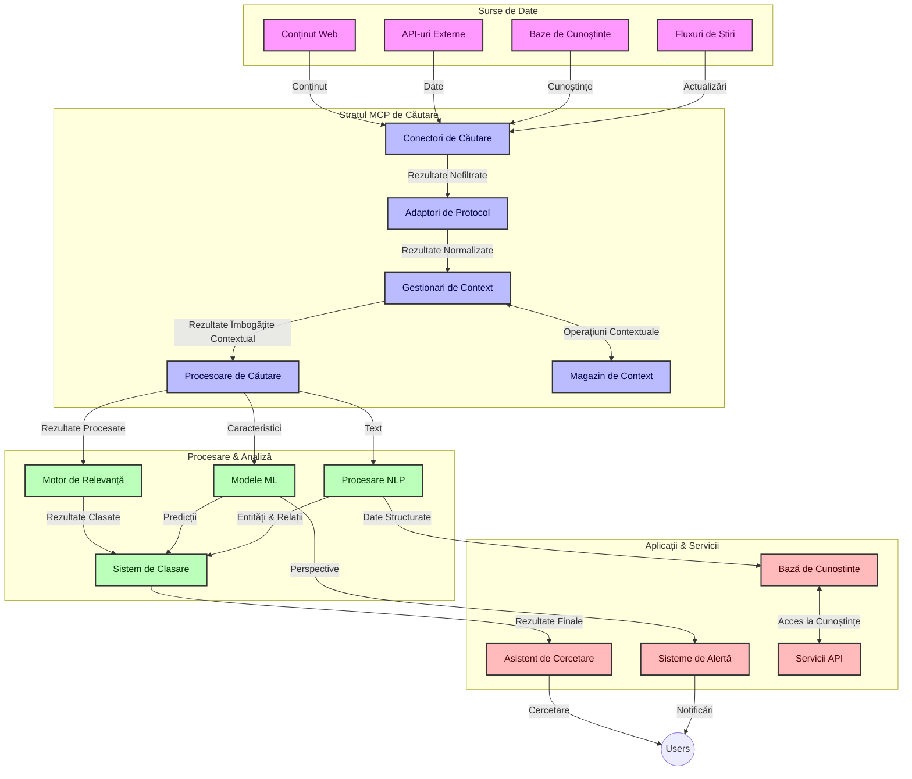
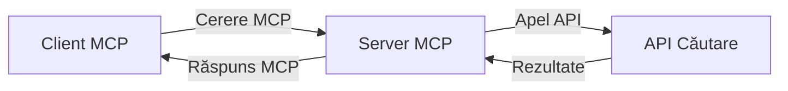
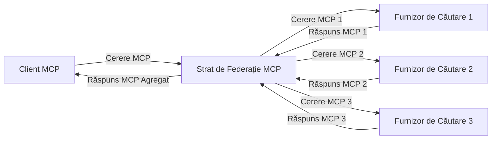
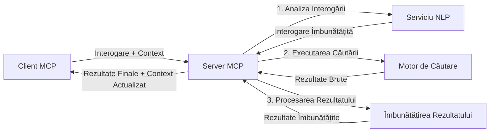

# Protocolul Contextului Modelului pentru Căutarea Web în Timp Real

## Prezentare generală

Căutarea web în timp real a devenit esențială în mediul actual bazat pe informații, unde aplicațiile au nevoie de acces imediat la informații actualizate din întreg internetul pentru a oferi răspunsuri relevante și la timp. Protocolul Contextului Modelului (MCP) reprezintă un avans semnificativ în optimizarea acestor procese de căutare în timp real, îmbunătățind eficiența căutărilor, menținând integritatea contextuală și crescând performanța generală a sistemului.

Acest modul explorează modul în care MCP transformă căutarea web în timp real prin furnizarea unei abordări standardizate pentru gestionarea contextului între modelele AI, motoarele de căutare și aplicații.

### Ce vei învăța

În acest ghid complet, vei descoperi:

- Cum MCP creează o punte fluidă între modelele AI și capacitățile de căutare web în timp real
- Modele arhitecturale pentru implementarea soluțiilor eficiente și scalabile de căutare cu MCP
- Tehnici pentru păstrarea contextului căutării peste multiple interogări și interacțiuni
- Implementări practice de cod în Python și JavaScript pentru diferite scenarii de căutare
- Metode pentru echilibrarea relevanței, actualității și performanței în sistemele de căutare alimentate de MCP

## Introducere în căutarea web în timp real

Căutarea web în timp real este o abordare tehnologică care permite interogarea continuă, procesarea și analiza informațiilor de pe web pe măsură ce acestea sunt publicate sau actualizate, permițând sistemelor să ofere informații proaspete și relevante cu o întârziere minimă. Spre deosebire de sistemele tradiționale de căutare care operează pe date indexate ce pot avea ore sau zile vechime, căutarea în timp real procesează date live de pe web, oferind perspective și informații care reflectă starea curentă a conținutului online.

### Concepte de bază ale căutării web în timp real:

- **Procesare continuă a interogărilor**: Interogările de căutare se procesează în raport cu surse de date care se actualizează constant
- **Prioritizarea actualității**: Sistemele sunt proiectate pentru a prioritiza informațiile proaspete
- **Echilibrare a relevanței**: Menținerea unui echilibru între relevanță și actualitate
- **Arhitectură scalabilă**: Sistemele trebuie să gestioneze încărcări variabile de interogări și volume de date
- **Înțelegere contextuală**: Menținerea contextului utilizatorului pe parcursul iterațiilor de căutare este crucială pentru rezultate semnificative
- **Reformulare dinamică a interogărilor**: Modificarea adaptivă a interogărilor bazată pe context și rezultate anterioare
- **Integrare multi-sursă**: Combinarea rezultatelor de la mai mulți furnizori de căutare și surse web
- **Înțelegere semantică**: Procesarea interogărilor și conținutului bazată pe sens, nu doar pe cuvinte cheie
- **Clasare în timp real**: Ajustarea continuă a clasamentului rezultatelor pe măsură ce apar informații noi

### Protocolul Contextului Modelului și căutarea web în timp real

Protocolul Contextului Modelului (MCP) abordează mai multe provocări critice în mediile de căutare web în timp real:

1. **Păstrarea contextului căutării**: MCP standardizează modul în care contextul este menținut în componentele distribuite de căutare, asigurând accesul modelelor AI și nodurilor de procesare la istoricul interogărilor relevante și preferințele utilizatorilor.

2. **Gestionarea eficientă a interogărilor**: Prin oferirea de mecanisme structurate pentru transmiterea contextului, MCP reduce costurile suplimentare asociate repetării contextului la fiecare iterație de căutare.

3. **Interoperabilitate**: MCP creează un limbaj comun pentru partajarea contextului între diverse tehnologii de căutare și modele AI, permițând arhitecturi mai flexibile și extensibile.

4. **Context optimizat pentru căutare**: Implementările MCP pot prioritiza elementele contextuale cele mai relevante pentru o căutare efectivă, optimizând atât performanța, cât și acuratețea.

5. **Procesare adaptivă a căutării**: Printr-o gestionare corectă a contextului oferită de MCP, sistemele de căutare pot ajusta dinamic procesarea în funcție de nevoile utilizatorilor și peisajul informațional în evoluție.

În aplicațiile moderne, de la agregarea știrilor la asistenții de cercetare, integrarea MCP cu tehnologiile de căutare web permite o căutare mai inteligentă, conștientă de context, ce poate oferi rezultate tot mai relevante pe măsură ce interacțiunile utilizatorilor continuă.

## Obiective de învățare

Până la sfârșitul acestei lecții, vei putea să:

- Înțelegi fundamentele căutării web în timp real și provocările ei în aplicațiile moderne
- Explici cum Protocolul Contextului Modelului (MCP) îmbunătățește capabilitățile de căutare web în timp real
- Implementezi soluții de căutare bazate pe MCP folosind cadre și API-uri populare
- Projetezi și implementezi arhitecturi de căutare scalabile și performante cu MCP
- Aplici conceptele MCP în diverse cazuri de utilizare, inclusiv căutare semantică, asistență pentru cercetare și navigare augmentată de AI
- Evaluezi tendințe emergente și inovații viitoare în tehnologiile de căutare bazate pe MCP
- Dezvolți sisteme de căutare conștiente de context care învață din interacțiunile utilizatorilor
- Integrezi capabilități de căutare web în asistenții AI folosind protocoale standardizate MCP
- Creezi pipeline-uri de căutare în mai multe etape care rafinează progresiv rezultatele pe baza contextului
- Optimizezi performanța căutării în timp ce menții o conștientizare completă a contextului

### Definiție și semnificație

Căutarea web în timp real implică interogarea continuă, recuperarea și livrarea informațiilor bazate pe web cu întârziere minimă. Spre deosebire de motoarele de căutare tradiționale care parcurg și indexează periodic web-ul, căutarea în timp real urmărește să aducă la suprafață informații imediat ce acestea devin disponibile, permițând acces imediat la cele mai actuale conținuturi.

Caracteristici cheie ale căutării web în timp real includ:

- **Prospețime**: Prioritizarea conținutului și a actualizărilor recente
- **Procesare continuă**: Monitorizarea constantă pentru noi informații
- **Adaptarea interogărilor**: Rafinați interogările pe baza contextului și a feedback-ului
- **Livrare imediată**: Furnizarea rapidă a rezultatelor căutării cu întârziere minimă
- **Reținerea contextului**: Construirea pe baza interogărilor anterioare pentru relevanță îmbunătățită

### Provocări în căutarea web tradițională

Abordările tradiționale pentru căutarea web se confruntă cu mai multe limitări când sunt aplicate în scenarii de timp real:

1. **Fragmentarea contextului**: Dificultăți în menținerea contextului căutării pe parcursul mai multor interogări
2. **Actualitatea informațiilor**: Provocări în accesarea și prioritizarea celor mai recente informații
3. **Complexitatea integrării**: Probleme de interoperabilitate între sistemele și aplicațiile de căutare
4. **Probleme de latență**: Echilibrarea între căutarea cuprinzătoare și cerințele de timp de răspuns
5. **Ajustarea relevanței**: Asigurarea acurateței și relevanței în timp ce se prioritizează actualitatea

## Înțelegerea Protocolului Contextului Modelului (MCP) pentru Căutare

### Ce este MCP în contexte de căutare?

Protocolul Contextului Modelului (MCP) este un protocol de comunicare standardizat, conceput să faciliteze interacțiunea eficientă între modelele AI și aplicații. În contextul căutării web în timp real, MCP oferă un cadru pentru:

- Păstrarea contextului căutării pe parcursul secvențelor de interogări
- Standardizarea formatelor de interogare și rezultate de căutare
- Optimizarea transmiterii parametrilor și rezultatelor căutării
- Îmbunătățirea comunicării model-to-search engine

### Componente și arhitectură de bază

Arhitectura MCP pentru căutarea web în timp real cuprinde mai multe componente cheie:

1. **GestionariContext Interogări**: Administrează și menține contextul căutării pe mai multe interogări
2. **Procesoare de căutare**: Procesează cererile de căutare primite folosind tehnici conștiente de context
3. **Adaptori de protocol**: Convertește între diferite API-uri de căutare păstrând contextul
4. **Magazin de context**: Stochează și preia eficient istoricul căutărilor și preferințele
5. **Conectori de căutare**: Se conectează la diverse motoare de căutare și API-uri web



### Cum îmbunătățește MCP căutarea web în timp real

MCP abordează provocările căutării web tradiționale prin:

- **Continuitate contextuală**: Menținerea relațiilor între interogări pe parcursul întregii sesiuni de căutare
- **Transmitere optimizată**: Reducerea redundanței parametrilor de căutare prin gestionarea inteligentă a contextului
- **Interfețe standardizate**: Oferirea de API-uri consistente pentru componentele de căutare
- **Reducerea latenței**: Minimizarea costurilor de procesare prin manipularea eficientă a contextului
- **Relevanță îmbunătățită**: Creșterea relevanței căutărilor prin păstrarea intenției utilizatorului în multiple interogări

## Integrare și implementare

Sistemele de căutare web în timp real necesită un design arhitectural atent și o implementare care să mențină atât performanța, cât și integritatea contextuală. Protocolul Contextului Modelului oferă o abordare standardizată pentru integrarea modelelor AI și tehnologiilor de căutare, permițând pipeline-uri de căutare mai sofisticate, conștiente de context.

### Prezentare generală a integrării MCP în arhitecturile de căutare

Implementarea MCP în mediile de căutare web în timp real implică mai multe considerente cheie:

1. **Serializarea contextului căutării**: MCP oferă mecanisme eficiente pentru codificarea informațiilor contextuale în cererile de căutare, asigurând că contextul esențial însoțește interogarea pe tot parcursul pipeline-ului de procesare. Aceasta include formate de serializare standardizate, optimizate pentru metadatele legate de căutare.

2. **Procesare stărilă a căutării**: MCP permite procesări mai inteligente și stărilă prin menținerea unei reprezentări consistente a contextului peste iterațiile de căutare. Acest lucru este deosebit de valoros în pipeline-urile de căutare în multiple etape, unde rafinarea contextului îmbunătățește rezultatele.

3. **Extinderea și rafinarea interogărilor**: Implementările MCP în sistemele de căutare pot facilita extinderea și rafinarea sofisticată a interogărilor bazate pe context acumulat, permițând rezultate tot mai relevante pe măsură ce sesiunea de căutare avansează.

4. **Cache și prioritizare a rezultatelor**: Prin standardizarea gestionării contextului, MCP ajută la administrarea cache-ului și prioritizarea rezultatelor, permițând componentelor să se adapteze pe baza contextului de căutare în evoluție.

5. **Federare și agregare a căutării**: MCP facilitează o federare mai sofisticată a căutării peste multiple backend-uri prin oferirea de reprezentări structurate ale contextului de căutare, permițând o agregare mai semnificativă a rezultatelor din surse diverse.

Implementarea MCP în diverse tehnologii de căutare creează o abordare unificată a gestionării contextului, reducând necesitatea codului personalizat de integrare și sporind capacitatea sistemului de a menține un context semnificativ pe măsură ce interogările de căutare evoluează.

### MCP în diverse implementări de căutare web

Aceste exemple urmează specificația curentă MCP care se concentrează pe un protocol bazat pe JSON-RPC cu mecanisme de transport distincte. Codul demonstrează cum poți implementa integrări personalizate de căutare păstrând compatibilitatea completă cu protocolul MCP.


<details>
<summary>Implementare Python cu API generic de căutare</summary>

```python
import asyncio
import json
import aiohttp
from typing import Dict, Any, Optional, List
from contextlib import asynccontextmanager
from collections.abc import AsyncIterator

# Importă bibliotecile standard MCP
from mcp.client.session import ClientSession
from mcp.client.streamable_http import streamablehttp_client
from mcp.types import TextContent, CreateMessageRequestParams, CreateMessageResult
from mcp.server.fastmcp import FastMCP

# Creează un server FastMCP pentru căutare web
search_server = FastMCP("WebSearch")

# Clasă pentru gestionarea operațiunilor de căutare web
class WebSearchHandler:
    def __init__(self, api_endpoint: str, api_key: str):
        self.api_endpoint = api_endpoint
        self.api_key = api_key
        self.session = None
        
    async def initialize(self):
        """Initialize the HTTP session"""
        self.session = aiohttp.ClientSession(
            headers={"Authorization": f"Bearer {self.api_key}"}
        )
    
    async def close(self):
        """Close the HTTP session"""
        if self.session:
            await self.session.close()
            
    async def perform_search(self, query: str, max_results: int = 5, 
                           include_domains: List[str] = None, 
                           exclude_domains: List[str] = None,
                           time_period: str = "any") -> Dict[str, Any]:
        """Perform web search using the search API"""
        # Construiește parametrii de căutare
        search_params = {
            "q": query,
            "limit": max_results,
            "time": time_period
        }
        
        if include_domains:
            search_params["site"] = ",".join(include_domains)
            
        if exclude_domains:
            search_params["exclude_site"] = ",".join(exclude_domains)
        
        # Efectuează cererea de căutare
        try:
            async with self.session.get(
                self.api_endpoint,
                params=search_params
            ) as response:
                if response.status != 200:
                    error_text = await response.text()
                    raise Exception(f"Search API error: {response.status} - {error_text}")
                
                search_data = await response.json()
                
                # Transformă răspunsul specific API-ului într-un format standard
                results = []
                for item in search_data.get("results", []):
                    results.append({
                        "title": item.get("title", ""),
                        "url": item.get("url", ""),
                        "snippet": item.get("snippet", ""),
                        "date": item.get("published_date", ""),
                        "source": item.get("source", "")
                    })
                
                return {
                    "query": query,
                    "totalResults": len(results),
                    "results": results
                }
        except Exception as e:
            print(f"Search API request error: {e}")
            raise

# Inițializează handler-ul de căutare
search_handler = WebSearchHandler(
    api_endpoint="https://api.search-service.example/search",
    api_key="your-api-key-here"
)

# Configurează durata de viață pentru a gestiona handler-ul de căutare
@asyncio.asynccontextmanager
async def app_lifespan(server: FastMCP):
    """Manage application lifecycle"""
    await search_handler.initialize()
    try:
        yield {"search_handler": search_handler}
    finally:
        await search_handler.close()

# Setează durata de viață pentru server
search_server = FastMCP("WebSearch", lifespan=app_lifespan)

# Înregistrează un instrument pentru căutare web
@search_server.tool()
async def web_search(query: str, max_results: int = 5, 
                   include_domains: List[str] = None,
                   exclude_domains: List[str] = None,
                   time_period: str = "any") -> Dict[str, Any]:
    """
    Search the web for information
    
    Args:
        query: The search query
        max_results: Maximum number of results to return (default: 5)
        include_domains: List of domains to include in search results
        exclude_domains: List of domains to exclude from search results
        time_period: Time period for results ("day", "week", "month", "any")
        
    Returns:
        Dictionary containing search results
    """
    ctx = search_server.get_context()
    search_handler = ctx.request_context.lifespan_context["search_handler"]
    
    results = await search_handler.perform_search(
        query=query,
        max_results=max_results,
        include_domains=include_domains,
        exclude_domains=exclude_domains,
        time_period=time_period
    )
    
    return results

# Exemplu de utilizare client
async def client_example():
    # Conectează-te la serverul de căutare folosind transport HTTP Streamable
    async with streamablehttp_client("http://localhost:8000/mcp") as (read, write, _):
        async with ClientSession(read, write) as session:
            # Inițializează conexiunea
            await session.initialize()
            
            # Apelează instrumentul web_search
            search_results = await session.call_tool(
                "web_search", 
                {
                    "query": "latest developments in AI and Model Context Protocol",
                    "max_results": 5,
                    "time_period": "day",
                    "include_domains": ["github.com", "microsoft.com"]
                }
            )
            
            print(f"Search results: {search_results}")

# Exemplu de execuție a serverului
if __name__ == "__main__":
    # Rulează serverul cu transport HTTP Streamable
    search_server.run(transport="streamable-http")
```
</details> 

<details>
<summary>Implementare JavaScript cu căutare în browser</summary>


```javascript
// Implementarea serverului MCP pentru căutare web
import { McpServer, ResourceTemplate } from '@modelcontextprotocol/sdk/server/mcp.js';
import { StreamableHTTPServerTransport } from '@modelcontextprotocol/sdk/server/streamableHttp.js';
import { z } from 'zod';

// Creează un server MCP pentru căutare web
const searchServer = new McpServer({
    name: "BrowserSearch",
    description: "A server that provides web search capabilities"
});

// Clasa serviciului de căutare
class SearchService {
    constructor(searchApiUrl, apiKey) {
        this.searchApiUrl = searchApiUrl;
        this.apiKey = apiKey;
    }

    async performSearch(parameters) {
        const {
            query = '',
            maxResults = 5,
            includeDomains = [],
            excludeDomains = [],
            timePeriod = 'any'
        } = parameters;
        
        // Construiește URL-ul de căutare cu parametri
        const url = new URL(this.searchApiUrl);
        url.searchParams.append('q', query);
        url.searchParams.append('limit', maxResults);
        url.searchParams.append('time', timePeriod);
        
        if (includeDomains.length > 0) {
            url.searchParams.append('site', includeDomains.join(','));
        }
        
        if (excludeDomains.length > 0) {
            url.searchParams.append('exclude_site', excludeDomains.join(','));
        }
        
        try {
            const response = await fetch(url.toString(), {
                method: 'GET',
                headers: {
                    'Authorization': `Bearer ${this.apiKey}`,
                    'Content-Type': 'application/json'
                }
            });
            
            if (!response.ok) {
                const errorText = await response.text();
                throw new Error(`Search API error: ${response.status} - ${errorText}`);
            }
            
            const searchData = await response.json();
            
            // Transformă răspunsul specific API-ului într-un format standard
            const results = searchData.results?.map(item => ({
                title: item.title || '',
                url: item.url || '',
                snippet: item.snippet || '',
                date: item.published_date || '',
                source: item.source || ''
            })) || [];
            
            return {
                query,
                totalResults: results.length,
                results
            };
        } catch (error) {
            console.error('Search API request error:', error);
            throw error;
        }
    }
}

// Inițializează serviciul de căutare
const searchService = new SearchService(
    'https://api.search-service.example/search',
    'your-api-key-here'
);

// Configurează providerul de context pentru server
searchServer.setContextProvider(() => {
    return {
        searchService
    };
});

// Înregistrează instrumentul de căutare web
searchServer.tool({
    name: 'web_search',
    description: 'Search the web for information',
    parameters: {
        type: 'object',
        properties: {
            query: {
                type: 'string',
                description: 'The search query'
            },
            maxResults: {
                type: 'integer',
                description: 'Maximum number of results to return',
                default: 5
            },
            includeDomains: {
                type: 'array',
                items: { type: 'string' },
                description: 'List of domains to include in search results'
            },
            excludeDomains: {
                type: 'array',
                items: { type: 'string' },
                description: 'List of domains to exclude from search results'
            },
            timePeriod: {
                type: 'string',
                description: 'Time period for results',
                enum: ['day', 'week', 'month', 'any'],
                default: 'any'
            }
        },
        required: ['query']
    },
    handler: async (params, context) => {
        const { searchService } = context;
        return await searchService.performSearch(params);
    }
});

// Exemplu de cod client pentru conectarea la serverul de căutare
import { Client } from '@modelcontextprotocol/sdk/client/index.js';
import { StreamableHTTPClientTransport } from '@modelcontextprotocol/sdk/client/streamableHttp.js';

async function connectToSearchServer() {
    // Conectează-te la serverul de căutare
    const transport = new StreamableHTTPClientTransport(
        new URL('http://localhost:8000/mcp')
    );
    
    const client = new Client({
        name: 'search-client',
        version: '1.0.0'
    });
    
    await client.connect(transport);
    
    // Execută instrumentul de căutare
    const searchResults = await client.callTool({
        name: 'web_search',
        arguments: {
            query: 'Model Context Protocol implementation examples',
            maxResults: 10,
            timePeriod: 'week',
            includeDomains: ['github.com', 'docs.microsoft.com']
        }
    });
    
    console.log('Search results:', searchResults);
    
    // Curățare
    await client.disconnect();
}

// Pornește serverul
const transport = new StreamableHTTPServerTransport();
await searchServer.connect(transport);
console.log('Search server running at http://localhost:8000/mcp');

// Într-un proces separat sau după ce serverul este pornit
// connectToSearchServer().catch(console.error);
```
</details> 


## Declarație privind exemplele de cod

> **Notă importantă**: Exemplele de cod de mai jos demonstrează integrarea Protocolului Contextului Modelului (MCP) cu funcționalitatea de căutare web. Deși urmează modelele și structurile SDK-urilor oficiale MCP, au fost simplificate în scopuri educaționale.
> 
> Aceste exemple prezintă:
> 
> 1. **Implementare Python**: O implementare a serverului FastMCP care oferă un instrument de căutare web și se conectează la un API extern de căutare. Acest exemplu demonstrează gestionarea corectă a duratei de viață, gestionarea contextului și implementarea instrumentului urmând modelele din [SDK-ul oficial MCP Python](https://github.com/modelcontextprotocol/python-sdk). Serverul utilizează transportul HTTP Streamable recomandat care a înlocuit vechiul transport SSE pentru implementările de producție.
> 
> 2. **Implementare JavaScript**: O implementare TypeScript/JavaScript folosind modelul FastMCP din [SDK-ul oficial MCP TypeScript](https://github.com/modelcontextprotocol/typescript-sdk) pentru a crea un server de căutare cu definiții corecte de instrumente și conexiuni client. Urmează cele mai recente modele recomandate pentru gestionarea sesiunilor și păstrarea contextului.
> 
> Aceste exemple ar necesita tratare suplimentară a erorilor, autentificare și cod specific de integrare API pentru utilizarea în producție. Endpoint-urile API de căutare afișate (`https://api.search-service.example/search`) sunt substituenți și trebuie înlocuite cu endpoint-uri reale de servicii de căutare.
> 
> Pentru detalii complete de implementare și cele mai recente abordări, consultă te rog [specificația oficială MCP](https://spec.modelcontextprotocol.io/) și documentația SDK.

## Concepte de bază

### Cadrul Protocolului Contextului Modelului (MCP)

La bază, Protocolul Contextului Modelului oferă o metodă standardizată pentru schimbul de context între modele AI, aplicații și servicii. În căutarea web în timp real, acest cadru este esențial pentru crearea unor experiențe coerente de căutare cu multiple tururi. Componentele cheie includ:

1. **Arhitectură client-server**: MCP stabilește o separare clară între clienții de căutare (solicitatori) și serverele de căutare (furnizori), permițând modele flexibile de implementare.

2. **Comunicare JSON-RPC**: Protocolul folosește JSON-RPC pentru schimbul de mesaje, făcându-l compatibil cu tehnologiile web și ușor de implementat pe diferite platforme.

3. **Gestionarea contextului**: MCP definește metode structurate pentru menținerea, actualizarea și valorificarea contextului căutării pe multiple interacțiuni.

4. **Definiții de instrumente**: Capacitățile de căutare sunt expuse ca instrumente standardizate cu parametri și valori de întoarcere bine definite.

5. **Suport pentru streaming**: Protocolul suportă streaming-ul rezultatelor, esențial pentru căutarea în timp real unde rezultatele pot sosi progresiv.

### Modele de integrare a căutării web

La integrarea MCP cu căutarea web, ies în evidență mai multe modele:

#### 1. Integrare directă cu furnizorul de căutare



În acest model, serverul MCP interfațează direct cu unul sau mai multe API-uri de căutare, traducând cererile MCP în apeluri specifice API și formatează rezultatele ca răspunsuri MCP.

#### 2. Căutare federată cu păstrare a contextului



Acest model distribuie interogările de căutare între mai mulți furnizori de căutare compatibili MCP, fiecare specializat potențial în diferite tipuri de conținut sau capabilități de căutare, menținând în același timp un context unificat.

#### 3. Lanț de căutare îmbunătățit cu context



În acest model, procesul de căutare este împărțit în mai multe etape, contextul fiind îmbogățit la fiecare pas, rezultând rezultate progresiv mai relevante.

### Componentele contextului de căutare

În căutarea web bazată pe MCP, contextul include de obicei:

- **Istoricul interogărilor**: Interogări anterioare în sesiune
- **Preferințele utilizatorului**: Limbă, regiune, setări de căutare sigură
- **Istoricul interacțiunilor**: Care rezultate au fost accesate, timpul petrecut pe rezultate
- **Parametrii de căutare**: Filtre, ordonări și alți modificatori de căutare
- **Cunoștințe de domeniu**: Context specific subiectului relevant pentru căutare
- **Context temporal**: Factori de relevanță bazată pe timp
- **Preferințe de surse**: Surse de informații de încredere sau preferate

## Cazuri de utilizare și aplicații

### Cercetare și colectare de informații

MCP îmbunătățește fluxurile de cercetare prin:

- Păstrarea contextului cercetării pe parcursul sesiunilor de căutare
- Permițând interogări mai sofisticate și relevante contextual
- Susținerea federării căutării multi-sursă
- Facilitarea extragerii de cunoștințe din rezultatele căutării

### Monitorizarea știrilor și tendințelor în timp real

Căutarea alimentată de MCP oferă avantaje pentru monitorizarea știrilor:

- Descoperirea aproape în timp real a știrilor emergente
- Filtrarea contextuală a informațiilor relevante
- Monitorizarea subiectelor și entităților în mai multe surse
- Alarme personalizate de știri bazate pe contextul utilizatorului

### Navigare și cercetare augmentate de AI

MCP creează noi posibilități pentru navigarea augmentată de AI:

- Sugestii de căutare contextuale bazate pe activitatea curentă din browser
- Integrare fără întreruperi a căutării web cu asistenți alimentați de LLM-uri
- Rafinare multi-turn a căutării cu păstrarea contextului
- Verificarea îmbunătățită a faptelor și validarea informațiilor

## Tendințe și inovații viitoare

### Evoluția MCP în căutarea web

Privind spre viitor, anticipăm că MCP va evolua pentru a aborda:


- **Căutare Multimodală**: Integrarea căutării text, imagine, audio și video cu context păstrat
- **Căutare Decentralizată**: Suport pentru ecosisteme de căutare distribuită și federată
- **Confidențialitatea Căutării**: Mecanisme de căutare care păstrează confidențialitatea și sunt conștiente de context
- **Înțelegerea Interogărilor**: Analiză semantică profundă a interogărilor de căutare în limbaj natural

### Progrese Potențiale în Tehnologie

Tehnologii emergente care vor modela viitorul căutării MCP:

1. **Arhitecturi de Căutare Neurală**: Sisteme de căutare bazate pe încorporări optimizate pentru MCP
2. **Context Personalizat al Căutării**: Învățarea tiparelor individuale de căutare ale utilizatorilor în timp
3. **Integrarea Graficului de Cunoștințe**: Căutare contextuală îmbunătățită de grafice de cunoștințe specifice domeniului
4. **Context Cross-Modal**: Menținerea contextului între diferite modalități de căutare

## Exerciții Practice

### Exercițiul 1: Configurarea unui Pipeline de Căutare MCP de Bază

În acest exercițiu vei învăța cum să:
- Configurezi un mediu de căutare MCP de bază
- Implementezi gestionari de context pentru căutarea pe web
- Testezi și validezi păstrarea contextului între iterările de căutare

### Exercițiul 2: Construirea unui Asistent de Cercetare cu Căutare MCP

Creează o aplicație completă care:
- Procesează întrebări de cercetare în limbaj natural
- Efectuează căutări web conștiente de context
- Sintezează informații din mai multe surse
- Prezintă rezultate organizate ale cercetării

### Exercițiul 3: Implementarea Federației Căutării Multi-Sursă cu MCP

Exercițiu avansat care acoperă:
- Trimiterea interogărilor conștiente de context către multiple motoare de căutare
- Clasarea și agregarea rezultatelor
- Deduplicarea contextuală a rezultatelor căutării
- Gestionarea metadatelor specifice sursei

## Resurse Suplimentare

- [Model Context Protocol Specification](https://spec.modelcontextprotocol.io/) - Specificația oficială MCP și documentația detaliată a protocolului
- [Model Context Protocol Documentation](https://modelcontextprotocol.io/) - Tutoriale detaliate și ghiduri de implementare
- [MCP Python SDK](https://github.com/modelcontextprotocol/python-sdk) - Implementarea oficială Python a protocolului MCP
- [MCP TypeScript SDK](https://github.com/modelcontextprotocol/typescript-sdk) - Implementarea oficială TypeScript a protocolului MCP
- [MCP Reference Servers](https://github.com/modelcontextprotocol/servers) - Implementări de referință ale serverelor MCP
- [Bing Web Search API Documentation](https://learn.microsoft.com/en-us/bing/search-apis/bing-web-search/overview) - API-ul de căutare web al Microsoft
- [Google Custom Search JSON API](https://developers.google.com/custom-search/v1/overview) - Motorul de căutare programabil Google
- [SerpAPI Documentation](https://serpapi.com/search-api) - API pentru paginile cu rezultate ale motoarelor de căutare
- [Meilisearch Documentation](https://www.meilisearch.com/docs) - Motor de căutare open-source
- [Elasticsearch Documentation](https://www.elastic.co/guide/index.html) - Motor distribuit de căutare și analiză
- [LangChain Documentation](https://python.langchain.com/docs/get_started/introduction) - Construirea aplicațiilor cu LLM-uri

## Rezultate așteptate în învățare

Prin finalizarea acestui modul, vei putea să:

- Înțelegi fundamentele căutării web în timp real și provocările ei
- Explici cum Model Context Protocol (MCP) îmbunătățește capacitățile căutării web în timp real
- Implementezi soluții de căutare bazate pe MCP folosind framework-uri și API-uri populare
- Projetezi și implementezi arhitecturi de căutare scalabile și performante folosind MCP
- Aplici conceptele MCP în diverse cazuri de utilizare, inclusiv căutarea semantică, asistența la cercetare și navigarea augmentată AI
- Evaluezi tendințele emergente și inovațiile viitoare în tehnologiile de căutare bazate pe MCP


### Considerente privind Încrederea și Siguranța

Când implementezi soluții de căutare web bazate pe MCP, amintește-ți aceste principii importante din specificația MCP:

1. **Consimțământul și Controlul Utilizatorului**: Utilizatorii trebuie să-și dea consimțământul explicit și să înțeleagă toate accesările și operațiunile făcute asupra datelor. Acest lucru este deosebit de important pentru implementările căutării web care pot accesa surse externe de date.

2. **Confidențialitatea Datelor**: Asigură o gestionare adecvată a interogărilor și rezultatelor căutării, mai ales când acestea pot conține informații sensibile. Implementează controale de acces corespunzătoare pentru a proteja datele utilizatorului.

3. **Siguranța Instrumentelor**: Implementează autorizare și validare corectă pentru uneltele de căutare, deoarece acestea reprezintă potențiale riscuri de securitate prin executarea codului arbitrar. Descrierile comportamentului uneltelor trebuie considerate neîncrezătoare decât dacă provin de la un server de încredere.

4. **Documentație Clară**: Oferă documentație clară despre capabilități, limitări și considerente de securitate ale implementării căutării tale bazate pe MCP, urmând ghidurile de implementare din specificația MCP.

5. **Fluxuri Robuste de Consimțământ**: Construiește fluxuri robuste de consimțământ și autorizare care explică clar ce face fiecare unealtă înainte de autorizarea utilizării ei, mai ales pentru uneltele care interacționează cu resurse web externe.

Pentru detalii complete privind securitatea și considerentele de încredere MCP, consultă [documentația oficială](https://modelcontextprotocol.io/specification/2025-11-25/basic/security_best_practices).

## Ce urmează

- [5.12 Autentificarea Entra ID pentru Serverele Model Context Protocol](../mcp-security-entra/README.md)

---

<!-- CO-OP TRANSLATOR DISCLAIMER START -->
**Declinare a responsabilității**:
Acest document a fost tradus folosind serviciul de traducere AI [Co-op Translator](https://github.com/Azure/co-op-translator). În timp ce ne străduim pentru acuratețe, vă rugăm să rețineți că traducerile automate pot conține erori sau inexactități. Documentul original în limba sa nativă trebuie considerat sursa autorizată. Pentru informații critice, se recomandă traducerea profesională realizată de un om. Nu ne asumăm responsabilitatea pentru eventualele neînțelegeri sau interpretări greșite care decurg din utilizarea acestei traduceri.
<!-- CO-OP TRANSLATOR DISCLAIMER END -->