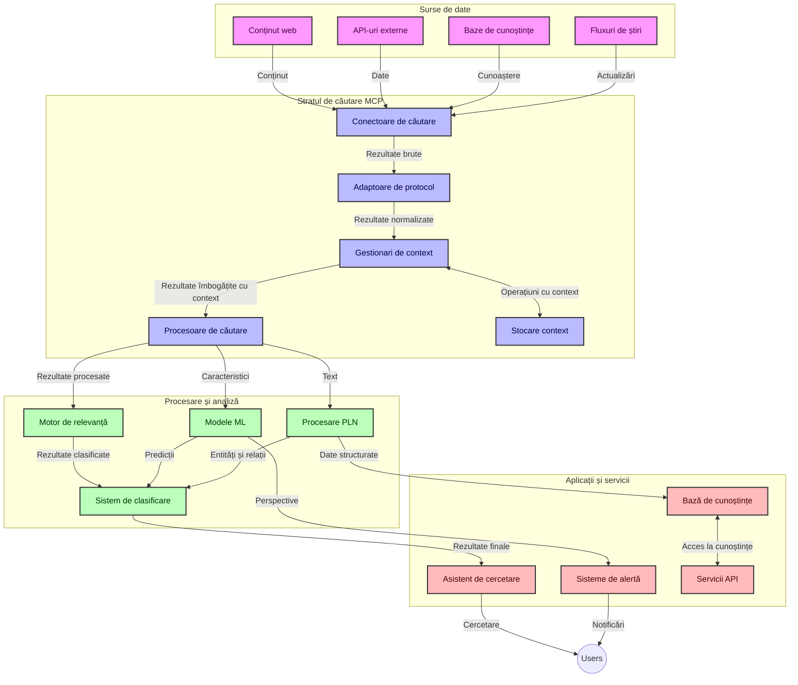
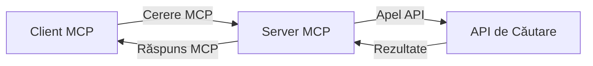
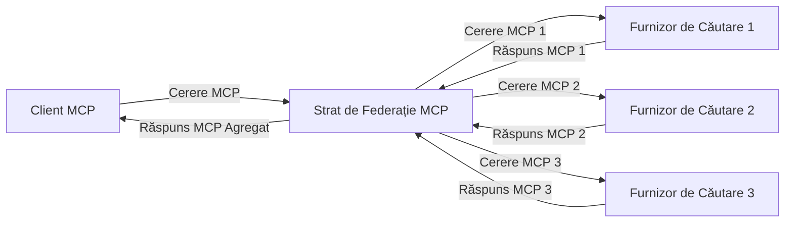
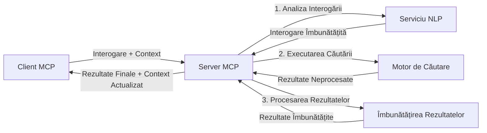

# Protocolul Contextului Modelului pentru Căutare Web în Timp Real

## Prezentare generală

Căutarea web în timp real a devenit esențială în mediul actual bazat pe informații, unde aplicațiile au nevoie de acces imediat la informații actualizate de pe internet pentru a oferi răspunsuri relevante și la timp. Protocolul Contextului Modelului (MCP) reprezintă un progres semnificativ în optimizarea acestor procese de căutare în timp real, îmbunătățind eficiența căutării, menținând integritatea contextuală și sporind performanța generală a sistemului.

Acest modul explorează modul în care MCP transformă căutarea web în timp real oferind o abordare standardizată pentru gestionarea contextului între modele AI, motoare de căutare și aplicații.

### Ce vei învăța

În acest ghid complet, vei descoperi:

- Cum MCP creează o punte fără întreruperi între modelele AI și capabilitățile de căutare web în timp real
- Modele arhitecturale pentru implementarea soluțiilor de căutare eficiente și scalabile cu MCP
- Tehnici pentru păstrarea contextului căutării pe multiple interogări și interacțiuni
- Implementări de cod practice în Python și JavaScript pentru diverse scenarii de căutare
- Metode pentru echilibrarea relevanței, actualității și performanței în sistemele de căutare bazate pe MCP

## Introducere în căutarea web în timp real

Căutarea web în timp real este o abordare tehnologică care permite interogarea, procesarea și analizarea continuă a informațiilor de pe web pe măsură ce sunt publicate sau actualizate, permițând sistemelor să ofere informații proaspete și relevante cu o latență minimă. Spre deosebire de sistemele tradiționale de căutare care operează pe date indexate ce pot avea câteva ore sau zile vechime, căutarea în timp real procesează date live de pe web, furnizând perspective și informații ce reflectă starea curentă a conținutului online.

### Concepute fundamentale ale căutării web în timp real:

- **Procesare continuă a interogărilor**: interogările de căutare sunt procesate pe surse de date în continuă actualizare
- **Prioritizarea actualității**: sistemele sunt proiectate să prioritizeze informațiile recente
- **Echilibru de relevanță**: menținerea unui echilibru între relevanță și actualitate
- **Arhitectură scalabilă**: sistemele trebuie să gestioneze încărcături variabile de interogări și volume de date
- **Înțelegere contextuală**: menținerea contextului utilizatorului pe parcursul iterărilor de căutare este crucială pentru rezultate semnificative
- **Reformulare dinamică a interogărilor**: modificarea adaptivă a interogărilor pe baza contextului și rezultatelor anterioare
- **Integrare multisursă**: combinarea rezultatelor din mai mulți furnizori de căutare și surse web
- **Înțelegere semantică**: procesarea interogărilor și conținutului pe baza înțelesului, nu doar a cuvintelor-cheie
- **Clasare în timp real**: ajustarea continuă a clasamentului rezultatelor pe măsură ce apar informații noi

### Protocolul Contextului Modelului și căutarea web în timp real

Protocolul Contextului Modelului (MCP) abordează mai multe provocări critice în mediile de căutare web în timp real:

1. **Păstrarea contextului căutării**: MCP standardizează modul în care contextul este menținut între componentele distribuite de căutare, asigurând accesul modelelor AI și nodurilor de procesare la istoricul relevant al interogărilor și preferințele utilizatorului.

2. **Gestionarea eficientă a interogărilor**: oferind mecanisme structurate pentru transmiterea contextului, MCP reduce supraîncărcarea prin repetarea contextului la fiecare iterație de căutare.

3. **Interoperabilitate**: MCP creează un limbaj comun pentru partajarea contextului între diverse tehnologii de căutare și modele AI, permițând arhitecturi mai flexibile și extensibile.

4. **Context optimizat pentru căutare**: implementările MCP pot prioritiza elementele contextului cele mai relevante pentru o căutare eficientă, optimizând atât performanța cât și acuratețea.

5. **Procesare adaptivă a căutării**: cu o gestionare adecvată a contextului prin MCP, sistemele de căutare pot ajusta dinamic procesarea bazându-se pe nevoile utilizatorilor și pe schimbările din peisajele informaționale.

În aplicațiile moderne, de la agregarea de știri până la asistenți de cercetare, integrarea MCP cu tehnologiile de căutare web permite o căutare mai inteligentă, conștientă de context, capabilă să ofere rezultate din ce în ce mai relevante pe măsură ce interacțiunile utilizatorului continuă.

## Obiectivele de învățare

La finalul acestei lecții, vei fi capabil să:

- Înțelegi fundamentele căutării web în timp real și provocările ei în aplicațiile moderne
- Explici modul în care Protocolul Contextului Modelului (MCP) îmbunătățește capacitățile de căutare web în timp real
- Implementezi soluții de căutare bazate pe MCP folosind cadre și API-uri populare
- Proiectezi și implementezi arhitecturi de căutare scalabile și de înaltă performanță cu MCP
- Aplici conceptele MCP în diverse cazuri de utilizare, inclusiv căutare semantică, asistență pentru cercetare și navigare augmentată AI
- Evaluezi tendințele emergente și inovațiile viitoare în tehnologiile de căutare bazate pe MCP
- Dezvolți sisteme de căutare aware de context care învață din interacțiunile utilizatorilor
- Integrezi capabilități de căutare web în asistenți AI folosind protocoale MCP standardizate
- Creezi pipeline-uri multi-etape de căutare care rafinează progresiv rezultatele pe baza contextului
- Optimizezi performanța căutării menținând în același timp o conștientizare completă a contextului

### Definiție și semnificație

Căutarea web în timp real implică interogarea, preluarea și livrarea continuă a informațiilor de pe web cu o latență minimă. Spre deosebire de motoarele tradiționale de căutare care parcurg și indexează webul periodic, căutarea în timp real urmărește să aducă la suprafață informații imediat ce devin disponibile, asigurând accesul imediat la conținutul cel mai actual.

Caracteristicile cheie ale căutării web în timp real includ:

- **Prospețime**: prioritizarea conținutului și actualizărilor recente
- **Procesare continuă**: monitorizare constantă pentru informații noi
- **Adaptarea interogării**: rafinarea interogărilor de căutare pe baza contextului și feedback-ului
- **Livrare imediată**: furnizarea rezultatelor de căutare cu întârziere minimă
- **Reținerea contextului**: construirea pe baza interogărilor anterioare pentru relevanță îmbunătățită

### Provocări în căutarea web tradițională

Abordările tradiționale de căutare web se confruntă cu mai multe limitări atunci când sunt aplicate în scenarii în timp real:

1. **Fragmentarea contextului**: dificultatea menținerii contextului căutării pe mai multe interogări
2. **Actualitatea informației**: provocări în accesarea și prioritizarea celor mai recente informații
3. **Complexitatea integrării**: probleme de interoperabilitate între sistemele și aplicațiile de căutare
4. **Probleme de latență**: echilibrarea căutării exhaustive cu cerințele de timp de răspuns
5. **Ajustarea relevanței**: asigurarea acurateței și relevanței în timp ce se prioritizează actualitatea

## Înțelegerea Protocolului Contextului Modelului (MCP) pentru Căutare

### Ce este MCP în contexte de căutare?

Protocolul Contextului Modelului (MCP) este un protocol de comunicare standardizat conceput pentru a facilita o interacțiune eficientă între modelele AI și aplicații. În contextul căutării web în timp real, MCP oferă un cadru pentru:

- Păstrarea contextului căutării de-a lungul secvențelor de interogări
- Standardizarea formatelor pentru interogările și rezultatele căutărilor
- Optimizarea transmiterii parametrilor și rezultatelor de căutare
- Îmbunătățirea comunicării între modele și motoarele de căutare

### Componente de bază și arhitectură

Arhitectura MCP pentru căutarea web în timp real constă din mai multe componente cheie:

1. **Gestionarii Contextului Interogării**: gestionează și mențin contextul căutării pe multiple interogări
2. **Procesoare de Căutare**: procesează cererile de căutare primite folosind tehnici conștiente de context
3. **Adaptoare de Protocol**: convertesc între diferite API-uri de căutare păstrând contextul
4. **Stoc Contextual**: stochează și recuperează eficient istoricul și preferințele căutărilor
5. **Conectori de Căutare**: se conectează la diverse motoare de căutare și API-uri web



### Cum îmbunătățește MCP căutarea web în timp real

MCP abordează provocările tradiționale ale căutării web prin:

- **Continuitate contextuală**: menținerea relațiilor între interogări pe întreaga sesiune de căutare
- **Transmitere optimizată**: reducerea redundanței parametrilor de căutare prin gestionare inteligentă a contextului
- **Interfețe standardizate**: oferirea de API-uri consistente pentru componentele de căutare
- **Reducerea latenței**: minimizarea supraîncărcării de procesare prin gestionarea eficientă a contextului
- **Relevanță sporită**: îmbunătățirea relevanței căutării prin păstrarea intenției utilizatorului pe parcursul mai multor interogări

## Integrare și implementare

Sistemele de căutare web în timp real necesită proiectare și implementare arhitecturală atentă pentru a menține atât performanța cât și integritatea contextuală. Protocolul Contextului Modelului oferă o abordare standardizată pentru integrarea modelelor AI și a tehnologiilor de căutare, permițând crearea unor pipeline-uri de căutare mai sofisticate, conștiente de context.

### Prezentare generală a integrării MCP în arhitecturi de căutare

Implementarea MCP în medii de căutare web în timp real implică câteva considerații cheie:

1. **Serializarea contextului de căutare**: MCP oferă mecanisme eficiente pentru codificarea informațiilor contextuale în cadrul cererilor de căutare, asigurând că contextul esențial însoțește interogarea pe tot parcursul pipeline-ului de procesare. Aceasta include formate de serializare standardizate, optimizate pentru metadatele legate de căutare.

2. **Procesare de căutare cu stare**: MCP permite o procesare mai inteligentă și cu stare prin menținerea unei reprezentări consistente a contextului pe parcursul iterațiilor de căutare. Acest lucru este deosebit de valoros în pipeline-urile de căutare multi-etape, unde rafinarea contextului îmbunătățește rezultatele.

3. **Extinderea și rafinarea interogărilor**: implementările MCP în sistemele de căutare pot facilita extinderea și rafinarea sofisticată a interogărilor pe baza contextului acumulat, permițând rezultate tot mai relevante pe măsură ce sesiunea de căutare avansează.

4. **Cache și prioritizarea rezultatelor**: prin standardizarea gestionării contextului, MCP ajută la administrarea cache-ului de rezultate și prioritizării acestora, permițând componentelor să se adapteze pe baza contextului evolutiv al căutării.

5. **Federația și agregarea căutărilor**: MCP facilitează o federare mai sofisticată a căutării pe multiple backend-uri oferind reprezentări structurate ale contextului de căutare, permițând o agregare mai semnificativă a rezultatelor din surse diverse.

Implementarea MCP pe diverse tehnologii de căutare creează o abordare unificată pentru gestionarea contextului, reducând nevoia de cod de integrare personalizat în timp ce sporește capacitatea sistemului de a menține un context semnificativ pe măsură ce interogările de căutare evoluează.

### MCP în diverse implementări de căutare web

Aceste exemple urmează specificația actuală MCP care se concentrează pe un protocol bazat pe JSON-RPC cu mecanisme de transport distincte. Codul demonstrează cum poți implementa integrări personalizate de căutare păstrând compatibilitatea completă cu protocolul MCP.


<details>
<summary>Implementare Python cu API Generic de Căutare</summary>

```python
import asyncio
import json
import aiohttp
from typing import Dict, Any, Optional, List
from contextlib import asynccontextmanager
from collections.abc import AsyncIterator

# Importă bibliotecile standard MCP
from mcp.client.session import ClientSession
from mcp.client.streamable_http import streamablehttp_client
from mcp.types import TextContent, CreateMessageRequestParams, CreateMessageResult
from mcp.server.fastmcp import FastMCP

# Creează un server FastMCP pentru căutare pe web
search_server = FastMCP("WebSearch")

# Clasa pentru gestionarea operațiunilor de căutare pe web
class WebSearchHandler:
    def __init__(self, api_endpoint: str, api_key: str):
        self.api_endpoint = api_endpoint
        self.api_key = api_key
        self.session = None
        
    async def initialize(self):
        """Initialize the HTTP session"""
        self.session = aiohttp.ClientSession(
            headers={"Authorization": f"Bearer {self.api_key}"}
        )
    
    async def close(self):
        """Close the HTTP session"""
        if self.session:
            await self.session.close()
            
    async def perform_search(self, query: str, max_results: int = 5, 
                           include_domains: List[str] = None, 
                           exclude_domains: List[str] = None,
                           time_period: str = "any") -> Dict[str, Any]:
        """Perform web search using the search API"""
        # Construiește parametrii de căutare
        search_params = {
            "q": query,
            "limit": max_results,
            "time": time_period
        }
        
        if include_domains:
            search_params["site"] = ",".join(include_domains)
            
        if exclude_domains:
            search_params["exclude_site"] = ",".join(exclude_domains)
        
        # Efectuează cererea de căutare
        try:
            async with self.session.get(
                self.api_endpoint,
                params=search_params
            ) as response:
                if response.status != 200:
                    error_text = await response.text()
                    raise Exception(f"Search API error: {response.status} - {error_text}")
                
                search_data = await response.json()
                
                # Transformă răspunsul specific API într-un format standard
                results = []
                for item in search_data.get("results", []):
                    results.append({
                        "title": item.get("title", ""),
                        "url": item.get("url", ""),
                        "snippet": item.get("snippet", ""),
                        "date": item.get("published_date", ""),
                        "source": item.get("source", "")
                    })
                
                return {
                    "query": query,
                    "totalResults": len(results),
                    "results": results
                }
        except Exception as e:
            print(f"Search API request error: {e}")
            raise

# Inițializează handlerul de căutare
search_handler = WebSearchHandler(
    api_endpoint="https://api.search-service.example/search",
    api_key="your-api-key-here"
)

# Configurează durata de viață pentru gestionarea handlerului de căutare
@asyncio.asynccontextmanager
async def app_lifespan(server: FastMCP):
    """Manage application lifecycle"""
    await search_handler.initialize()
    try:
        yield {"search_handler": search_handler}
    finally:
        await search_handler.close()

# Setează durata de viață pentru server
search_server = FastMCP("WebSearch", lifespan=app_lifespan)

# Înregistrează un instrument de căutare pe web
@search_server.tool()
async def web_search(query: str, max_results: int = 5, 
                   include_domains: List[str] = None,
                   exclude_domains: List[str] = None,
                   time_period: str = "any") -> Dict[str, Any]:
    """
    Search the web for information
    
    Args:
        query: The search query
        max_results: Maximum number of results to return (default: 5)
        include_domains: List of domains to include in search results
        exclude_domains: List of domains to exclude from search results
        time_period: Time period for results ("day", "week", "month", "any")
        
    Returns:
        Dictionary containing search results
    """
    ctx = search_server.get_context()
    search_handler = ctx.request_context.lifespan_context["search_handler"]
    
    results = await search_handler.perform_search(
        query=query,
        max_results=max_results,
        include_domains=include_domains,
        exclude_domains=exclude_domains,
        time_period=time_period
    )
    
    return results

# Exemplu de utilizare client
async def client_example():
    # Conectează-te la serverul de căutare folosind transport HTTP Streamable
    async with streamablehttp_client("http://localhost:8000/mcp") as (read, write, _):
        async with ClientSession(read, write) as session:
            # Inițializează conexiunea
            await session.initialize()
            
            # Apelează instrumentul web_search
            search_results = await session.call_tool(
                "web_search", 
                {
                    "query": "latest developments in AI and Model Context Protocol",
                    "max_results": 5,
                    "time_period": "day",
                    "include_domains": ["github.com", "microsoft.com"]
                }
            )
            
            print(f"Search results: {search_results}")

# Exemplu de execuție a serverului
if __name__ == "__main__":
    # Rulează serverul cu transport HTTP Streamable
    search_server.run(transport="streamable-http")
```
</details> 

<details>
<summary>Implementare JavaScript cu Căutare în Browser</summary>


```javascript
// Implementarea serverului MCP pentru căutare pe web
import { McpServer, ResourceTemplate } from '@modelcontextprotocol/sdk/server/mcp.js';
import { StreamableHTTPServerTransport } from '@modelcontextprotocol/sdk/server/streamableHttp.js';
import { z } from 'zod';

// Creează un server MCP pentru căutare pe web
const searchServer = new McpServer({
    name: "BrowserSearch",
    description: "A server that provides web search capabilities"
});

// Clasă serviciu de căutare
class SearchService {
    constructor(searchApiUrl, apiKey) {
        this.searchApiUrl = searchApiUrl;
        this.apiKey = apiKey;
    }

    async performSearch(parameters) {
        const {
            query = '',
            maxResults = 5,
            includeDomains = [],
            excludeDomains = [],
            timePeriod = 'any'
        } = parameters;
        
        // Construiește URL-ul de căutare cu parametri
        const url = new URL(this.searchApiUrl);
        url.searchParams.append('q', query);
        url.searchParams.append('limit', maxResults);
        url.searchParams.append('time', timePeriod);
        
        if (includeDomains.length > 0) {
            url.searchParams.append('site', includeDomains.join(','));
        }
        
        if (excludeDomains.length > 0) {
            url.searchParams.append('exclude_site', excludeDomains.join(','));
        }
        
        try {
            const response = await fetch(url.toString(), {
                method: 'GET',
                headers: {
                    'Authorization': `Bearer ${this.apiKey}`,
                    'Content-Type': 'application/json'
                }
            });
            
            if (!response.ok) {
                const errorText = await response.text();
                throw new Error(`Search API error: ${response.status} - ${errorText}`);
            }
            
            const searchData = await response.json();
            
            // Transformă răspunsul specific API într-un format standard
            const results = searchData.results?.map(item => ({
                title: item.title || '',
                url: item.url || '',
                snippet: item.snippet || '',
                date: item.published_date || '',
                source: item.source || ''
            })) || [];
            
            return {
                query,
                totalResults: results.length,
                results
            };
        } catch (error) {
            console.error('Search API request error:', error);
            throw error;
        }
    }
}

// Inițializează serviciul de căutare
const searchService = new SearchService(
    'https://api.search-service.example/search',
    'your-api-key-here'
);

// Configurează furnizorul de context pentru server
searchServer.setContextProvider(() => {
    return {
        searchService
    };
});

// Înregistrează instrumentul de căutare web
searchServer.tool({
    name: 'web_search',
    description: 'Search the web for information',
    parameters: {
        type: 'object',
        properties: {
            query: {
                type: 'string',
                description: 'The search query'
            },
            maxResults: {
                type: 'integer',
                description: 'Maximum number of results to return',
                default: 5
            },
            includeDomains: {
                type: 'array',
                items: { type: 'string' },
                description: 'List of domains to include in search results'
            },
            excludeDomains: {
                type: 'array',
                items: { type: 'string' },
                description: 'List of domains to exclude from search results'
            },
            timePeriod: {
                type: 'string',
                description: 'Time period for results',
                enum: ['day', 'week', 'month', 'any'],
                default: 'any'
            }
        },
        required: ['query']
    },
    handler: async (params, context) => {
        const { searchService } = context;
        return await searchService.performSearch(params);
    }
});

// Exemplu de cod client pentru a se conecta la serverul de căutare
import { Client } from '@modelcontextprotocol/sdk/client/index.js';
import { StreamableHTTPClientTransport } from '@modelcontextprotocol/sdk/client/streamableHttp.js';

async function connectToSearchServer() {
    // Conectează-te la serverul de căutare
    const transport = new StreamableHTTPClientTransport(
        new URL('http://localhost:8000/mcp')
    );
    
    const client = new Client({
        name: 'search-client',
        version: '1.0.0'
    });
    
    await client.connect(transport);
    
    // Execută instrumentul de căutare
    const searchResults = await client.callTool({
        name: 'web_search',
        arguments: {
            query: 'Model Context Protocol implementation examples',
            maxResults: 10,
            timePeriod: 'week',
            includeDomains: ['github.com', 'docs.microsoft.com']
        }
    });
    
    console.log('Search results:', searchResults);
    
    // Curățare
    await client.disconnect();
}

// Pornește serverul
const transport = new StreamableHTTPServerTransport();
await searchServer.connect(transport);
console.log('Search server running at http://localhost:8000/mcp');

// Într-un proces separat sau după ce serverul este pornit
// connectToSearchServer().catch(console.error);
```
</details> 


## Disclaimer exemple de cod

> **Notă importantă**: Exemplele de cod de mai jos demonstrează integrarea Protocolului Contextului Modelului (MCP) cu funcționalitatea de căutare web. Deși urmează modelele și structurile SDK-urilor oficiale MCP, acestea au fost simplificate pentru scopuri educaționale.
> 
> Aceste exemple ilustrează:
> 
> 1. **Implementare Python**: o implementare a serverului FastMCP care oferă un instrument de căutare web și se conectează la un API extern de căutare. Acest exemplu demonstrează gestionarea corectă a ciclului de viață, manipularea contextului și implementarea instrumentului urmând modelele [SDK-ului oficial MCP Python](https://github.com/modelcontextprotocol/python-sdk). Serverul utilizează transportul HTTP Streamable recomandat care a înlocuit transportul SSE mai vechi pentru implementările de producție.
> 
> 2. **Implementare JavaScript**: o implementare TypeScript/JavaScript folosind modelul FastMCP din [SDK-ul oficial MCP TypeScript](https://github.com/modelcontextprotocol/typescript-sdk) pentru a crea un server de căutare cu definiții corecte ale instrumentelor și conexiuni client. Urmează cele mai recente modele recomandate pentru gestionarea sesiunii și păstrarea contextului.
> 
> Aceste exemple ar necesita gestionare suplimentară a erorilor, autentificare și cod specific de integrare API pentru utilizarea în producție. Endpoint-urile API de căutare afișate (`https://api.search-service.example/search`) sunt locuri rezervate și ar trebui înlocuite cu endpoint-uri reale de servicii de căutare.
> 
> Pentru detalii complete de implementare și cele mai actualizate abordări,
> consultă [specificația oficială MCP](https://modelcontextprotocol.io/specification/2026-07-28/)
> și documentația SDK.

## Concepte de bază

### Cadrul Protocolului Contextului Modelului (MCP)

La bază, Protocolul Contextului Modelului oferă o modalitate standardizată pentru modelele AI, aplicațiile și serviciile de a schimba contextul. În căutarea web în timp real, acest cadru este esențial pentru crearea unor experiențe de căutare coerente, în mai multe tururi. Componentele cheie includ:

1. **Arhitectura client-server**: MCP stabilește o separare clară între clienții de căutare (cei care solicită) și serverele de căutare (furnizorii), permițând modele flexibile de implementare.

2. **Comunicarea JSON-RPC**: protocolul utilizează JSON-RPC pentru schimbul de mesaje, făcându-l compatibil cu tehnologiile web și ușor de implementat pe diferite platforme.

3. **Gestionarea contextului**: MCP definește metode structurate pentru menținerea, actualizarea și utilizarea contextului căutării pe multiple interacțiuni.

4. **Definiții ale instrumentelor**: capabilitățile de căutare sunt expuse ca instrumente standardizate cu parametri bine definiți și valori de retur.

5. **Suport pentru streaming**: protocolul suportă transmiterea în flux continuu a rezultatelor, esențială pentru căutarea în timp real unde rezultatele pot sosi progresiv.

### Modele de integrare a căutării web

Când se integrează MCP cu căutarea web, apar câteva modele:

#### 1. Integrare directă cu furnizorul de căutare



În acest model, serverul MCP interacționează direct cu unul sau mai multe API-uri de căutare, traducând cererile MCP în apeluri specifice API și formând rezultatele ca răspunsuri MCP.

#### 2. Căutare federată cu păstrarea contextului



Acest model distribuie interogările de căutare către mai mulți furnizori compatibili MCP, fiecare specializat potențial pe tipuri diferite de conținut sau capabilități de căutare, păstrând în același timp un context unificat.

#### 3. Lanț de căutare îmbunătățit cu context



În acest model, procesul de căutare este împărțit în mai multe etape, contextul fiind îmbogățit la fiecare pas, rezultând un set progresiv mai relevant de rezultate.

### Componente ale contextului de căutare

În căutarea web bazată pe MCP, contextul include de obicei:

- **Istoricul interogărilor**: interogările anterioare din sesiune
- **Preferințele utilizatorului**: limbă, regiune, setări de căutare sigură
- **Istoricul interacțiunilor**: rezultatele pe care utilizatorul le-a accesat, timpul petrecut pe rezultate
- **Parametrii căutării**: filtre, ordonări și alți modificatori de căutare
- **Cunoștințe de domeniu**: context specific subiectului relevant pentru căutare
- **Context temporal**: factori de relevanță bazată pe timp
- **Preferințele surselor**: surse de informații de încredere sau preferate

## Cazuri de utilizare și aplicații

### Cercetare și colectare de informații

MCP îmbunătățește fluxurile de lucru de cercetare prin:

- Păstrarea contextului de cercetare pe durata sesiunilor de căutare
- Permițând interogări mai sofisticate și contextual relevante
- Susținerea federării căutării multisursă
- Facilitarea extragerii de cunoștințe din rezultatele căutării

### Monitorizarea în timp real a știrilor și tendințelor

Căutarea bazată pe MCP oferă avantaje pentru monitorizarea știrilor:

- Descoperire aproape în timp real a știrilor emergente
- Filtrare contextuală a informațiilor relevante
- Urmărirea subiectelor și entităților pe mai multe surse
- Alerta personalizată de știri bazată pe contextul utilizatorului

### Navigare și cercetare augmentată AI

MCP creează noi posibilități pentru navigarea augmentată AI:

- Sugestii de căutare contextuală pe baza activității curente din browser
- Integrare fără întreruperi a căutării web cu asistenți alimentați de LLM-uri
- Rafinare multi-turn a căutării cu context menținut
- Verificare îmbunătățită a faptelor și a informațiilor

## Tendințe și inovații viitoare

### Evoluția MCP în căutarea web

Privind spre viitor, anticipăm că MCP va evolua pentru a aborda:


- **Căutare multimodală**: Integrarea căutării text, imagine, audio și video cu context păstrat
- **Căutare descentralizată**: Suport pentru ecosisteme de căutare distribuite și federate
- **Confidențialitatea căutării**: Mecanisme de căutare care păstrează confidențialitatea în funcție de context
- **Înțelegerea interogărilor**: Parsare semantică profundă a interogărilor de căutare în limbaj natural

### Posibile Progrese Tehnologice

Tehnologii emergente care vor modela viitorul căutării MCP:

1. **Arhitecturi neuronale pentru căutare**: Sisteme de căutare bazate pe încorporări optimizate pentru MCP
2. **Context de căutare personalizat**: Învățarea modelelor individuale de căutare ale utilizatorilor în timp
3. **Integrarea graficului de cunoștințe**: Căutare contextuală îmbunătățită prin grafice de cunoștințe specifice domeniului
4. **Context cross-modal**: Menținerea contextului peste diferite modalități de căutare

## Exerciții practice

### Exercițiul 1: Configurarea unui pipeline de căutare MCP de bază

În acest exercițiu, veți învăța cum să:
- Configurați un mediu de căutare MCP de bază
- Implementați handleri de context pentru căutarea web
- Testați și validați păstrarea contextului pe parcursul iterărilor de căutare

### Exercițiul 2: Construirea unui asistent de cercetare cu căutare MCP

Creați o aplicație completă care:
- Procesează întrebări de cercetare în limbaj natural
- Efectuează căutări web conștiente de context
- Sintetizează informații din mai multe surse
- Prezintă rezultatele cercetării organizate

### Exercițiul 3: Implementarea unei federații de căutare multi-sursă cu MCP

Exercițiu avansat care acoperă:
- Trimiterea interogărilor conștientă de context către multiple motoare de căutare
- Clasificarea și agregarea rezultatelor
- Deduplicarea contextuală a rezultatelor de căutare
- Gestionarea metadatelor specifice sursei

## Resurse suplimentare

- [Model Context Protocol Specification](https://modelcontextprotocol.io/specification/2026-07-28/) - Specificația oficială MCP și documentația detaliată a protocolului
- [Model Context Protocol Documentation](https://modelcontextprotocol.io/) - Tutoriale detaliate și ghiduri de implementare
- [MCP Python SDK](https://github.com/modelcontextprotocol/python-sdk) - Implementarea oficială Python a protocolului MCP
- [MCP TypeScript SDK](https://github.com/modelcontextprotocol/typescript-sdk) - Implementarea oficială TypeScript a protocolului MCP
- [MCP Reference Servers](https://github.com/modelcontextprotocol/servers) - Implementări de referință ale serverelor MCP
- [Bing Web Search API Documentation](https://learn.microsoft.com/en-us/bing/search-apis/bing-web-search/overview) - API-ul de căutare web Microsoft
- [Google Custom Search JSON API](https://developers.google.com/custom-search/v1/overview) - Motorul de căutare programabil Google
- [SerpAPI Documentation](https://serpapi.com/search-api) - API-ul pentru pagina cu rezultate ale motoarelor de căutare
- [Meilisearch Documentation](https://www.meilisearch.com/docs) - Motor de căutare open-source
- [Elasticsearch Documentation](https://www.elastic.co/guide/index.html) - Motor distribuit de căutare și analiză
- [LangChain Documentation](https://python.langchain.com/docs/get_started/introduction) - Construirea aplicațiilor cu LLM-uri

## Rezultate de învățare

Parcurgând acest modul, veți putea să:

- Înțelegeți elementele fundamentale ale căutării web în timp real și provocările acesteia
- Explicați cum Model Context Protocol (MCP) îmbunătățește capabilitățile de căutare web în timp real
- Implementați soluții de căutare bazate pe MCP folosind cadrul și API-urile populare
- Proiectați și implementați arhitecturi scalabile și performante de căutare cu MCP
- Aplicați conceptele MCP în diverse scenarii de utilizare, inclusiv căutare semantică, asistarea cercetării și navigare augmentată AI
- Evaluați tendințele emergente și inovațiile viitoare în tehnologiile de căutare bazate pe MCP


### Considerații privind încrederea și siguranța

Când implementați soluții de căutare web bazate pe MCP, țineți cont de aceste principii importante din specificația MCP:

1. **Consimțământul și controlul utilizatorului**: Utilizatorii trebuie să consimtă explicit și să înțeleagă toate accesările și operațiile asupra datelor. Acest lucru este deosebit de important pentru implementările de căutare web care pot accesa surse externe de date.

2. **Confidențialitatea datelor**: Asigurați un tratament adecvat al interogărilor și rezultatelor, în special dacă acestea pot conține informații sensibile. Implementați controale de acces corespunzătoare pentru protejarea datelor utilizatorilor.

3. **Siguranța uneltelor**: Implementați autorizare și validare corespunzătoare pentru uneltele de căutare, deoarece acestea reprezintă riscuri potențiale de securitate prin executarea de cod arbitrar. Descrierile comportamentului uneltelor trebuie considerate nesigure decât dacă provin de la un server de încredere.

4. **Documentație clară**: Oferiți documentație clară despre capabilitățile, limitările și considerentele de securitate ale implementării dvs. de căutare bazate pe MCP, urmând ghidurile de implementare din specificația MCP.

5. **Fluxuri robuste de consimțământ**: Creați fluxuri robuste de consimțământ și autorizare care explică clar ce face fiecare unealtă înainte de a autoriza utilizarea acesteia, mai ales pentru uneltele care interacționează cu resurse web externe.

Pentru detalii complete despre considerentele de securitate și încredere ale MCP, consultați
[documentația oficială](https://modelcontextprotocol.io/specification/2026-07-28/basic/security_best_practices).

## Ce urmează

- [5.12 Autentificare Entra ID pentru serverele Model Context Protocol](../mcp-security-entra/README.md)

---

<!-- CO-OP TRANSLATOR DISCLAIMER START -->
**Declinare a responsabilității**:
Acest document a fost tradus folosind serviciul de traducere AI [Co-op Translator](https://github.com/Azure/co-op-translator). În timp ce ne străduim pentru acuratețe, vă rugăm să rețineți că traducerile automate pot conține erori sau inexactități. Documentul original în limba sa nativă trebuie considerat sursa autorizată. Pentru informații critice, se recomandă traducerea profesională realizată de un om. Nu ne asumăm responsabilitatea pentru eventualele neînțelegeri sau interpretări greșite care decurg din utilizarea acestei traduceri.
<!-- CO-OP TRANSLATOR DISCLAIMER END -->