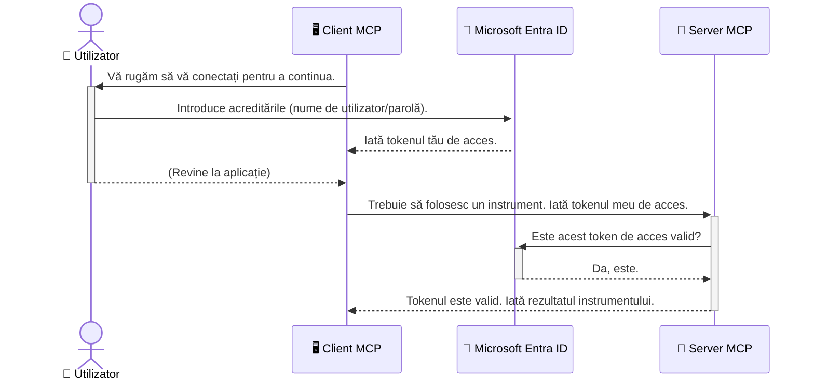

# Asigurarea fluxurilor de lucru AI: Autentificarea Entra ID pentru serverele Model Context Protocol

> [!NOTE]
> Codul serverului la distanță din această lecție protejează punctele finale `/sse` și `/message` moștenite
> și vizează MCP `2025-11-25`. Păstrează practicile sale de validare a identității și a tokenului,
> dar folosește un transport HTTP Streamable compatibil cu `2026-07-28` pentru noile implementări.


## Introducere
Asigurarea serverului Model Context Protocol (MCP) este la fel de importantă ca încuierea ușii de la intrarea în casă. Lăsarea serverului MCP deschis expune uneltele și datele la acces neautorizat, ceea ce poate conduce la breșe de securitate. Microsoft Entra ID oferă o soluție robustă bazată pe cloud pentru gestionarea identității și accesului, ajutând să vă asigurați că doar utilizatorii și aplicațiile autorizate pot interacționa cu serverul MCP. În această secțiune, veți învăța cum să protejați fluxurile de lucru AI folosind autentificarea Entra ID.

## Obiectivele de învățare
La finalul acestei secțiuni, veți putea:

- Înțelege importanța asigurării serverelor MCP.
- Explica bazele autentificării Microsoft Entra ID și OAuth 2.0.
- Recunoaște diferența dintre clienți publici și confidențiali.
- Implementa autentificarea Entra ID atât în scenarii locale (client public), cât și la distanță (client confidențial) pentru serverele MCP.
- Aplica cele mai bune practici de securitate în dezvoltarea fluxurilor de lucru AI.

## Securitate și MCP

La fel cum nu ați lăsa ușa principală a casei descuiată, nu ar trebui să lăsați serverul MCP deschis pentru oricine. Asigurarea fluxurilor de lucru AI este esențială pentru construirea de aplicații robuste, de încredere și sigure. Acest capitol vă va introduce în utilizarea Microsoft Entra ID pentru a securiza serverele MCP, asigurându-vă că doar utilizatorii și aplicațiile autorizate pot interacționa cu uneltele și datele dumneavoastră.

## De ce este importantă securitatea pentru serverele MCP

Imaginați-vă că serverul MCP are o unealtă care poate trimite e-mailuri sau accesa o bază de date a clienților. Un server nesecurizat ar însemna că oricine ar putea folosi acea unealtă, ducând la acces neautorizat la date, spam sau alte activități malițioase.

Prin implementarea autentificării, vă asigurați că fiecare cerere către server este verificată, confirmând identitatea utilizatorului sau a aplicației care face cererea. Acesta este primul și cel mai important pas în securizarea fluxurilor de lucru AI.

## Introducere în Microsoft Entra ID

[**Microsoft Entra ID**](https://adoption.microsoft.com/microsoft-security/entra/) este un serviciu bazat pe cloud pentru gestionarea identității și accesului. Gândiți-vă la el ca la un paznic universal pentru aplicațiile dumneavoastră. Gestionează procesul complex de verificare a identității utilizatorilor (autentificare) și determinarea a ceea ce au voie să facă aceștia (autorizare).

Folosind Entra ID, puteți:

- Permite autentificare sigură pentru utilizatori.
- Proteja API-urile și serviciile.
- Gestiona politicile de acces dintr-o locație centrală.

Pentru serverele MCP, Entra ID oferă o soluție robustă și larg recunoscută pentru gestionarea accesului la capabilitățile serverului dumneavoastră.

---

## Înțelegerea magiei: Cum funcționează autentificarea Entra ID

Entra ID folosește standarde deschise precum **OAuth 2.0** pentru a gestiona autentificarea. Deși detaliile pot fi complexe, conceptul de bază este simplu și poate fi înțeles printr-o analogie.

### O introducere blândă în OAuth 2.0: Cheia valetului

Gândiți-vă la OAuth 2.0 ca la un serviciu de valet pentru mașina dumneavoastră. Când ajungeți la un restaurant, nu îi dați valetului cheia principală. În schimb, îi oferiți o **cheie de valet** care are permisiuni limitate—poate porni mașina și închide ușile, dar nu poate deschide portbagajul sau torpedoul.

În această analogie:

- **Dumneavoastră** sunteți **Utilizatorul**.
- **Mașina dumneavoastră** este **Serverul MCP** cu uneltele și datele sale valoroase.
- **Valetul** este **Microsoft Entra ID**.
- **Agentul de parcări** este **Clientul MCP** (aplicația care încearcă să acceseze serverul).
- **Cheia de valet** este **Token-ul de acces**.

Token-ul de acces este un șir securizat de text pe care clientul MCP îl primește de la Entra ID după ce vă autentificați. Clientul apoi prezintă acest token serverului MCP la fiecare cerere. Serverul poate verifica token-ul pentru a se asigura că cererea este legitimă și că clientul are permisiunile necesare, toate acestea fără a trebui să gestioneze efectiv acreditările dumneavoastră reale (cum ar fi parola).

### Fluxul de autentificare

Iată cum funcționează procesul în practică:



### Prezentarea Microsoft Authentication Library (MSAL)

Înainte de a intra în cod, este important să introduceți un component cheie pe care îl veți vedea în exemple: **Microsoft Authentication Library (MSAL)**.

MSAL este o bibliotecă dezvoltată de Microsoft care face mult mai ușoară gestionarea autentificării pentru dezvoltatori. În loc să scrieți tot codul complex pentru a gestiona tokenurile de securitate, autentificările și reîmprospătările sesiunilor, MSAL se ocupă de aceste sarcini dificile.

Utilizarea unei biblioteci precum MSAL este puternic recomandată deoarece:

- **Este sigură:** implementează protocoale de standard industrial și cele mai bune practici de securitate, reducând riscul vulnerabilităților în codul dumneavoastră.
- **Simplifică dezvoltarea:** ascunde complexitatea protocoalelor OAuth 2.0 și OpenID Connect, permițându-vă să adăugați autentificare robustă aplicației cu doar câteva linii de cod.
- **Este întreținută:** Microsoft menține activ și actualizează MSAL pentru a aborda noi amenințări de securitate și modificări ale platformei.

MSAL suportă o varietate largă de limbaje și cadre de aplicații, inclusiv .NET, JavaScript/TypeScript, Python, Java, Go și platforme mobile precum iOS și Android. Aceasta înseamnă că puteți utiliza aceleași modele consistente de autentificare pe întregul dvs. stack tehnologic.

Pentru a afla mai multe despre MSAL, puteți consulta documentația oficială [prezentare generală MSAL](https://learn.microsoft.com/entra/identity-platform/msal-overview).

---

## Asigurarea serverului MCP cu Entra ID: Un ghid pas cu pas

Acum, haideți să parcurgem modul în care puteți securiza un server MCP local (care comunică prin `stdio`) folosind Entra ID. Acest exemplu utilizează un **client public**, potrivit pentru aplicații care rulează pe mașina utilizatorului, cum ar fi o aplicație desktop sau un server local de dezvoltare.

### Scenariul 1: Asigurarea unui server MCP local (cu un client public)

În acest scenariu, vom analiza un server MCP care rulează local, comunică prin `stdio` și folosește Entra ID pentru autentificarea utilizatorului înainte de a permite accesul la uneltele sale. Serverul va avea o unealtă unică care preia informațiile de profil ale utilizatorului din Microsoft Graph API.

#### 1. Configurarea aplicației în Entra ID

Înainte de a scrie orice cod, trebuie să vă înregistrați aplicația în Microsoft Entra ID. Aceasta informează Entra ID despre aplicația dumneavoastră și îi acordă permisiunea de a folosi serviciul de autentificare.

1. Accesați **[portalul Microsoft Entra](https://entra.microsoft.com/)**.
2. Mergeți la **Înregistrări aplicații** și faceți clic pe **Înregistrare nouă**.

3. Oferiți aplicației dvs. un nume (de exemplu, "My Local MCP Server").
4. Pentru **Tipurile de conturi acceptate**, selectați **Conturi doar în acest director organizațional**.
5. Pentru acest exemplu, puteți lăsa câmpul **URI de redirecționare** necompletat.
6. Faceți clic pe **Înregistrare**.

După înregistrare, rețineți **ID-ul aplicației (client)** și **ID-ul directorului (chiriașului)**. Veți avea nevoie de ele în codul dvs.

#### 2. Codul: O analiză detaliată

Să analizăm părțile cheie ale codului care gestionează autentificarea. Codul complet pentru acest exemplu este disponibil în folderul [Entra ID - Local - WAM](https://github.com/Azure-Samples/mcp-auth-servers/tree/main/src/entra-id-local-wam) din [repositorul mcp-auth-servers GitHub](https://github.com/Azure-Samples/mcp-auth-servers).

**`AuthenticationService.cs`**

Această clasă este responsabilă de gestionarea interacțiunii cu Entra ID.

- **`CreateAsync`**: Această metodă inițiază `PublicClientApplication` din MSAL (Microsoft Authentication Library). Este configurată cu `clientId` și `tenantId` ale aplicației dvs.
- **`WithBroker`**: Aceasta permite utilizarea unui broker (precum Windows Web Account Manager), care oferă o experiență de autentificare single sign-on mai sigură și mai fluidă.
- **`AcquireTokenAsync`**: Aceasta este metoda de bază. Mai întâi încearcă să obțină un token silențios (adică utilizatorul nu trebuie să se autentifice din nou dacă are deja o sesiune validă). Dacă tokenul silențios nu poate fi obținut, va solicita utilizatorului să se autentifice interactiv.

```csharp
// Simplified for clarity
public static async Task<AuthenticationService> CreateAsync(ILogger<AuthenticationService> logger)
{
    var msalClient = PublicClientApplicationBuilder
        .Create(_clientId) // Your Application (client) ID
        .WithAuthority(AadAuthorityAudience.AzureAdMyOrg)
        .WithTenantId(_tenantId) // Your Directory (tenant) ID
        .WithBroker(new BrokerOptions(BrokerOptions.OperatingSystems.Windows))
        .Build();

    // ... cache registration ...

    return new AuthenticationService(logger, msalClient);
}

public async Task<string> AcquireTokenAsync()
{
    try
    {
        // Try silent authentication first
        var accounts = await _msalClient.GetAccountsAsync();
        var account = accounts.FirstOrDefault();

        AuthenticationResult? result = null;

        if (account != null)
        {
            result = await _msalClient.AcquireTokenSilent(_scopes, account).ExecuteAsync();
        }
        else
        {
            // If no account, or silent fails, go interactive
            result = await _msalClient.AcquireTokenInteractive(_scopes).ExecuteAsync();
        }

        return result.AccessToken;
    }
    catch (Exception ex)
    {
        _logger.LogError(ex, "An error occurred while acquiring the token.");
        throw; // Optionally rethrow the exception for higher-level handling
    }
}
```

**`Program.cs`**

Aici este configurat serverul MCP și este integrat serviciul de autentificare.

- **`AddSingleton<AuthenticationService>`**: Înregistrează `AuthenticationService` în containerul de injecție a dependențelor, astfel încât să poată fi folosit de alte părți ale aplicației (precum instrumentul nostru).
- **Instrumentul `GetUserDetailsFromGraph`**: Acest instrument necesită o instanță a `AuthenticationService`. Înainte de orice, apelează `authService.AcquireTokenAsync()` pentru a obține un token de acces valid. Dacă autentificarea reușește, folosește tokenul pentru a apela API-ul Microsoft Graph și pentru a prelua detaliile utilizatorului.

```csharp
// Simplified for clarity
[McpServerTool(Name = "GetUserDetailsFromGraph")]
public static async Task<string> GetUserDetailsFromGraph(
    AuthenticationService authService)
{
    try
    {
        // This will trigger the authentication flow
        var accessToken = await authService.AcquireTokenAsync();

        // Use the token to create a GraphServiceClient
        var graphClient = new GraphServiceClient(
            new BaseBearerTokenAuthenticationProvider(new TokenProvider(authService)));

        var user = await graphClient.Me.GetAsync();

        return System.Text.Json.JsonSerializer.Serialize(user);
    }
    catch (Exception ex)
    {
        return $"Error: {ex.Message}";
    }
}
```

#### 3. Cum funcționează totul împreună

1. Atunci când clientul MCP încearcă să folosească instrumentul `GetUserDetailsFromGraph`, instrumentul apelează mai întâi `AcquireTokenAsync`.
2. `AcquireTokenAsync` declanșează biblioteca MSAL să verifice dacă există un token valid.
3. Dacă nu se găsește niciun token, MSAL, prin broker, va solicita utilizatorului să se autentifice cu contul său Entra ID.
4. Odată ce utilizatorul s-a autentificat, Entra ID emite un token de acces.
5. Instrumentul primește tokenul și îl folosește pentru a face un apel securizat către Microsoft Graph API.
6. Detaliile utilizatorului sunt returnate clientului MCP.

Acest proces asigură că doar utilizatorii autentificați pot folosi instrumentul, securizând eficient serverul dvs. local MCP.

### Scenariul 2: Securizarea unui server MCP la distanță (cu un client confidențial)

Când serverul MCP rulează pe o mașină la distanță (cum ar fi un server cloud) și comunică printr-un protocol precum HTTP Streaming, cerințele de securitate sunt diferite. În acest caz, ar trebui să folosiți un **client confidențial** și **Authorization Code Flow**. Aceasta este o metodă mai sigură deoarece secretele aplicației nu sunt niciodată expuse browserului.

Acest exemplu utilizează un server MCP bazat pe TypeScript care folosește Express.js pentru a gestiona cererile HTTP.

#### 1. Configurarea aplicației în Entra ID

Configurarea în Entra ID este similară cu cea a clientului public, dar cu o diferență cheie: trebuie să creați un **secret al clientului**.

1. Navigați la **[portalul Microsoft Entra](https://entra.microsoft.com/)**.
2. În înregistrarea aplicației dvs., accesați fila **Certificate și secrete**.
3. Faceți clic pe **New client secret**, dați-i o descriere și apăsați **Add**.
4. **Important:** Copiați imediat valoarea secretului. Nu veți mai putea să o vedeți din nou.
5. De asemenea, trebuie să configurați un **URI de redirecționare**. Mergeți la fila **Authentication**, faceți clic pe **Add a platform**, selectați **Web**, și introduceți URI-ul de redirecționare pentru aplicația dvs. (de exemplu, `http://localhost:3001/auth/callback`).

> **⚠️ Notă importantă de securitate:** Pentru aplicațiile de producție, Microsoft recomandă puternic să folosiți metode de autentificare **fără secrete** precum **Managed Identity** sau **Workload Identity Federation** în loc de secretele clientului. Secretele clientului prezintă riscuri de securitate deoarece pot fi expuse sau compromise. Identitățile gestionate oferă o abordare mai sigură eliminând necesitatea stocării credențialelor în cod sau configurație.
>
> Pentru mai multe informații despre identitățile gestionate și cum să le implementați, consultați [Panoramica identităților gestionate pentru resurse Azure](https://learn.microsoft.com/entra/identity/managed-identities-azure-resources/overview).

#### 2. Codul: O analiză detaliată

Acest exemplu utilizează o abordare bazată pe sesiune. Când utilizatorul se autentifică, serverul stochează tokenul de acces și tokenul de reîmprospătare în sesiune și oferă utilizatorului un token de sesiune. Acest token de sesiune este apoi folosit pentru cererile următoare. Codul complet pentru acest exemplu este disponibil în folderul [Entra ID - Confidential client](https://github.com/Azure-Samples/mcp-auth-servers/tree/main/src/entra-id-cca-session) din [repositorul mcp-auth-servers GitHub](https://github.com/Azure-Samples/mcp-auth-servers).

**`Server.ts`**

Acest fișier configurează serverul Express și stratul de transport MCP.

- **`requireBearerAuth`**: Acesta este un middleware care protejează endpoint-urile `/sse` și `/message`. Verifică prezența unui token bearer valid în antetul `Authorization` al cererii.
- **`EntraIdServerAuthProvider`**: Aceasta este o clasă personalizată care implementează interfața `McpServerAuthorizationProvider`. Este responsabilă pentru gestionarea fluxului OAuth 2.0.
- **`/auth/callback`**: Acest endpoint gestionează redirecționarea de la Entra ID după ce utilizatorul s-a autentificat. Face schimbul codului de autorizare pentru un token de acces și un token de reîmprospătare.

```typescript
// Simplificat pentru claritate
const app = express();
const { server } = createServer();
const provider = new EntraIdServerAuthProvider();

// Protejați endpoint-ul SSE
app.get("/sse", requireBearerAuth({
  provider,
  requiredScopes: ["User.Read"]
}), async (req, res) => {
  // ... conectați-vă la transport ...
});

// Protejați endpoint-ul mesajului
app.post("/message", requireBearerAuth({
  provider,
  requiredScopes: ["User.Read"]
}), async (req, res) => {
  // ... gestionați mesajul ...
});

// Gestionați apelul înapoi OAuth 2.0
app.get("/auth/callback", (req, res) => {
  provider.handleCallback(req.query.code, req.query.state)
    .then(result => {
      // ... gestionați succesul sau eșecul ...
    });
});
```

**`Tools.ts`**

Acest fișier definește instrumentele pe care le oferă serverul MCP. Instrumentul `getUserDetails` este similar cu cel din exemplul anterior, dar obține tokenul de acces din sesiune.

```typescript
// Simplificat pentru claritate
server.setRequestHandler(CallToolRequestSchema, async (request) => {
  const { name } = request.params;
  const context = request.params?.context as { token?: string } | undefined;
  const sessionToken = context?.token;

  if (name === ToolName.GET_USER_DETAILS) {
    if (!sessionToken) {
      throw new AuthenticationError("Authentication token is missing or invalid. Ensure the token is provided in the request context.");
    }

    // Obține token-ul Entra ID din depozitul de sesiune
    const tokenData = tokenStore.getToken(sessionToken);
    const entraIdToken = tokenData.accessToken;

    const graphClient = Client.init({
      authProvider: (done) => {
        done(null, entraIdToken);
      }
    });

    const user = await graphClient.api('/me').get();

    // ... returnează detaliile utilizatorului ...
  }
});
```

**`auth/EntraIdServerAuthProvider.ts`**

Această clasă se ocupă de logica pentru:

- Redirecționarea utilizatorului către pagina de autentificare Entra ID.
- Schimbarea codului de autorizare pentru un token de acces.
- Stocarea tokenurilor în `tokenStore`.

- Reîmprospătarea tokenului de acces când expiră.


#### 3. Cum Funcționează Totul Împreună

1. Când un utilizator încearcă prima dată să se conecteze la serverul MCP, middleware-ul `requireBearerAuth` va observa că nu are o sesiune validă și îl va redirecționa către pagina de autentificare Entra ID.
2. Utilizatorul se conectează cu contul său Entra ID.
3. Entra ID redirecționează utilizatorul înapoi la endpoint-ul `/auth/callback` cu un cod de autorizare.
4. Serverul schimbă codul pe un token de acces și un token de reîmprospătare, le stochează și creează un token de sesiune care este trimis clientului.
5. Clientul poate acum să folosească acest token de sesiune în antetul `Authorization` pentru toate cererile viitoare către serverul MCP.
6. Când este apelat instrumentul `getUserDetails`, acesta folosește tokenul de sesiune pentru a găsi tokenul de acces Entra ID și apoi îl folosește pentru a apela API-ul Microsoft Graph.

Acest flux este mai complex decât fluxul pentru clientul public, dar este necesar pentru endpoint-urile orientate către internet. Deoarece serverele MCP îndepărtate sunt accesibile prin internetul public, ele au nevoie de măsuri de securitate mai puternice pentru a proteja împotriva accesului neautorizat și a potențialelor atacuri.


## Cele Mai Bune Practici de Securitate

- **Folosiți întotdeauna HTTPS**: Criptați comunicarea dintre client și server pentru a proteja tokenurile de a fi interceptate.
- **Implementați Controlul Accesului Bazat pe Roluri (RBAC)**: Nu verificați doar *dacă* un utilizator este autenticat; verificați *ce* este autorizat să facă. Puteți defini roluri în Entra ID și le puteți verifica în serverul vostru MCP.
- **Monitorizați și auditați**: Înregistrați toate evenimentele de autentificare pentru a detecta și răspunde la activități suspecte.
- **Gestionați limitarea ratei și throttling-ul**: Microsoft Graph și alte API-uri implementează limitarea ratei pentru a preveni abuzul. Implementați în serverul MCP logica de backoff exponențial și retry pentru a gestiona elegant răspunsurile HTTP 429 (Too Many Requests). Luați în considerare cache-ul datelor accesate frecvent pentru a reduce apelurile API.
- **Stocarea securizată a tokenurilor**: Stocați în siguranță tokenurile de acces și refresh. Pentru aplicațiile locale, folosiți mecanismele de stocare securizată ale sistemului. Pentru aplicațiile server, luați în considerare stocarea criptată sau serviciile de gestionare a cheilor securizate precum Azure Key Vault.
- **Gestionarea expirării tokenurilor**: Tokenurile de acces au o durată de viață limitată. Implementați reîmprospătarea automată a tokenurilor folosind tokenurile de refresh pentru a menține o experiență fluidă a utilizatorului fără a necesita reautentificare.
- **Luați în considerare utilizarea Azure API Management**: În timp ce implementarea securității direct în serverul MCP vă oferă un control detaliat, gateway-urile API precum Azure API Management pot gestiona automat multe dintre aceste probleme de securitate, inclusiv autentificarea, autorizarea, limitarea ratei și monitorizarea. Ele oferă un strat de securitate centralizat care se situează între clienți și serverele MCP. Pentru mai multe detalii despre utilizarea gateway-urilor API cu MCP, consultați [Azure API Management Your Auth Gateway For MCP Servers](https://techcommunity.microsoft.com/blog/integrationsonazureblog/azure-api-management-your-auth-gateway-for-mcp-servers/4402690).


## Concluzii Cheie

- Securizarea serverului MCP este crucială pentru protejarea datelor și a instrumentelor.
- Microsoft Entra ID oferă o soluție robustă și scalabilă pentru autentificare și autorizare.
- Folosiți un **client public** pentru aplicațiile locale și un **client confidențial** pentru serverele îndepărtate.
- Fluxul **Authorization Code Flow** este cea mai sigură opțiune pentru aplicațiile web.


## Exercițiu

1. Gândiți-vă la un server MCP pe care ați putea să-l construiți. Ar fi un server local sau unul îndepărtat?
2. Pe baza răspunsului, ați folosi un client public sau confidențial?
3. Ce permisiune ar solicita serverul MCP pentru a efectua acțiuni asupra Microsoft Graph?


## Exerciții Practice

### Exercițiul 1: Înregistrarea unei Aplicații în Entra ID
Accesați portalul Microsoft Entra.
Înregistrați o aplicație nouă pentru serverul vostru MCP.
Notați ID-ul Aplicației (client) și ID-ul Directorului (tenant).

### Exercițiul 2: Securizarea unui Server MCP Local (Client Public)
- Urmați exemplul de cod pentru integrarea MSAL (Microsoft Authentication Library) pentru autentificarea utilizatorului.
- Testați fluxul de autentificare apelând instrumentul MCP care preia detaliile utilizatorului din Microsoft Graph.

### Exercițiul 3: Securizarea unui Server MCP Îndepărtat (Client Confidențial)
- Înregistrați un client confidențial în Entra ID și creați un secret pentru client.
- Configurați serverul MCP Express.js să folosească Authorization Code Flow.
- Testați endpointurile protejate și confirmați accesul pe bază de token.

### Exercițiul 4: Aplicarea celor Mai Bune Practici de Securitate
- Activați HTTPS pentru serverul vostru local sau îndepărtat.
- Implementați controlul accesului bazat pe roluri (RBAC) în logica serverului.
- Adăugați gestionarea expirării tokenurilor și stocarea securizată a tokenurilor.

## Resurse

1. **Documentație Generală MSAL**  
   Aflați cum Biblioteca Microsoft de Autentificare (MSAL) permite achiziția securizată a tokenurilor pe multiple platforme:  
   [MSAL Overview on Microsoft Learn](https://learn.microsoft.com/en-gb/entra/msal/overview)

2. **Depozitul GitHub Azure-Samples/mcp-auth-servers**  
   Implementări de referință pentru servere MCP care demonstrează fluxurile de autentificare:  
   [Azure-Samples/mcp-auth-servers on GitHub](https://github.com/Azure-Samples/mcp-auth-servers)

3. **Prezentare generală Identități Gestionate pentru Resurse Azure**  
   Înțelegeți cum să eliminați secretele folosind identități gestionate atribuite sistemului sau utilizatorului:  
   [Managed Identities Overview on Microsoft Learn](https://learn.microsoft.com/en-us/entra/identity/managed-identities-azure-resources/)

4. **Azure API Management: Poarta voastră de Autentificare pentru Serverele MCP**  
   O analiză aprofundată a utilizării APIM ca gateway OAuth2 securizat pentru serverele MCP:  
   [Azure API Management Your Auth Gateway For MCP Servers](https://techcommunity.microsoft.com/blog/integrationsonazureblog/azure-api-management-your-auth-gateway-for-mcp-servers/4402690)

5. **Referință Permisiuni Microsoft Graph**  
   Listă cuprinzătoare a permisiunilor delegate și pentru aplicații pentru Microsoft Graph:  
   [Microsoft Graph Permissions Reference](https://learn.microsoft.com/zh-tw/graph/permissions-reference)


## Obiectivele Învățării
După finalizarea acestei secțiuni, veți putea să:

- Explicați de ce autentificarea este critică pentru serverele MCP și fluxurile de lucru AI.
- Configurați și configurați autentificarea Entra ID pentru ambele scenarii: server MCP local și îndepărtat.
- Alegeți tipul de client potrivit (public sau confidențial) pe baza implementării serverului.
- Implementați practici de programare securizată, inclusiv stocarea tokenurilor și autorizarea bazată pe roluri.
- Protejați cu încredere serverul MCP și instrumentele sale împotriva accesului neautorizat.

## Ce urmează

- [5.13 Model Context Protocol (MCP) Integrare cu Microsoft Foundry](../mcp-foundry-agent-integration/README.md)

---

<!-- CO-OP TRANSLATOR DISCLAIMER START -->
**Declinare a responsabilității**:
Acest document a fost tradus folosind serviciul de traducere AI [Co-op Translator](https://github.com/Azure/co-op-translator). În timp ce ne străduim pentru acuratețe, vă rugăm să rețineți că traducerile automate pot conține erori sau inexactități. Documentul original în limba sa nativă trebuie considerat sursa autorizată. Pentru informații critice, se recomandă traducerea profesională realizată de un om. Nu ne asumăm responsabilitatea pentru eventualele neînțelegeri sau interpretări greșite care decurg din utilizarea acestei traduceri.
<!-- CO-OP TRANSLATOR DISCLAIMER END -->