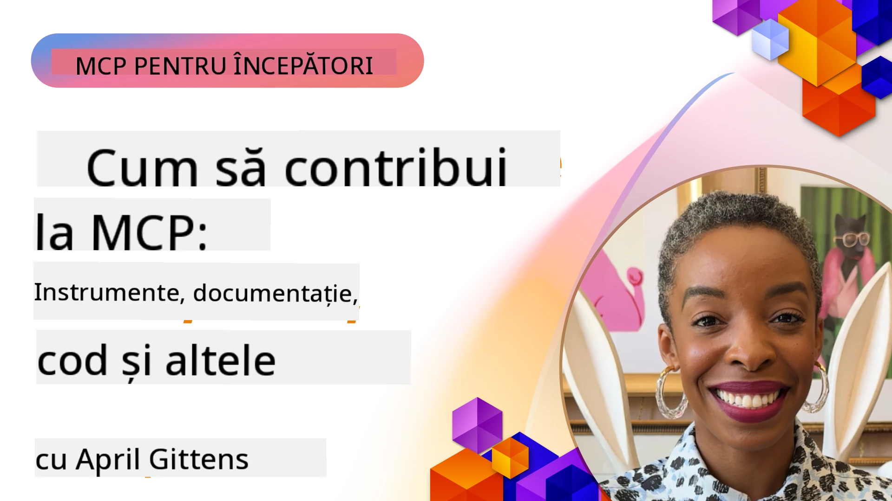

# Comunitate și Contribuții

[](https://youtu.be/v1pvCYAWpRE)

_(Faceți clic pe imaginea de mai sus pentru a viziona videoclipul acestei lecții)_

## Prezentare generală

Această lecție se concentrează pe modul de implicare în comunitatea MCP, contribuirea la ecosistemul MCP și respectarea celor mai bune practici pentru dezvoltarea colaborativă. Înțelegerea modului de a participa la proiectele open-source MCP este esențială pentru cei care doresc să modeleze viitorul acestei tehnologii.

## Obiective de învățare

Până la sfârșitul acestei lecții, vei putea să:

- Înțelegi structura comunității și ecosistemului MCP
- Participi eficient în forumurile și discuțiile comunității MCP
- Contribui la depozitele open-source MCP
- Creezi și partajezi unelte și servere MCP personalizate
- Urmezi cele mai bune practici pentru dezvoltarea și colaborarea MCP
- Descoperi resurse și cadre comunitare pentru dezvoltarea MCP

## Ecosistemul Comunității MCP

Ecosistemul MCP constă în diferite componente și participanți care lucrează împreună pentru a avansa protocolul.

### Componente Cheie ale Comunității

1. **Administratorii Protocolului de Bază**: Organizația oficială [Model Context Protocol GitHub](https://github.com/modelcontextprotocol) menține specificațiile de bază MCP și implementările de referință
2. **Dezvoltatori de Unelte**: Persoane și echipe care creează unelte și servere MCP
3. **Furnizori de Integrare**: Companii care integrează MCP în produsele și serviciile lor
4. **Utilizatori Finali**: Dezvoltatori și organizații care folosesc MCP în aplicațiile lor
5. **Contribuitori**: Membri ai comunității care contribuie cu cod, documentație sau alte resurse

### Resurse Comunitare

#### Canale Oficiale

- [Organizația MCP pe GitHub](https://github.com/modelcontextprotocol)
- [Documentația MCP](https://modelcontextprotocol.io/)
- [Specificația MCP](https://modelcontextprotocol.io/specification/2026-07-28/)
- [Discuții pe GitHub](https://github.com/orgs/modelcontextprotocol/discussions)
- [Depozitul cu Exemple & Servere MCP](https://github.com/modelcontextprotocol/servers)

#### Resurse Comunitare Dezvoltate

- [Clienți MCP](https://modelcontextprotocol.io/clients) - Listă de clienți care susțin integrări MCP
- [Servere MCP Comunitare](https://github.com/modelcontextprotocol/servers?tab=readme-ov-file#-community-servers) - Listă în creștere de servere MCP dezvoltate de comunitate
- [Awesome MCP Servers](https://github.com/wong2/awesome-mcp-servers) - Listă curată de servere MCP
- [PulseMCP](https://www.pulsemcp.com/) - Hub comunitar & newsletter pentru descoperirea resurselor MCP
- [Remote OpenClaw](https://www.remoteopenclaw.com/) - Director gratuit căutabil de servere MCP, abilități ale agenților și plugin-uri
- [Server Discord](https://discord.gg/jHEGxQu2a5) - Conectează-te cu dezvoltatorii MCP
- Implementări SDK specifice limbajelor
- Articole de blog și tutoriale

## Contribuind la MCP

### Tipuri de Contribuții

Ecosistemul MCP primește cu brațele deschise diverse tipuri de contribuții:

1. **Contribuții de Cod**:
   - Îmbunătățiri ale protocolului de bază
   - Repararea erorilor
   - Implementări de unelte și servere
   - Biblioteci client/server în diferite limbaje

2. **Documentație**:
   - Îmbunătățirea documentației existente
   - Crearea de tutoriale și ghiduri
   - Traducerea documentației
   - Crearea de exemple și aplicații demonstrative

3. **Sprijin Comunitar**:
   - Răspunsuri la întrebări pe forumuri și discuții
   - Testarea și raportarea problemelor
   - Organizarea de evenimente comunitare
   - Mentorarea noilor contribuitori

### Procesul de Contribuție: Protocolul de Bază

Pentru a contribui la protocolul MCP de bază sau la implementările oficiale, urmează aceste principii din [ghidul oficial de contribuție](https://github.com/modelcontextprotocol/modelcontextprotocol/blob/main/CONTRIBUTING.md):

1. **Simplitate și Minimalism**: Specificația MCP menține un standard ridicat pentru adăugarea de concepte noi. Este mai ușor să adaugi lucruri într-o specificație decât să le elimini.

2. **Abordare Concretă**: Modificările specificației trebuie să se bazeze pe provocări reale de implementare, nu pe idei speculative.

3. **Etapele unei Propuneri**:
   - Definirea: Explorează problema, validează dacă alți utilizatori MCP întâmpină o problemă similară
   - Prototipare: Construiește o soluție exemplu și demonstrează aplicabilitatea practică
   - Scriere: Pe baza prototipului, scrie o propunere de specificație

### Configurarea Mediului de Dezvoltare

```bash
# Bifurcați depozitul
git clone https://github.com/YOUR-USERNAME/modelcontextprotocol.git
cd modelcontextprotocol

# Instalați dependențele
npm install

# Pentru modificări ale schemei, validați și generați schema.json:
npm run check:schema:ts
npm run generate:schema

# Pentru modificări în documentație
npm run check:docs
npm run format

# Previzualizați documentația local (opțional):
npm run serve:docs
```

### Exemplu: Contribuind cu o Corecție de Bug

```javascript
// Cod original cu bug în typescript-sdk
export function validateResource(resource: unknown): resource is MCPResource {
  if (!resource || typeof resource !== 'object') {
    return false;
  }
  
  // Bug: Lipsă validare proprietate
  // Implementare curentă:
  const hasName = 'name' in resource;
  const hasSchema = 'schema' in resource;
  
  return hasName && hasSchema;
}

// Implementare corectată într-o contribuție
export function validateResource(resource: unknown): resource is MCPResource {
  if (!resource || typeof resource !== 'object') {
    return false;
  }
  
  // Validare îmbunătățită
  const hasName = 'name' in resource && typeof (resource as MCPResource).name === 'string';
  const hasSchema = 'schema' in resource && typeof (resource as MCPResource).schema === 'object';
  const hasDescription = !('description' in resource) || typeof (resource as MCPResource).description === 'string';
  
  return hasName && hasSchema && hasDescription;
}
```

### Exemplu: Adăugarea unei Unelte Noi în Biblioteca Standard

```python
# Exemplu de contribuție: Un instrument de procesare a datelor CSV pentru biblioteca standard MCP

from mcp_tools import Tool, ToolRequest, ToolResponse, ToolExecutionException
import pandas as pd
import io
import json
from typing import Dict, Any, List, Optional

class CsvProcessingTool(Tool):
    """
    Tool for processing and analyzing CSV data.
    
    This tool allows models to extract information from CSV files,
    run basic analysis, and convert data between formats.
    """
    
    def get_name(self):
        return "csvProcessor"
        
    def get_description(self):
        return "Processes and analyzes CSV data"
    
    def get_schema(self):
        return {
            "type": "object",
            "properties": {
                "csvData": {
                    "type": "string", 
                    "description": "CSV data as a string"
                },
                "csvUrl": {
                    "type": "string",
                    "description": "URL to a CSV file (alternative to csvData)"
                },
                "operation": {
                    "type": "string",
                    "enum": ["summary", "filter", "transform", "convert"],
                    "description": "Operation to perform on the CSV data"
                },
                "filterColumn": {
                    "type": "string",
                    "description": "Column to filter by (for filter operation)"
                },
                "filterValue": {
                    "type": "string",
                    "description": "Value to filter for (for filter operation)"
                },
                "outputFormat": {
                    "type": "string",
                    "enum": ["json", "csv", "markdown"],
                    "default": "json",
                    "description": "Output format for the processed data"
                }
            },
            "oneOf": [
                {"required": ["csvData", "operation"]},
                {"required": ["csvUrl", "operation"]}
            ]
        }
    
    async def execute_async(self, request: ToolRequest) -> ToolResponse:
        try:
            # Extrage parametrii
            operation = request.parameters.get("operation")
            output_format = request.parameters.get("outputFormat", "json")
            
            # Obține date CSV fie din date directe, fie din URL
            df = await self._get_dataframe(request)
            
            # Procesează în funcție de operația solicitată
            result = {}
            
            if operation == "summary":
                result = self._generate_summary(df)
            elif operation == "filter":
                column = request.parameters.get("filterColumn")
                value = request.parameters.get("filterValue")
                if not column:
                    raise ToolExecutionException("filterColumn is required for filter operation")
                result = self._filter_data(df, column, value)
            elif operation == "transform":
                result = self._transform_data(df, request.parameters)
            elif operation == "convert":
                result = self._convert_format(df, output_format)
            else:
                raise ToolExecutionException(f"Unknown operation: {operation}")
            
            return ToolResponse(result=result)
        
        except Exception as e:
            raise ToolExecutionException(f"CSV processing failed: {str(e)}")
    
    async def _get_dataframe(self, request: ToolRequest) -> pd.DataFrame:
        """Gets a pandas DataFrame from either CSV data or URL"""
        if "csvData" in request.parameters:
            csv_data = request.parameters.get("csvData")
            return pd.read_csv(io.StringIO(csv_data))
        elif "csvUrl" in request.parameters:
            csv_url = request.parameters.get("csvUrl")
            return pd.read_csv(csv_url)
        else:
            raise ToolExecutionException("Either csvData or csvUrl must be provided")
    
    def _generate_summary(self, df: pd.DataFrame) -> Dict[str, Any]:
        """Generates a summary of the CSV data"""
        return {
            "columns": df.columns.tolist(),
            "rowCount": len(df),
            "columnCount": len(df.columns),
            "numericColumns": df.select_dtypes(include=['number']).columns.tolist(),
            "categoricalColumns": df.select_dtypes(include=['object']).columns.tolist(),
            "sampleRows": json.loads(df.head(5).to_json(orient="records")),
            "statistics": json.loads(df.describe().to_json())
        }
    
    def _filter_data(self, df: pd.DataFrame, column: str, value: str) -> Dict[str, Any]:
        """Filters the DataFrame by a column value"""
        if column not in df.columns:
            raise ToolExecutionException(f"Column '{column}' not found")
            
        filtered_df = df[df[column].astype(str).str.contains(value)]
        
        return {
            "originalRowCount": len(df),
            "filteredRowCount": len(filtered_df),
            "data": json.loads(filtered_df.to_json(orient="records"))
        }
    
    def _transform_data(self, df: pd.DataFrame, params: Dict[str, Any]) -> Dict[str, Any]:
        """Transforms the data based on parameters"""
        # Implementarea ar include diverse transformări
        return {
            "status": "success",
            "message": "Transformation applied"
        }
    
    def _convert_format(self, df: pd.DataFrame, format: str) -> Dict[str, Any]:
        """Converts the DataFrame to different formats"""
        if format == "json":
            return {
                "data": json.loads(df.to_json(orient="records")),
                "format": "json"
            }
        elif format == "csv":
            return {
                "data": df.to_csv(index=False),
                "format": "csv"
            }
        elif format == "markdown":
            return {
                "data": df.to_markdown(),
                "format": "markdown"
            }
        else:
            raise ToolExecutionException(f"Unsupported output format: {format}")
```

### Ghiduri pentru Contribuție

Pentru a realiza o contribuție de succes la proiectele MCP:

1. **Începe Mic**: Începe cu documentație, corecții de buguri sau îmbunătățiri mici
2. **Urmează Ghidul de Stil**: Respectă stilul și convențiile de codare ale proiectului
3. **Scrie Teste**: Include teste unitare pentru contribuțiile tale
4. **Documentează-ți Munca**: Adaugă documentație clară pentru funcționalitățile sau modificările noi
5. **Trimite PR-uri Țintite**: Păstrează pull request-urile concentrate pe o singură problemă sau caracteristică
6. **Interacționează cu Feedback-ul**: Fii receptiv la feedback-ul legat de contribuțiile tale

### Exemplu de Flux de Lucru pentru Contribuție

```bash
# Clonează depozitul
git clone https://github.com/modelcontextprotocol/typescript-sdk.git
cd typescript-sdk

# Creează un nou branch pentru contribuția ta
git checkout -b feature/my-contribution

# Fă modificările tale
# ...

# Rulează testele pentru a te asigura că modificările tale nu strică funcționalitățile existente
npm test

# Confirmă modificările cu un mesaj descriptiv
git commit -am "Fix validation in resource handler"

# Împinge branch-ul tău către fork-ul tău
git push origin feature/my-contribution

# Creează o cerere de pull din branch-ul tău către depozitul principal
# Apoi implică-te în feedback și iterează asupra PR-ului tău după necesitate
```

## Crearea și Partajarea Serverelor MCP

Unul dintre cele mai valoroase moduri de a contribui la ecosistemul MCP este prin crearea și partajarea serverelor MCP personalizate. Comunitatea a dezvoltat deja sute de servere pentru diverse servicii și cazuri de utilizare.

### Cadre de Dezvoltare pentru Servere MCP

Sunt disponibile mai multe cadre pentru a simplifica dezvoltarea serverelor MCP:

1. **SDK-uri Oficiale** (consultă
    [documentația SDK](https://modelcontextprotocol.io/docs/sdk) pentru fiecare
    revizie de protocol susținută de SDK):
   - [SDK TypeScript](https://github.com/modelcontextprotocol/typescript-sdk)
   - [SDK Python](https://github.com/modelcontextprotocol/python-sdk)
   - [SDK C#](https://github.com/modelcontextprotocol/csharp-sdk)
   - [SDK Go](https://github.com/modelcontextprotocol/go-sdk)
   - [SDK Java](https://github.com/modelcontextprotocol/java-sdk)
   - [SDK Kotlin](https://github.com/modelcontextprotocol/kotlin-sdk)
   - [SDK Swift](https://github.com/modelcontextprotocol/swift-sdk)
   - [SDK Rust](https://github.com/modelcontextprotocol/rust-sdk)

2. **Cadre Comunitare**:
   - [MCP-Framework](https://mcp-framework.com/) - Construiește servere MCP cu eleganță și viteză în TypeScript
   - [MCP Declarative Java SDK](https://github.com/codeboyzhou/mcp-declarative-java-sdk) - Servere MCP bazate pe anotații cu Java
   - [Quarkus MCP Server SDK](https://github.com/quarkiverse/quarkus-mcp-server) - Cadru Java pentru servere MCP
   - [Next.js MCP Server Template](https://github.com/vercel-labs/mcp-for-next.js) - Proiect starter Next.js pentru servere MCP

### Dezvoltarea Uneltelor de Partajat

#### Exemplu .NET: Crearea unui Pachet de Unelte de Partajat

```csharp
// Create a new .NET library project
// dotnet new classlib -n McpFinanceTools

using Microsoft.Mcp.Tools;
using System.Threading.Tasks;
using System.Net.Http;
using System.Text.Json;

namespace McpFinanceTools
{
    // Stock quote tool
    public class StockQuoteTool : IMcpTool
    {
        private readonly HttpClient _httpClient;
        
        public StockQuoteTool(HttpClient httpClient = null)
        {
            _httpClient = httpClient ?? new HttpClient();
        }
        
        public string Name => "stockQuote";
        public string Description => "Gets current stock quotes for specified symbols";
        
        public object GetSchema()
        {
            return new {
                type = "object",
                properties = new {
                    symbol = new { 
                        type = "string",
                        description = "Stock symbol (e.g., MSFT, AAPL)" 
                    },
                    includeHistory = new { 
                        type = "boolean",
                        description = "Whether to include historical data",
                        default = false
                    }
                },
                required = new[] { "symbol" }
            };
        }
        
        public async Task<ToolResponse> ExecuteAsync(ToolRequest request)
        {
            // Extract parameters
            string symbol = request.Parameters.GetProperty("symbol").GetString();
            bool includeHistory = false;
            
            if (request.Parameters.TryGetProperty("includeHistory", out var historyProp))
            {
                includeHistory = historyProp.GetBoolean();
            }
            
            // Call external API (example)
            var quoteResult = await GetStockQuoteAsync(symbol);
            
            // Add historical data if requested
            if (includeHistory)
            {
                var historyData = await GetStockHistoryAsync(symbol);
                quoteResult.Add("history", historyData);
            }
            
            // Return formatted result
            return new ToolResponse {
                Result = JsonSerializer.SerializeToElement(quoteResult)
            };
        }
        
        private async Task<Dictionary<string, object>> GetStockQuoteAsync(string symbol)
        {
            // Implementation would call a real stock API
            // This is a simplified example
            return new Dictionary<string, object>
            {
                ["symbol"] = symbol,
                ["price"] = 123.45,
                ["change"] = 2.5,
                ["percentChange"] = 1.2,
                ["lastUpdated"] = DateTime.UtcNow
            };
        }
        
        private async Task<object> GetStockHistoryAsync(string symbol)
        {
            // Implementation would get historical data
            // Simplified example
            return new[]
            {
                new { date = DateTime.Now.AddDays(-7).Date, price = 120.25 },
                new { date = DateTime.Now.AddDays(-6).Date, price = 122.50 },
                new { date = DateTime.Now.AddDays(-5).Date, price = 121.75 }
                // More historical data...
            };
        }
    }
}

// Create package and publish to NuGet
// dotnet pack -c Release
// dotnet nuget push bin/Release/McpFinanceTools.1.0.0.nupkg -s https://api.nuget.org/v3/index.json -k YOUR_API_KEY
```

#### Exemplu Java: Crearea unui Pachet Maven pentru Unelte

```java
// configurație pom.xml pentru un pachet MCP unelte partajabil
<!-- 
<project>
    <groupId>com.example</groupId>
    <artifactId>mcp-weather-tools</artifactId>
    <version>1.0.0</version>
    
    <dependencies>
        <dependency>
            <groupId>com.mcp</groupId>
            <artifactId>mcp-server</artifactId>
            <version>1.0.0</version>
        </dependency>
    </dependencies>
    
    <distributionManagement>
        <repository>
            <id>github</id>
            <name>GitHub Packages</name>
            <url>https://maven.pkg.github.com/username/mcp-weather-tools</url>
        </repository>
    </distributionManagement>
</project>
-->

package com.example.mcp.weather;

import com.mcp.tools.Tool;
import com.mcp.tools.ToolRequest;
import com.mcp.tools.ToolResponse;
import com.mcp.tools.ToolExecutionException;

import java.net.http.HttpClient;
import java.net.http.HttpRequest;
import java.net.http.HttpResponse;
import java.net.URI;
import java.util.HashMap;
import java.util.Map;

public class WeatherForecastTool implements Tool {
    private final HttpClient httpClient;
    private final String apiKey;
    
    public WeatherForecastTool(String apiKey) {
        this.httpClient = HttpClient.newHttpClient();
        this.apiKey = apiKey;
    }
    
    @Override
    public String getName() {
        return "weatherForecast";
    }
    
    @Override
    public String getDescription() {
        return "Gets weather forecast for a specified location";
    }
    
    @Override
    public Object getSchema() {
        Map<String, Object> schema = new HashMap<>();
        // Definiția schemei...
        return schema;
    }
    
    @Override
    public ToolResponse execute(ToolRequest request) {
        try {
            String location = request.getParameters().get("location").asText();
            int days = request.getParameters().has("days") ? 
                request.getParameters().get("days").asInt() : 3;
            
            // Apelare API meteo
            Map<String, Object> forecast = getForecast(location, days);
            
            // Construiește răspunsul
            return new ToolResponse.Builder()
                .setResult(forecast)
                .build();
        } catch (Exception ex) {
            throw new ToolExecutionException("Weather forecast failed: " + ex.getMessage(), ex);
        }
    }
    
    private Map<String, Object> getForecast(String location, int days) {
        // Implementarea ar apela API-ul meteo
        // Exemplu simplificat
        Map<String, Object> result = new HashMap<>();
        // Adaugă date de prognoză...
        return result;
    }
}

// Construiește și publică folosind Maven
// mvn clean package
// mvn deploy
```

#### Exemplu Python: Publicarea unui Pachet PyPI

```python
# Structura directorului pentru un pachet PyPI:
# mcp_nlp_tools/
# ├── LICENSE
# ├── README.md
# ├── setup.py
# ├── mcp_nlp_tools/
# │   ├── __init__.py
# │   ├── sentiment_tool.py
# │   └── translation_tool.py

# Exemplu setup.py
"""
from setuptools import setup, find_packages

setup(
    name="mcp_nlp_tools",
    version="0.1.0",
    packages=find_packages(),
    install_requires=[
        "mcp_server>=1.0.0",
        "transformers>=4.0.0",
        "torch>=1.8.0"
    ],
    author="Your Name",
    author_email="your.email@example.com",
    description="MCP tools for natural language processing tasks",
    long_description=open("README.md").read(),
    long_description_content_type="text/markdown",
    url="https://github.com/username/mcp_nlp_tools",
    classifiers=[
        "Programming Language :: Python :: 3",
        "License :: OSI Approved :: MIT License",
        "Operating System :: OS Independent",
    ],
    python_requires=">=3.8",
)
"""

# Exemplu de implementare a unui instrument NLP (sentiment_tool.py)
from mcp_tools import Tool, ToolRequest, ToolResponse, ToolExecutionException
from transformers import pipeline
import torch

class SentimentAnalysisTool(Tool):
    """MCP tool for sentiment analysis of text"""
    
    def __init__(self, model_name="distilbert-base-uncased-finetuned-sst-2-english"):
        # Încarcă modelul de analiză a sentimentelor
        self.sentiment_analyzer = pipeline("sentiment-analysis", model=model_name)
    
    def get_name(self):
        return "sentimentAnalysis"
        
    def get_description(self):
        return "Analyzes the sentiment of text, classifying it as positive or negative"
    
    def get_schema(self):
        return {
            "type": "object",
            "properties": {
                "text": {
                    "type": "string", 
                    "description": "The text to analyze for sentiment"
                },
                "includeScore": {
                    "type": "boolean",
                    "description": "Whether to include confidence scores",
                    "default": True
                }
            },
            "required": ["text"]
        }
    
    async def execute_async(self, request: ToolRequest) -> ToolResponse:
        try:
            # Extrage parametrii
            text = request.parameters.get("text")
            include_score = request.parameters.get("includeScore", True)
            
            # Analizează sentimentul
            sentiment_result = self.sentiment_analyzer(text)[0]
            
            # Formatează rezultatul
            result = {
                "sentiment": sentiment_result["label"],
                "text": text
            }
            
            if include_score:
                result["score"] = sentiment_result["score"]
            
            # Returnează rezultatul
            return ToolResponse(result=result)
            
        except Exception as e:
            raise ToolExecutionException(f"Sentiment analysis failed: {str(e)}")

# Pentru a publica:
# python setup.py sdist bdist_wheel
# python -m twine upload dist/*
```

### Partajarea celor mai bune practici

Când partajezi unelte MCP cu comunitatea:

1. **Documentație Completă**:
   - Documentează scopul, utilizarea și exemplele
   - Explică parametrii și valorile de returnare
   - Documentează eventualele dependențe externe

2. **Gestionarea Erorilor**:
   - Implementează o gestionare robustă a erorilor
   - Oferă mesaje de eroare utile
   - Gestionează cazurile limită cu grație

3. **Considerații privind Performanța**:
   - Optimizează atât pentru viteză, cât și pentru consumul de resurse
   - Implementează caching-ul când este cazul
   - Ia în considerare scalabilitatea

4. **Securitate**:
   - Folosește chei API și autentificare securizate
   - Validează și igienizează input-urile
   - Implementează limitarea ratei pentru apelurile API externe

5. **Testare**:
   - Include o acoperire completă a testelor
   - Testează cu diferite tipuri de input și cazuri-limită
   - Documentează procedurile de testare

## Colaborare în Comunitate și Cele Mai Bune Practici

Colaborarea eficientă este cheia unui ecosistem MCP prosper.

### Canale de Comunicare

- Probleme și discuții pe GitHub
- Microsoft Tech Community
- Canale Discord și Slack
- Stack Overflow (tag: `model-context-protocol` sau `mcp`)

### Revizuiri de Cod

La revizuirea contribuțiilor MCP:

1. **Claritate**: Codul este clar și bine documentat?
2. **Corectitudine**: Funcționează conform așteptărilor?
3. **Consistență**: Respectă convențiile proiectului?
4. **Completitudine**: Sunt incluse testele și documentația?
5. **Securitate**: Există preocupări legate de securitate?

### Compatibilitate Versiuni

La dezvoltarea pentru MCP:

1. **Gestionarea Versiunii Protocolului**: Respectă versiunea protocolului MCP pe care uneltele tale o susțin
2. **Compatibilitate Client**: Ia în considerare compatibilitatea inversă
3. **Compatibilitate Server**: Urmează ghidurile pentru implementarea serverului
4. **Modificări Breaking**: Documentează clar orice modificări incompatibile

## Exemplu de Proiect Comunitar: Registrul Unelelor MCP

O contribuție importantă în comunitate ar putea fi dezvoltarea unui registru public pentru uneltele MCP.

```python
# Exemplu de schemă pentru un API de registru al uneltelor comunitare

from fastapi import FastAPI, HTTPException, Depends
from pydantic import BaseModel, Field, HttpUrl
from typing import List, Optional
import datetime
import uuid

# Modele pentru registrul uneltelor
class ToolSchema(BaseModel):
    """JSON Schema for a tool"""
    type: str
    properties: dict
    required: List[str] = []

class ToolRegistration(BaseModel):
    """Information for registering a tool"""
    name: str = Field(..., description="Unique name for the tool")
    description: str = Field(..., description="Description of what the tool does")
    version: str = Field(..., description="Semantic version of the tool")
    schema: ToolSchema = Field(..., description="JSON Schema for tool parameters")
    author: str = Field(..., description="Author of the tool")
    repository: Optional[HttpUrl] = Field(None, description="Repository URL")
    documentation: Optional[HttpUrl] = Field(None, description="Documentation URL")
    package: Optional[HttpUrl] = Field(None, description="Package URL")
    tags: List[str] = Field(default_factory=list, description="Tags for categorization")
    examples: List[dict] = Field(default_factory=list, description="Example usage")

class Tool(ToolRegistration):
    """Tool with registry metadata"""
    id: uuid.UUID = Field(default_factory=uuid.uuid4)
    created_at: datetime.datetime = Field(default_factory=datetime.datetime.now)
    updated_at: datetime.datetime = Field(default_factory=datetime.datetime.now)
    downloads: int = Field(default=0)
    rating: float = Field(default=0.0)
    ratings_count: int = Field(default=0)

# Aplicație FastAPI pentru registru
app = FastAPI(title="MCP Tool Registry")

# Bază de date în memorie pentru acest exemplu
tools_db = {}

@app.post("/tools", response_model=Tool)
async def register_tool(tool: ToolRegistration):
    """Register a new tool in the registry"""
    if tool.name in tools_db:
        raise HTTPException(status_code=400, detail=f"Tool '{tool.name}' already exists")
    
    new_tool = Tool(**tool.dict())
    tools_db[tool.name] = new_tool
    return new_tool

@app.get("/tools", response_model=List[Tool])
async def list_tools(tag: Optional[str] = None):
    """List all registered tools, optionally filtered by tag"""
    if tag:
        return [tool for tool in tools_db.values() if tag in tool.tags]
    return list(tools_db.values())

@app.get("/tools/{tool_name}", response_model=Tool)
async def get_tool(tool_name: str):
    """Get information about a specific tool"""
    if tool_name not in tools_db:
        raise HTTPException(status_code=404, detail=f"Tool '{tool_name}' not found")
    return tools_db[tool_name]

@app.delete("/tools/{tool_name}")
async def delete_tool(tool_name: str):
    """Delete a tool from the registry"""
    if tool_name not in tools_db:
        raise HTTPException(status_code=404, detail=f"Tool '{tool_name}' not found")
    del tools_db[tool_name]
    return {"message": f"Tool '{tool_name}' deleted"}
```

## Concluzii Cheie

- Comunitatea MCP este diversă și primește cu brațele deschise diferite tipuri de contribuții
- Contribuția la MCP poate varia de la îmbunătățiri ale protocolului de bază până la unelte personalizate
- Urmarea ghidurilor de contribuție crește șansele ca PR-ul tău să fie acceptat
- Crearea și partajarea uneltelor MCP este o modalitate valoroasă de a îmbunătăți ecosistemul
- Colaborarea în comunitate este esențială pentru creșterea și perfecționarea MCP

## Exercițiu

1. Identifică o zonă în ecosistemul MCP unde poți aduce o contribuție bazată pe abilitățile și interesele tale
2. Fă un fork al depozitului MCP și configurează un mediu local de dezvoltare
3. Creează o îmbunătățire mică, o corecție de bug sau o unealtă care ar fi benefică comunității
4. Documentează contribuția ta cu teste și documentație adecvate
5. Trimite un pull request către depozitul corespunzător

## Resurse Suplimentare

- [Proiecte Comunitare MCP](https://github.com/topics/model-context-protocol)

---

## Ce Urmează

Următorul: [Lecții din Prima Pionierat](../07-LessonsfromEarlyAdoption/README.md)

---

<!-- CO-OP TRANSLATOR DISCLAIMER START -->
**Declinare a responsabilității**:
Acest document a fost tradus folosind serviciul de traducere AI [Co-op Translator](https://github.com/Azure/co-op-translator). În timp ce ne străduim pentru acuratețe, vă rugăm să rețineți că traducerile automate pot conține erori sau inexactități. Documentul original în limba sa nativă trebuie considerat sursa autorizată. Pentru informații critice, se recomandă traducerea profesională realizată de un om. Nu ne asumăm responsabilitatea pentru eventualele neînțelegeri sau interpretări greșite care decurg din utilizarea acestei traduceri.
<!-- CO-OP TRANSLATOR DISCLAIMER END -->