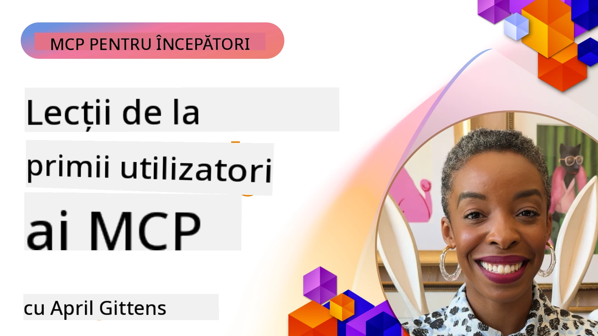

# 🌟 Lecții de la Primii Utilizatori

[](https://youtu.be/jds7dSmNptE)

_(Faceți clic pe imaginea de mai sus pentru a viziona videoclipul acestei lecții)_

## 🎯 Ce Acoperă Acest Modul

Acest modul explorează modul în care organizațiile și dezvoltatorii reali folosesc Protocolul Contextului Modelului (MCP) pentru a rezolva provocări reale și a stimula inovația. Prin studii de caz detaliate, proiecte practice și exemple aplicate, veți descoperi cum MCP permite integrarea AI securizată și scalabilă care conectează modele lingvistice, instrumente și date enterprise.

### 📚 Vezi MCP în Acțiune

Doriți să vedeți aceste principii aplicate în instrumente gata pentru producție? Consultați [**10 servere Microsoft MCP care transformă productivitatea dezvoltatorilor**](microsoft-mcp-servers.md), care prezintă servere MCP reale Microsoft pe care le puteți folosi astăzi.

## Prezentare generală

Această lecție explorează cum primii utilizatori au folosit Protocolul Contextului Modelului (MCP) pentru a rezolva provocări din lumea reală și a stimula inovația în diverse industrii. Prin studii de caz detaliate și proiecte practice, veți vedea cum MCP permite o integrare AI standardizată, securizată și scalabilă — conectând modele lingvistice mari, instrumente și date enterprise într-un cadru unificat. Veți dobândi experiență practică în proiectarea și construirea de soluții bazate pe MCP, veți învăța din modele de implementare dovedite și veți descoperi cele mai bune practici pentru implementarea MCP în medii de producție. Lecția evidențiază, de asemenea, tendințe emergente, direcții viitoare și resurse open-source pentru a vă menține în fruntea tehnologiei MCP și a ecosistemului său în evoluție.

## Obiective de Învățare

- Analizați implementări MCP din lumea reală în diverse industrii
- Proiectați și construiți aplicații complete bazate pe MCP
- Explorați tendințe emergente și direcții viitoare în tehnologia MCP
- Aplicați cele mai bune practici în scenarii reale de dezvoltare

## Implementări MCP din lumea reală

### Studiu de Caz 1: Automatizarea Asistenței Clienților Enterprise

O corporație multinațională a implementat o soluție bazată pe MCP pentru a standardiza interacțiunile AI în sistemele lor de asistență pentru clienți. Acest lucru le-a permis să:

- Creeze o interfață unificată pentru mai mulți furnizori LLM
- Mențină o gestionare consecventă a prompturilor între departamente
- Implementeze controale robuste de securitate și conformitate
- Schimbe ușor între diferite modele AI în funcție de nevoi specifice

**Implementare Tehnică:**

```python
# Implementare server MCP Python pentru suport clienți
import logging
import asyncio
from modelcontextprotocol import create_server, ServerConfig
from modelcontextprotocol.server import MCPServer
from modelcontextprotocol.transports import create_http_transport
from modelcontextprotocol.resources import ResourceDefinition
from modelcontextprotocol.prompts import PromptDefinition
from modelcontextprotocol.tool import ToolDefinition

# Configurează jurnalizarea
logging.basicConfig(level=logging.INFO)

async def main():
    # Creează configurația serverului
    config = ServerConfig(
        name="Enterprise Customer Support Server",
        version="1.0.0",
        description="MCP server for handling customer support inquiries"
    )
    
    # Inițializează serverul MCP
    server = create_server(config)
    
    # Înregistrează resursele bazei de cunoștințe
    server.resources.register(
        ResourceDefinition(
            name="customer_kb",
            description="Customer knowledge base documentation"
        ),
        lambda params: get_customer_documentation(params)
    )
    
    # Înregistrează șabloanele prompturilor
    server.prompts.register(
        PromptDefinition(
            name="support_template",
            description="Templates for customer support responses"
        ),
        lambda params: get_support_templates(params)
    )
    
    # Înregistrează uneltele de suport
    server.tools.register(
        ToolDefinition(
            name="ticketing",
            description="Create and update support tickets"
        ),
        handle_ticketing_operations
    )
    
    # Pornește serverul cu transport HTTP
    transport = create_http_transport(port=8080)
    await server.run(transport)

if __name__ == "__main__":
    asyncio.run(main())
```

**Rezultate:** Reducere de 30% a costurilor modelelor, îmbunătățire de 45% a coerenței răspunsurilor și o conformitate sporită în operațiunile globale.

### Studiu de Caz 2: Asistent Diagnostic Medical

Un furnizor de servicii medicale a dezvoltat o infrastructură MCP pentru a integra mai multe modele AI medicale specializate, asigurând în același timp protecția datelor sensibile ale pacienților:

- Comutare fluentă între modele medicale generaliste și specializate
- Controale stricte de confidențialitate și trasee de audit
- Integrare cu sistemele existente de Evidență Electronică a Sănătății (EHR)
- Inginerie consistentă a prompturilor pentru terminologia medicală

**Implementare Tehnică:**

```csharp
// C# MCP host application implementation in healthcare application
using Microsoft.Extensions.DependencyInjection;
using ModelContextProtocol.SDK.Client;
using ModelContextProtocol.SDK.Security;
using ModelContextProtocol.SDK.Resources;

public class DiagnosticAssistant
{
    private readonly MCPHostClient _mcpClient;
    private readonly PatientContext _patientContext;
    
    public DiagnosticAssistant(PatientContext patientContext)
    {
        _patientContext = patientContext;
        
        // Configure MCP client with healthcare-specific settings
        var clientOptions = new ClientOptions
        {
            Name = "Healthcare Diagnostic Assistant",
            Version = "1.0.0",
            Security = new SecurityOptions
            {
                Encryption = EncryptionLevel.Medical,
                AuditEnabled = true
            }
        };
        
        _mcpClient = new MCPHostClientBuilder()
            .WithOptions(clientOptions)
            .WithTransport(new HttpTransport("https://healthcare-mcp.example.org"))
            .WithAuthentication(new HIPAACompliantAuthProvider())
            .Build();
    }
    
    public async Task<DiagnosticSuggestion> GetDiagnosticAssistance(
        string symptoms, string patientHistory)
    {
        // Create request with appropriate resources and tool access
        var resourceRequest = new ResourceRequest
        {
            Name = "patient_records",
            Parameters = new Dictionary<string, object>
            {
                ["patientId"] = _patientContext.PatientId,
                ["requestingProvider"] = _patientContext.ProviderId
            }
        };
        
        // Request diagnostic assistance using appropriate prompt
        var response = await _mcpClient.SendPromptRequestAsync(
            promptName: "diagnostic_assistance",
            parameters: new Dictionary<string, object>
            {
                ["symptoms"] = symptoms,
                patientHistory = patientHistory,
                relevantGuidelines = _patientContext.GetRelevantGuidelines()
            });
            
        return DiagnosticSuggestion.FromMCPResponse(response);
    }
}
```

**Rezultate:** Sugestii diagnostice îmbunătățite pentru medici, menținând conformitatea completă cu HIPAA și reducând semnificativ comutarea contextelor între sisteme.

### Studiu de Caz 3: Analiză de Risc în Serviciile Financiare

O instituție financiară a implementat MCP pentru a standardiza procesele de analiză a riscului în diverse departamente:

- A creat o interfață unificată pentru modelele de risc de credit, detectare a fraudelor și risc de investiții
- A implementat controale stricte de acces și versionarea modelelor
- A asigurat auditabilitatea tuturor recomandărilor AI
- A menținut formatul consecvent al datelor în sisteme diverse

**Implementare Tehnică:**

```java
// Server Java MCP pentru evaluarea riscului financiar
import org.mcp.server.*;
import org.mcp.security.*;

public class FinancialRiskMCPServer {
    public static void main(String[] args) {
        // Creează un server MCP cu funcționalități de conformitate financiară
        MCPServer server = new MCPServerBuilder()
            .withModelProviders(
                new ModelProvider("risk-assessment-primary", new AzureOpenAIProvider()),
                new ModelProvider("risk-assessment-audit", new LocalLlamaProvider())
            )
            .withPromptTemplateDirectory("./compliance/templates")
            .withAccessControls(new SOCCompliantAccessControl())
            .withDataEncryption(EncryptionStandard.FINANCIAL_GRADE)
            .withVersionControl(true)
            .withAuditLogging(new DatabaseAuditLogger())
            .build();
            
        server.addRequestValidator(new FinancialDataValidator());
        server.addResponseFilter(new PII_RedactionFilter());
        
        server.start(9000);
        
        System.out.println("Financial Risk MCP Server running on port 9000");
    }
}
```

**Rezultate:** Conformitate sporită cu reglementările, cicluri de implementare a modelelor cu 40% mai rapide și o consistență mai bună a evaluării riscurilor între departamente.

### Studiu de Caz 4: Serverul MCP Microsoft Playwright pentru Automatizarea Browserului

Microsoft a dezvoltat [serverul MCP Playwright](https://github.com/microsoft/playwright-mcp) pentru a permite automatizarea browserelor în mod securizat și standardizat prin Protocolul Contextului Modelului. Acest server gata pentru producție permite agenților AI și LLM-urilor să interacționeze cu browsere web într-un mod controlat, auditat și extensibil — facilitând cazuri de utilizare precum testarea web automatizată, extragerea datelor și fluxurile de lucru end-to-end.

> **🎯 Unealtă Gata pentru Producție**
> 
> Acest studiu de caz prezintă un server MCP real pe care îl puteți folosi astăzi! Aflați mai multe despre Serverul MCP Playwright și alte 9 servere Microsoft MCP gata pentru producție în ghidul nostru [**Microsoft MCP Servers Guide**](microsoft-mcp-servers.md#8--playwright-mcp-server).

**Caracteristici Cheie:**
- Expune capabilități de automatizare a browserului (navigare, completare formulare, captură de ecran, etc.) ca unelte MCP
- Implementează controale stricte de acces și sandboxing pentru prevenirea acțiunilor neautorizate
- Furnizează jurnale detaliate de audit pentru toate interacțiunile cu browserul
- Suportă integrarea cu Azure OpenAI și alți furnizori LLM pentru automatizare condusă de agenți
- Alimentează agentul de codare GitHub Copilot cu capacități de navigare web

**Implementare Tehnică:**

```typescript
// TypeScript: Înregistrarea instrumentelor de automatizare a browserului Playwright într-un server MCP
import { createServer, ToolDefinition } from 'modelcontextprotocol';
import { launch } from 'playwright';

const server = createServer({
  name: 'Playwright MCP Server',
  version: '1.0.0',
  description: 'MCP server for browser automation using Playwright'
});

// Înregistrează un instrument pentru navigarea către un URL și capturarea unei capturi de ecran
server.tools.register(
  new ToolDefinition({
    name: 'navigate_and_screenshot',
    description: 'Navigate to a URL and capture a screenshot',
    parameters: {
      url: { type: 'string', description: 'The URL to visit' }
    }
  }),
  async ({ url }) => {
    const browser = await launch();
    const page = await browser.newPage();
    await page.goto(url);
    const screenshot = await page.screenshot();
    await browser.close();
    return { screenshot };
  }
);

// Pornește serverul MCP
server.listen(8080);
```

**Rezultate:**

- A permis automatizarea programatică securizată a browserului pentru agenți AI și LLM-uri
- A redus efortul de testare manuală și a îmbunătățit acoperirea testelor pentru aplicațiile web
- A oferit un cadru reutilizabil și extensibil pentru integrarea uneltelor bazate pe browser în medii enterprise
- Alimentează capabilitățile de navigare web ale GitHub Copilot

**Referințe:**

- [Repositorio GitHub Playwright MCP Server](https://github.com/microsoft/playwright-mcp)
- [Soluții Microsoft AI și Automatizare](https://azure.microsoft.com/en-us/products/ai-services/)

### Studiu de Caz 5: Azure MCP – Protocol Context Model Enterprise ca Serviciu

Azure MCP Server ([https://aka.ms/azmcp](https://aka.ms/azmcp)) este implementarea gestionată de Microsoft, de nivel enterprise, a Protocolului Contextului Modelului, proiectată pentru a oferi capabilități scalabile, securizate și conforme ale serverului MCP ca serviciu cloud. Azure MCP permite organizațiilor să implementeze rapid, să gestioneze și să integreze servere MCP cu serviciile Azure AI, date și securitate, reducând costurile operaționale și accelerând adoptarea AI.

> **🎯 Unealtă Gata pentru Producție**
> 
> Acesta este un server MCP real pe care îl puteți folosi astăzi! Aflați mai multe despre Serverul Microsoft Foundry MCP în ghidul nostru [**Microsoft MCP Servers Guide**](microsoft-mcp-servers.md).


- Găzduire complet gestionată a serverului MCP cu scalare, monitorizare și securitate integrate
- Integrare nativă cu Azure OpenAI, Azure AI Search și alte servicii Azure
- Autentificare și autorizare enterprise prin Microsoft Entra ID
- Suport pentru unelte personalizate, șabloane de prompturi și conectori de resurse
- Conformitate cu cerințele de securitate și reglementare enterprise

**Implementare Tehnică:**

```yaml
# Example: Azure MCP server deployment configuration (YAML)
apiVersion: mcp.microsoft.com/v1
kind: McpServer
metadata:
  name: enterprise-mcp-server
spec:
  modelProviders:
    - name: azure-openai
      type: AzureOpenAI
      endpoint: https://<your-openai-resource>.openai.azure.com/
      apiKeySecret: <your-azure-keyvault-secret>
  tools:
    - name: document_search
      type: AzureAISearch
      endpoint: https://<your-search-resource>.search.windows.net/
      apiKeySecret: <your-azure-keyvault-secret>
  authentication:
    type: EntraID
    tenantId: <your-tenant-id>
  monitoring:
    enabled: true
    logAnalyticsWorkspace: <your-log-analytics-id>
```

**Rezultate:**  
- Reducerea timpului până la valoare pentru proiectele AI enterprise oferind o platformă MCP gata de utilizat și conformă
- Integrare simplificată a LLM-urilor, uneltelor și surselor de date enterprise
- Securitate sporită, observabilitate și eficiență operațională pentru sarcinile MCP
- Calitate îmbunătățită a codului cu bune practici SDK Azure și modele actuale de autentificare

**Referințe:**  
- [Documentația Azure MCP](https://aka.ms/azmcp)
- [Repositorio GitHub Azure MCP Server](https://github.com/Azure/azure-mcp)
- [Servicii Azure AI](https://azure.microsoft.com/en-us/products/ai-services/)
- [Centrul Microsoft MCP](https://mcp.azure.com)

## Studiu de Caz 6: NLWeb 
MCP (Protocolul Contextului Modelului) este un protocol emergent pentru Chatbots și asistenți AI de a interacționa cu instrumente. Fiecare instanță NLWeb este de asemenea un server MCP, care suportă o metodă principală, ask, folosită pentru a pune întrebări unui site web în limbaj natural. Răspunsul primit folosește schema.org, un vocabular larg utilizat pentru descrierea datelor web. Pe scurt, MCP este pentru NLWeb ceea ce este Http pentru HTML. NLWeb combină protocoale, formate Schema.org și cod exemplu pentru a ajuta site-urile să creeze rapid aceste endpoint-uri, beneficiind atât oamenii prin interfețe conversaționale, cât și mașinile prin interacțiune naturală între agenți.

Există două componente distincte ale NLWeb.
- Un protocol, foarte simplu la început, pentru a interfața cu un site în limbaj natural și un format, folosind json și schema.org pentru răspunsul primit. Consultați documentația API-ului REST pentru mai multe detalii.
- O implementare directă a (1) care folosește marcaj existent, pentru site-uri care pot fi abstractizate ca liste de elemente (produse, rețete, atracții, recenzii, etc.). Împreună cu un set de widget-uri de interfață, site-urile pot furniza ușor interfețe conversaționale pentru conținutul lor. Consultați documentația Life of a chat query pentru mai multe detalii despre cum funcționează acest lucru.
 
**Referințe:**  
- [Documentația Azure MCP](https://aka.ms/azmcp)
- [NLWeb](https://github.com/microsoft/NlWeb)

### Studiu de Caz 7: Server Microsoft Foundry MCP – Integrarea Agenților AI Enterprise

Serverele Microsoft Foundry MCP demonstrează modul în care MCP poate fi folosit pentru a orchestra și gestiona agenți AI și fluxuri de lucru în medii enterprise. Prin integrarea MCP cu Microsoft Foundry, organizațiile pot standardiza interacțiunile agenților, pot valorifica gestionarea fluxurilor de lucru din Foundry și pot asigura implementări securizate și scalabile.

> **🎯 Unealtă Gata pentru Producție**
> 
> Acesta este un server MCP real pe care îl puteți folosi astăzi! Aflați mai multe despre Serverul Microsoft Foundry MCP în ghidul nostru [**Microsoft MCP Servers Guide**](microsoft-mcp-servers.md#9--microsoft-foundry-mcp-server).

**Caracteristici Cheie:**
- Acces cuprinzător la ecosistemul AI Azure, inclusiv cataloage de modele și gestionarea implementărilor
- Indexare de cunoștințe cu Azure AI Search pentru aplicații RAG
- Unelte de evaluare a performanței modelelor AI și asigurarea calității
- Integrare cu Microsoft Foundry Catalog și Labs pentru modele de cercetare de ultimă oră
- Capacități de management și evaluare a agenților pentru scenarii de producție

**Rezultate:**
- Prototipare rapidă și monitorizare robustă a fluxurilor de lucru ale agenților AI
- Integrare fluidă cu serviciile Azure AI pentru scenarii avansate
- Interfață unificată pentru construire, implementare și monitorizare a canalelor agenților
- Securitate îmbunătățită, conformitate și eficiență operațională pentru enterprise
- Accelerarea adoptării AI menținând controlul asupra proceselor complexe conduse de agenți

**Referințe:**
- [Repositorio GitHub Server Microsoft Foundry MCP](https://github.com/azure-ai-foundry/mcp-foundry)
- [Integrarea Agenților Azure AI cu MCP (Blog Microsoft Foundry)](https://devblogs.microsoft.com/foundry/integrating-azure-ai-agents-mcp/)

### Studiu de Caz 8: Terenul de Joacă Foundry MCP – Experimentare și Prototipare

Terenul de joacă Foundry MCP oferă un mediu gata de utilizat pentru experimentarea cu servere MCP și integrarea Microsoft Foundry. Dezvoltatorii pot prototipa rapid, testa și evalua modele AI și fluxuri de lucru ale agenților folosind resurse din catalogul și laboratoarele Microsoft Foundry. Terenul de joacă simplifică configurarea, oferă proiecte exemplu și susține dezvoltarea colaborativă, facilitând explorarea celor mai bune practici și noi scenarii cu un cost redus. Este util mai ales pentru echipele care doresc să valideze idei, să partajeze experimente și să accelereze învățarea fără infrastructură complexă. Prin reducerea barierei la intrare, terenul de joacă încurajează inovația și contribuțiile comunității în ecosistemul MCP și Microsoft Foundry.

**Referințe:**

- [Repositorio GitHub Foundry MCP Playground](https://github.com/azure-ai-foundry/foundry-mcp-playground)

### Studiu de Caz 9: Server Microsoft Learn Docs MCP – Acces Documentație AI

Serverul Microsoft Learn Docs MCP este un serviciu găzduit în cloud care oferă asistenților AI acces în timp real la documentația oficială Microsoft prin Protocolul Contextului Modelului. Acest server gata de producție se conectează la ecosistemul complet Microsoft Learn și permite căutarea semantică în toate sursele oficiale Microsoft.

> **🎯 Unealtă Gata pentru Producție**
> 
> Acesta este un server MCP real pe care îl puteți folosi astăzi! Aflați mai multe despre Serverul Microsoft Learn Docs MCP în ghidul nostru [**Microsoft MCP Servers Guide**](microsoft-mcp-servers.md#1--microsoft-learn-docs-mcp-server).

**Caracteristici Cheie:**
- Acces în timp real la documentația oficială Microsoft, documentația Azure și cea Microsoft 365
- Capacități avansate de căutare semantică care înțeleg contextul și intenția
- Informații mereu actualizate pe măsură ce conținutul Microsoft Learn este publicat
- Acoperire cuprinzătoare a Microsoft Learn, documentației Azure și surselor Microsoft 365
- Returnează până la 10 bucăți de conținut de înaltă calitate cu titluri de articole și URL-uri

**De ce este critic:**
- Rezolvă problema „cunoștințelor AI învechite” pentru tehnologiile Microsoft
- Asigură accesul asistenților AI la cele mai recente funcții .NET, C#, Azure și Microsoft 365
- Oferă informații autoritare, de primă parte, pentru generarea de cod precisă
- Esențial pentru dezvoltatorii care lucrează cu tehnologii Microsoft în rapida evoluție

**Rezultate:**
- Precizie mult îmbunătățită a codului generat AI pentru tehnologiile Microsoft
- Timp redus petrecut în căutarea documentației curente și a celor mai bune practici
- Productivitate sporită a dezvoltatorilor prin recuperarea de documentație conștientă de context
- Integrare lină cu fluxurile de lucru de dezvoltare fără a părăsi IDE-ul

**Referințe:**
- [Repositorio GitHub Server Microsoft Learn Docs MCP](https://github.com/MicrosoftDocs/mcp)
- [Documentația Microsoft Learn](https://learn.microsoft.com/)

## Proiecte Practice

### Proiect 1: Construiește un Server MCP Multi-Furnizor

**Obiectiv:** Creează un server MCP care poate direcționa cereri către mai mulți furnizori de modele AI pe baza unor criterii specifice.

**Cerințe:**

- Suport pentru cel puțin trei furnizori diferiți de modele (ex: OpenAI, Anthropic, modele locale)
- Implementarea unui mecanism de rutare bazat pe metadatele cererilor
- Crearea unui sistem de configurare pentru gestionarea acreditărilor furnizorilor
- Adăugarea de caching pentru optimizarea performanței și a costurilor
- Construirea unui dashboard simplu pentru monitorizarea utilizării

**Pași de Implementare:**

1. Configurează infrastructura de bază a serverului MCP
2. Implementează adaptoare pentru fiecare serviciu AI model
3. Creează logica de rutare bazată pe atributele cererii
4. Adaugă mecanisme de caching pentru cererile frecvente
5. Dezvoltă dashboard-ul de monitorizare
6. Testează folosind diverse tipare de cereri

**Tehnologii:** Alege din Python (.NET/Java/Python în funcție de preferințe), Redis pentru caching și un framework web simplu pentru dashboard.

### Proiect 2: Sistem Enterprise de Management al Prompturilor

**Obiectiv:** Dezvoltă un sistem bazat pe MCP pentru gestionarea, versionarea și implementarea șabloanelor de prompturi în cadrul unei organizații.

**Cerințe:**


- Creați un depozit centralizat pentru șabloane de prompturi
- Implementați versionarea și fluxurile de aprobare
- Construiți capacități de testare a șabloanelor cu intrări de probă
- Dezvoltați controale de acces bazate pe roluri
- Creați o API pentru recuperarea și implementarea șabloanelor

**Pași de implementare:**

1. Proiectați schema bazei de date pentru stocarea șabloanelor
2. Creați API-ul principal pentru operațiuni CRUD ale șabloanelor
3. Implementați sistemul de versionare
4. Construiți fluxul de aprobare
5. Dezvoltați cadrul de testare
6. Creați o interfață web simplă pentru gestionare
7. Integrați cu un server MCP

**Tehnologii:** Alegerea dvs. de framework backend, bază de date SQL sau NoSQL și un framework frontend pentru interfața de gestionare.

### Proiectul 3: Platformă de Generare Conținut bazată pe MCP

**Obiectiv:** Dezvoltați o platformă de generare de conținut care folosește MCP pentru a oferi rezultate consistente în diferite tipuri de conținut.

**Cerințe:**

- Suport pentru formate multiple de conținut (articole de blog, social media, copywriting pentru marketing)
- Implementați generarea bazată pe șabloane cu opțiuni de personalizare
- Creați un sistem de revizuire și feedback pentru conținut
- Monitorizați metrici de performanță ale conținutului
- Suport pentru versionarea și iterarea conținutului

**Pași de implementare:**

1. Configurați infrastructura client MCP
2. Creați șabloane pentru diferite tipuri de conținut
3. Construiți fluxul de generare a conținutului
4. Implementați sistemul de revizuire
5. Dezvoltați sistemul de monitorizare a metricilor
6. Creați o interfață utilizator pentru gestionarea șabloanelor și generarea conținutului

**Tehnologii:** Limbajul de programare preferat, framework web și sistemul de baze de date.

## Direcții viitoare pentru tehnologia MCP

### Tendințe emergente

1. **MCP Multi-Modal**
   - Extinderea MCP pentru a standardiza interacțiunile cu modele de imagine, audio și video
   - Dezvoltarea capacităților de raționament cross-modal
   - Formate standardizate de prompturi pentru diferite modalități

2. **Infrastructură MCP Federată**
   - Rețele MCP distribuite care pot partaja resurse între organizații
   - Protocoale standardizate pentru partajare securizată a modelelor
   - Tehnici de calcul care protejează confidențialitatea

3. **Piețe MCP**
   - Ecosisteme pentru partajarea și monetizarea șabloanelor MCP și pluginurilor
   - Procese de asigurare a calității și certificare
   - Integrare cu piețe de modele

4. **MCP pentru Edge Computing**
   - Adaptarea standardelor MCP pentru dispozitive edge cu resurse limitate
   - Protocoale optimizate pentru medii cu bandă redusă
   - Implementări specializate MCP pentru ecosisteme IoT

5. **Cadruri de reglementare**
   - Dezvoltarea extensiilor MCP pentru conformitate reglementară
   - Trasee de audit standardizate și interfețe pentru explicabilitate
   - Integrare cu cadre emergente de guvernanță AI

### Soluții MCP de la Microsoft

Microsoft și Azure au dezvoltat mai multe depozite open-source pentru a ajuta dezvoltatorii să implementeze MCP în diverse scenarii:

#### Organizația Microsoft

1. [playwright-mcp](https://github.com/microsoft/playwright-mcp) - Un server Playwright MCP pentru automatizarea browser-ului și testare
2. [files-mcp-server](https://github.com/microsoft/files-mcp-server) - O implementare a serverului MCP pentru OneDrive pentru testare locală și contribuții comunitare
3. [NLWeb](https://github.com/microsoft/NlWeb) - NLWeb este o colecție de protocoale deschise și unelte open source asociate. Se concentrează pe stabilirea unui strat fundamental pentru AI Web

#### Organizația Azure-Samples

1. [mcp](https://github.com/Azure-Samples/mcp) - Legături către exemple, unelte și resurse pentru construirea și integrarea serverelor MCP pe Azure folosind mai multe limbaje
2. [mcp-auth-servers](https://github.com/Azure-Samples/mcp-auth-servers) - Servere MCP de referință care demonstrează autentificarea conform specificației actuale Model Context Protocol
3. [remote-mcp-functions](https://github.com/Azure-Samples/remote-mcp-functions) - Pagina de deschidere pentru implementări Remote MCP Server în Azure Functions cu legături către depozite specifice limbajelor
4. [remote-mcp-functions-python](https://github.com/Azure-Samples/remote-mcp-functions-python) - Șablon quickstart pentru construirea și implementarea serverelor MCP remote personalizate folosind Azure Functions cu Python
5. [remote-mcp-functions-dotnet](https://github.com/Azure-Samples/remote-mcp-functions-dotnet) - Șablon quickstart pentru construirea și implementarea serverelor MCP remote personalizate folosind Azure Functions cu .NET/C#
6. [remote-mcp-functions-typescript](https://github.com/Azure-Samples/remote-mcp-functions-typescript) - Șablon quickstart pentru construirea și implementarea serverelor MCP remote personalizate folosind Azure Functions cu TypeScript
7. [remote-mcp-apim-functions-python](https://github.com/Azure-Samples/remote-mcp-apim-functions-python) - Azure API Management ca Poartă AI către servere MCP remote folosind Python
8. [AI-Gateway](https://github.com/Azure-Samples/AI-Gateway) - Experimente APIM ❤️ AI incluzând capabilități MCP, integrând Azure OpenAI și AI Foundry

Aceste depozite oferă diverse implementări, șabloane și resurse pentru lucrul cu Model Context Protocol în diferite limbaje de programare și servicii Azure. Acoperă o gamă de utilizări de la implementări simple de servere la autentificare, implementare în cloud și scenarii de integrare enterprise.

#### Director de Resurse MCP

Directorul [MCP Resources](https://github.com/microsoft/mcp/tree/main/Resources) din depozitul oficial Microsoft MCP oferă o colecție curată de resurse exemplu, șabloane de prompturi și definiții de unelte pentru a fi utilizate cu serverele Model Context Protocol. Acest director este conceput pentru a ajuta dezvoltatorii să înceapă rapid cu MCP oferind blocuri reutilizabile și exemple de bune practici pentru:

- **Șabloane de prompturi:** Șabloane gata de utilizare pentru sarcini și scenarii comune AI, care pot fi adaptate pentru propriile implementări MCP.
- **Definiții de unelte:** Scheme exemplu de unelte și metadate pentru a standardiza integrarea și invocarea uneltelor între diferite servere MCP.
- **Resurse exemplu:** Definiții exemplu pentru conectarea la surse de date, API-uri și servicii externe în cadrul MCP.
- **Implementări de referință:** Exemple practice care demonstrează cum să structurați și să organizați resurse, prompturi și unelte în proiecte MCP reale.

Aceste resurse accelerează dezvoltarea, promovează standardizarea și ajută la asigurarea celor mai bune practici în construirea și implementarea soluțiilor bazate pe MCP.

#### Director de Resurse MCP

- [Resurse MCP (Șabloane de prompturi, unelte și definiții de resurse)](https://github.com/microsoft/mcp/tree/main/Resources)

### Oportunități de Cercetare

- Tehnici eficiente de optimizare a prompturilor în cadrul MCP
- Modele de securitate pentru implementări MCP multi-chiriaș
- Benchmarking de performanță pentru diferite implementări MCP
- Metode de verificare formală pentru serverele MCP

## Concluzie

Protocolul Model Context (MCP) modelează rapid viitorul integrării AI standardizate, securizate și interoperabile în industrii. Prin studiile de caz și proiectele practice din această lecție, ați văzut cum adoptatorii timpurii—incluzând Microsoft și Azure—valorifică MCP pentru a rezolva provocări reale, a accelera adoptarea AI și a asigura conformitatea, securitatea și scalabilitatea. Abordarea modulară MCP permite organizațiilor să conecteze modele mari de limbaj, unelte și date enterprise într-un cadru unificat, auditat. Pe măsură ce MCP continuă să evolueze, implicarea în comunitate, explorarea resurselor open-source și aplicarea celor mai bune practici vor fi esențiale pentru construirea de soluții AI robuste, pregătite pentru viitor.

## Resurse suplimentare

- [Depozitul GitHub MCP Foundry](https://github.com/azure-ai-foundry/mcp-foundry)
- [Foundry MCP Playground](https://github.com/azure-ai-foundry/foundry-mcp-playground)
- [Integrarea Agenților Azure AI cu MCP (Blog Microsoft Foundry)](https://devblogs.microsoft.com/foundry/integrating-azure-ai-agents-mcp/)
- [Depozitul GitHub MCP (Microsoft)](https://github.com/microsoft/mcp)
- [Directorul Resurselor MCP (Șabloane de prompturi, unelte și definiții de resurse)](https://github.com/microsoft/mcp/tree/main/Resources)
- [Comunitatea MCP & Documentație](https://modelcontextprotocol.io/introduction)
- [Specificația MCP (2026-07-28)](https://modelcontextprotocol.io/specification/2026-07-28/)
- [Documentația Azure MCP](https://aka.ms/azmcp)
- [Top 10 OWASP MCP](https://microsoft.github.io/mcp-azure-security-guide/mcp/) - Cele mai bune practici de securitate
- [Depozitul GitHub Playwright MCP Server](https://github.com/microsoft/playwright-mcp)
- [Files MCP Server (OneDrive)](https://github.com/microsoft/files-mcp-server)
- [Azure-Samples MCP](https://github.com/Azure-Samples/mcp)
- [Servere MCP Auth (Azure-Samples)](https://github.com/Azure-Samples/mcp-auth-servers)
- [Funcții MCP Remote (Azure-Samples)](https://github.com/Azure-Samples/remote-mcp-functions)
- [Funcții MCP Remote Python (Azure-Samples)](https://github.com/Azure-Samples/remote-mcp-functions-python)
- [Funcții MCP Remote .NET (Azure-Samples)](https://github.com/Azure-Samples/remote-mcp-functions-dotnet)
- [Funcții MCP Remote TypeScript (Azure-Samples)](https://github.com/Azure-Samples/remote-mcp-functions-typescript)
- [Funcții MCP APIM Python (Azure-Samples)](https://github.com/Azure-Samples/remote-mcp-apim-functions-python)
- [AI-Gateway (Azure-Samples)](https://github.com/Azure-Samples/AI-Gateway)
- [Soluții AI și de Automatizare Microsoft](https://azure.microsoft.com/en-us/products/ai-services/)

## Exerciții

1. Analizați unul dintre studiile de caz și propuneți o abordare alternativă de implementare.
2. Alegeți una dintre ideile de proiect și creați o specificație tehnică detaliată.
3. Cercetați o industrie neacoperită în studiile de caz și schițați modul în care MCP ar putea aborda provocările specifice.
4. Explorați una dintre direcțiile viitoare și creați un concept pentru o nouă extensie MCP care să o susțină.

## Ce urmează

Explorați mai mult: [Microsoft MCP Servers](./microsoft-mcp-servers.md)

Continuați la: [Modulul 8: Cele mai bune practici](../08-BestPractices/README.md)

---

<!-- CO-OP TRANSLATOR DISCLAIMER START -->
**Declinare a responsabilității**:
Acest document a fost tradus folosind serviciul de traducere AI [Co-op Translator](https://github.com/Azure/co-op-translator). În timp ce ne străduim pentru acuratețe, vă rugăm să rețineți că traducerile automate pot conține erori sau inexactități. Documentul original în limba sa nativă trebuie considerat sursa autorizată. Pentru informații critice, se recomandă traducerea profesională realizată de un om. Nu ne asumăm responsabilitatea pentru eventualele neînțelegeri sau interpretări greșite care decurg din utilizarea acestei traduceri.
<!-- CO-OP TRANSLATOR DISCLAIMER END -->