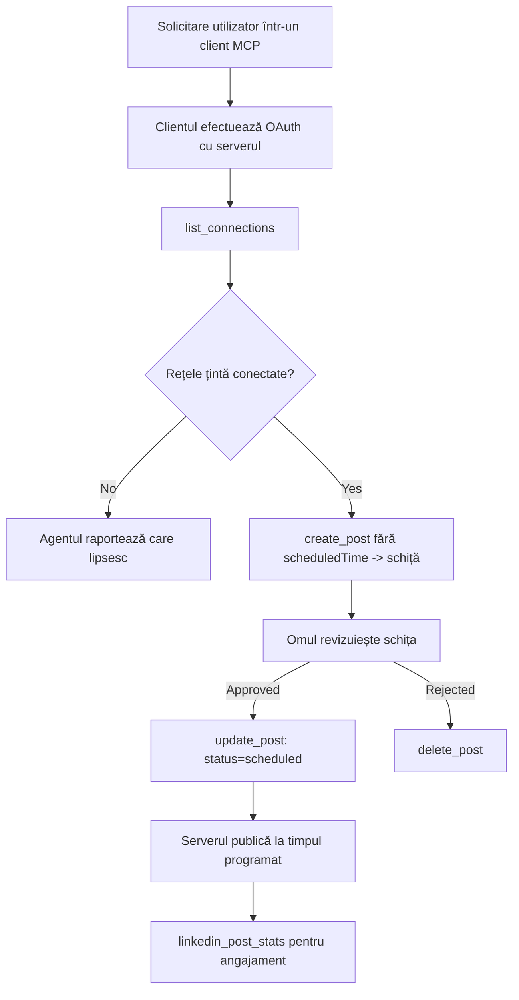

# Studiu de Caz: Publicarea pe Rețelele Sociale de la un Agent cu un Server MCP Remote

> **Declinare de responsabilitate:** Mai multe servicii și proiecte open-source pot publica pe rețele sociale, iar o echipă ar putea integra și API-ul fiecărei rețele direct. Scenariul de mai jos este oferit ca un exemplu funcțional despre cum poate fi proiectat și consumat un **server MCP remote capabil să scrie**. Publora este un serviciu comercial cu un nivel gratuit; modelele descrise aici se aplică oricărui server MCP care efectuează acțiuni ireversibile în numele unui utilizator.

## Prezentare generală

Agenții sunt buni la redactarea conținutului și slabi la livrarea acestuia. Un model poate scrie un anunț de lansare în câteva secunde, apoi munca se oprește: publicarea înseamnă un API per rețea, o aplicație OAuth per rețea și un set diferit de reguli media pentru fiecare. Majoritatea echipelor rezolvă asta copind textul manual într-un browser.

Acest studiu de caz analizează cum ultimul pas este închis cu un singur server MCP remote și — mai util pentru oricine construiește unul — deciziile de proiectare pe care un server **capabil să scrie** trebuie să le ia corect. Citirea datelor e permisivă. Publicarea nu: un apel greșit de instrument este vizibil publicului și nu poate fi anulat.

## Scenariu

O echipă mică de relații cu dezvoltatorii redactează postări într-un agent (Claude, VS Code, Cursor — clientul nu contează). Ei doresc ca agentul să:

- vadă care conturi sociale are echipa conectate,
- schițeze o postare și să o păstreze ca schiță pentru aprobarea unui om,
- atașeze o imagine,
- programeze publicarea către mai multe rețele la un timp ales,
- și ulterior să raporteze cum s-a comportat.

Esențial, ei doresc ca agentul să *nu poată* publica accidental în timp ce încă experimentează.

## Unelte Folosite

- [Publora MCP Server](https://github.com/publora/mcp-server) — un server MCP remote (`streamable-http`) care expune unelte pentru publicare, programare, media și analiză LinkedIn. Înregistrat în registrul oficial MCP ca `com.publora/mcp-server`.

## Flux de Lucru Pas cu Pas

1. **Conectează serverul.** Clienții care folosesc OAuth finalizează fluxul de autorizare cu cod și PKCE pe ecranul de autorizare al serverului; clienții care nu folosesc OAuth, cum sunt CLI-urile fără interfață, folosesc o cheie API Publora în antet. Ambele căi sunt suportate; metoda depinde de client, nu de server.
2. **Listează conexiunile.** Agentul apelează `list_connections` și primește conturile conectate cu identificatorii lor.
3. **Redactează.** Agentul apelează `create_post` *fără* un timp programat. Postarea este salvată ca schiță — nimic nu este publicat.
4. **Atașează media.** URL-urile publice de imagini sunt transmise în același apel; serverul le descarcă și validează.
5. **Programează.** După aprobarea umană, `update_post` setează statusul la programat cu un timp în format ISO 8601.
6. **Măsoară.** Pentru LinkedIn, `linkedin_post_stats` returnează implicarea după ce postarea este live.

## Exemplu de Prompt

```text
Which social accounts do I have connected?
Draft a post announcing our new changelog page, attach the screenshot at
https://example.com/changelog.png, and keep it as a draft — do not publish it.
Once I approve, schedule it to LinkedIn and Bluesky for tomorrow at 09:00 UTC.
```

## Diagrama Mermaid



## Implementare Tehnică

Lecțiile de mai jos sunt partea transferabilă a acestui studiu de caz.

### Descoperire deschisă, execuție autentificată

`tools/list` este oferit fără acreditări; fiecare `tools/call` necesită un token
și altfel returnează `401` cu un antet `WWW-Authenticate` care indică
metadata resursei protejate. Endpoint-ul legacy al serverului răspunde și la un `initialize` neautentificat
pentru clienții pe versiuni de protocol înainte de
`2026-07-28`; clienții actuali nu folosesc acel handshake.

Această separare specifică unui server permite registrelor, cataloagelor și clienților să inspecteze
numele uneltelor, schemele și adnotările fără un secret, prevenind execuția anonimă.
Descoperirea deschisă este o alegere de implementare, nu o cerință MCP; o
implementare protejată poate totodată cere autorizare pentru `tools/list`.

### Înregistrare: înregistrare dinamică de client și ce o înlocuiește

Serverul publică `/.well-known/oauth-protected-resource` și `/.well-known/oauth-authorization-server`, și suportă fluxul de autorizare cu cod și PKCE (`S256`), tokenuri de refresh și **înregistrare dinamică de client**.

Înregistrarea dinamică a eliminat pasul manual pentru clienții legacy: fără ea,
fiecare client avea nevoie de un `client_id` emis în prealabil de către vendor.

Tratați aceasta ca un comportament de compatibilitate, nu ca design de copiat. Revizia specificației din `2026-07-28` depreciază înregistrarea dinamică în favoarea Documentelor Metadata pentru Client ID, unde clientul găzduiește un document metadata la un URL HTTPS stabil și acel URL *este* `client_id`-ul. DCR funcționează momentan, dar un server construit astăzi ar trebui să planifice pentru CIMD și să păstreze DCR doar pentru clienții mai vechi.

### Adnotările uneltelor nu sunt o decorare

Fiecare unealtă conține un `title` și sugestiile aplicabile: `readOnlyHint`, `destructiveHint`, `idempotentHint`, `openWorldHint`.

Două motive să investiți în ele. În primul rând, clienții folosesc sugestiile pentru a decide ce să confirme cu utilizatorul — un client poate rula automat un lookup doar pentru citire și opri pentru aprobare înainte de un ștergere. Specificația este explicită că adnotările sunt sugestii neîncrezătoare, nu un mecanism de autorizare: modelează ce oferă clientul a face, nu opresc nimic pe server, iar serverul trebuie să aplice propriile reguli. În al doilea rând, directoarele majore de conectori le *cer* acum pentru revizuire; un server ale cărui unelte nu au titluri și sugestii va fi respins indiferent cât de bine funcționează.

### Faceți identificatorii neinventabili

Identificatorii platformei sunt șiruri opace returnate de `list_connections`, iar descrierea schemei spune explicit că trebuie copiate integral și niciodată ghicite. Serverul respinge orice altceva.

Modelele sunt ghicitori fluente. Orice server capabil să scrie ar trebui să considere că un identificator va fi în cele din urmă halucinat și să facă ca acea cale să eșueze sonor și devreme, în loc să acționeze pe o valoare plauzibilă.

### Eșuați înainte de publicare, cu un mesaj acționabil

Unele rețele refuză postări doar cu text și cer o imagine sau video. Aceasta este validată când postarea este programată, iar eroarea numește platforma și cerința lipsă.

Un agent poate recupera de la "Instagram necesită media — atașați o imagine sau video" fără un nou schimb de mesaje. Nu poate recupera de la un generic `400`.

### Faceți reîncercările sigure

Cele două unelte care creează conținut, `create_post` și `update_post`, acceptă o cheie de idempotenta: reutilizarea ei cu aceeași cerere reproduce răspunsul original în loc să creeze o a doua postare. Runtime-urile agentului reîncearcă la timeout-uri; fără idempotenta, un răspuns lent devine publicare dublă. Celelalte unelte care scriu — ștergeri, pași media, reacții și comentarii LinkedIn — nu o acceptă, deci o reîncercare acolo nu este automat sigură. Este bine să știți care dintre mutațiile proprii sunt protejate și care nu.

### Oferiți o metodă de test care nu publică nimic

Serverul acceptă o destinație rezervată, `publora-playground`, care este validată și recunoscută ca o destinație reală, apoi aruncată — nimic nu ajunge la un cont real. Este descrisă chiar în schema uneltei, pe care orice client o poate citi fără acreditări: câmpul `platforms` din `create_post` o documentează drept "o țintă de test de conexiune care nu cere o conexiune reală — postarea este recunoscută și aruncată, nu se publică nimic". Invocă-o trecând-o ca singura intrare: `platforms: ["publora-playground"]`.

Aceasta s-a dovedit a fi unul dintre cele mai utile detalii de pe întreaga suprafață. Recenzenții directoarelor de conectori, contributorii și CI pot testa întreg fluxul de scriere de la un capăt la altul fără niciun risc pentru o audiență reală. Orice server MCP cu acțiuni ireversibile beneficiază de o țintă documentată no-op.

## Rezultate și Impact

- Pasul de publicare a trecut de la browser la aceeași conversație unde se scrie conținutul, iar un obicei de scriere întâi în schiță menține un om în buclă. Fiți preciși ce înseamnă asta: o schiță e o convenție, nu o limită. Aceeași acreditare poate programa sau publica, deci oricine are nevoie de poarta reală de aprobare trebuie să o aplice în afara interfeței uneltei — acreditări separate sau un strat de politică în fața serverului.
- Diferențele pe rețea — cerințe media, fire de discuție, controale de răspuns — sunt gestionate odată în server, nu în fiecare agent care vorbește cu el.
- Același server susține mai mulți clienți MCP fără acreditări pre-emise.
    Clienții actuali pot folosi Documente Metadata Client ID; DCR rămâne o rezervă
    pentru clienți mai vechi.
- Constrângerile de design de mai sus au fost modelate atât de recenziile directoarelor de conectori, cât și de utilizatori: adnotările, OAuth și o țintă de test sigură au fost cerute de cel puțin unul dintre ei.

## Referințe

- [Publora MCP Server (sursă)](https://github.com/publora/mcp-server)
- [Documentația API și MCP Publora](https://docs.publora.com)
- [Înregistrare MCP: `com.publora/mcp-server`](https://registry.modelcontextprotocol.io/v0/servers?search=com.publora/mcp-server)
- [Specificația MCP — Autorizare](https://modelcontextprotocol.io/specification/2026-07-28/basic/authorization)
- [Specificația MCP — Adnotări unelte](https://modelcontextprotocol.io/docs/concepts/tools)

## Ce Urmează

- Luați un server MCP pe care îl construiți și verificați cele trei câștiguri cele mai ieftine aici: adnotări pe fiecare unealtă, o cheie de idempotenta pe fiecare scriere și o țintă no-op documentată.
- Încercați separarea descoperirii deschise: apelați `tools/list` către un server public remote fără acreditări, apoi apelați o unealtă și inspectați provocarea `401`.
- Luați în considerare ce înseamnă "undo" pentru domeniul vostru. Publicarea are schițe și ștergere; dacă acțiunile voastre nu au echivalent, confirmarea aparține design-ului uneltei, nu promptului.

---

<!-- CO-OP TRANSLATOR DISCLAIMER START -->
**Declinare a responsabilității**:
Acest document a fost tradus folosind serviciul de traducere AI [Co-op Translator](https://github.com/Azure/co-op-translator). În timp ce ne străduim pentru acuratețe, vă rugăm să rețineți că traducerile automate pot conține erori sau inexactități. Documentul original în limba sa nativă trebuie considerat sursa autorizată. Pentru informații critice, se recomandă traducerea profesională realizată de un om. Nu ne asumăm responsabilitatea pentru eventualele neînțelegeri sau interpretări greșite care decurg din utilizarea acestei traduceri.
<!-- CO-OP TRANSLATOR DISCLAIMER END -->