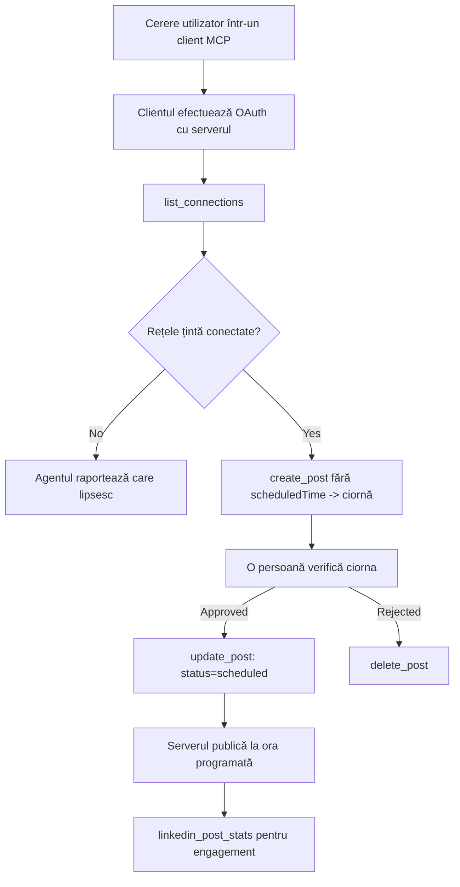

# Studiu de caz: Publicarea pe rețelele sociale de pe un agent cu un server MCP la distanță

> **Declinare:** Mai multe servicii și proiecte open-source pot publica pe rețele sociale, iar o echipă ar putea, de asemenea, să integreze direct API-ul fiecărei rețele. Scenariul de mai jos este oferit ca un exemplu funcțional de cum poate fi proiectat și utilizat un **server MCP la distanță cu capacitate de scriere**. Publora este un serviciu comercial cu un nivel gratuit; modelele descrise aici se aplică oricărui server MCP care efectuează acțiuni ireversibile în numele unui utilizator.

## Prezentare generală

Agenții sunt buni la redactarea conținutului și slabi la livrarea lui. Un model poate scrie un anunț de lansare în câteva secunde, apoi munca se oprește: publicarea implică un API pe rețea, o aplicație OAuth pe rețea și un set diferit de reguli media pentru fiecare. Majoritatea echipelor rezolvă acest lucru copiind textul manual în browser.

Acest studiu de caz analizează cum se închide ultimul pas cu un singur server MCP la distanță și — mai folositor pentru oricine construiește unul — deciziile de proiectare pe care un server **cu capacitate de scriere** trebuie să le ia corect. Citirea datelor este indulgentă. Publicarea nu: o apelare greșită a unei unelte este vizibilă unui public și nu poate fi anulată.

## Scenariu

O echipă mică de relații cu dezvoltatorii redactează postări în interiorul unui agent (Claude, VS Code, Cursor — clientul nu contează). Ei vor ca agentul să:

- vadă ce conturi sociale are echipa conectate,
- redacteze o postare și să o păstreze ca schiță pentru aprobare umană,
- atașeze o imagine,
- programeze postarea către mai multe rețele la o oră aleasă,
- și ulterior să raporteze cum a performat.

Esențial este că vor ca agentul să *nu poată* publica accidental în timp ce încă experimentează.

## Instrumente utilizate

- [Publora MCP Server](https://github.com/publora/mcp-server) — un server MCP la distanță (`streamable-http`) ce oferă instrumente pentru publicare, programare, media și analiză LinkedIn. Înregistrat în registrul oficial MCP ca `com.publora/mcp-server`.

## Flux de lucru pas cu pas

1. **Conectează serverul.** Clienții care folosesc OAuth finalizează fluxul de cod de autorizare cu PKCE prin ecranul de consimțământ al serverului; clienții care nu, cum ar fi CLI-urile headless, folosesc o cheie API Publora într-un header. Ambele căi sunt susținute, iar care se obține depinde de client, nu de server.
2. **Listează conexiunile.** Agentul apelează `list_connections` și primește conturile conectate cu identificatorii lor.
3. **Redactează.** Agentul apelează `create_post` *fără* o oră programată. Postarea este stocată ca schiță — nimic nu este publicat.
4. **Atașează media.** URL-urile publice ale imaginilor sunt trecute în același apel; serverul le descarcă și le validează.
5. **Programează.** După aprobarea umană, `update_post` setează statusul la programat cu un timp conform ISO 8601.
6. **Măsoară.** Pentru LinkedIn, `linkedin_post_stats` returnează implicarea odată ce postarea este live.

## Exemplu de prompt

```text
Which social accounts do I have connected?
Draft a post announcing our new changelog page, attach the screenshot at
https://example.com/changelog.png, and keep it as a draft — do not publish it.
Once I approve, schedule it to LinkedIn and Bluesky for tomorrow at 09:00 UTC.
```

## Diagrama fluxului Mermaid



## Implementare tehnică

Lecțiile de mai jos sunt partea ce poate fi transferată a acestui studiu de caz.

### Descoperire deschisă, execuție autentificată

`tools/list` este livrat fără acreditări; fiecare `tools/call` necesită un token și altfel răspunde cu `401` și un header `WWW-Authenticate` indicând metadatele resursei protejate. (Serverul răspunde de asemenea la un `initialize` neautentificat, care contează doar pentru clienții pe versiuni de protocol anterioare datei `2026-07-28`; acea revizie a eliminat complet handshake-ul.)

Această separare contează în practică. Registri, cataloage și clienți pot examina suprafața uneltelor — nume, scheme, adnotări — fără a ține un secret, în timp ce nimic nu poate fi *executat* anonim. Un server care cere token pentru `initialize` este efectiv invizibil pentru unelte; un server care permite `tools/call` anonim este o responsabilitate.

### Înregistrare: înregistrare dinamică a clientului și ce o înlocuiește

Serverul anunță `/.well-known/oauth-protected-resource` și `/.well-known/oauth-authorization-server`, și suportă fluxul codului de autorizare cu PKCE (`S256`), tokenuri de reîmprospătare și **înregistrare dinamică a clientului**.

Înregistrarea dinamică elimină pasul manual: fără ea, fiecare client are nevoie de un `client_id` emis anterior, ceea ce înseamnă o cerere în afara benzii către furnizor pentru fiecare client nou.

Tratați acest comportament ca fiind de compatibilitate și nu ca model de copiat. Revizia din `2026-07-28` a specificației depreciază înregistrarea dinamică a clientului în favoarea Documentelor de Metadate Client ID, unde clientul găzduiește un document de metadate la un URL HTTPS stabil și acel URL *este* `client_id`. DCR funcționează încă, dar un server construit astăzi ar trebui să planifice pentru CIMD și să păstreze DCR doar pentru clienții mai vechi.

### Adnotările uneltelor nu sunt decorațiuni

Fiecare unealtă poartă un `title` și indicii aplicabile: `readOnlyHint`, `destructiveHint`, `idempotentHint`, `openWorldHint`.

Două motive să investiți în ele. Mai întâi, clienții folosesc indicii pentru a decide ce să confirme cu utilizatorul — un client poate rula automat o interogare doar în citire și se oprește pentru aprobare înainte de ștergere. Specificația este explicită că adnotările sunt indicii neîncrezătoare, nu un mecanism de autorizare: ele modelează ce oferă clientul să facă, nu opresc nimic pe server, iar serverul trebuie să-și aplice propriile reguli. În al doilea rând, principalele directoare de conectori *le solicită* pentru revizuire; un server ale cărui unelte nu au titluri și indicii va fi respins indiferent cât de bine funcționează.

### Faceți identificatorii imposibil de inventat

Identificatorii de platformă sunt șiruri opace returnate de `list_connections`, iar descrierea schemei spune explicit că trebuie copiate literal și niciodată ghicite. Serverul respinge orice altceva.

Modelele sunt ghicitori fluente. Orice server cu capacitate de scriere ar trebui să presupună că un identificator va fi în cele din urmă halucinat și să facă ca acea cale să eșueze răsunător și devreme, în loc să acționeze după o valoare plauzibilă.

### Eșuați înainte de publicare, cu un mesaj acționabil

Unele rețele refuză postările doar text și cer o imagine sau un video. Acest lucru este validat la programare, iar eroarea numește platforma și cerința lipsă.

Un agent poate recupera din "Instagram cere media — atașează o imagine sau un video" fără o nouă călătorie dus-întors. Nu poate recupera dintr-un `400` generic.

### Faceți retry-urile sigure

Cele două unelte care creează conținut, `create_post` și `update_post`, acceptă o cheie de idempotentă: reutilizarea ei cu o cerere identică reia răspunsul original în loc să creeze o a doua postare. Runtime-urile agentului reiau la timeout-uri; fără idempotentă, un răspuns lent devine o publicație duplicat. Celelalte unelte de scriere — ștergeri, pași media, reacții și comentarii LinkedIn — nu iau așa ceva, deci un retry acolo nu este automat sigur. E bine să știți care mutații ale voastre sunt protejate și care nu.

### Oferiți o metodă de test care să nu publice nimic

Serverul acceptă o țintă rezervată, `publora-playground`, care este validată și recunoscută ca o destinație reală și apoi ignorată — nimic nu ajunge la un cont live. Este descris în schema uneltei însăși, pe care orice client o poate citi fără acreditări: câmpul `platforms` din `create_post` o documentează ca "o țintă de testare a conexiunii care nu necesită o conexiune reală — postarea este recunoscută și ignorată, nimic nu este publicat". Se invocă trecând-o ca singură intrare: `platforms: ["publora-playground"]`.

S-a dovedit a fi unul dintre cele mai utile detalii ale întregii suprafețe. Recenzenții directoarelor de conectori, contribuitorii și CI pot folosi întregul flux de scriere de la un capăt la altul fără risc pentru un public real. Orice server MCP cu acțiuni ireversibile profită de o țintă no-op documentată.

## Rezultate și impact

- Pasul de publicare a fost mutat din browser în aceeași conversație unde se scrie conținutul, iar obiceiul de a lucra întâi o schiță menține un om în circuit. Fii precis despre ce înseamnă asta: o schiță este o convenție, nu o limită. Aceeași acreditare poate programa sau publica, deci oricine are nevoie de o poartă reală de aprobare trebuie să o aplice în afara suprafeței uneltei — acreditări separate sau un strat de politici în fața serverului.
- Diferențele pe rețele — cerințe media, înlănțuire fire, controale de răspuns — se gestionează o singură dată pe server, nu în fiecare agent care vorbește cu el.
- Același server deservește mai mulți clienți MCP fără lucru specific clientului, pentru că descoperirea este deschisă iar înregistrarea este dinamică.
- Constrângerile de design de mai sus au fost formate la fel de mult de recenzii ale directoarelor de conectori ca și de utilizatori: adnotări, OAuth și o țintă de test sigură au fost fiecare cerute de cel puțin unul dintre ei.

## Referințe

- [Publora MCP Server (sursă)](https://github.com/publora/mcp-server)
- [Documentația API-ului și MCP Publora](https://docs.publora.com)
- [Înregistrare MCP: `com.publora/mcp-server`](https://registry.modelcontextprotocol.io/v0/servers?search=com.publora/mcp-server)
- [Specificare MCP — Autorizare](https://modelcontextprotocol.io/specification/draft/basic/authorization)
- [Specificare MCP — Adnotări unelte](https://modelcontextprotocol.io/docs/concepts/tools)

## Ce urmează

- Ia un server MCP pe care îl construiești și verifică cele trei câștiguri cele mai ieftine aici: adnotări pe fiecare unealtă, o cheie de idempotentă la fiecare scriere și o țintă no-op documentată.
- Încearcă separarea de descoperire deschisă: apelează `tools/list` către un server public la distanță fără acreditări, apoi apelează o unealtă și inspectează provocarea `401`.
- Ia în considerare ce înseamnă "undo" pentru domeniul tău. Publicarea are schițe și ștergere; dacă acțiunile tale nu au echivalent, confirmarea aparține designului uneltei, nu promptului.

---

<!-- CO-OP TRANSLATOR DISCLAIMER START -->
**Declinare a responsabilității**:
Acest document a fost tradus folosind serviciul de traducere AI [Co-op Translator](https://github.com/Azure/co-op-translator). În timp ce ne străduim pentru acuratețe, vă rugăm să rețineți că traducerile automate pot conține erori sau inexactități. Documentul original în limba sa nativă trebuie considerat sursa autorizată. Pentru informații critice, se recomandă traducerea profesională realizată de un om. Nu ne asumăm responsabilitatea pentru eventualele neînțelegeri sau interpretări greșite care decurg din utilizarea acestei traduceri.
<!-- CO-OP TRANSLATOR DISCLAIMER END -->