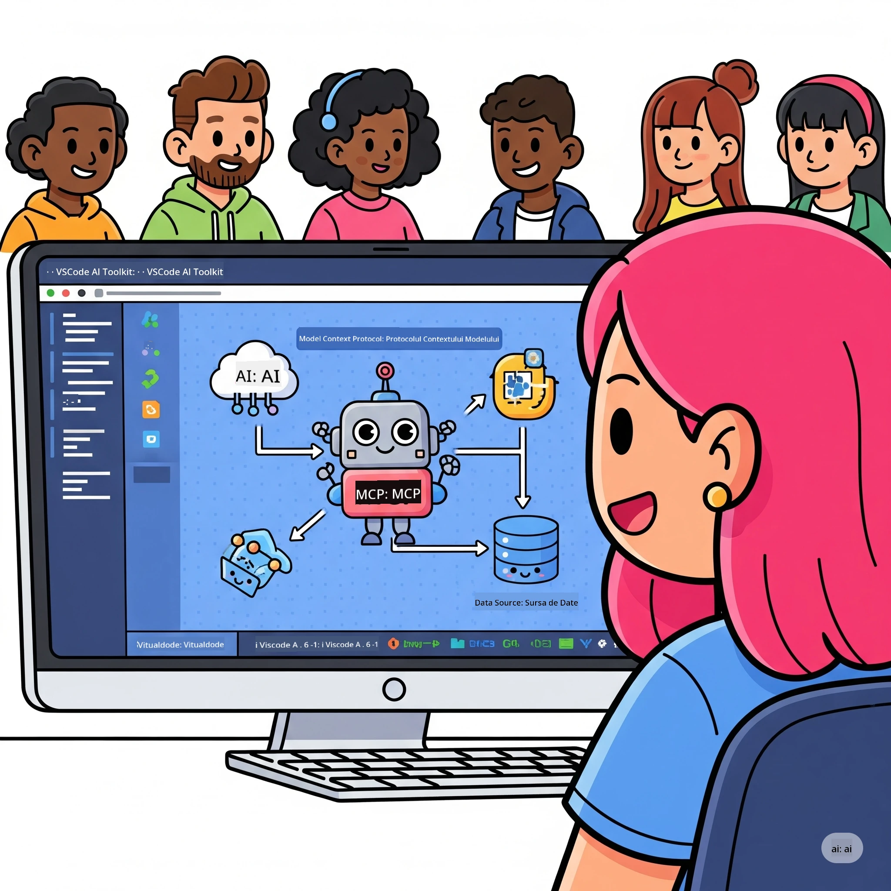
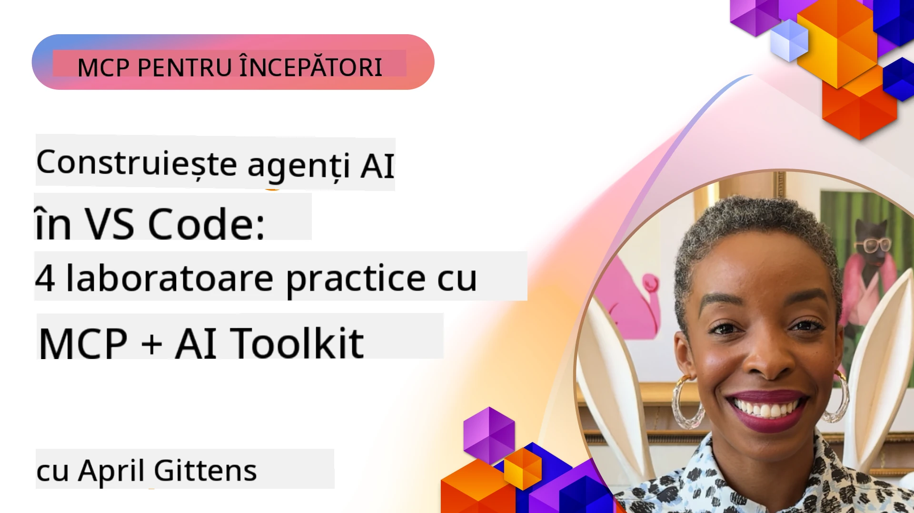

# Simplificarea fluxurilor de lucru AI: Construirea unui server MCP cu Microsoft Foundry Toolkit

## 🎯 Prezentare generală

_(Faceți clic pe imaginea de mai sus pentru a viziona videoclipul acestei lecții)_

Bine ați venit la **Atelierul Model Context Protocol (MCP)**! Acest atelier practic cuprinzător combină două tehnologii de ultimă generație pentru a revoluționa dezvoltarea aplicațiilor AI:

> **Notă de compatibilitate:** codul atelierului a fost construit și testat cu MCP
> `2025-11-25`, așa cum indică insigna de mai sus. Folosiți
> [specificația actuală `2026-07-28`](https://modelcontextprotocol.io/specification/2026-07-28/)
> pentru noile implementări ale protocolului și verificați notele de lansare ale SDK-ului înainte
> de migrarea atelierelor.

- **🔗 Model Context Protocol (MCP)**: Un standard deschis pentru integrarea fluentă a instrumentelor AI
- **🛠️ Extensia Microsoft Foundry Toolkit pentru VS Code**: Extensia puternică de dezvoltare AI a Microsoft

### 🎓 Ce vei învăța

Până la sfârșitul acestui atelier, vei stăpâni arta construirii aplicațiilor inteligente care leagă modelele AI de instrumente și servicii din lumea reală. De la testare automată până la integrări API personalizate, vei dobândi abilități practice pentru a rezolva provocări complexe de afaceri.

## 🏗️ Stivă tehnologică

### 🔌 Model Context Protocol (MCP)

MCP este **„USB-C-ul pentru AI”** - un standard universal care conectează modelele AI la instrumente și surse de date externe.

**✨ Caracteristici cheie:**

- 🔄 **Integrare standardizată**: Interfață universală pentru conexiuni AI-instrumente
- 🏛️ **Arhitectură flexibilă**: Servere locale și la distanță prin transport stdio/SSE
- 🧰 **Ecosistem bogat**: Instrumente, prompturi și resurse într-un singur protocol
- 🔒 **Pregătit pentru întreprinderi**: Securitate și fiabilitate integrate

**🎯 De ce este important MCP:**
La fel cum USB-C a eliminat dezordinea cablurilor, MCP elimină complexitatea integrărilor AI. Un protocol, posibilități infinite.

### 🤖 Extensia Microsoft Foundry Toolkit pentru VS Code

Extensia principală de dezvoltare AI a Microsoft, care transformă VS Code într-o putere AI.

**🚀 Capacități de bază:**

- 📦 **Catalog de modele**: Acces la modele din Azure AI, GitHub, Hugging Face, Ollama
- ⚡ **Inferență locală**: Execuție optimizată ONNX pe CPU/GPU/NPU
- 🏗️ **Agent Builder**: Dezvoltare vizuală a agenților AI cu integrare MCP
- 🎭 **Multi-modal**: Suport pentru text, viziune și output structurat

**💡 Beneficii pentru dezvoltare:**

- Implementare model fără configurare
- Inginerie vizuală a prompturilor
- Mediu de testare în timp real
- Integrare perfectă a serverelor MCP

## 📚 Parcurs de învățare

### [🚀 Modul 1: Fundamentele Microsoft Foundry Toolkit](./lab1/README.md)

**Durată**: 15 minute

- 🛠️ Instalare și configurare Microsoft Foundry Toolkit pentru VS Code
- 🗂️ Explorarea Catalogului de modele (peste 100 de modele de pe GitHub, ONNX, OpenAI, Anthropic, Google)
- 🎮 Stăpânirea Playground-ului Interactiv pentru testarea modelelor în timp real
- 🤖 Construirea primului agent AI cu Agent Builder
- 📊 Evaluarea performanței modelului cu metrici încorporate (F1, relevanță, similitudine, coerență)
- ⚡ Învățarea procesării batch și a suportului multi-modal

**🎯 Rezultat de învățare**: Crearea unui agent AI funcțional cu înțelegere completă a capacităților Microsoft Foundry Toolkit

### [🌐 Modul 2: MCP cu Fundamente Microsoft Foundry Toolkit](./lab2/README.md)

**Durată**: 20 minute

- 🧠 Stăpânirea arhitecturii și conceptelor Model Context Protocol (MCP)
- 🌐 Explorarea ecosistemului serverelor MCP Microsoft
- 🤖 Construirea unui agent de automatizare browser folosind Playwright MCP server
- 🔧 Integrarea serverelor MCP cu Microsoft Foundry Toolkit Agent Builder
- 📊 Configurarea și testarea instrumentelor MCP în agenții tăi
- 🚀 Exportul și implementarea agenților impulsionați de MCP pentru utilizare în producție

**🎯 Rezultat de învățare**: Implementarea unui agent AI super-alimentat cu instrumente externe prin MCP

### [🔧 Modul 3: Dezvoltare MCP Avansată cu Microsoft Foundry Toolkit](./lab3/README.md)

**Durată**: 20 minute

- 💻 Crearea serverelor MCP personalizate folosind Microsoft Foundry Toolkit
- 🐍 Configurarea și utilizarea celui mai recent MCP Python SDK (v1.9.3)
- 🔍 Configurarea și utilizarea MCP Inspector pentru depanare
- 🛠️ Construirea unui Weather MCP Server cu fluxuri profesionale de depanare
- 🧪 Depanarea serverelor MCP în medii Agent Builder și Inspector

**🎯 Rezultat de învățare**: Dezvoltarea și depanarea serverelor MCP personalizate cu instrumente moderne

### [🐙 Modul 4: Dezvoltare practică MCP - Server personalizat GitHub Clone](./lab4/README.md)

**Durată**: 30 minute

- 🏗️ Construirea unui Server MCP GitHub Clone real pentru fluxuri de lucru de dezvoltare
- 🔄 Implementarea clonării inteligente a depozitelor cu validare și gestionare a erorilor
- 📁 Crearea gestionării inteligente a directoarelor și integrarea VS Code
- 🤖 Utilizarea modului GitHub Copilot Agent cu instrumente MCP personalizate
- 🛡️ Aplicarea fiabilității pregătite pentru producție și compatibilitatea cross-platform

**🎯 Rezultat de învățare**: Implementarea unui server MCP pregătit pentru producție care simplifică fluxuri reale de lucru în dezvoltare

## 💡 Aplicații și impact în lumea reală

### 🏢 Cazuri de utilizare în întreprinderi

#### 🔄 Automatizare DevOps

Transformă fluxul tău de lucru de dezvoltare cu automatizare inteligentă:

- **Gestionare inteligentă a depozitelor**: Revizuirea codului și decizii de îmbinare bazate pe AI
- **CI/CD inteligent**: Optimizarea automată a pipeline-ului bazată pe modificările codului
- **Triere probleme**: Clasificare automată și asignare a bug-urilor

#### 🧪 Revoluție în asigurarea calității

Ridică testarea la nivelul următor cu automatizare AI:

- **Generare inteligentă de teste**: Crearea automată a suitei de teste complexe
- **Testare vizuală a regresiei**: Detectarea AI a schimbărilor UI
- **Monitorizarea performanței**: Identificarea și rezolvarea proactivă a problemelor

#### 📊 Inteligența fluxului de date

Construiește fluxuri inteligente de procesare a datelor:

- **Procese ETL adaptive**: Transformări de date auto-optimizante
- **Detecție anomalii**: Monitorizare calitate date în timp real
- **Rutare inteligentă**: Gestionarea inteligentă a fluxului de date

#### 🎧 Îmbunătățirea experienței clienților

Creează interacțiuni excepționale cu clienții:

- **Suport conștient de context**: Agenți AI cu acces la istoricul clientului
- **Rezolvare proactivă a problemelor**: Serviciu predictiv pentru clienți
- **Integrare multi-canal**: Experiență AI unificată pe platforme

## 🛠️ Cerințe preliminare & configurare

### 💻 Cerințe de sistem

| Componentă | Cerință | Note |
|-----------|-------------|-------|
| **Sistem de operare** | Windows 10+, macOS 10.15+, Linux | Orice sistem de operare modern |
| **Visual Studio Code** | cea mai recentă versiune stabilă | Necesare pentru Microsoft Foundry Toolkit |
| **Node.js** | v18.0+ și npm | Pentru dezvoltarea serverului MCP |
| **Python** | 3.10+ | Opțional pentru servere MCP în Python |
| **Memorie** | minimum 8GB RAM | 16GB recomandat pentru modele locale |

### 🔧 Mediu de dezvoltare

#### Extensii VS Code recomandate

- **Microsoft Foundry Toolkit** (ms-windows-ai-studio.windows-ai-studio)
- **Python** (ms-python.python)
- **Python Debugger** (ms-python.debugpy)
- **GitHub Copilot** (GitHub.copilot) - Opțional, dar util

#### Instrumente opționale

- **uv**: Manager de pachete Python modern
- **MCP Inspector**: Instrument vizual pentru depanare a serverelor MCP
- **Playwright**: Pentru exemple de automatizare web

## 🎖️ Rezultate de învățare & cale de certificare

### 🏆 Lista de competențe stăpânite

Prin finalizarea acestui atelier, vei obține stăpânirea în:

#### 🎯 Competențe de bază

- [ ] **Stăpânirea Protocolului MCP**: Înțelegere profundă a arhitecturii și modelelor de implementare
- [ ] **Competență Microsoft Foundry Toolkit**: Utilizare expertă a Microsoft Foundry Toolkit pentru dezvoltare rapidă
- [ ] **Dezvoltare server personalizat**: Construiește, implementează și întreține servere MCP de producție
- [ ] **Excelență în integrarea instrumentelor**: Conectează fără probleme AI cu fluxurile de dezvoltare existente
- [ ] **Aplicarea soluționării problemelor**: Folosește abilitățile învățate pentru provocări reale de business

#### 🔧 Abilități tehnice

- [ ] Configurează și utilizează Microsoft Foundry Toolkit în VS Code
- [ ] Proiectează și implementează servere MCP personalizate
- [ ] Integrează modelele GitHub cu arhitectura MCP
- [ ] Construiește fluxuri de testare automate cu Playwright
- [ ] Implementează agenți AI pentru utilizare în producție
- [ ] Depanează și optimizează performanța serverelor MCP

#### 🚀 Capacități avansate

- [ ] Arhitecturi de integrare AI la scară enterprise
- [ ] Aplică cele mai bune practici de securitate pentru aplicații AI
- [ ] Proiectează arhitecturi scalabile de server MCP
- [ ] Creează lanțuri de instrumente personalizate pentru domenii specifice
- [ ] Mentor pentru dezvoltare AI nativă

## 📖 Resurse suplimentare

- [Specificația MCP (2026-07-28)](https://modelcontextprotocol.io/specification/2026-07-28/)
- [Repository GitHub Microsoft Foundry Toolkit](https://github.com/microsoft/vscode-ai-toolkit)
- [Colecție Servere MCP Exemplu](https://github.com/modelcontextprotocol/servers)
- [Ghidul celor mai bune practici](https://modelcontextprotocol.io/docs/best-practices)
- [Top 10 OWASP MCP](https://microsoft.github.io/mcp-azure-security-guide/mcp/) - Cele mai bune practici de securitate

---

**🚀 Ești gata să revoluționezi fluxul tău de lucru pentru dezvoltarea AI?**

Hai să construim împreună viitorul aplicațiilor inteligente cu MCP și Microsoft Foundry Toolkit!

## Ce urmează

Continuă la: [Modul 11: Laboratoare practice MCP Server](../11-MCPServerHandsOnLabs/README.md)

---

<!-- CO-OP TRANSLATOR DISCLAIMER START -->
**Declinare a responsabilității**:
Acest document a fost tradus folosind serviciul de traducere AI [Co-op Translator](https://github.com/Azure/co-op-translator). În timp ce ne străduim pentru acuratețe, vă rugăm să rețineți că traducerile automate pot conține erori sau inexactități. Documentul original în limba sa nativă trebuie considerat sursa autorizată. Pentru informații critice, se recomandă traducerea profesională realizată de un om. Nu ne asumăm responsabilitatea pentru eventualele neînțelegeri sau interpretări greșite care decurg din utilizarea acestei traduceri.
<!-- CO-OP TRANSLATOR DISCLAIMER END -->