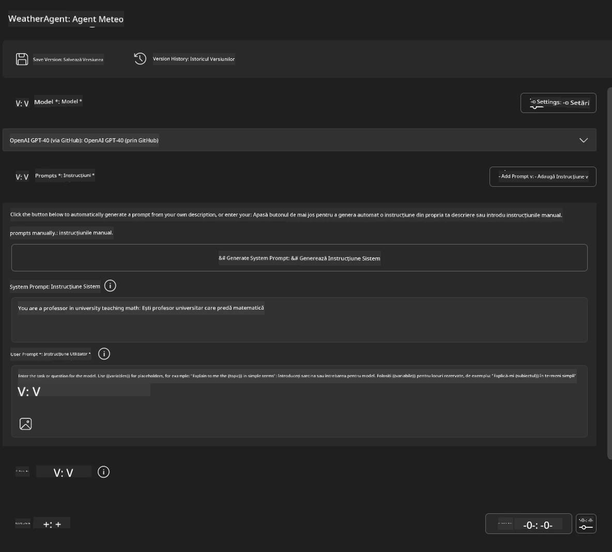
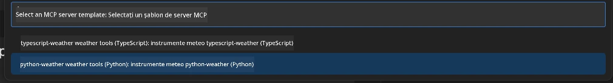
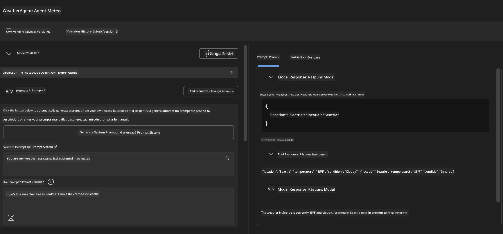
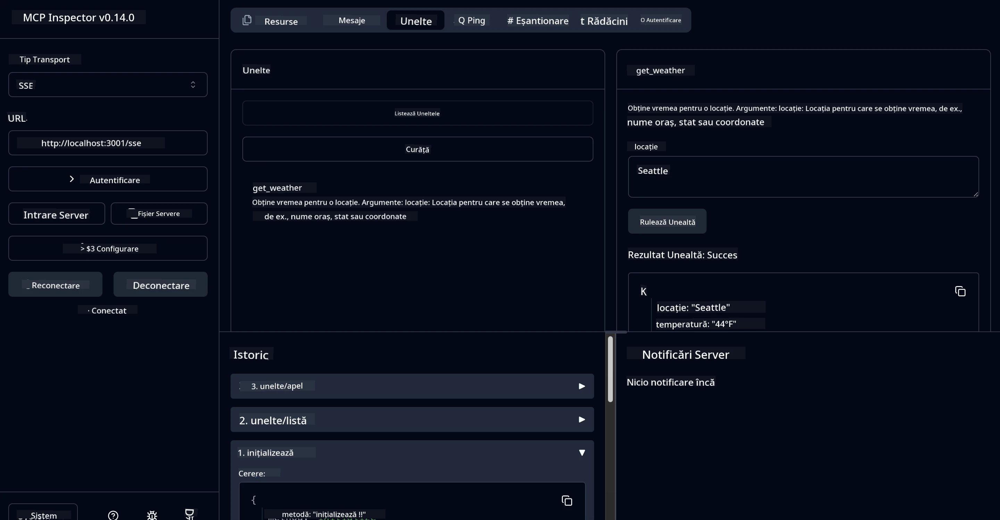

# 🔧 Modulul 3: Dezvoltare avansată MCP cu Microsoft Foundry Toolkit

> [!NOTE]
> URL-urile Inspector din acest laborator folosesc punctul final legacy `/sse` și vizează
> dependențele MCP SDK `1.9.3` și Inspector `0.14.0` fixate. Acestea nu sunt
> exemple Streamable HTTP actuale `2026-07-28`.


## 🎯 Obiective de învățare

Până la finalul acestui laborator, vei putea:

- ✅ Crea servere MCP personalizate utilizând Microsoft Foundry Toolkit
- ✅ Configura și utiliza cea mai recentă versiune a MCP Python SDK (v1.9.3)
- ✅ Configura și utiliza MCP Inspector pentru depanare
- ✅ Depana servere MCP în medii Agent Builder și Inspector
- ✅ Înțelege fluxuri de lucru avansate pentru dezvoltarea serverelor MCP

## 📋 Prerogative

- Finalizarea laboratorului 2 (Fundamente MCP)
- VS Code cu extensia Microsoft Foundry Toolkit instalată
- Mediu Python 3.10+
- Node.js și npm pentru configurarea Inspectorului

## 🏗️ Ce vei construi

În acest laborator, vei crea un **Server MCP pentru vreme** care demonstrează:
- Implementarea personalizată a unui server MCP
- Integrarea cu Agent Builder din Microsoft Foundry Toolkit
- Fluxuri de lucru profesionale pentru depanare
- Modele moderne de utilizare MCP SDK

---

## 🔧 Prezentare componente de bază

### 🐍 MCP Python SDK
Model Context Protocol Python SDK oferă fundația pentru construirea serverelor MCP personalizate. Vei folosi versiunea 1.9.3 cu capabilități sporite de depanare.

### 🔍 MCP Inspector
Un instrument puternic de depanare care oferă:
- Monitorizarea serverului în timp real
- Vizualizarea execuției instrumentelor
- Inspectarea solicitărilor și răspunsurilor de rețea
- Mediu interactiv de testare

---

## 📖 Implementare pas cu pas

### Pasul 1: Crearea unui WeatherAgent în Agent Builder

1. **Deschide Agent Builder** în VS Code prin extensia Microsoft Foundry Toolkit
2. **Creează un agent nou** cu următoarea configurație:
   - Nume Agent: `WeatherAgent`



### Pasul 2: Inițializează proiectul MCP Server

1. **Navighează la Tools** → **Add Tool** în Agent Builder
2. **Selectează "MCP Server"** din opțiunile disponibile
3. **Alege "Create A new MCP Server"**
4. **Selectează șablonul `python-weather`**
5. **Dă un nume serverului:** `weather_mcp`



### Pasul 3: Deschide și examinează proiectul

1. **Deschide proiectul generat** în VS Code
2. **Revizuiește structura proiectului:**
   ```
   weather_mcp/
   ├── src/
   │   ├── __init__.py
   │   └── server.py
   ├── inspector/
   │   ├── package.json
   │   └── package-lock.json
   ├── .vscode/
   │   ├── launch.json
   │   └── tasks.json
   ├── pyproject.toml
   └── README.md
   ```

### Pasul 4: Actualizează la cea mai recentă versiune MCP SDK

> **🔍 De ce să actualizezi?** Dorim să utilizăm cea mai nouă versiune MCP SDK (v1.9.3) și serviciul Inspector (0.14.0) pentru funcționalități îmbunătățite și capacități superioare de depanare.

#### 4a. Actualizează dependențele Python

**Editează `pyproject.toml`:** actualizează [./code/weather_mcp/pyproject.toml](../../../../10-StreamliningAIWorkflowsBuildingAnMCPServerWithAIToolkit/lab3/code/weather_mcp/pyproject.toml)


#### 4b. Actualizează configurația Inspectorului

**Editează `inspector/package.json`:** actualizează [./code/weather_mcp/inspector/package.json](../../../../10-StreamliningAIWorkflowsBuildingAnMCPServerWithAIToolkit/lab3/code/weather_mcp/inspector/package.json)

#### 4c. Actualizează dependențele Inspectorului

**Editează `inspector/package-lock.json`:** actualizează [./code/weather_mcp/inspector/package-lock.json](../../../../10-StreamliningAIWorkflowsBuildingAnMCPServerWithAIToolkit/lab3/code/weather_mcp/inspector/package-lock.json)

> **📝 Notă:** Acest fișier conține definiții extinse de dependențe. Mai jos este structura esențială - conținutul complet asigură rezolvarea corectă a dependențelor.


> **⚡ Pachet Lock complet:** Fișierul complet package-lock.json conține ~3000 de linii de definiții de dependențe. Mai sus este arătată structura cheie - folosește fișierul furnizat pentru rezolvarea completă a dependențelor.

### Pasul 5: Configurează depanarea în VS Code

*Notă: Te rugăm să copiezi fișierul în calea specificată pentru a înlocui fișierul local corespunzător*

#### 5a. Actualizează configurația de lansare

**Editează `.vscode/launch.json`:**

```json
{
  "version": "0.2.0",
  "configurations": [
    {
      "name": "Attach to Local MCP",
      "type": "debugpy",
      "request": "attach",
      "connect": {
        "host": "localhost",
        "port": 5678
      },
      "presentation": {
        "hidden": true
      },
      "internalConsoleOptions": "neverOpen",
      "postDebugTask": "Terminate All Tasks"
    },
    {
      "name": "Launch Inspector (Edge)",
      "type": "msedge",
      "request": "launch",
      "url": "http://localhost:6274?timeout=60000&serverUrl=http://localhost:3001/sse#tools",
      "cascadeTerminateToConfigurations": [
        "Attach to Local MCP"
      ],
      "presentation": {
        "hidden": true
      },
      "internalConsoleOptions": "neverOpen"
    },
    {
      "name": "Launch Inspector (Chrome)",
      "type": "chrome",
      "request": "launch",
      "url": "http://localhost:6274?timeout=60000&serverUrl=http://localhost:3001/sse#tools",
      "cascadeTerminateToConfigurations": [
        "Attach to Local MCP"
      ],
      "presentation": {
        "hidden": true
      },
      "internalConsoleOptions": "neverOpen"
    }
  ],
  "compounds": [
    {
      "name": "Debug in Agent Builder",
      "configurations": [
        "Attach to Local MCP"
      ],
      "preLaunchTask": "Open Agent Builder",
    },
    {
      "name": "Debug in Inspector (Edge)",
      "configurations": [
        "Launch Inspector (Edge)",
        "Attach to Local MCP"
      ],
      "preLaunchTask": "Start MCP Inspector",
      "stopAll": true
    },
    {
      "name": "Debug in Inspector (Chrome)",
      "configurations": [
        "Launch Inspector (Chrome)",
        "Attach to Local MCP"
      ],
      "preLaunchTask": "Start MCP Inspector",
      "stopAll": true
    }
  ]
}
```

**Editează `.vscode/tasks.json`:**

```
{
  "version": "2.0.0",
  "tasks": [
    {
      "label": "Start MCP Server",
      "type": "shell",
      "command": "python -m debugpy --listen 127.0.0.1:5678 src/__init__.py sse",
      "isBackground": true,
      "options": {
        "cwd": "${workspaceFolder}",
        "env": {
          "PORT": "3001"
        }
      },
      "problemMatcher": {
        "pattern": [
          {
            "regexp": "^.*$",
            "file": 0,
            "location": 1,
            "message": 2
          }
        ],
        "background": {
          "activeOnStart": true,
          "beginsPattern": ".*",
          "endsPattern": "Application startup complete|running"
        }
      }
    },
    {
      "label": "Start MCP Inspector",
      "type": "shell",
      "command": "npm run dev:inspector",
      "isBackground": true,
      "options": {
        "cwd": "${workspaceFolder}/inspector",
        "env": {
          "CLIENT_PORT": "6274",
          "SERVER_PORT": "6277",
        }
      },
      "problemMatcher": {
        "pattern": [
          {
            "regexp": "^.*$",
            "file": 0,
            "location": 1,
            "message": 2
          }
        ],
        "background": {
          "activeOnStart": true,
          "beginsPattern": "Starting MCP inspector",
          "endsPattern": "Proxy server listening on port"
        }
      },
      "dependsOn": [
        "Start MCP Server"
      ]
    },
    {
      "label": "Open Agent Builder",
      "type": "shell",
      "command": "echo ${input:openAgentBuilder}",
      "presentation": {
        "reveal": "never"
      },
      "dependsOn": [
        "Start MCP Server"
      ],
    },
    {
      "label": "Terminate All Tasks",
      "command": "echo ${input:terminate}",
      "type": "shell",
      "problemMatcher": []
    }
  ],
  "inputs": [
    {
      "id": "openAgentBuilder",
      "type": "command",
      "command": "ai-mlstudio.agentBuilder",
      "args": {
        "initialMCPs": [ "local-server-weather_mcp" ],
        "triggeredFrom": "vsc-tasks"
      }
    },
    {
      "id": "terminate",
      "type": "command",
      "command": "workbench.action.tasks.terminate",
      "args": "terminateAll"
    }
  ]
}
```


---

## 🚀 Rularea și testarea serverului MCP

### Pasul 6: Instalează dependențele

După efectuarea modificărilor de configurare, execută următoarele comenzi:

**Instalează dependențele Python:**
```bash
uv sync
```

**Instalează dependențele Inspector:**
```bash
cd inspector
npm install
```

### Pasul 7: Depanare cu Agent Builder

1. **Apasă F5** sau folosește configurația **"Debug in Agent Builder"**
2. **Selectează configurația compound** din panoul de depanare
3. **Așteaptă să pornească serverul** și deschiderea Agent Builder
4. **Testează serverul tău MCP pentru vreme** cu întrebări în limbaj natural

Introdu un prompt astfel

SYSTEM_PROMPT

```
You are my weather assistant
```

USER_PROMPT

```
How's the weather like in Seattle
```



### Pasul 8: Depanare cu MCP Inspector

1. **Folosește configurația "Debug in Inspector"** (Edge sau Chrome)
2. **Deschide interfața Inspector la** `http://localhost:6274`
3. **Explorează mediul interactiv de testare:**
   - Vizualizează uneltele disponibile
   - Testează execuția uneltelor
   - Monitorizează solicitările de rețea
   - Depanează răspunsurile serverului



---

## 🎯 Rezultate cheie de învățare

După finalizarea acestui laborator, ai:

- [x] **Creat un server MCP personalizat** folosind șabloanele Microsoft Foundry Toolkit
- [x] **Actualizat la cea mai recentă versiune MCP SDK** (v1.9.3) pentru funcționalitate sporită
- [x] **Configurat fluxuri profesionale de depanare** pentru Agent Builder și Inspector
- [x] **Configurat MCP Inspector** pentru testare interactivă a serverului
- [x] **Stăpânit configurațiile de depanare VS Code** pentru dezvoltarea MCP

## 🔧 Funcționalități avansate explorate

| Funcționalitate | Descriere | Caz de utilizare |
|---------|-------------|----------|
| **MCP Python SDK v1.9.3** | Implementarea cea mai recentă a protocolului | Dezvoltare modernă server |
| **MCP Inspector 0.14.0** | Instrument interactiv de depanare | Testarea serverului în timp real |
| **Depanare VS Code** | Mediu integrat de dezvoltare | Flux de lucru profesional pentru depanare |
| **Integrare Agent Builder** | Conexiune directă Microsoft Foundry Toolkit | Testare end-to-end a agentului |

## 📚 Resurse suplimentare

- [Documentația MCP Python SDK](https://modelcontextprotocol.io/docs/sdk/python)
- [Ghid extensie Microsoft Foundry Toolkit](https://code.visualstudio.com/docs/ai/ai-toolkit)
- [Documentație depanare VS Code](https://code.visualstudio.com/docs/editor/debugging)
- [Specificația Model Context Protocol](https://modelcontextprotocol.io/docs/concepts/architecture)

---

**🎉 Felicitări!** Ai finalizat cu succes Laboratorul 3 și acum poți crea, depana și implementa servere MCP personalizate folosind fluxuri profesionale de dezvoltare.

### 🔜 Continuă la modulul următor

Ești pregătit să aplici abilitățile MCP într-un flux de lucru real de dezvoltare? Continuă cu **[Modulul 4: Dezvoltare practică MCP - Server personalizat de clonare GitHub](../lab4/README.md)** unde vei:
- Construi un server MCP gata de producție care automatizează operațiunile cu repository GitHub
- Implementa funcționalitatea de clonare repository GitHub prin MCP
- Integra serverele MCP personalizate cu VS Code și GitHub Copilot Agent Mode
- Testa și implementa servere MCP personalizate în medii de producție
- Învața automatizarea practică a fluxurilor de lucru pentru dezvoltatori

---

<!-- CO-OP TRANSLATOR DISCLAIMER START -->
**Declinare a responsabilității**:
Acest document a fost tradus folosind serviciul de traducere AI [Co-op Translator](https://github.com/Azure/co-op-translator). În timp ce ne străduim pentru acuratețe, vă rugăm să rețineți că traducerile automate pot conține erori sau inexactități. Documentul original în limba sa nativă trebuie considerat sursa autorizată. Pentru informații critice, se recomandă traducerea profesională realizată de un om. Nu ne asumăm responsabilitatea pentru eventualele neînțelegeri sau interpretări greșite care decurg din utilizarea acestei traduceri.
<!-- CO-OP TRANSLATOR DISCLAIMER END -->