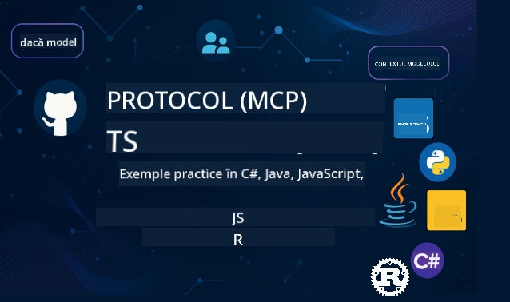

 

[](https://GitHub.com/microsoft/mcp-for-beginners/graphs/contributors)
[](https://GitHub.com/microsoft/mcp-for-beginners/issues)
[](https://GitHub.com/microsoft/mcp-for-beginners/pulls)
[](http://makeapullrequest.com)

[](https://GitHub.com/microsoft/mcp-for-beginners/watchers)
[](https://GitHub.com/microsoft/mcp-for-beginners/fork)
[](https://GitHub.com/microsoft/mcp-for-beginners/stargazers)


[](https://discord.gg/nTYy5BXMWG)

Urmați acești pași pentru a începe să folosiți aceste resurse:
1. **Fork Repository-ul**: Click pe [](https://GitHub.com/microsoft/mcp-for-beginners/fork)
2. **Clonează Repository-ul**:   `git clone https://github.com/microsoft/mcp-for-beginners.git`
3. **Alătură-te** [](https://discord.gg/nTYy5BXMWG)


### 🌐 Suport Multi-Limbaj

#### Suportat prin GitHub Action (Automatizat & Întotdeauna Actualizat)

<!-- CO-OP TRANSLATOR LANGUAGES TABLE START -->
[Arabic](../ar/README.md) | [Bengali](../bn/README.md) | [Bulgarian](../bg/README.md) | [Burmese (Myanmar)](../my/README.md) | [Chinese (Simplified)](../zh-CN/README.md) | [Chinese (Traditional, Hong Kong)](../zh-HK/README.md) | [Chinese (Traditional, Macau)](../zh-MO/README.md) | [Chinese (Traditional, Taiwan)](../zh-TW/README.md) | [Croatian](../hr/README.md) | [Czech](../cs/README.md) | [Danish](../da/README.md) | [Dutch](../nl/README.md) | [Estonian](../et/README.md) | [Finnish](../fi/README.md) | [French](../fr/README.md) | [German](../de/README.md) | [Greek](../el/README.md) | [Hebrew](../he/README.md) | [Hindi](../hi/README.md) | [Hungarian](../hu/README.md) | [Indonesian](../id/README.md) | [Italian](../it/README.md) | [Japanese](../ja/README.md) | [Kannada](../kn/README.md) | [Korean](../ko/README.md) | [Lithuanian](../lt/README.md) | [Malay](../ms/README.md) | [Malayalam](../ml/README.md) | [Marathi](../mr/README.md) | [Nepali](../ne/README.md) | [Nigerian Pidgin](../pcm/README.md) | [Norwegian](../no/README.md) | [Persian (Farsi)](../fa/README.md) | [Polish](../pl/README.md) | [Portuguese (Brazil)](../pt-BR/README.md) | [Portuguese (Portugal)](../pt-PT/README.md) | [Punjabi (Gurmukhi)](../pa/README.md) | [Romanian](./README.md) | [Russian](../ru/README.md) | [Serbian (Cyrillic)](../sr/README.md) | [Slovak](../sk/README.md) | [Slovenian](../sl/README.md) | [Spanish](../es/README.md) | [Swahili](../sw/README.md) | [Swedish](../sv/README.md) | [Tagalog (Filipino)](../tl/README.md) | [Tamil](../ta/README.md) | [Telugu](../te/README.md) | [Thai](../th/README.md) | [Turkish](../tr/README.md) | [Ukrainian](../uk/README.md) | [Urdu](../ur/README.md) | [Vietnamese](../vi/README.md)

> **Preferi să Clonezi Local?**

> Acest repository include traduceri în peste 50 de limbi, ceea ce crește semnificativ dimensiunea descărcării. Pentru a clona fără traduceri, folosește sparse checkout:
> ```bash
> git clone --filter=blob:none --sparse https://github.com/microsoft/mcp-for-beginners.git
> cd mcp-for-beginners
> git sparse-checkout set --no-cone '/*' '!translations' '!translated_images'
> ```
> Acest lucru îți oferă tot ce ai nevoie pentru a finaliza cursul cu o descărcare mult mai rapidă.
<!-- CO-OP TRANSLATOR LANGUAGES TABLE END -->

# 🚀 Curriculum Model Context Protocol (MCP) pentru Începători

## **Învață MCP cu exemple practice de cod în C#, Java, JavaScript, Rust, Python și TypeScript**

## 🧠 Prezentare Generală a Curriculumului Model Context Protocol
Bine ai venit în călătoria ta în universul Model Context Protocol! Dacă te-ai întrebat vreodată cum comunică aplicațiile AI cu diferite instrumente și servicii, ești pe cale să descoperi soluția elegantă care transformă modul în care dezvoltatorii construiesc sisteme inteligente.

Gândește-te la MCP ca un translator universal pentru aplicațiile AI - exact cum porturile USB îți permit să conectezi orice dispozitiv la calculator, MCP permite modelelor AI să se conecteze la orice instrument sau serviciu într-un mod standardizat. Indiferent dacă construiești primul tău chatbot sau lucrezi la fluxuri complexe AI, înțelegerea MCP îți va da puterea de a crea aplicații mai capabile și flexibile.

Acest curriculum este proiectat cu răbdare și grijă pentru călătoria ta de învățare. Vom începe cu concepte simple pe care le cunoști deja și vom construi treptat expertiza ta prin practică aplicată în limbajul tău de programare preferat. Fiecare pas include explicații clare, exemple practice și multă încurajare pe parcurs.

Până când vei termina această călătorie, vei avea încrederea să construiești propriile servere MCP, să le integrezi cu platforme AI populare și să înțelegi cum această tehnologie reconfigurează viitorul dezvoltării AI. Hai să începem această aventură captivantă împreună!

### Documentație și Specificații Oficiale

Aceste resurse devin tot mai valoroase pe măsură ce înțelegerea ta crește, dar nu te simți presat să le parcurgi pe toate imediat. Începe cu zonele care te interesează cel mai mult!
- 📘 [Documentația MCP](https://modelcontextprotocol.io/) – Aceasta este resursa ta principală pentru tutoriale pas cu pas și ghiduri de utilizator. Documentația este scrisă pentru începători, oferind exemple clare pe care le poți urma în ritmul tău.
- 📜 [Specificația MCP](https://modelcontextprotocol.io/docs/) – Gândește-te la aceasta ca la manualul tău de referință cuprinzător. Pe măsură ce parcurgi curriculum-ul, vei reveni aici pentru a căuta detalii specifice și a explora funcții avansate.
- 📜 [Specificația Originală MCP](https://modelcontextprotocol.io/specification/versioning) – Conține detalii tehnice suplimentare care pot fi utile pentru implementări avansate. Este disponibilă când ai nevoie, dar nu te preocupa când ești la început.
- 🧑‍💻 [Repository GitHub MCP](https://github.com/modelcontextprotocol) – Aici găsești SDK-uri, unelte și exemple de cod în mai multe limbaje de programare. Este ca o comoară de exemple practice și componente gata de utilizat.
- 🌐 [Comunitatea MCP](https://github.com/orgs/modelcontextprotocol/discussions) – Alătură-te altor cursanți și dezvoltatori experimentați în discuții despre MCP. Este o comunitate de sprijin unde întrebările sunt binevenite și cunoștințele sunt împărtășite liber.
  
## Obiectivele de Învățare

Până la finalul acestui curriculum, te vei simți încrezător și entuziasmat de noile tale abilități. Iată ce vei realiza:

• **Înțelegerea elementelor de bază MCP**: Vei înțelege ce este Model Context Protocol și de ce revoluționează modul în care aplicațiile AI colaborează, folosind analogii și exemple clare.

• **Construiește primul tău server MCP**: Vei crea un server MCP funcțional în limbajul tău preferat, începând cu exemple simple și crescând abilitățile pas cu pas.

• **Conectează modelele AI la unelte reale**: Vei învăța cum să faci legătura între modelele AI și servicii reale, oferindu-le aplicațiilor tale capacități puternice noi.

• **Implementarea celor mai bune practici de securitate**: Vei înțelege cum să păstrezi implementările MCP sigure, protejând atât aplicațiile, cât și utilizatorii.

• **Dezvoltare și lansare cu încredere**: Vei ști cum să duci proiectele MCP din dezvoltare în producție, cu strategii de implementare practice care funcționează în lumea reală.

• **Alătură-te comunității MCP**: Vei deveni parte dintr-o comunitate în creștere a dezvoltatorilor care modelează viitorul dezvoltării aplicațiilor AI. 

## Cunoștințe Fundamentale Esențiale

Înainte să intrăm în specificul MCP, hai să ne asigurăm că te simți confortabil cu câteva concepte de bază. Nu te îngrijora dacă nu ești expert în aceste domenii - vom explica tot ce trebuie să știi pe parcurs!

### Înțelegerea Protocoalelor (Fundamentul)

Gândește-te la un protocol ca la regulile unui dialog. Când suni un prieten, amândoi știți să spuneți „bună” când răspundeți, să vorbiți pe rând și să spuneți „la revedere” când terminați. Programele de calculator au nevoie de reguli similare pentru a comunica eficient.

MCP este un protocol – un set de reguli agreate care ajută modelele AI și aplicațiile să aibă „conversații” productive cu unelte și servicii. Exact cum regulile de conversație fac comunicarea umană mai fluidă, MCP face comunicarea aplicațiilor AI mult mai sigură și puternică.

### Relațiile Client-Server (Cum Lucrează Programele Împreună)

Folosesti deja relații client-server în fiecare zi! Când folosești un browser web (clientul) pentru a vizita un site, te conectezi la un server web care îți trimite conținutul paginii. Browserul știe să ceară informații, iar serverul știe să răspundă.

În MCP, avem o relație similară: modelele AI acționează ca niște clienți care cer informații sau acțiuni, iar serverele MCP oferă aceste capabilități. Este ca și cum ai avea un asistent ajutător (serverul) pe care AI-ul îl poate întreba să efectueze anumite sarcini.

### De ce Contează Standardizarea (Făcând Lucrurile Compatibile)

Imaginează-ți dacă fiecare producător de mașini ar folosi pompe de benzină cu forme diferite – ai avea nevoie de un adaptor diferit pentru fiecare mașină! Standardizarea înseamnă să cădem de acord asupra unor metode comune astfel încât lucrurile să funcționeze împreună fără probleme.

MCP oferă această standardizare pentru aplicațiile AI. În loc ca fiecare model AI să aibă nevoie de cod personalizat pentru fiecare unealtă, MCP creează o modalitate universală de comunicare. Aceasta înseamnă că dezvoltatorii pot construi unelte o singură dată și să le facă să funcționeze cu multe sisteme AI diferite.

## 🧭 Panorama Parcursului Tău de Învățare

Călătoria ta MCP este structurat atent pentru a-ți construi încrederea și abilitățile treptat. Fiecare fază introduce concepte noi în timp ce întărește ceea ce ai învățat deja.

### 🌱 Faza de Bază: Înțelegerea Elementelor Esențiale (Modulele 0-2)

Aici începe aventura ta! Îți vom introduce conceptele MCP folosind analogii familiare și exemple simple. Vei înțelege ce este MCP, de ce există și cum se încadrează în lumea mai largă a dezvoltării AI.

• **Modulul 0 - Introducere în MCP**: Vom începe prin a explora ce este MCP și de ce este atât de important pentru aplicațiile AI moderne. Vei vedea exemple din lumea reală a MCP în acțiune și vei înțelege cum rezolvă probleme comune cu care se confruntă dezvoltatorii.

• **Modulul 1 - Explicația Conceptelor de Bază**: Aici vei învăța elementele fundamentale ale MCP. Vom folosi multe analogii și exemple vizuale pentru a face aceste concepte simple și ușor de înțeles.

• **Modulul 2 - Securitatea în MCP**: Securitatea poate părea intimidantă, dar îți vom arăta cum MCP include funcții încorporate de siguranță și îți vom preda cele mai bune practici care îți protejează aplicațiile de la început.

### 🔨 Faza de Construcție: Crearea Primelor Tale Implementări (Modulul 3)

Acum începe partea adevărată și distractivă! Vei obține experiență practică construind servere și clienți MCP reali. Nu te îngrijora - vom începe simplu și te vom ghida pas cu pas.

Acest modul include mai multe ghiduri practice care îți permit să exersezi în limbajul tău preferat de programare. Vei crea primul server, vei construi un client pentru a se conecta la el și chiar vei integra cu unelte populare de dezvoltare ca VS Code.
Fiecare ghid include exemple complete de cod, sfaturi pentru depanare și explicații despre motivele pentru care facem anumite alegeri de design. La sfârșitul acestei etape, vei avea implementări MCP funcționale de care te poți mândri!

### 🚀 Faza de Creștere: Concepte Avansate și Aplicare în Lumea Reală (Modulele 4-5)

După ce ai stăpânit elementele de bază, ești gata să explorezi funcționalități MCP mai sofisticate. Vom acoperi strategii practice de implementare, tehnici de depanare și subiecte avansate precum integrarea AI multimodală.

De asemenea, vei învăța cum să scalezi implementările MCP pentru utilizarea în producție și cum să integrezi cu platforme cloud precum Azure. Aceste module te pregătesc să construiești soluții MCP care să facă față cerințelor din lumea reală.

### 🌟 Faza de Măiestrie: Comunitate și Specializare (Modulele 6-11)

Ultima fază se concentrează pe alăturarea comunității MCP și specializarea în ariile care te interesează cel mai mult. Vei învăța cum să contribui la proiecte open-source MCP, să implementezi modele avansate de autentificare și să construiești soluții complexe integrate cu baze de date.

Modulul 11 merită o mențiune specială - este un traseu complet de învățare practic cu 13 laboratoare, care te învață să construiești servere MCP gata de producție, cu integrare PostgreSQL. Este ca un proiect final ce reunește tot ce ai învățat!

### 📚 Structura Completă a Curriculumului

| Modul | Subiect | Descriere | Link |
|--------|-------|-------------|------|
| **Modulele 1-3: Fundamente** | | | |
| 00 | Introducere în MCP | Prezentare generală a Model Context Protocol și semnificația sa în pipeline-urile AI | [Citește mai mult](./00-Introduction/README.md) |
| 01 | Concepte de bază explicate | Explorare detaliată a conceptelor fundamentale MCP | [Citește mai mult](./01-CoreConcepts/README.md) |
| 02 | Securitatea în MCP | Amenințări de securitate și bune practici | [Citește mai mult](./02-Security/README.md) |
| 03 | Început cu MCP | Configurare mediu, servere/clișee de bază, integrare | [Citește mai mult](./03-GettingStarted/README.md) |
| **Modul 3: Construirea primului server și client** | | | |
| 3.1 | Primul Server | Crearea primului server MCP | [Ghid](./03-GettingStarted/01-first-server/README.md) |
| 3.2 | Primul Client | Dezvoltarea unui client MCP de bază | [Ghid](./03-GettingStarted/02-client/README.md) |
| 3.3 | Client cu LLM | Integrarea modelelor lingvistice mari | [Ghid](./03-GettingStarted/03-llm-client/README.md) |
| 3.4 | Integrare VS Code | Consumarea serverelor MCP în VS Code | [Ghid](./03-GettingStarted/04-vscode/README.md) |
| 3.5 | Server stdio | Crearea serverelor folosind transport stdio | [Ghid](./03-GettingStarted/05-stdio-server/README.md) |
| 3.6 | Streaming HTTP | Implementarea streaming-ului HTTP în MCP | [Ghid](./03-GettingStarted/06-http-streaming/README.md) |
| 3.7 | AI Toolkit | Utilizarea AI Toolkit cu MCP | [Ghid](./03-GettingStarted/07-aitk/README.md) |
| 3.8 | Testare | Testarea implementării serverului MCP | [Ghid](./03-GettingStarted/08-testing/README.md) |
| 3.9 | Lansare în producție | Implementarea serverelor MCP în producție | [Ghid](./03-GettingStarted/09-deployment/README.md) |
| 3.10 | Utilizare avansată server | Folosirea serverelor avansate pentru funcționalități extinse și arhitectură îmbunătățită | [Ghid](./03-GettingStarted/10-advanced/README.md) |
| 3.11 | Autentificare simplă | Un capitol despre autentificare de la bază și RBAC | [Ghid](./03-GettingStarted/11-simple-auth/README.md) |
| **Modulele 4-5: Practic & Avansat** | | | |
| 04 | Implementare practică | SDK-uri, depanare, testare, șabloane reutilizabile de prompturi | [Citește mai mult](./04-PracticalImplementation/README.md) |
| 05 | Subiecte avansate MCP | AI multimodal, scalare, utilizare enterprise | [Citește mai mult](./05-AdvancedTopics/README.md) |
| 5.1 | Integrare Azure | Integrare MCP cu Azure | [Ghid](./05-AdvancedTopics/mcp-integration/README.md) |
| 5.2 | Multimodalitate | Lucrul cu mai multe modalități | [Ghid](./05-AdvancedTopics/mcp-multi-modality/README.md) |
| 5.3 | Demo OAuth2 | Implementarea autentificării OAuth2 | [Ghid](./05-AdvancedTopics/mcp-oauth2-demo/README.md) |
| 5.4 | Contexturi root | Înțelegerea și implementarea contextelor root | [Ghid](./05-AdvancedTopics/mcp-root-contexts/README.md) |
| 5.5 | Rutare | Strategii de rutare MCP | [Ghid](./05-AdvancedTopics/mcp-routing/README.md) |
| 5.6 | Sampling | Tehnici de sampling în MCP | [Ghid](./05-AdvancedTopics/mcp-sampling/README.md) |
| 5.7 | Scalare | Scalarea implementărilor MCP | [Ghid](./05-AdvancedTopics/mcp-scaling/README.md) |
| 5.8 | Securitate | Considerații avansate de securitate | [Ghid](./05-AdvancedTopics/mcp-security/README.md) |
| 5.9 | Căutare pe web | Implementarea capacităților de căutare pe web | [Ghid](./05-AdvancedTopics/web-search-mcp/README.md) |
| 5.10 | Streaming în timp real | Construirea funcționalității de streaming în timp real | [Ghid](./05-AdvancedTopics/mcp-realtimestreaming/README.md) |
| 5.11 | Căutare în timp real | Implementarea căutării în timp real | [Ghid](./05-AdvancedTopics/mcp-realtimesearch/README.md) |
| 5.12 | Autentificare Entra ID | Autentificare cu Microsoft Entra ID | [Ghid](./05-AdvancedTopics/mcp-security-entra/README.md) |
| 5.13 | Integrare Foundry | Integrare cu Azure AI Foundry | [Ghid](./05-AdvancedTopics/mcp-foundry-agent-integration/README.md) |
| 5.14 | Inginerie Context | Tehnici pentru inginerie eficientă a contextului | [Ghid](./05-AdvancedTopics/mcp-contextengineering/README.md) |
| 5.15 | Transport Custom MCP | Implementări personalizate de transport | [Ghid](./05-AdvancedTopics/mcp-transport/README.md) |
| **Modulele 6-10: Comunitate & Bune Practici** | | | |
| 06 | Contribuții Comunitare | Cum să contribui în ecosistemul MCP | [Ghid](./06-CommunityContributions/README.md) |
| 07 | Lecții din Adoptarea Timpurie | Povești de implementare reală | [Ghid](./07-LessonsFromEarlyAdoption/README.md) |
| 08 | Bune Practici pentru MCP | Performanță, toleranță la erori, reziliență | [Ghid](./08-BestPractices/README.md) |
| 09 | Studii de Caz MCP | Exemple practice de implementare | [Ghid](./09-CaseStudy/README.md) |
| 10 | Atelier Practic | Construirea unui Server MCP cu AI Toolkit | [Lab](./10-StreamliningAIWorkflowsBuildingAnMCPServerWithAIToolkit/README.md) |
| **Modul 11: Laborator Practic MCP Server** | | | |
| 11 | Integrare MCP Server cu Bază de Date | Traseu complet practic cu 13 laboratoare pentru integrarea PostgreSQL | [Lab-uri](./11-MCPServerHandsOnLabs/README.md) |
| 11.1 | Introducere | Prezentare generală MCP cu integrare baze de date și caz de utilizare retail analytics | [Lab 00](./11-MCPServerHandsOnLabs/00-Introduction/README.md) |
| 11.2 | Arhitectură de Bază | Înțelegerea arhitecturii serverului MCP, straturilor bazei de date și modelelor de securitate | [Lab 01](./11-MCPServerHandsOnLabs/01-Architecture/README.md) |
| 11.3 | Securitate & Multi-Tenant | Securitate la nivel de rând, autentificare și acces multi-chiriaș la date | [Lab 02](./11-MCPServerHandsOnLabs/02-Security/README.md) |
| 11.4 | Configurare Mediu | Setarea mediului de dezvoltare, Docker, resurse Azure | [Lab 03](./11-MCPServerHandsOnLabs/03-Setup/README.md) |
| 11.5 | Design Bază de Date | Configurare PostgreSQL, design schema retail și date exemplu | [Lab 04](./11-MCPServerHandsOnLabs/04-Database/README.md) |
| 11.6 | Implementare Server MCP | Construirea serverului FastMCP cu integrare baze de date | [Lab 05](./11-MCPServerHandsOnLabs/05-MCP-Server/README.md) |
| 11.7 | Dezvoltare Unelte | Crearea de unelte pentru interogare și introspecție schema bazei de date | [Lab 06](./11-MCPServerHandsOnLabs/06-Tools/README.md) |
| 11.8 | Căutare Semantică | Implementarea vector embeddings cu Azure OpenAI și pgvector | [Lab 07](./11-MCPServerHandsOnLabs/07-Semantic-Search/README.md) |
| 11.9 | Testare & Depanare | Strategii de testare, unelte de depanare și metode de validare | [Lab 08](./11-MCPServerHandsOnLabs/08-Testing/README.md) |
| 11.10 | Integrare VS Code | Configurarea integrării MCP în VS Code și utilizarea AI Chat | [Lab 09](./11-MCPServerHandsOnLabs/09-VS-Code/README.md) |
| 11.11 | Strategii de Lansare | Lansare Docker, Azure Container Apps și considerente de scalare | [Lab 10](./11-MCPServerHandsOnLabs/10-Deployment/README.md) |
| 11.12 | Monitorizare | Application Insights, logare, monitorizarea performanței | [Lab 11](./11-MCPServerHandsOnLabs/11-Monitoring/README.md) |
| 11.13 | Bune Practici | Optimizare performanță, consolidare securitate și sfaturi pentru producție | [Lab 12](./11-MCPServerHandsOnLabs/12-Best-Practices/README.md) |

### 💻 Proiecte Exemplu de Cod

Una dintre cele mai captivante părți ale învățării MCP este să vezi cum abilitățile tale de programare se dezvoltă treptat. Am creat exemplele de cod astfel încât să înceapă simplu și să devină tot mai sofisticate pe măsură ce înțelegerea ta crește. Iată cum introducem conceptele - cu cod ușor de înțeles, dar care demonstrează principii reale MCP, vei înțelege nu doar ce face codul, ci și de ce este structurat astfel și cum se integrează în aplicații MCP mai mari.

#### Exemple de bază pentru MCP Calculator

| Limbaj | Descriere | Link |
|----------|-------------|------|
| C# | Exemplu Server MCP | [Vezi Cod](./03-GettingStarted/samples/csharp/README.md) |
| Java | Calculator MCP | [Vezi Cod](./03-GettingStarted/samples/java/calculator/README.md) |
| JavaScript | Demo MCP | [Vezi Cod](./03-GettingStarted/samples/javascript/README.md) |
| Python | Server MCP | [Vezi Cod](../../03-GettingStarted/samples/python/mcp_calculator_server.py) |
| TypeScript | Exemplu MCP | [Vezi Cod](./03-GettingStarted/samples/typescript/README.md) |
| Rust | Exemplu MCP | [Vezi Cod](./03-GettingStarted/samples/rust/README.md) |

#### Implementări Avansate MCP

| Limbaj | Descriere | Link |
|----------|-------------|------|
| C# | Exemplu Avansat | [Vezi Cod](./04-PracticalImplementation/samples/csharp/README.md) |
| Java cu Spring | Exemplu Container App | [Vezi Cod](./04-PracticalImplementation/samples/java/containerapp/README.md) |
| JavaScript | Exemplu Avansat | [Vezi Cod](./04-PracticalImplementation/samples/javascript/README.md) |
| Python | Implementare Complexă | [Vezi Cod](../../04-PracticalImplementation/samples/python/READMEmd) |
| TypeScript | Exemplu Container | [Vezi Cod](./04-PracticalImplementation/samples/typescript/README.md) |


## 🎯 Cerințe Preliminare pentru Învățarea MCP

Pentru a profita la maxim de acest curriculum, ar trebui să ai:

- Cunoștințe de bază de programare în cel puțin unul dintre următoarele limbaje: C#, Java, JavaScript, Python sau TypeScript
- Înțelegerea modelului client-server și a API-urilor
- Familiaritate cu conceptele REST și HTTP
- (Opțional) Cunoștințe de bază în concepte AI/ML

- Participarea la discuțiile comunității noastre pentru suport

## 📚 Ghid de Studiu & Resurse

Acest depozit include mai multe resurse pentru a te ajuta să navighezi și să înveți eficient:

### Ghid de Studiu

Un [Ghid de Studiu](./study_guide.md) cuprinzător este disponibil pentru a te ajuta să navighezi eficient acest depozit. Această hartă vizuală a curriculumului arată cum sunt conectate toate subiectele și oferă îndrumări privind utilizarea proiectelor exemplu. Este deosebit de util dacă înveți vizual și îți place să vezi imaginea de ansamblu.

Ghidul include:
- O hartă vizuală a curriculumului care arată toate subiectele abordate
- Defalcarea detaliată a fiecărei secțiuni din depozit
- Indicații despre cum să folosești proiectele exemplu
- Trasee recomandate de învățare pentru diferite niveluri de competență
- Resurse suplimentare pentru a completa parcursul tău de învățare

### Changelog

Menținem un [Changelog](./changelog.md) detaliat care urmărește toate actualizările semnificative aduse materialelor din curriculum, astfel încât să fii la curent cu cele mai noi îmbunătățiri și adaosuri.
- Adaosuri de conținut nou
- Schimbări structurale
- Îmbunătățiri de funcționalitate
- Actualizări de documentație

## 🛠️ Cum să Folosești Acest Curriculum în Mod Eficient

Fiecare lecție din acest ghid include:
1. Explicații clare ale conceptelor MCP  
2. Exemple de cod live în mai multe limbaje  
3. Exerciții pentru a construi aplicații reale MCP  
4. Resurse suplimentare pentru cursanți avansați

## Conținut la Cerere

### [MCP Dev Days Iulie 2025](https://developer.microsoft.com/en-us/reactor/series/S-1563/)
#### [➡️Urmărește la cerere - MCP Dev Days](https://developer.microsoft.com/en-us/reactor/series/S-1563/)
Pregătește-te pentru două zile de informații tehnice aprofundate, conexiuni în comunitate și învățare practică la MCP Dev Days, un eveniment virtual dedicat Model Context Protocol (MCP) — standardul emergent care face legătura între modelele AI și instrumentele pe care se bazează.
Poți urmări MCP Dev Days înregistrându-te pe pagina noastră de eveniment: https://aka.ms/mcpdevdays. 

#### [Ziua 1: Productivitate MCP, Instrumente Dev și Comunitate:](https://developer.microsoft.com/en-us/reactor/series/S-1563/)

Este dedicată împuternicirii dezvoltatorilor să folosească MCP în fluxul lor de lucru și celebrării incredibilei comunități MCP. Vom fi alături de membri ai comunității și parteneri, precum Arcade, Block, Okta și Neon, pentru a vedea cum colaborează cu Microsoft pentru a crea un ecosistem MCP deschis și extensibil. Demo-uri din lumea reală în VS Code, Visual Studio, GitHub Copilot și instrumente populare din comunitate
Fluxuri de lucru practice, ghidate de context
Sesiuni și perspective conduse de comunitate
Indiferent dacă abia începi cu MCP sau construiești deja cu acesta, Ziua 1 va pregăti terenul cu inspirație și concluzii aplicabile.

#### [Ziua 2: Construiește Servere MCP cu Încredere](https://developer.microsoft.com/en-us/reactor/series/S-1563/)

Este pentru cei care construiesc MCP. Vom aprofunda strategiile de implementare și bunele practici pentru crearea de servere MCP și integrarea MCP în fluxurile tale AI.

#### Subiecte incluse:

- Construirea serverelor MCP și integrarea lor în experiențele agenților
- Dezvoltare condusă de prompturi
- Bune practici de securitate
- Utilizarea componentelor de bază precum Funcții, ACA și Management API
- Alinierea registrului și instrumentatia (1P + 3P)

Dacă ești dezvoltator, creator de instrumente sau strateg de produse AI, această zi este plină cu informațiile necesare pentru a construi soluții MCP scalabile, sigure și pregătite pentru viitor.

### MCP Boot Camp August 2025
Învață în sesiuni video intensive cum să creezi servere MCP, să integrezi cu VS Code și să implementezi profesional pe Azure, bazat pe conținutul din curriculum MCP pentru Începători. Dobândește abilități practice într-o tehnologie pe care companii mari o folosesc deja.

#### [➡️Urmărește la cerere MCP Bootcamp | Engleză](https://developer.microsoft.com/en-us/reactor/series/s-1568/)
#### [➡️Urmărește la cerere MCP Bootcamp | Brazilia](https://developer.microsoft.com/en-us/reactor/series/S-1566/)
#### [➡️Urmărește la cerere MCP Bootcamp | Spaniolă](https://developer.microsoft.com/en-us/reactor/series/S-1567/)

### Hai să învățăm MCP cu C# - Seria de tutoriale
Să învățăm despre Model Context Protocol (MCP), un cadru de ultimă generație creat pentru standardizarea interacțiunilor dintre modelele AI și aplicațiile client. Prin această sesiune prietenoasă începătorilor, te vom introduce în MCP și te vom ghida să creezi primul tău server MCP.
#### C#: [https://aka.ms/letslearnmcp-csharp](https://aka.ms/letslearnmcp-csharp)
#### Java: [https://aka.ms/letslearnmcp-java](https://aka.ms/letslearnmcp-java)
#### JavaScript: [https://aka.ms/letslearnmcp-javascript](https://aka.ms/letslearnmcp-javascript)
#### Python: [https://aka.ms/letslearnmcp-python](https://aka.ms/letslearnmcp-python)

## 🎓 Călătoria ta MCP începe

Felicitări! Tocmai ai făcut primul pas într-o călătorie captivantă care îți va extinde capacitățile de programare și te va conecta la avangarda dezvoltării AI.

### Ce ai realizat până acum

Parcurgând această introducere, ai început deja să-ți construiești baza de cunoștințe MCP. Înțelegi ce este MCP, de ce contează și cum te va susține acest curriculum în parcursul tău de învățare. Aceasta este o realizare importantă și începutul expertizei tale în această tehnologie esențială.

### Aventura ce te așteaptă

Pe măsură ce parcurgi modulele, amintește-ți că orice expert a fost odată începător. Conceptele care acum par complexe vor deveni a doua natură pe măsură ce le practici și le aplici. Fiecare pas mic construiește abilități puternice care te vor servi pe tot parcursul carierei tale în dezvoltare.

### Rețeaua ta de suport

Te alături unei comunități de cursanți și experți pasionați de MCP și dornici să ajute pe alții să reușească. Indiferent dacă te blochezi la o provocare de codare sau ești entuziasmat să împărtășești o descoperire, comunitatea este aici să te sprijine.

Dacă întâmpini dificultăți sau ai întrebări despre construirea aplicațiilor AI. Alătură-te altor cursanți și dezvoltatori experimentați în discuții despre MCP. Este o comunitate sprijinitoare unde întrebările sunt binevenite și cunoștințele se împărtășesc liber.

[](https://discord.gg/nTYy5BXMWG)

Dacă ai feedback despre produs sau erori în timpul construirii vizitează:

[](https://aka.ms/foundry/forum)

### Ești gata să începi?

Aventura ta MCP începe acum! Începe cu Modulul 0 pentru a te cufunda în primele tale experiențe practice MCP sau explorează proiectele sample pentru a vedea ce vei construi. Amintește-ți - orice expert a început exact de unde ești tu acum, iar cu răbdare și practică, vei fi surprins de ceea ce poți realiza.

Bine ai venit în lumea dezvoltării Model Context Protocol. Hai să construim ceva uimitor împreună!

## 🤝 Contribuind la Comunitatea de Învățare

Acest curriculum devine mai puternic prin contribuții din partea cursanților ca tine! Fie că corectezi o greșeală de tastare, sugerezi o explicație mai clară sau adaugi un nou exemplu, contribuțiile tale ajută alți începători să reușească.

Mulțumiri Microsoft Valued Professional [Shivam Goyal](https://www.linkedin.com/in/shivam2003/) pentru contribuția cu exemple de cod.

Procesul de contribuție este conceput să fie primitor și sprijinitor. Majoritatea contribuțiilor necesită un Acord de Licență pentru Contribuitor (CLA), dar instrumentele automate te vor ghida simplu prin proces.

## 📜 Învățare Open Source

Întregul curriculum este disponibil sub licența MIT [LICENSE](../../LICENSE), ceea ce înseamnă că îl poți folosi, modifica și partaja liber. Aceasta susține misiunea noastră de a face cunoștințele MCP accesibile dezvoltatorilor oriunde în lume.
## 🤝 Ghid pentru Contribuții

Acest proiect primește cu plăcere contribuții și sugestii. Majoritatea contribuțiilor necesită să accepți un
Acord de Licență pentru Contribuitor (CLA) prin care declari că ai dreptul și de fapt ne acorzi
drepturile de a folosi contribuția ta. Pentru detalii, vizitează <https://cla.opensource.microsoft.com>.

Când trimiți o cerere pull, un bot CLA va determina automat dacă trebuie să furnizezi
un CLA și va marca PR-ul corespunzător (ex. verificare stare, comentariu). Urmează pur și simplu instrucțiunile
furnizate de bot. Va trebui să faci acest lucru o singură dată pentru toate repo-urile care folosesc CLA-ul nostru.

Acest proiect a adoptat [Codul de Conduită Open Source Microsoft](https://opensource.microsoft.com/codeofconduct/).
Pentru mai multe informații vezi [FAQ Cod de Conduită](https://opensource.microsoft.com/codeofconduct/faq/) sau
contactează [opencode@microsoft.com](mailto:opencode@microsoft.com) pentru orice întrebări sau comentarii suplimentare.

---

*Gata să începi călătoria ta MCP? Începe cu [Modulul 00 - Introducere în MCP](./00-Introduction/README.md) și fă-ți primii pași în lumea dezvoltării Model Context Protocol!*

## 🎒 Alte Cursuri
Echipa noastră produce și alte cursuri! Vezi:

<!-- CO-OP TRANSLATOR OTHER COURSES START -->
### LangChain
[](https://aka.ms/langchain4j-for-beginners)
[](https://aka.ms/langchainjs-for-beginners?WT.mc_id=m365-94501-dwahlin)

---

### Azure / Edge / MCP / Agenți
[](https://github.com/microsoft/AZD-for-beginners?WT.mc_id=academic-105485-koreyst)
[](https://github.com/microsoft/edgeai-for-beginners?WT.mc_id=academic-105485-koreyst)
[](https://github.com/microsoft/mcp-for-beginners?WT.mc_id=academic-105485-koreyst)
[](https://github.com/microsoft/ai-agents-for-beginners?WT.mc_id=academic-105485-koreyst)

---

### Seria Generative AI
[](https://github.com/microsoft/generative-ai-for-beginners?WT.mc_id=academic-105485-koreyst)
[-9333EA?style=for-the-badge&labelColor=E5E7EB&color=9333EA)](https://github.com/microsoft/Generative-AI-for-beginners-dotnet?WT.mc_id=academic-105485-koreyst)
[-C084FC?style=for-the-badge&labelColor=E5E7EB&color=C084FC)](https://github.com/microsoft/generative-ai-for-beginners-java?WT.mc_id=academic-105485-koreyst)
[-E879F9?style=for-the-badge&labelColor=E5E7EB&color=E879F9)](https://github.com/microsoft/generative-ai-with-javascript?WT.mc_id=academic-105485-koreyst)

---

### Învățare de bază
[](https://aka.ms/ml-beginners?WT.mc_id=academic-105485-koreyst)
[](https://aka.ms/datascience-beginners?WT.mc_id=academic-105485-koreyst)
[](https://aka.ms/ai-beginners?WT.mc_id=academic-105485-koreyst)
[](https://github.com/microsoft/Security-101?WT.mc_id=academic-96948-sayoung)
[](https://aka.ms/webdev-beginners?WT.mc_id=academic-105485-koreyst)
[](https://aka.ms/iot-beginners?WT.mc_id=academic-105485-koreyst)
[](https://github.com/microsoft/xr-development-for-beginners?WT.mc_id=academic-105485-koreyst)

---
 
### Seria Copilot
[](https://aka.ms/GitHubCopilotAI?WT.mc_id=academic-105485-koreyst)
[](https://github.com/microsoft/mastering-github-copilot-for-dotnet-csharp-developers?WT.mc_id=academic-105485-koreyst)
[](https://github.com/microsoft/CopilotAdventures?WT.mc_id=academic-105485-koreyst)
<!-- CO-OP TRANSLATOR OTHER COURSES END -->

---

<!-- CO-OP TRANSLATOR DISCLAIMER START -->
**Declinare de responsabilitate**:
Acest document a fost tradus folosind serviciul de traducere automată [Co-op Translator](https://github.com/Azure/co-op-translator). Deși ne străduim să oferim o traducere cât mai exactă, vă rugăm să țineți cont că traducerile automate pot conține erori sau inexactități. Documentul original în limba sa nativă trebuie considerat sursa autorizată. Pentru informații critice, se recomandă traducerea profesională realizată de un traducător uman. Nu ne asumăm răspunderea pentru eventualele neînțelegeri sau interpretări greșite rezultate din utilizarea acestei traduceri.
<!-- CO-OP TRANSLATOR DISCLAIMER END -->