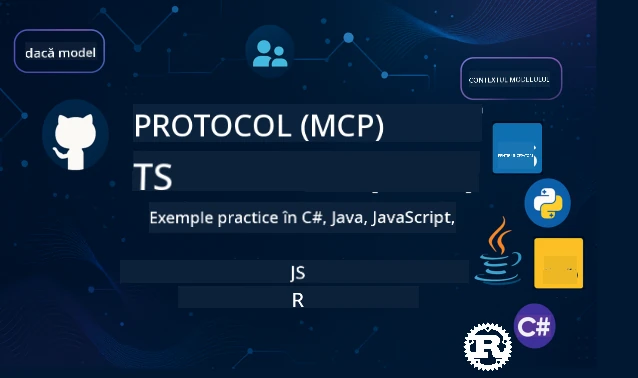

 

[](https://GitHub.com/microsoft/mcp-for-beginners/graphs/contributors)
[](https://GitHub.com/microsoft/mcp-for-beginners/issues)
[](https://GitHub.com/microsoft/mcp-for-beginners/pulls)
[](http://makeapullrequest.com)

[](https://GitHub.com/microsoft/mcp-for-beginners/watchers)
[](https://GitHub.com/microsoft/mcp-for-beginners/fork)
[](https://GitHub.com/microsoft/mcp-for-beginners/stargazers)


[](https://discord.gg/nTYy5BXMWG)

Urmează acești pași pentru a începe să folosești aceste resurse:
1. **Fă Fork la Repositoriu**: Click pe [](https://GitHub.com/microsoft/mcp-for-beginners/fork)
2. **Clonează Repositoriu**:   `git clone https://github.com/microsoft/mcp-for-beginners.git`
3. **Alătură-te** [](https://discord.gg/nTYy5BXMWG)


### 🌐 Suport Multilingv

#### Susținut prin GitHub Action (Automatizat & Întotdeauna Actualizat)

<!-- CO-OP TRANSLATOR LANGUAGES TABLE START -->
[Arabic](../ar/README.md) | [Bengali](../bn/README.md) | [Bulgarian](../bg/README.md) | [Burmese (Myanmar)](../my/README.md) | [Chinese (Simplified)](../zh-CN/README.md) | [Chinese (Traditional, Hong Kong)](../zh-HK/README.md) | [Chinese (Traditional, Macau)](../zh-MO/README.md) | [Chinese (Traditional, Taiwan)](../zh-TW/README.md) | [Croatian](../hr/README.md) | [Czech](../cs/README.md) | [Danish](../da/README.md) | [Dutch](../nl/README.md) | [Estonian](../et/README.md) | [Finnish](../fi/README.md) | [French](../fr/README.md) | [German](../de/README.md) | [Greek](../el/README.md) | [Hebrew](../he/README.md) | [Hindi](../hi/README.md) | [Hungarian](../hu/README.md) | [Indonesian](../id/README.md) | [Italian](../it/README.md) | [Japanese](../ja/README.md) | [Kannada](../kn/README.md) | [Korean](../ko/README.md) | [Lithuanian](../lt/README.md) | [Malay](../ms/README.md) | [Malayalam](../ml/README.md) | [Marathi](../mr/README.md) | [Nepali](../ne/README.md) | [Nigerian Pidgin](../pcm/README.md) | [Norwegian](../no/README.md) | [Persian (Farsi)](../fa/README.md) | [Polish](../pl/README.md) | [Portuguese (Brazil)](../pt-BR/README.md) | [Portuguese (Portugal)](../pt-PT/README.md) | [Punjabi (Gurmukhi)](../pa/README.md) | [Romanian](./README.md) | [Russian](../ru/README.md) | [Serbian (Cyrillic)](../sr/README.md) | [Slovak](../sk/README.md) | [Slovenian](../sl/README.md) | [Spanish](../es/README.md) | [Swahili](../sw/README.md) | [Swedish](../sv/README.md) | [Tagalog (Filipino)](../tl/README.md) | [Tamil](../ta/README.md) | [Telugu](../te/README.md) | [Thai](../th/README.md) | [Turkish](../tr/README.md) | [Ukrainian](../uk/README.md) | [Urdu](../ur/README.md) | [Vietnamese](../vi/README.md)

> **Preferi să clonezi local?**
>
> Acest repository include peste 50 de traduceri, ceea ce crește semnificativ dimensiunea descărcării. Pentru a clona fără traduceri, folosește sparse checkout:
>
> **Bash / macOS / Linux:**
> ```bash
> git clone --filter=blob:none --sparse https://github.com/microsoft/mcp-for-beginners.git
> cd mcp-for-beginners
> git sparse-checkout set --no-cone '/*' '!translations' '!translated_images'
> ```
>
> **CMD (Windows):**
> ```cmd
> git clone --filter=blob:none --sparse https://github.com/microsoft/mcp-for-beginners.git
> cd mcp-for-beginners
> git sparse-checkout set --no-cone "/*" "!translations" "!translated_images"
> ```
>
> Astfel primești tot ce ai nevoie pentru a finaliza cursul cu o descărcare mult mai rapidă.
<!-- CO-OP TRANSLATOR LANGUAGES TABLE END -->

# 🚀 Curriculumul Model Context Protocol (MCP) pentru Începători

## **Învață MCP cu Exemple Practice de Cod în C#, Java, JavaScript, Rust, Python și TypeScript**

## 🧠 Prezentare Generală a Curriculumului Model Context Protocol
Bine ai venit în călătoria ta în lumea Model Context Protocol! Dacă te-ai întrebat vreodată cum aplicațiile AI comunică cu diferite unelte și servicii, ești pe punctul de a descoperi soluția elegantă care transformă modul în care dezvoltatorii construiesc sisteme inteligente.

Gândește-te la MCP ca la un translator universal pentru aplicațiile AI - la fel cum porturile USB îți permit să conectezi orice dispozitiv la computer, MCP permite modelelor AI să se conecteze la orice unealtă sau serviciu într-un mod standardizat. Fie că construiești primul tău chatbot sau lucrezi la fluxuri de lucru AI complexe, înțelegerea MCP îți va oferi puterea de a crea aplicații mai capabile și flexibile.

Acest curriculum este proiectat cu răbdare și grijă pentru parcursul tău de învățare. Vom începe cu concepte simple pe care le cunoști deja și vom construi treptat expertiza ta prin practică aplicată în limbajul tău de programare preferat. Fiecare pas include explicații clare, exemple practice și multă încurajare pe parcurs.

Până când vei termina această călătorie, vei avea încrederea să construiești propriile servere MCP, să le integrezi cu platforme AI populare și să înțelegi cum această tehnologie redefinește viitorul dezvoltării AI. Hai să începem împreună această aventură captivantă!

### Documentație Oficială și Specificații

Acest curriculum este aliniat la **Specificația MCP 2025-11-25** (cea mai recentă versiune stabilă). Specificația MCP utilizează versionare bazată pe dată (format YYYY-MM-DD) pentru a asigura o urmărire clară a versiunilor protocolului.

Aceste resurse devin mai valoroase pe măsură ce înțelegerea ta crește, dar nu te simți presat să le parcurgi pe toate imediat. Începe cu ariile care te interesează cel mai mult!
- 📘 [Documentația MCP](https://modelcontextprotocol.io/) – Aceasta este resursa ta principală pentru tutoriale pas cu pas și ghiduri pentru utilizatori. Documentația este scrisă pentru începători, oferind exemple clare pe care le poți urma în ritmul tău.
- 📜 [Specificația MCP](https://modelcontextprotocol.io/specification/2025-11-25) – Gândește-te la asta ca la manualul tău de referință complet. Pe măsură ce parcurgi curriculumul, te vei întoarce aici pentru a căuta detalii specifice și a explora funcționalități avansate.
- 📜 [Versionarea Specificației MCP](https://modelcontextprotocol.io/specification/versioning) – Conține informații despre istoricul versiunilor protocolului și modul în care MCP folosește versionarea bazată pe dată (format YYYY-MM-DD).
- 🧑‍💻 [Repository MCP pe GitHub](https://github.com/modelcontextprotocol) – Aici vei găsi SDK-uri, unelte și exemple de cod în mai multe limbaje de programare. Este ca o comoară de exemple practice și componente gata de utilizat.
- 🌐 [Comunitatea MCP](https://github.com/orgs/modelcontextprotocol/discussions) – Alătură-te altor cursanți și dezvoltatori experimentați în discuții despre MCP. Este o comunitate sprijinitoare unde întrebările sunt binevenite și cunoștințele împărtășite liber.
  
## Obiective de Învățare

La finalul acestui curriculum, vei fi încrezător și entuziast în legătură cu noile tale abilități. Iată ce vei realiza:

• **Înțelegerea fundamentelor MCP**: Vei înțelege ce este Model Context Protocol și de ce revoluționează modul în care aplicațiile AI lucrează împreună, folosind analogii și exemple accesibile.

• **Construirea primului tău server MCP**: Vei crea un server MCP funcțional în limbajul tău de programare preferat, pornind de la exemple simple și dezvoltându-ți competențele pas cu pas.

• **Conectarea modelelor AI la unelte reale**: Vei învăța cum să creezi punți între modelele AI și servicii reale, oferindu-le aplicațiilor tale capacități noi și puternice.

• **Implementarea celor mai bune practici de securitate**: Vei înțelege cum să menții implementările MCP sigure, protejând atât aplicațiile, cât și utilizatorii tăi.

• **Dezvoltarea și lansarea cu încredere**: Vei ști cum să duci proiectele MCP de la dezvoltare la producție, cu strategii practice de implementare care funcționează în lumea reală.

• **Alăturarea comunității MCP**: Vei deveni parte dintr-o comunitate în creștere de dezvoltatori care modelează viitorul dezvoltării aplicațiilor AI.

## Fundamente Esențiale

Înainte să intrăm în detalii despre MCP, să ne asigurăm că te simți confortabil cu câteva concepte de bază. Nu te îngrijora dacă nu ești expert în aceste domenii - îți vom explica tot ce trebuie să știi pe parcurs!

### Înțelegerea Protocoalelor (Baza)

Gândește-te la un protocol ca la regulile pentru o conversație. Când suni un prieten, știți amândoi să spuneți „bună” când răspundeți, să vorbiți pe rând și să spuneți „la revedere” când terminați. Programele de calculator au nevoie de reguli similare pentru a comunica eficient.

MCP este un protocol - un set de reguli agreate care ajută modelele și aplicațiile AI să aibă „conversații” productive cu unelte și servicii. La fel cum regulile de conversație fac comunicarea umană mai ușoară, MCP face comunicarea aplicațiilor AI mult mai sigură și puternică.

### Relațiile Client-Server (Cum Lucrează Programele Împreună)

Folosești zilnic relațiile client-server! Când folosești un browser web (clientul) să vizitezi un site, te conectezi la un server web care îți trimite conținutul paginii. Browserul știe cum să ceară informații, iar serverul știe cum să răspundă.

În MCP, avem o relație similară: modelele AI sunt clienți care cer informații sau acțiuni, iar serverele MCP oferă aceste capabilități. E ca și cum ai avea un asistent de încredere (serverul) pe care AI îl poate ruga să execute sarcini specifice.

### De ce este importantă standardizarea (Făcând lucrurile să funcționeze împreună)

Imaginează-ți dacă fiecare producător de mașini ar folosi pompe de benzină cu forme diferite - ai avea nevoie de un adaptor diferit pentru fiecare mașină! Standardizarea înseamnă să convină asupra unor abordări comune, astfel încât lucrurile să funcționeze perfect împreună.

MCP oferă această standardizare pentru aplicațiile AI. În loc ca fiecare model AI să aibă cod personalizat pentru fiecare unealtă, MCP creează un mod universal de a comunica. Astfel, dezvoltatorii pot construi unelte o singură dată și să le facă să funcționeze cu multe sisteme AI diferite.

## 🧭 Prezentare Generală a Parcursului Tău de Învățare

Călătoria ta MCP este structurată cu grijă pentru a-ți crește încrederea și competențele progresiv. Fiecare etapă introduce concepte noi, consolidând în același timp ceea ce ai învățat deja.

### 🌱 Faza de Bază: Înțelegerea Elementelor Fundamentale (Modulele 0-2)

Aici începe aventura ta! Vom introduce concepte MCP folosind analogii familiare și exemple simple. Vei înțelege ce este MCP, de ce există și cum se integrează în lumea mai largă a dezvoltării AI.

• **Modulul 0 - Introducere în MCP**: Vom începe explorând ce este MCP și de ce este atât de important pentru aplicațiile AI moderne. Vei vedea exemple din lumea reală cu MCP în acțiune și vei înțelege cum rezolvă probleme comune cu care se confruntă dezvoltatorii.

• **Modulul 1 - Explicarea Conceptelor De Bază**: Aici vei învăța elementele esențiale ale MCP. Vom folosi multe analogii și exemple vizuale pentru a ne asigura că aceste concepte devin naturale și ușor de înțeles.

• **Modulul 2 - Securitatea în MCP**: Securitatea poate părea intimidantă, dar îți vom arăta cum MCP include funcții de siguranță integrate și îți vom preda cele mai bune practici care protejează aplicațiile încă de la început.

### 🔨 Faza de Construcție: Crearea Primelor Tale Implementări (Modulul 3)

Acum începe distracția reală! Vei avea experiență practică construind servere și clienți MCP reali. Nu te îngrijora - vom începe simplu și te vom ghida prin fiecare pas.
Acest modul include mai multe ghiduri practice care îți permit să exersezi în limbajul de programare preferat. Vei crea primul server, vei construi un client pentru a te conecta la acesta și chiar vei integra cu unelte populare de dezvoltare precum VS Code.

Fiecare ghid include exemple complete de cod, sfaturi pentru depanare și explicații privind motivele pentru care facem anumite alegeri de design. La sfârșitul acestei etape, vei avea implementări MCP funcționale de care să fii mândru!

### 🚀 Faza de creștere: Concepte avansate și aplicare în lumea reală (Modulele 4-5)

După ce ai stăpânit elementele de bază, ești gata să explorezi funcționalități MCP mai sofisticate. Vom aborda strategii practice de implementare, tehnici de depanare și subiecte avansate precum integrarea AI multimodală.

De asemenea, vei învăța cum să scalezi implementările MCP pentru utilizare în producție și cum să le integrezi cu platforme cloud precum Azure. Aceste module te pregătesc să construiești soluții MCP care să facă față cerințelor din lumea reală.

### 🌟 Faza de stăpânire: Comunitate și specializare (Modulele 6-11)

Faza finală se concentrează pe integrarea în comunitatea MCP și specializarea în domeniile care te interesează cel mai mult. Vei învăța cum să contribui la proiecte MCP open-source, să implementezi modele avansate de autentificare și să construiești soluții complete integrate cu baze de date.

Modulul 11 merită o mențiune specială - este un parcurs de învățare hands-on format din 13 laboratoare care te învață să construiești servere MCP pregătite pentru producție, cu integrare PostgreSQL. Este ca un proiect final care reunește tot ce ai învățat!

### 📚 Structura completă a curriculumului

| Modul | Subiect | Descriere | Link |
|--------|-------|-------------|------|
| **Module 0-3: Fundamente** | | | |
| 00 | Introducere în MCP | Prezentare generală a Model Context Protocol și importanța sa în pipeline-urile AI | [Citește mai mult](./00-Introducere/README.md) |
| 01 | Concepute de bază explicate | Explorare detaliată a conceptelor esențiale MCP | [Citește mai mult](./01-ConcepteDeBaza/README.md) |
| 02 | Securitate în MCP | Amenințări de securitate și bune practici | [Citește mai mult](./02-Securitate/README.md) |
| 03 | Primii pași cu MCP | Configurarea mediului, servere/cliței de bază, integrare | [Citește mai mult](./03-PrimiiPasi/README.md) |
| **Modul 3: Construirea primului tău server & client** | | | |
| 3.1 | Primul server | Creează primul tău server MCP | [Ghid](./03-PrimiiPasi/01-primul-server/README.md) |
| 3.2 | Primul client | Dezvoltă un client MCP de bază | [Ghid](./03-PrimiiPasi/02-client/README.md) |
| 3.3 | Client cu LLM | Integrează modele lingvistice mari | [Ghid](./03-PrimiiPasi/03-client-llm/README.md) |
| 3.4 | Integrare VS Code | Folosește servere MCP în VS Code | [Ghid](./03-PrimiiPasi/04-vscode/README.md) |
| 3.5 | Server stdio | Creează servere folosind transportul stdio | [Ghid](./03-PrimiiPasi/05-stdio-server/README.md) |
| 3.6 | Streaming HTTP | Implementează streaming HTTP în MCP | [Ghid](./03-PrimiiPasi/06-http-streaming/README.md) |
| 3.7 | AI Toolkit | Utilizează AI Toolkit cu MCP | [Ghid](./03-PrimiiPasi/07-aitk/README.md) |
| 3.8 | Testare | Testează implementarea serverului MCP | [Ghid](./03-PrimiiPasi/08-testare/README.md) |
| 3.9 | Deploy | Depune serverele MCP în producție | [Ghid](./03-PrimiiPasi/09-deployment/README.md) |
| 3.10 | Utilizarea avansată a serverului | Folosește servere avansate pentru caracteristici avansate și arhitectură îmbunătățită | [Ghid](./03-PrimiiPasi/10-avansat/README.md) |
| 3.11 | Autentificare simplă | Un capitol care îți arată autentificarea de la început și RBAC | [Ghid](./03-PrimiiPasi/11-autentificare-simpla/README.md) |
| 3.12 | Gazde MCP | Configurează Claude Desktop, Cursor, Cline și alte gazde MCP | [Ghid](./03-PrimiiPasi/12-gazde-mcp/README.md) |
| 3.13 | Inspector MCP | Depanează și testează serverele MCP cu uneltele Inspector | [Ghid](./03-PrimiiPasi/13-inspector-mcp/README.md) |
| 3.14 | Sampling | Folosește sampling pentru colaborare cu clientul | [Ghid](./03-PrimiiPasi/14-sampling/README.md) |
| 3.15 | Aplicații MCP | Construiește aplicații MCP | [Ghid](./03-PrimiiPasi/15-aplicatii-mcp/README.md) |
| **Module 4-5: Practic & Avansat** | | | |
| 04 | Implementare practică | SDK-uri, depanare, testare, șabloane reutilizabile pentru prompturi | [Citește mai mult](./04-ImplementarePractica/README.md) |
| 4.1 | Pagination | Gestionarea seturilor mari de rezultate cu paginare bazată pe cursor | [Ghid](./04-ImplementarePractica/paginare/README.md) |
| 05 | Subiecte avansate în MCP | AI multimodal, scalare, utilizare în mediul enterprise | [Citește mai mult](./05-SubiecteAvansate/README.md) |
| 5.1 | Integrare Azure | Integrarea MCP cu Azure | [Ghid](./05-SubiecteAvansate/integrari-mcp-azure/README.md) |
| 5.2 | Multi-modalitate | Lucrul cu multiple modalități | [Ghid](./05-SubiecteAvansate/multi-modalitate/README.md) |
| 5.3 | Demo OAuth2 | Implementarea autentificării OAuth2 | [Ghid](./05-SubiecteAvansate/oauth2-demo/README.md) |
| 5.4 | Contexturi root | Înțelegerea și implementarea contextelor root | [Ghid](./05-SubiecteAvansate/contexturi-root/README.md) |
| 5.5 | Rutare | Strategii de rutare MCP | [Ghid](./05-SubiecteAvansate/rutare-mcp/README.md) |
| 5.6 | Sampling | Tehnici de sampling în MCP | [Ghid](./05-SubiecteAvansate/sampling/README.md) |
| 5.7 | Scalare | Scalează implementările MCP | [Ghid](./05-SubiecteAvansate/scalare/README.md) |
| 5.8 | Securitate | Considerații avansate de securitate | [Ghid](./05-SubiecteAvansate/securitate-avansata/README.md) |
| 5.9 | Căutare web | Implementează funcționalități de căutare web | [Ghid](./05-SubiecteAvansate/cautare-web-mcp/README.md) |
| 5.10 | Streaming în timp real | Construiește funcționalități de streaming în timp real | [Ghid](./05-SubiecteAvansate/streaming-timp-real/README.md) |
| 5.11 | Căutare în timp real | Implementează căutare în timp real | [Ghid](./05-SubiecteAvansate/cautare-timp-real/README.md) |
| 5.12 | Autentificare Entra ID | Autentificare cu Microsoft Entra ID | [Ghid](./05-SubiecteAvansate/autentificare-entra/README.md) |
| 5.13 | Integrare Foundry | Integrează cu Azure AI Foundry | [Ghid](./05-SubiecteAvansate/integrare-foundry-agent/README.md) |
| 5.14 | Inginerie de context | Tehnici pentru ingineria eficientă de context | [Ghid](./05-SubiecteAvansate/inginerie-context/README.md) |
| 5.15 | Transport personalizat MCP | Implementări de transport personalizate | [Ghid](./05-SubiecteAvansate/transport-personalizat/README.md) |
| 5.16 | Funcții protocol | Notificări de progres, anulare, șabloane de resurse | [Ghid](./05-SubiecteAvansate/functionalitati-protocol/README.md) |
| **Module 6-10: Comunitate & Bune Practici** | | | |
| 06 | Contribuții comunitare | Cum să contribui la ecosistemul MCP | [Ghid](./06-ContributiiComunitare/README.md) |
| 07 | Lecții din adopție timpurie | Povești de implementare din lumea reală | [Ghid](./07-LectiiDinAdoptie/README.md) |
| 08 | Bune practici pentru MCP | Performanță, toleranță la erori, reziliență | [Ghid](./08-BunePractici/README.md) |
| 09 | Studii de caz MCP | Exemple practice de implementare | [Ghid](./09-StudiiDeCaz/README.md) |
| 10 | Atelier practic | Construirea unui server MCP cu AI Toolkit | [Laborator](./10-FluxuriAIOptimizateConstruireaUnuiServerMCP/README.md) |
| **Modul 11: Laborator practic server MCP** | | | |
| 11 | Integrare bază de date server MCP | Parcurs practic complet de 13 laboratoare pentru integrarea cu PostgreSQL | [Laboratoare](./11-LaboratoareServerMCP/README.md) |
| 11.1 | Introducere | Prezentare generală MCP cu integrare bază de date și caz de utilizare analiză retail | [Laborator 00](./11-LaboratoareServerMCP/00-Introducere/README.md) |
| 11.2 | Arhitectură de bază | Înțelegerea arhitecturii serverului MCP, niveluri baze de date și modele de securitate | [Laborator 01](./11-LaboratoareServerMCP/01-Arhitectura/README.md) |
| 11.3 | Securitate & Multi-tenant | Securitate la nivel de rând, autentificare și acces multi-chiriaș | [Laborator 02](./11-LaboratoareServerMCP/02-Securitate/README.md) |
| 11.4 | Configurare mediu | Configurarea mediului de dezvoltare, Docker, resurse Azure | [Laborator 03](./11-LaboratoareServerMCP/03-Configurare/README.md) |
| 11.5 | Design bază de date | Configurare PostgreSQL, proiectare schemă retail și date exemple | [Laborator 04](./11-LaboratoareServerMCP/04-BazaDeDate/README.md) |
| 11.6 | Implementare server MCP | Construirea serverului FastMCP cu integrare bază de date | [Laborator 05](./11-LaboratoareServerMCP/05-ServerMCP/README.md) |
| 11.7 | Dezvoltare unelte | Crearea uneltelor pentru interogare bază de date și introspecție schemă | [Laborator 06](./11-LaboratoareServerMCP/06-Unelte/README.md) |
| 11.8 | Căutare semantică | Implementarea vector embeddings cu Azure OpenAI și pgvector | [Laborator 07](./11-LaboratoareServerMCP/07-CautareSemantica/README.md) |
| 11.9 | Testare & depanare | Strategii de testare, unelte de depanare și metode de validare | [Laborator 08](./11-LaboratoareServerMCP/08-Testare/README.md) |
| 11.10 | Integrare VS Code | Configurarea integrării MCP în VS Code și utilizarea AI Chat | [Laborator 09](./11-LaboratoareServerMCP/09-VSCode/README.md) |
| 11.11 | Strategii de deploy | Deploy Docker, Azure Container Apps și considerații de scalare | [Laborator 10](./11-LaboratoareServerMCP/10-Deploy/README.md) |
| 11.12 | Monitorizare | Application Insights, logging, monitorizare performanță | [Laborator 11](./11-LaboratoareServerMCP/11-Monitorizare/README.md) |
| 11.13 | Bune practici | Optimizare performanță, întărirea securității și sfaturi pentru producție | [Laborator 12](./11-LaboratoareServerMCP/12-BunePractici/README.md) |

### 💻 Proiecte de cod exemplu

Una dintre cele mai interesante părți ale învățării MCP este să-ți vezi abilitățile de codare dezvoltându-se progresiv. Am proiectat exemplele noastre de cod să înceapă simplu și să devină tot mai sofisticate pe măsură ce înțelegerea ta se adâncește. Iată cum introducem conceptele - cu cod ușor de înțeles dar care demonstrează principii reale MCP, vei înțelege nu doar ce face acest cod, ci și de ce este structurat astfel și cum se potrivește în aplicații MCP mai mari.

#### Exemple de bază MCP Calculator

| Limbaj | Descriere | Link |
|----------|-------------|------|
| C# | Exemplu server MCP | [Vezi cod](./03-PrimiiPasi/exemple/csharp/README.md) |
| Java | Calculator MCP | [Vezi cod](./03-PrimiiPasi/exemple/java/calculator/README.md) |
| JavaScript | Demo MCP | [Vezi cod](./03-PrimiiPasi/exemple/javascript/README.md) |
| Python | Server MCP | [Vezi cod](../../03-PrimiiPasi/exemple/python/mcp_calculator_server.py) |
| TypeScript | Exemplu MCP | [Vezi cod](./03-PrimiiPasi/exemple/typescript/README.md) |
| Rust | Exemplu MCP | [Vezi cod](./03-PrimiiPasi/exemple/rust/README.md) |

#### Implementări MCP avansate

| Limbaj | Descriere | Link |
|----------|-------------|------|
| C# | Exemplu avansat | [Vezi cod](./04-ImplementarePractica/exemple/csharp/README.md) |
| Java cu Spring | Exemplu Container App | [Vezi cod](./04-ImplementarePractica/exemple/java/containerapp/README.md) |
| JavaScript | Exemplu avansat | [Vezi cod](./04-ImplementarePractica/exemple/javascript/README.md) |
| Python | Implementare complexă | [Vezi cod](./04-ImplementarePractica/exemple/python/README.md) |
| TypeScript | Exemplu Container | [Vezi cod](./04-ImplementarePractica/exemple/typescript/README.md) |


## 🎯 Precondiții pentru a învăța MCP

Pentru a beneficia la maxim de acest curriculum, ar trebui să ai:
- Cunoștințe de bază în programare într-una dintre următoarele limbi: C#, Java, JavaScript, Python sau TypeScript  
- Înțelegerea modelului client-server și a API-urilor  
- Familiaritate cu conceptele REST și HTTP  
- (Opțional) Cunoștințe de bază în concepte AI/ML  

- Participarea la discuțiile comunității noastre pentru suport  

## 📚 Ghid de studiu și resurse

Acest depozit include mai multe resurse care vă ajută să navigați și să învățați eficient:

### Ghid de studiu

Un [Ghid de studiu](./study_guide.md) cuprinzător este disponibil pentru a vă ajuta să navigați eficient în acest depozit. Această hartă curriculară vizuală arată cum toate subiectele sunt conectate și oferă îndrumări despre cum să folosiți eficient proiectele exemplu. Este deosebit de util dacă sunteți un învățăcel vizual care dorește să vadă imaginea de ansamblu.

Ghidul include:  
- O hartă curriculară vizuală care arată toate subiectele acoperite  
- Defalcarea detaliată a fiecărei secțiuni a depozitului  
- Îndrumări despre cum să utilizați proiectele exemplu  
- Căi de învățare recomandate pentru diferite niveluri de cunoștințe  
- Resurse suplimentare care completează parcursul dumneavoastră de învățare  

### Istoric modificări

Mentin un detaliat [Istoric modificări](./changelog.md) care urmărește toate actualizările semnificative ale materialelor curriculumului, astfel încât să puteți rămâne la curent cu cele mai recente îmbunătățiri și adăugiri.  
- Adăugiri de conținut nou  
- Schimbări structurale  
- Îmbunătățiri de funcționalitate  
- Actualizări documentație  

## 🛠️ Cum să folosiți acest curriculum eficient

Fiecare lecție din acest ghid include:  

1. Explicații clare ale conceptelor MCP  
2. Exemple de cod live în mai multe limbaje  
3. Exerciții pentru a construi aplicații reale MCP  
4. Resurse suplimentare pentru învățăcei avansați  

### Haideți să învățăm MCP cu C# - Seria de tutoriale  
Hai să explorăm Model Context Protocol (MCP), un cadru de ultimă generație destinat să standardizeze interacțiunile dintre modelele AI și aplicațiile client. Prin această sesiune prietenoasă pentru începători, vă vom introduce MCP și vă vom ghida prin crearea primului server MCP.  
#### C#: [https://aka.ms/letslearnmcp-csharp](https://aka.ms/letslearnmcp-csharp)  
#### Java: [https://aka.ms/letslearnmcp-java](https://aka.ms/letslearnmcp-java)  
#### JavaScript: [https://aka.ms/letslearnmcp-javascript](https://aka.ms/letslearnmcp-javascript)  
#### Python: [https://aka.ms/letslearnmcp-python](https://aka.ms/letslearnmcp-python)  

## 🎓 Călătoria ta MCP începe

Felicitări! Tocmai ați făcut primul pas într-o călătorie captivantă ce vă va extinde abilitățile de programare și vă va conecta la vârful dezvoltării AI.

### Ce ați realizat deja

Parcurgând această introducere, ați început deja să vă construiți fundamentul de cunoștințe despre MCP. Înțelegeți ce este MCP, de ce este important și cum acest curriculum vă va susține parcursul de învățare. Este o realizare importantă și începutul expertizei dumneavoastră în această tehnologie esențială.

### Aventură ce urmează

Pe măsură ce avansați prin module, amintiți-vă că fiecare expert a fost odată începător. Conceptele care acum par complexe vor deveni un al doilea natură pe măsură ce exersați și le aplicați. Fiecare pas mic construiește capabilități puternice care vă vor servi pe parcursul întregii cariere în dezvoltare.

### Rețeaua ta de suport

Te alături unei comunități de învățăcei și experți pasionați de MCP și dornici să ajute alți membri să reușească. Indiferent dacă întâmpini o provocare de codare sau ești entuziasmat să împărtășești o descoperire, comunitatea este aici să te susțină.

Dacă te încurci sau ai întrebări despre construirea aplicațiilor AI, alătură-te discuțiilor cu alți învățăcei și dezvoltatori experimentați despre MCP. Este o comunitate suportivă unde întrebările sunt binevenite și cunoștințele sunt împărtășite liber.

[](https://discord.gg/nTYy5BXMWG)

Dacă ai feedback despre produs sau întâmpini erori pe parcurs, vizitează:  

[](https://aka.ms/foundry/forum)  

### Gata să începi?

Aventura ta MCP începe acum! Începe cu Modulul 0 pentru a te cufunda în primele tale experiențe practice MCP sau explorează proiectele exemplu pentru a vedea ce vei construi. Amintește-ți - fiecare expert a început exact de unde ești tu acum, iar cu răbdare și practică vei fi uimit de ceea ce poți realiza.

Bine ai venit în lumea dezvoltării Model Context Protocol. Să construim ceva uimitor împreună!

## 🤝 Contribuția în comunitatea de învățare

Acest curriculum devine mai puternic prin contribuțiile învățăceilor ca tine! Fie că corectezi o greșeală de tipar, sugerezi o explicație mai clară sau adaugi un exemplu nou, contribuțiile tale ajută alți începători să reușească.

Mulțumiri Microsoft Valued Professional [Shivam Goyal](https://www.linkedin.com/in/shivam2003/) pentru că a contribuit cu exemple de cod.

Procesul de contribuție este conceput pentru a fi primitor și suportiv. Majoritatea contribuțiilor necesită un Acord de Licențiere a Contribuției (CLA), dar instrumentele automate te vor ghida ușor prin proces.

## 📜 Învățare Open Source

Întregul acest curriculum este disponibil sub licența MIT [LICENSE](../../LICENSE), ceea ce înseamnă că îl puteți folosi, modifica și partaja liber. Acest lucru susține misiunea noastră de a face accesibilă cunoașterea MCP dezvoltatorilor de pretutindeni.

## 🤝 Ghid de contribuție

Acest proiect primește cu brațele deschise contribuții și sugestii. Majoritatea contribuțiilor necesită să fiți de acord cu un  
Acord de Licențiere a Contribuției (CLA) prin care declarați că aveți dreptul și efectiv ne acordați  
drepturile de utilizare a contribuției dvs. Pentru detalii, vizitați <https://cla.opensource.microsoft.com>.

La trimiterea unui pull request, un bot CLA va determina automat dacă trebuie să furnizați un CLA și va marca PR-ul corespunzător (ex. verificare status, comentariu). Doar urmați instrucțiunile oferite de bot. Va trebui să faceți acest lucru o singură dată pentru toate depozitele care folosesc CLA-ul nostru.

Acest proiect a adoptat [Codul de conduită Open Source Microsoft](https://opensource.microsoft.com/codeofconduct/).  
Pentru mai multe informații, consultați [FAQ Codul de conduită](https://opensource.microsoft.com/codeofconduct/faq/) sau contactați [opencode@microsoft.com](mailto:opencode@microsoft.com) pentru întrebări sau comentarii suplimentare.

---

*Gata să începi călătoria MCP? Începe cu [Modulul 00 - Introducere în MCP](./00-Introduction/README.md) și faceți primii pași în lumea dezvoltării Model Context Protocol!*


## 🎒 Alte cursuri  
Echipa noastră produce și alte cursuri! Vezi:

<!-- CO-OP TRANSLATOR OTHER COURSES START -->
### LangChain  
[](https://aka.ms/langchain4j-for-beginners)  
[](https://aka.ms/langchainjs-for-beginners?WT.mc_id=m365-94501-dwahlin)  
[](https://github.com/microsoft/langchain-for-beginners?WT.mc_id=m365-94501-dwahlin)  
---

### Azure / Edge / MCP / Agenți  
[](https://github.com/microsoft/AZD-for-beginners?WT.mc_id=academic-105485-koreyst)  
[](https://github.com/microsoft/edgeai-for-beginners?WT.mc_id=academic-105485-koreyst)  
[](https://github.com/microsoft/mcp-for-beginners?WT.mc_id=academic-105485-koreyst)  
[](https://github.com/microsoft/ai-agents-for-beginners?WT.mc_id=academic-105485-koreyst)  

---

### Seria Generative AI  
[](https://github.com/microsoft/generative-ai-for-beginners?WT.mc_id=academic-105485-koreyst)  
[-9333EA?style=for-the-badge&labelColor=E5E7EB&color=9333EA)](https://github.com/microsoft/Generative-AI-for-beginners-dotnet?WT.mc_id=academic-105485-koreyst)  
[-C084FC?style=for-the-badge&labelColor=E5E7EB&color=C084FC)](https://github.com/microsoft/generative-ai-for-beginners-java?WT.mc_id=academic-105485-koreyst)  
[-E879F9?style=for-the-badge&labelColor=E5E7EB&color=E879F9)](https://github.com/microsoft/generative-ai-with-javascript?WT.mc_id=academic-105485-koreyst)  

---

### Învățare de bază  
[](https://aka.ms/ml-beginners?WT.mc_id=academic-105485-koreyst)  
[](https://aka.ms/datascience-beginners?WT.mc_id=academic-105485-koreyst)  
[](https://aka.ms/ai-beginners?WT.mc_id=academic-105485-koreyst)  
[](https://github.com/microsoft/Security-101?WT.mc_id=academic-96948-sayoung)  
[](https://aka.ms/webdev-beginners?WT.mc_id=academic-105485-koreyst)  
[](https://aka.ms/iot-beginners?WT.mc_id=academic-105485-koreyst)  
[](https://github.com/microsoft/xr-development-for-beginners?WT.mc_id=academic-105485-koreyst)  

---

### Seria Copilot
[](https://aka.ms/GitHubCopilotAI?WT.mc_id=academic-105485-koreyst)
[](https://github.com/microsoft/mastering-github-copilot-for-dotnet-csharp-developers?WT.mc_id=academic-105485-koreyst)
[](https://github.com/microsoft/CopilotAdventures?WT.mc_id=academic-105485-koreyst)
<!-- CO-OP TRANSLATOR OTHER COURSES END -->

---

<!-- CO-OP TRANSLATOR DISCLAIMER START -->
**Declinarea responsabilității**:  
Acest document a fost tradus folosind serviciul de traducere AI [Co-op Translator](https://github.com/Azure/co-op-translator). Deși ne străduim pentru acuratețe, vă rugăm să rețineți că traducerile automate pot conține erori sau inexactități. Documentul original, în limba sa nativă, trebuie considerat sursa autorizată. Pentru informații esențiale, se recomandă traducerea profesională realizată de un specialist uman. Nu ne asumăm responsabilitatea pentru eventualele neînțelegeri sau interpretări greșite rezultând din utilizarea acestei traduceri.
<!-- CO-OP TRANSLATOR DISCLAIMER END -->