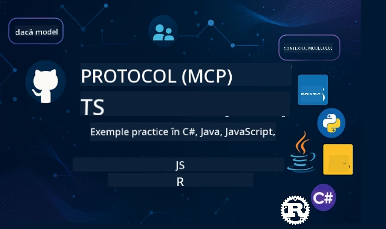

 

[](https://GitHub.com/microsoft/mcp-for-beginners/graphs/contributors)
[](https://GitHub.com/microsoft/mcp-for-beginners/issues)
[](https://GitHub.com/microsoft/mcp-for-beginners/pulls)
[](http://makeapullrequest.com)
[](https://mcptoplist.com/server/mcp.so%2Fmcp-for-beginners%2Fmicrosoft)

[](https://GitHub.com/microsoft/mcp-for-beginners/watchers)
[](https://GitHub.com/microsoft/mcp-for-beginners/fork)
[](https://GitHub.com/microsoft/mcp-for-beginners/stargazers)


[](https://discord.gg/nTYy5BXMWG)

Urmați acești pași pentru a începe să folosiți aceste resurse:
1. **Forkați Repozitoriul**: Faceți clic pe [](https://GitHub.com/microsoft/mcp-for-beginners/fork)
2. **Clonați Repozitoriul**:   `git clone https://github.com/microsoft/mcp-for-beginners.git`
3. **Alăturați-vă** [](https://discord.gg/nTYy5BXMWG)


### 🌐 Suport Multi-Limbaj

#### Suportat prin GitHub Action (Automatizat și Întotdeauna Actualizat)

<!-- CO-OP TRANSLATOR LANGUAGES TABLE START -->
[Arabă](../ar/README.md) | [Bengali](../bn/README.md) | [Bulgară](../bg/README.md) | [Burmese (Myanmar)](../my/README.md) | [Chineză (Simplificată)](../zh-CN/README.md) | [Chineză (Tradițională, Hong Kong)](../zh-HK/README.md) | [Chineză (Tradițională, Macau)](../zh-MO/README.md) | [Chineză (Tradițională, Taiwan)](../zh-TW/README.md) | [Croată](../hr/README.md) | [Cehă](../cs/README.md) | [Daneză](../da/README.md) | [Olandeză](../nl/README.md) | [Estoniană](../et/README.md) | [Finlandeză](../fi/README.md) | [Franceză](../fr/README.md) | [Germană](../de/README.md) | [Greacă](../el/README.md) | [Ebraică](../he/README.md) | [Hindi](../hi/README.md) | [Maghiară](../hu/README.md) | [Indoneziană](../id/README.md) | [Italiană](../it/README.md) | [Japoneză](../ja/README.md) | [Kannada](../kn/README.md) | [Khmer](../km/README.md) | [Coreeană](../ko/README.md) | [Lituaniană](../lt/README.md) | [Malay](../ms/README.md) | [Malayalam](../ml/README.md) | [Marathi](../mr/README.md) | [Nepaleză](../ne/README.md) | [Pidgin Nigeriana](../pcm/README.md) | [Norvegiană](../no/README.md) | [Persană (Farsi)](../fa/README.md) | [Poloneză](../pl/README.md) | [Portugheză (Brazilia)](../pt-BR/README.md) | [Portugheză (Portugal)](../pt-PT/README.md) | [Punjabi (Gurmukhi)](../pa/README.md) | [Română](./README.md) | [Rusă](../ru/README.md) | [Sârbă (Chirilic)](../sr/README.md) | [Slovacă](../sk/README.md) | [Slovenă](../sl/README.md) | [Spaniolă](../es/README.md) | [Swahili](../sw/README.md) | [Suedeză](../sv/README.md) | [Tagalog (Filipino)](../tl/README.md) | [Tamil](../ta/README.md) | [Telugu](../te/README.md) | [Thai](../th/README.md) | [Turcă](../tr/README.md) | [Ucraineană](../uk/README.md) | [Urdu](../ur/README.md) | [Vietnameză](../vi/README.md)

> **Preferi să clonezi local?**
>
> Acest depozit include peste 50 de traduceri de limbi care cresc semnificativ dimensiunea descărcării. Pentru a clona fără traduceri, folosește sparse checkout:
>
> **Bash / macOS / Linux:**
> ```bash
> git clone --filter=blob:none --sparse https://github.com/microsoft/mcp-for-beginners.git
> cd mcp-for-beginners
> git sparse-checkout set --no-cone '/*' '!translations' '!translated_images'
> ```
>
> **CMD (Windows):**
> ```cmd
> git clone --filter=blob:none --sparse https://github.com/microsoft/mcp-for-beginners.git
> cd mcp-for-beginners
> git sparse-checkout set --no-cone "/*" "!translations" "!translated_images"
> ```
>
> Acest lucru vă oferă tot ce aveți nevoie pentru a finaliza cursul cu o descărcare mult mai rapidă.
<!-- CO-OP TRANSLATOR LANGUAGES TABLE END -->

# 🚀 Curriculumul Model Context Protocol (MCP) pentru Începători

## **Învață MCP cu Exemple Practice de Cod în C#, Java, JavaScript, Rust, Python și TypeScript**

## 🧠 Prezentare Generală a Curriculumului Model Context Protocol
Bine ați venit în călătoria dvs. în Model Context Protocol! Dacă v-ați întrebat vreodată cum comunică aplicațiile AI cu diferite instrumente și servicii, sunteți pe cale să descoperiți soluția elegantă care transformă modul în care dezvoltatorii construiesc sisteme inteligente.

Gândiți-vă la MCP ca la un traducător universal pentru aplicațiile AI - la fel cum porturile USB permit conectarea oricărui dispozitiv la computerul dvs., MCP permite modelelor AI să se conecteze la orice instrument sau serviciu într-un mod standardizat. Fie că construiți primul chatbot sau lucrați la fluxuri complexe AI, înțelegerea MCP vă va oferi puterea de a crea aplicații mai capabile și flexibile.

Acest curriculum este conceput cu răbdare și grijă pentru călătoria dvs. de învățare. Vom începe cu concepte simple pe care le înțelegeți deja și vom construi treptat expertiza dvs. prin practică hands-on în limbajul dvs. de programare preferat. Fiecare pas include explicații clare, exemple practice și multă încurajare pe parcurs.

Până să terminați această călătorie, veți avea încrederea să construiți propriile servere MCP, să le integrați cu platforme AI populare și să înțelegeți cum această tehnologie schimbă viitorul dezvoltării AI. Haideți să începem această aventură captivantă împreună!

### Documentație Oficială și Specificații

Acest curriculum este aliniat cu **Specificația MCP 2025-11-25** (ultima versiune stabilă). Specificația MCP folosește versiuni bazate pe dată (format YYYY-MM-DD) pentru a asigura o urmărire clară a versiunii protocolului.

> **Privind înainte:** un candidat pentru lansarea următoarei versiuni a specificației, **2026-07-28**, este programat să fie lansat pe 28 iulie 2026. Acesta face protocolul stateless la nivel de transport, formalizează un cadru de Extensii (Aplicații MCP, Sarcini), întărește autorizarea și depreciază Roots, Sampling și Logging. Vezi [Ce se schimbă în MCP: Candidatul pentru lansarea din 2026-07-28](./01-CoreConcepts/mcp-2026-07-28-release-candidate.md) pentru o descriere completă.

Aceste resurse devin mai valoroase pe măsură ce înțelegerea dvs. crește, dar nu vă simțiți presat să le citiți pe toate imediat. Începeți cu zonele care vă interesează cel mai mult!
- 📘 [Documentația MCP](https://modelcontextprotocol.io/) – Aceasta este resursa dvs. principală pentru tutoriale pas cu pas și ghiduri de utilizare. Documentația este scrisă având în vedere începătorii, oferind exemple clare pe care le puteți urma în ritmul propriu.
- 📜 [Specificația MCP](https://modelcontextprotocol.io/specification/2025-11-25) – Gândiți-vă la aceasta ca la manualul dvs. de referință cuprinzător. Pe măsură ce parcurgeți curriculumul, veți reveni aici pentru a căuta detalii specifice și a explora funcții avansate.
- 📜 [Versiunea Specificației MCP](https://modelcontextprotocol.io/specification/versioning) – Aceasta conține informații despre istoricul versiunilor protocolului și cum MCP folosește versiuni bazate pe dată (format YYYY-MM-DD).
- 🧑‍💻 [Repozitoriul GitHub MCP](https://github.com/modelcontextprotocol) – Aici veți găsi SDK-uri, unelte și exemple de cod în mai multe limbaje de programare. Este ca o comoară de exemple practice și componente gata de utilizat.
- 🌐 [Comunitatea MCP](https://github.com/orgs/modelcontextprotocol/discussions) – Alăturați-vă colegilor învățăcei și dezvoltatorilor cu experiență în discuții despre MCP. Este o comunitate de sprijin unde întrebările sunt binevenite și cunoștințele sunt împărtășite liber.
  
## Obiective de Învățare

Până la sfârșitul acestui curriculum, vă veți simți încrezător și entuziasmat de noile abilități. Iată ce veți realiza:

• **Înțelegeți fundamentele MCP**: Veți înțelege ce este Model Context Protocol și de ce revoluționează modul în care aplicațiile AI lucrează împreună, folosind analogii și exemple clare.

• **Construiți primul dvs. server MCP**: Veți crea un server MCP funcțional în limbajul de programare preferat, începând cu exemple simple și dezvoltându-vă abilitățile pas cu pas.

• **Conectați modelele AI la instrumente reale**: Veți învăța cum să faceți legătura dintre modelele AI și serviciile reale, oferind aplicațiilor dvs. capacități puternice noi.

• **Implementați cele mai bune practici de securitate**: Veți înțelege cum să păstrați implementările MCP sigure, protejând atât aplicațiile, cât și utilizatorii.

• **Deplasați cu încredere**: Veți ști cum să duceți proiectele MCP de la dezvoltare la producție, cu strategii practice de implementare care funcționează în lumea reală.

• **Alăturați-vă comunității MCP**: Veți deveni parte dintr-o comunitate în creștere de dezvoltatori care modelează viitorul dezvoltării aplicațiilor AI.

## Fundal Esențial

Înainte să ne adâncim în specificul MCP, să ne asigurăm că vă simțiți comod cu câteva concepte fundamentale. Nu vă faceți griji dacă nu sunteți expert în aceste domenii - vom explica tot ce aveți nevoie pe parcurs!

### Înțelegerea Protocolor (Fundația)

Gândiți-vă la un protocol ca la regulile unui dialog. Când sunați un prieten, amândoi știți să spuneți "bună" când răspundeți, să vorbiți pe rând și să spuneți "la revedere" când ați terminat. Programele de calculator au nevoie de reguli similare pentru a comunica eficient.

MCP este un protocol - un set de reguli agreate care ajută modelele AI și aplicațiile să aibă "conversații" productive cu unelte și servicii. La fel cum regulile de conversație fac comunicarea umană mai lină, MCP face comunicarea aplicațiilor AI mult mai fiabilă și puternică.

### Relații Client-Server (Cum Colaborează Programele)

Folosiți deja relații client-server în fiecare zi! Când folosiți un browser web (clientul) pentru a vizita un site, vă conectați la un server web care vă trimite conținutul paginii. Browserul știe cum să ceară informații, iar serverul știe cum să răspundă.

În MCP, avem o relație similară: modelele AI acționează ca clienți care cer informații sau acțiuni, în timp ce serverele MCP oferă acele capabilități. E ca și cum ar exista un asistent util (serverul) pe care AI-ul îl poate ruga să execute sarcini specifice.

### De ce contează standardizarea (Făcând lucrurile să funcționeze împreună)

Imaginați-vă dacă fiecare producător de mașini ar folosi pompe de benzină cu forme diferite - ați avea nevoie de un adaptor diferit pentru fiecare mașină! Standardizarea înseamnă a cădea de acord asupra unor abordări comune astfel încât lucrurile să funcționeze împreună fără probleme.

MCP oferă această standardizare pentru aplicațiile AI. În loc ca fiecare model AI să aibă nevoie de cod personalizat pentru a funcționa cu fiecare instrument, MCP creează o cale universală pentru comunicare. Acest lucru înseamnă că dezvoltatorii pot construi instrumente o singură dată și vor funcționa cu multe sisteme AI diferite.

## 🧭 Prezentarea Căii Dvs. de Învățare

Călătoria dvs. MCP este structurată cu grijă pentru a vă construi încrederea și abilitățile progresiv. Fiecare fază introduce concepte noi și întărește ceea ce ați învățat deja.

### 🌱 Faza de Bază: Înțelegerea Elementelor Fundamentale (Modulele 0-2)

Aici începe aventura dvs.! Vom introduce conceptele MCP folosind analogii familiare și exemple simple. Veți înțelege ce este MCP, de ce există și cum se încadrează în lumea mai largă a dezvoltării AI.


• **Modulul 0 - Introducere în MCP**: Vom începe explorând ce este MCP și de ce este atât de important pentru aplicațiile AI moderne. Vei vedea exemple reale de MCP în acțiune și vei înțelege cum rezolvă probleme comune cu care se confruntă dezvoltatorii.

• **Modulul 1 - Concepte de bază explicate**: Aici vei învăța elementele esențiale ale MCP. Vom folosi numeroase analogii și exemple vizuale pentru a ne asigura că aceste concepte sunt naturale și ușor de înțeles.

• **Modulul 2 - Securitatea în MCP**: Securitatea poate părea intimidantă, dar îți vom arăta cum MCP include funcții de siguranță integrate și îți vom preda cele mai bune practici care protejează aplicațiile tale de la început.

### 🔨 Faza de construire: Crearea primelor tale implementări (Modulul 3)

Acum începe distracția adevărată! Vei dobândi experiență practică construind servere și clienți MCP reali. Nu te îngrijora - vom începe simplu și te vom ghida în fiecare pas.

Acest modul include mai multe ghiduri practice care îți permit să exersezi în limbajul de programare preferat. Vei crea primul tău server, vei construi un client care să se conecteze la acesta și chiar vei integra cu unelte populare de dezvoltare precum VS Code.

Fiecare ghid include exemple complete de cod, sfaturi pentru depanare și explicații despre motivele pentru care luăm anumite decizii de proiectare. La finalul acestei faze, vei avea implementări MCP funcționale de care să fii mândru!

### 🚀 Faza de creștere: Concepte avansate și aplicații din lumea reală (Modulele 4-5)

După ce ai stăpânit bazele, ești pregătit să explorezi funcții MCP mai sofisticate. Vom acoperi strategii practice de implementare, tehnici de depanare și subiecte avansate, cum ar fi integrarea AI multi-modală.

De asemenea, vei învăța cum să scalezi implementările MCP pentru utilizare în producție și cum să integrezi cu platforme cloud precum Azure. Aceste module te pregătesc să construiești soluții MCP capabile să facă față cerințelor din lumea reală.

### 🌟 Faza de măiestrie: Comunitate și specializare (Modulele 6-11)

Ultima fază se concentrează pe aderarea la comunitatea MCP și specializarea în domenii care te interesează cel mai mult. Vei învăța cum să contribui la proiecte open-source MCP, să implementezi modele avansate de autentificare și să construiești soluții cu integrare completă în baze de date.

Modulul 11 merită o mențiune specială - este un traseu complet de învățare cu 13 laboratoare practice care te învață să construiești servere MCP gata pentru producție, cu integrare PostgreSQL. Este ca un proiect final care leagă tot ce ai învățat!

### 📚 Structura completă a curriculumului

| Modul | Subiect | Descriere | Link |
|--------|-------|-------------|------|
| **Modulele 0-3: Fundamente** | | | |
| 00 | Introducere în MCP | Prezentare generală a Model Context Protocol și importanța sa în pipeline-urile AI | [Citește mai mult](./00-Introduction/README.md) |
| 01 | Concepte de bază explicate | Explorare detaliată a conceptelor de bază MCP | [Citește mai mult](./01-CoreConcepts/README.md) |
| 1.1 | Ce se schimbă în MCP (2026-07-28 RC) | Protocol stateless, framework pentru extensii și dezafectări de funcționalități în următoarea versiune a specificației | [Ghid](./01-CoreConcepts/mcp-2026-07-28-release-candidate.md) |
| 02 | Securitatea în MCP | Amenințări de securitate și cele mai bune practici | [Citește mai mult](./02-Security/README.md) |
| 03 | Început cu MCP | Configurarea mediului, servere/cliți de bază, integrare | [Citește mai mult](./03-GettingStarted/README.md) |
| **Modulul 3: Construiește primul tău server & client** | | | |
| 3.1 | Primul server | Creează primul tău server MCP | [Ghid](./03-GettingStarted/01-first-server/README.md) |
| 3.2 | Primul client | Dezvoltă un client MCP de bază | [Ghid](./03-GettingStarted/02-client/README.md) |
| 3.3 | Client cu LLM | Integrează modele mari de limbaj | [Ghid](./03-GettingStarted/03-llm-client/README.md) |
| 3.4 | Integrare VS Code | Consumă servere MCP în VS Code | [Ghid](./03-GettingStarted/04-vscode/README.md) |
| 3.5 | Server stdio | Creează servere folosind transport stdio | [Ghid](./03-GettingStarted/05-stdio-server/README.md) |
| 3.6 | Streaming HTTP | Implementează streaming HTTP în MCP | [Ghid](./03-GettingStarted/06-http-streaming/README.md) |
| 3.7 | Microsoft Foundry Toolkit | Folosește Microsoft Foundry Toolkit cu MCP | [Ghid](./03-GettingStarted/07-aitk/README.md) |
| 3.8 | Testare | Testează implementarea serverului MCP | [Ghid](./03-GettingStarted/08-testing/README.md) |
| 3.9 | Deplasare în producție | Publică serverele MCP în producție | [Ghid](./03-GettingStarted/09-deployment/README.md) |
| 3.10 | Utilizare avansată a serverului | Folosește servere avansate pentru utilizarea caracteristicilor avansate și arhitectură îmbunătățită | [Ghid](./03-GettingStarted/10-advanced/README.md) |
| 3.11 | Autentificare simplă | Un capitol care îți arată autentificarea de la început și RBAC | [Ghid](./03-GettingStarted/11-simple-auth/README.md) |
| 3.12 | Hosturi MCP | Configurează Claude Desktop, Cursor, Cline și alte hosturi MCP | [Ghid](./03-GettingStarted/12-mcp-hosts/README.md) |
| 3.13 | Inspector MCP | Depanează și testează serverele MCP cu instrumentul Inspector | [Ghid](./03-GettingStarted/13-mcp-inspector/README.md) |
| 3.14 | Sampling | Folosește sampling pentru a colabora cu clientul | [Ghid](./03-GettingStarted/14-sampling/README.md) |
| 3.15 | Aplicații MCP | Construiește aplicații MCP | [Ghid](./03-GettingStarted/15-mcp-apps/README.md) |
| **Modulele 4-5: Practic & Avansat** | | | |
| 04 | Implementare practică | SDK-uri, depanare, testare, șabloane reutilizabile de prompt | [Citește mai mult](./04-PracticalImplementation/README.md) |
| 4.1 | Pagination | Gestionează seturi mari de rezultate cu paginare bazată pe cursor | [Ghid](./04-PracticalImplementation/pagination/README.md) |
| 05 | Subiecte avansate în MCP | AI multimodal, scalare, utilizare în întreprinderi | [Citește mai mult](./05-AdvancedTopics/README.md) |
| 5.1 | Integrare Azure | Integrare MCP cu Azure | [Ghid](./05-AdvancedTopics/mcp-integration/README.md) |
| 5.2 | Multi-modalitate | Lucrul cu multiple modalități | [Ghid](./05-AdvancedTopics/mcp-multi-modality/README.md) |
| 5.3 | Demo OAuth2 | Implementare autentificare OAuth2 | [Ghid](./05-AdvancedTopics/mcp-oauth2-demo/README.md) |
| 5.4 | Contexturi rădăcină | Înțelege și implementează contexturi rădăcină | [Ghid](./05-AdvancedTopics/mcp-root-contexts/README.md) |
| 5.5 | Rutare | Strategii de rutare MCP | [Ghid](./05-AdvancedTopics/mcp-routing/README.md) |
| 5.6 | Sampling | Tehnici de sampling în MCP | [Ghid](./05-AdvancedTopics/mcp-sampling/README.md) |
| 5.7 | Scalare | Scalează implementările MCP | [Ghid](./05-AdvancedTopics/mcp-scaling/README.md) |
| 5.8 | Securitate | Considerații avansate de securitate | [Ghid](./05-AdvancedTopics/mcp-security/README.md) |
| 5.9 | Căutare web | Implementează capabilități de căutare web | [Ghid](./05-AdvancedTopics/web-search-mcp/README.md) |
| 5.10 | Streaming în timp real | Construiește funcționalitate de streaming în timp real | [Ghid](./05-AdvancedTopics/mcp-realtimestreaming/README.md) |
| 5.11 | Căutare în timp real | Implementează căutare în timp real | [Ghid](./05-AdvancedTopics/mcp-realtimesearch/README.md) |
| 5.12 | Autentificare Entra ID | Autentificare cu Microsoft Entra ID | [Ghid](./05-AdvancedTopics/mcp-security-entra/README.md) |
| 5.13 | Integrare Foundry | Integrare cu Microsoft Foundry | [Ghid](./05-AdvancedTopics/mcp-foundry-agent-integration/README.md) |
| 5.14 | Inginerie a contextului | Tehnici pentru inginerie eficientă a contextului | [Ghid](./05-AdvancedTopics/mcp-contextengineering/README.md) |
| 5.15 | Transport personalizat MCP | Implementări de transport personalizat | [Ghid](./05-AdvancedTopics/mcp-transport/README.md) |
| 5.16 | Caracteristici protocol | Notificări de progres, anulare, șabloane de resurse | [Ghid](./05-AdvancedTopics/mcp-protocol-features/README.md) |
| 5.17 | Raționament multi-agent adversar | Doi agenți argumentează părți opuse folosind unelte MCP partajate, evaluați de un agent judecător | [Ghid](./05-AdvancedTopics/mcp-adversarial-agents/README.md) |
| **Modulele 6-10: Comunitate & Cele mai bune practici** | | | |
| 06 | Contribuții comunitare | Cum să contribui la ecosistemul MCP | [Ghid](./06-CommunityContributions/README.md) |
| 07 | Perspective din adopția timpurie | Povești de implementare în lumea reală | [Ghid](./07-LessonsfromEarlyAdoption/README.md) |
| 08 | Cele mai bune practici pentru MCP | Performanță, toleranță la defecte, reziliență | [Ghid](./08-BestPractices/README.md) |
| 09 | Studii de caz MCP | Exemple practice de implementare | [Ghid](./09-CaseStudy/README.md) |
| 10 | Atelier practic | Construiește un server MCP cu Microsoft Foundry Toolkit | [Laborator](./10-StreamliningAIWorkflowsBuildingAnMCPServerWithAIToolkit/README.md) |
| **Modulul 11: Laborator practic server MCP** | | | |
| 11 | Integrare baze de date server MCP | Traseu complet de învățare practică cu 13 laboratoare pentru integrare PostgreSQL | [Laboratoare](./11-MCPServerHandsOnLabs/README.md) |
| 11.1 | Introducere | Prezentare generală MCP cu integrare baze de date și caz de utilizare analiză retail | [Laborator 00](./11-MCPServerHandsOnLabs/00-Introduction/README.md) |
| 11.2 | Arhitectură de bază | Înțelegerea arhitecturii serverului MCP, straturi baze de date și modele de securitate | [Laborator 01](./11-MCPServerHandsOnLabs/01-Architecture/README.md) |
| 11.3 | Securitate & Multi-chiriaș | Securitate la nivel de rând, autentificare și acces multi-chiriaș la date | [Laborator 02](./11-MCPServerHandsOnLabs/02-Security/README.md) |
| 11.4 | Configurare mediu | Setarea mediului de dezvoltare, Docker, resurse Azure | [Laborator 03](./11-MCPServerHandsOnLabs/03-Setup/README.md) |
| 11.5 | Proiectare bază de date | Configurare PostgreSQL, proiectare schemă retail și date de probă | [Laborator 04](./11-MCPServerHandsOnLabs/04-Database/README.md) |
| 11.6 | Implementare server MCP | Construirea serverului FastMCP cu integrare baze de date | [Laborator 05](./11-MCPServerHandsOnLabs/05-MCP-Server/README.md) |
| 11.7 | Dezvoltare instrumente | Crearea uneltelor de interogare baze de date și introspecție schemă | [Laborator 06](./11-MCPServerHandsOnLabs/06-Tools/README.md) |
| 11.8 | Căutare semantică | Implementarea vectorilor de embedding cu Azure OpenAI și pgvector | [Laborator 07](./11-MCPServerHandsOnLabs/07-Semantic-Search/README.md) |
| 11.9 | Testare & depanare | Strategii de testare, unelte de depanare și abordări de validare | [Laborator 08](./11-MCPServerHandsOnLabs/08-Testing/README.md) |
| 11.10 | Integrare VS Code | Configurarea integrării MCP în VS Code și utilizarea AI Chat | [Laborator 09](./11-MCPServerHandsOnLabs/09-VS-Code/README.md) |
| 11.11 | Strategii de implementare | Publicare cu Docker, Azure Container Apps și considerații de scalare | [Laborator 10](./11-MCPServerHandsOnLabs/10-Deployment/README.md) |
| 11.12 | Monitorizare | Application Insights, înregistrarea log-urilor, monitorizarea performanței | [Laborator 11](./11-MCPServerHandsOnLabs/11-Monitoring/README.md) |
| 11.13 | Cele mai bune practici | Optimizarea performanței, întărirea securității și sfaturi pentru producție | [Laborator 12](./11-MCPServerHandsOnLabs/12-Best-Practices/README.md) |
| **Modulul 12: Unelte MCP** | | | |
| 12.1 | Unelte | Utilizarea MCP în aplicația Copilot | [ Ghid ](./12-tooling/README.md) |

### 💻 Proiecte exemple de cod

Una dintre cele mai interesante părți ale învățării MCP este să vezi cum abilitățile tale de codare se dezvoltă progresiv. Am proiectat exemplele noastre de cod astfel încât să înceapă simplu și să devină mai sofisticate pe măsură ce înțelegerea ta crește. Iată cum introducem conceptele - cu cod ușor de înțeles, dar care demonstrează principii reale MCP, vei înțelege nu doar ce face acest cod, ci de ce este structurat astfel și cum se potrivește în aplicații MCP mai mari.

#### Exemple de bază de calculator MCP

| Limbaj | Descriere | Link |
|----------|-------------|------|

| C# | Exemplu Server MCP | [View Code](./03-GettingStarted/samples/csharp/README.md) |
| Java | Calculator MCP | [View Code](./03-GettingStarted/samples/java/calculator/README.md) |
| JavaScript | Demo MCP | [View Code](./03-GettingStarted/samples/javascript/README.md) |
| Python | Server MCP | [View Code](../../03-GettingStarted/samples/python/mcp_calculator_server.py) |
| TypeScript | Exemplu MCP | [View Code](./03-GettingStarted/samples/typescript/README.md) |
| Rust | Exemplu MCP | [View Code](./03-GettingStarted/samples/rust/README.md) |

#### Implementări Avansate MCP

| Limbaj | Descriere | Link |
|----------|-------------|------|
| C# | Exemplu Avansat | [View Code](./04-PracticalImplementation/samples/csharp/README.md) |
| Java cu Spring | Exemplu Aplicație Container | [View Code](./04-PracticalImplementation/samples/java/containerapp/README.md) |
| JavaScript | Exemplu Avansat | [View Code](./04-PracticalImplementation/samples/javascript/README.md) |
| Python | Implementare Complexă | [View Code](./04-PracticalImplementation/samples/python/README.md) |
| TypeScript | Exemplu Container | [View Code](./04-PracticalImplementation/samples/typescript/README.md) |


## 🎯 Cerințe Prealabile pentru Învățarea MCP

Pentru a beneficia la maximum de acest curriculum, ar trebui să ai:

- Cunoștințe de bază de programare într-unul dintre următoarele limbaje: C#, Java, JavaScript, Python sau TypeScript
- Înțelegerea modelului client-server și a API-urilor
- Familiaritate cu conceptele REST și HTTP
- (Opțional) Cunoștințe în domeniul AI/ML

- Participarea la discuțiile comunității pentru suport

## 📚 Ghid de Studiu & Resurse

Acest depozit include mai multe resurse pentru a te ajuta să navighezi și să înveți eficient:

### Ghid de Studiu

Un [Ghid de Studiu](./study_guide.md) cuprinzător este disponibil pentru a te ajuta să parcurgi acest depozit eficient. Această hartă vizuală a curriculumului arată cum se leagă toate temele și oferă îndrumări despre cum să folosești efectiv proiectele exemplu. Este deosebit de util dacă ești un învățăcel vizual care vrea să vadă imaginea de ansamblu.

Ghidul include:
- O hartă vizuală a curriculumului care arată toate temele tratate
- Defalcarea detaliată a fiecărei secțiuni a depozitului
- Îndrumări despre cum să folosești proiectele exemplu
- Căi recomandate de învățare pentru diferite niveluri de competență
- Resurse suplimentare pentru a completa parcursul tău de învățare

### Jurnal de Modificări

Menținem un [Jurnal de Modificări](./changelog.md) detaliat care urmărește toate actualizările semnificative ale materialelor curriculumului, astfel încât să fii la curent cu cele mai recente îmbunătățiri și adăugări.
- Adăugiri de conținut nou
- Modificări structurale
- Îmbunătățiri ale caracteristicilor
- Actualizări de documentație

## 🛠️ Cum să Folosești Acest Curriculum Eficient

Fiecare lecție din acest ghid include:

1. Explicații clare ale conceptelor MCP  
2. Exemple de cod live în mai multe limbaje  
3. Exerciții pentru a construi aplicații reale MCP  
4. Resurse suplimentare pentru învățăceli avansați

### Hai să Învățăm MCP cu C# - Seria Tutorialelor
Hai să învățăm despre Model Context Protocol (MCP), un cadru de ultimă generație proiectat pentru a standardiza interacțiunile dintre modelele AI și aplicațiile client. Prin această sesiune prietenoasă pentru începători, îți vom introduce MCP și te vom ghida să creezi primul tău server MCP.
#### C#: [https://aka.ms/letslearnmcp-csharp](https://aka.ms/letslearnmcp-csharp)
#### Java: [https://aka.ms/letslearnmcp-java](https://aka.ms/letslearnmcp-java)
#### JavaScript: [https://aka.ms/letslearnmcp-javascript](https://aka.ms/letslearnmcp-javascript)
#### Python: [https://aka.ms/letslearnmcp-python](https://aka.ms/letslearnmcp-python)

## 🎓 Călătoria Ta MCP începe

Felicitări! Tocmai ai făcut primul pas într-o călătorie interesantă care îți va extinde capacitățile de programare și te va conecta la vârful dezvoltării AI.

### Ce Ai Realizat Deja

Citind această introducere, ai început deja să îți construiești fundația de cunoștințe MCP. Înțelegi ce este MCP, de ce este important și cum acest curriculum îți va susține parcursul de învățare. Aceasta este o realizare semnificativă și începutul expertizei tale în această tehnologie importantă.

### Aventurile Viitoare

Pe măsură ce avansezi prin module, amintește-ți că fiecare expert a fost odată începător. Conceptele care acum ți se par complexe vor deveni intuitive pe măsură ce exersezi și aplici. Fiecare pas mic construiește capacități puternice care te vor servi pe tot parcursul carierei tale în dezvoltare.

### Rețeaua Ta de Suport

Te alături unei comunități de învățăceli și experți pasionați de MCP și dornici să ajute pe alții să reușească. Fie că ești blocat într-o provocare de codare sau entuziasmat să împărtășești o descoperire, comunitatea este aici să te susțină.

Dacă te blochezi sau ai întrebări despre construirea aplicațiilor AI, alătură-te discuțiilor cu alți învățăceli și dezvoltatori experimentați despre MCP. Este o comunitate suportivă unde întrebările sunt binevenite și cunoștințele sunt împărtășite liber.

[](https://discord.gg/nTYy5BXMWG)

Dacă ai feedback despre produs sau erori în timpul construirii, vizitează:

[](https://aka.ms/foundry/forum)

### Ești pregătit să începi?

Aventurile tale MCP încep acum! Pornește cu Modulul 0 pentru a te adânci în primele tale experiențe practice MCP sau explorează proiectele exemplu pentru a vedea ce vei construi. Amintește-ți - fiecare expert a început exact de unde ești tu acum și cu răbdare și practică, vei fi uimit de ceea ce poți realiza.

Bine ai venit în lumea dezvoltării Model Context Protocol. Hai să construim ceva uimitor împreună!

## 🤝 Contribuția la Comunitatea de Învățare

Acest curriculum devine mai puternic prin contribuțiile învățăcelilor ca tine! Fie că corectezi o greșeală de tipar, sugerezi o explicație mai clară sau adaugi un nou exemplu, contribuțiile tale ajută alți începători să reușească.

Mulțumiri pentru Microsoft Valued Professional [Shivam Goyal](https://www.linkedin.com/in/shivam2003/) pentru contribuirea cu exemple de cod.

Procesul de contribuție este conceput să fie primitor și suportiv. Majoritatea contribuțiilor necesită un Acord de Licență pentru Contribuabili (CLA), dar uneltele automate te vor ghida prin acest proces lin.

## 📜 Învățare Open Source

Întregul acest curriculum este disponibil sub licența MIT [LICENSE](../../LICENSE), ceea ce înseamnă că îl poți folosi, modifica și distribui liber. Acest lucru susține misiunea noastră de a face cunoștințele MCP accesibile dezvoltatorilor de pretutindeni.
## 🤝 Ghiduri pentru Contribuție

Acest proiect primește cu bucurie contribuții și sugestii. Majoritatea contribuțiilor necesită acceptarea unui
Acord de Licență pentru Contribuabili (CLA) prin care declari că ai dreptul și de fapt acorzi
drepturile de a folosi contribuția ta. Pentru detalii, vizitează <https://cla.opensource.microsoft.com>.

Când trimiți o solicitare pull request, un bot CLA va determina automat dacă trebuie să furnizezi
un CLA și va decora PR-ul corespunzător (de exemplu, verificare de status, comentariu). Urmează pur și simplu instrucțiunile
oferite de bot. Va trebui să faci acest lucru o singură dată pentru toate depozitele care folosesc CLA-ul nostru.

Acest proiect a adoptat [Codul de Conduită Open Source Microsoft](https://opensource.microsoft.com/codeofconduct/).
Pentru mai multe informații vezi [FAQ Codul de Conduită](https://opensource.microsoft.com/codeofconduct/faq/) sau
contactează [opencode@microsoft.com](mailto:opencode@microsoft.com) pentru întrebări sau comentarii suplimentare.

---

*Ești gata să începi călătoria MCP? Pornește cu [Modulul 00 - Introducere în MCP](./00-Introduction/README.md) și fă-ți primii pași în lumea dezvoltării Model Context Protocol!*


## 🎒 Alte Cursuri
Echipa noastră produce și alte cursuri! Vezi:

<!-- CO-OP TRANSLATOR OTHER COURSES START -->
### LangChain
[](https://aka.ms/langchain4j-for-beginners)
[](https://aka.ms/langchainjs-for-beginners?WT.mc_id=m365-94501-dwahlin)
[](https://github.com/microsoft/langchain-for-beginners?WT.mc_id=m365-94501-dwahlin)
---

### Azure / Edge / MCP / Agenți
[](https://github.com/microsoft/AZD-for-beginners?WT.mc_id=academic-105485-koreyst)
[](https://github.com/microsoft/edgeai-for-beginners?WT.mc_id=academic-105485-koreyst)
[](https://github.com/microsoft/mcp-for-beginners?WT.mc_id=academic-105485-koreyst)
[](https://github.com/microsoft/ai-agents-for-beginners?WT.mc_id=academic-105485-koreyst)

---
 
### Seria Generative AI
[](https://github.com/microsoft/generative-ai-for-beginners?WT.mc_id=academic-105485-koreyst)
[-9333EA?style=for-the-badge&labelColor=E5E7EB&color=9333EA)](https://github.com/microsoft/Generative-AI-for-beginners-dotnet?WT.mc_id=academic-105485-koreyst)
[-C084FC?style=for-the-badge&labelColor=E5E7EB&color=C084FC)](https://github.com/microsoft/generative-ai-for-beginners-java?WT.mc_id=academic-105485-koreyst)
[-E879F9?style=for-the-badge&labelColor=E5E7EB&color=E879F9)](https://github.com/microsoft/generative-ai-with-javascript?WT.mc_id=academic-105485-koreyst)

---
 
### Învățare de Bază
[](https://aka.ms/ml-beginners?WT.mc_id=academic-105485-koreyst)
[](https://aka.ms/datascience-beginners?WT.mc_id=academic-105485-koreyst)
[](https://aka.ms/ai-beginners?WT.mc_id=academic-105485-koreyst)

[](https://github.com/microsoft/Security-101?WT.mc_id=academic-96948-sayoung)
[](https://aka.ms/webdev-beginners?WT.mc_id=academic-105485-koreyst)
[](https://aka.ms/iot-beginners?WT.mc_id=academic-105485-koreyst)
[](https://github.com/microsoft/xr-development-for-beginners?WT.mc_id=academic-105485-koreyst)

---
 
### Seria Copilot
[](https://aka.ms/GitHubCopilotAI?WT.mc_id=academic-105485-koreyst)
[](https://github.com/microsoft/mastering-github-copilot-for-dotnet-csharp-developers?WT.mc_id=academic-105485-koreyst)
[](https://github.com/microsoft/CopilotAdventures?WT.mc_id=academic-105485-koreyst)
<!-- CO-OP TRANSLATOR OTHER COURSES END -->

---

<!-- CO-OP TRANSLATOR DISCLAIMER START -->
**Declinare a responsabilității**:
Acest document a fost tradus folosind serviciul de traducere AI [Co-op Translator](https://github.com/Azure/co-op-translator). În timp ce ne străduim pentru acuratețe, vă rugăm să rețineți că traducerile automate pot conține erori sau inexactități. Documentul original în limba sa nativă trebuie considerat sursa autorizată. Pentru informații critice, se recomandă traducerea profesională realizată de un om. Nu ne asumăm responsabilitatea pentru eventualele neînțelegeri sau interpretări greșite care decurg din utilizarea acestei traduceri.
<!-- CO-OP TRANSLATOR DISCLAIMER END -->