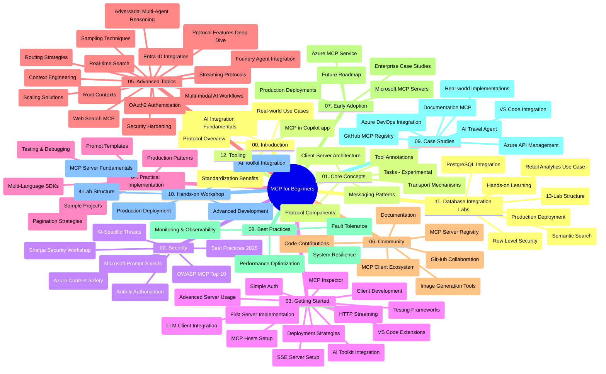

# Protocolul Contextului Modelului (MCP) pentru Începători - Ghid de Studiu

Acest ghid de studiu oferă o prezentare generală a structurii și conținutului depozitului pentru curriculumul „Protocolul Contextului Modelului (MCP) pentru Începători”. Folosiți acest ghid pentru a naviga eficient în depozit și pentru a profita la maximum de resursele disponibile.

## Prezentare generală a depozitului

Protocolul Contextului Modelului (MCP) este un cadru standardizat pentru interacțiunile dintre modelele AI și aplicațiile client. Inițial creat de Anthropic, MCP este acum menținut de comunitatea largă MCP prin organizația oficială GitHub. Acest depozit oferă un curriculum cuprinzător cu exemple practice de cod în C#, Java, JavaScript, Python și TypeScript, destinat dezvoltatorilor AI, arhitecților de sisteme și inginerilor software.

## Hartă vizuală a curriculumului

## Structura depozitului

Depozitul este organizat în douăsprezece secțiuni principale, fiecare concentrându-se pe diferite aspecte ale MCP:

1. **Introducere (00-Introduction/)**
   - Prezentare generală a Protocolului Contextului Modelului
   - Importanța standardizării în pipeline-urile AI
   - Cazuri practice și beneficii

2. **Concepte de bază (01-CoreConcepts/)**
   - Arhitectura client-server
   - Componente cheie ale protocolului
   - Tipare de mesagerie în MCP
   - Specificația curentă: [Ce s-a schimbat în MCP: Specificația 2026-07-28](./01-CoreConcepts/mcp-2026-07-28.md) — nucleul protocolului stateless, cadrul de Extensii și deprecările pentru Roots/Sampling/Logging

3. **Securitate (02-Security/)**
   - Amenințări de securitate în sistemele bazate pe MCP
   - Practici recomandate pentru implementări sigure
   - Strategii de autentificare și autorizare
   - Exercițiu practic [exemplu de autorizare CIMD și DCR](./02-Security/samples/cimd-dcr-auth/README.md)
   - **Documentație cuprinzătoare de securitate**:
     - Practici recomandate pentru securitatea MCP
     - Ghid de implementare Azure Content Safety
     - Controale și tehnici de securitate MCP
     - Referință rapidă a celor mai bune practici MCP
   - **Subiecte cheie de securitate**:
     - Atacuri de injecție a prompturilor și otrăvire de instrumente
     - Preluarea sesiunii și problemele cu înlocuitorul confuz
     - Vulnerabilități de trecere a token-urilor
     - Permisiuni excesive și controlul accesului
     - Securitatea lanțului de aprovizionare pentru componente AI
     - Integrarea Microsoft Prompt Shields

4. **Început rapid (03-GettingStarted/)**
   - Configurarea și setarea mediului
   - Crearea de servere și clienți MCP de bază
   - Integrarea cu aplicații existente
   - Include secțiuni pentru:
     - Prima implementare a serverului
     - Dezvoltarea clientului
     - Integrarea clientului LLM
     - Integrare VS Code
     - Server de Evenimente Transmise (SSE)
     - Utilizarea avansată a serverului
     - Streaming HTTP
     - Integrarea AI Toolkit
     - Strategii de testare
     - Linii directoare pentru implementare

5. **Implementare practică (04-PracticalImplementation/)**
   - Utilizarea SDK-urilor în diverse limbaje de programare
   - Tehnici de depanare, testare și validare
   - Crearea de șabloane și fluxuri reutilizabile pentru prompturi
   - Proiecte exemplu cu exemple de implementare

6. **Subiecte avansate (05-AdvancedTopics/)**
   - Tehnici de inginerie a contextului
   - Integrarea agentului Foundry
   - Fluxuri de lucru AI multimodale
   - Demonstrații de autentificare OAuth2
   - Capacități de căutare în timp real
   - Streaming în timp real
   - Implementarea contextelor root
   - Strategii de rutare
   - Tehnici de eșantionare
   - Abordări de scalare
   - Considerații de securitate
   - Integrarea securității Entra ID
   - Integrare căutare web
   - Raționament adversarial multi-agent (pattern-uri de dezbatere)

7. **Contribuții din comunitate (06-CommunityContributions/)**
   - Cum să contribui cu cod și documentație
   - Colaborarea prin GitHub
   - Îmbunătățiri și feedback conduse de comunitate
   - Utilizarea diverselor clienți MCP (Claude Desktop, Cline, VSCode)
   - Lucrul cu servere MCP populare, inclusiv generare de imagini

8. **Lecții din adopția timpurie (07-LessonsfromEarlyAdoption/)**
   - Implementări reale și povești de succes
   - Construirea și implementarea soluțiilor bazate pe MCP
   - Tendințe și foaie de parcurs viitoare
   - **Ghidul serverelor MCP Microsoft**: Ghid cuprinzător pentru 10 servere MCP Microsoft gata pentru producție, inclusiv:
     - Server MCP Microsoft Learn Docs
     - Server MCP Azure (peste 15 conectori specializați)
     - Server MCP GitHub
     - Server MCP Azure DevOps
     - Server MCP MarkItDown
     - Server MCP SQL Server
     - Server MCP Playwright
     - Server MCP Dev Box
     - Server MCP Microsoft Foundry
     - Server MCP Microsoft 365 Agents Toolkit

9. **Cele mai bune practici (08-BestPractices/)**
   - Optimizare și reglaj al performanței
   - Proiectarea sistemelor MCP tolerante la erori
   - Strategii de testare și reziliență

10. **Studii de caz (09-CaseStudy/)**
    - **Șapte studii de caz cuprinzătoare** demonstrând versatilitatea MCP în diverse scenarii:
    - **Azure AI Travel Agents**: Orchestrare multi-agent cu Azure OpenAI și AI Search
    - **Integrare Azure DevOps**: Automatizarea proceselor de workflow cu actualizări de date YouTube
    - **Recuperare documentație în timp real**: Client consolă Python cu streaming HTTP
    - **Generator interactiv de planuri de studiu**: Aplicație web Chainlit cu AI conversațional
    - **Documentație în editor**: Integrare VS Code cu fluxuri de lucru GitHub Copilot
    - **Azure API Management**: Integrare API corporate cu crearea serverului MCP
    - **GitHub MCP Registry**: Dezvoltare ecosistem și platformă de integrare agentic
    - Exemple de implementare acoperind integrare enterprise, productivitate dezvoltatori și dezvoltare ecosistem

11. **Atelier practic (10-StreamliningAIWorkflowsBuildingAnMCPServerWithAIToolkit/)**
    - Atelier practic cuprinzător combinând MCP cu AI Toolkit
    - Construirea aplicațiilor inteligente care leagă modelele AI de instrumente din lumea reală
    - Module practice care acoperă fundamente, dezvoltare server personalizat și strategii de implementare în producție
    - **Structura laboratorului**:
      - Laborator 1: Fundamente MCP Server
      - Laborator 2: Dezvoltare avansată MCP Server
      - Laborator 3: Integrare AI Toolkit
      - Laborator 4: Implementare în producție și scalare
    - Abordare de învățare bazată pe laboratoare cu instrucțiuni pas cu pas

12. **Lab-uri pentru integrarea bazelor de date ale serverului MCP (11-MCPServerHandsOnLabs/)**
    - **Cale de învățare cuprinzătoare în 13 laboratoare** pentru construirea serverelor MCP gata pentru producție cu integrare PostgreSQL
    - **Implementare reală de analiză retail** folosind cazul de utilizare Zava Retail
    - **Pattern-uri de nivel enterprise** inclusiv Row Level Security (RLS), căutare semantică și acces multi-tenant la date
    - **Structura completă a laboratorului**:
      - **Laboratoarele 00-03: Fundamente** - Introducere, Arhitectură, Securitate, Configurare mediu
      - **Laboratoarele 04-06: Construirea MCP Server** - Design bază de date, Implementare MCP Server, Dezvoltare instrument

      - **Laboratoare 07-09: Funcționalități Avansate** - Căutare Semantică, Testare & Depanare, Integrare VS Code
      - **Laboratoare 10-12: Producție & Cele Mai Bune Practici** - Implementare, Monitorizare, Optimizare
    - **Tehnologii Acoperite**: cadrul FastMCP, PostgreSQL, Azure OpenAI, Azure Container Apps, Application Insights
    - **Rezultate de Învățare**: Servere MCP pregătite pentru producție, modele de integrare a bazelor de date, analiză bazată pe AI, securitate la nivel enterprise

13. **Unelte (12-tooling/)**
    - Aflați cum să utilizați MCP în aplicația Copilot și alte unelte

## Resurse Suplimentare

Repozitoriul include resurse de suport:

- **Folderul de imagini**: Conține diagrame și ilustrații utilizate pe parcursul curriculumului
- **Traduceri**: Suport multilingv cu traduceri automate ale documentației
- **Resurse Oficiale MCP**:
  - [Documentația MCP](https://modelcontextprotocol.io/)
  - [Specificația MCP](https://modelcontextprotocol.io/specification/2026-07-28/)
  - [Repozitoriul GitHub MCP](https://github.com/modelcontextprotocol)

## Cum să utilizați acest repozitoriu

1. **Învățare Secvențială**: Urmați capitolele în ordine (00 până la 11) pentru o experiență de învățare structurată.
2. **Focus pe limbaj specific**: Dacă sunteți interesat de un anumit limbaj de programare, explorați directoarele de exemple pentru implementări în limbajul preferat.
3. **Implementare practică**: Începeți cu secțiunea „Început rapid” pentru a configura mediul și a crea primul server și client MCP.
4. **Explorare avansată**: După ce vă familiarizați cu bazele, aprofundați subiectele avansate pentru a vă extinde cunoștințele.
5. **Implicare în comunitate**: Alăturați-vă comunității MCP prin discuții GitHub și canale Discord pentru a vă conecta cu experți și alți dezvoltatori.

## Clienți și unelte MCP

Curriculumul acoperă diverși clienți și unelte MCP:

1. **Clienți oficiali**:
   - Visual Studio Code 
   - MCP în Visual Studio Code
   - Claude Desktop
   - Claude în VSCode 
   - Claude API

2. **Clienți comunitari**:
   - Cline (bazat pe terminal)
   - Cursor (editor de cod)
   - ChatMCP
   - Windsurf

3. **Unelte de gestionare MCP**:
   - MCP CLI
   - MCP Manager
   - MCP Linker
   - MCP Router

## Servere MCP populare

Repozitoriul introduce diverse servere MCP, inclusiv:

1. **Servere MCP oficiale Microsoft**:
   - Microsoft Learn Docs MCP Server
   - Azure MCP Server (15+ conectori specializați)
   - GitHub MCP Server
   - Azure DevOps MCP Server
   - MarkItDown MCP Server
   - SQL Server MCP Server
   - Playwright MCP Server
   - Dev Box MCP Server
   - Microsoft Foundry MCP Server
   - Microsoft 365 Agents Toolkit MCP Server

2. **Servere de referință oficiale**:
   - Filesystem
   - Fetch
   - Memorie
   - Gândire secvențială

3. **Generare de imagini**:
   - Azure OpenAI DALL-E 3
   - Stable Diffusion WebUI
   - Replicate

4. **Unelte de dezvoltare**:
   - Git MCP
   - Control terminal
   - Asistent de cod

5. **Servere specializate**:
   - Salesforce
   - Microsoft Teams
   - Jira & Confluence

## Contribuții

Acest repozitoriu primește cu plăcere contribuții din partea comunității. Consultați secțiunea Contribuții Comunitare pentru indicații despre cum să contribuiți eficient la ecosistemul MCP.

----

*Acest ghid de studiu a fost actualizat ultima dată pe 9 septembrie 2026. Reflectă specificația MCP
`2026-07-28`, revizia actuală a protocolului. Unele exemple practice
sunt în continuare marcate explicit cu versiunea `2025-11-25` în timp ce SDK-urile și uneltele
adoptă API-urile protocolului fără stare.*

---

<!-- CO-OP TRANSLATOR DISCLAIMER START -->
**Declinare a responsabilității**:
Acest document a fost tradus folosind serviciul de traducere AI [Co-op Translator](https://github.com/Azure/co-op-translator). În timp ce ne străduim pentru acuratețe, vă rugăm să rețineți că traducerile automate pot conține erori sau inexactități. Documentul original în limba sa nativă trebuie considerat sursa autorizată. Pentru informații critice, se recomandă traducerea profesională realizată de un om. Nu ne asumăm responsabilitatea pentru eventualele neînțelegeri sau interpretări greșite care decurg din utilizarea acestei traduceri.
<!-- CO-OP TRANSLATOR DISCLAIMER END -->