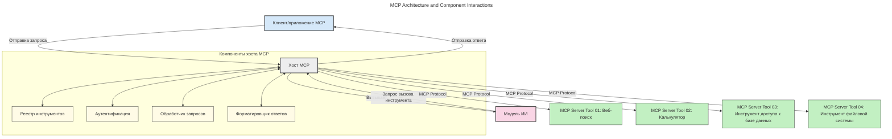
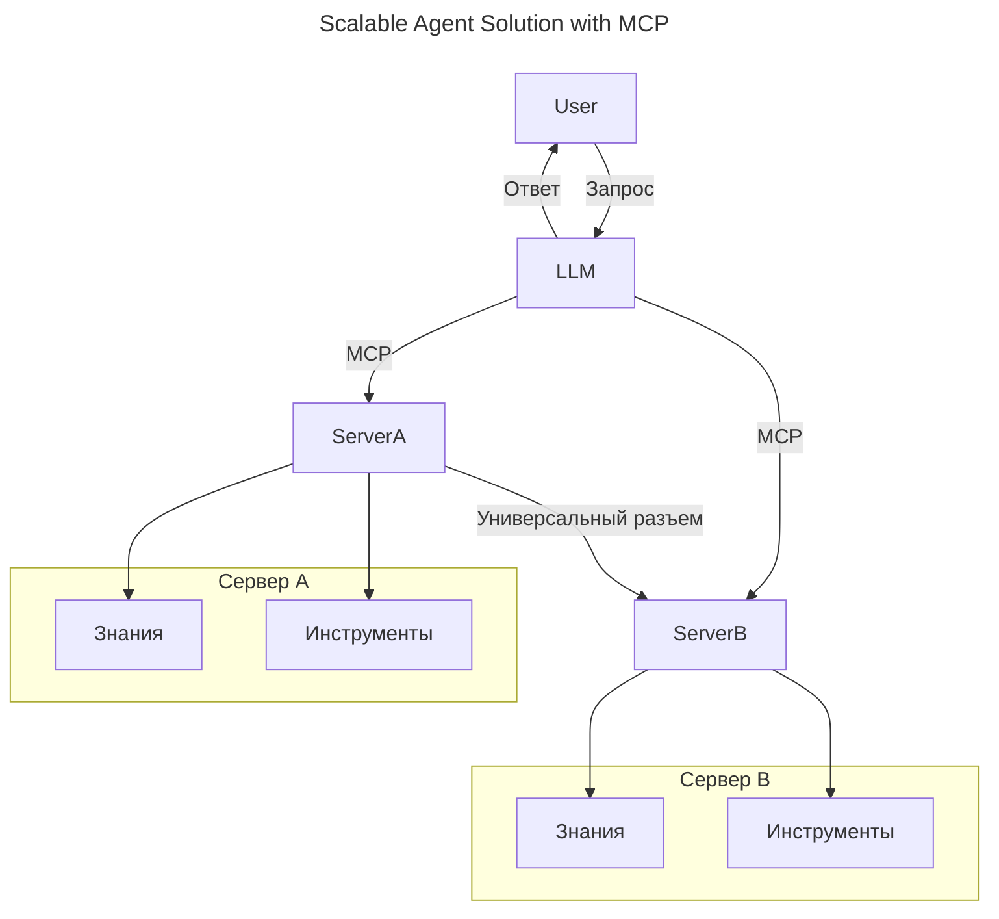
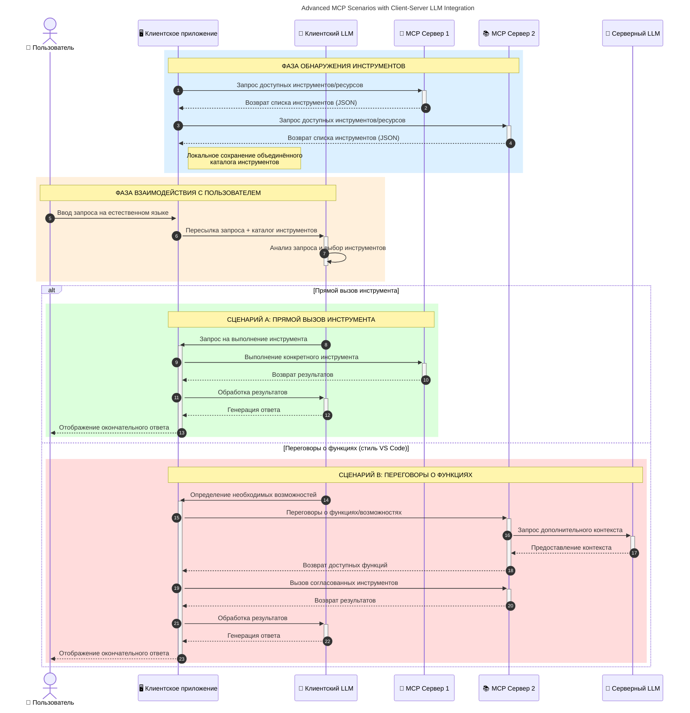

# Введение в протокол контекста модели (MCP): почему это важно для масштабируемых AI-приложений

_(Нажмите на изображение выше, чтобы посмотреть видео этого урока)_

Генеративные AI-приложения — это большой шаг вперёд, так как они часто позволяют пользователю взаимодействовать с приложением с помощью естественных языковых запросов. Однако по мере увеличения времени и ресурсов, инвестируемых в такие приложения, важно убедиться, что вы можете легко интегрировать функциональности и ресурсы таким образом, чтобы было легко расширять приложение, чтобы ваше приложение могло работать с более чем одной моделью и обрабатывать различные особенности моделей. Коротко говоря, создавать генеративные AI-приложения изначально просто, но по мере роста и усложнения необходимо начинать определять архитектуру и, вероятно, полагаться на стандарт, чтобы обеспечивать последовательность в создании приложений. Вот здесь и вступает в игру MCP, чтобы организовать процесс и предоставить стандарт.

---

## **🔍 Что такое протокол контекста модели (MCP)?**

**Протокол контекста модели (MCP)** — это **открытый, стандартизированный интерфейс**, который позволяет большим языковым моделям (LLM) беспрепятственно взаимодействовать с внешними инструментами, API и источниками данных. Он обеспечивает согласованную архитектуру для расширения функциональности AI-моделей за пределы их обучающих данных, позволяя создавать более умные, масштабируемые и отзывчивые AI-системы.

---

## **🎯 Почему стандартизация важна в AI**

По мере усложнения генеративных AI-приложений становится крайне важно внедрять стандарты, которые обеспечат **масштабируемость, расширяемость, сопровождаемость** и **избежание зависимости от одного поставщика**. MCP решает эти задачи с помощью:

- Унификации интеграций между моделями и инструментами
- Сокращения хрупких, уникальных пользовательских решений
- Позволяет нескольким моделям от разных поставщиков сосуществовать в одной экосистеме

**Примечание:** Хотя MCP позиционируется как открытый стандарт, не планируется стандартизовать MCP через существующие организации по стандартизации, такие как IEEE, IETF, W3C, ISO или другие.

---

## **📚 Учебные цели**

К концу этой статьи вы сможете:

- Определить **протокол контекста модели (MCP)** и его области применения
- Понять, как MCP стандартизирует коммуникацию модель-инструмент
- Выделить основные компоненты архитектуры MCP
- Изучить практические применения MCP в корпоративном и разработческом контекстах

---

## **💡 Почему протокол контекста модели (MCP) — это революция**

### **🔗 MCP решает проблему фрагментации в AI-взаимодействиях**

До появления MCP интеграция моделей с инструментами требовала:

- Пользовательский код для каждой пары инструмент-модель
- Нестандартных API для каждого поставщика
- Частых сбоев из-за обновлений
- Плохой масштабируемости с ростом числа инструментов

### **✅ Преимущества стандартизации MCP**

| **Преимущество**         | **Описание**                                                                   |
|--------------------------|-------------------------------------------------------------------------------|
| Интероперабельность       | LLM работают беспрепятственно с инструментами разных поставщиков              |
| Последовательность        | Единообразное поведение на всех платформах и инструментах                      |
| Повторное использование   | Инструменты, созданные один раз, могут использоваться в разных проектах и системах |
| Ускоренная разработка     | Сокращение времени разработки благодаря стандартизированным, готовым интерфейсам |

---

## **🧱 Обзор архитектуры MCP на высоком уровне**

MCP следует **модели клиент-сервер**, где:

- **MCP-хосты** запускают AI-модели
- **MCP-клиенты** инициируют запросы
- **MCP-серверы** предоставляют контекст, инструменты и возможности

### **Ключевые компоненты:**

- **Ресурсы** – статические или динамические данные для моделей  
- **Промпты** – предопределённые рабочие процессы для направляемой генерации  
- **Инструменты** – исполняемые функции, такие как поиск, вычисления  
- **Сэмплирование** – агентское поведение через рекурсивные взаимодействия (устаревшее в MCP `2026-07-28`; новые реализации должны интегрироваться напрямую с провайдером LLM)

- **Запросы информации** – серверные запросы для ввода от пользователя
- **Корни** – информационные расположения файловой системы, релевантные серверу (устарели в MCP `2026-07-28`; рекомендуется использовать параметры инструментов, URI ресурсов или конфигурацию сервера)

### **Архитектура протокола:**

MCP использует двухслойную архитектуру:
- **Слой данных**: сообщения JSON-RPC 2.0, метаданные на запрос, обнаружение и примитивы протокола
- **Транспортный слой**: stdio для локальных подпроцессов и Streamable HTTP для удалённых серверов. Streamable HTTP может использовать фрейминг SSE для потоковых ответов, но устаревший транспорт HTTP+SSE больше не рекомендуется.

---

## Как работают MCP-серверы

MCP-серверы функционируют следующим образом:

- **Поток запросов**:
    1. Запрос инициируется конечным пользователем или программным обеспечением, действующим от его имени.
    2. **MCP-клиент** отправляет запрос **MCP-хосту**, который управляет временем выполнения AI-модели.
    3. **AI-модель** получает пользовательский запрос и может запросить доступ к внешним инструментам или данным через один или несколько вызовов инструментов.
    4. **MCP-хост**, а не сама модель, взаимодействует с соответствующими **MCP-серверами** с использованием стандартизированного протокола.
- **Функциональность MCP-хоста**:
    - **Реестр инструментов**: ведёт каталог доступных инструментов и их возможностей.
    - **Аутентификация**: проверяет права доступа к инструментам.
    - **Обработчик запросов**: обрабатывает входящие запросы инструментов от модели.
    - **Формирователь ответа**: структурирует вывод инструментов в формате, понятном модели.
- **Выполнение MCP-сервера**:
    - **MCP-хост** маршрутизирует вызовы инструментов одному или нескольким **MCP-серверам**, каждый из которых предоставляет специализированные функции (например, поиск, вычисления, запросы к базе данных).
    - **MCP-серверы** выполняют свои операции и возвращают результаты **MCP-хосту** в согласованном формате.
    - **MCP-хост** форматирует и передаёт эти результаты **AI-модели**.
- **Завершение ответа**:
    - **AI-модель** интегрирует вывод инструментов в окончательный ответ.
    - **MCP-хост** отправляет этот ответ обратно **MCP-клиенту**, который доставляет его конечному пользователю или вызывающему ПО.
    

## 👨‍💻 Как построить MCP-сервер (с примерами)

MCP-серверы позволяют расширить возможности LLM, предоставляя данные и функциональность. 

Готовы попробовать? Вот SDK с примерами создания простых MCP-серверов на разных языках/стэках:

- **Python SDK**: https://github.com/modelcontextprotocol/python-sdk

- **TypeScript SDK**: https://github.com/modelcontextprotocol/typescript-sdk

- **Java SDK**: https://github.com/modelcontextprotocol/java-sdk

- **C#/.NET SDK**: https://github.com/modelcontextprotocol/csharp-sdk

## 🌍 Практические случаи использования MCP

MCP позволяет создавать широкий спектр приложений, расширяя возможности AI:

| **Применение**             | **Описание**                                                                  |
|----------------------------|-------------------------------------------------------------------------------|
| Корпоративная интеграция данных | Подключение LLM к базам данных, CRM или внутренним инструментам             |
| Агентские AI-системы        | Обеспечение автономных агентов с доступом к инструментам и рабочими процессами принятия решений |
| Мультимодальные приложения  | Объединение текстовых, графических и аудио инструментов в едином AI-приложении |
| Интеграция данных в реальном времени | Внедрение живых данных в AI-взаимодействия для более точных и актуальных ответов |

### 🧠 MCP = универсальный стандарт для AI-взаимодействий

Протокол контекста модели (MCP) действует как универсальный стандарт для AI-взаимодействий, подобно тому, как USB-C стандартизировал физические подключения устройств. В мире AI MCP обеспечивает единый интерфейс, позволяя моделям (клиентам) беспрепятственно интегрироваться с внешними инструментами и поставщиками данных (серверами). Это устраняет необходимость в десятках различных, индивидуальных протоколов для каждого API или источника данных.

В рамках MCP совместимый MCP-инструмент (называемый MCP-сервером) следует единому стандарту. Такие серверы могут перечислять инструменты или действия, которые они предоставляют, и выполнять эти действия по запросу от AI-агента. Платформы AI-агентов, поддерживающие MCP, могут обнаруживать доступные инструменты на серверах и вызывать их через этот стандартный протокол.

### 💡 Облегчает доступ к знаниям

Помимо предоставления инструментов, MCP облегчает доступ к знаниям. Он позволяет приложениям обеспечивать контекст для больших языковых моделей (LLM), связывая их с разными источниками данных. Например, MCP-сервер может представлять репозиторий документов компании, позволяя агентам получать релевантную информацию по запросу. Другой сервер может выполнять специфические действия, такие как отправка писем или обновление записей. С точки зрения агента — это просто инструменты, которые он может использовать: некоторые инструменты возвращают данные (контекст знаний), другие выполняют действия. MCP эффективно управляет обоими этими типами.

Агент, подключающийся к MCP-серверу, автоматически узнаёт о доступных возможностях сервера и предоставляемых данных посредством стандартизированного формата. Эта стандартизация позволяет динамически использовать инструменты. Например, добавление нового MCP-сервера к системе агента сразу делает его функции доступными без дополнительной настройки инструкций агента.

Такая упрощённая интеграция соответствует процессу, иллюстрированному на следующей диаграмме, где серверы предоставляют и инструменты, и знания, обеспечивая бесшовное сотрудничество между системами.

### 👉 Пример: масштабируемое решение агента

 Универсальный коннектор позволяет MCP-серверам общаться и обмениваться возможностями друг с другом, позволяя ServerA делегировать задачи ServerB или получать доступ к его инструментам и знаниям. Это федерация инструментов и данных между серверами, поддерживающая масштабируемые и модульные архитектуры агентов. Поскольку MCP стандартизирует представление инструментов, агенты могут динамически обнаруживать и маршрутизировать запросы между серверами без жёстко заданных интеграций.

Федерация инструментов и знаний: Инструменты и данные могут быть доступны между серверами, что позволяет создавать более масштабируемые и модульные агентские архитектуры.

### 🔄 Расширенные сценарии MCP с интеграцией LLM на стороне клиента

Помимо базовой архитектуры MCP существуют расширенные сценарии, где и клиент, и сервер содержат LLM, что позволяет более сложные взаимодействия. На следующей схеме **Клиентское приложение** может быть IDE с набором MCP-инструментов, доступных для использования LLM:

## 🔐 Практические преимущества MCP

Вот практические преимущества использования MCP:

- **Актуальность**: модели могут получать доступ к актуальной информации помимо данных обучения
- **Расширение возможностей**: модели могут использовать специализированные инструменты для задач, которым не обучались
- **Снижение галлюцинаций**: внешние источники данных обеспечивают фактическую основу
- **Конфиденциальность**: чувствительные данные могут оставаться в безопасной среде, а не внедряться в промпты

## 📌 Ключевые выводы

Вот основные выводы по использованию MCP:

- **MCP** стандартизирует взаимодействие AI-моделей с инструментами и данными
- Способствует **расширяемости, согласованности и интероперабельности**
- MCP помогает **сократить время разработки, повысить надёжность и расширить возможности модели**
- Архитектура клиент-сервер **обеспечивает гибкие, расширяемые AI-приложения**

## 🧠 Упражнение

Подумайте о AI-приложении, которое вам интересно создать.

- Какие **внешние инструменты или данные** могут повысить его возможности?
- Как MCP может сделать интеграцию **проще и надёжнее?**

## Дополнительные ресурсы

- [Репозиторий MCP на GitHub](https://github.com/modelcontextprotocol)

## Что дальше

Далее: [Глава 1: Основные концепции](../01-CoreConcepts/README.md)

---

<!-- CO-OP TRANSLATOR DISCLAIMER START -->
**Отказ от ответственности**:
Этот документ был переведен с использованием сервиса машинного перевода [Co-op Translator](https://github.com/Azure/co-op-translator). Несмотря на наши усилия по обеспечению точности, имейте в виду, что автоматический перевод может содержать ошибки или неточности. Оригинальный документ на его исходном языке следует считать авторитетным источником. Для получения критически важной информации рекомендуется обратиться к профессиональному человеческому переводу. Мы не несем ответственности за любые недоразумения или неправильные толкования, возникшие в результате использования этого перевода.
<!-- CO-OP TRANSLATOR DISCLAIMER END -->