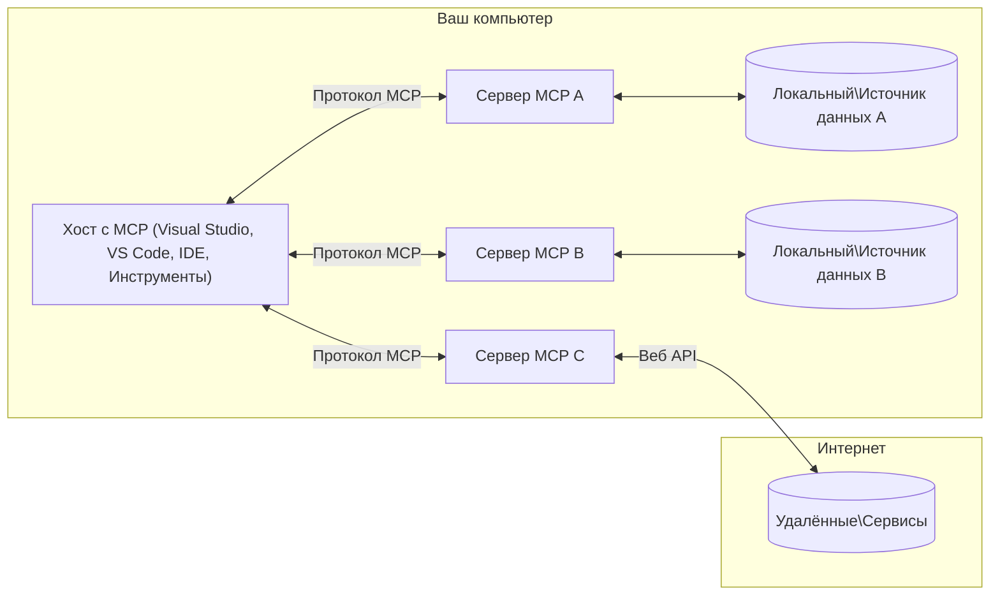

# Основные концепции MCP: Освоение протокола Model Context для интеграции ИИ

[](https://youtu.be/earDzWGtE84)

_(Нажмите на изображение выше, чтобы посмотреть видео этого урока)_

[Протокол Model Context (MCP)](https://github.com/modelcontextprotocol) — это мощный стандартизированный фреймворк, который оптимизирует взаимодействие между крупными языковыми моделями (LLM) и внешними инструментами, приложениями и источниками данных.  
Это руководство проведет вас через основные концепции MCP. Вы узнаете о его клиент-серверной архитектуре, ключевых компонентах, механизмах коммуникации и лучших практиках реализации.

- **Явное согласие пользователя**: Все операции и доступ к данным требуют явного одобрения пользователя перед выполнением. Пользователи должны четко понимать, к каким данным будет осуществлен доступ и какие действия будут выполнены, с детальным контролем разрешений и авторизаций.

- **Защита конфиденциальности данных**: Данные пользователя раскрываются только с явного согласия и должны быть защищены надежными механизмами контроля доступа на протяжении всего жизненного цикла взаимодействия. Реализации должны предотвращать несанкционированную передачу данных и поддерживать строгие границы конфиденциальности.

- **Безопасность выполнения инструментов**: Каждый вызов инструмента требует явного согласия пользователя с четким пониманием функциональности инструмента, параметров и возможного воздействия. Надежные меры безопасности должны предотвращать непреднамеренное, небезопасное или вредоносное выполнение инструментов.

- **Безопасность транспортного уровня**: Все каналы связи должны использовать соответствующие механизмы шифрования и аутентификации. Удалённые подключения должны реализовывать безопасные транспортные протоколы и правильное управление учетными данными.

#### Руководство по реализации:

- **Управление разрешениями**: Реализуйте тонконастроенные системы разрешений, позволяющие пользователям контролировать, к каким серверам, инструментам и ресурсам предоставлен доступ  
- **Аутентификация и авторизация**: Используйте безопасные методы аутентификации (OAuth, API-ключи) с правильным управлением токенами и сроками их действия  
- **Валидация входных данных**: Проверяйте все параметры и входные данные согласно определённым схемам, чтобы предотвратить инъекции  
- **Аудит и логирование**: Ведите полные журналы всех операций для мониторинга безопасности и соответствия требованиям

## Обзор

В этом уроке рассматривается фундаментальная архитектура и компоненты, составляющие экосистему протокола Model Context (MCP). Вы узнаете о клиент-серверной архитектуре, ключевых компонентах и механизмах коммуникации, обеспечивающих взаимодействия MCP.

## Ключевые цели обучения

К концу урока вы:

- Поймёте клиент-серверную архитектуру MCP.  
- Определите роли и обязанности хостов, клиентов и серверов.  
- Проанализируете основные функции, делающие MCP гибким уровнем интеграции.  
- Узнаете, как происходит поток информации в экосистеме MCP.  
- Получите практические знания через примеры кода на .NET, Java, Python и JavaScript.

## Архитектура MCP: подробный взгляд

Экосистема MCP построена на модели клиент-сервер. Эта модульная структура позволяет AI-приложениям эффективно взаимодействовать с инструментами, базами данных, API и контекстными ресурсами. Разберём эту архитектуру на основные компоненты.

В основе MCP лежит клиент-серверная архитектура, где хост-приложение может подключаться к нескольким серверам:


- **MCP Hosts**: Программы, такие как VSCode, Claude Desktop, IDE или AI-инструменты, которые хотят получить доступ к данным через MCP  
- **MCP Clients**: Клиенты протокола, поддерживающие 1:1 соединения с серверами  
- **MCP Servers**: Легковесные программы, которые предоставляют конкретные возможности через стандартизованный протокол Model Context  
- **Локальные источники данных**: Файлы, базы данных и сервисы вашего компьютера, к которым MCP-серверы могут безопасно получить доступ  
- **Удалённые сервисы**: Внешние системы, доступные через интернет, к которым MCP-серверы могут подключаться через API.

Протокол MCP — это развивающийся стандарт с версионированием по дате (формат ГГГГ-ММ-ДД). Текущая версия протокола — **2025-11-25**. Последние обновления спецификации доступны в [протоколе](https://modelcontextprotocol.io/specification/2025-11-25/).

### 1. Хосты

В протоколе Model Context (MCP) **хосты** — это AI-приложения, которые служат основным интерфейсом для взаимодействия пользователей с протоколом. Хосты координируют и управляют подключениями к нескольким MCP-серверам, создавая выделенных MCP-клиентов для каждого серверного соединения. Примеры хостов:

- **AI-приложения**: Claude Desktop, Visual Studio Code, Claude Code  
- **Среды разработки**: IDE и редакторы кода с интеграцией MCP  
- **Пользовательские приложения**: Специализированные AI-агенты и инструменты

**Хосты** — это приложения, которые координируют взаимодействия с AI-моделями. Они:

- **Оркестрация AI-моделей**: Выполняют или взаимодействуют с LLM для генерации ответов и координации AI-рабочих процессов  
- **Управление клиентскими подключениями**: Создают и поддерживают по одному MCP-клиенту на каждое серверное соединение  
- **Контроль пользовательского интерфейса**: Обрабатывают поток диалогов, взаимодействия с пользователем и отображение ответов  
- **Обеспечение безопасности**: Контролируют разрешения, ограничения безопасности и аутентификацию  
- **Обработка согласия пользователя**: Управляют одобрением пользователя для обмена данными и выполнения инструментов

### 2. Клиенты

**Клиенты** — это ключевые компоненты, поддерживающие выделенные однонаправленные соединения между хостами и MCP-серверами. Каждый MCP-клиент создаётся хостом для подключения к конкретному MCP-серверу, обеспечивая организованные и безопасные каналы связи. Несколько клиентов позволяют хостам одновременно подключаться к нескольким серверам.

**Клиенты** — это компоненты-соединители внутри хост-приложения. Они:

- **Коммуникация по протоколу**: Отправляют JSON-RPC 2.0 запросы серверам с подсказками и инструкциями  
- **Согласование возможностей**: Обсуждают поддерживаемые функции и версии протокола с серверами при инициализации  
- **Выполнение инструментов**: Управляют запросами на выполнение инструментов от моделей и обрабатывают ответы  
- **Обновления в реальном времени**: Обрабатывают уведомления и обновления от серверов  
- **Обработка ответов**: Обрабатывают и форматируют ответы серверов для отображения пользователям

### 3. Сервера

**Сервера** — это программы, которые предоставляют контекст, инструменты и возможности MCP-клиентам. Они могут работать локально (на той же машине, что и хост) или удалённо (на внешних платформах) и отвечают за обработку запросов клиентов и предоставление структурированных ответов. Сервера предоставляют конкретный функционал через стандартизованный протокол Model Context.

**Сервера** — это сервисы, предоставляющие контекст и возможности. Они:

- **Регистрация возможностей**: Регистрируют и предоставляют доступные примитивы (ресурсы, подсказки, инструменты) клиентам  
- **Обработка запросов**: Принимают и выполняют вызовы инструментов, запросы ресурсов и подсказок от клиентов  
- **Предоставление контекста**: Обеспечивают контекстную информацию и данные для улучшения ответов моделей  
- **Управление состоянием**: Поддерживают состояние сессии и обрабатывают состояние при необходимости  
- **Уведомления в реальном времени**: Отправляют уведомления об изменениях возможностей и обновлениях подключённым клиентам

Сервера могут разрабатываться кем угодно для расширения возможностей моделей специализированным функционалом и поддерживают как локальное, так и удалённое развертывание.

### 4. Примитивы сервера

Сервера в протоколе Model Context (MCP) предоставляют три основных **примитива**, которые определяют фундаментальные строительные блоки для богатого взаимодействия между клиентами, хостами и языковыми моделями. Эти примитивы задают типы контекстной информации и действий, доступных через протокол.

MCP-сервера могут предоставлять любую комбинацию из следующих трёх основных примитивов:

#### Ресурсы

**Ресурсы** — это источники данных, которые предоставляют контекстную информацию AI-приложениям. Они представляют статический или динамический контент, который может улучшить понимание модели и принятие решений:

- **Контекстные данные**: Структурированная информация и контекст для потребления AI-моделью  
- **Базы знаний**: Репозитории документов, статьи, руководства и научные работы  
- **Локальные источники данных**: Файлы, базы данных и информация локальной системы  
- **Внешние данные**: Ответы API, веб-сервисы и данные удалённых систем  
- **Динамический контент**: Данные в реальном времени, обновляющиеся в зависимости от внешних условий

Ресурсы идентифицируются URI и поддерживают обнаружение через методы `resources/list` и получение через `resources/read`:

```text
file://documents/project-spec.md
database://production/users/schema
api://weather/current
```

#### Подсказки

**Подсказки** — это повторно используемые шаблоны, которые помогают структурировать взаимодействия с языковыми моделями. Они предоставляют стандартизированные шаблоны взаимодействия и шаблонные рабочие процессы:

- **Взаимодействия на основе шаблонов**: Предварительно структурированные сообщения и начала диалогов  
- **Шаблоны рабочих процессов**: Стандартизированные последовательности для общих задач и взаимодействий  
- **Примеры с несколькими образцами**: Шаблоны на основе примеров для инструкций модели  
- **Системные подсказки**: Основополагающие подсказки, определяющие поведение и контекст модели  
- **Динамические шаблоны**: Параметризованные подсказки, адаптирующиеся к конкретным контекстам

Подсказки поддерживают подстановку переменных и могут быть обнаружены через `prompts/list` и получены с помощью `prompts/get`:

```markdown
Generate a {{task_type}} for {{product}} targeting {{audience}} with the following requirements: {{requirements}}
```

#### Инструменты

**Инструменты** — это исполняемые функции, которые AI-модели могут вызывать для выполнения конкретных действий. Они представляют собой «глаголы» экосистемы MCP, позволяя моделям взаимодействовать с внешними системами:

- **Исполняемые функции**: Отдельные операции, которые модели могут вызывать с конкретными параметрами  
- **Интеграция с внешними системами**: Вызовы API, запросы к базам данных, операции с файлами, вычисления  
- **Уникальная идентификация**: Каждый инструмент имеет уникальное имя, описание и схему параметров  
- **Структурированный ввод/вывод**: Инструменты принимают проверенные параметры и возвращают структурированные, типизированные ответы  
- **Возможности действий**: Позволяют моделям выполнять реальные действия и получать актуальные данные

Инструменты определяются с помощью JSON Schema для валидации параметров, обнаруживаются через `tools/list` и вызываются через `tools/call`:

```typescript
server.tool(
  "search_products", 
  {
    query: z.string().describe("Search query for products"),
    category: z.string().optional().describe("Product category filter"),
    max_results: z.number().default(10).describe("Maximum results to return")
  }, 
  async (params) => {
    // Выполнить поиск и вернуть структурированные результаты
    return await productService.search(params);
  }
);
```

## Примитивы клиента

В протоколе Model Context (MCP) **клиенты** могут предоставлять примитивы, которые позволяют серверам запрашивать дополнительные возможности у хост-приложения. Эти клиентские примитивы обеспечивают более богатую и интерактивную реализацию серверов, которые могут получать доступ к возможностям AI-моделей и взаимодействиям с пользователем.

### Сэмплирование

**Сэмплирование** позволяет серверам запрашивать дополнения языковой модели из AI-приложения клиента. Этот примитив даёт серверам доступ к возможностям LLM без необходимости встраивать собственные зависимости моделей:

- **Независимый от модели доступ**: Сервера могут запрашивать дополнения без включения SDK LLM или управления доступом к модели  
- **Инициируемый сервером AI**: Позволяет серверам автономно генерировать контент с использованием модели клиента  
- **Рекурсивные взаимодействия с LLM**: Поддерживает сложные сценарии, где серверам нужна помощь AI для обработки  
- **Динамическая генерация контента**: Позволяет серверам создавать контекстные ответы с использованием модели хоста

Сэмплирование инициируется через метод `sampling/complete`, где сервера отправляют запросы на дополнение клиентам.

### Запрос информации

**Запрос информации** позволяет серверам запрашивать дополнительную информацию или подтверждение у пользователей через интерфейс клиента:

- **Запросы ввода пользователя**: Сервера могут запрашивать дополнительную информацию, необходимую для выполнения инструментов  
- **Диалоги подтверждения**: Запрашивают одобрение пользователя для чувствительных или значимых операций  
- **Интерактивные рабочие процессы**: Позволяют серверам создавать пошаговые взаимодействия с пользователем  
- **Динамический сбор параметров**: Сбор отсутствующих или необязательных параметров во время выполнения инструментов

Запросы информации выполняются с помощью метода `elicitation/request` для сбора пользовательского ввода через интерфейс клиента.

### Логирование

**Логирование** позволяет серверам отправлять структурированные сообщения журналов клиентам для отладки, мониторинга и операционной прозрачности:

- **Поддержка отладки**: Позволяет серверам предоставлять подробные журналы выполнения для устранения неполадок  
- **Операционный мониторинг**: Отправляет обновления статуса и метрики производительности клиентам  
- **Отчёты об ошибках**: Предоставляет подробный контекст ошибок и диагностическую информацию  
- **Аудит и трассировка**: Создаёт полные журналы операций и решений сервера

Сообщения логирования отправляются клиентам для обеспечения прозрачности операций сервера и облегчения отладки.

## Поток информации в MCP

Протокол Model Context (MCP) определяет структурированный поток информации между хостами, клиентами, серверами и моделями. Понимание этого потока помогает прояснить, как обрабатываются пользовательские запросы и как внешние инструменты и данные интегрируются в ответы модели.

- **Хост инициирует соединение**  
  Хост-приложение (например, IDE или чат-интерфейс) устанавливает соединение с MCP-сервером, обычно через STDIO, WebSocket или другой поддерживаемый транспорт.

- **Согласование возможностей**  
  Клиент (встроенный в хост) и сервер обмениваются информацией о поддерживаемых функциях, инструментах, ресурсах и версиях протокола. Это гарантирует, что обе стороны понимают, какие возможности доступны для сессии.

- **Запрос пользователя**  
  Пользователь взаимодействует с хостом (например, вводит подсказку или команду). Хост собирает этот ввод и передает его клиенту для обработки.

- **Использование ресурсов или инструментов**  
  - Клиент может запросить у сервера дополнительный контекст или ресурсы (например, файлы, записи базы данных или статьи из базы знаний) для обогащения понимания модели.  
  - Если модель определяет, что нужен инструмент (например, для получения данных, выполнения вычислений или вызова API), клиент отправляет серверу запрос на вызов инструмента с указанием имени инструмента и параметров.

- **Выполнение на сервере**  
  Сервер получает запрос ресурса или инструмента, выполняет необходимые операции (например, запуск функции, запрос к базе данных или получение файла) и возвращает результаты клиенту в структурированном формате.

- **Генерация ответа**  
  Клиент интегрирует ответы сервера (данные ресурсов, результаты инструментов и т. д.) в текущее взаимодействие с моделью. Модель использует эту информацию для создания комплексного и контекстно релевантного ответа.

- **Представление результата**  
  Хост получает окончательный вывод от клиента и отображает его пользователю, часто включая как сгенерированный текст модели, так и результаты выполнения инструментов или поиска ресурсов.

Этот поток позволяет MCP поддерживать продвинутые, интерактивные и контекстно-осведомлённые AI-приложения, бесшовно связывая модели с внешними инструментами и источниками данных.

## Архитектура протокола и уровни

MCP состоит из двух отдельных архитектурных уровней, которые работают вместе, обеспечивая полный коммуникационный фреймворк:

### Уровень данных

**Уровень данных** реализует основной протокол MCP, используя в качестве основы **JSON-RPC 2.0**. Этот уровень определяет структуру сообщений, семантику и паттерны взаимодействия:

#### Основные компоненты:

- **Протокол JSON-RPC 2.0**: Вся коммуникация использует стандартизированный формат сообщений JSON-RPC 2.0 для вызовов методов, ответов и уведомлений
- **Управление жизненным циклом**: Обрабатывает инициализацию соединения, согласование возможностей и завершение сессии между клиентами и серверами  
- **Примитивы сервера**: Позволяют серверам предоставлять основную функциональность через инструменты, ресурсы и подсказки  
- **Примитивы клиента**: Позволяют серверам запрашивать выборку из LLM, получать ввод пользователя и отправлять лог-сообщения  
- **Уведомления в реальном времени**: Поддерживают асинхронные уведомления для динамических обновлений без опроса  

#### Ключевые особенности:

- **Согласование версии протокола**: Использует версионирование на основе даты (ГГГГ-ММ-ДД) для обеспечения совместимости  
- **Обнаружение возможностей**: Клиенты и серверы обмениваются информацией о поддерживаемых функциях во время инициализации  
- **Состояние сессии**: Поддерживает состояние соединения между несколькими взаимодействиями для сохранения контекста  

### Транспортный уровень

**Транспортный уровень** управляет каналами связи, кадрированием сообщений и аутентификацией между участниками MCP:

#### Поддерживаемые транспортные механизмы:

1. **Транспорт STDIO**:  
   - Использует стандартные потоки ввода/вывода для прямой коммуникации процессов  
   - Оптимален для локальных процессов на одной машине без сетевых накладных расходов  
   - Часто используется для локальных реализаций MCP-серверов  

2. **Потоковый HTTP-транспорт**:  
   - Использует HTTP POST для сообщений от клиента к серверу  
   - Опционально Server-Sent Events (SSE) для потоковой передачи от сервера к клиенту  
   - Позволяет удалённое взаимодействие с сервером через сеть  
   - Поддерживает стандартную HTTP-аутентификацию (токены bearer, API-ключи, кастомные заголовки)  
   - MCP рекомендует OAuth для безопасной аутентификации на основе токенов  

#### Абстракция транспорта:

Транспортный уровень абстрагирует детали коммуникации от уровня данных, позволяя использовать одинаковый формат сообщений JSON-RPC 2.0 для всех транспортных механизмов. Эта абстракция позволяет приложениям бесшовно переключаться между локальными и удалёнными серверами.

### Вопросы безопасности

Реализации MCP должны соблюдать несколько критически важных принципов безопасности для обеспечения безопасного, надёжного и защищённого взаимодействия во всех операциях протокола:

- **Согласие и контроль пользователя**: Пользователи должны явно давать согласие перед доступом к данным или выполнением операций. Они должны иметь чёткий контроль над тем, какие данные передаются и какие действия разрешены, поддерживаемый интуитивно понятными интерфейсами для просмотра и одобрения действий.

- **Конфиденциальность данных**: Данные пользователя должны раскрывать только с явного согласия и защищаться соответствующими механизмами контроля доступа. Реализации MCP должны предотвращать несанкционированную передачу данных и обеспечивать сохранение конфиденциальности во всех взаимодействиях.

- **Безопасность инструментов**: Перед вызовом любого инструмента требуется явное согласие пользователя. Пользователи должны чётко понимать функциональность каждого инструмента, а также должны применяться надёжные границы безопасности для предотвращения непреднамеренного или небезопасного выполнения инструментов.

Следуя этим принципам безопасности, MCP обеспечивает доверие пользователей, конфиденциальность и безопасность во всех взаимодействиях протокола, одновременно позволяя мощные интеграции с ИИ.

## Примеры кода: ключевые компоненты

Ниже приведены примеры кода на нескольких популярных языках программирования, демонстрирующие, как реализовать ключевые компоненты MCP-сервера и инструменты.

### Пример на .NET: создание простого MCP-сервера с инструментами

Практический пример на .NET, показывающий, как реализовать простой MCP-сервер с пользовательскими инструментами. В этом примере показано, как определить и зарегистрировать инструменты, обрабатывать запросы и подключить сервер с использованием протокола Model Context Protocol.

```csharp
using System;
using System.Threading.Tasks;
using ModelContextProtocol.Server;
using ModelContextProtocol.Server.Transport;
using ModelContextProtocol.Server.Tools;

public class WeatherServer
{
    public static async Task Main(string[] args)
    {
        // Create an MCP server
        var server = new McpServer(
            name: "Weather MCP Server",
            version: "1.0.0"
        );
        
        // Register our custom weather tool
        server.AddTool<string, WeatherData>("weatherTool", 
            description: "Gets current weather for a location",
            execute: async (location) => {
                // Call weather API (simplified)
                var weatherData = await GetWeatherDataAsync(location);
                return weatherData;
            });
        
        // Connect the server using stdio transport
        var transport = new StdioServerTransport();
        await server.ConnectAsync(transport);
        
        Console.WriteLine("Weather MCP Server started");
        
        // Keep the server running until process is terminated
        await Task.Delay(-1);
    }
    
    private static async Task<WeatherData> GetWeatherDataAsync(string location)
    {
        // This would normally call a weather API
        // Simplified for demonstration
        await Task.Delay(100); // Simulate API call
        return new WeatherData { 
            Temperature = 72.5,
            Conditions = "Sunny",
            Location = location
        };
    }
}

public class WeatherData
{
    public double Temperature { get; set; }
    public string Conditions { get; set; }
    public string Location { get; set; }
}
```

### Пример на Java: компоненты MCP-сервера

Этот пример демонстрирует тот же MCP-сервер и регистрацию инструментов, что и пример на .NET выше, но реализован на Java.

```java
import io.modelcontextprotocol.server.McpServer;
import io.modelcontextprotocol.server.McpToolDefinition;
import io.modelcontextprotocol.server.transport.StdioServerTransport;
import io.modelcontextprotocol.server.tool.ToolExecutionContext;
import io.modelcontextprotocol.server.tool.ToolResponse;

public class WeatherMcpServer {
    public static void main(String[] args) throws Exception {
        // Создать MCP сервер
        McpServer server = McpServer.builder()
            .name("Weather MCP Server")
            .version("1.0.0")
            .build();
            
        // Зарегистрировать инструмент погоды
        server.registerTool(McpToolDefinition.builder("weatherTool")
            .description("Gets current weather for a location")
            .parameter("location", String.class)
            .execute((ToolExecutionContext ctx) -> {
                String location = ctx.getParameter("location", String.class);
                
                // Получить данные о погоде (упрощенно)
                WeatherData data = getWeatherData(location);
                
                // Вернуть отформатированный ответ
                return ToolResponse.content(
                    String.format("Temperature: %.1f°F, Conditions: %s, Location: %s", 
                    data.getTemperature(), 
                    data.getConditions(), 
                    data.getLocation())
                );
            })
            .build());
        
        // Подключить сервер с использованием транспорта stdio
        try (StdioServerTransport transport = new StdioServerTransport()) {
            server.connect(transport);
            System.out.println("Weather MCP Server started");
            // Поддерживать работу сервера до завершения процесса
            Thread.currentThread().join();
        }
    }
    
    private static WeatherData getWeatherData(String location) {
        // Реализация будет вызывать API погоды
        // Упрощено для примера
        return new WeatherData(72.5, "Sunny", location);
    }
}

class WeatherData {
    private double temperature;
    private String conditions;
    private String location;
    
    public WeatherData(double temperature, String conditions, String location) {
        this.temperature = temperature;
        this.conditions = conditions;
        this.location = location;
    }
    
    public double getTemperature() {
        return temperature;
    }
    
    public String getConditions() {
        return conditions;
    }
    
    public String getLocation() {
        return location;
    }
}
```

### Пример на Python: создание MCP-сервера

Этот пример использует fastmcp, поэтому убедитесь, что вы установили его заранее:

```python
pip install fastmcp
```
Пример кода:

```python
#!/usr/bin/env python3
import asyncio
from fastmcp import FastMCP
from fastmcp.transports.stdio import serve_stdio

# Создать сервер FastMCP
mcp = FastMCP(
    name="Weather MCP Server",
    version="1.0.0"
)

@mcp.tool()
def get_weather(location: str) -> dict:
    """Gets current weather for a location."""
    return {
        "temperature": 72.5,
        "conditions": "Sunny",
        "location": location
    }

# Альтернативный подход с использованием класса
class WeatherTools:
    @mcp.tool()
    def forecast(self, location: str, days: int = 1) -> dict:
        """Gets weather forecast for a location for the specified number of days."""
        return {
            "location": location,
            "forecast": [
                {"day": i+1, "temperature": 70 + i, "conditions": "Partly Cloudy"}
                for i in range(days)
            ]
        }

# Зарегистрировать инструменты класса
weather_tools = WeatherTools()

# Запустить сервер
if __name__ == "__main__":
    asyncio.run(serve_stdio(mcp))
```

### Пример на JavaScript: создание MCP-сервера

В этом примере показано создание MCP-сервера на JavaScript и регистрация двух инструментов, связанных с погодой.

```javascript
// Использование официального SDK протокола Model Context
import { McpServer } from "@modelcontextprotocol/sdk/server/mcp.js";
import { StdioServerTransport } from "@modelcontextprotocol/sdk/server/stdio.js";
import { z } from "zod"; // Для проверки параметров

// Создать сервер MCP
const server = new McpServer({
  name: "Weather MCP Server",
  version: "1.0.0"
});

// Определить инструмент погоды
server.tool(
  "weatherTool",
  {
    location: z.string().describe("The location to get weather for")
  },
  async ({ location }) => {
    // Обычно это вызов API погоды
    // Упрощено для демонстрации
    const weatherData = await getWeatherData(location);
    
    return {
      content: [
        { 
          type: "text", 
          text: `Temperature: ${weatherData.temperature}°F, Conditions: ${weatherData.conditions}, Location: ${weatherData.location}` 
        }
      ]
    };
  }
);

// Определить инструмент прогноза
server.tool(
  "forecastTool",
  {
    location: z.string(),
    days: z.number().default(3).describe("Number of days for forecast")
  },
  async ({ location, days }) => {
    // Обычно это вызов API погоды
    // Упрощено для демонстрации
    const forecast = await getForecastData(location, days);
    
    return {
      content: [
        { 
          type: "text", 
          text: `${days}-day forecast for ${location}: ${JSON.stringify(forecast)}` 
        }
      ]
    };
  }
);

// Вспомогательные функции
async function getWeatherData(location) {
  // Симуляция вызова API
  return {
    temperature: 72.5,
    conditions: "Sunny",
    location: location
  };
}

async function getForecastData(location, days) {
  // Симуляция вызова API
  return Array.from({ length: days }, (_, i) => ({
    day: i + 1,
    temperature: 70 + Math.floor(Math.random() * 10),
    conditions: i % 2 === 0 ? "Sunny" : "Partly Cloudy"
  }));
}

// Подключить сервер с использованием транспорта stdio
const transport = new StdioServerTransport();
server.connect(transport).catch(console.error);

console.log("Weather MCP Server started");
```

Этот пример на JavaScript демонстрирует, как создать MCP-клиента, который подключается к серверу, отправляет подсказку и обрабатывает ответ, включая любые вызовы инструментов.

## Безопасность и авторизация

MCP включает несколько встроенных концепций и механизмов для управления безопасностью и авторизацией на протяжении всего протокола:

1. **Контроль разрешений на инструменты**:  
   Клиенты могут указывать, какими инструментами модель может пользоваться в течение сессии. Это гарантирует, что доступны только явно разрешённые инструменты, снижая риск непреднамеренных или небезопасных операций. Разрешения могут настраиваться динамически в зависимости от предпочтений пользователя, политик организации или контекста взаимодействия.

2. **Аутентификация**:  
   Серверы могут требовать аутентификацию перед предоставлением доступа к инструментам, ресурсам или чувствительным операциям. Это может включать API-ключи, OAuth-токены или другие схемы аутентификации. Корректная аутентификация гарантирует, что только доверенные клиенты и пользователи могут вызывать возможности сервера.

3. **Валидация**:  
   Проверка параметров обязательна для всех вызовов инструментов. Каждый инструмент определяет ожидаемые типы, форматы и ограничения для своих параметров, и сервер проверяет входящие запросы соответственно. Это предотвращает попадание некорректных или вредоносных данных в реализации инструментов и помогает поддерживать целостность операций.

4. **Ограничение частоты запросов**:  
   Для предотвращения злоупотреблений и обеспечения справедливого использования ресурсов сервера MCP-серверы могут реализовывать ограничение частоты вызовов инструментов и доступа к ресурсам. Ограничения могут применяться на пользователя, сессию или глобально, помогая защититься от атак типа отказа в обслуживании или чрезмерного потребления ресурсов.

Комбинируя эти механизмы, MCP обеспечивает безопасную основу для интеграции языковых моделей с внешними инструментами и источниками данных, предоставляя пользователям и разработчикам тонкий контроль над доступом и использованием.

## Сообщения протокола и поток коммуникации

Коммуникация MCP использует структурированные сообщения **JSON-RPC 2.0** для обеспечения чётких и надёжных взаимодействий между хостами, клиентами и серверами. Протокол определяет конкретные шаблоны сообщений для различных типов операций:

### Основные типы сообщений:

#### **Сообщения инициализации**
- Запрос **`initialize`**: устанавливает соединение и согласовывает версию протокола и возможности  
- Ответ **`initialize`**: подтверждает поддерживаемые функции и информацию о сервере  
- **`notifications/initialized`**: сигнализирует, что инициализация завершена и сессия готова  

#### **Сообщения обнаружения**
- Запрос **`tools/list`**: обнаруживает доступные инструменты на сервере  
- Запрос **`resources/list`**: перечисляет доступные ресурсы (источники данных)  
- Запрос **`prompts/list`**: получает доступные шаблоны подсказок  

#### **Сообщения выполнения**  
- Запрос **`tools/call`**: выполняет конкретный инструмент с заданными параметрами  
- Запрос **`resources/read`**: получает содержимое конкретного ресурса  
- Запрос **`prompts/get`**: извлекает шаблон подсказки с опциональными параметрами  

#### **Сообщения со стороны клиента**
- Запрос **`sampling/complete`**: сервер запрашивает завершение LLM у клиента  
- **`elicitation/request`**: сервер запрашивает ввод пользователя через клиентский интерфейс  
- Логирующие сообщения: сервер отправляет структурированные лог-сообщения клиенту  

#### **Сообщения уведомлений**
- **`notifications/tools/list_changed`**: сервер уведомляет клиента об изменениях в списке инструментов  
- **`notifications/resources/list_changed`**: сервер уведомляет клиента об изменениях в списке ресурсов  
- **`notifications/prompts/list_changed`**: сервер уведомляет клиента об изменениях в списке подсказок  

### Структура сообщений:

Все сообщения MCP соответствуют формату JSON-RPC 2.0 с:  
- **Запросами**: включают `id`, `method` и опциональные `params`  
- **Ответами**: включают `id` и либо `result`, либо `error`  
- **Уведомлениями**: включают `method` и опциональные `params` (без `id` и без ожидания ответа)  

Эта структурированная коммуникация обеспечивает надёжные, отслеживаемые и расширяемые взаимодействия, поддерживающие продвинутые сценарии, такие как обновления в реальном времени, цепочки вызовов инструментов и устойчивую обработку ошибок.

## Основные выводы

- **Архитектура**: MCP использует клиент-серверную архитектуру, где хосты управляют множеством клиентских подключений к серверам  
- **Участники**: экосистема включает хосты (ИИ-приложения), клиенты (коннекторы протокола) и серверы (поставщики возможностей)  
- **Транспортные механизмы**: поддерживается STDIO (локальный) и потоковый HTTP с опциональным SSE (удалённый)  
- **Основные примитивы**: серверы предоставляют инструменты (исполняемые функции), ресурсы (источники данных) и подсказки (шаблоны)  
- **Примитивы клиента**: серверы могут запрашивать выборку (завершения LLM), получение ввода (elicitation) и логирование от клиентов  
- **Основа протокола**: построен на JSON-RPC 2.0 с версионированием на основе даты (текущая версия: 2025-11-25)  
- **Возможности в реальном времени**: поддерживает уведомления для динамических обновлений и синхронизации в реальном времени  
- **Безопасность в приоритете**: явное согласие пользователя, защита конфиденциальности данных и безопасный транспорт — ключевые требования  

## Упражнение

Спроектируйте простой инструмент MCP, который был бы полезен в вашей области. Определите:  
1. Как будет называться инструмент  
2. Какие параметры он будет принимать  
3. Какой результат он будет возвращать  
4. Как модель может использовать этот инструмент для решения задач пользователя  


---

## Что дальше

Далее: [Глава 2: Безопасность](../02-Security/README.md)

---

<!-- CO-OP TRANSLATOR DISCLAIMER START -->
**Отказ от ответственности**:  
Этот документ был переведен с помощью сервиса автоматического перевода [Co-op Translator](https://github.com/Azure/co-op-translator). Несмотря на наши усилия по обеспечению точности, имейте в виду, что автоматический перевод может содержать ошибки или неточности. Оригинальный документ на его исходном языке следует считать авторитетным источником. Для получения критически важной информации рекомендуется использовать профессиональный перевод, выполненный человеком. Мы не несем ответственности за любые недоразумения или неправильные толкования, возникшие в результате использования данного перевода.
<!-- CO-OP TRANSLATOR DISCLAIMER END -->