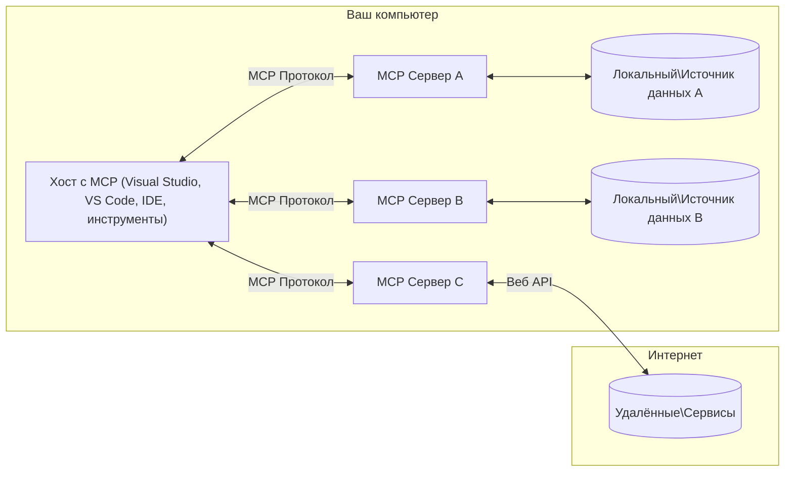

# Основные концепции MCP: Освоение протокола контекста модели для интеграции ИИ

[](https://youtu.be/earDzWGtE84)

_(Нажмите на изображение выше, чтобы посмотреть видео этого урока)_

[Протокол контекста модели (MCP)](https://github.com/modelcontextprotocol) — это мощный стандартизированный фреймворк, который оптимизирует коммуникацию между крупными языковыми моделями (LLM) и внешними инструментами, приложениями и источниками данных.  
В этом руководстве вы ознакомитесь с основными концепциями MCP. Вы узнаете о его клиент-серверной архитектуре, основных компонентах, механизмах связи и практиках реализации.

- **Явное согласие пользователя**: Для доступа к данным и выполнения операций требуется явное одобрение пользователя перед выполнением. Пользователи должны четко понимать, к каким данным будет осуществлен доступ и какие действия будут выполнены, с детальным контролем разрешений и авторизаций.

- **Защита конфиденциальности данных**: Данные пользователя раскрываются только с явного согласия и должны быть защищены надежными средствами контроля доступа на протяжении всего взаимодействия. Реализации должны предотвращать несанкционированную передачу данных и строго соблюдать границы конфиденциальности.

- **Безопасность выполнения инструментов**: Каждый вызов инструмента требует явного согласия пользователя с четким пониманием функционала, параметров и потенциального воздействия инструмента. Надежные защитные барьеры должны предотвращать непреднамеренное, небезопасное или вредоносное выполнение инструментов.

- **Защита канала передачи**: Все каналы связи должны использовать соответствующие механизмы шифрования и аутентификации. Удалённые соединения должны использовать безопасные транспортные протоколы и корректное управление учётными данными.

#### Рекомендации по реализации:

- **Управление правами доступа**: Реализуйте детальные системы разрешений, позволяющие пользователям контролировать доступ к серверам, инструментам и ресурсам  
- **Аутентификация и авторизация**: Используйте безопасные методы аутентификации (OAuth, API-ключи) с корректным управлением токенами и сроками их действия  
- **Валидация ввода**: Проверяйте все параметры и входные данные согласно определённым схемам во избежание инъекций  
- **Журналирование аудита**: Ведите полные логи всех операций для мониторинга безопасности и соблюдения требований

## Обзор

В этом уроке рассматривается фундаментальная архитектура и компоненты экосистемы Протокола контекста модели (MCP). Вы узнаете о клиент-серверной архитектуре, ключевых компонентах и механизмах связи, обеспечивающих взаимодействия в MCP.

## Ключевые цели обучения

В конце урока вы:

- Поймёте клиент-серверную архитектуру MCP.  
- Определите роли и обязанности Хостов, Клиентов и Серверов.  
- Проанализируете основные функции, делающие MCP гибким уровнем интеграции.  
- Узнаете, как происходит поток информации в экосистеме MCP.  
- Получите практические знания по примерам кода на .NET, Java, Python и JavaScript.

## Архитектура MCP: Глубокий взгляд

Экосистема MCP построена на модели клиент-сервер. Эта модульная структура позволяет AI-приложениям эффективно взаимодействовать с инструментами, базами данных, API и контекстными ресурсами. Распишем эту архитектуру на основные компоненты.

В основе MCP лежит клиент-серверная архитектура, в которой хост-приложение может подключаться к нескольким серверам:


```mermaid
flowchart LR
    subgraph "Ваш компьютер"
        Host["Хост с MCP (Visual Studio, VS Code, IDE, инструменты)"]
        S1["MCP Сервер A"]
        S2["MCP Сервер B"]
        S3["MCP Сервер C"]
        Host <-->|"MCP Протокол"| S1
        Host <-->|"MCP Протокол"| S2
        Host <-->|"MCP Протокол"| S3
        S1 <--> D1[("Локальный\Источник данных A")]
        S2 <--> D2[("Локальный\Источник данных B")]
    end
    subgraph "Интернет"
        S3 <-->|"Веб API"| D3[("Удалённые\Сервисы")]
    end
```
  
- **MCP-хосты**: программы вроде VSCode, Claude Desktop, IDE или AI-инструменты, желающие получить доступ к данным через MCP  
- **MCP-клиенты**: клиентские компоненты протокола, поддерживающие однозначные соединения с серверами  
- **MCP-серверы**: легковесные программы, предоставляющие конкретные возможности через стандартизованный Протокол контекста модели  
- **Локальные источники данных**: файлы, базы данных и сервисы вашего компьютера, к которым MCP-серверы имеют безопасный доступ  
- **Удалённые сервисы**: внешние системы в интернете, к которым MCP-серверы подключаются через API

Протокол MCP является развивающимся стандартом с версионированием по дате (формат ГГГГ-ММ-ДД). Текущая версия протокола — **2025-11-25**. Последние обновления спецификации доступны по ссылке [протокол спецификации](https://modelcontextprotocol.io/specification/2025-11-25/).

> **Взгляд в будущее:** релиз-кандидат следующей версии спецификации, **2026-07-28**, был объявлен в мае 2026 года и планируется к выпуску 28 июля 2026 года. В нем протокол становится безсостоянием на транспортном уровне (убираются рукопожатие `initialize` и идентификаторы сессий), формализуется фреймворк расширений, а также устаревшими объявляются Roots, Sampling и Logging в пользу новых паттернов. Подробнее смотрите в [Что меняется в MCP: релиз-кандидат 2026-07-28](./mcp-2026-07-28-release-candidate.md).

### 1. Хосты

В Протоколе контекста модели (MCP) **хосты** — это AI-приложения, выступающие в роли основного интерфейса, через который пользователи взаимодействуют с протоколом. Хосты координируют соединения с множеством MCP-серверов, создавая отдельный MCP-клиент для каждого подключения к серверу. Примеры хостов:

- **AI-приложения**: Claude Desktop, Visual Studio Code, Claude Code  
- **Среды разработки**: IDE и редакторы кода с интеграцией MCP  
- **Пользовательские приложения**: специально созданные AI-агенты и инструменты

**Хосты** — это приложения, координирующие взаимодействие с AI-моделями. Они:

- **Оркестрируют AI-модели**: выполняют или взаимодействуют с LLM для генерации ответов и координации AI-рабочих процессов  
- **Управляют соединениями клиентов**: создают и поддерживают по одному MCP-клиенту на каждое подключение к MCP-серверу  
- **Контролируют интерфейс пользователя**: управляют ходом диалога, взаимодействиями и представлением ответов  
- **Обеспечивают безопасность**: контролируют разрешения, ограничения безопасности и аутентификацию  
- **Обрабатывают согласия пользователей**: управляют пользовательским одобрением на совместное использование данных и выполнение инструментов

### 2. Клиенты

**Клиенты** — ключевые компоненты, которые поддерживают выделенные однозначные соединения между хостами и MCP-серверами. Каждый MCP-клиент создаётся хостом для подключения к определённому MCP-серверу, обеспечивая организованные и безопасные каналы связи. Несколько клиентов позволяют хостам одновременно подключаться к нескольким серверам.

**Клиенты** — это коннекторы внутри хост-приложения. Они:

- **Обеспечивают коммуникацию по протоколу**: отправляют на серверы запросы JSON-RPC 2.0 с промптами и инструкциями  
- **Ведут переговоры о возможностях**: согласовывают с серверами поддерживаемые функции и версии протокола при инициализации  
- **Управляют выполнением инструментов**: обрабатывают запросы на вызов инструментов от моделей и обрабатывают ответы  
- **Обрабатывают обновления в реальном времени**: принимают уведомления и обновления от серверов  
- **Обрабатывают ответы**: форматируют и подготавливают ответы серверов для отображения пользователям

### 3. Сервера

**Сервера** — программы, предоставляющие контекст, инструменты и функциональность MCP-клиентам. Они могут работать локально (на той же машине, что и хост) или удалённо (на внешних платформах) и отвечают за обработку запросов клиентов и выдачу структурированных ответов. Сервера открывают конкретный функционал через стандартизованный протокол MCP.

**Сервера** — сервисы, предоставляющие контекст и возможности. Они:

- **Регистрируют функции**: объявляют и открывают доступные примитивы (ресурсы, промпты, инструменты) для клиентов  
- **Обрабатывают запросы**: принимают и выполняют вызовы инструментов, запросы ресурсов и промптов от клиентов  
- **Предоставляют контекст**: обеспечивают контекстной информацией и данными для улучшения ответов моделей  
- **Управляют состоянием**: поддерживают состояние сессии и обрабатывают диалоговые взаимодействия с учётом состояния  
- **Отправляют уведомления в реальном времени**: информируют о изменениях возможностей и обновлениях подключённым клиентам

Сервера могут разрабатываться кем угодно для расширения возможностей модели специализированным функционалом и поддерживают локальное и удалённое развертывание.

### 4. Примитивы сервера

Сервера в Протоколе контекста модели (MCP) предоставляют три основных **примитива**, определяющих базовые строительные блоки для богатого взаимодействия между клиентами, хостами и языковыми моделями. Эти примитивы задают типы контекстной информации и доступных действий через протокол.

MCP-сервера могут открывать любую комбинацию из трёх основных примитивов:

#### Ресурсы

**Ресурсы** — источники данных, предоставляющие контекстную информацию AI-приложениям. Они представляют статический или динамический контент, который может улучшить понимание модели и принятие решений:

- **Контекстные данные**: структурированная информация и контекст для потребления AI-моделью  
- **Базы знаний**: репозитории документов, статьи, руководства и научные публикации  
- **Локальные источники данных**: файлы, базы данных и информация локальной системы  
- **Внешние данные**: ответы API, веб-сервисы и данные удалённых систем  
- **Динамический контент**: данные в реальном времени, обновляющиеся в зависимости от внешних условий

Ресурсы идентифицируются URI и поддерживают обнаружение через методы `resources/list` и получение через `resources/read`:

```text
file://documents/project-spec.md
database://production/users/schema
api://weather/current
```
  
#### Промпты

**Промпты** — многоразовые шаблоны, помогающие структурировать взаимодействия с языковыми моделями. Они предоставляют стандартизированные паттерны общения и шаблоны рабочих процессов:

- **Взаимодействия на основе шаблонов**: предварительно структурированные сообщения и начала диалогов  
- **Шаблоны рабочих процессов**: стандартизированные последовательности для типовых задач и сценариев  
- **Примеры few-shot**: шаблоны с примерами для обучения модели  
- **Системные промпты**: базовые промпты, задающие поведение и контекст модели  
- **Динамические шаблоны**: параметризованные промпты, адаптирующиеся к конкретному контексту

Промпты поддерживают подстановку переменных, могут быть обнаружены через `prompts/list` и получены через `prompts/get`:

```markdown
Generate a {{task_type}} for {{product}} targeting {{audience}} with the following requirements: {{requirements}}
```
  
#### Инструменты

**Инструменты** — выполняемые функции, которые языковые модели могут вызывать для совершения конкретных действий. Они представляют "глаголы" экосистемы MCP, позволяя моделям взаимодействовать с внешними системами:

- **Выполнимые функции**: отдельные операции, которые модели могут запускать с определёнными параметрами  
- **Интеграция с внешними системами**: вызовы API, запросы к базам данных, операции с файлами, вычисления  
- **Уникальная идентификация**: каждый инструмент имеет уникальное имя, описание и схему параметров  
- **Структурированный ввод/вывод**: инструменты принимают валидированные параметры и возвращают структурированные, типизированные ответы  
- **Возможности действий**: позволяют моделям выполнять реальные действия и получать актуальные данные

Инструменты описываются с помощью JSON Schema для валидации параметров, обнаруживаются через `tools/list` и вызываются через `tools/call`. Кроме того, инструменты могут содержать **иконки** как дополнительную метаинформацию для лучшего отображения в UI.

**Аннотации инструментов**: Инструменты поддерживают поведенческие аннотации (например, `readOnlyHint`, `destructiveHint`), описывающие, является ли инструмент только для чтения или разрушительным, что помогает клиентам принимать обоснованные решения о вызове инструмента.

Пример определения инструмента:

```typescript
server.tool(
  "search_products", 
  {
    query: z.string().describe("Search query for products"),
    category: z.string().optional().describe("Product category filter"),
    max_results: z.number().default(10).describe("Maximum results to return")
  }, 
  async (params) => {
    // Выполнить поиск и вернуть структурированные результаты
    return await productService.search(params);
  }
);
```
  
## Примитивы клиента

В Протоколе контекста модели (MCP) **клиенты** могут предоставлять примитивы, которые позволяют серверам запрашивать дополнительные возможности у хост-приложения. Эти клиентские примитивы обеспечивают более богатую, интерактивную реализацию серверов, доступ к возможностям AI-модели и взаимодействиям с пользователем.

### Семплирование

> **Уведомление об устаревании:** релиз-кандидат `2026-07-28` объявляет Sampling устаревшим в пользу прямой интеграции с API провайдеров LLM. Он продолжит работать в версии `2025-11-25` и как минимум год после устаревания, но новые разработки должны использовать новый паттерн. Подробнее см. [Что меняется в MCP: релиз-кандидат 2026-07-28](./mcp-2026-07-28-release-candidate.md).

**Sampling** позволяет серверам запрашивать дополнения языковой модели от AI-приложения клиента. Этот примитив даёт серверам доступ к возможностям LLM без необходимости включения собственных SDK моделей:

- **Независимый доступ к модели**: серверы могут получать дополнения, не включая SDK LLM и не управляя доступом к модели  
- **AI с инициативой сервера**: позволяет серверам автономно генерировать содержимое, используя модель клиента  
- **Рекурсивные взаимодействия с LLM**: поддерживает сложные сценарии, где серверам нужна помощь AI для обработки  
- **Динамическая генерация контента**: позволяет серверам создавать контекстные ответы, используя модель хоста  
- **Поддержка вызова инструментов**: серверы могут включать параметры `tools` и `toolChoice`, чтобы модель клиента могла вызывать инструменты во время семплирования

Семплирование инициируется методом `sampling/complete`, где серверы отправляют клиентам запросы на дополнение.

### Корни

> **Уведомление об устаревании:** релиз-кандидат `2026-07-28` объявляет Roots устаревшими в пользу параметров инструментов, URI ресурсов или конфигурации сервера. Они продолжают работать в версии `2025-11-25` и минимум год после устаревания. Подробнее см. [Что меняется в MCP: релиз-кандидат 2026-07-28](./mcp-2026-07-28-release-candidate.md).

**Roots** обеспечивают стандартизированный способ для клиентов открывать файловые границы серверам, помогая серверам понимать, к каким директориям и файлам у них есть доступ:

- **Файловые границы**: определяют пределы, в пределах которых серверы могут работать в файловой системе  
- **Управление доступом**: помогает серверам понимать, к каким директориям и файлам они имеют разрешение на доступ  
- **Динамические обновления**: клиенты уведомляют серверы при изменениях списка корней  
- **Идентификация через URI**: корни используют URI формата `file://` для идентификации доступных директорий и файлов

Корни обнаруживаются через метод `roots/list`, а клиенты отправляют `notifications/roots/list_changed` при изменениях корней.

### Выяснение (Elicitation)

**Выяснение** позволяет серверам запрашивать дополнительную информацию или подтверждение у пользователей через интерфейс клиента:

- **Запросы пользовательского ввода**: серверы могут запрашивать дополнительную информацию, необходимую для выполнения инструментов  
- **Диалоги подтверждения**: запрашивают одобрение пользователя для чувствительных или значимых операций  
- **Интерактивные рабочие процессы**: позволяют серверу создавать поэтапные взаимодействия с пользователем  
- **Динамический сбор параметров**: собирает отсутствующие или необязательные параметры в процессе выполнения инструментов

Запросы выяснения осуществляются методом `elicitation/request`, который собирает пользовательский ввод через интерфейс клиента.

**Режим URL-выяснения**: серверы могут также запрашивать взаимодействия с пользователем через URL, направляя их на внешние веб-страницы для аутентификации, подтверждения или ввода данных.

### Логирование
> **Уведомление об устаревании:** кандидат на выпуск `2026-07-28` объявляет Logging устаревшим в пользу `stderr` для stdio-транспортов и OpenTelemetry для структурированной наблюдаемости. Logging продолжит работать в версии `2025-11-25` и как минимум в течение года после объявления устаревания. См. [Что меняется в MCP: Кандидат на выпуск 2026-07-28](./mcp-2026-07-28-release-candidate.md).

**Logging** позволяет серверам отправлять структурированные сообщения журналов клиентам для отладки, мониторинга и операционной видимости:

- **Поддержка отладки**: позволяет серверам предоставлять детальные логи выполнения для устранения неполадок
- **Операционный мониторинг**: отправляет обновления статуса и метрики производительности клиентам
- **Отчетность об ошибках**: предоставляет подробный контекст ошибок и диагностическую информацию
- **Аудиторские следы**: создает комплексные логи операций и решений сервера

Сообщения логов отправляются клиентам для обеспечения прозрачности операций сервера и облегчения отладки.

## Поток информации в MCP

Протокол контекста модели (MCP) определяет структурированный поток информации между хостами, клиентами, серверами и моделями. Понимание этого потока помогает прояснить, как обрабатываются пользовательские запросы и как внешние инструменты и данные интегрируются в ответы модели.

- **Хост инициирует подключение**  
  Приложение хоста (например, IDE или интерфейс чата) устанавливает соединение с MCP-сервером, обычно через STDIO, WebSocket или другой поддерживаемый транспорт.

- **Согласование возможностей**  
  Клиент (встроенный в хост) и сервер обмениваются информацией о поддерживаемых функциях, инструментах, ресурсах и версиях протокола. Это гарантирует, что обе стороны понимают доступные возможности сеанса.

- **Запрос пользователя**  
  Пользователь взаимодействует с хостом (например, вводит запрос или команду). Хост собирает этот ввод и передает его клиенту для обработки.

- **Использование ресурса или инструмента**  
  - Клиент может запрашивать дополнительный контекст или ресурсы у сервера (например, файлы, записи базы данных или статьи базы знаний) для обогащения понимания модели.  
  - Если модель решает, что нужен инструмент (например, для получения данных, выполнения вычислений или вызова API), клиент отправляет запрос на вызов инструмента серверу, указывая имя инструмента и параметры.

- **Выполнение на сервере**  
  Сервер получает запрос на ресурс или инструмент, выполняет необходимые операции (например, запускает функцию, выполняет запрос к базе данных или получает файл) и возвращает результаты клиенту в структурированном формате.

- **Генерация ответа**  
  Клиент интегрирует ответы сервера (данные ресурсов, выводы инструментов и т. д.) во взаимодействие с моделью. Модель использует эту информацию для генерации комплексного и контекстуально релевантного ответа.

- **Представление результата**  
  Хост получает итоговый вывод от клиента и отображает его пользователю, зачастую включая как сгенерированный моделью текст, так и результаты выполнения инструментов или запросов ресурсов.

Этот поток позволяет MCP поддерживать продвинутые, интерактивные и осведомлённые о контексте AI-приложения, бесшовно связывая модели с внешними инструментами и источниками данных.

## Архитектура протокола и уровни

MCP состоит из двух четких архитектурных уровней, которые работают вместе для обеспечения полноценной коммуникационной системы:

### Уровень данных

**Уровень данных** реализует основной протокол MCP, используя **JSON-RPC 2.0** в качестве основы. Этот уровень определяет структуру сообщений, семантику и паттерны взаимодействия:

#### Основные компоненты:

- **Протокол JSON-RPC 2.0**: вся коммуникация использует стандартизированный формат сообщений JSON-RPC 2.0 для вызовов методов, ответов и уведомлений  
- **Управление жизненным циклом**: обработка инициализации соединения, согласования возможностей и завершения сеанса между клиентами и серверами  
- **Примитивы сервера**: позволяют серверам предоставлять основную функциональность через инструменты, ресурсы и подсказки  
- **Примитивы клиента**: позволяют серверам запрашивать семплирование из LLM, вызывать ввод пользователя и отправлять сообщения логов  
- **Уведомления в реальном времени**: поддержка асинхронных уведомлений для динамических обновлений без опроса

#### Ключевые особенности:

- **Согласование версий протокола**: применяется версия на основе даты (ГГГГ-ММ-ДД) для обеспечения совместимости  
- **Обнаружение возможностей**: обмен информацией о поддерживаемых функциях во время инициализации  
- **Сеансы с сохранением состояния**: поддержание состояния соединения между несколькими взаимодействиями для сохранения контекста

### Транспортный уровень

**Транспортный уровень** управляет каналами связи, кадрированием сообщений и аутентификацией между участниками MCP:

#### Поддерживаемые механизмы транспорта:

1. **STDIO транспорт**:  
   - Использует стандартные потоки ввода/вывода для прямой коммуникации процессов  
   - Оптимален для локальных процессов на одном устройстве без сетевых накладных расходов  
   - Часто используется для локальных реализаций MCP-серверов

2. **Транспорт на базе HTTP с потоковой передачей**:  
   - Использует HTTP POST для сообщений клиент → сервер  
   - Опционально поддерживает Server-Sent Events (SSE) для потоковой передачи сервер → клиент  
   - Позволяет удалённое взаимодействие через сети  
   - Поддерживает стандартную HTTP-аутентификацию (токены доступа, API ключи, пользовательские заголовки)  
   - MCP рекомендует OAuth для безопасной аутентификации на основе токенов

#### Абстракция транспорта:

Транспортный уровень абстрагирует детали коммуникации от уровня данных, позволяя использовать единый формат сообщений JSON-RPC 2.0 с любым механизмом транспорта. Эта абстракция позволяет приложениям бесшовно переключаться между локальными и удаленными серверами.

### Вопросы безопасности

Реализации MCP должны придерживаться нескольких ключевых принципов безопасности для гарантии безопасного, надежного и защищённого взаимодействия во всех операциях протокола:

- **Согласие и контроль пользователя**: пользователи должны давать явное согласие перед доступом к любым данным или выполнением операций. Они должны иметь чёткий контроль над тем, какие данные передаются и какие действия разрешены, с интуитивно понятными интерфейсами для просмотра и подтверждения активности.

- **Конфиденциальность данных**: данные пользователей должны передаваться только с явным согласием и быть защищены соответствующими механизмами контроля доступа. Реализации MCP обязаны предотвращать несанкционированную передачу данных и обеспечивать сохранение конфиденциальности во всех взаимодействиях.

- **Безопасность инструментов**: перед вызовом любого инструмента требуется явное согласие пользователя. Пользователи должны понимать функционал каждого инструмента, а также должны соблюдаться строгие границы безопасности для предотвращения случайного или небезопасного исполнения инструментов.

Следуя этим принципам безопасности, MCP обеспечивает доверие пользователей, сохранность приватности и безопасность во всех взаимодействиях протокола при обеспечении мощных AI-интеграций.

## Примеры кода: Ключевые компоненты

Ниже приведены примеры кода на нескольких популярных языках программирования, показывающие, как реализовать основные компоненты MCP-сервера и инструменты.

### Пример на .NET: Создание простого MCP-сервера с инструментами

Практический пример на .NET демонстрирует реализацию простого MCP-сервера с пользовательскими инструментами. В этом примере показано, как определить и зарегистрировать инструменты, обрабатывать запросы и подключить сервер с помощью Протокола контекста модели.

```csharp
using System;
using System.Threading.Tasks;
using ModelContextProtocol.Server;
using ModelContextProtocol.Server.Transport;
using ModelContextProtocol.Server.Tools;

public class WeatherServer
{
    public static async Task Main(string[] args)
    {
        // Create an MCP server
        var server = new McpServer(
            name: "Weather MCP Server",
            version: "1.0.0"
        );
        
        // Register our custom weather tool
        server.AddTool<string, WeatherData>("weatherTool", 
            description: "Gets current weather for a location",
            execute: async (location) => {
                // Call weather API (simplified)
                var weatherData = await GetWeatherDataAsync(location);
                return weatherData;
            });
        
        // Connect the server using stdio transport
        var transport = new StdioServerTransport();
        await server.ConnectAsync(transport);
        
        Console.WriteLine("Weather MCP Server started");
        
        // Keep the server running until process is terminated
        await Task.Delay(-1);
    }
    
    private static async Task<WeatherData> GetWeatherDataAsync(string location)
    {
        // This would normally call a weather API
        // Simplified for demonstration
        await Task.Delay(100); // Simulate API call
        return new WeatherData { 
            Temperature = 72.5,
            Conditions = "Sunny",
            Location = location
        };
    }
}

public class WeatherData
{
    public double Temperature { get; set; }
    public string Conditions { get; set; }
    public string Location { get; set; }
}
```

### Пример на Java: Компоненты MCP-сервера

Этот пример показывает тот же MCP-сервер и регистрацию инструментов, что и пример на .NET выше, но выполнен на Java.

```java
import io.modelcontextprotocol.server.McpServer;
import io.modelcontextprotocol.server.McpToolDefinition;
import io.modelcontextprotocol.server.transport.StdioServerTransport;
import io.modelcontextprotocol.server.tool.ToolExecutionContext;
import io.modelcontextprotocol.server.tool.ToolResponse;

public class WeatherMcpServer {
    public static void main(String[] args) throws Exception {
        // Создать MCP сервер
        McpServer server = McpServer.builder()
            .name("Weather MCP Server")
            .version("1.0.0")
            .build();
            
        // Зарегистрировать инструмент погоды
        server.registerTool(McpToolDefinition.builder("weatherTool")
            .description("Gets current weather for a location")
            .parameter("location", String.class)
            .execute((ToolExecutionContext ctx) -> {
                String location = ctx.getParameter("location", String.class);
                
                // Получить данные о погоде (упрощенно)
                WeatherData data = getWeatherData(location);
                
                // Вернуть отформатированный ответ
                return ToolResponse.content(
                    String.format("Temperature: %.1f°F, Conditions: %s, Location: %s", 
                    data.getTemperature(), 
                    data.getConditions(), 
                    data.getLocation())
                );
            })
            .build());
        
        // Подключить сервер с использованием stdio транспорта
        try (StdioServerTransport transport = new StdioServerTransport()) {
            server.connect(transport);
            System.out.println("Weather MCP Server started");
            // Поддерживать работу сервера до завершения процесса
            Thread.currentThread().join();
        }
    }
    
    private static WeatherData getWeatherData(String location) {
        // Реализация будет вызывать API погоды
        // Упрощено для примера
        return new WeatherData(72.5, "Sunny", location);
    }
}

class WeatherData {
    private double temperature;
    private String conditions;
    private String location;
    
    public WeatherData(double temperature, String conditions, String location) {
        this.temperature = temperature;
        this.conditions = conditions;
        this.location = location;
    }
    
    public double getTemperature() {
        return temperature;
    }
    
    public String getConditions() {
        return conditions;
    }
    
    public String getLocation() {
        return location;
    }
}
```

### Пример на Python: Создание MCP-сервера

Этот пример использует fastmcp, поэтому убедитесь, что он установлен:

```python
pip install fastmcp
```
Пример кода:

```python
#!/usr/bin/env python3
import asyncio
from fastmcp import FastMCP
from fastmcp.transports.stdio import serve_stdio

# Создать сервер FastMCP
mcp = FastMCP(
    name="Weather MCP Server",
    version="1.0.0"
)

@mcp.tool()
def get_weather(location: str) -> dict:
    """Gets current weather for a location."""
    return {
        "temperature": 72.5,
        "conditions": "Sunny",
        "location": location
    }

# Альтернативный подход с использованием класса
class WeatherTools:
    @mcp.tool()
    def forecast(self, location: str, days: int = 1) -> dict:
        """Gets weather forecast for a location for the specified number of days."""
        return {
            "location": location,
            "forecast": [
                {"day": i+1, "temperature": 70 + i, "conditions": "Partly Cloudy"}
                for i in range(days)
            ]
        }

# Зарегистрировать инструменты класса
weather_tools = WeatherTools()

# Запустить сервер
if __name__ == "__main__":
    asyncio.run(serve_stdio(mcp))
```

### Пример на JavaScript: Создание MCP-сервера

Этот пример показывает создание MCP-сервера на JavaScript и регистрацию двух инструментов для работы с погодой.

```javascript
// Использование официального SDK протокола Model Context
import { McpServer } from "@modelcontextprotocol/sdk/server/mcp.js";
import { StdioServerTransport } from "@modelcontextprotocol/sdk/server/stdio.js";
import { z } from "zod"; // Для проверки параметров

// Создать сервер MCP
const server = new McpServer({
  name: "Weather MCP Server",
  version: "1.0.0"
});

// Определить инструмент для погоды
server.tool(
  "weatherTool",
  {
    location: z.string().describe("The location to get weather for")
  },
  async ({ location }) => {
    // Обычно это бы вызвало погодное API
    // Упрощено для демонстрации
    const weatherData = await getWeatherData(location);
    
    return {
      content: [
        { 
          type: "text", 
          text: `Temperature: ${weatherData.temperature}°F, Conditions: ${weatherData.conditions}, Location: ${weatherData.location}` 
        }
      ]
    };
  }
);

// Определить инструмент прогноза
server.tool(
  "forecastTool",
  {
    location: z.string(),
    days: z.number().default(3).describe("Number of days for forecast")
  },
  async ({ location, days }) => {
    // Обычно это бы вызвало погодное API
    // Упрощено для демонстрации
    const forecast = await getForecastData(location, days);
    
    return {
      content: [
        { 
          type: "text", 
          text: `${days}-day forecast for ${location}: ${JSON.stringify(forecast)}` 
        }
      ]
    };
  }
);

// Вспомогательные функции
async function getWeatherData(location) {
  // Имитация вызова API
  return {
    temperature: 72.5,
    conditions: "Sunny",
    location: location
  };
}

async function getForecastData(location, days) {
  // Имитация вызова API
  return Array.from({ length: days }, (_, i) => ({
    day: i + 1,
    temperature: 70 + Math.floor(Math.random() * 10),
    conditions: i % 2 === 0 ? "Sunny" : "Partly Cloudy"
  }));
}

// Подключить сервер, используя транспорт stdio
const transport = new StdioServerTransport();
server.connect(transport).catch(console.error);

console.log("Weather MCP Server started");
```

Этот пример на JavaScript демонстрирует, как создать MCP-сервер с использованием SDK Протокола контекста модели. Показано, как зарегистрировать два инструмента с именами `weatherTool` и `forecastTool` и сделать их доступными для клиентов MCP через `StdioServerTransport`.

## Безопасность и авторизация

MCP включает несколько встроенных концепций и механизмов для управления безопасностью и авторизацией на протяжении всего протокола:

1. **Контроль прав доступа к инструментам**:  
   Клиенты могут указывать, какими инструментами модель разрешено пользоваться в рамках сессии. Это гарантирует, что доступны только явно разрешённые инструменты, снижая риск непреднамеренных или небезопасных операций. Права могут настраиваться динамически с учётом предпочтений пользователя, политик организации или контекста взаимодействия.

2. **Аутентификация**:  
   Сервера могут требовать аутентификации перед предоставлением доступа к инструментам, ресурсам или чувствительным операциям. Это может включать API ключи, OAuth токены или другие схемы аутентификации. Правильная аутентификация обеспечивает доступ только доверенных клиентов и пользователей к возможностям сервера.

3. **Валидация**:  
   Проверка параметров выполняется для всех вызовов инструментов. Каждый инструмент определяет ожидаемые типы, форматы и ограничения для своих параметров, а сервер валидирует входящие запросы соответственно. Это предотвращает попадание некорректных или вредоносных данных в реализацию инструментов и помогает поддерживать целостность операций.

4. **Ограничение частоты запросов**:  
   Для предотвращения злоупотреблений и обеспечения справедливого использования ресурсов сервера MCP-серверы могут применять ограничение частоты вызовов инструментов и доступа к ресурсам. Ограничения могут применяться по пользователю, по сессии или глобально, защищая от атак типа отказ в обслуживании или чрезмерного потребления ресурсов.

Комбинируя эти механизмы, MCP обеспечивает безопасную основу для интеграции языковых моделей с внешними инструментами и источниками данных, предоставляя пользователям и разработчикам точный контроль доступа и использования.

## Сообщения протокола и поток коммуникации

В MCP для обеспечения четких и надежных взаимодействий между хостами, клиентами и серверами используется структурированный формат сообщений **JSON-RPC 2.0**. Протокол определяет конкретные паттерны сообщений для различных типов операций:

### Основные типы сообщений:

#### **Сообщения инициализации**
- Запрос **`initialize`**: устанавливает соединение и согласовывает версию протокола и возможности  
- Ответ на **`initialize`**: подтверждает поддерживаемые функции и информацию о сервере  
- **`notifications/initialized`**: сигнализирует, что инициализация завершена и сессия готова

#### **Сообщения обнаружения**
- Запрос **`tools/list`**: получение списка доступных инструментов с сервера  
- Запрос **`resources/list`**: получение списка доступных ресурсов (источников данных)  
- Запрос **`prompts/list`**: получение списка доступных шаблонов подсказок

#### **Сообщения исполнения**  
- Запрос **`tools/call`**: выполнение конкретного инструмента с заданными параметрами  
- Запрос **`resources/read`**: получение содержимого конкретного ресурса  
- Запрос **`prompts/get`**: получение шаблона подсказки с опциональными параметрами

#### **Сообщения со стороны клиента**
- Запрос **`sampling/complete`**: сервер запрашивает завершение генерации LLM от клиента  
- Запрос **`elicitation/request`**: сервер запрашивает ввод пользователя через клиентский интерфейс  
- Сообщения логирования: сервер отправляет структурированные лог-сообщения клиенту

#### **Уведомления**
- **`notifications/tools/list_changed`**: сервер уведомляет клиента об изменениях в инструментах  
- **`notifications/resources/list_changed`**: сервер уведомляет клиента об изменениях в ресурсах  
- **`notifications/prompts/list_changed`**: сервер уведомляет клиента об изменениях в подсказках

### Структура сообщений:

Все сообщения MCP соответствуют формату JSON-RPC 2.0 с:  
- **Запросами**: включают `id`, `method` и опциональные `params`  
- **Ответами**: включают `id` и либо `result`, либо `error`  
- **Уведомлениями**: включают `method` и опциональные `params` (без `id` и ожидания ответа)

Эта структурированная коммуникация обеспечивает надежные, отслеживаемые и расширяемые взаимодействия, поддерживающие продвинутые сценарии, такие как обновления в реальном времени, цепочки вызовов инструментов и надежную обработку ошибок.

### Задачи (Экспериментально)

> **Взгляд в будущее:** кандидат на выпуск `2026-07-28` выводит Задачи из экспериментального ядра спецификации в отдельное расширение Tasks с переработанным жизненным циклом (`tasks/get`, `tasks/update`, `tasks/cancel`; запрос `tasks/list` удалён). Если вы используете экспериментальный API, описанный ниже, планируйте миграцию. Смотрите [Что меняется в MCP: Кандидат на выпуск 2026-07-28](./mcp-2026-07-28-release-candidate.md).

**Задачи** — экспериментальная возможность, предоставляющая долговременные обертки выполнения, позволяющие отложенный получение результатов и отслеживание статуса запросов MCP:

- **Долгие операции**: отслеживание затратных вычислений, автоматизация рабочих процессов и пакетная обработка  
- **Отложенные результаты**: опрос статуса задачи и получение результатов после завершения операций  
- **Отслеживание статуса**: наблюдение прогресса задачи через определённые состояния жизненного цикла  
- **Многошаговые операции**: поддержка сложных рабочих процессов, охватывающих несколько взаимодействий

Задачи оборачивают стандартные запросы MCP, обеспечивая асинхронные паттерны выполнения для операций, которые не могут быть выполнены немедленно.

## Основные выводы

- **Архитектура**: MCP использует клиент-серверную архитектуру, где хосты управляют несколькими клиентскими подключениями к серверам  
- **Участники**: экосистема включает хосты (AI-приложения), клиенты (протокольные коннекторы) и серверы (провайдеры возможностей)  
- **Механизмы транспорта**: коммуникация поддерживает STDIO (локально) и Streamable HTTP с опциональным SSE (удалённо)  
- **Основные примитивы**: серверы предоставляют инструменты (выполнимые функции), ресурсы (источники данных) и подсказки (шаблоны)  
- **Примитивы клиента**: серверы могут запрашивать семплирование (LLM-завершения с поддержкой вызова инструментов), elicitation (ввод пользователя, включая URL-режим), roots (границы файловой системы) и логирование у клиентов  
- **Экспериментальные возможности**: Задачи предоставляют долговременные обёртки для долгих операций  
- **Основы протокола**: построен на JSON-RPC 2.0 с версионированием по дате (текущая версия: 2025-11-25)  
- **Возможности реального времени**: поддержка уведомлений для динамических обновлений и синхронизации в реальном времени  
- **Безопасность превыше всего**: явное согласие пользователя, защита конфиденциальности и безопасный транспорт — ключевые требования

## Упражнение

Спроектируйте простой инструмент MCP, полезный в вашей области. Определите:  
1. Как будет называться инструмент  
2. Какие параметры он принимает  
3. Какой вывод он возвращает  
4. Как модель может использовать этот инструмент для решения задач пользователя


---

## Что дальше

Далее: [Глава 2: Безопасность](../02-Security/README.md)
Интересно, что будет после `2025-11-25`? Читайте [Что меняется в MCP: кандидат на выпуск 2026-07-28](./mcp-2026-07-28-release-candidate.md).

---

<!-- CO-OP TRANSLATOR DISCLAIMER START -->
**Отказ от ответственности**:
Этот документ был переведен с использованием сервиса машинного перевода [Co-op Translator](https://github.com/Azure/co-op-translator). Несмотря на наши усилия по обеспечению точности, имейте в виду, что автоматический перевод может содержать ошибки или неточности. Оригинальный документ на его исходном языке следует считать авторитетным источником. Для получения критически важной информации рекомендуется обратиться к профессиональному человеческому переводу. Мы не несем ответственности за любые недоразумения или неправильные толкования, возникшие в результате использования этого перевода.
<!-- CO-OP TRANSLATOR DISCLAIMER END -->