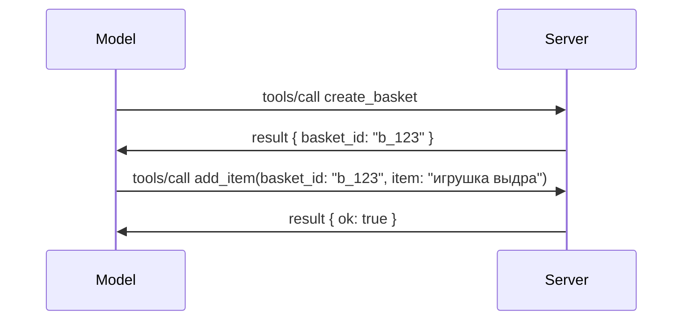

# Что меняется в MCP: кандидат на выпуск 2026-07-28

> **Статус:** Кандидат на выпуск. Спецификация `2026-07-28` на момент написания не является окончательной. Она была объявлена 21 мая 2026 года и запланирована к выпуску 28 июля 2026 года. Всё, что описано в этом уроке, относится к кандидату на выпуск; перед разработкой на её основе заглядывайте в [черновик спецификации](https://modelcontextprotocol.io/specification/draft) и её [журнал изменений](https://modelcontextprotocol.io/specification/draft/changelog) для актуального статуса. Остальная часть этого курса написана на основе текущего стабильного выпуска, **MCP Specification 2025-11-25**, и будет обновлена после выхода `2026-07-28`.

## Обзор

`2026-07-28` — крупнейший пересмотр MCP с момента запуска. Шесть proposals по улучшению спецификации (SEPs) убирают сессии на уровне протокола и делают MCP бессостоянным на транспортном уровне, расширения становятся полноценным, версионируемым механизмом, а несколько функций, изученных ранее в этом курсе (Roots, Sampling, Logging), объявлены устаревшими согласно новой политике жизненного цикла. Этот урок подводит итоги изменений, почему они важны и что это значит для уже написанного вами кода на основе `2025-11-25`.

Источник: [The 2026-07-28 MCP Specification Release Candidate](https://blog.modelcontextprotocol.io/posts/2026-07-28-release-candidate/) (блог Model Context Protocol, David Soria Parra и Den Delimarsky).

## Цели обучения

К концу этого урока вы сможете:

- Объяснить, почему MCP переходит к бессостояному ядру протокола и какую проблему это решает для горизонтально масштабируемых развертываний.
- Описать, как заменены рукопожатие `initialize`/`initialized` и заголовок `Mcp-Session-Id`.
- Выделить новые заголовки `Mcp-Method` и `Mcp-Name` и метаданные кэширования `ttlMs`/`cacheScope`.
- Узнать о framework расширений и двух расширениях, выпускаемых с этим релизом: MCP Apps и Tasks.
- Перечислить шесть SEP по авторизации, усиливающих соответствие OAuth 2.0 / OIDC.
- Определить, какие основные функции (Roots, Sampling, Logging) теперь устарели и что это значит на практике.
- Объяснить изменение полного JSON Schema 2020-12 для `inputSchema`/`outputSchema` в инструментах.

## Бессостояный протокол

Главное изменение: MCP становится бессостояным на уровне протокола.

### Раньше (2025-11-25): сессии «привязывают» вас к одному серверу

Вызов инструмента через Streamable HTTP начинается с рукопожатия `initialize`. Сервер отвечает заголовком `Mcp-Session-Id`, который должен присутствовать во всех последующих запросах:

```http
POST /mcp HTTP/1.1
Mcp-Session-Id: 1868a90c-3a3f-4f5b
Content-Type: application/json

{"jsonrpc":"2.0","id":2,"method":"tools/call",
 "params":{"name":"search","arguments":{"q":"otters"}}}
```

Поскольку сессия привязана к тому серверу, который её выдал, для горизонтально масштабируемых развертываний требовалась **привязка маршрутизации (sticky routing)** на балансировщике нагрузки и **общий стор сессий** между инстансами.

### Теперь (2026-07-28): каждый запрос автономен

```http
POST /mcp HTTP/1.1
MCP-Protocol-Version: 2026-07-28
Mcp-Method: tools/call
Mcp-Name: search
Content-Type: application/json

{"jsonrpc":"2.0","id":1,"method":"tools/call",
 "params":{"name":"search","arguments":{"q":"otters"},
           "_meta":{"io.modelcontextprotocol/clientInfo":{"name":"my-app","version":"1.0"}}}}
```

Любой серверный инстанс может обработать этот запрос. Ключевые изменения:

- **Рукопожатие `initialize`/`initialized` удалено** ([SEP-2575](https://github.com/modelcontextprotocol/modelcontextprotocol/pull/2575)). Версия протокола, информация о клиенте и его возможностях перемещены в `_meta` каждого запроса. Новый метод `server/discover` позволяет клиенту заранее получить возможности сервера при необходимости.
- **Заголовок `Mcp-Session-Id` и протокольная сессия удалены** ([SEP-2567](https://github.com/modelcontextprotocol/modelcontextprotocol/pull/2567)). Привязка маршрутизации и общий стор сессий больше не нужны на уровне протокола.

### Бессостояный протокол, состояниевые приложения

Удаление сессий на уровне протокола не означает, что ваш сервер не может быть состояния. Рекомендуемый паттерн такой же, как всегда использовали HTTP API: создавать явный идентификатор (например, `basket_id`, `browser_id`) в одном вызове инструмента, и модель передаёт этот идентификатор обратно как обычный аргумент в последующих вызовах.



Это делает состояние видимым и осмысленным для модели вместо сокрытия в транспортных метаданных и позволяет любому серверу обрабатывать любой вызов.

### Запросы от сервера к клиенту — новая структура

Бессостояный протокол все еще требует способа, чтобы сервер мог запросить у клиента что-то во время вызова (например, запрос данных):

- **Запросы, инициализированные сервером, могут выполняться только пока сервер активно обрабатывает клиентский запрос** ([SEP-2260](https://github.com/modelcontextprotocol/modelcontextprotocol/pull/2260)) — ранее рекомендация, теперь обязательство. Пользователь никогда не будет внезапно запрошен «из ниоткуда».
- **Мультитуровые запросы (Multi Round-Trip Requests)** ([SEP-2322](https://github.com/modelcontextprotocol/modelcontextprotocol/pull/2322)) заменяют удержание потока SSE открытым. Вместо этого сервер возвращает `InputRequiredResult`:

  ```json
  {
    "resultType": "inputRequired",
    "inputRequests": {
      "confirm": {
        "type": "elicitation",
        "message": "Delete 3 files?",
        "schema": { "type": "boolean" }
      }
    },
    "requestState": "eyJzdGVwIjoxLCJmaWxlcyI6WyJhIiwiYiIsImMiXX0="
  }
  ```

  Клиент собирает ответы и повторно вызывает исходный запрос с `inputResponses` плюс эхо `requestState`. Любой серверный инстанс может обработать повторный запрос, потому что всё необходимое содержится в нагрузке.

### Маршрутизируемо, кэшируемо, трассируемо

Три мелких изменения делают работу с бессостояным трафиком проще:

- **Заголовки `Mcp-Method` и `Mcp-Name` обязательны в Streamable HTTP** ([SEP-2243](https://github.com/modelcontextprotocol/modelcontextprotocol/pull/2243)), чтобы балансировщики нагрузки, шлюзы и лимитеры могли маршрутизировать операции по заголовкам без анализа JSON тела. Серверы отклоняют запросы, где заголовки и тело расходятся.
- **Результаты `tools/list` и чтения ресурсов содержат `ttlMs` и `cacheScope`** ([SEP-2549](https://github.com/modelcontextprotocol/modelcontextprotocol/pull/2549)), смоделированные по аналогии с HTTP `Cache-Control`. Клиенты знают, как долго результат списка свеж, и можно ли безопасно его шарить между пользователями, без необходимости большого жизненного цикла SSE потока для отслеживания изменений.
- **Документирована передача W3C Trace Context в `_meta`** ([SEP-414](https://github.com/modelcontextprotocol/modelcontextprotocol/pull/414)), исправлены имена ключей `traceparent`, `tracestate` и `baggage`, чтобы распределённая трассировка могла следовать за вызовом через SDK клиента, сервер MCP и другие системы в бэкенде, совместимом с [OpenTelemetry](https://opentelemetry.io/).

## Расширения становятся полноценными

Расширения существовали в неформальном виде в `2025-11-25`. [SEP-2133](https://github.com/modelcontextprotocol/modelcontextprotocol/pull/2133) формализует их:

- Расширения идентифицируются обратными DNS ID.
- Они согласуются через карту `extensions` в возможностях клиента и сервера.
- Они существуют в собственных репозиториях `ext-*` с делегированными менеджерами и версионируются независимо от основной спецификации.
- Новый трек Extensions в процессе SEP даёт им путь от экспериментальных до официальных.

В этом релизе поставляются два официальных расширения.

### MCP Apps: серверные пользовательские интерфейсы

[MCP Apps](https://blog.modelcontextprotocol.io/posts/2026-01-26-mcp-apps/) ([SEP-1865](https://github.com/modelcontextprotocol/modelcontextprotocol/pull/1865)) позволяет серверам поставлять интерактивные HTML-интерфейсы, которые хосты рендерят в изолированном iframe. Инструменты заранее объявляют свои шаблоны UI, чтобы хосты могли их предварительно загружать, кэшировать и проверять безопасность до запуска. Вы уже изучали основы в [Уроке 15: MCP Apps](../03-GettingStarted/15-mcp-apps/README.md) — теперь MCP Apps официально являются расширением, а не экспериментальной функцией ядра.

### Tasks становится расширением

Tasks поставлялись как экспериментальная функция ядра в `2025-11-25`. Производственное использование выявило значительную доработку, так что правильное место — расширение: [Tasks extension](https://github.com/modelcontextprotocol/modelcontextprotocol/pull/2663) меняет жизненный цикл в бессостоящей модели — сервер может ответить на `tools/call` дескриптором задачи, и клиент управляет ею через `tasks/get`, `tasks/update` и `tasks/cancel`. Создание задач управляется сервером: клиент объявляет расширение, сервер решает, какой вызов запускать как задачу. `tasks/list` полностью удалён, так как не может быть безопасно сфокусирован без сессий.

> **Примечание по миграции:** если вы реализовали экспериментальный API Tasks `2025-11-25`, вам потребуется мигрировать на новый жизненный цикл расширения — он не обратно совместим.

## Усиление авторизации

Шесть SEP усиливают [спецификацию авторизации](https://modelcontextprotocol.io/specification/draft/basic/authorization) для более полной интеграции с реальными OAuth 2.0 / OpenID Connect процессами:

| SEP | Изменение |
|---|---|
| [SEP-2468](https://github.com/modelcontextprotocol/modelcontextprotocol/pull/2468) | Клиенты должны проверять параметр `iss` в ответах авторизации согласно [RFC 9207](https://www.rfc-editor.org/rfc/rfc9207), что снижает риски атак смешивания, характерных для MCP с одним клиентом и множеством серверов. Будущие версии потребуют отклонять ответы без `iss`. |
| [SEP-837](https://github.com/modelcontextprotocol/modelcontextprotocol/pull/837) | Клиенты декларируют `application_type` OpenID Connect во время Dynamic Client Registration, чтобы избежать ошибочного указания типа 'web' для десктопных/CLI клиентов и отклонения redirect URI localhost. |
| [SEP-2352](https://github.com/modelcontextprotocol/modelcontextprotocol/pull/2352) | Клиенты связывают зарегистрированные учётные данные с `issuer` сервера авторизации и повторно регистрируются при миграции ресурсов между серверами. |
| [SEP-2207](https://github.com/modelcontextprotocol/modelcontextprotocol/pull/2207) | Документирует способ запроса refresh token у OpenID Connect-подобных серверов авторизации. |
| [SEP-2350](https://github.com/modelcontextprotocol/modelcontextprotocol/pull/2350) | Проясняет накопление scope при повышении авторизации. |
| [SEP-2351](https://github.com/modelcontextprotocol/modelcontextprotocol/pull/2351) | Проясняет окончание пути `.well-known` для discovery. |

Если вы сегодня строите сервер авторизации для MCP, начните передавать `iss` в ответах уже сейчас — смотрите [02-Security](../02-Security/README.md) для текущих рекомендаций по авторизации, которые будут на этом строиться.

## Roots, Sampling и Logging устарели

В соответствии с новой [политикой жизненного цикла функций](https://github.com/modelcontextprotocol/modelcontextprotocol/pull/2577) ([SEP-2577](https://github.com/modelcontextprotocol/modelcontextprotocol/pull/2577)) три основные примитивы клиента, которые вы изучали в [Основных понятиях](./README.md#roots), переходят в статус **Устаревшие**:

| Функция | Рекомендуемая замена |
|---|---|
| Roots | Параметры инструментов, URI ресурсов или конфигурация сервера |
| Sampling | Прямые интеграции с API LLM-поставщиков |
| Logging | `stderr` для транспортов stdio; OpenTelemetry для структурированной наблюдаемости |

Это **устаревание с пометкой только для аннотаций**: методы, типы и флаги возможностей остаются работоспособными в этом релизе и во всех версиях спецификации, опубликованных в течение года после него. Удаление будет требовать отдельного SEP по политике жизненного цикла — так что ничего не сломается в имеющихся у вас примерах [Sampling](../03-GettingStarted/14-sampling/README.md), но новые серверы должны предпочитать описанные заменители.

## Полный JSON Schema 2020-12 для инструментов

`inputSchema` и `outputSchema` инструментов подняты до полноценного [JSON Schema 2020-12](https://json-schema.org/draft/2020-12) ([SEP-2106](https://github.com/modelcontextprotocol/modelcontextprotocol/pull/2106)):

- Входные схемы сохраняют ограничение корня `type: "object"`, но теперь поддерживают композицию (`oneOf`, `anyOf`, `allOf`), условия и ссылки (`$ref`, `$defs`).
- Выходные схемы снимают все ограничения, а `structuredContent` теперь может быть любым JSON-значением, а не только объектом.
- Реализации должны не делать автоматического разыменования внешних URI `$ref` и ограничивать глубину схемы и время валидации (учитывая возможность DoS-атак при валидации схем на сервере).

Отдельно, код ошибки для отсутствующего ресурса меняется с собственного MCP `-32002` на стандартный JSON-RPC `-32602` (Invalid Params) ([SEP-2164](https://github.com/modelcontextprotocol/modelcontextprotocol/pull/2164)). Если ваш клиент распознаёт именно `-32002`, его потребуется обновить.

## Как протокол будет развиваться дальше

Этот релиз содержит ломающие изменения, что MCP мейнтейнеры не планируют делать нормой в будущем. Три SEP по управлению направлены на предотвращение повторений:

- **Политика жизненного цикла функций** даёт каждой функции путь Активно → Устаревшее → Удалено с минимум двенадцатью месяцами между устареванием и возможным удалением.
- **Фреймворк расширений** позволяет новым возможностям появляться в виде опциональных расширений и стабилизироваться там до (если вообще) включения в основную спецификацию.
- SEP стандарта дорожной карты больше не может достичь статуса Final до тех пор, пока соответствующий сценарий не будет включён в [набор соответствия](https://github.com/modelcontextprotocol/conformance) ([SEP-2484](https://github.com/modelcontextprotocol/modelcontextprotocol/pull/2484)) — тот же набор, против которого система уровней [SDK](https://github.com/modelcontextprotocol/modelcontextprotocol/pull/1777) оценивает официальные SDK.

## Временная шкала релиза и проверка

- Кандидат в релизы был зафиксирован 21 мая 2026 года.
- Финальная спецификация запланирована на 28 июля 2026 года.
- Десятинедельный интервал между ними позволяет поддерживающим SDK и реализующим клиентам проверить изменения на реальных нагрузках; SDK первого уровня ожидается поддержка в этом периоде согласно [системе уровней SDK](https://modelcontextprotocol.io/docs/sdk).
- Отслеживайте полный набор изменений в [черновой спецификации](https://modelcontextprotocol.io/specification/draft) и её [журнале изменений](https://modelcontextprotocol.io/specification/draft/changelog).

## Что это значит для этого учебного плана

Всё, чему вы научились до сих пор в этом курсе, ориентировано на **2025-11-25**, который остается текущей стабильной спецификацией до выхода версии `2026-07-28`. Конкретно:

- **Сессии и рукопожатие `initialize`** (рассмотрены в [Основных Концепциях](./README.md) и [Уроке 6: HTTP Streaming](../03-GettingStarted/06-http-streaming/README.md)) пока работают так, как описано сегодня, но ожидайте их замены моделью без состояния запросов, указанной выше, после обновления до совместимых SDK `2026-07-28`.
- **Сэмплинг и Корни** (также обсуждены в [Основных Концепциях](./README.md)) по-прежнему полностью функционируют, но устарели — новые разработки должны предпочесть вышеупомянутые шаблоны замены.
- **Экспериментальная функция Tasks**, если вы её использовали, потребует миграции к новому жизненному циклу расширения Tasks.
- **MCP-приложения** ([Урок 15](../03-GettingStarted/15-mcp-apps/README.md)) практически не затрагиваются; они просто переходят под формальный фреймворк расширений.

## Дополнительные ресурсы

- [Кандидат в релизы спецификации MCP 2026-07-28 (блог)](https://blog.modelcontextprotocol.io/posts/2026-07-28-release-candidate/)
- [Будущее транспортов MCP](https://blog.modelcontextprotocol.io/posts/2025-12-19-mcp-transport-future/)
- [Черновая спецификация MCP](https://modelcontextprotocol.io/specification/draft)
- [Журнал изменений черновой спецификации MCP](https://modelcontextprotocol.io/specification/draft/changelog)
- [Руководство SEP](https://modelcontextprotocol.io/community/sep-guidelines)
- [Система уровней MCP SDK](https://modelcontextprotocol.io/docs/sdk)

## Следующие шаги

Вернитесь к [Основным Концепциям](./README.md) или продолжайте к [Безопасности](../02-Security/README.md), чтобы увидеть, как сегодняшние рекомендации `2025-11-25` сопоставляются с грядущим.

---

<!-- CO-OP TRANSLATOR DISCLAIMER START -->
**Отказ от ответственности**:
Этот документ был переведен с использованием сервиса машинного перевода [Co-op Translator](https://github.com/Azure/co-op-translator). Несмотря на наши усилия по обеспечению точности, имейте в виду, что автоматический перевод может содержать ошибки или неточности. Оригинальный документ на его исходном языке следует считать авторитетным источником. Для получения критически важной информации рекомендуется обратиться к профессиональному человеческому переводу. Мы не несем ответственности за любые недоразумения или неправильные толкования, возникшие в результате использования этого перевода.
<!-- CO-OP TRANSLATOR DISCLAIMER END -->