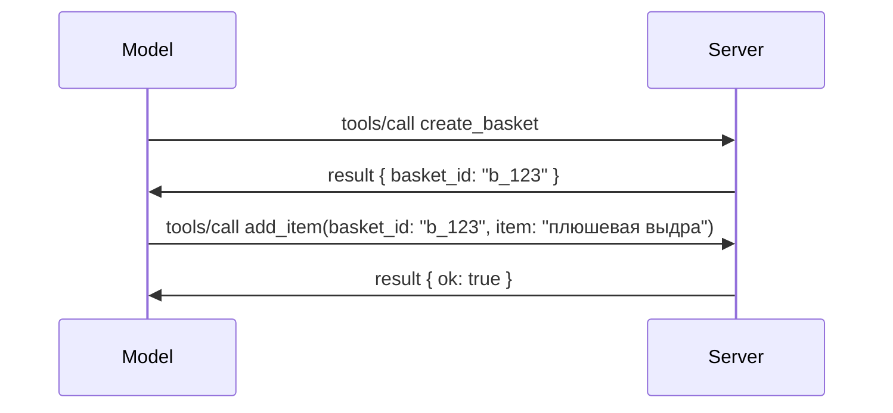

# Что изменилось в MCP: спецификация 2026-07-28

> **Статус:** Финальная. Спецификация MCP `2026-07-28` выпущена 28 июля 2026 года
> и является текущей версией протокола. Этот урок описывает финальную
> спецификацию. Некоторые примеры из учебной программы явно остаются версионированными как
> `2025-11-25`, поскольку их SDK ещё не перешли на новый статeless API;
> рассматривайте эти примеры как руководство по совместимости с устаревшей версией.

## Обзор

`2026-07-28` — это крупнейшее обновление MCP с момента запуска. Шесть
предложений по улучшению спецификации (SEP) убирают сессионный уровень протокола и
делают MCP статeless на транспортном уровне, расширения становятся полноценным,
версионированным механизмом, а несколько функций, описанных ранее в этой учебной программе
(Roots, Sampling, Logging) устарели с введением новой политики жизненного цикла. Этот
урок подводит итоги того, что изменилось, почему это важно и что это значит для кода,
написанного под `2025-11-25`.

Источник: [The 2026-07-28 MCP Specification Release Candidate](https://blog.modelcontextprotocol.io/posts/2026-07-28-release-candidate/) (Блог Model Context Protocol, David Soria Parra и Den Delimarsky).

## Цели обучения

К концу этого урока вы сможете:

- Объяснить, почему MCP переходит к протокольному ядру без состояния и какую проблему это решает для горизонтально масштабируемых развёртываний.
- Описать, как заменяется рукопожатие `initialize`/`initialized` и заголовок `Mcp-Session-Id`.
- Опознать новые заголовки `Mcp-Method` и `Mcp-Name` и метаданные кеширования `ttlMs`/`cacheScope`.
- Узнать фреймворк расширений и два расширения, включённые в этот релиз: MCP Apps и Tasks.
- Подытожить ужесточение авторизации и депрекацию Dynamic Client Registration.
  
- Определить, какие основные функции (Roots, Sampling, Logging) теперь устарели и что это означает на практике.
- Объяснить изменение полного JSON Schema 2020-12 для инструментов `inputSchema`/`outputSchema`.

## Протокол без состояния

Главный изменённый момент: MCP становится статeless на уровне протокола.

### Раньше (2025-11-25): сессии привязывали вас к одному серверу

Вызов инструмента через Streamable HTTP начинается с рукопожатия `initialize`. Сервер отвечает заголовком `Mcp-Session-Id`, который должен присутствовать во всех последующих запросах:

```http
POST /mcp HTTP/1.1
Mcp-Session-Id: 1868a90c-3a3f-4f5b
Content-Type: application/json

{"jsonrpc":"2.0","id":2,"method":"tools/call",
 "params":{"name":"search","arguments":{"q":"otters"}}}
```

Поскольку сессия привязана к тому серверному экземпляру, который её выдал, горизонтально масштабируемые развёртывания требуют **принудительной маршрутизации** на уровне балансировщика и **общего хранилища сессий** между экземплярами.

### Теперь (2026-07-28): каждый запрос самодостаточен

```http
POST /mcp HTTP/1.1
MCP-Protocol-Version: 2026-07-28
Mcp-Method: tools/call
Mcp-Name: search
Content-Type: application/json

{"jsonrpc":"2.0","id":1,"method":"tools/call",
 "params":{"name":"search","arguments":{"q":"otters"},
           "_meta":{"io.modelcontextprotocol/protocolVersion":"2026-07-28",
                    "io.modelcontextprotocol/clientInfo":{"name":"my-app","version":"1.0"},
                    "io.modelcontextprotocol/clientCapabilities":{}}}}
```

Любой серверный экземпляр может обработать этот запрос. Основные изменения:

- **Рукопожатие `initialize`/`initialized` удалено** ([SEP-2575](https://github.com/modelcontextprotocol/modelcontextprotocol/pull/2575)). Версия протокола, информация о клиенте и его возможностях теперь передаются в `_meta` каждого запроса. Новый метод `server/discover` позволяет клиенту получить возможности сервера заранее, когда это необходимо.

- **Заголовок `Mcp-Session-Id` и сессия на уровне протокола удалены** ([SEP-2567](https://github.com/modelcontextprotocol/modelcontextprotocol/pull/2567)). Механизмы липкой маршрутизации и общие хранилища сессий больше не требуются на уровне протокола.

### Беспатный протокол, приложения с состоянием

Удаление сессии на уровне протокола не означает, что ваш сервер не может иметь состояние. Рекомендуемый принцип тот же, что всегда использовали HTTP API: создать явный идентификатор (например, `basket_id`, `browser_id`) в одном вызове инструмента и передавать этот идентификатор обратно модели как обычный аргумент в последующих вызовах.



Это делает состояние видимым и понятным модели, а не скрывает его в метаданных транспорта, и позволяет любому экземпляру сервера обрабатывать любой вызов.

### Запросы от сервера к клиенту, реорганизованные

Беспатный протокол все равно нуждается в способе, чтобы сервер мог запросить у клиента что-то в процессе вызова (например, запрос на уточнение):

- **Запросы, инициируемые сервером, могут отправляться только в то время, когда сервер активно обрабатывает клиентский запрос** ([SEP-2260](https://github.com/modelcontextprotocol/modelcontextprotocol/pull/2260)) — ранее рекомендация, теперь требование. Пользователя никогда не просят без причины.
- **Многораундовые запросы** ([SEP-2322](https://github.com/modelcontextprotocol/modelcontextprotocol/pull/2322)) заменяют удерживание SSE-потока открытым. Вместо этого сервер возвращает `InputRequiredResult`:

  ```json
  {
    "resultType": "input_required",
    "inputRequests": {
      "confirm": {
        "type": "elicitation",
        "message": "Delete 3 files?",
        "schema": { "type": "boolean" }
      }
    },
    "requestState": "eyJzdGVwIjoxLCJmaWxlcyI6WyJhIiwiYiIsImMiXX0="
  }
  ```

  Клиент собирает ответы и повторно вызывает исходный запрос с `inputResponses` и эхо `requestState`. Любой экземпляр сервера может обработать повтор, так как все необходимое содержится в полезной нагрузке.

### Маршрутизируемый, кэшируемый, трассируемый

Три небольших изменения делают трафик без состояния проще в эксплуатации:

- **Заголовки `Mcp-Method` и `Mcp-Name` обязательны в Streamable HTTP** ([SEP-2243](https://github.com/modelcontextprotocol/modelcontextprotocol/pull/2243)), чтобы балансировщики нагрузки, шлюзы и ограничители скорости могли маршрутизировать на основе операции без анализа JSON-тела. Серверы отвергают запросы, если заголовки и тело не совпадают.
- **`tools/list` и результаты чтения ресурсов содержат `ttlMs` и `cacheScope`** ([SEP-2549](https://github.com/modelcontextprotocol/modelcontextprotocol/pull/2549)), смоделированные по образцу HTTP `Cache-Control`. Клиенты знают, как долго результаты списка актуальны и можно ли безопасно их распространять между пользователями, без необходимости постоянного SSE-потока для получения обновлений.
- **Документирована передача W3C Trace Context в `_meta`** ([SEP-414](https://github.com/modelcontextprotocol/modelcontextprotocol/pull/414)), исправлены имена ключей `traceparent`, `tracestate` и `baggage`, чтобы распределенная трассировка могла проследить вызов через клиентский SDK, MCP сервер и downstream системы в совместимой с [OpenTelemetry](https://opentelemetry.io/) backend-системе.

## Расширения становятся первоклассными

Расширения существовали неофициально в `2025-11-25`. [SEP-2133](https://github.com/modelcontextprotocol/modelcontextprotocol/pull/2133) формализует их:

- Расширения идентифицируются через обратные DNS ID.
- Они согласовываются через карту `extensions` в возможностях клиента и сервера.

- Они живут в собственных репозиториях `ext-*` с делегированными ответственными и версионируются независимо от основной спецификации.
- Новый трек расширений в процессе SEP дает им путь от экспериментального до официального.

В этом выпуске представлены два официальных расширения.


### MCP Apps: серверные пользовательские интерфейсы

[MCP Apps](https://blog.modelcontextprotocol.io/posts/2026-01-26-mcp-apps/) ([SEP-1865](https://github.com/modelcontextprotocol/modelcontextprotocol/pull/1865)) позволяют серверам отправлять интерактивные HTML-интерфейсы, которые хосты отображают в изолированном iframe. Инструменты заранее объявляют свои шаблоны UI, чтобы хосты могли предварительно загружать, кешировать и проводить проверку безопасности перед запуском. Основы этого вы уже изучили в [Уроке 15: MCP Apps](../03-GettingStarted/15-mcp-apps/README.md) — в рамках Extensions framework MCP Apps теперь официально являются расширением, а не экспериментальной базовой функцией.

### Tasks переходит в расширение

Tasks поставлялись в виде экспериментальной базовой функции в `2025-11-25`. Практическое использование выявило достаточно изменений дизайна, что правильным решением стало вынести её в расширение: [Tasks extension](https://github.com/modelcontextprotocol/modelcontextprotocol/pull/2663) перестраивает жизненный цикл вокруг статeless модели — сервер может ответить на `tools/call` дескриптором задачи, а клиент управляет его выполнением через `tasks/get`, `tasks/update` и `tasks/cancel`. Создание задач направляется сервером: клиент объявляет расширение, а сервер решает, когда вызов должен выполняться как задача. `tasks/list` полностью удалён, так как его нельзя безопасно ограничить без сессий.

> **Примечание по миграции:** если вы реализовали экспериментальный API Tasks от `2025-11-25`, вам потребуется мигрировать на новый жизненный цикл расширения — он не обратно совместим.

## Усиление авторизации

Несколько SEP усиливают
[спецификацию авторизации](https://modelcontextprotocol.io/specification/2026-07-28/basic/authorization)
для более тесного соответствия реальным внедрениям OAuth 2.0 / OpenID Connect:

| SEP | Изменение |
|---|---|
| [SEP-2468](https://github.com/modelcontextprotocol/modelcontextprotocol/pull/2468) | Клиенты должны проверять параметр `iss` в ответах авторизации согласно [RFC 9207](https://www.rfc-editor.org/rfc/rfc9207), что предотвращает атаки типа mix-up, часто встречающиеся в модели MCP с одним клиентом и множеством серверов. В будущей версии будет обязательным отклонять ответы без `iss`. |
| [SEP-837](https://github.com/modelcontextprotocol/modelcontextprotocol/pull/837) | Клиенты с динамической регистрацией только для совместимости теперь объявляют тип приложения OpenID Connect `application_type`, избегая неправильных значений по умолчанию `"web"` для настольных и CLI клиентов. |
| [SEP-2352](https://github.com/modelcontextprotocol/modelcontextprotocol/pull/2352) | Совместимость с зарегистрированными учетными данными привязывает их к `issuer` выдающего сервера авторизации; клиенты регистрируются заново, если ресурс мигрирует. |
| [SEP-2207](https://github.com/modelcontextprotocol/modelcontextprotocol/pull/2207) | Документирует, как запрашивать refresh tokens у серверов авторизации в стиле OpenID Connect. |
| [SEP-2350](https://github.com/modelcontextprotocol/modelcontextprotocol/pull/2350) | Уточняет накопление областей при повышенной авторизации (step-up). |
| [SEP-2351](https://github.com/modelcontextprotocol/modelcontextprotocol/pull/2351) | Уточняет суффикс `.well-known` для обнаружения. |

Если вы создаёте сервер авторизации для MCP, указывайте `iss` в
ответах авторизации и следуйте финальной спецификации авторизации. Смотрите
[02-Security](../02-Security/README.md) для руководства по реализации.

Динамическая регистрация клиентов остаётся доступной для совместимости, но также
объявлена устаревшей в `2026-07-28`. Новые реализации должны использовать Client ID Metadata
документы.

## Устаревшие функции

В рамках новой
[политики жизненного цикла функций](https://github.com/modelcontextprotocol/modelcontextprotocol/pull/2577),
Roots, Sampling, Logging и Dynamic Client Registration объявлены **устаревшими**:

| Функция | Рекомендуемая замена |
|---|---|
| Roots | Параметры инструментов, URI ресурсов или конфигурация сервера |
| Sampling | Прямое интегрирование с API LLM провайдеров |
| Logging | `stderr` для stdio транспортов; OpenTelemetry для структурированной наблюдаемости |
| Dynamic Client Registration | Client ID Metadata документы |

Эти функции остаются в `2026-07-28` для совместимости. Они подлежат
удалению в первой редакции спецификации, выпущенной 28 июля 2027 года или позже;
фактическое удаление может произойти позже. Новые реализации должны использовать приведённые
выше замещающие решения.

## Полная JSON Schema 2020-12 для инструментов

Схемы `inputSchema` и `outputSchema` инструментов расширены до полной версии [JSON Schema 2020-12](https://json-schema.org/draft/2020-12) ([SEP-2106](https://github.com/modelcontextprotocol/modelcontextprotocol/pull/2106)):

- Входные схемы сохраняют ограничение корня `type: "object"`, но теперь допускают композицию (`oneOf`, `anyOf`, `allOf`), условные операторы и ссылки (`$ref`, `$defs`).
- Выходные схемы не ограничены, и `structuredContent` теперь может быть любым JSON-значением, а не только объектом.
- Реализации не должны автоматически разрешать внешние `$ref` URI и должны ограничивать глубину схемы и время валидации (во избежание DoS-атак при валидации схем на сервере).

Отдельно, код ошибки для отсутствующего ресурса изменён с спецефического для MCP `-32002` на стандарт JSON-RPC `-32602` (Invalid Params) ([SEP-2164](https://github.com/modelcontextprotocol/modelcontextprotocol/pull/2164)). Если ваш клиент реагировал на литеральное значение `-32002`, потребуется обновление.

## Как протокол будет развиваться дальше

Этот релиз содержит серьезные изменения, которые, по мнению поддерживающих MCP, не должны стать нормой в будущем. Три SEP по управлению направлены на предотвращение повторения:

- **Политика жизненного цикла функций** задаёт путь каждой функции: Активна → Устаревшая → Удалена с минимум двенадцатью месяцами между устареванием и возможным удалением.
- **Extensions framework** позволяет выпускать новые возможности в виде опциональных расширений и стабилизировать их там, прежде чем (если вообще) включать в основную спецификацию.
- SEP по стандартам не может достигать статуса Финального без наличия соответствующего сценария в [conformance suite](https://github.com/modelcontextprotocol/conformance) ([SEP-2484](https://github.com/modelcontextprotocol/modelcontextprotocol/pull/2484)) — той же тестовой системе, по которой оцениваются официальные SDK уровня [SDK tier system](https://github.com/modelcontextprotocol/modelcontextprotocol/pull/1777).

## График выпуска и проверка

- Релиз-кандидат был заморожен 21 мая 2026.
- Финальная спецификация выпущена 28 июля 2026.

- Поддержка SDK может отставать от спецификации. Перед миграцией примера проверьте
  [документацию SDK](https://modelcontextprotocol.io/docs/sdk) и примечания к выпуску SDK.

- Отслеживайте окончательные изменения в
  [спецификации от 2026-07-28](https://modelcontextprotocol.io/specification/2026-07-28/)
  и её
  [журнале изменений](https://modelcontextprotocol.io/specification/2026-07-28/changelog).

## Что это значит для этой учебной программы

Учебная программа переходит с примеров `2025-11-25` на текущую
спецификацию `2026-07-28`. Конкретно:

- **Сессии и рукопожатие `initialize`** в примерах, явно нацеленных на
  `2025-11-25`, являются устаревшим поведением. Протокол `2026-07-28` заменяет их
  вышеописанной моделью без состояния.
- **Выборка и корневые элементы** по-прежнему доступны для совместимости, но устарели.
  Новые разработки должны использовать указанные выше заменяющие схемы.
- **Экспериментальная функция Tasks**, если вы её использовали, потребует миграции на новый жизненный цикл расширения Tasks.
- **MCP приложения** ([Урок 15](../03-GettingStarted/15-mcp-apps/README.md)) на практике не затрагиваются; они просто перемещаются под формальную структуру расширений.

## Дополнительные ресурсы

- [Спецификация MCP 2026-07-28](https://modelcontextprotocol.io/specification/2026-07-28/)
- [Журнал изменений 2026-07-28](https://modelcontextprotocol.io/specification/2026-07-28/changelog)
- [Кандидат в релизы спецификации MCP 2026-07-28 (исторический блог)](https://blog.modelcontextprotocol.io/posts/2026-07-28-release-candidate/)
- [Будущее транспорта MCP](https://blog.modelcontextprotocol.io/posts/2025-12-19-mcp-transport-future/)
- [Руководство SEP](https://modelcontextprotocol.io/community/sep-guidelines)
- [Система уровней MCP SDK](https://modelcontextprotocol.io/docs/sdk)

## Следующие шаги

Вернитесь к [Основным понятиям](./README.md) или продолжайте к
[Безопасности](../02-Security/README.md), чтобы применить текущее руководство `2026-07-28`.

---

<!-- CO-OP TRANSLATOR DISCLAIMER START -->
**Отказ от ответственности**:
Этот документ был переведен с использованием сервиса машинного перевода [Co-op Translator](https://github.com/Azure/co-op-translator). Несмотря на наши усилия по обеспечению точности, имейте в виду, что автоматический перевод может содержать ошибки или неточности. Оригинальный документ на его исходном языке следует считать авторитетным источником. Для получения критически важной информации рекомендуется обратиться к профессиональному человеческому переводу. Мы не несем ответственности за любые недоразумения или неправильные толкования, возникшие в результате использования этого перевода.
<!-- CO-OP TRANSLATOR DISCLAIMER END -->