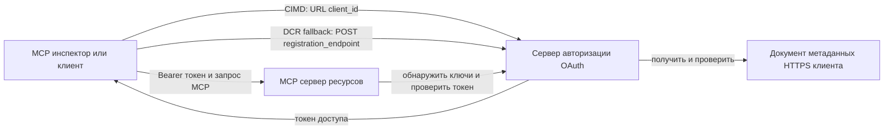

# Пример авторизации CIMD и DCR

Этот пример на TypeScript сравнивает два способа, которыми OAuth клиент может получить идентификацию
перед доступом к защищённому серверу MCP:

- **Client ID Metadata Documents (CIMD)** используют стабильный HTTPS URL в качестве
  `client_id`. Это предпочтительный механизм для клиентов и серверов авторизации,
  у которых нет предварительных отношений.
- **Dynamic Client Registration (DCR)** запрашивает у сервера авторизации выдачу
  непрозрачного client ID во время выполнения. MCP `2026-07-28` сохраняет DCR только для обратной
  совместимости.

В примере используется стабильный MCP TypeScript SDK v2 и статeless
модель запросов MCP `2026-07-28`. Он работает с внешним OAuth 2.1/OpenID
Connect сервером авторизации, таким как Auth0. MCP сервер является ресурсным
сервером: он проверяет access token, но не аутентифицирует пользователей и не выдает
токены.

## Цели обучения

Выполнив этот пример, вы сможете:

- Объяснить, почему CIMD предпочтительнее DCR для новых клиентов MCP.
- Опубликовать валидный CIMD документ для публичного нативного клиента.
- Настроить ресурсный сервер MCP для обнаружения OAuth и проверки JWT.
- Попрактиковаться в использовании CIMD и DCR с одним и тем же сервером MCP и сервером авторизации.
- Применять объем прав OAuth внутри инструмента MCP.
- Определить, какие обязанности принадлежат клиенту, ресурсному серверу и
  серверу авторизации.

## Архитектура



Сервер авторизации выбирает и проверяет механизм регистрации.
Сервер MCP видит только итоговое проверенное утверждение `client_id`. HTTPS URL
с путём идентифицирует CIMD. Непрозрачного ID недостаточно, чтобы подтвердить DCR, потому что
предварительно зарегистрированный клиент может тоже использовать непрозрачный ID; необязательный
параметр `DCR_CLIENT_ID_PREFIX` предоставляет демонстрационную подсказку от провайдера.

## Приоритет регистрации

Клиенты MCP, поддерживающие все механизмы, должны использовать следующий порядок:

1. Использовать предварительно зарегистрированную информацию о клиенте, если она уже доступна.
2. Использовать CIMD, если сервер авторизации заявляет
   `client_id_metadata_document_supported: true`.
3. Использовать DCR только как резервный вариант, если сервер объявляет
   `registration_endpoint`.
4. Запрашивать у пользователя предварительно зарегистрированную информацию о клиенте, если ничего из перечисленного
   нет.

## Структура проекта

```text
src/
  config.ts          Environment validation
  dcr.ts             DCR compatibility request
  mcp.ts             MCP tools and scope checks
  oauth.ts           Authorization metadata and JWT verification
  register-dcr.ts    DCR command-line helper
  registration.ts    CIMD document and mechanism classification
  server.ts          Express, OAuth discovery, and MCP endpoint
test/
  dcr.test.ts
  oauth.test.ts
  registration.test.ts
  server.test.ts
```

## Требования

- Node.js 20.6 или новее. Скрипты используют `--env-file` и `--import`.
- OAuth 2.1/OpenID Connect сервер авторизации, который поддерживает:
  - Authorization code flow с S256 PKCE.
  - OAuth Protected Resource Metadata и Resource Indicators.
  - JWT access tokens и эндпоинт JWKS.
  - CIMD, а также DCR, если хотите сравнить устаревший резервный вариант.
- MCP Inspector или другой клиент MCP `2026-07-28`.
- Публичный HTTPS URL для CIMD документа. Для лаборатории подойдет туннель для разработки;
  для продакшена используйте стабильный домен.

## Установка и тестирование

```bash
npm install
npm run build
npm test
```

Двенадцать тестов используют локальные ключи и заглушки HTTP эндпоинтов. Им не нужен
аккаунт на сервере авторизации. Они проверяют:

- Формат и ограничения URL CIMD документа.
- Честную классификацию URL и непрозрачных client ID.
- Обработку запросов и ответов DCR.
- Отклонение небезопасных DCR эндпоинтов вне loopback.
- Проверку подписи JWT, издателя, аудитории, срока действия, client ID и области действия.
- Вызов `registration-info` внутри процесса MCP `2026-07-28`.

## Настройка сервера авторизации

Точные имена настроек варьируются у разных провайдеров. Настройте следующие возможности:

1. Создайте API или ресурсный сервер с идентификатором, точно совпадающим с вашим MCP
   URL, включая `/mcp`, например `http://127.0.0.1:3001/mcp`.
2. Используйте RS256 access tokens и включите утверждение `client_id` или `azp`.
3. Добавьте разрешение или область `tool:greet`.
4. Включите authorization code flow с S256 PKCE для публичных нативных клиентов.
5. Включите Client ID Metadata Documents.
6. Для сравнения включите Dynamic Client Registration.
7. Убедитесь, что метаданные сервера авторизации объявляют:
   - `issuer`
   - `authorization_endpoint`
   - `token_endpoint`
   - `jwks_uri`
   - `client_id_metadata_document_supported: true`
   - `registration_endpoint`, если DCR включён

### Пример Auth0

Для Auth0 включите регистрацию Client ID Metadata Document, динамическую регистрацию
приложений OIDC и совместимость с параметрами ресурса. Создайте API
с идентификатором, точно совпадающим с MCP URL, и добавьте разрешение `tool:greet`.
Разрешите тестовому пользователю и сторонним клиентам запрашивать это разрешение.

Панели управления провайдера и доступность функций со временем меняются. Проверьте
документацию провайдера перед использованием этих настроек вне этой лабораторной работы.

## Настройка примера

Создайте `.env` на основе примера:

```powershell
Copy-Item .env.example .env
```

В bash-совместимых оболочках:

```bash
cp .env.example .env
```

Установите эти значения:

```dotenv
MCP_SERVER_URL=http://127.0.0.1:3001/mcp
AUTHORIZATION_SERVER_ISSUER=https://your-tenant.example.com/
AUTHORIZATION_SERVER_METADATA_URL=https://your-tenant.example.com/.well-known/openid-configuration
CLIENT_METADATA_URL=https://your-public-host.example.com/client-metadata.json
OAUTH_REDIRECT_URIS=http://127.0.0.1:6274/oauth/callback
DCR_CLIENT_ID_PREFIX=tpc_
```

Важные детали:

- `AUTHORIZATION_SERVER_ISSUER` должен точно совпадать с `issuer` в обнаруженных
  метаданных сервера авторизации, включая завершающий слэш.
- `MCP_SERVER_URL` должен совпадать с аудиторией access token.
- `CLIENT_METADATA_URL` должен использовать HTTPS, содержать непустой путь и быть
  публичным URL, который обслуживает маршрут метаданных. Строки запроса и фрагменты
  отклоняются, чтобы маршрут и `client_id` оставались идентичными.
- `OAUTH_REDIRECT_URIS` — это белый список, разделенный запятыми. По умолчанию — loopback callback MCP
  Inspector.
- `DCR_CLIENT_ID_PREFIX` необязателен и зависит от провайдера. Оставьте пустым, если
  у провайдера нет надежного префикса для DCR.

## Публикация документа CIMD

Запустите туннель, который проксирует его публичное HTTPS происхождение на `127.0.0.1:3001`.
Установите `CLIENT_METADATA_URL` на этот источник плюс `/client-metadata.json`, затем выполните:

```bash
npm run build
npm start
```

Проверьте оба документа обнаружения:

```bash
curl http://127.0.0.1:3001/health
curl http://127.0.0.1:3001/client-metadata.json
curl http://127.0.0.1:3001/.well-known/oauth-protected-resource/mcp
```

`client_id`, возвращаемый публичным HTTPS URL метаданных, должен быть байт-в-байт
идентичен этому URL. Сервер авторизации должен проверить документ и
URI перенаправления перед выдачей токена.

> [!NOTE]
> Пример размещает клиентский документ и ресурсный сервер MCP в одном процессе,
> чтобы сохранить лабораторную работу компактной. В продакшене клиент MCP владеет и
> размещает свой CIMD документ независимо от ресурсного сервера.

## Сравнение CIMD и DCR

Запустите MCP Inspector:

```bash
npx @modelcontextprotocol/inspector
```

Используйте Streamable HTTP и подключитесь к `http://127.0.0.1:3001/mcp`.

### CIMD (предпочтительно)

1. Введите публичный `CLIENT_METADATA_URL` в качестве OAuth Client ID.
2. Запросите `tool:greet` и любые области идентификации, необходимые вашему провайдеру.
3. Завершите вход и согласие.
4. Вызовите `registration-info`. Он сообщает `mechanism: "cimd"`.
5. Вызовите `greet`, чтобы проверить применение области действия.

### DCR (совместимый резервный вариант)

1. Очистите сохранённое состояние OAuth в Inspector.
2. Оставьте OAuth Client ID пустым, чтобы Inspector мог использовать рекламируемый
   `registration_endpoint`.
3. Завершите вход и согласие.
4. Вызовите `registration-info`.
5. Если `DCR_CLIENT_ID_PREFIX` совпадает с генерируемыми ID провайдера, инструмент
   сообщает `mechanism: "dcr"`; иначе корректно сообщает
   `opaque-client-id`.

Вы также можете продемонстрировать непосредственно запрос регистрации:

```bash
npm run build
npm run register:dcr
```

Хелпер выводит возвращённый client ID, но никогда не выводит client secret.
Обращайтесь с любым возвращённым секретом как с конфиденциальным и храните его в надёжном хранилище секретов.

## Инструменты

| Инструмент | Требуемая область | Назначение |
| --- | --- | --- |
| `registration-info` | Проверенный клиент | Сообщить тип client ID |
| `greet` | `tool:greet` | Продемонстрировать авторизацию по инструменту |

## Заметки по безопасности

- Проверяйте подписи JWT через эндпоинт JWKS сервера авторизации.
- Требуйте точного совпадения издателя и аудитории.
- Требуйте наличие утверждений о сроке действия и client ID.
- Никогда не принимайте токен, выданный для другого ресурса.
- Никогда не передавайте токен MCP дальше на downstream API.
- Связывайте учетные данные DCR с издателем, который их создал.
- Проверяйте URI перенаправления CIMD с точным совпадением.
- Применяйте меры защиты от SSRF, когда сервер авторизации обращается к URL CIMD.
- Используйте HTTPS для авторизации и конечных точек метаданных вне среды loopback
  при разработке.
- Не выводите DCR из непрозрачного client ID, если провайдер не документирует
  надёжную соглашение об идентификаторах.

## Ссылки

- [Спецификация авторизации MCP](https://modelcontextprotocol.io/specification/2026-07-28/basic/authorization)
- [Регистрация клиента MCP](https://modelcontextprotocol.io/specification/2026-07-28/basic/authorization/client-registration)
- [Лучшие практики безопасности MCP](https://modelcontextprotocol.io/specification/2026-07-28/basic/security_best_practices)
- [Руководство по авторизации MCP TypeScript SDK v2](https://ts.sdk.modelcontextprotocol.io/v2/serving/authorization)
- [OAuth Dynamic Client Registration (RFC 7591)](https://datatracker.ietf.org/doc/html/rfc7591)
- [Проект документа Client ID Metadata Document (черновик)](https://datatracker.ietf.org/doc/html/draft-ietf-oauth-client-id-metadata-document-00)

## Благодарности

Подход обучения бок о бок был вдохновлен
[Sambego/auth0-xmcp-cimd](https://github.com/Sambego/auth0-xmcp-cimd). Этот
пример является оригинальной, независимой от провайдера реализацией, построенной с использованием официального
MCP TypeScript SDK v2 для этой учебной программы.

---

<!-- CO-OP TRANSLATOR DISCLAIMER START -->
**Отказ от ответственности**:
Этот документ был переведен с использованием сервиса машинного перевода [Co-op Translator](https://github.com/Azure/co-op-translator). Несмотря на наши усилия по обеспечению точности, имейте в виду, что автоматический перевод может содержать ошибки или неточности. Оригинальный документ на его исходном языке следует считать авторитетным источником. Для получения критически важной информации рекомендуется обратиться к профессиональному человеческому переводу. Мы не несем ответственности за любые недоразумения или неправильные толкования, возникшие в результате использования этого перевода.
<!-- CO-OP TRANSLATOR DISCLAIMER END -->