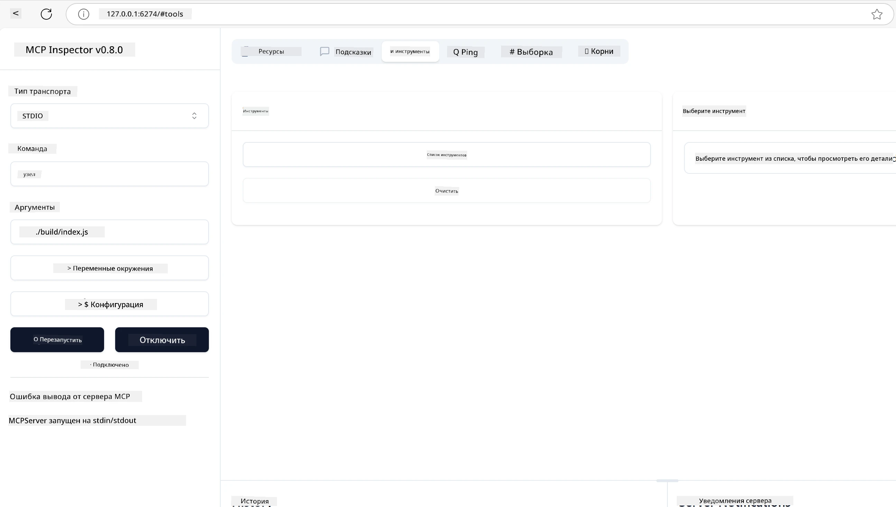
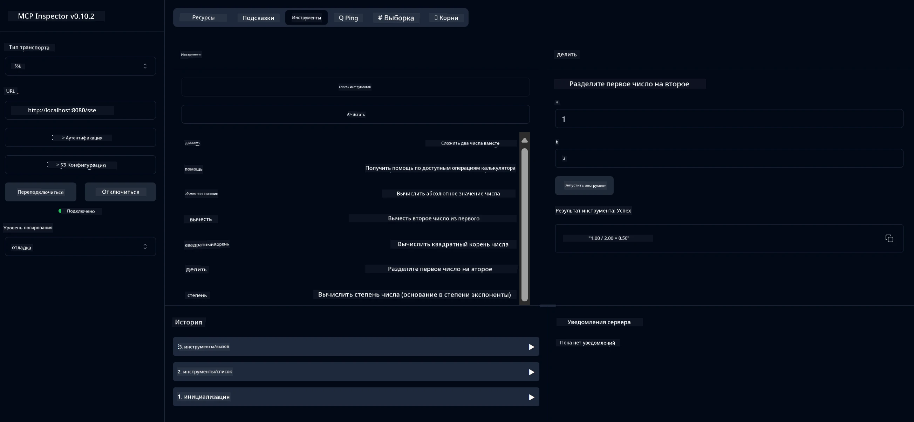
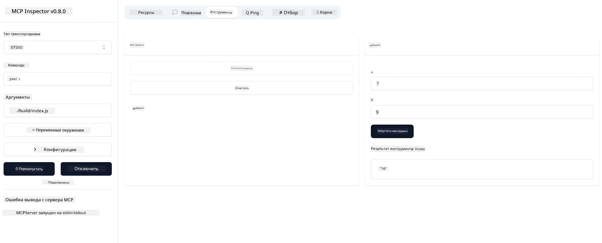

# Начало работы с MCP

> [!NOTE]
> Пример HTTP для Java в этом уроке использует устаревший транспорт HTTP+SSE и
> нацелен на SDK, совместимый с MCP `2025-11-25`. Для новых удалённых серверов используйте
> транспорт Streamable HTTP `2026-07-28` и проверьте поддержку в вашем SDK.

Добро пожаловать в ваши первые шаги с протоколом Model Context Protocol (MCP)! Независимо от того, новичок вы в MCP или хотите углубить свои знания, этот гид проведёт вас через базовую настройку и процесс разработки. Вы узнаете, как MCP обеспечивает бесшовную интеграцию между ИИ-моделями и приложениями, а также как быстро подготовить ваше окружение для создания и тестирования решений на основе MCP.

> Вкратце; Если вы создаёте ИИ-приложения, то знаете, что можно добавить инструменты и другие ресурсы к вашему LLM (большой языковой модели), чтобы сделать LLM более осведомлённой. Однако если разместить эти инструменты и ресурсы на сервере, возможности приложения и сервера могут использовать любые клиенты с LLM или без него.

## Обзор

Этот урок предлагает практические рекомендации по настройке MCP-окружений и созданию ваших первых MCP-приложений. Вы узнаете, как установить необходимые инструменты и фреймворки, создать базовые MCP-серверы, написать хост-приложения и тестировать ваши реализации.

Протокол Model Context Protocol (MCP) — это открытый протокол, стандартизирующий способ предоставления контекста для LLM. Представьте MCP как USB-C порт для ИИ-приложений — он обеспечивает стандартный способ подключения ИИ-моделей к разным источникам данных и инструментам.

## Цели обучения

К концу урока вы сможете:

- Настроить среды разработки для MCP на C#, Java, Python, TypeScript и Rust
- Создавать и развертывать базовые MCP-серверы с кастомными функциями (ресурсы, подсказки и инструменты)
- Создавать хост-приложения, которые подключаются к MCP-серверам
- Тестировать и отлаживать реализации MCP

## Настройка вашего MCP-окружения

Прежде чем приступить к работе с MCP, важно подготовить среду разработки и понять базовый рабочий процесс. В этом разделе вы пройдёте начальные шаги настройки для плавного старта с MCP.

### Требования

Прежде чем углубляться в MCP-разработку, убедитесь, что у вас есть:

- **Среда разработки**: для выбранного языка (C#, Java, Python, TypeScript или Rust)
- **IDE/Редактор**: Visual Studio, Visual Studio Code, IntelliJ, Eclipse, PyCharm или любой современный редактор кода
- **Менеджеры пакетов**: NuGet, Maven/Gradle, pip, npm/yarn или Cargo
- **API-ключи**: для любых ИИ-сервисов, которые планируете использовать в хост-приложениях

## Базовая структура MCP-сервера

MCP-сервер обычно включает:

- **Конфигурация сервера**: настройка порта, аутентификация и другие параметры
- **Ресурсы**: данные и контекст, доступные LLM
- **Инструменты**: функционал, который вызывают модели
- **Подсказки**: шаблоны для генерации или структурирования текста

Вот упрощённый пример на TypeScript:

```typescript
import { McpServer, ResourceTemplate } from "@modelcontextprotocol/sdk/server/mcp.js";
import { StdioServerTransport } from "@modelcontextprotocol/sdk/server/stdio.js";
import { z } from "zod";

// Создать MCP сервер
const server = new McpServer({
  name: "Demo",
  version: "1.0.0"
});

// Добавить инструмент сложения
server.tool("add",
  { a: z.number(), b: z.number() },
  async ({ a, b }) => ({
    content: [{ type: "text", text: String(a + b) }]
  })
);

// Добавить динамический ресурс приветствия
server.resource(
  "file",
  // Параметр 'list' управляет тем, как ресурс отображает доступные файлы. Установка значения undefined отключает отображение для этого ресурса.
  new ResourceTemplate("file://{path}", { list: undefined }),
  async (uri, { path }) => ({
    contents: [{
      uri: uri.href,
      text: `File, ${path}!`
    }]
  })
);

// Добавить файловый ресурс, который читает содержимое файла
server.resource(
  "file",
  new ResourceTemplate("file://{path}", { list: undefined }),
  async (uri, { path }) => {
    let text;
    try {
      text = await fs.readFile(path, "utf8");
    } catch (err) {
      text = `Error reading file: ${err.message}`;
    }
    return {
      contents: [{
        uri: uri.href,
        text
      }]
    };
  }
);

server.prompt(
  "review-code",
  { code: z.string() },
  ({ code }) => ({
    messages: [{
      role: "user",
      content: {
        type: "text",
        text: `Please review this code:\n\n${code}`
      }
    }]
  })
);

// Начать приём сообщений на stdin и отправку сообщений на stdout
const transport = new StdioServerTransport();
await server.connect(transport);
```

В приведённом коде мы:

- Импортировали необходимые классы из MCP TypeScript SDK.
- Создали и настроили новый экземпляр MCP-сервера.
- Зарегистрировали кастомный инструмент (`calculator`) с обработчиком.
- Запустили сервер для прослушивания входящих MCP-запросов.

## Тестирование и отладка

Прежде чем начать тестировать ваш MCP-сервер, важно понять доступные инструменты и лучшие практики отладки. Эффективное тестирование гарантирует, что сервер работает корректно, и помогает быстро выявлять и устранять ошибки. В следующем разделе описаны рекомендуемые подходы для проверки вашей реализации MCP.

MCP предоставляет инструменты для помощи в тестировании и отладке серверов:

- **Инспектор**, этот графический интерфейс позволяет подключиться к серверу и тестировать ваши инструменты, подсказки и ресурсы.
- **curl**, также вы можете подключиться к серверу с помощью командной строки через curl или других клиентов, способных выполнять HTTP-команды.

### Использование MCP Inspector

[MCP Inspector](https://github.com/modelcontextprotocol/inspector) — визуальный инструмент тестирования, который помогает:

1. **Обнаруживать возможности сервера**: автоматически определять доступные ресурсы, инструменты и подсказки
2. **Тестировать выполнение инструментов**: пробовать разные параметры и получать ответы в реальном времени
3. **Просматривать метаданные сервера**: изучать информацию о сервере, схемы и конфигурации

```bash
# Пример TypeScript, установка и запуск MCP Inspector
npx @modelcontextprotocol/inspector node build/index.js
```

При выполнении указанных команд MCP Inspector запустит локальный веб-интерфейс в вашем браузере. Вы увидите панель с зарегистрированными MCP-серверами, их доступными инструментами, ресурсами и подсказками. Интерфейс позволяет интерактивно тестировать работу инструментов, просматривать метаданные сервера и видеть ответы в реальном времени, упрощая проверку и отладку реализаций MCP-серверов.

Вот как это может выглядеть:



## Частые проблемы с настройкой и решения

| Проблема | Возможное решение |
|---------|-------------------|
| Отказ в подключении | Проверьте, запущен ли сервер и правильный ли порт |
| Ошибки выполнения инструмента | Проверьте валидацию параметров и обработку ошибок |
| Ошибки аутентификации | Проверьте API-ключи и разрешения |
| Ошибки валидации схемы | Убедитесь, что параметры соответствуют определённой схеме |
| Сервер не запускается | Проверьте конфликты портов или отсутствующие зависимости |
| Ошибки CORS | Настройте корректные заголовки CORS для междоменных запросов |
| Проблемы с аутентификацией | Проверьте валидность токена и права доступа |

## Локальная разработка

Для локальной разработки и тестирования можно запускать MCP-серверы непосредственно на вашей машине:

1. **Запустите серверный процесс**: запустите ваше MCP-серверное приложение
2. **Настройте сеть**: убедитесь, что сервер доступен на ожидаемом порту
3. **Подключите клиентов**: используйте локальные URL, например `http://localhost:3000`

```bash
# Пример: Запуск TypeScript MCP сервера локально
npm run start
# Сервер запущен по адресу http://localhost:3000
```

## Создание вашего первого MCP-сервера

Мы рассмотрели [Основные концепции](../../01-CoreConcepts/README.md) в предыдущем уроке, теперь пришло время применить эти знания.

### Что может делать сервер

Прежде чем писать код, напомним, что может делать сервер:

MCP-сервер может, например:

- Получать доступ к локальным файлам и базам данных
- Подключаться к удалённым API
- Выполнять вычисления
- Интегрироваться с другими инструментами и сервисами
- Обеспечивать пользовательский интерфейс для взаимодействия

Отлично, теперь, когда мы знаем, что можно для него сделать, приступим к программированию.

## Упражнение: Создание сервера

Чтобы создать сервер, выполните следующие шаги:

- Установите MCP SDK.
- Создайте проект и настройте его структуру.
- Напишите код сервера.
- Протестируйте сервер.

### -1- Создание проекта

#### TypeScript

```sh
# Создайте каталог проекта и инициализируйте npm проект
mkdir calculator-server
cd calculator-server
npm init -y
```

#### Python

```sh
# Создать каталог проекта
mkdir calculator-server
cd calculator-server
# Откройте папку в Visual Studio Code - пропустите этот шаг, если вы используете другую IDE
code .
```

#### .NET

```sh
dotnet new console -n McpCalculatorServer
cd McpCalculatorServer
```

#### Java

Для Java создайте проект Spring Boot:

```bash
curl https://start.spring.io/starter.zip \
  -d dependencies=web \
  -d javaVersion=21 \
  -d type=maven-project \
  -d groupId=com.example \
  -d artifactId=calculator-server \
  -d name=McpServer \
  -d packageName=com.microsoft.mcp.sample.server \
  -o calculator-server.zip
```

Распакуйте zip-файл:

```bash
unzip calculator-server.zip -d calculator-server
cd calculator-server
# необязательно удалить неиспользуемый тест
rm -rf src/test/java
```

Добавьте следующую полную конфигурацию в файл *pom.xml*:

```xml
<?xml version="1.0" encoding="UTF-8"?>
<project xmlns="http://maven.apache.org/POM/4.0.0"
    xmlns:xsi="http://www.w3.org/2001/XMLSchema-instance"
    xsi:schemaLocation="http://maven.apache.org/POM/4.0.0 http://maven.apache.org/xsd/maven-4.0.0.xsd">
    <modelVersion>4.0.0</modelVersion>
    
    <!-- Spring Boot parent for dependency management -->
    <parent>
        <groupId>org.springframework.boot</groupId>
        <artifactId>spring-boot-starter-parent</artifactId>
        <version>3.5.0</version>
        <relativePath />
    </parent>

    <!-- Project coordinates -->
    <groupId>com.example</groupId>
    <artifactId>calculator-server</artifactId>
    <version>0.0.1-SNAPSHOT</version>
    <name>Calculator Server</name>
    <description>Basic calculator MCP service for beginners</description>

    <!-- Properties -->
    <properties>
        <java.version>21</java.version>
        <maven.compiler.source>21</maven.compiler.source>
        <maven.compiler.target>21</maven.compiler.target>
    </properties>

    <!-- Spring AI BOM for version management -->
    <dependencyManagement>
        <dependencies>
            <dependency>
                <groupId>org.springframework.ai</groupId>
                <artifactId>spring-ai-bom</artifactId>
                <version>1.0.0-SNAPSHOT</version>
                <type>pom</type>
                <scope>import</scope>
            </dependency>
        </dependencies>
    </dependencyManagement>

    <!-- Dependencies -->
    <dependencies>
        <dependency>
            <groupId>org.springframework.ai</groupId>
            <artifactId>spring-ai-starter-mcp-server-webflux</artifactId>
        </dependency>
        <dependency>
            <groupId>org.springframework.boot</groupId>
            <artifactId>spring-boot-starter-actuator</artifactId>
        </dependency>
        <dependency>
         <groupId>org.springframework.boot</groupId>
         <artifactId>spring-boot-starter-test</artifactId>
         <scope>test</scope>
      </dependency>
    </dependencies>

    <!-- Build configuration -->
    <build>
        <plugins>
            <plugin>
                <groupId>org.springframework.boot</groupId>
                <artifactId>spring-boot-maven-plugin</artifactId>
            </plugin>
            <plugin>
                <groupId>org.apache.maven.plugins</groupId>
                <artifactId>maven-compiler-plugin</artifactId>
                <configuration>
                    <release>21</release>
                </configuration>
            </plugin>
        </plugins>
    </build>

    <!-- Repositories for Spring AI snapshots -->
    <repositories>
        <repository>
            <id>spring-milestones</id>
            <name>Spring Milestones</name>
            <url>https://repo.spring.io/milestone</url>
            <snapshots>
                <enabled>false</enabled>
            </snapshots>
        </repository>
        <repository>
            <id>spring-snapshots</id>
            <name>Spring Snapshots</name>
            <url>https://repo.spring.io/snapshot</url>
            <releases>
                <enabled>false</enabled>
            </releases>
        </repository>
    </repositories>
</project>
```

#### Rust

```sh
mkdir calculator-server
cd calculator-server
cargo init
```

### -2- Добавление зависимостей

Теперь, когда проект создан, давайте добавим зависимости:

#### TypeScript

```sh
# Если еще не установлен, установите TypeScript глобально
npm install typescript -g

# Установите MCP SDK и Zod для проверки схемы
npm install @modelcontextprotocol/sdk zod
npm install -D @types/node typescript
```

#### Python

```sh
# Создайте виртуальное окружение и установите зависимости
python -m venv venv
venv\Scripts\activate
pip install "mcp[cli]"
```

#### Java

```bash
cd calculator-server
./mvnw clean install -DskipTests
```

#### Rust

```sh
cargo add rmcp --features server,transport-io
cargo add serde
cargo add tokio --features rt-multi-thread
```

### -3- Создание файлов проекта

#### TypeScript

Откройте файл *package.json* и замените содержимое следующим, чтобы обеспечить сборку и запуск сервера:

```json
{
  "name": "calculator-server",
  "version": "1.0.0",
  "main": "index.js",
  "type": "module",
  "scripts": {
    "build": "tsc",
    "start": "npm run build && node ./build/index.js",
  },
  "keywords": [],
  "author": "",
  "license": "ISC",
  "description": "A simple calculator server using Model Context Protocol",
  "dependencies": {
    "@modelcontextprotocol/sdk": "^1.16.0",
    "zod": "^3.25.76"
  },
  "devDependencies": {
    "@types/node": "^24.0.14",
    "typescript": "^5.8.3"
  }
}
```

Создайте *tsconfig.json* со следующим содержимым:

```json
{
  "compilerOptions": {
    "target": "ES2022",
    "module": "Node16",
    "moduleResolution": "Node16",
    "outDir": "./build",
    "rootDir": "./src",
    "strict": true,
    "esModuleInterop": true,
    "skipLibCheck": true,
    "forceConsistentCasingInFileNames": true
  },
  "include": ["src/**/*"],
  "exclude": ["node_modules"]
}
```

Создайте директорию для исходного кода:

```sh
mkdir src
touch src/index.ts
```

#### Python

Создайте файл *server.py*

```sh
touch server.py
```

#### .NET

Установите необходимые NuGet пакеты:

```sh
dotnet add package ModelContextProtocol --prerelease
dotnet add package Microsoft.Extensions.Hosting
```

#### Java

Для проектов Java Spring Boot структура создаётся автоматически.

#### Rust

Для Rust файл *src/main.rs* создаётся по умолчанию при запуске `cargo init`. Откройте этот файл и удалите стандартный код.

### -4- Создание серверного кода

#### TypeScript

Создайте файл *index.ts* и добавьте следующий код:

```typescript
import { McpServer, ResourceTemplate } from "@modelcontextprotocol/sdk/server/mcp.js";
import { StdioServerTransport } from "@modelcontextprotocol/sdk/server/stdio.js";
import { z } from "zod";
 
// Создать MCP сервер
const server = new McpServer({
  name: "Calculator MCP Server",
  version: "1.0.0"
});
```

Теперь у вас есть сервер, но он мало чего делает, исправим это.

#### Python

```python
# server.py
from mcp.server.fastmcp import FastMCP

# Создать MCP сервер
mcp = FastMCP("Demo")
```

#### .NET

```csharp
using Microsoft.Extensions.DependencyInjection;
using Microsoft.Extensions.Hosting;
using Microsoft.Extensions.Logging;
using ModelContextProtocol.Server;
using System.ComponentModel;

var builder = Host.CreateApplicationBuilder(args);
builder.Logging.AddConsole(consoleLogOptions =>
{
    // Configure all logs to go to stderr
    consoleLogOptions.LogToStandardErrorThreshold = LogLevel.Trace;
});

builder.Services
    .AddMcpServer()
    .WithStdioServerTransport()
    .WithToolsFromAssembly();
await builder.Build().RunAsync();

// add features
```

#### Java

Для Java создайте основные компоненты сервера. Сначала измените главный класс приложения:

*src/main/java/com/microsoft/mcp/sample/server/McpServerApplication.java*:

```java
package com.microsoft.mcp.sample.server;

import org.springframework.ai.tool.ToolCallbackProvider;
import org.springframework.ai.tool.method.MethodToolCallbackProvider;
import org.springframework.boot.SpringApplication;
import org.springframework.boot.autoconfigure.SpringBootApplication;
import org.springframework.context.annotation.Bean;
import com.microsoft.mcp.sample.server.service.CalculatorService;

@SpringBootApplication
public class McpServerApplication {

    public static void main(String[] args) {
        SpringApplication.run(McpServerApplication.class, args);
    }
    
    @Bean
    public ToolCallbackProvider calculatorTools(CalculatorService calculator) {
        return MethodToolCallbackProvider.builder().toolObjects(calculator).build();
    }
}
```

Создайте сервис калькулятора *src/main/java/com/microsoft/mcp/sample/server/service/CalculatorService.java*:

```java
package com.microsoft.mcp.sample.server.service;

import org.springframework.ai.tool.annotation.Tool;
import org.springframework.stereotype.Service;

/**
 * Service for basic calculator operations.
 * This service provides simple calculator functionality through MCP.
 */
@Service
public class CalculatorService {

    /**
     * Add two numbers
     * @param a The first number
     * @param b The second number
     * @return The sum of the two numbers
     */
    @Tool(description = "Add two numbers together")
    public String add(double a, double b) {
        double result = a + b;
        return formatResult(a, "+", b, result);
    }

    /**
     * Subtract one number from another
     * @param a The number to subtract from
     * @param b The number to subtract
     * @return The result of the subtraction
     */
    @Tool(description = "Subtract the second number from the first number")
    public String subtract(double a, double b) {
        double result = a - b;
        return formatResult(a, "-", b, result);
    }

    /**
     * Multiply two numbers
     * @param a The first number
     * @param b The second number
     * @return The product of the two numbers
     */
    @Tool(description = "Multiply two numbers together")
    public String multiply(double a, double b) {
        double result = a * b;
        return formatResult(a, "*", b, result);
    }

    /**
     * Divide one number by another
     * @param a The numerator
     * @param b The denominator
     * @return The result of the division
     */
    @Tool(description = "Divide the first number by the second number")
    public String divide(double a, double b) {
        if (b == 0) {
            return "Error: Cannot divide by zero";
        }
        double result = a / b;
        return formatResult(a, "/", b, result);
    }

    /**
     * Calculate the power of a number
     * @param base The base number
     * @param exponent The exponent
     * @return The result of raising the base to the exponent
     */
    @Tool(description = "Calculate the power of a number (base raised to an exponent)")
    public String power(double base, double exponent) {
        double result = Math.pow(base, exponent);
        return formatResult(base, "^", exponent, result);
    }

    /**
     * Calculate the square root of a number
     * @param number The number to find the square root of
     * @return The square root of the number
     */
    @Tool(description = "Calculate the square root of a number")
    public String squareRoot(double number) {
        if (number < 0) {
            return "Error: Cannot calculate square root of a negative number";
        }
        double result = Math.sqrt(number);
        return String.format("√%.2f = %.2f", number, result);
    }

    /**
     * Calculate the modulus (remainder) of division
     * @param a The dividend
     * @param b The divisor
     * @return The remainder of the division
     */
    @Tool(description = "Calculate the remainder when one number is divided by another")
    public String modulus(double a, double b) {
        if (b == 0) {
            return "Error: Cannot divide by zero";
        }
        double result = a % b;
        return formatResult(a, "%", b, result);
    }

    /**
     * Calculate the absolute value of a number
     * @param number The number to find the absolute value of
     * @return The absolute value of the number
     */
    @Tool(description = "Calculate the absolute value of a number")
    public String absolute(double number) {
        double result = Math.abs(number);
        return String.format("|%.2f| = %.2f", number, result);
    }

    /**
     * Get help about available calculator operations
     * @return Information about available operations
     */
    @Tool(description = "Get help about available calculator operations")
    public String help() {
        return "Basic Calculator MCP Service\n\n" +
               "Available operations:\n" +
               "1. add(a, b) - Adds two numbers\n" +
               "2. subtract(a, b) - Subtracts the second number from the first\n" +
               "3. multiply(a, b) - Multiplies two numbers\n" +
               "4. divide(a, b) - Divides the first number by the second\n" +
               "5. power(base, exponent) - Raises a number to a power\n" +
               "6. squareRoot(number) - Calculates the square root\n" + 
               "7. modulus(a, b) - Calculates the remainder of division\n" +
               "8. absolute(number) - Calculates the absolute value\n\n" +
               "Example usage: add(5, 3) will return 5 + 3 = 8";
    }

    /**
     * Format the result of a calculation
     */
    private String formatResult(double a, String operator, double b, double result) {
        return String.format("%.2f %s %.2f = %.2f", a, operator, b, result);
    }
}
```

**Дополнительные компоненты для готового к продакшену сервиса:**

Создайте конфигурацию запуска *src/main/java/com/microsoft/mcp/sample/server/config/StartupConfig.java*:

```java
package com.microsoft.mcp.sample.server.config;

import org.springframework.boot.CommandLineRunner;
import org.springframework.context.annotation.Bean;
import org.springframework.context.annotation.Configuration;

@Configuration
public class StartupConfig {
    
    @Bean
    public CommandLineRunner startupInfo() {
        return args -> {
            System.out.println("\n" + "=".repeat(60));
            System.out.println("Calculator MCP Server is starting...");
            System.out.println("SSE endpoint: http://localhost:8080/sse");
            System.out.println("Health check: http://localhost:8080/actuator/health");
            System.out.println("=".repeat(60) + "\n");
        };
    }
}
```

Создайте контроллер здоровья *src/main/java/com/microsoft/mcp/sample/server/controller/HealthController.java*:

```java
package com.microsoft.mcp.sample.server.controller;

import org.springframework.http.ResponseEntity;
import org.springframework.web.bind.annotation.GetMapping;
import org.springframework.web.bind.annotation.RestController;
import java.time.LocalDateTime;
import java.util.HashMap;
import java.util.Map;

@RestController
public class HealthController {
    
    @GetMapping("/health")
    public ResponseEntity<Map<String, Object>> healthCheck() {
        Map<String, Object> response = new HashMap<>();
        response.put("status", "UP");
        response.put("timestamp", LocalDateTime.now().toString());
        response.put("service", "Calculator MCP Server");
        return ResponseEntity.ok(response);
    }
}
```

Создайте обработчик исключений *src/main/java/com/microsoft/mcp/sample/server/exception/GlobalExceptionHandler.java*:

```java
package com.microsoft.mcp.sample.server.exception;

import org.springframework.http.HttpStatus;
import org.springframework.http.ResponseEntity;
import org.springframework.web.bind.annotation.ExceptionHandler;
import org.springframework.web.bind.annotation.RestControllerAdvice;

@RestControllerAdvice
public class GlobalExceptionHandler {

    @ExceptionHandler(IllegalArgumentException.class)
    public ResponseEntity<ErrorResponse> handleIllegalArgumentException(IllegalArgumentException ex) {
        ErrorResponse error = new ErrorResponse(
            "Invalid_Input", 
            "Invalid input parameter: " + ex.getMessage());
        return new ResponseEntity<>(error, HttpStatus.BAD_REQUEST);
    }

    public static class ErrorResponse {
        private String code;
        private String message;

        public ErrorResponse(String code, String message) {
            this.code = code;
            this.message = message;
        }

        // Геттеры
        public String getCode() { return code; }
        public String getMessage() { return message; }
    }
}
```

Создайте кастомный баннер *src/main/resources/banner.txt*:

```text
_____      _            _       _             
 / ____|    | |          | |     | |            
| |     __ _| | ___ _   _| | __ _| |_ ___  _ __ 
| |    / _` | |/ __| | | | |/ _` | __/ _ \| '__|
| |___| (_| | | (__| |_| | | (_| | || (_) | |   
 \_____\__,_|_|\___|\__,_|_|\__,_|\__\___/|_|   
                                                
Calculator MCP Server v1.0
Spring Boot MCP Application
```

</details>

#### Rust

Добавьте следующий код в начало файла *src/main.rs*. Это импортирует необходимые библиотеки и модули для вашего MCP-сервера.

```rust
use rmcp::{
    handler::server::{router::tool::ToolRouter, tool::Parameters},
    model::{ServerCapabilities, ServerInfo},
    schemars, tool, tool_handler, tool_router,
    transport::stdio,
    ServerHandler, ServiceExt,
};
use std::error::Error;
```

Сервер калькулятора будет простым, который умеет складывать два числа. Создадим структуру, представляющую запрос калькулятора.

```rust
#[derive(Debug, serde::Deserialize, schemars::JsonSchema)]
pub struct CalculatorRequest {
    pub a: f64,
    pub b: f64,
}
```

Затем создайте структуру для сервера калькулятора. Эта структура будет содержать маршрутизатор инструментов, используемый для регистрации инструментов.

```rust
#[derive(Debug, Clone)]
pub struct Calculator {
    tool_router: ToolRouter<Self>,
}
```

Теперь мы можем реализовать структуру `Calculator`, чтобы создать новый экземпляр сервера и реализовать обработчик сервера для предоставления информации о нём.

```rust
#[tool_router]
impl Calculator {
    pub fn new() -> Self {
        Self {
            tool_router: Self::tool_router(),
        }
    }
}

#[tool_handler]
impl ServerHandler for Calculator {
    fn get_info(&self) -> ServerInfo {
        ServerInfo {
            instructions: Some("A simple calculator tool".into()),
            capabilities: ServerCapabilities::builder().enable_tools().build(),
            ..Default::default()
        }
    }
}
```

Наконец, нужно реализовать основную функцию для запуска сервера. Эта функция создаст экземпляр структуры `Calculator` и предоставит её через стандартный ввод/вывод.

```rust
#[tokio::main]
async fn main() -> Result<(), Box<dyn Error>> {
    let service = Calculator::new().serve(stdio()).await?;
    service.waiting().await?;
    Ok(())
}
```

Сервер теперь настроен на предоставление базовой информации о себе. Далее добавим инструмент для выполнения сложения.

### -5- Добавление инструмента и ресурса

Добавьте инструмент и ресурс, добавив следующий код:

#### TypeScript

```typescript
server.tool(
  "add",
  { a: z.number(), b: z.number() },
  async ({ a, b }) => ({
    content: [{ type: "text", text: String(a + b) }]
  })
);

server.resource(
  "greeting",
  new ResourceTemplate("greeting://{name}", { list: undefined }),
  async (uri, { name }) => ({
    contents: [{
      uri: uri.href,
      text: `Hello, ${name}!`
    }]
  })
);
```

Ваш инструмент принимает параметры `a` и `b` и выполняет функцию, которая формирует ответ в виде:

```typescript
{
  contents: [{
    type: "text", content: "some content"
  }]
}
```

Ваш ресурс доступен по строке "greeting", принимает параметр `name` и формирует аналогичный ответ, как и инструмент:

```typescript
{
  uri: "<href>",
  text: "a text"
}
```

#### Python

```python
# Добавить инструмент сложения
@mcp.tool()
def add(a: int, b: int) -> int:
    """Add two numbers"""
    return a + b


# Добавить динамический ресурс приветствия
@mcp.resource("greeting://{name}")
def get_greeting(name: str) -> str:
    """Get a personalized greeting"""
    return f"Hello, {name}!"
```

В приведённом коде мы:

- Определили инструмент `add`, принимающий параметры `a` и `b` типа целое число.
- Создали ресурс `greeting`, принимающий параметр `name`.

#### .NET

Добавьте это в ваш файл Program.cs:

```csharp
[McpServerToolType]
public static class CalculatorTool
{
    [McpServerTool, Description("Adds two numbers")]
    public static string Add(int a, int b) => $"Sum {a + b}";
}
```

#### Java

Инструменты уже были созданы на предыдущем шаге.

#### Rust

Добавьте новый инструмент внутри блока `impl Calculator`:

```rust
#[tool(description = "Adds a and b")]
async fn add(
    &self,
    Parameters(CalculatorRequest { a, b }): Parameters<CalculatorRequest>,
) -> String {
    (a + b).to_string()
}
```

### -6- Итоговый код

Добавим последний необходимый код для запуска сервера:

#### TypeScript

```typescript
// Начать получать сообщения с stdin и отправлять сообщения на stdout
const transport = new StdioServerTransport();
await server.connect(transport);
```

Вот полный код:

```typescript
// index.ts
import { McpServer, ResourceTemplate } from "@modelcontextprotocol/sdk/server/mcp.js";
import { StdioServerTransport } from "@modelcontextprotocol/sdk/server/stdio.js";
import { z } from "zod";

// Создать MCP сервер
const server = new McpServer({
  name: "Calculator MCP Server",
  version: "1.0.0"
});

// Добавить инструмент сложения
server.tool(
  "add",
  { a: z.number(), b: z.number() },
  async ({ a, b }) => ({
    content: [{ type: "text", text: String(a + b) }]
  })
);

// Добавить динамический ресурс приветствия
server.resource(
  "greeting",
  new ResourceTemplate("greeting://{name}", { list: undefined }),
  async (uri, { name }) => ({
    contents: [{
      uri: uri.href,
      text: `Hello, ${name}!`
    }]
  })
);

// Начать получать сообщения на stdin и отправлять сообщения на stdout
const transport = new StdioServerTransport();
server.connect(transport);
```

#### Python

```python
# server.py
from mcp.server.fastmcp import FastMCP

# Создать MCP сервер
mcp = FastMCP("Demo")


# Добавить инструмент сложения
@mcp.tool()
def add(a: int, b: int) -> int:
    """Add two numbers"""
    return a + b


# Добавить динамический ресурс приветствия
@mcp.resource("greeting://{name}")
def get_greeting(name: str) -> str:
    """Get a personalized greeting"""
    return f"Hello, {name}!"

# Главный блок выполнения - необходим для запуска сервера
if __name__ == "__main__":
    mcp.run()
```

#### .NET

Создайте файл Program.cs со следующим содержимым:

```csharp
using Microsoft.Extensions.DependencyInjection;
using Microsoft.Extensions.Hosting;
using Microsoft.Extensions.Logging;
using ModelContextProtocol.Server;
using System.ComponentModel;

var builder = Host.CreateApplicationBuilder(args);
builder.Logging.AddConsole(consoleLogOptions =>
{
    // Configure all logs to go to stderr
    consoleLogOptions.LogToStandardErrorThreshold = LogLevel.Trace;
});

builder.Services
    .AddMcpServer()
    .WithStdioServerTransport()
    .WithToolsFromAssembly();
await builder.Build().RunAsync();

[McpServerToolType]
public static class CalculatorTool
{
    [McpServerTool, Description("Adds two numbers")]
    public static string Add(int a, int b) => $"Sum {a + b}";
}
```

#### Java

Ваш полный главный класс приложения должен выглядеть так:

```java
// McpServerApplication.java
package com.microsoft.mcp.sample.server;

import org.springframework.ai.tool.ToolCallbackProvider;
import org.springframework.ai.tool.method.MethodToolCallbackProvider;
import org.springframework.boot.SpringApplication;
import org.springframework.boot.autoconfigure.SpringBootApplication;
import org.springframework.context.annotation.Bean;
import com.microsoft.mcp.sample.server.service.CalculatorService;

@SpringBootApplication
public class McpServerApplication {

    public static void main(String[] args) {
        SpringApplication.run(McpServerApplication.class, args);
    }
    
    @Bean
    public ToolCallbackProvider calculatorTools(CalculatorService calculator) {
        return MethodToolCallbackProvider.builder().toolObjects(calculator).build();
    }
}
```

#### Rust

Финальный код для сервера на Rust должен выглядеть так:

```rust
use rmcp::{
    ServerHandler, ServiceExt,
    handler::server::{router::tool::ToolRouter, tool::Parameters},
    model::{ServerCapabilities, ServerInfo},
    schemars, tool, tool_handler, tool_router,
    transport::stdio,
};
use std::error::Error;

#[derive(Debug, serde::Deserialize, schemars::JsonSchema)]
pub struct CalculatorRequest {
    pub a: f64,
    pub b: f64,
}

#[derive(Debug, Clone)]
pub struct Calculator {
    tool_router: ToolRouter<Self>,
}

#[tool_router]
impl Calculator {
    pub fn new() -> Self {
        Self {
            tool_router: Self::tool_router(),
        }
    }
    
    #[tool(description = "Adds a and b")]
    async fn add(
        &self,
        Parameters(CalculatorRequest { a, b }): Parameters<CalculatorRequest>,
    ) -> String {
        (a + b).to_string()
    }
}

#[tool_handler]
impl ServerHandler for Calculator {
    fn get_info(&self) -> ServerInfo {
        ServerInfo {
            instructions: Some("A simple calculator tool".into()),
            capabilities: ServerCapabilities::builder().enable_tools().build(),
            ..Default::default()
        }
    }
}

#[tokio::main]
async fn main() -> Result<(), Box<dyn Error>> {
    let service = Calculator::new().serve(stdio()).await?;
    service.waiting().await?;
    Ok(())
}
```

### -7- Тестирование сервера

Запустите сервер следующей командой:

#### TypeScript

```sh
npm run build
```

#### Python

```sh
mcp run server.py
```

> Чтобы использовать MCP Inspector, используйте `mcp dev server.py`, который автоматически запускает Inspector и предоставляет необходимый токен сессии прокси. При использовании `mcp run server.py` вам нужно будет вручную запустить Inspector и настроить подключение.

#### .NET

Убедитесь, что вы находитесь в каталоге вашего проекта:

```sh
cd McpCalculatorServer
dotnet run
```

#### Java

```bash
./mvnw clean install -DskipTests
java -jar target/calculator-server-0.0.1-SNAPSHOT.jar
```

#### Rust

Выполните следующие команды для форматирования и запуска сервера:

```sh
cargo fmt
cargo run
```

### -8- Запуск с использованием инспектора

Инспектор — отличный инструмент, который может запускать ваш сервер и позволяет взаимодействовать с ним для проверки его работы. Давайте запустим его:

> [!NOTE]
> в поле "command" может отображаться другая команда, так как она содержит команду запуска сервера для вашего конкретного рантайма/

#### TypeScript

```sh
npx @modelcontextprotocol/inspector node build/index.js
```

или добавьте это в ваш *package.json*, как `"inspector": "npx @modelcontextprotocol/inspector node build/index.js"`, а затем запустите `npm run inspector`

#### Python

Python оборачивает инструмент Node.js под названием inspector. Можно вызвать этот инструмент так:

```sh
mcp dev server.py
```


Однако он не реализует все методы, доступные в инструменте, поэтому рекомендуется запускать инструмент Node.js напрямую, как показано ниже:

```sh
npx @modelcontextprotocol/inspector mcp run server.py
```

Если вы используете инструмент или IDE, которые позволяют настраивать команды и аргументы для запуска скриптов, 
убедитесь, что в поле `Command` указан `python`, а в `Arguments` — `server.py`. Это гарантирует правильный запуск скрипта.

#### .NET

Убедитесь, что вы находитесь в каталоге вашего проекта:

```sh
cd McpCalculatorServer
npx @modelcontextprotocol/inspector dotnet run
```

#### Java

Убедитесь, что сервер калькулятора запущен
Затем запустите инспектор:

```cmd
npx @modelcontextprotocol/inspector
```

В веб-интерфейсе инспектора:

1. Выберите "SSE" в качестве типа транспорта
2. Установите URL: `http://localhost:8080/sse`
3. Нажмите "Connect"



**Теперь вы подключены к серверу**
**Тестирование сервера на Java завершено**

Следующий раздел посвящён взаимодействию с сервером.

Вы должны увидеть следующий пользовательский интерфейс:


1. Подключитесь к серверу, нажав кнопку Connect
  После подключения вы увидите следующее:

  

1. Выберите "Tools" и "listTools", появится "Add", выберите "Add" и заполните значения параметров.

  Вы должны увидеть следующий ответ, то есть результат работы инструмента "add":

  

Поздравляем, вы успешно создали и запустили свой первый сервер!

#### Rust

Чтобы запустить сервер Rust с помощью MCP Inspector CLI, используйте следующую команду:

```sh
npx @modelcontextprotocol/inspector cargo run --cli --method tools/call --tool-name add --tool-arg a=1 b=2
```

### Официальные SDK

MCP предоставляет официальные SDK для нескольких языков:

- [C# SDK](https://github.com/modelcontextprotocol/csharp-sdk) - Поддерживается в сотрудничестве с Microsoft
- [Java SDK](https://github.com/modelcontextprotocol/java-sdk) - Поддерживается в сотрудничестве с Spring AI
- [TypeScript SDK](https://github.com/modelcontextprotocol/typescript-sdk) - Официальная реализация на TypeScript
- [Python SDK](https://github.com/modelcontextprotocol/python-sdk) - Официальная реализация на Python
- [Kotlin SDK](https://github.com/modelcontextprotocol/kotlin-sdk) - Официальная реализация на Kotlin
- [Swift SDK](https://github.com/modelcontextprotocol/swift-sdk) - Поддерживается в сотрудничестве с Loopwork AI
- [Rust SDK](https://github.com/modelcontextprotocol/rust-sdk) - Официальная реализация на Rust

## Основные выводы

- Настройка среды разработки MCP проста с использованием языковых SDK
- Создание серверов MCP включает создание и регистрацию инструментов с чёткими схемами
- Тестирование и отладка необходимы для надёжных реализаций MCP

## Примеры

- [Калькулятор на Java](../samples/java/calculator/README.md)
- [Калькулятор на .NET](../../../../03-GettingStarted/samples/csharp)
- [Калькулятор на JavaScript](../samples/javascript/README.md)
- [Калькулятор на TypeScript](../samples/typescript/README.md)
- [Калькулятор на Python](../../../../03-GettingStarted/samples/python)
- [Калькулятор на Rust](../../../../03-GettingStarted/samples/rust)

## Задание

Создайте простой MCP сервер с инструментом на ваш выбор:

1. Реализуйте инструмент на предпочитаемом языке (.NET, Java, Python, TypeScript или Rust).
2. Определите входные параметры и возвращаемые значения.
3. Запустите инспектор, чтобы убедиться, что сервер работает правильно.
4. Протестируйте реализацию с различными входными данными.

## Решение

[Решение](./solution/README.md)

## Дополнительные ресурсы

- [Создание агентов с использованием Model Context Protocol в Azure](https://learn.microsoft.com/azure/developer/ai/intro-agents-mcp)
- [Удалённый MCP с Azure Container Apps (Node.js/TypeScript/JavaScript)](https://learn.microsoft.com/samples/azure-samples/mcp-container-ts/mcp-container-ts/)
- [.NET OpenAI MCP Agent](https://learn.microsoft.com/samples/azure-samples/openai-mcp-agent-dotnet/openai-mcp-agent-dotnet/)

## Что дальше

Далее: [Начало работы с MCP клиентами](../02-client/README.md)

---

<!-- CO-OP TRANSLATOR DISCLAIMER START -->
**Отказ от ответственности**:
Этот документ был переведен с использованием сервиса машинного перевода [Co-op Translator](https://github.com/Azure/co-op-translator). Несмотря на наши усилия по обеспечению точности, имейте в виду, что автоматический перевод может содержать ошибки или неточности. Оригинальный документ на его исходном языке следует считать авторитетным источником. Для получения критически важной информации рекомендуется обратиться к профессиональному человеческому переводу. Мы не несем ответственности за любые недоразумения или неправильные толкования, возникшие в результате использования этого перевода.
<!-- CO-OP TRANSLATOR DISCLAIMER END -->