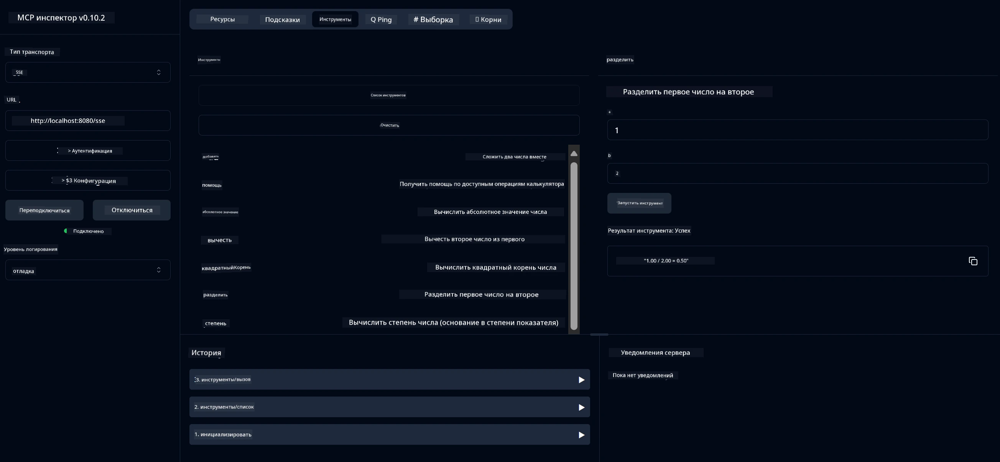

# Сервис базового калькулятора MCP

> [!NOTE]
> Это решение на Java использует устаревший транспорт HTTP+SSE и рассчитано на SDK,
> совместимый с MCP `2025-11-25`. Оно сохранено для соответствия коду курса;
> новые удалённые серверы должны использовать поддержку Streamable HTTP версии `2026-07-28`.

Этот сервис предоставляет базовые операции калькулятора через Протокол Контекста Модели (MCP) с использованием Spring Boot и транспорта WebFlux. Он разработан как простой пример для начинающих, изучающих реализации MCP.

Для получения дополнительной информации смотрите справочную документацию [MCP Server Boot Starter](https://docs.spring.io/spring-ai/reference/api/mcp/mcp-server-boot-starter-docs.html).


## Использование сервиса

Сервис предоставляет следующие конечные точки API через протокол MCP:

- `add(a, b)`: Сложить два числа
- `subtract(a, b)`: Вычесть второе число из первого
- `multiply(a, b)`: Умножить два числа
- `divide(a, b)`: Разделить первое число на второе (с проверкой на ноль)
- `power(base, exponent)`: Вычислить степень числа
- `squareRoot(number)`: Вычислить квадратный корень (с проверкой на отрицательное число)
- `modulus(a, b)`: Вычислить остаток от деления
- `absolute(number)`: Вычислить абсолютное значение

## Зависимости

Проект требует следующих ключевых зависимостей:

```xml
<dependency>
    <groupId>org.springframework.ai</groupId>
    <artifactId>spring-ai-starter-mcp-server-webflux</artifactId>
</dependency>
```

## Сборка проекта

Соберите проект с помощью Maven:
```bash
./mvnw clean install -DskipTests
```

## Запуск сервера

### Использование Java

```bash
java -jar target/calculator-server-0.0.1-SNAPSHOT.jar
```

### Использование MCP Inspector

MCP Inspector — полезный инструмент для взаимодействия с MCP-сервисами. Чтобы использовать его с этим сервисом калькулятора:

1. **Установите и запустите MCP Inspector** в новом окне терминала:
   ```bash
   npx @modelcontextprotocol/inspector
   ```

2. **Откройте веб-интерфейс**, перейдя по URL, отображаемому приложением (обычно http://localhost:6274)

3. **Настройте подключение**:
   - Выберите тип транспорта "SSE"
   - Укажите URL SSE-эндпоинта вашего работающего сервера: `http://localhost:8080/sse`
   - Нажмите "Подключиться"

4. **Используйте инструменты**:
   - Нажмите "List Tools", чтобы увидеть доступные операции калькулятора
   - Выберите инструмент и нажмите "Run Tool" для выполнения операции



---

<!-- CO-OP TRANSLATOR DISCLAIMER START -->
**Отказ от ответственности**:
Этот документ был переведен с использованием сервиса машинного перевода [Co-op Translator](https://github.com/Azure/co-op-translator). Несмотря на наши усилия по обеспечению точности, имейте в виду, что автоматический перевод может содержать ошибки или неточности. Оригинальный документ на его исходном языке следует считать авторитетным источником. Для получения критически важной информации рекомендуется обратиться к профессиональному человеческому переводу. Мы не несем ответственности за любые недоразумения или неправильные толкования, возникшие в результате использования этого перевода.
<!-- CO-OP TRANSLATOR DISCLAIMER END -->