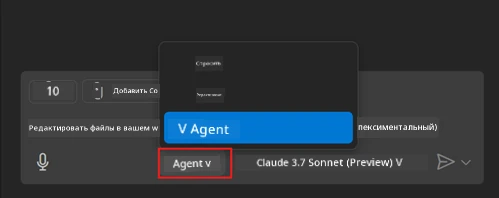
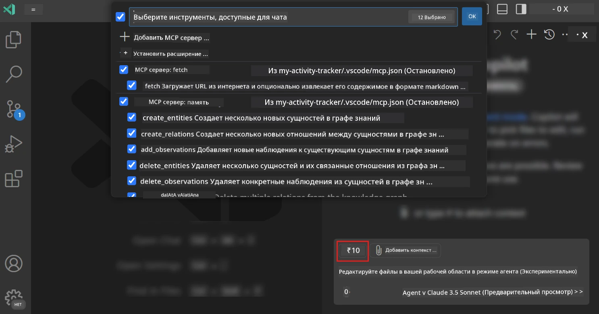
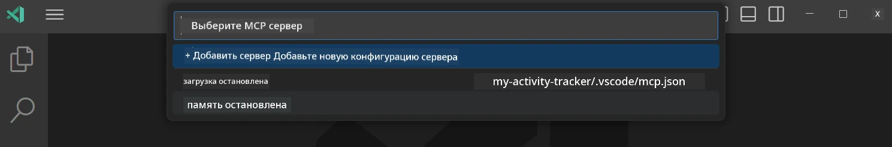
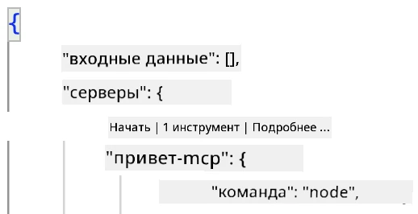
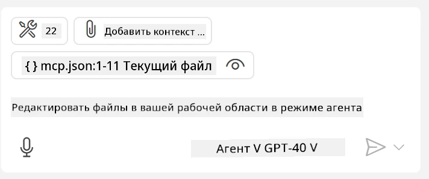
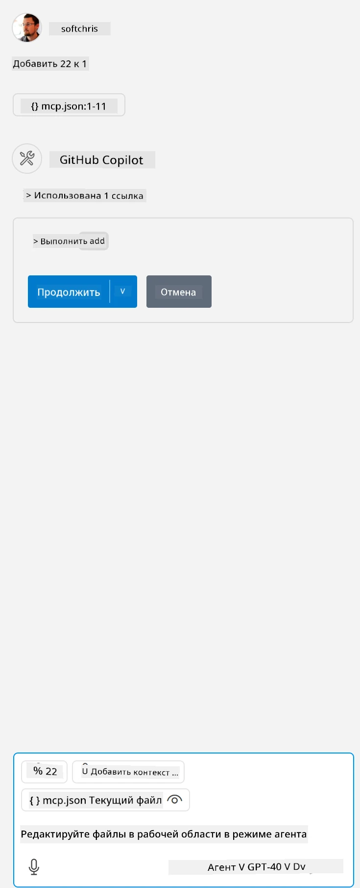

# Использование сервера из режима агента GitHub Copilot

Visual Studio Code и GitHub Copilot могут выступать в роли клиента и использовать MCP Server. Зачем это нужно, спросите вы? Это означает, что все функции MCP Server теперь можно использовать прямо из вашей IDE. Представьте, что вы добавляете, например, MCP сервер GitHub, это позволит управлять GitHub с помощью подсказок вместо ввода конкретных команд в терминале. Или представьте что-то, что в целом может улучшить ваш опыт разработчика, управляемое с помощью естественного языка. Теперь вы видите преимущество, верно?

## Обзор

В этом уроке рассказывается, как использовать Visual Studio Code и режим агента GitHub Copilot в качестве клиента для вашего MCP Server.

## Цели обучения

К концу урока вы сможете:

- Использовать MCP Server через Visual Studio Code.
- Запускать возможности, такие как инструменты, через GitHub Copilot.
- Настроить Visual Studio Code для поиска и управления вашим MCP Server.

## Использование

Вы можете управлять сервером MCP двумя способами:

- Через пользовательский интерфейс, вы увидите, как это делается, позже в этой главе.
- Через терминал, управление возможно с помощью исполняемого файла `code`:

  Чтобы добавить MCP сервер в ваш пользовательский профиль, используйте опцию командной строки --add-mcp и укажите конфигурацию сервера в формате JSON {\"name\":\"имя-сервера\",\"command\":...}.

  ```
  code --add-mcp "{\"name\":\"my-server\",\"command\": \"uvx\",\"args\": [\"mcp-server-fetch\"]}"
  ```

### Скриншоты





Подробнее о том, как использовать визуальный интерфейс, поговорим в следующих разделах.

## Подход

Вот общий план наших действий:

- Настроить файл для поиска MCP Server.
- Запустить/подключиться к серверу для получения списка его возможностей.
- Использовать эти возможности через интерфейс GitHub Copilot Chat.

Отлично, теперь когда мы понимаем последовательность, давайте попробуем использовать MCP Server через Visual Studio Code в упражнении.

## Упражнение: Использование сервера

В этом упражнении мы настроим Visual Studio Code для обнаружения вашего MCP сервера, чтобы использовать его через интерфейс GitHub Copilot Chat.

### -0- Предварительный шаг: включение обнаружения MCP Server

Возможно, вам нужно включить обнаружение MCP Server.

1. Перейдите в `File -> Preferences -> Settings` в Visual Studio Code.

2. Найдите "MCP" и включите `chat.mcp.discovery.enabled` в файле settings.json.

### -1- Создание конфигурационного файла

Начните с создания конфигурационного файла в корне вашего проекта — должен быть файл MCP.json в папке .vscode. Пример выглядит так:

```text
.vscode
|-- mcp.json
```

Далее посмотрим, как добавить запись сервера.

### -2- Настройка сервера

Добавьте следующее содержимое в *mcp.json*:

```json
{
    "inputs": [],
    "servers": {
       "hello-mcp": {
           "command": "node",
           "args": [
               "build/index.js"
           ]
       }
    }
}
```

Приведён простой пример того, как запустить сервер на Node.js, для других платформ укажите правильную команду запуска сервера с помощью `command` и `args`.

### -3- Запуск сервера

Теперь, когда вы добавили запись, давайте запустим сервер:

1. Найдите вашу запись в *mcp.json* и убедитесь, что видите иконку "play":

    

2. Нажмите на иконку "play", в интерфейсе GitHub Copilot Chat должна увеличиться численность доступных инструментов. Если нажать на иконку инструментов, вы увидите список зарегистрированных инструментов. Можно отмечать или снимать отметки с инструментов, в зависимости от того, какие из них GitHub Copilot должен использовать как контекст:

  

3. Чтобы запустить инструмент, введите запрос, который совпадает с описанием одного из ваших инструментов, например, запрос типа "add 22 to 1":

  

  Вы должны увидеть ответ с результатом 23.

## Задание

Попробуйте добавить запись сервера в файл *mcp.json* и убедитесь, что можете запускать и останавливать сервер. Убедитесь также, что можете обмениваться данными с инструментами вашего сервера через интерфейс GitHub Copilot Chat.

## Решение

[Решение](./solution/README.md)

## Основные выводы

Основные выводы из этой главы:

- Visual Studio Code — отличный клиент, который позволяет использовать несколько MCP Server и их инструменты.
- Интерфейс GitHub Copilot Chat — это способ взаимодействия с серверами.
- Вы можете запрашивать у пользователя ввод, например, API ключи, которые можно передавать MCP Server при настройке записи сервера в файле *mcp.json*.

## Примеры

- [Java Calculator](../samples/java/calculator/README.md)
- [.Net Calculator](../../../../03-GettingStarted/samples/csharp)
- [JavaScript Calculator](../samples/javascript/README.md)
- [TypeScript Calculator](../samples/typescript/README.md)
- [Python Calculator](../../../../03-GettingStarted/samples/python)

## Дополнительные ресурсы

- [Документация Visual Studio](https://code.visualstudio.com/docs/copilot/chat/mcp-servers)

## Что дальше

- Далее: [Создание stdio сервера](../05-stdio-server/README.md)

---

<!-- CO-OP TRANSLATOR DISCLAIMER START -->
**Отказ от ответственности**:
Этот документ был переведен с использованием сервиса машинного перевода [Co-op Translator](https://github.com/Azure/co-op-translator). Несмотря на наши усилия по обеспечению точности, имейте в виду, что автоматический перевод может содержать ошибки или неточности. Оригинальный документ на его исходном языке следует считать авторитетным источником. Для получения критически важной информации рекомендуется обратиться к профессиональному человеческому переводу. Мы не несем ответственности за любые недоразумения или неправильные толкования, возникшие в результате использования этого перевода.
<!-- CO-OP TRANSLATOR DISCLAIMER END -->