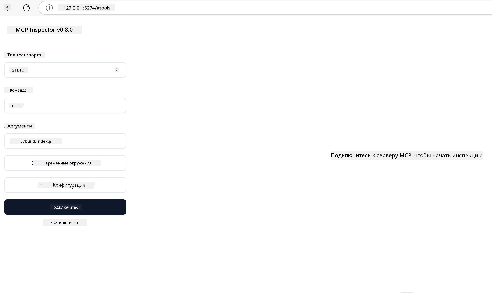

## Тестирование и отладка

Прежде чем начать тестировать ваш сервер MCP, важно понять доступные инструменты и лучшие практики для отладки. Эффективное тестирование гарантирует, что ваш сервер работает как ожидалось, и помогает быстро выявлять и устранять проблемы. В следующем разделе описаны рекомендации по проверке реализации MCP.

## Обзор

Этот урок охватывает, как выбрать правильный подход к тестированию и самый эффективный инструмент для тестирования.

## Цели обучения

К концу этого урока вы сможете:

- Описывать различные подходы к тестированию.
- Использовать разные инструменты для эффективного тестирования вашего кода.

## Тестирование серверов MCP

MCP предоставляет инструменты, которые помогут вам тестировать и отлаживать ваши серверы:

- **MCP Inspector**: Инструмент командной строки, который можно запускать как CLI-инструмент, так и в визуальном режиме.
- **Ручное тестирование**: Вы можете использовать такие инструменты, как curl, для выполнения веб-запросов, но подойдет любой инструмент, способный выполнять HTTP-запросы.
- **Модульное тестирование**: Можно использовать предпочитаемый вами фреймворк для тестирования функций как сервера, так и клиента.

### Использование MCP Inspector

Мы описывали использование этого инструмента в предыдущих уроках, но давайте кратко обсудим его на более высоком уровне. Это инструмент, написанный на Node.js, который вы можете использовать, вызвав исполняемый файл `npx`. Он временно загрузит и установит сам инструмент, а после выполнения вашего запроса удалит себя.

[MCP Inspector](https://github.com/modelcontextprotocol/inspector) помогает вам:

- **Обнаруживать возможности сервера**: Автоматически определять доступные ресурсы, инструменты и подсказки
- **Тестировать выполнение инструментов**: Пробовать разные параметры и видеть ответы в реальном времени
- **Просматривать метаданные сервера**: Изучать информацию о сервере, схемы и конфигурации

Типичный запуск инструмента выглядит так:

```bash
npx @modelcontextprotocol/inspector node build/index.js
```

Вышеуказанная команда запускает MCP и его визуальный интерфейс, открывая локальный веб-интерфейс в вашем браузере. Вы увидите панель управления с зарегистрированными серверами MCP, их доступными инструментами, ресурсами и подсказками. Интерфейс позволяет интерактивно тестировать выполнение инструментов, просматривать метаданные сервера и видеть ответы в реальном времени, что облегчает проверку и отладку ваших реализаций сервера MCP.

Вот как это может выглядеть: 

Вы также можете запускать этот инструмент в режиме CLI, добавив атрибут `--cli`. Вот пример запуска инструмента в режиме «CLI», который выводит список всех инструментов на сервере:

```sh
npx @modelcontextprotocol/inspector --cli node build/index.js --method tools/list
```

### Ручное тестирование

Помимо запуска инструмента inspector для проверки возможностей сервера, другой похожий подход — использовать клиент, способный работать с HTTP, например curl.

С помощью curl вы можете тестировать серверы MCP напрямую через HTTP-запросы:

```bash
# Пример: Метаданные тестового сервера
curl http://localhost:3000/v1/metadata

# Пример: Выполнить инструмент
curl -X POST http://localhost:3000/v1/tools/execute \
  -H "Content-Type: application/json" \
  -d '{"name": "calculator", "parameters": {"expression": "2+2"}}'
```

Как видно из приведенного примера использования curl, вы используете POST-запрос для вызова инструмента с полезной нагрузкой, содержащей имя инструмента и его параметры. Используйте тот подход, который вам больше подходит. CLI-инструменты, как правило, работают быстрее и позволяют создавать скрипты, что может быть полезно в средах CI/CD.

### Модульное тестирование

Создавайте модульные тесты для ваших инструментов и ресурсов, чтобы убедиться, что они работают правильно. Вот пример кода для тестирования.

```python
import pytest

from mcp.server.fastmcp import FastMCP
from mcp.shared.memory import (
    create_connected_server_and_client_session as create_session,
)

# Отметить весь модуль для асинхронных тестов
pytestmark = pytest.mark.anyio


async def test_list_tools_cursor_parameter():
    """Test that the cursor parameter is accepted for list_tools.

    Note: FastMCP doesn't currently implement pagination, so this test
    only verifies that the cursor parameter is accepted by the client.
    """

 server = FastMCP("test")

    # Создать пару инструментов для тестирования
    @server.tool(name="test_tool_1")
    async def test_tool_1() -> str:
        """First test tool"""
        return "Result 1"

    @server.tool(name="test_tool_2")
    async def test_tool_2() -> str:
        """Second test tool"""
        return "Result 2"

    async with create_session(server._mcp_server) as client_session:
        # Тест без параметра cursor (пропущен)
        result1 = await client_session.list_tools()
        assert len(result1.tools) == 2

        # Тест с cursor=None
        result2 = await client_session.list_tools(cursor=None)
        assert len(result2.tools) == 2

        # Тест с cursor в виде строки
        result3 = await client_session.list_tools(cursor="some_cursor_value")
        assert len(result3.tools) == 2

        # Тест с пустой строкой cursor
        result4 = await client_session.list_tools(cursor="")
        assert len(result4.tools) == 2
    
```

Приведенный выше код делает следующее:

- Использует фреймворк pytest, который позволяет создавать тесты в виде функций и использовать assert утверждения.
- Создает MCP-сервер с двумя различными инструментами.
- С помощью оператора `assert` проверяет выполнение определенных условий.

Посмотрите [полный файл здесь](https://github.com/modelcontextprotocol/python-sdk/blob/main/tests/client/test_list_methods_cursor.py)

Исходя из вышеуказанного файла, вы можете протестировать свой собственный сервер, чтобы убедиться, что возможности создаются правильно.

Все основные SDK имеют похожие разделы тестирования, поэтому вы можете адаптировать их к выбранному вами окружению.

## Примеры

- [Java Calculator](../samples/java/calculator/README.md)
- [.Net Calculator](../../../../03-GettingStarted/samples/csharp)
- [JavaScript Calculator](../samples/javascript/README.md)
- [TypeScript Calculator](../samples/typescript/README.md)
- [Python Calculator](../../../../03-GettingStarted/samples/python)

## Дополнительные ресурсы

- [Python SDK](https://github.com/modelcontextprotocol/python-sdk)

## Что дальше

- Далее: [Развертывание](../09-deployment/README.md)

---

<!-- CO-OP TRANSLATOR DISCLAIMER START -->
**Отказ от ответственности**:  
Данный документ был переведен с помощью сервисa машинного перевода [Co-op Translator](https://github.com/Azure/co-op-translator). Несмотря на наши старания обеспечить точность, имейте в виду, что автоматический перевод может содержать ошибки или неточности. Оригинальный документ на его исходном языке следует считать авторитетным источником. Для критически важной информации рекомендуется профессиональный перевод человеком. Мы не несем ответственности за любые недоразумения или неправильные толкования, возникшие в результате использования данного перевода.
<!-- CO-OP TRANSLATOR DISCLAIMER END -->