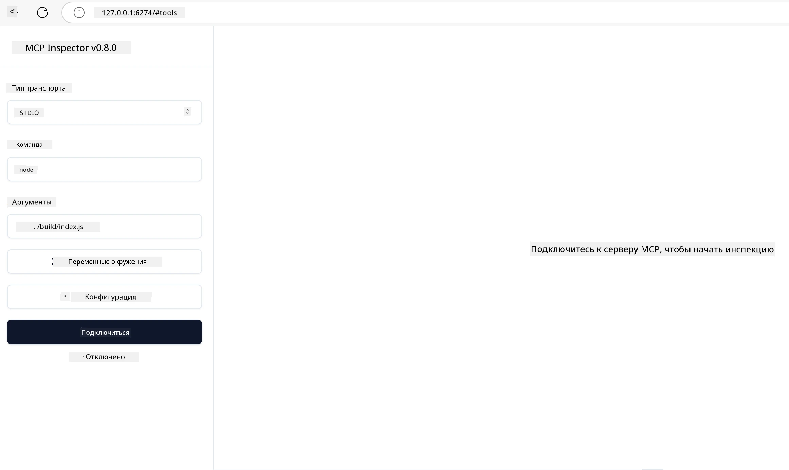

## Тестирование и отладка

Прежде чем начать тестировать ваш MCP сервер, важно понять доступные инструменты и лучшие практики отладки. Эффективное тестирование гарантирует, что ваш сервер работает так, как ожидается, и помогает быстро выявлять и устранять проблемы. В следующем разделе описаны рекомендованные подходы к проверке реализации MCP.

## Обзор

В этом уроке рассматривается, как выбрать правильный подход к тестированию и самый эффективный инструмент для этого.

## Цели обучения

К концу этого урока вы сможете:

- Описывать различные подходы к тестированию.
- Использовать разные инструменты для эффективного тестирования кода.


## Тестирование MCP серверов

MCP предоставляет инструменты, которые помогут вам тестировать и отлаживать ваши серверы:

- **MCP Inspector**: Инструмент командной строки, который можно запускать как в режиме CLI, так и в визуальном режиме.
- **Ручное тестирование**: Вы можете использовать инструмент вроде curl для выполнения веб-запросов, но подойдут любые средства, способные выполнять HTTP-запросы.
- **Юнит-тестирование**: Можно использовать предпочитаемый вами фреймворк тестирования для проверки функций как серверной, так и клиентской части.

### Использование MCP Inspector

Мы уже описывали использование этого инструмента в предыдущих уроках, но давайте кратко обсудим его. Это инструмент, написанный на Node.js, и вы можете использовать его, вызвав исполняемый файл `npx`, который временно загрузит и установит сам инструмент, а затем удалит его после выполнения вашего запроса.

[MCP Inspector](https://github.com/modelcontextprotocol/inspector) помогает вам:

- **Обнаруживать возможности сервера**: Автоматически определять доступные ресурсы, инструменты и подсказки
- **Тестировать выполнение инструментов**: Пробовать разные параметры и видеть ответы в реальном времени
- **Просматривать метаданные сервера**: Исследовать информацию о сервере, схемы и конфигурации

Типичный запуск инструмента выглядит так:

```bash
npx @modelcontextprotocol/inspector node build/index.js
```

Указанная команда запускает MCP и его визуальный интерфейс, а также открывает локальный веб-интерфейс в вашем браузере. Вы увидите панель управления с вашими зарегистрированными MCP серверами, их доступными инструментами, ресурсами и подсказками. Интерфейс позволяет интерактивно тестировать выполнение инструментов, просматривать метаданные сервера и получать ответы в реальном времени, что облегчает проверку и отладку ваших реализаций MCP серверов.

Вот как это может выглядеть: 

Также вы можете запустить этот инструмент в режиме CLI, добавив атрибут `--cli`. Пример запуска инструмента в режиме «CLI», который выводит все инструменты на сервере:

```sh
npx @modelcontextprotocol/inspector --cli node build/index.js --method tools/list
```

### Ручное тестирование

Помимо запуска инструмента inspector для проверки возможностей сервера, можно использовать аналогичный подход с клиентом, способным выполнять HTTP-запросы, например curl.

С помощью curl вы можете тестировать MCP серверы напрямую, используя HTTP-запросы:

```bash
# Пример: метаданные тестового сервера
curl http://localhost:3000/v1/metadata

# Пример: выполнение инструмента
curl -X POST http://localhost:3000/v1/tools/execute \
  -H "Content-Type: application/json" \
  -d '{"name": "calculator", "parameters": {"expression": "2+2"}}'
```

Как видно из вышеуказанного примера использования curl, вы используете POST-запрос для вызова инструмента с полезной нагрузкой, состоящей из имени инструмента и его параметров. Используйте подход, который вам больше подходит. Инструменты командной строки, как правило, работают быстрее и легко поддаются автоматизации, что полезно в средах CI/CD.

### Юнит-тестирование

Создавайте юнит-тесты для ваших инструментов и ресурсов, чтобы обеспечить их корректную работу. Вот пример тестового кода.

```python
import pytest

from mcp.server.fastmcp import FastMCP
from mcp.shared.memory import (
    create_connected_server_and_client_session as create_session,
)

# Пометить весь модуль для асинхронных тестов
pytestmark = pytest.mark.anyio


async def test_list_tools_cursor_parameter():
    """Test that the cursor parameter is accepted for list_tools.

    Note: FastMCP doesn't currently implement pagination, so this test
    only verifies that the cursor parameter is accepted by the client.
    """

 server = FastMCP("test")

    # Создать пару тестовых инструментов
    @server.tool(name="test_tool_1")
    async def test_tool_1() -> str:
        """First test tool"""
        return "Result 1"

    @server.tool(name="test_tool_2")
    async def test_tool_2() -> str:
        """Second test tool"""
        return "Result 2"

    async with create_session(server._mcp_server) as client_session:
        # Тест без параметра cursor (пропущен)
        result1 = await client_session.list_tools()
        assert len(result1.tools) == 2

        # Тест с cursor=None
        result2 = await client_session.list_tools(cursor=None)
        assert len(result2.tools) == 2

        # Тест с cursor в виде строки
        result3 = await client_session.list_tools(cursor="some_cursor_value")
        assert len(result3.tools) == 2

        # Тест с пустой строкой cursor
        result4 = await client_session.list_tools(cursor="")
        assert len(result4.tools) == 2
    
```

Приведённый код делает следующее:

- Использует фреймворк pytest, который позволяет создавать тесты в виде функций и использовать утверждения assert.
- Создаёт MCP сервер с двумя разными инструментами.
- Использует оператор `assert` для проверки выполнения определённых условий.

Ознакомьтесь с [полным файлом здесь](https://github.com/modelcontextprotocol/python-sdk/blob/main/tests/client/test_list_methods_cursor.py)

Используя вышеуказанный файл, вы можете протестировать собственный сервер, чтобы убедиться, что возможности созданы корректно.

Все основные SDK имеют аналогичные разделы для тестирования, так что вы можете адаптироваться под выбранную среду выполнения.

## Примеры 

- [Калькулятор на Java](../samples/java/calculator/README.md)
- [Калькулятор на .Net](../../../../03-GettingStarted/samples/csharp)
- [Калькулятор на JavaScript](../samples/javascript/README.md)
- [Калькулятор на TypeScript](../samples/typescript/README.md)
- [Калькулятор на Python](../../../../03-GettingStarted/samples/python) 

## Дополнительные ресурсы

- [Python SDK](https://github.com/modelcontextprotocol/python-sdk)

## Что дальше

- Далее: [Развертывание](../09-deployment/README.md)

---

<!-- CO-OP TRANSLATOR DISCLAIMER START -->
**Отказ от ответственности**:
Этот документ был переведен с использованием сервиса машинного перевода [Co-op Translator](https://github.com/Azure/co-op-translator). Несмотря на наши усилия по обеспечению точности, имейте в виду, что автоматический перевод может содержать ошибки или неточности. Оригинальный документ на его исходном языке следует считать авторитетным источником. Для получения критически важной информации рекомендуется обратиться к профессиональному человеческому переводу. Мы не несем ответственности за любые недоразумения или неправильные толкования, возникшие в результате использования этого перевода.
<!-- CO-OP TRANSLATOR DISCLAIMER END -->