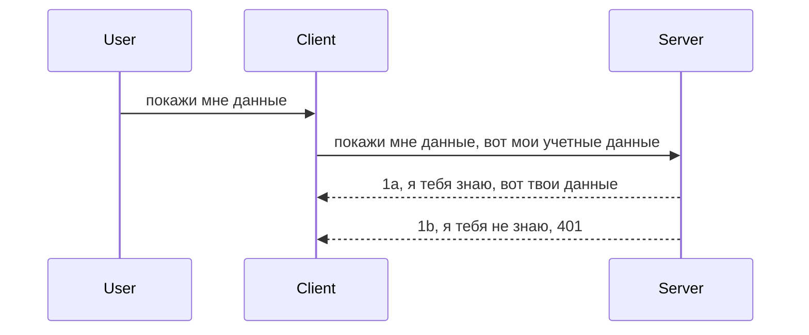

# Простая аутентификация

MCP SDK поддерживают использование OAuth 2.1, что, честно говоря, является довольно сложным процессом, включающим такие концепты, как сервер аутентификации, сервер ресурсов, отправка учетных данных, получение кода, обмен кода на токен без предъявления, пока вы не получите доступ к данным ресурса. Если вы не знакомы с OAuth, что является отличным решением для реализации, лучше начать с базового уровня аутентификации и постепенно переходить к более продвинутой безопасности. Именно поэтому существует эта глава — чтобы подготовить вас к более сложной аутентификации.

## Аутентификация, что мы подразумеваем?

Auth — это сокращение от аутентификации и авторизации. Идея заключается в том, что нам нужно сделать две вещи:

- **Аутентификация** — процесс определения, разрешаем ли мы человеку войти в наш дом, то есть имеет ли он право быть «здесь», то есть доступ к нашему серверу ресурсов, где работают функции MCP Server.
- **Авторизация** — процесс определения, должен ли пользователь иметь доступ к конкретным ресурсам, которые он запрашивает, например, к этим заказам или продуктам, или разрешено ли ему только читать контент, но не удалять, как другой пример.

## Учетные данные: как мы говорим системе, кто мы

Большинство веб-разработчиков начинают думать в терминах предоставления учетных данных серверу, обычно секретного ключа, который говорит, разрешено ли им «здесь быть» — аутентификация. Обычно эти учетные данные — это base64-кодированная версия имени пользователя и пароля или API-ключ, который уникально идентифицирует конкретного пользователя.

Это отправляется через заголовок с именем "Authorization" следующим образом:

```json
{ "Authorization": "secret123" }
```
  
Это обычно называют базовой аутентификацией. Общий поток работы выглядит следующим образом:


Теперь, когда мы понимаем, как это работает с точки зрения процесса, как нам это реализовать? Большинство веб-серверов имеют понятие middleware — кусочек кода, который выполняется в рамках запроса и может проверять учетные данные, и если они действительны, пропускать запрос дальше. Если учетных данных нет или они недействительны, возвращается ошибка аутентификации. Посмотрим, как это можно реализовать:

**Python**

```python
class AuthMiddleware(BaseHTTPMiddleware):
    async def dispatch(self, request, call_next):

        has_header = request.headers.get("Authorization")
        if not has_header:
            print("-> Missing Authorization header!")
            return Response(status_code=401, content="Unauthorized")

        if not valid_token(has_header):
            print("-> Invalid token!")
            return Response(status_code=403, content="Forbidden")

        print("Valid token, proceeding...")
       
        response = await call_next(request)
        # добавьте любые заголовки клиента или измените ответ каким-либо образом
        return response


starlette_app.add_middleware(CustomHeaderMiddleware)
```
  
Здесь мы:

- Создали middleware под названием `AuthMiddleware`, метод `dispatch` которого вызывается веб-сервером.
- Добавили middleware в веб-сервер:

    ```python
    starlette_app.add_middleware(AuthMiddleware)
    ```
  
- Написали логику проверки, которая проверяет, присутствует ли заголовок Authorization и действителен ли отправляемый секрет:

    ```python
    has_header = request.headers.get("Authorization")
    if not has_header:
        print("-> Missing Authorization header!")
        return Response(status_code=401, content="Unauthorized")

    if not valid_token(has_header):
        print("-> Invalid token!")
        return Response(status_code=403, content="Forbidden")
    ```
  
Если секрет присутствует и действителен, мы пропускаем запрос дальше, вызвав `call_next` и возвращаем ответ.

    ```python
    response = await call_next(request)
    # добавьте любые заголовки клиента или измените ответ каким-либо образом
    return response
    ```
  
Работает это так, что при поступлении веб-запроса к серверу вызывается middleware, и в зависимости от его реализации запрос либо пропускается дальше, либо возвращается ошибка, указывающая, что клиенту нельзя продолжать.

**TypeScript**

Здесь мы создаем middleware с помощью популярного фреймворка Express и перехватываем запрос до того, как он достигнет MCP Server. Вот код:

```typescript
function isValid(secret) {
    return secret === "secret123";
}

app.use((req, res, next) => {
    // 1. Заголовок авторизации присутствует?
    if(!req.headers["Authorization"]) {
        res.status(401).send('Unauthorized');
    }
    
    let token = req.headers["Authorization"];

    // 2. Проверка действительности.
    if(!isValid(token)) {
        res.status(403).send('Forbidden');
    }

   
    console.log('Middleware executed');
    // 3. Передать запрос на следующий этап обработки.
    next();
});
```
  
В этом коде:

1. Проверяем, присутствует ли заголовок Authorization, если нет — отправляем ошибку 401.
2. Проверяем, действительны ли учетные данные/токен, если нет — отправляем ошибку 403.
3. Наконец, передаем запрос дальше по конвейеру запросов и возвращаем запрашиваемый ресурс.

## Упражнение: Реализуем аутентификацию

Давайте применим наши знания на практике. Вот план:

Сервер

- Создать веб-сервер и экземпляр MCP.
- Реализовать middleware на сервере.

Клиент

- Отправить веб-запрос с учетными данными через заголовок.

### -1- Создать веб-сервер и экземпляр MCP

На первом шаге нам нужно создать экземпляр веб-сервера и MCP Server.

**Python**

Создаем экземпляр MCP Server, создаем starlette веб-приложение и запускаем его с помощью uvicorn.

```python
# создание MCP сервера

app = FastMCP(
    name="MCP Resource Server",
    instructions="Resource Server that validates tokens via Authorization Server introspection",
    host=settings["host"],
    port=settings["port"],
    debug=True
)

# создание starlette веб-приложения
starlette_app = app.streamable_http_app()

# обслуживание приложения через uvicorn
async def run(starlette_app):
    import uvicorn
    config = uvicorn.Config(
            starlette_app,
            host=app.settings.host,
            port=app.settings.port,
            log_level=app.settings.log_level.lower(),
        )
    server = uvicorn.Server(config)
    await server.serve()

run(starlette_app)
```
  
В этом коде мы:

- Создаем MCP Server.
- Строим starlette веб-приложение из MCP Server через `app.streamable_http_app()`.
- Запускаем и обслуживаем веб-приложение через uvicorn с `server.serve()`.

**TypeScript**

Здесь мы создаем экземпляр MCP Server.

```typescript
const server = new McpServer({
      name: "example-server",
      version: "1.0.0"
    });

    // ... настройка ресурсов сервера, инструментов и подсказок ...
```
  
Создание MCP Server должно происходить в определении маршрута POST /mcp, поэтому перенесем приведенный код сюда:

```typescript
import express from "express";
import { randomUUID } from "node:crypto";
import { McpServer } from "@modelcontextprotocol/sdk/server/mcp.js";
import { StreamableHTTPServerTransport } from "@modelcontextprotocol/sdk/server/streamableHttp.js";
import { isInitializeRequest } from "@modelcontextprotocol/sdk/types.js"

const app = express();
app.use(express.json());

// Карта для хранения транспортов по ID сессии
const transports: { [sessionId: string]: StreamableHTTPServerTransport } = {};

// Обработка POST-запросов для связи клиента с сервером
app.post('/mcp', async (req, res) => {
  // Проверить наличие существующего ID сессии
  const sessionId = req.headers['mcp-session-id'] as string | undefined;
  let transport: StreamableHTTPServerTransport;

  if (sessionId && transports[sessionId]) {
    // Повторно использовать существующий транспорт
    transport = transports[sessionId];
  } else if (!sessionId && isInitializeRequest(req.body)) {
    // Новый запрос инициализации
    transport = new StreamableHTTPServerTransport({
      sessionIdGenerator: () => randomUUID(),
      onsessioninitialized: (sessionId) => {
        // Сохранить транспорт по ID сессии
        transports[sessionId] = transport;
      },
      // Защита от DNS rebinding по умолчанию отключена для обратной совместимости. Если вы запускаете этот сервер
      // локально, убедитесь, что установили:
      // enableDnsRebindingProtection: true,
      // allowedHosts: ['127.0.0.1'],
    });

    // Очистить транспорт при закрытии
    transport.onclose = () => {
      if (transport.sessionId) {
        delete transports[transport.sessionId];
      }
    };
    const server = new McpServer({
      name: "example-server",
      version: "1.0.0"
    });

    // ... настроить ресурсы сервера, инструменты и подсказки ...

    // Подключение к серверу MCP
    await server.connect(transport);
  } else {
    // Неверный запрос
    res.status(400).json({
      jsonrpc: '2.0',
      error: {
        code: -32000,
        message: 'Bad Request: No valid session ID provided',
      },
      id: null,
    });
    return;
  }

  // Обработать запрос
  await transport.handleRequest(req, res, req.body);
});

// Переиспользуемый обработчик для GET и DELETE-запросов
const handleSessionRequest = async (req: express.Request, res: express.Response) => {
  const sessionId = req.headers['mcp-session-id'] as string | undefined;
  if (!sessionId || !transports[sessionId]) {
    res.status(400).send('Invalid or missing session ID');
    return;
  }
  
  const transport = transports[sessionId];
  await transport.handleRequest(req, res);
};

// Обработка GET-запросов для уведомлений от сервера к клиенту через SSE
app.get('/mcp', handleSessionRequest);

// Обработка DELETE-запросов для завершения сессии
app.delete('/mcp', handleSessionRequest);

app.listen(3000);
```
  
Теперь вы видите, как создание MCP Server оказалось внутри `app.post("/mcp")`.

Переходим к следующему шагу — созданию middleware для проверки входящих учетных данных.

### -2- Реализовать middleware для сервера

Переходим к middleware. Здесь мы создадим middleware, который проверяет наличие учетных данных в заголовке `Authorization` и валидирует их. Если они подходят, запрос продолжит выполнение (например, перечисление инструментов, чтение ресурса или любая другая функциональность MCP, запрошенная клиентом).

**Python**

Для создания middleware создаем класс, наследующийся от `BaseHTTPMiddleware`. Важны две вещи:

- `request` — из него мы читаем заголовки.
- `call_next` — коллбэк, который вызываем, если учетные данные приняты.

Сначала обрабатываем случай, если заголовок `Authorization` отсутствует:

```python
has_header = request.headers.get("Authorization")

# заголовок отсутствует, вернуть ошибку 401, иначе продолжить.
if not has_header:
    print("-> Missing Authorization header!")
    return Response(status_code=401, content="Unauthorized")
```
  
Здесь отправляем 401 unauthorized, так как клиент не проходит аутентификацию.

Если же учетные данные были представлены, проверяем их валидность так:

```python
 if not valid_token(has_header):
    print("-> Invalid token!")
    return Response(status_code=403, content="Forbidden")
```
  
Обратите внимание, что здесь отправляется 403 forbidden. Полный код middleware, реализующий все описанное, приведен ниже:

```python
class AuthMiddleware(BaseHTTPMiddleware):
    async def dispatch(self, request, call_next):

        has_header = request.headers.get("Authorization")
        if not has_header:
            print("-> Missing Authorization header!")
            return Response(status_code=401, content="Unauthorized")

        if not valid_token(has_header):
            print("-> Invalid token!")
            return Response(status_code=403, content="Forbidden")

        print("Valid token, proceeding...")
        print(f"-> Received {request.method} {request.url}")
        response = await call_next(request)
        response.headers['Custom'] = 'Example'
        return response

```
  
Отлично, а что с функцией `valid_token`? Вот она:

```python
# НЕ используйте в продакшене - улучшайте !!
def valid_token(token: str) -> bool:
    # удалить префикс "Bearer "
    if token.startswith("Bearer "):
        token = token[7:]
        return token == "secret-token"
    return False
```
  
Очевидно, это нужно улучшать.

ВАЖНО: Никогда не храните секреты в коде. Лучше получать их из хранилища данных или от IDP (поставщика идентификаций) или, что лучше, позволить IDP выполнять валидацию.

**TypeScript**

Для реализации в Express нужно вызвать метод `use` с функцией middleware.

Нужно:

- Обработать запрос, проверить учетные данные в `Authorization`.
- Валидировать учетные данные и, если они корректны, пропускать запрос дальше и позволять запросу MCP делать своё (например, листинг инструментов, чтение ресурсов или другие возможности).

Здесь мы проверяем, есть ли заголовок `Authorization`, и если нет — останавливаем запрос:

```typescript
if(!req.headers["authorization"]) {
    res.status(401).send('Unauthorized');
    return;
}
```
  
Если заголовок не передан, возвращаем 401.

Далее проверяем, валиден ли токен, если нет — также останавливаем запрос, но с другим сообщением:

```typescript
if(!isValid(token)) {
    res.status(403).send('Forbidden');
    return;
} 
```
  
Теперь получаем ошибку 403.

Полный код:

```typescript
app.use((req, res, next) => {
    console.log('Request received:', req.method, req.url, req.headers);
    console.log('Headers:', req.headers["authorization"]);
    if(!req.headers["authorization"]) {
        res.status(401).send('Unauthorized');
        return;
    }
    
    let token = req.headers["authorization"];

    if(!isValid(token)) {
        res.status(403).send('Forbidden');
        return;
    }  

    console.log('Middleware executed');
    next();
});
```
  
Мы настроили веб-сервер с middleware, проверяющим учетные данные, которые клиент, надеемся, нам посылает. А как насчет клиента?

### -3- Отправить веб-запрос с учетными данными через заголовок

Нужно сделать так, чтобы клиент передавал учетные данные в заголовке. Поскольку мы будем использовать MCP клиент, разберемся, как это сделать.

**Python**

На клиенте передаются заголовки с учетными данными так:

```python
# НЕ прописывайте значение жестко, храните его как минимум в переменной окружения или в более безопасном хранилище
token = "secret-token"

async with streamablehttp_client(
        url = f"http://localhost:{port}/mcp",
        headers = {"Authorization": f"Bearer {token}"}
    ) as (
        read_stream,
        write_stream,
        session_callback,
    ):
        async with ClientSession(
            read_stream,
            write_stream
        ) as session:
            await session.initialize()
      
            # TODO, что вы хотите сделать на клиенте, например, перечислить инструменты, вызвать инструменты и т.д.
```
  
Обратите внимание, что мы формируем `headers` как `headers = {"Authorization": f"Bearer {token}"}`.

**TypeScript**

Решаем в два шага:

1. Формируем объект конфигурации с учетными данными.
2. Передаем этот объект конфигурации в транспорт.

```typescript

// НЕ жестко кодируйте значение, как показано здесь. Минимум, сделайте его переменной окружения и используйте что-то вроде dotenv (в режиме разработки).
let token = "secret123"

// определить объект опций транспорта клиента
let options: StreamableHTTPClientTransportOptions = {
  sessionId: sessionId,
  requestInit: {
    headers: {
      "Authorization": "secret123"
    }
  }
};

// передать объект опций в транспорт
async function main() {
   const transport = new StreamableHTTPClientTransport(
      new URL(serverUrl),
      options
   );
```
  
Здесь видим, как создается объект `options` с заголовками в свойстве `requestInit`.

ВАЖНО: Как же улучшить текущую реализацию? Передача учетных данных таким образом довольно рискованна, если у вас нет хотя бы HTTPS. Даже при HTTPS данные могут быть украдены, поэтому нужна система, позволяющая легко отзывать токен и добавлять дополнительные проверки, например, откуда он приходит, не слишком ли часто происходят запросы (бот-подобное поведение) и другие вопросы.

Тем не менее, для простых API, где не хочется, чтобы кто угодно вызывал ваш API без аутентификации, то что есть здесь — хороший старт.

С учетом этого давайте немного укрепим безопасность, используя стандартизированный формат JSON Web Token, известный как JWT или «JOT»-токены.

## JSON Web Tokens, JWT

Итак, мы хотим улучшить отправку очень простых учетных данных. Какие основные плюсы даёт внедрение JWT?

- **Улучшение безопасности**. При базовой аутентификации вы отправляете имя пользователя и пароль в виде base64-токена (или API-ключ) снова и снова, увеличивая риски. С JWT вы отправляете имя пользователя и пароль и получаете токен взамен, который ограничен по времени — срок действия истекает. JWT позволяет легко использовать тонкую настройку прав доступа через роли, области и разрешения.
- **Отсутствие состояния и масштабируемость**. JWT само содержит всю информацию о пользователе и снимает необходимость хранить сессии на сервере. Токен можно валидировать локально.
- **Взаимодействие и федерация**. JWT лежит в основе Open ID Connect и используется с известными поставщиками идентификаций, такими как Entra ID, Google Identity и Auth0. Они также поддерживают единую аутентификацию (SSO) и многое другое, что делает их пригодными для корпоративного использования.
- **Модульность и гибкость**. JWT можно использовать с API-шлюзами, такими как Azure API Management, NGINX и другими. Поддерживает сценарии аутентификации и связи между сервисами, включая имперсонацию и делегацию.
- **Производительность и кеширование**. JWT можно кешировать после декодирования, что снижает нагрузку на инфраструктуру, что особенно важно для приложений с высоким трафиком.
- **Продвинутые функции**. Поддерживаются интроспекция (проверка валидности на сервере) и отзыв токена (делание токена недействительным).

При всех этих преимуществах давайте посмотрим, как можно вывести нашу реализацию на новый уровень.

## Превращаем basic auth в JWT

На самом высоком уровне нам нужно:

- **Научиться формировать JWT токен** и делать его готовым к отправке от клиента к серверу.
- **Валидировать JWT токен**, и если всё в порядке, предоставлять клиенту доступ к ресурсам.
- **Обеспечить безопасное хранение токена**.
- **Защитить маршруты**. Нужно защитить маршруты, а в нашем случае — маршруты и конкретные функции MCP.
- **Добавить refresh-токены**. Создавать токены с коротким сроком действия и refresh-токены с долгим сроком действия для получения новых токенов при истечении. Также добавить endpoint для обновления токенов и стратегию ротации.

### -1- Формируем JWT токен

Во-первых, JWT токен состоит из следующих частей:

- **header** — алгоритм и тип токена.
- **payload** — утверждения (claims), например, sub (пользователь или сущность, которую представляет токен; обычно user id), exp (срок действия), role (роль).
- **signature** — подпись, сделанная с помощью секрета или приватного ключа.

Нужно сформировать header, payload и закодированный токен.

**Python**

```python

import jwt
import jwt
from jwt.exceptions import ExpiredSignatureError, InvalidTokenError
import datetime

# Секретный ключ, используемый для подписи JWT
secret_key = 'your-secret-key'

header = {
    "alg": "HS256",
    "typ": "JWT"
}

# информация о пользователе, его права и время истечения
payload = {
    "sub": "1234567890",               # Субъект (ID пользователя)
    "name": "User Userson",                # Пользовательское утверждение
    "admin": True,                     # Пользовательское утверждение
    "iat": datetime.datetime.utcnow(),# Время выпуска
    "exp": datetime.datetime.utcnow() + datetime.timedelta(hours=1)  # Время истечения
}

# закодировать это
encoded_jwt = jwt.encode(payload, secret_key, algorithm="HS256", headers=header)
```
  
В этом коде мы:

- Определили header с алгоритмом HS256 и типом JWT.
- Сформировали payload с идентификатором пользователя, именем пользователя, ролью, временем создания (iat) и временем истечения (exp), реализуя ограничение по времени.

**TypeScript**

Здесь понадобится несколько зависимостей, чтобы помочь собрать JWT токен.

Зависимости

```sh

npm install jsonwebtoken
npm install --save-dev @types/jsonwebtoken
```
  
Теперь, когда все есть, создадим header, payload и сгенерируем закодированный токен.

```typescript
import jwt from 'jsonwebtoken';

const secretKey = 'your-secret-key'; // Используйте переменные окружения в продакшене

// Определите полезную нагрузку
const payload = {
  sub: '1234567890',
  name: 'User usersson',
  admin: true,
  iat: Math.floor(Date.now() / 1000), // Время выдачи
  exp: Math.floor(Date.now() / 1000) + 60 * 60 // Истекает через 1 час
};

// Определите заголовок (необязательно, jsonwebtoken устанавливает значения по умолчанию)
const header = {
  alg: 'HS256',
  typ: 'JWT'
};

// Создайте токен
const token = jwt.sign(payload, secretKey, {
  algorithm: 'HS256',
  header: header
});

console.log('JWT:', token);
```
  
Этот токен:

Подписан с использованием HS256  
Действителен 1 час  
Содержит утверждения sub, name, admin, iat и exp.

### -2- Валидируем токен

Нужно также валидировать токен — делать это лучше на сервере, чтобы удостовериться, что то, что послал клиент, действительно корректно. Надо проверять структуру, срок действия и прочие характеристики. Рекомендуется добавить проверки, что данный пользователь действительно есть в системе и имеет заявленные права.

Для валидации токена нужно его декодировать и начать проверку:

**Python**

```python

# Раскодировать и проверить JWT
try:
    decoded = jwt.decode(token, secret_key, algorithms=["HS256"])
    print("✅ Token is valid.")
    print("Decoded claims:")
    for key, value in decoded.items():
        print(f"  {key}: {value}")
except ExpiredSignatureError:
    print("❌ Token has expired.")
except InvalidTokenError as e:
    print(f"❌ Invalid token: {e}")

```
  
В этом коде вызывается `jwt.decode` с токеном, секретным ключом и алгоритмом. Обратите внимание на конструкцию try-except — при неправильной валидации вызывается исключение.

**TypeScript**

Здесь вызывается `jwt.verify`, чтобы получить декодированный токен для дальнейшего анализа. При ошибке токен невалиден или имеет неправильную структуру.

```typescript

try {
  const decoded = jwt.verify(token, secretKey);
  console.log('Decoded Payload:', decoded);
} catch (err) {
  console.error('Token verification failed:', err);
}
```
   
ВАЖНО: как упоминалось, надо выполнять дополнительные проверки, чтобы убедиться, что токен указывает на пользователя в вашей системе и что у пользователя есть заявленные права.

Далее рассмотрим контроль доступа на основе ролей, известный как RBAC.
## Добавление контроля доступа на основе ролей

Идея в том, что мы хотим выразить, что разные роли имеют разные разрешения. Например, мы предполагаем, что администратор может делать всё, обычный пользователь может читать/писать, а гость может только читать. Поэтому вот возможные уровни разрешений:

- Admin.Write  
- User.Read  
- Guest.Read  

Давайте посмотрим, как мы можем реализовать такой контроль с помощью middleware. Middleware можно добавлять на маршрут, а также для всех маршрутов.

**Python**

```python
from starlette.middleware.base import BaseHTTPMiddleware
from starlette.responses import JSONResponse
import jwt

# НЕ храните секрет в коде, как здесь, это только для демонстрационных целей. Читайте его из безопасного места.
SECRET_KEY = "your-secret-key" # поместите это в переменную окружения
REQUIRED_PERMISSION = "User.Read"

class JWTPermissionMiddleware(BaseHTTPMiddleware):
    async def dispatch(self, request, call_next):
        auth_header = request.headers.get("Authorization")
        if not auth_header or not auth_header.startswith("Bearer "):
            return JSONResponse({"error": "Missing or invalid Authorization header"}, status_code=401)

        token = auth_header.split(" ")[1]
        try:
            decoded = jwt.decode(token, SECRET_KEY, algorithms=["HS256"])
        except jwt.ExpiredSignatureError:
            return JSONResponse({"error": "Token expired"}, status_code=401)
        except jwt.InvalidTokenError:
            return JSONResponse({"error": "Invalid token"}, status_code=401)

        permissions = decoded.get("permissions", [])
        if REQUIRED_PERMISSION not in permissions:
            return JSONResponse({"error": "Permission denied"}, status_code=403)

        request.state.user = decoded
        return await call_next(request)


```
  
Существует несколько способов добавить middleware, как показано ниже:

```python

# Вариант 1: добавить middleware при создании приложения starlette
middleware = [
    Middleware(JWTPermissionMiddleware)
]

app = Starlette(routes=routes, middleware=middleware)

# Вариант 2: добавить middleware после того, как приложение starlette уже создано
starlette_app.add_middleware(JWTPermissionMiddleware)

# Вариант 3: добавить middleware для каждого маршрута
routes = [
    Route(
        "/mcp",
        endpoint=..., # обработчик
        middleware=[Middleware(JWTPermissionMiddleware)]
    )
]
```
  
**TypeScript**

Мы можем использовать `app.use` и middleware, которое будет выполняться для всех запросов.

```typescript
app.use((req, res, next) => {
    console.log('Request received:', req.method, req.url, req.headers);
    console.log('Headers:', req.headers["authorization"]);

    // 1. Проверьте, был ли отправлен заголовок авторизации

    if(!req.headers["authorization"]) {
        res.status(401).send('Unauthorized');
        return;
    }
    
    let token = req.headers["authorization"];

    // 2. Проверьте, действителен ли токен
    if(!isValid(token)) {
        res.status(403).send('Forbidden');
        return;
    }  

    // 3. Проверьте, существует ли пользователь токена в нашей системе
    if(!isExistingUser(token)) {
        res.status(403).send('Forbidden');
        console.log("User does not exist");
        return;
    }
    console.log("User exists");

    // 4. Проверьте, что токен имеет правильные разрешения
    if(!hasScopes(token, ["User.Read"])){
        res.status(403).send('Forbidden - insufficient scopes');
    }

    console.log("User has required scopes");

    console.log('Middleware executed');
    next();
});

```
  
Есть несколько вещей, которые наше middleware может и ДОЛЖНО делать, а именно:

1. Проверять наличие заголовка авторизации  
2. Проверять, валидна ли токен, мы вызываем `isValid` — метод, который мы написали для проверки целостности и действительности JWT токена.  
3. Проверять, существует ли пользователь в нашей системе, это тоже важно проверить.

   ```typescript
    // пользователи в базе данных
   const users = [
     "user1",
     "User usersson",
   ]

   function isExistingUser(token) {
     let decodedToken = verifyToken(token);

     // TODO, проверить, существует ли пользователь в базе данных
     return users.includes(decodedToken?.name || "");
   }
   ```
  
Выше мы создали очень простой список `users`, который, конечно, должен находиться в базе данных.

4. Кроме того, мы должны проверить, что у токена есть нужные разрешения.

   ```typescript
   if(!hasScopes(token, ["User.Read"])){
        res.status(403).send('Forbidden - insufficient scopes');
   }
   ```
  
В этом коде из middleware мы проверяем, что токен содержит разрешение User.Read, иначе отправляем ошибку 403. Ниже приведён вспомогательный метод `hasScopes`.

   ```typescript
   function hasScopes(scope: string, requiredScopes: string[]) {
     let decodedToken = verifyToken(scope);
    return requiredScopes.every(scope => decodedToken?.scopes.includes(scope));
  }  
   ```

Have a think which additional checks you should be doing, but these are the absolute minimum of checks you should be doing.

Using Express as a web framework is a common choice. There are helpers library when you use JWT so you can write less code.

- `express-jwt`, helper library that provides a middleware that helps decode your token.
- `express-jwt-permissions`, this provides a middleware `guard` that helps check if a certain permission is on the token.

Here's what these libraries can look like when used:

```typescript
const express = require('express');
const jwt = require('express-jwt');
const guard = require('express-jwt-permissions')();

const app = express();
const secretKey = 'your-secret-key'; // put this in env variable

// Decode JWT and attach to req.user
app.use(jwt({ secret: secretKey, algorithms: ['HS256'] }));

// Check for User.Read permission
app.use(guard.check('User.Read'));

// multiple permissions
// app.use(guard.check(['User.Read', 'Admin.Access']));

app.get('/protected', (req, res) => {
  res.json({ message: `Welcome ${req.user.name}` });
});

// Error handler
app.use((err, req, res, next) => {
  if (err.code === 'permission_denied') {
    return res.status(403).send('Forbidden');
  }
  next(err);
});

```
  
Теперь вы увидели, как middleware можно использовать как для аутентификации, так и для авторизации. А как насчет MCP? Меняется ли у нас подход к аутентификации? Узнаем в следующем разделе.

### -3- Добавление RBAC в MCP

До сих пор вы видели, как можно добавить RBAC с помощью middleware, но для MCP нет простого способа добавить RBAC для каждой функции MCP, тогда что нам делать? Просто нужно добавить такой код, который проверяет, есть ли у клиента права на вызов конкретного инструмента:

У вас есть несколько вариантов, как реализовать RBAC для каждой функции, вот некоторые из них:

- Добавить проверку для каждого инструмента, ресурса, подсказки, где нужно проверить уровень разрешений.

   **python**

   ```python
   @tool()
   def delete_product(id: int):
      try:
          check_permissions(role="Admin.Write", request)
      catch:
        pass # клиент не прошёл авторизацию, вызовите ошибку авторизации
   ```
  
   **typescript**

   ```typescript
   server.registerTool(
    "delete-product",
    {
      title: Delete a product",
      description: "Deletes a product",
      inputSchema: { id: z.number() }
    },
    async ({ id }) => {
      
      try {
        checkPermissions("Admin.Write", request);
        // todo, отправить id в productService и удаленную точку входа
      } catch(Exception e) {
        console.log("Authorization error, you're not allowed");  
      }

      return {
        content: [{ type: "text", text: `Deletected product with id ${id}` }]
      };
    }
   );
   ```
  

- Использовать продвинутый подход на сервере и обработчики запросов, чтобы минимизировать количество мест, где нужно делать проверку.

   **Python**

   ```python
   
   tool_permission = {
      "create_product": ["User.Write", "Admin.Write"],
      "delete_product": ["Admin.Write"]
   }

   def has_permission(user_permissions, required_permissions) -> bool:
      # user_permissions: список разрешений, которые есть у пользователя
      # required_permissions: список разрешений, необходимых для инструмента
      return any(perm in user_permissions for perm in required_permissions)

   @server.call_tool()
   async def handle_call_tool(
     name: str, arguments: dict[str, str] | None
   ) -> list[types.TextContent]:
    # Предполагается, что request.user.permissions — это список разрешений пользователя
     user_permissions = request.user.permissions
     required_permissions = tool_permission.get(name, [])
     if not has_permission(user_permissions, required_permissions):
        # Выбросить ошибку "У вас нет разрешения на вызов инструмента {name}"
        raise Exception(f"You don't have permission to call tool {name}")
     # продолжить и вызвать инструмент
     # ...
   ```   
   

   **TypeScript**

   ```typescript
   function hasPermission(userPermissions: string[], requiredPermissions: string[]): boolean {
       if (!Array.isArray(userPermissions) || !Array.isArray(requiredPermissions)) return false;
       // Вернуть true, если у пользователя есть хотя бы одно необходимое разрешение
       
       return requiredPermissions.some(perm => userPermissions.includes(perm));
   }
  
   server.setRequestHandler(CallToolRequestSchema, async (request) => {
      const { params: { name } } = request;
  
      let permissions = request.user.permissions;
  
      if (!hasPermission(permissions, toolPermissions[name])) {
         return new Error(`You don't have permission to call ${name}`);
      }
  
      // продолжай..
   });
   ```
  
   Обратите внимание, вам нужно убедиться, что ваше middleware присваивает декодированный токен свойству user запроса, чтобы код выше был максимально простым.

### Итог

Теперь, когда мы обсудили, как добавить поддержку RBAC в целом и для MCP в частности, пора попытаться реализовать безопасность самостоятельно, чтобы убедиться, что вы поняли представленные концепции.

## Задание 1: Создать сервер mcp и клиент mcp с использованием базовой аутентификации

Здесь вы примените то, чему научились, передавая учётные данные через заголовки.

## Решение 1

[Решение 1](./code/basic/README.md)

## Задание 2: Обновить решение из Задания 1 для использования JWT

Возьмите первое решение, но теперь улучшим его.  

Вместо Basic Auth давайте использовать JWT.

## Решение 2

[Решение 2](./solution/jwt-solution/README.md)

## Задача

Добавьте RBAC для каждого инструмента, как описано в разделе "Добавление RBAC в MCP".

## Итоги

Надеюсь, вы многое узнали в этой главе — от отсутствия безопасности вообще, до базовой безопасности, JWT и того, как его можно добавить в MCP.

Мы построили прочную основу с кастомными JWT, но по мере масштабирования мы движемся к модели идентификации на основе стандартов. Использование IdP, например Entra или Keycloak, позволяет нам передать выпуск, проверку и управление жизненным циклом токенов надежной платформе — позволяя сосредоточиться на логике приложения и опыте пользователя.

Для этого есть более [продвинутая глава по Entra](../../05-AdvancedTopics/mcp-security-entra/README.md)

## Что дальше

- Далее: [Настройка MCP-хостов](../12-mcp-hosts/README.md)

---

<!-- CO-OP TRANSLATOR DISCLAIMER START -->
**Отказ от ответственности**:  
Данный документ был переведен с помощью сервисa автоматического перевода [Co-op Translator](https://github.com/Azure/co-op-translator). Мы стремимся к точности, однако просим учитывать, что автоматический перевод может содержать ошибки или неточности. Оригинальный документ на исходном языке следует считать авторитетным источником. Для получения критически важной информации рекомендуется обратиться к профессиональному человеческому переводу. Мы не несем ответственности за любые недоразумения или неверные толкования, возникшие при использовании данного перевода.
<!-- CO-OP TRANSLATOR DISCLAIMER END -->