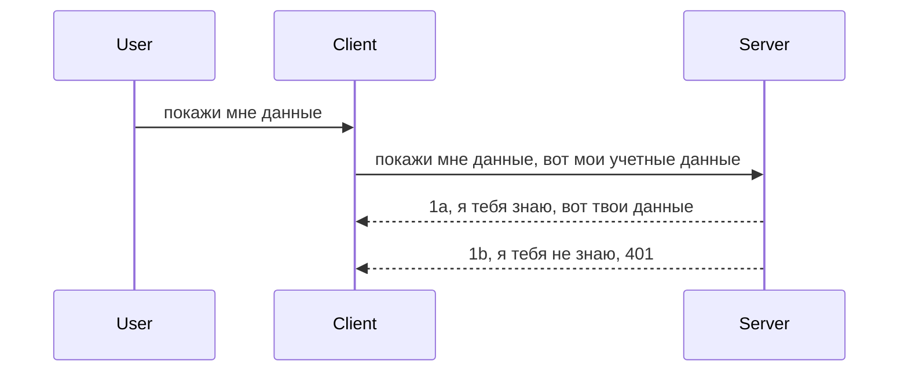

# Простая аутентификация

MCP SDK поддерживают использование OAuth 2.1, что, если честно, достаточно сложный процесс, включающий такие понятия, как сервер аутентификации, сервер ресурса, отправка учетных данных, получение кода, обмен кода на токен доступа, и только тогда вы можете получить данные ресурса. Если вы не привыкли к OAuth — а это отличная технология для внедрения — то хорошей идеей будет начать с базового уровня аутентификации и постепенно переходить к все более надежной безопасности. Именно для этого существует эта глава — чтобы подготовить вас к более продвинутой аутентификации.

## Аутентификация, что мы под этим понимаем?

Аутентификация — это сокращение от authentication и authorization. Идея в том, что нам нужно сделать две вещи:

- **Authentication (Аутентификация)** — процесс определения того, нужно ли нам пускать человека в наш дом, то есть удостовериться, что он имеет право находиться "здесь", то есть иметь доступ к нашему серверу ресурсов, где функционирует MCP Server.
- **Authorization (Авторизация)** — процесс выяснения, имеет ли пользователь доступ к конкретным запрашиваемым ресурсам, например к определенным заказам или продуктам, или же разрешено ли ему только читать контент, но не удалять, как вариант.

## Учетные данные: как мы говорим системе, кто мы

Большинство веб-разработчиков начинают думать в терминах предоставления учетных данных серверу, обычно секретного значения, которое говорит, можно ли им быть здесь ("Аутентификация"). Эта учетная запись обычно представляет собой строку username и password, закодированную в base64, или API-ключ, который однозначно идентифицирует конкретного пользователя.

Это отправляется через заголовок с названием "Authorization" так:

```json
{ "Authorization": "secret123" }
```

Это обычно называют базовой аутентификацией. Общий поток тогда работает следующим образом:


```mermaid
sequenceDiagram
   participant User
   participant Client
   participant Server

   User->>Client: покажи мне данные
   Client->>Server: покажи мне данные, вот мои учетные данные
   Server-->>Client: 1a, я тебя знаю, вот твои данные
   Server-->>Client: 1b, я тебя не знаю, 401 
```

Теперь, когда мы понимаем, как это работает с точки зрения потока, как же это реализовать? Большинство веб-серверов поддерживают концепцию middleware — кусок кода, который выполняется в рамках запроса, может проверять учетные данные и, если они действительны, пропускать запрос дальше. Если учетные данные недействительны, вы получите ошибку аутентификации. Посмотрим, как это можно реализовать:

**Python**

```python
class AuthMiddleware(BaseHTTPMiddleware):
    async def dispatch(self, request, call_next):

        has_header = request.headers.get("Authorization")
        if not has_header:
            print("-> Missing Authorization header!")
            return Response(status_code=401, content="Unauthorized")

        if not valid_token(has_header):
            print("-> Invalid token!")
            return Response(status_code=403, content="Forbidden")

        print("Valid token, proceeding...")
       
        response = await call_next(request)
        # добавьте любые пользовательские заголовки или измените ответ каким-либо образом
        return response


starlette_app.add_middleware(CustomHeaderMiddleware)
```

Здесь мы:

- Создали middleware с названием `AuthMiddleware`, у которого вызывается метод `dispatch` веб-сервером.
- Добавили middleware на веб-сервер:

    ```python
    starlette_app.add_middleware(AuthMiddleware)
    ```

- Написали логику валидации, которая проверяет наличие заголовка Authorization и валидность передаваемого секрета:

    ```python
    has_header = request.headers.get("Authorization")
    if not has_header:
        print("-> Missing Authorization header!")
        return Response(status_code=401, content="Unauthorized")

    if not valid_token(has_header):
        print("-> Invalid token!")
        return Response(status_code=403, content="Forbidden")
    ```

    если секрет присутствует и действителен, мы пропускаем запрос, вызывая `call_next` и возвращаем ответ.

    ```python
    response = await call_next(request)
    # добавьте любые заголовки клиента или измените ответ каким-либо образом
    return response
    ```

Работает это так: если веб-запрос отправлен на сервер, вызывается middleware, и в зависимости от реализации запрос либо пропускается, либо сервер возвращает ошибку, указывающую, что клиенту не разрешено продолжать.

**TypeScript**

Здесь мы создаем middleware с помощью популярного фреймворка Express и перехватываем запрос перед тем, как он достигнет MCP Server. Вот код:

```typescript
function isValid(secret) {
    return secret === "secret123";
}

app.use((req, res, next) => {
    // 1. Заголовок авторизации присутствует?
    if(!req.headers["Authorization"]) {
        res.status(401).send('Unauthorized');
    }
    
    let token = req.headers["Authorization"];

    // 2. Проверка действительности.
    if(!isValid(token)) {
        res.status(403).send('Forbidden');
    }

   
    console.log('Middleware executed');
    // 3. Передает запрос на следующий этап в цепочке обработки запроса.
    next();
});
```

В этом коде мы:

1. Проверяем, есть ли заголовок Authorization, если нет — отправляем ошибку 401.
2. Проверяем валидность учетных данных/токена, если они недействительны — отправляем ошибку 403.
3. Если все ок, передаем запрос дальше по цепочке и возвращаем запрашиваемый ресурс.

## Упражнение: Реализовать аутентификацию

Давайте применим наши знания на практике. Вот план:

Сервер

- Создать веб-сервер и экземпляр MCP.
- Реализовать middleware для сервера.

Клиент 

- Отправить веб-запрос с учетными данными через заголовок.

### -1- Создать веб-сервер и экземпляр MCP

> **Заглядывая вперед:** пример на TypeScript ниже отслеживает HTTP транспорт в коллекции `transports`, индексированной по `mcp-session-id`, согласно **MCP Specification 2025-11-25**. В релизе-кандидате `2026-07-28` будут полностью удалены handshake initialize и session ID, так что эта карта транспортов на сессию исчезнет в пользу статeless, самодостаточных запросов. Подробнее в [Что меняется в MCP: Релиз-кандидат 2026-07-28](../../01-CoreConcepts/mcp-2026-07-28-release-candidate.md).

На первом шаге создадим экземпляр веб-сервера и MCP Server.

**Python**

Здесь мы создаем MCP Server, создаем веб-приложение starlette и хостим его с помощью uvicorn.

```python
# создание сервера MCP

app = FastMCP(
    name="MCP Resource Server",
    instructions="Resource Server that validates tokens via Authorization Server introspection",
    host=settings["host"],
    port=settings["port"],
    debug=True
)

# создание веб-приложения starlette
starlette_app = app.streamable_http_app()

# запуск приложения через uvicorn
async def run(starlette_app):
    import uvicorn
    config = uvicorn.Config(
            starlette_app,
            host=app.settings.host,
            port=app.settings.port,
            log_level=app.settings.log_level.lower(),
        )
    server = uvicorn.Server(config)
    await server.serve()

run(starlette_app)
```

В этом коде мы:

- Создаем MCP Server.
- Создаем starlette веб-приложение из MCP Server через `app.streamable_http_app()`.
- Запускаем сервер с помощью uvicorn через `server.serve()`.

**TypeScript**

Здесь мы создаем экземпляр MCP Server.

```typescript
const server = new McpServer({
      name: "example-server",
      version: "1.0.0"
    });

    // ... настройка ресурсов сервера, инструментов и подсказок ...
```

Это создание MCP Server должно происходить внутри определения нашего POST маршрута /mcp, поэтому давайте перенесем этот код так:

```typescript
import express from "express";
import { randomUUID } from "node:crypto";
import { McpServer } from "@modelcontextprotocol/sdk/server/mcp.js";
import { StreamableHTTPServerTransport } from "@modelcontextprotocol/sdk/server/streamableHttp.js";
import { isInitializeRequest } from "@modelcontextprotocol/sdk/types.js"

const app = express();
app.use(express.json());

// Карта для хранения транспортов по ID сессии
const transports: { [sessionId: string]: StreamableHTTPServerTransport } = {};

// Обработка POST-запросов для связи клиент-сервер
app.post('/mcp', async (req, res) => {
  // Проверка существующего ID сессии
  const sessionId = req.headers['mcp-session-id'] as string | undefined;
  let transport: StreamableHTTPServerTransport;

  if (sessionId && transports[sessionId]) {
    // Повторное использование существующего транспорта
    transport = transports[sessionId];
  } else if (!sessionId && isInitializeRequest(req.body)) {
    // Новый запрос инициализации
    transport = new StreamableHTTPServerTransport({
      sessionIdGenerator: () => randomUUID(),
      onsessioninitialized: (sessionId) => {
        // Сохранить транспорт по ID сессии
        transports[sessionId] = transport;
      },
      // Защита от повторного связывания DNS отключена по умолчанию для обратной совместимости. Если вы запускаете этот сервер
      // локально, убедитесь, что установлено:
      // enableDnsRebindingProtection: true,
      // allowedHosts: ['127.0.0.1'],
    });

    // Очистка транспорта при закрытии
    transport.onclose = () => {
      if (transport.sessionId) {
        delete transports[transport.sessionId];
      }
    };
    const server = new McpServer({
      name: "example-server",
      version: "1.0.0"
    });

    // ... настройка серверных ресурсов, инструментов и подсказок ...

    // Подключиться к серверу MCP
    await server.connect(transport);
  } else {
    // Недопустимый запрос
    res.status(400).json({
      jsonrpc: '2.0',
      error: {
        code: -32000,
        message: 'Bad Request: No valid session ID provided',
      },
      id: null,
    });
    return;
  }

  // Обработка запроса
  await transport.handleRequest(req, res, req.body);
});

// Повторно используемый обработчик для GET и DELETE запросов
const handleSessionRequest = async (req: express.Request, res: express.Response) => {
  const sessionId = req.headers['mcp-session-id'] as string | undefined;
  if (!sessionId || !transports[sessionId]) {
    res.status(400).send('Invalid or missing session ID');
    return;
  }
  
  const transport = transports[sessionId];
  await transport.handleRequest(req, res);
};

// Обработка GET-запросов для уведомлений сервер-клиент через SSE
app.get('/mcp', handleSessionRequest);

// Обработка DELETE-запросов для завершения сессии
app.delete('/mcp', handleSessionRequest);

app.listen(3000);
```

Теперь вы видите, что создание MCP Server было перенесено внутрь `app.post("/mcp")`.

Переходим к следующему шагу — созданию middleware, чтобы валидировать входящие учетные данные.

### -2- Реализовать middleware для сервера

Перейдем к части с middleware. Здесь мы создадим middleware, которое ищет учетные данные в заголовке `Authorization` и проверяет их. Если они приемлемы — запрос пройдет дальше для выполнения нужного MCP запроса (к примеру, список инструментов, чтение ресурса или любую другую MCP функциональность, которую запрашивает клиент).

**Python**

Для создания middleware нужно создать класс, наследующийся от `BaseHTTPMiddleware`. Важны две вещи:

- Запрос `request`, откуда мы читаем заголовки.
- `call_next` — callback, который нужно вызвать, если клиент прислал приемлемые учетные данные.

Сначала обработаем случай отсутствия заголовка `Authorization`:

```python
has_header = request.headers.get("Authorization")

# заголовок отсутствует, вернуть ошибку 401, иначе продолжить.
if not has_header:
    print("-> Missing Authorization header!")
    return Response(status_code=401, content="Unauthorized")
```

Здесь возвращается 401 Unauthorized, так как клиент не прошел аутентификацию.

Далее, если учетные данные есть, проверим их валидность так:

```python
 if not valid_token(has_header):
    print("-> Invalid token!")
    return Response(status_code=403, content="Forbidden")
```

Обратите внимание на возврат 403 Forbidden выше. Ниже полный middleware, реализующий все описанное:

```python
class AuthMiddleware(BaseHTTPMiddleware):
    async def dispatch(self, request, call_next):

        has_header = request.headers.get("Authorization")
        if not has_header:
            print("-> Missing Authorization header!")
            return Response(status_code=401, content="Unauthorized")

        if not valid_token(has_header):
            print("-> Invalid token!")
            return Response(status_code=403, content="Forbidden")

        print("Valid token, proceeding...")
        print(f"-> Received {request.method} {request.url}")
        response = await call_next(request)
        response.headers['Custom'] = 'Example'
        return response

```

Отлично, а как реализована функция `valid_token`? Вот она:

```python
# НЕ используйте в продакшене - улучшите !!
def valid_token(token: str) -> bool:
    # удалите префикс "Bearer "
    if token.startswith("Bearer "):
        token = token[7:]
        return token == "secret-token"
    return False
```

Ее стоит улучшить.

ВАЖНО: Никогда не держите такие секреты в коде. Идеально получать их из внешнего источника данных или IDP (Identity Provider), или лучше позволить IDP выполнять проверку.

**TypeScript**

Реализация на Express требует вызова метода `use`, который принимает функции middleware.

Нужно:

- Работать с запросом, чтобы проверить учетные данные в `Authorization`.
- Валидировать учетные данные и, если валидно — пропустить запрос дальше, чтобы MCP запрос клиента выполнялся (например, список инструментов, чтение ресурса и т.д.).

Здесь мы проверяем наличие заголовка `Authorization`, и если его нет — блокируем запрос:

```typescript
if(!req.headers["authorization"]) {
    res.status(401).send('Unauthorized');
    return;
}
```

Если заголовок отсутствует, отвечаем 401.

Далее проверяем валидность учетных данных, и если они невалидны — блокируем с другим сообщением:

```typescript
if(!isValid(token)) {
    res.status(403).send('Forbidden');
    return;
} 
```

Теперь отправляем 403.

Вот весь код:

```typescript
app.use((req, res, next) => {
    console.log('Request received:', req.method, req.url, req.headers);
    console.log('Headers:', req.headers["authorization"]);
    if(!req.headers["authorization"]) {
        res.status(401).send('Unauthorized');
        return;
    }
    
    let token = req.headers["authorization"];

    if(!isValid(token)) {
        res.status(403).send('Forbidden');
        return;
    }  

    console.log('Middleware executed');
    next();
});
```

Мы настроили сервер так, чтобы принимать middleware для проверки учетных данных, который клиент должен отправлять. А как насчет самого клиента?

### -3- Отправить веб-запрос с учетными данными через заголовок

Нужно убедиться, что клиент передает учетные данные через заголовок. Поскольку мы используем MCP клиент, нужно понять, как это сделать.

**Python**

Для клиента нужно передать заголовок с учетными данными так:

```python
# НЕ прописывайте значение жестко, храните его как минимум в переменной окружения или в более безопасном хранилище
token = "secret-token"

async with streamablehttp_client(
        url = f"http://localhost:{port}/mcp",
        headers = {"Authorization": f"Bearer {token}"}
    ) as (
        read_stream,
        write_stream,
        session_callback,
    ):
        async with ClientSession(
            read_stream,
            write_stream
        ) as session:
            await session.initialize()
      
            # TODO, что вы хотите сделать на клиенте, например, список инструментов, вызов инструментов и т.д.
```

Обратите внимание, как мы формируем свойство `headers`: `headers = {"Authorization": f"Bearer {token}"}`.

**TypeScript**

Решим это в два шага:

1. Заполняем объект конфигурации нашими учетными данными.
2. Передаем этот объект транспорту.

```typescript

// НЕ жестко задавайте значение, как показано здесь. Как минимум, используйте переменную окружения и что-то вроде dotenv (в режиме разработки).
let token = "secret123"

// определить объект опций клиента транспортного уровня
let options: StreamableHTTPClientTransportOptions = {
  sessionId: sessionId,
  requestInit: {
    headers: {
      "Authorization": "secret123"
    }
  }
};

// передать объект опций в транспорт
async function main() {
   const transport = new StreamableHTTPClientTransport(
      new URL(serverUrl),
      options
   );
```

Здесь видно, что нам пришлось создать объект `options` и разместить заголовки в `requestInit`.

ВАЖНО: Как дальше улучшать реализацию? Текущая реализация имеет недостатки. Во-первых, передавать учетные данные таким способом достаточно рискованно, если у вас нет хотя бы HTTPS. Даже тогда ключ может быть украден, поэтому нужна система, в которой легко аннулировать токен, а также добавлять проверки, откуда запрос — например, география, частота запросов (ботообразное поведение) и другие аспекты.

Тем не менее для простых API, где важно, чтобы никто не мог обращаться без аутентификации, это хороший старт.

Теперь давайте усилим безопасность, используя стандартизированный формат — JSON Web Token, или JWT, также известный как "JOT" токены.

## JSON Web Tokens, JWT

Мы пытаемся улучшить ситуацию по сравнению с простыми учетными данными. Какие основные преимущества формирования JWT?

- **Улучшенная безопасность**. В базовой аутентификации вы постоянно отправляете username и password в base64 или API ключ, что увеличивает риски. JWT вы используете для получения токена, который ограничен во времени, т.е. истекает. JWT позволяет легко использовать детализированный контроль доступа через роли, области и права.
- **Статусность и масштабируемость**. JWT само-содержателен: содержит всю информацию о пользователе и не требует хранения состояния сессий на сервере. Токен можно валидировать локально.
- **Взаимодействие и федерация**. JWT является основой Open ID Connect и используется с известными провайдерами идентичности, такими как Entra ID, Google Identity, Auth0. Это позволяет реализовывать единую аутентификацию и многое другое, выходящее на уровень корпоративных решений.
- **Модульность и гибкость**. JWT можно использовать с API шлюзами, такими как Azure API Management, NGINX и др. Они подходят для сценариев аутентификации пользователей и для сервер-серверных коммуникаций включая имитацию и делегирование.
- **Производительность и кеширование**. После декодирования JWT можно кешировать, что снижает частоту парсинга. Это важно для приложений с высоким трафиком, повышая пропускную способность и снижая нагрузку.
- **Дополнительные возможности**. Поддерживается introspection (проверка токена на сервере) и revocation (аннулирование токена).

Со всеми этими преимуществами посмотрим, как перейти на новый уровень реализации.

## Как перейти с базовой аутентификации на JWT

Итак, основные изменения:

- **Научиться конструировать JWT токен**, готовый для отправки клиентом на сервер.
- **Валидировать JWT токен**, и если валиден — позволять клиенту получать ресурсы.
- **Безопасно хранить токен**.
- **Защитить маршруты**. Мы должны защитить маршруты, то есть конкретные MCP фичи.
- **Добавить refresh токены**. Создавать короткоживущие токены и долгоиграющие refresh токены, чтобы обновлять токены при их истечении. Также реализовать refresh endpoint и стратегию ротации.

### -1- Конструирование JWT токена

У JWT токена есть следующие части:

- **header** — алгоритм и тип токена.
- **payload** — утверждения (claims), такие как sub (пользователь или сущность, которую представляет токен, обычно userid), exp (время истечения), role (роль).
- **signature** — подпись секретом или приватным ключом.

Для этого нужно создать header, payload и оформить закодированный токен.

**Python**

```python

import jwt
import jwt
from jwt.exceptions import ExpiredSignatureError, InvalidTokenError
import datetime

# Секретный ключ, используемый для подписи JWT
secret_key = 'your-secret-key'

header = {
    "alg": "HS256",
    "typ": "JWT"
}

# информация о пользователе, его утверждения и время истечения
payload = {
    "sub": "1234567890",               # Тема (ID пользователя)
    "name": "User Userson",                # Пользовательское утверждение
    "admin": True,                     # Пользовательское утверждение
    "iat": datetime.datetime.utcnow(),# Дата выдачи
    "exp": datetime.datetime.utcnow() + datetime.timedelta(hours=1)  # Время истечения
}

# закодировать это
encoded_jwt = jwt.encode(payload, secret_key, algorithm="HS256", headers=header)
```

В этом коде мы:

- Определили header с алгоритмом HS256 и типом JWT.
- Сформировали payload с субъектом (userid), именем пользователя, ролью, временем создания и временем истечения, реализуя ограничение по времени.

**TypeScript**

Здесь нужны зависимости, которые помогут создавать JWT.

Зависимости

```sh

npm install jsonwebtoken
npm install --save-dev @types/jsonwebtoken
```

Теперь, когда это есть, создадим header, payload и с их помощью — закодированный токен.

```typescript
import jwt from 'jsonwebtoken';

const secretKey = 'your-secret-key'; // Используйте переменные окружения в продакшене

// Определите полезную нагрузку
const payload = {
  sub: '1234567890',
  name: 'User usersson',
  admin: true,
  iat: Math.floor(Date.now() / 1000), // Время выпуска
  exp: Math.floor(Date.now() / 1000) + 60 * 60 // Истекает через 1 час
};

// Определите заголовок (необязательно, jsonwebtoken задает значения по умолчанию)
const header = {
  alg: 'HS256',
  typ: 'JWT'
};

// Создайте токен
const token = jwt.sign(payload, secretKey, {
  algorithm: 'HS256',
  header: header
});

console.log('JWT:', token);
```

Токен:

Подписан HS256
Действителен 1 час
Содержит утверждения sub, name, admin, iat и exp.

### -2- Валидировать токен

Также нужно валидировать токен на сервере, чтобы убедиться, что клиент отправляет валидный токен. Нужно проверить структуру, срок действия и добавить дополнительные проверки — например, пользователь в системе и др.

Для валидации декодируем токен, чтобы считать его содержимое, а затем проверяем валидность:

**Python**

```python

# Раскодировать и проверить JWT
try:
    decoded = jwt.decode(token, secret_key, algorithms=["HS256"])
    print("✅ Token is valid.")
    print("Decoded claims:")
    for key, value in decoded.items():
        print(f"  {key}: {value}")
except ExpiredSignatureError:
    print("❌ Token has expired.")
except InvalidTokenError as e:
    print(f"❌ Invalid token: {e}")

```

В этом коде мы вызываем `jwt.decode`, используя токен, секретный ключ и выбранный алгоритм в качестве входных данных. Обратите внимание, что мы используем конструкцию try-catch, так как при неудачной проверке вызывается ошибка.

**TypeScript**

Здесь нам нужно вызвать `jwt.verify`, чтобы получить декодированную версию токена, которую мы можем дальше анализировать. Если этот вызов не удается, это означает, что структура токена неправильная или он больше не действителен.

```typescript

try {
  const decoded = jwt.verify(token, secretKey);
  console.log('Decoded Payload:', decoded);
} catch (err) {
  console.error('Token verification failed:', err);
}
```

NOTE: как уже упоминалось ранее, мы должны выполнить дополнительные проверки, чтобы убедиться, что этот токен указывает на пользователя в нашей системе и что у пользователя есть права, которые он заявляет.

Далее, давайте рассмотрим контроль доступа на основе ролей, также известный как RBAC.

## Добавление контроля доступа на основе ролей

Идея в том, что мы хотим выразить, что разные роли имеют разные разрешения. Например, мы предполагаем, что администратор может делать всё, обычный пользователь может читать/писать, а гость может только читать. Соответственно, вот возможные уровни разрешений:

- Admin.Write 
- User.Read
- Guest.Read

Давайте посмотрим, как мы можем реализовать такой контроль с помощью middleware. Middleware можно добавлять как для отдельных маршрутов, так и для всех маршрутов.

**Python**

```python
from starlette.middleware.base import BaseHTTPMiddleware
from starlette.responses import JSONResponse
import jwt

# НЕ храните секрет в коде, как здесь, это только для демонстрационных целей. Читайте его из безопасного места.
SECRET_KEY = "your-secret-key" # поместите это в переменную окружения
REQUIRED_PERMISSION = "User.Read"

class JWTPermissionMiddleware(BaseHTTPMiddleware):
    async def dispatch(self, request, call_next):
        auth_header = request.headers.get("Authorization")
        if not auth_header or not auth_header.startswith("Bearer "):
            return JSONResponse({"error": "Missing or invalid Authorization header"}, status_code=401)

        token = auth_header.split(" ")[1]
        try:
            decoded = jwt.decode(token, SECRET_KEY, algorithms=["HS256"])
        except jwt.ExpiredSignatureError:
            return JSONResponse({"error": "Token expired"}, status_code=401)
        except jwt.InvalidTokenError:
            return JSONResponse({"error": "Invalid token"}, status_code=401)

        permissions = decoded.get("permissions", [])
        if REQUIRED_PERMISSION not in permissions:
            return JSONResponse({"error": "Permission denied"}, status_code=403)

        request.state.user = decoded
        return await call_next(request)


```

Существует несколько способов добавить middleware, например, как ниже:

```python

# Вариант 1: добавить промежуточное ПО при создании приложения starlette
middleware = [
    Middleware(JWTPermissionMiddleware)
]

app = Starlette(routes=routes, middleware=middleware)

# Вариант 2: добавить промежуточное ПО после того, как приложение starlette уже создано
starlette_app.add_middleware(JWTPermissionMiddleware)

# Вариант 3: добавить промежуточное ПО для каждого маршрута
routes = [
    Route(
        "/mcp",
        endpoint=..., # обработчик
        middleware=[Middleware(JWTPermissionMiddleware)]
    )
]
```

**TypeScript**

Мы можем использовать `app.use` и middleware, который будет выполняться для всех запросов.

```typescript
app.use((req, res, next) => {
    console.log('Request received:', req.method, req.url, req.headers);
    console.log('Headers:', req.headers["authorization"]);

    // 1. Проверьте, был ли отправлен заголовок авторизации

    if(!req.headers["authorization"]) {
        res.status(401).send('Unauthorized');
        return;
    }
    
    let token = req.headers["authorization"];

    // 2. Проверьте, действителен ли токен
    if(!isValid(token)) {
        res.status(403).send('Forbidden');
        return;
    }  

    // 3. Проверьте, существует ли пользователь токена в нашей системе
    if(!isExistingUser(token)) {
        res.status(403).send('Forbidden');
        console.log("User does not exist");
        return;
    }
    console.log("User exists");

    // 4. Проверьте, есть ли у токена необходимые разрешения
    if(!hasScopes(token, ["User.Read"])){
        res.status(403).send('Forbidden - insufficient scopes');
    }

    console.log("User has required scopes");

    console.log('Middleware executed');
    next();
});

```

Есть несколько вещей, которые мы можем и ДОЛЖНЫ позволить нашему middleware делать, а именно:

1. Проверить, присутствует ли заголовок авторизации
2. Проверить, действителен ли токен, мы вызываем `isValid` — метод, который мы написали, чтобы проверить целостность и действительность JWT токена.
3. Проверить, что пользователь существует в нашей системе, это следует проверить.

   ```typescript
    // пользователи в базе данных
   const users = [
     "user1",
     "User usersson",
   ]

   function isExistingUser(token) {
     let decodedToken = verifyToken(token);

     // TODO, проверить, существует ли пользователь в базе данных
     return users.includes(decodedToken?.name || "");
   }
   ```

   Выше мы создали очень простой список `users`, который, конечно, должен находиться в базе данных.

4. Кроме того, мы должны проверить, что токен имеет нужные разрешения.

   ```typescript
   if(!hasScopes(token, ["User.Read"])){
        res.status(403).send('Forbidden - insufficient scopes');
   }
   ```

   В приведённом выше коде middleware мы проверяем, содержит ли токен разрешение User.Read, если нет — отправляем ошибку 403. Ниже находится вспомогательный метод `hasScopes`.

   ```typescript
   function hasScopes(scope: string, requiredScopes: string[]) {
     let decodedToken = verifyToken(scope);
    return requiredScopes.every(scope => decodedToken?.scopes.includes(scope));
  }
   ```

Have a think which additional checks you should be doing, but these are the absolute minimum of checks you should be doing.

Using Express as a web framework is a common choice. There are helpers library when you use JWT so you can write less code.

- `express-jwt`, helper library that provides a middleware that helps decode your token.
- `express-jwt-permissions`, this provides a middleware `guard` that helps check if a certain permission is on the token.

Here's what these libraries can look like when used:

```typescript
const express = require('express');
const jwt = require('express-jwt');
const guard = require('express-jwt-permissions')();

const app = express();
const secretKey = 'your-secret-key'; // put this in env variable

// Decode JWT and attach to req.user
app.use(jwt({ secret: secretKey, algorithms: ['HS256'] }));

// Check for User.Read permission
app.use(guard.check('User.Read'));

// multiple permissions
// app.use(guard.check(['User.Read', 'Admin.Access']));

app.get('/protected', (req, res) => {
  res.json({ message: `Welcome ${req.user.name}` });
});

// Error handler
app.use((err, req, res, next) => {
  if (err.code === 'permission_denied') {
    return res.status(403).send('Forbidden');
  }
  next(err);
});

```

Теперь вы увидели, как middleware может использоваться для аутентификации и авторизации, а как насчёт MCP, меняется ли при этом способ аутентификации? Узнаем в следующем разделе.

### -3- Добавление RBAC в MCP

Вы уже видели, как можно добавить RBAC через middleware, однако для MCP нет простого способа добавить RBAC на уровне отдельной функции MCP, что же делать? Нам просто нужно добавить код, который проверяет в данном случае, имеет ли клиент права на вызов конкретного инструмента:

Вы можете выбрать несколько подходов для реализации RBAC на уровне функций, вот некоторые из них:

- Добавить проверку для каждого инструмента, ресурса, подсказки, где нужно проверять уровень разрешений.

   **python**

   ```python
   @tool()
   def delete_product(id: int):
      try:
          check_permissions(role="Admin.Write", request)
      catch:
        pass # клиент не прошёл авторизацию, вызвать ошибку авторизации
   ```

   **typescript**

   ```typescript
   server.registerTool(
    "delete-product",
    {
      title: Delete a product",
      description: "Deletes a product",
      inputSchema: { id: z.number() }
    },
    async ({ id }) => {
      
      try {
        checkPermissions("Admin.Write", request);
        // сделать, отправить id в productService и удаленную точку входа
      } catch(Exception e) {
        console.log("Authorization error, you're not allowed");  
      }

      return {
        content: [{ type: "text", text: `Deletected product with id ${id}` }]
      };
    }
   );
   ```


- Использовать продвинутый серверный подход и обработчики запросов, чтобы минимизировать количество мест, где нужно делать проверку.

   **Python**

   ```python
   
   tool_permission = {
      "create_product": ["User.Write", "Admin.Write"],
      "delete_product": ["Admin.Write"]
   }

   def has_permission(user_permissions, required_permissions) -> bool:
      # user_permissions: список разрешений, которые есть у пользователя
      # required_permissions: список разрешений, необходимых для инструмента
      return any(perm in user_permissions for perm in required_permissions)

   @server.call_tool()
   async def handle_call_tool(
     name: str, arguments: dict[str, str] | None
   ) -> list[types.TextContent]:
    # Предполагается, что request.user.permissions — это список разрешений пользователя
     user_permissions = request.user.permissions
     required_permissions = tool_permission.get(name, [])
     if not has_permission(user_permissions, required_permissions):
        # Выдать ошибку "У вас нет разрешения для вызова инструмента {name}"
        raise Exception(f"You don't have permission to call tool {name}")
     # продолжить и вызвать инструмент
     # ...
   ```   
   

   **TypeScript**

   ```typescript
   function hasPermission(userPermissions: string[], requiredPermissions: string[]): boolean {
       if (!Array.isArray(userPermissions) || !Array.isArray(requiredPermissions)) return false;
       // Вернуть true, если у пользователя есть как минимум одно необходимое разрешение
       
       return requiredPermissions.some(perm => userPermissions.includes(perm));
   }
  
   server.setRequestHandler(CallToolRequestSchema, async (request) => {
      const { params: { name } } = request;
  
      let permissions = request.user.permissions;
  
      if (!hasPermission(permissions, toolPermissions[name])) {
         return new Error(`You don't have permission to call ${name}`);
      }
  
      // продолжать..
   });
   ```

   Обратите внимание, вам нужно будет убедиться, что ваше middleware присваивает декодированный токен свойству user в запросе, чтобы код выше был простым.

### Итоги

Теперь, когда мы обсудили, как добавить поддержку RBAC в целом и для MCP в частности, пора попробовать реализовать безопасность самостоятельно, чтобы убедиться, что вы поняли представленные концепции.

## Задание 1: Построить сервер mcp и клиент mcp с использованием базовой аутентификации

Здесь вы возьмёте то, что вы узнали о передачи реквизитов через заголовки.

## Решение 1

[Решение 1](./code/basic/README.md)

## Задание 2: Обновить решение из задания 1 для использования JWT

Возьмите первое решение, но на этот раз улучшим его.

Вместо использования Basic Auth, давайте использовать JWT.

## Решение 2

[Решение 2](./solution/jwt-solution/README.md)

## Вызов

Добавьте RBAC для каждого инструмента, который мы описали в разделе "Добавление RBAC в MCP".

## Итог

Вы, надеюсь, многому научились в этой главе, начиная с отсутствия безопасности, базовой безопасности, до JWT и тому, как его можно добавить в MCP.

Мы построили прочную базу с кастомными JWT, но по мере масштабирования мы движемся к модели идентификации, основанной на стандартах. Использование IdP, такого как Entra или Keycloak, позволяет нам перенести выдачу, проверку и управление жизненным циклом токенов на надёжную платформу — освобождая нас для фокусировки на логике приложения и опыте пользователя.

Для этого у нас есть более [продвинутая глава об Entra](../../05-AdvancedTopics/mcp-security-entra/README.md)

## Что дальше

- Далее: [Настройка MCP-хостов](../12-mcp-hosts/README.md)

---

<!-- CO-OP TRANSLATOR DISCLAIMER START -->
**Отказ от ответственности**:
Этот документ был переведен с использованием сервиса машинного перевода [Co-op Translator](https://github.com/Azure/co-op-translator). Несмотря на наши усилия по обеспечению точности, имейте в виду, что автоматический перевод может содержать ошибки или неточности. Оригинальный документ на его исходном языке следует считать авторитетным источником. Для получения критически важной информации рекомендуется обратиться к профессиональному человеческому переводу. Мы не несем ответственности за любые недоразумения или неправильные толкования, возникшие в результате использования этого перевода.
<!-- CO-OP TRANSLATOR DISCLAIMER END -->