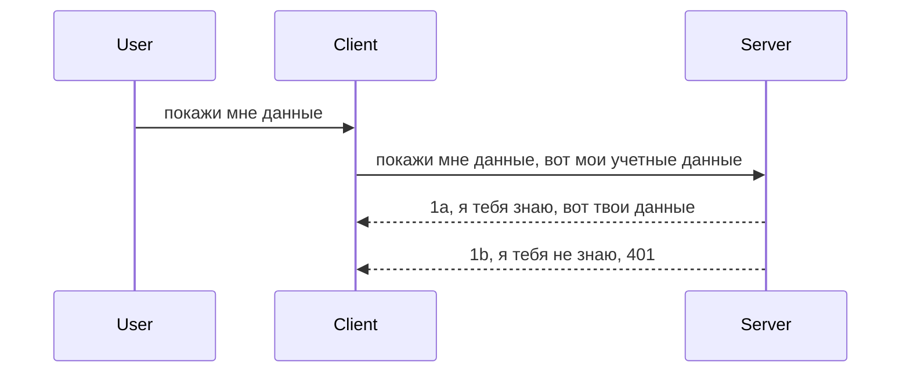

# Простая аутентификация

MCP SDK поддерживают использование OAuth 2.1, который, если честно, довольно сложный процесс, включающий такие понятия, как auth server, resource server, отправка учетных данных, получение кода, обмен кода на токен доступа, после чего наконец можно получить данные ресурса. Если вы не привыкли к OAuth, который, безусловно, стоит реализовать, разумно начать с базового уровня аутентификации и постепенно строить всё более высокий уровень безопасности. Именно для этого существует эта глава — чтобы подготовить вас к более продвинутой аутентификации.

## Что мы понимаем под аутентификацией?

Аутентификация — это сокращение от authentication и authorization. Идея в том, что нам нужно сделать две вещи:

- **Аутентификация**, которая проверяет, позволим ли мы человеку войти в наш дом, имеет ли он право быть "здесь", то есть иметь доступ к нашему resource server, где располагаются функции MCP Server.
- **Авторизация**, процесс выяснения, должен ли пользователь иметь доступ именно к тем ресурсам, к которым он обращается, например, к этим заказам или товарам, или разрешено ли ему, к примеру, читать контент, но не удалять его.

## Учетные данные: как мы сообщаем системе, кто мы такие

Большинство веб-разработчиков мыслят в терминах предоставления серверу учетных данных, обычно это секрет, который говорит, разрешено ли им быть здесь — «Аутентификация». Обычно эти учетные данные — это base64-кодированная версия имени пользователя и пароля или API-ключ, уникально идентифицирующий пользователя.

Это обычно отправляется через заголовок с названием "Authorization" вот так:

```json
{ "Authorization": "secret123" }
```

Это обычно называется базовой аутентификацией (basic authentication). Как работает общий процесс:


```mermaid
sequenceDiagram
   participant User
   participant Client
   participant Server

   User->>Client: покажи мне данные
   Client->>Server: покажи мне данные, вот мои учетные данные
   Server-->>Client: 1a, я тебя знаю, вот твои данные
   Server-->>Client: 1b, я тебя не знаю, 401 
```

Теперь, когда мы понимаем, как это работает с точки зрения общего потока, как это реализовать? Большинство веб-серверов поддерживают концепцию middleware — куска кода, который запускается во время запроса, может проверять учетные данные, и если они валидны, пропускает запрос дальше. Если учетных данных нет или они неверны, возвращается ошибка аутентификации. Посмотрим, как это можно реализовать:

**Python**

```python
class AuthMiddleware(BaseHTTPMiddleware):
    async def dispatch(self, request, call_next):

        has_header = request.headers.get("Authorization")
        if not has_header:
            print("-> Missing Authorization header!")
            return Response(status_code=401, content="Unauthorized")

        if not valid_token(has_header):
            print("-> Invalid token!")
            return Response(status_code=403, content="Forbidden")

        print("Valid token, proceeding...")
       
        response = await call_next(request)
        # добавьте любые пользовательские заголовки или измените ответ каким-либо образом
        return response


starlette_app.add_middleware(CustomHeaderMiddleware)
```

Здесь у нас:

- Создан middleware с названием `AuthMiddleware`, у которого метод `dispatch` вызывается веб-сервером.
- Добавлен middleware к веб-серверу:

    ```python
    starlette_app.add_middleware(AuthMiddleware)
    ```

- Написана логика валидации, которая проверяет наличие заголовка Authorization и валидность переданного секрета:

    ```python
    has_header = request.headers.get("Authorization")
    if not has_header:
        print("-> Missing Authorization header!")
        return Response(status_code=401, content="Unauthorized")

    if not valid_token(has_header):
        print("-> Invalid token!")
        return Response(status_code=403, content="Forbidden")
    ```

    если секрет присутствует и валиден, то мы разрешаем проход запросу, вызывая `call_next` и возвращая ответ.

    ```python
    response = await call_next(request)
    # добавьте любые пользовательские заголовки или измените ответ каким-либо образом
    return response
    ```

Как это работает: при веб-запросе к серверу вызывается middleware, который либо пропускает запрос дальше, либо возвращает ошибку, указывающую, что клиенту отказано в доступе.

**TypeScript**

Здесь создаем middleware с популярным фреймворком Express и перехватываем запрос, прежде чем он дойдет до MCP Server. Вот код для этого:

```typescript
function isValid(secret) {
    return secret === "secret123";
}

app.use((req, res, next) => {
    // 1. Заголовок авторизации присутствует?
    if(!req.headers["Authorization"]) {
        res.status(401).send('Unauthorized');
    }
    
    let token = req.headers["Authorization"];

    // 2. Проверка действительности.
    if(!isValid(token)) {
        res.status(403).send('Forbidden');
    }

   
    console.log('Middleware executed');
    // 3. Передает запрос следующему этапу в конвейере запросов.
    next();
});
```

В этом коде мы:

1. Проверяем, есть ли заголовок Authorization, если нет — отправляем ошибку 401.
2. Проверяем валидность учетных данных/токена, если нет — отправляем 403.
3. В конце пропускаем запрос дальше и возвращаем запрошенный ресурс.

## Упражнение: реализуйте аутентификацию

Давайте применим наши знания на практике. План таков:

Сервер

- Создать веб-сервер и экземпляр MCP.
- Реализовать middleware для сервера.

Клиент

- Отправить веб-запрос с учетными данными через заголовок.

### -1- Создать веб-сервер и экземпляр MCP

> [!WARNING]
> Пример на TypeScript ниже ориентирован на MCP `2025-11-25`. Он отслеживает транспорт
> по `mcp-session-id` и не является примером транспорта из `2026-07-28`. MCP
> `2026-07-28` убирает handshake initialize и идентификатор сессии протокола; новые
> реализации используют автономные запросы. См.
> [Что изменилось в MCP: спецификация 2026-07-28](../../01-CoreConcepts/mcp-2026-07-28.md).

На первом шаге нам нужно создать инстанс веб-сервера и MCP Server.

**Python**

Здесь мы создаем инстанс MCP сервера, создаем starlette web-приложение и хостим его с uvicorn.

```python
# создание MCP сервера

app = FastMCP(
    name="MCP Resource Server",
    instructions="Resource Server that validates tokens via Authorization Server introspection",
    host=settings["host"],
    port=settings["port"],
    debug=True
)

# создание web-приложения starlette
starlette_app = app.streamable_http_app()

# запуск приложения через uvicorn
async def run(starlette_app):
    import uvicorn
    config = uvicorn.Config(
            starlette_app,
            host=app.settings.host,
            port=app.settings.port,
            log_level=app.settings.log_level.lower(),
        )
    server = uvicorn.Server(config)
    await server.serve()

run(starlette_app)
```

В этом коде:

- Создаем MCP Server.
- Создаем starlette web app из MCP Server через `app.streamable_http_app()`.
- Хостим и обслуживаем веб-приложение с помощью uvicorn через `server.serve()`.

**TypeScript**

Здесь мы создаем инстанс MCP Server.

```typescript
const server = new McpServer({
      name: "example-server",
      version: "1.0.0"
    });

    // ... настройка серверных ресурсов, инструментов и подсказок ...
```

Создание MCP Server должно происходить внутри определения маршрута POST /mcp, поэтому перенесем код выше сюда:

```typescript
import express from "express";
import { randomUUID } from "node:crypto";
import { McpServer } from "@modelcontextprotocol/sdk/server/mcp.js";
import { StreamableHTTPServerTransport } from "@modelcontextprotocol/sdk/server/streamableHttp.js";
import { isInitializeRequest } from "@modelcontextprotocol/sdk/types.js"

const app = express();
app.use(express.json());

// Карта для хранения транспортов по ID сессии
const transports: { [sessionId: string]: StreamableHTTPServerTransport } = {};

// Обработка POST-запросов для связи клиент-сервер
app.post('/mcp', async (req, res) => {
  // Проверка существующего ID сессии
  const sessionId = req.headers['mcp-session-id'] as string | undefined;
  let transport: StreamableHTTPServerTransport;

  if (sessionId && transports[sessionId]) {
    // Повторное использование существующего транспорта
    transport = transports[sessionId];
  } else if (!sessionId && isInitializeRequest(req.body)) {
    // Новый запрос инициализации
    transport = new StreamableHTTPServerTransport({
      sessionIdGenerator: () => randomUUID(),
      onsessioninitialized: (sessionId) => {
        // Сохранить транспорт по ID сессии
        transports[sessionId] = transport;
      },
      // Защита от DNS rebinding по умолчанию отключена для обратной совместимости. Если вы запускаете этот сервер
      // локально, убедитесь, что установлены следующие настройки:
      // enableDnsRebindingProtection: true,
      // allowedHosts: ['127.0.0.1'],
    });

    // Очистить транспорт при закрытии
    transport.onclose = () => {
      if (transport.sessionId) {
        delete transports[transport.sessionId];
      }
    };
    const server = new McpServer({
      name: "example-server",
      version: "1.0.0"
    });

    // ... настроить ресурсы сервера, инструменты и подсказки ...

    // Подключиться к серверу MCP
    await server.connect(transport);
  } else {
    // Недопустимый запрос
    res.status(400).json({
      jsonrpc: '2.0',
      error: {
        code: -32000,
        message: 'Bad Request: No valid session ID provided',
      },
      id: null,
    });
    return;
  }

  // Обработать запрос
  await transport.handleRequest(req, res, req.body);
});

// Повторно используемый обработчик для GET и DELETE запросов
const handleSessionRequest = async (req: express.Request, res: express.Response) => {
  const sessionId = req.headers['mcp-session-id'] as string | undefined;
  if (!sessionId || !transports[sessionId]) {
    res.status(400).send('Invalid or missing session ID');
    return;
  }
  
  const transport = transports[sessionId];
  await transport.handleRequest(req, res);
};

// Обработать GET-запросы для уведомлений от сервера к клиенту через SSE
app.get('/mcp', handleSessionRequest);

// Обработать DELETE-запросы для завершения сессии
app.delete('/mcp', handleSessionRequest);

app.listen(3000);
```

Теперь видно, как создание MCP Server переместили в `app.post("/mcp")`.

Переходим к следующему шагу — созданию middleware для проверки входящих учетных данных.

### -2- Реализовать middleware для сервера

Давайте перейдем к части с middleware. Здесь мы создадим middleware, который ищет учетные данные в заголовке `Authorization` и проверяет их. Если они подходят, запрос пойдет дальше, чтобы выполнить нужное (например, перечислить инструменты, прочитать ресурс или выполнить другую MCP функцию).

**Python**

Чтобы создать middleware, нужно сделать класс, наследующийся от `BaseHTTPMiddleware`. Есть два важных момента:

- запрос `request`, из которого читаем информацию из заголовков.
- `call_next` — callback, вызываемый, если клиент передал приемлемые учетные данные.

Сначала обрабатываем случай отсутствия заголовка `Authorization`:

```python
has_header = request.headers.get("Authorization")

# заголовок отсутствует, вернуть ошибку 401, иначе продолжить.
if not has_header:
    print("-> Missing Authorization header!")
    return Response(status_code=401, content="Unauthorized")
```

Здесь мы отправляем сообщение 401 unauthorized, так как клиент не прошел аутентификацию.

Далее, если учетные данные переданы, нужно проверить их валидность:

```python
 if not valid_token(has_header):
    print("-> Invalid token!")
    return Response(status_code=403, content="Forbidden")
```

Обратите внимание, что тут посылается сообщение 403 forbidden. Далее полный middleware, который реализует всё описанное выше:

```python
class AuthMiddleware(BaseHTTPMiddleware):
    async def dispatch(self, request, call_next):

        has_header = request.headers.get("Authorization")
        if not has_header:
            print("-> Missing Authorization header!")
            return Response(status_code=401, content="Unauthorized")

        if not valid_token(has_header):
            print("-> Invalid token!")
            return Response(status_code=403, content="Forbidden")

        print("Valid token, proceeding...")
        print(f"-> Received {request.method} {request.url}")
        response = await call_next(request)
        response.headers['Custom'] = 'Example'
        return response

```

Отлично, а что насчет функции `valid_token`? Вот она:

```python
# НЕ ИСПОЛЬЗУЙТЕ для продакшена - улучшите это !!
def valid_token(token: str) -> bool:
    # удалить префикс "Bearer "
    if token.startswith("Bearer "):
        token = token[7:]
        return token == "secret-token"
    return False
```

Естественно, этот код следует улучшать.

ВАЖНО: Никогда не храните такие секреты прямо в коде. Лучше брать значения для сравнения из источника данных или поставщика удостоверений (IDP), а еще лучше — позволить IDP выполнять проверку.

**TypeScript**

Для реализации на Express нужно вызвать метод `use`, который принимает функции middleware.

Нам нужно:

- Взаимодействовать с объектом запроса, чтобы проверить переданные в свойстве `Authorization` учетные данные.
- Проверить валидность учетных данных, и если всё в порядке — пропустить запрос дальше и выполнить MCP запрос клиента (например, вывести инструменты, прочитать ресурс и т.д.).

Тут мы проверяем наличие заголовка `Authorization`, если его нет — блокируем запрос:

```typescript
if(!req.headers["authorization"]) {
    res.status(401).send('Unauthorized');
    return;
}
```

Если заголовок не передан — получаете 401.

Далее проверяем валидность учетных данных, если нет — снова блокируем, но с другим сообщением:

```typescript
if(!isValid(token)) {
    res.status(403).send('Forbidden');
    return;
} 
```

Обратите внимание, что теперь приходит ошибка 403.

Вот полный код:

```typescript
app.use((req, res, next) => {
    console.log('Request received:', req.method, req.url, req.headers);
    console.log('Headers:', req.headers["authorization"]);
    if(!req.headers["authorization"]) {
        res.status(401).send('Unauthorized');
        return;
    }
    
    let token = req.headers["authorization"];

    if(!isValid(token)) {
        res.status(403).send('Forbidden');
        return;
    }  

    console.log('Middleware executed');
    next();
});
```

Мы настроили веб-сервер принимать middleware для проверки пришедших учетных данных. А как же клиент?

### -3- Отправить веб-запрос с учетными данными через заголовок

Нужно убедиться, что клиент передает учетные данные в заголовке. Используя MCP клиент, нам надо понять, как это реализовать.

**Python**

Для клиента нужно передать заголовок с учетными данными вот так:

```python
# НЕ жестко кодируйте значение, храните его, как минимум, в переменной окружения или более безопасном хранилище
token = "secret-token"

async with streamablehttp_client(
        url = f"http://localhost:{port}/mcp",
        headers = {"Authorization": f"Bearer {token}"}
    ) as (
        read_stream,
        write_stream,
        session_callback,
    ):
        async with ClientSession(
            read_stream,
            write_stream
        ) as session:
            await session.initialize()
      
            # TODO, что вы хотите сделать на клиенте, например, перечислить инструменты, вызвать инструменты и т.д.
```

Обратите внимание, как мы заполняем свойство `headers`: ` headers = {"Authorization": f"Bearer {token}"}`.

**TypeScript**

Мы можем решить это двумя шагами:

1. Заполнить объект конфигурации нашими учетными данными.
2. Передать этот объект конфигурации транспорту.

```typescript

// НЕ захардкодьте значение, как показано здесь. Минимум - сделайте это переменной окружения и используйте что-то вроде dotenv (в режиме разработки).
let token = "secret123"

// определить объект параметров клиента для транспорта
let options: StreamableHTTPClientTransportOptions = {
  sessionId: sessionId,
  requestInit: {
    headers: {
      "Authorization": "secret123"
    }
  }
};

// передать объект параметров транспорту
async function main() {
   const transport = new StreamableHTTPClientTransport(
      new URL(serverUrl),
      options
   );
```

Здесь видно, как мы создаем объект `options` и помещаем заголовки в свойство `requestInit`.

ВАЖНО: А как улучшить эту реализацию? Текущая реализация имеет проблемы. Во-первых, передавать учетные данные так рискованно, если не использовать минимум HTTPS. Даже тогда учетные данные могут быть украдены, поэтому нужна система, позволяющая легко отзывать токены и добавлять дополнительные проверки, например, откуда именно пришел запрос, не слишком ли часто происходят запросы (поведение бота), одним словом очень много соображений.

Но стоит отметить, что для очень простых API, где не хотят, чтобы кто-то мог вызывать ваш API без аутентификации, то это хорошая отправная точка.

С учетом этого давайте попробуем усилить безопасность, используя стандартный формат JSON Web Token, он же JWT или "JOT" токены.

## JSON Web Tokens, JWT

Итак, пытаемся улучшить передачу очень простых учетных данных. Какие у нас сразу плюсы при использовании JWT?

- **Улучшение безопасности**. В базовой аутентификации отправляются имя пользователя и пароль в base64-кодировке (или API ключ) всякий раз, что повышает риск. С JWT вы сначала отправляете имя пользователя и пароль, получаете токен взамен, который к тому же ограничен по времени действия. JWT легко позволяет использовать тонкий контроль доступа с ролями, областями (scopes) и правами.
- **Отсутствие состояния и масштабируемость**. JWT самодостаточен — содержит всю информацию о пользователе и исключает необходимость хранить сессии на сервере. Токен также может валидироваться локально.
- **Взаимодействие и федерация**. JWT — центр Open ID Connect, используется с известными поставщиками идентификации, такими как Entra ID, Google Identity и Auth0. Они также позволяют использовать единый вход (single sign on) и многое другое, делая систему корпоративного уровня.
- **Модульность и гибкость**. JWT может использоваться с API Gateway, такими как Azure API Management, NGINX и другими. Он поддерживает сценарии аутентификации пользователей и коммуникацию сервер-сервер, включая имперсонацию и делегацию.
- **Производительность и кеширование**. JWT можно кешировать после декодирования, уменьшает необходимость повторного разбора. Это помогает особенно в высоконагруженных приложениях, повышая пропускную способность и снижая нагрузку на инфраструктуру.
- **Расширенные возможности**. JWT поддерживает introspection (проверку валидности на сервере) и отзыв (отмена действия токена).

С учетом всех этих преимуществ посмотрим, как поднять нашу реализацию на новый уровень.

## Превращаем базовую аутентификацию в JWT

Итак, основные изменения, которые нужно сделать:

- **Научиться создавать JWT токен** и подготовить его для отправки клиентом на сервер.
- **Проверять JWT токен** и при успешной проверке давать клиенту доступ к ресурсам.
- **Безопасное хранение токенов**. Как храним этот токен.
- **Защищать маршруты**. Нужно защитить маршруты и конкретные MCP функции.
- **Добавить обновляющие токены (refresh tokens)**. Они должны быть долгоживущими и использоваться для запроса новых токенов при истечении текущих. Также нужен endpoint для обновления и стратегия ротации.

### -1- Создаем JWT токен

Для начала, JWT-токен состоит из следующих частей:

- **header** — заголовок, указывает алгоритм и тип токена.
- **payload** — нагрузка (claims), например sub (пользователь или сущность, которую представляет токен; обычно это userid), exp (время истечения), role (роль).
- **signature** — подпись, созданная секретом или приватным ключом.

Для этого нам нужно сформировать заголовок, payload и закодированный токен.

**Python**

```python

import jwt
import jwt
from jwt.exceptions import ExpiredSignatureError, InvalidTokenError
import datetime

# Секретный ключ, используемый для подписания JWT
secret_key = 'your-secret-key'

header = {
    "alg": "HS256",
    "typ": "JWT"
}

# информация о пользователе, его претензии и время истечения
payload = {
    "sub": "1234567890",               # Тема (ID пользователя)
    "name": "User Userson",                # Пользовательское утверждение
    "admin": True,                     # Пользовательское утверждение
    "iat": datetime.datetime.utcnow(),# Время выпуска
    "exp": datetime.datetime.utcnow() + datetime.timedelta(hours=1)  # Время истечения
}

# закодировать это
encoded_jwt = jwt.encode(payload, secret_key, algorithm="HS256", headers=header)
```

В приведенном коде мы:

- Определили заголовок с алгоритмом HS256 и типом JWT.
- Сформировали payload с subject или user id, именем пользователя, ролью, временем создания и временем истечения, реализуя тем самым ограничение по времени.

**TypeScript**

Здесь нам понадобятся зависимости, которые помогут построить JWT токен.

Зависимости

```sh

npm install jsonwebtoken
npm install --save-dev @types/jsonwebtoken
```

Теперь, имея это, создадим заголовок, payload и с их помощью закодируем токен.

```typescript
import jwt from 'jsonwebtoken';

const secretKey = 'your-secret-key'; // Используйте переменные окружения в производстве

// Определите полезную нагрузку
const payload = {
  sub: '1234567890',
  name: 'User usersson',
  admin: true,
  iat: Math.floor(Date.now() / 1000), // Время выдачи
  exp: Math.floor(Date.now() / 1000) + 60 * 60 // Истекает через 1 час
};

// Определите заголовок (по желанию, jsonwebtoken устанавливает значения по умолчанию)
const header = {
  alg: 'HS256',
  typ: 'JWT'
};

// Создайте токен
const token = jwt.sign(payload, secretKey, {
  algorithm: 'HS256',
  header: header
});

console.log('JWT:', token);
```

Этот токен:

Подписан с использованием HS256
Действителен 1 час
Включает claims, такие как sub, name, admin, iat и exp.

### -2- Проверка токена

Нам также нужно валидировать токен — сделать это на сервере, чтобы убедиться, что клиент посылает именно валидный токен. Нужно проверять структуру, срок действия и другие параметры. Рекомендуется добавить дополнительные проверки, например, что пользователь есть в вашей системе и так далее.

Чтобы проверить токен, нужно его декодировать, чтобы читать, и потом проверять валидность:

**Python**

```python

# Декодировать и проверить JWT
try:
    decoded = jwt.decode(token, secret_key, algorithms=["HS256"])
    print("✅ Token is valid.")
    print("Decoded claims:")
    for key, value in decoded.items():
        print(f"  {key}: {value}")
except ExpiredSignatureError:
    print("❌ Token has expired.")
except InvalidTokenError as e:
    print(f"❌ Invalid token: {e}")

```


В этом коде мы вызываем `jwt.decode` с использованием токена, секретного ключа и выбранного алгоритма в качестве входных данных. Обратите внимание, что мы используем конструкцию try-catch, так как при неудачной валидации возникает ошибка.

**TypeScript**

Здесь нам нужно вызвать `jwt.verify`, чтобы получить декодированную версию токена, которую мы можем дальше анализировать. Если этот вызов не удался, это значит, что структура токена неправильная или он больше недействителен.

```typescript

try {
  const decoded = jwt.verify(token, secretKey);
  console.log('Decoded Payload:', decoded);
} catch (err) {
  console.error('Token verification failed:', err);
}
```

ПРИМЕЧАНИЕ: как уже упоминалось ранее, следует выполнить дополнительные проверки, чтобы убедиться, что этот токен относится к пользователю в нашей системе и что у пользователя есть заявленные права.

Далее давайте рассмотрим контроль доступа на основе ролей, также известный как RBAC.

## Добавление контроля доступа на основе ролей

Идея состоит в том, что разные роли имеют разные разрешения. Например, предполагается, что админ может делать всё, обычный пользователь — читать и писать, а гость — только читать. Следовательно, вот некоторые варианты уровней разрешений:

- Admin.Write 
- User.Read
- Guest.Read

Рассмотрим, как мы можем реализовать такой контроль с помощью middleware. Middleware может быть добавлен на каждую маршрутную точку или для всех маршрутов.

**Python**

```python
from starlette.middleware.base import BaseHTTPMiddleware
from starlette.responses import JSONResponse
import jwt

# НЕ храните секреты в коде, это только для демонстрационных целей. Читайте их из безопасного места.
SECRET_KEY = "your-secret-key" # поместите это в переменную окружения
REQUIRED_PERMISSION = "User.Read"

class JWTPermissionMiddleware(BaseHTTPMiddleware):
    async def dispatch(self, request, call_next):
        auth_header = request.headers.get("Authorization")
        if not auth_header or not auth_header.startswith("Bearer "):
            return JSONResponse({"error": "Missing or invalid Authorization header"}, status_code=401)

        token = auth_header.split(" ")[1]
        try:
            decoded = jwt.decode(token, SECRET_KEY, algorithms=["HS256"])
        except jwt.ExpiredSignatureError:
            return JSONResponse({"error": "Token expired"}, status_code=401)
        except jwt.InvalidTokenError:
            return JSONResponse({"error": "Invalid token"}, status_code=401)

        permissions = decoded.get("permissions", [])
        if REQUIRED_PERMISSION not in permissions:
            return JSONResponse({"error": "Permission denied"}, status_code=403)

        request.state.user = decoded
        return await call_next(request)


```

Есть несколько способов добавить middleware, например, так:

```python

# Вариант 1: добавить middleware при создании приложения starlette
middleware = [
    Middleware(JWTPermissionMiddleware)
]

app = Starlette(routes=routes, middleware=middleware)

# Вариант 2: добавить middleware после того, как приложение starlette уже создано
starlette_app.add_middleware(JWTPermissionMiddleware)

# Вариант 3: добавить middleware для каждого маршрута
routes = [
    Route(
        "/mcp",
        endpoint=..., # обработчик
        middleware=[Middleware(JWTPermissionMiddleware)]
    )
]
```

**TypeScript**

Мы можем использовать `app.use` и middleware, который будет запускаться для всех запросов.

```typescript
app.use((req, res, next) => {
    console.log('Request received:', req.method, req.url, req.headers);
    console.log('Headers:', req.headers["authorization"]);

    // 1. Проверьте, был ли отправлен заголовок авторизации

    if(!req.headers["authorization"]) {
        res.status(401).send('Unauthorized');
        return;
    }
    
    let token = req.headers["authorization"];

    // 2. Проверьте, действителен ли токен
    if(!isValid(token)) {
        res.status(403).send('Forbidden');
        return;
    }  

    // 3. Проверьте, существует ли пользователь токена в нашей системе
    if(!isExistingUser(token)) {
        res.status(403).send('Forbidden');
        console.log("User does not exist");
        return;
    }
    console.log("User exists");

    // 4. Подтвердите, что токен имеет правильные разрешения
    if(!hasScopes(token, ["User.Read"])){
        res.status(403).send('Forbidden - insufficient scopes');
    }

    console.log("User has required scopes");

    console.log('Middleware executed');
    next();
});

```

Существует несколько вещей, которые мы можем разрешить нашему middleware, и которые middleware ДОЛЖЕН выполнять, а именно:

1. Проверить, что заголовок авторизации присутствует
2. Проверить действительность токена, вызывая `isValid` — метод, который мы написали для проверки целостности и валидности JWT токена.
3. Проверить, что пользователь существует в нашей системе, это необходимо проверить.

   ```typescript
    // пользователи в базе данных
   const users = [
     "user1",
     "User usersson",
   ]

   function isExistingUser(token) {
     let decodedToken = verifyToken(token);

     // TODO, проверить существует ли пользователь в базе данных
     return users.includes(decodedToken?.name || "");
   }
   ```

   Выше мы создали очень простой список `users`, который, разумеется, должен находиться в базе данных.

4. Дополнительно нужно проверить, что токен имеет нужные разрешения.

   ```typescript
   if(!hasScopes(token, ["User.Read"])){
        res.status(403).send('Forbidden - insufficient scopes');
   }
   ```

   В приведённом выше коде из middleware мы проверяем, что токен содержит разрешение User.Read, иначе отправляем ошибку 403. Ниже приведён вспомогательный метод `hasScopes`.

   ```typescript
   function hasScopes(scope: string, requiredScopes: string[]) {
     let decodedToken = verifyToken(scope);
    return requiredScopes.every(scope => decodedToken?.scopes.includes(scope));
  }
   ```

Have a think which additional checks you should be doing, but these are the absolute minimum of checks you should be doing.

Using Express as a web framework is a common choice. There are helpers library when you use JWT so you can write less code.

- `express-jwt`, helper library that provides a middleware that helps decode your token.
- `express-jwt-permissions`, this provides a middleware `guard` that helps check if a certain permission is on the token.

Here's what these libraries can look like when used:

```typescript
const express = require('express');
const jwt = require('express-jwt');
const guard = require('express-jwt-permissions')();

const app = express();
const secretKey = 'your-secret-key'; // put this in env variable

// Decode JWT and attach to req.user
app.use(jwt({ secret: secretKey, algorithms: ['HS256'] }));

// Check for User.Read permission
app.use(guard.check('User.Read'));

// multiple permissions
// app.use(guard.check(['User.Read', 'Admin.Access']));

app.get('/protected', (req, res) => {
  res.json({ message: `Welcome ${req.user.name}` });
});

// Error handler
app.use((err, req, res, next) => {
  if (err.code === 'permission_denied') {
    return res.status(403).send('Forbidden');
  }
  next(err);
});

```

Теперь вы увидели, как middleware может использоваться и для аутентификации, и для авторизации. А как насчёт MCP, меняет ли он процесс аутентификации? Узнаем в следующем разделе.

### -3- Добавление RBAC в MCP

До сих пор вы видели, как можно добавить RBAC через middleware, однако для MCP нет простого способа добавить RBAC на уровне каждой функции MCP, что же делать? Просто надо добавить код, который в данном случае проверяет, имеет ли клиент права на вызов конкретного инструмента:

Есть несколько вариантов организации RBAC на уровне функций, вот некоторые из них:

- Добавить проверку для каждого инструмента, ресурса, запроса, где нужно проверять уровень разрешений.

   **python**

   ```python
   @tool()
   def delete_product(id: int):
      try:
          check_permissions(role="Admin.Write", request)
      catch:
        pass # клиент не прошел авторизацию, вызовите ошибку авторизации
   ```

   **typescript**

   ```typescript
   server.registerTool(
    "delete-product",
    {
      title: Delete a product",
      description: "Deletes a product",
      inputSchema: { id: z.number() }
    },
    async ({ id }) => {
      
      try {
        checkPermissions("Admin.Write", request);
        // todo, отправить id в productService и удалённую точку входа
      } catch(Exception e) {
        console.log("Authorization error, you're not allowed");  
      }

      return {
        content: [{ type: "text", text: `Deletected product with id ${id}` }]
      };
    }
   );
   ```


- Использовать продвинутый серверный подход и обработчики запросов, чтобы минимизировать количество мест, где нужно делать проверку.

   **Python**

   ```python
   
   tool_permission = {
      "create_product": ["User.Write", "Admin.Write"],
      "delete_product": ["Admin.Write"]
   }

   def has_permission(user_permissions, required_permissions) -> bool:
      # user_permissions: список разрешений, которыми обладает пользователь
      # required_permissions: список разрешений, необходимых для инструмента
      return any(perm in user_permissions for perm in required_permissions)

   @server.call_tool()
   async def handle_call_tool(
     name: str, arguments: dict[str, str] | None
   ) -> list[types.TextContent]:
    # Предполагается, что request.user.permissions — это список разрешений пользователя
     user_permissions = request.user.permissions
     required_permissions = tool_permission.get(name, [])
     if not has_permission(user_permissions, required_permissions):
        # Выдать ошибку "У вас нет разрешения для вызова инструмента {name}"
        raise Exception(f"You don't have permission to call tool {name}")
     # продолжить и вызвать инструмент
     # ...
   ```   
   

   **TypeScript**

   ```typescript
   function hasPermission(userPermissions: string[], requiredPermissions: string[]): boolean {
       if (!Array.isArray(userPermissions) || !Array.isArray(requiredPermissions)) return false;
       // Вернуть true, если у пользователя есть хотя бы одно необходимое разрешение
       
       return requiredPermissions.some(perm => userPermissions.includes(perm));
   }
  
   server.setRequestHandler(CallToolRequestSchema, async (request) => {
      const { params: { name } } = request;
  
      let permissions = request.user.permissions;
  
      if (!hasPermission(permissions, toolPermissions[name])) {
         return new Error(`You don't have permission to call ${name}`);
      }
  
      // продолжать..
   });
   ```

   Заметьте, что middleware должен назначать декодированный токен в свойство пользователь запроса, чтобы вышеописанный код был прост в использовании.

### Итоги

Теперь, когда мы обсудили, как добавить поддержку RBAC в общем случае и для MCP в частности, пора попробовать самостоятельно реализовать безопасность, чтобы убедиться, что вы поняли представленные концепции.

## Задание 1: Постройте MCP сервер и MCP клиент, используя базовую аутентификацию

Здесь вы используете то, что узнали о передаче учётных данных через заголовки.

## Решение 1

[Решение 1](./code/basic/README.md)

## Задание 2: Улучшите решение из Задания 1, используя JWT

Возьмите первое решение, но на этот раз усовершенствуйте его.

Вместо Basic Auth используйте JWT.

## Решение 2

[Решение 2](./solution/jwt-solution/README.md)

## Вызов

Добавьте RBAC на уровне инструментов, как описано в разделе "Добавление RBAC в MCP".

## Итог

Надеемся, вы многому научились в этой главе: от отсутствия безопасности к базовой безопасности, к JWT и тому, как его можно добавить в MCP.

Мы заложили крепкую основу с кастомными JWT, но по мере масштабирования переходим к модели идентификации, основанной на стандартах. Использование IdP, например Entra или Keycloak, позволяет нам передать процесс выдачи, проверки и управления жизненным циклом токенов доверенной платформе — что освобождает наши ресурсы для работы с логикой приложения и пользовательским опытом.

Для этого у нас есть более [продвинутая глава по Entra](../../05-AdvancedTopics/mcp-security-entra/README.md)

## Что дальше

- Далее: [Настройка MCP хостов](../12-mcp-hosts/README.md)

---

<!-- CO-OP TRANSLATOR DISCLAIMER START -->
**Отказ от ответственности**:
Этот документ был переведен с использованием сервиса машинного перевода [Co-op Translator](https://github.com/Azure/co-op-translator). Несмотря на наши усилия по обеспечению точности, имейте в виду, что автоматический перевод может содержать ошибки или неточности. Оригинальный документ на его исходном языке следует считать авторитетным источником. Для получения критически важной информации рекомендуется обратиться к профессиональному человеческому переводу. Мы не несем ответственности за любые недоразумения или неправильные толкования, возникшие в результате использования этого перевода.
<!-- CO-OP TRANSLATOR DISCLAIMER END -->