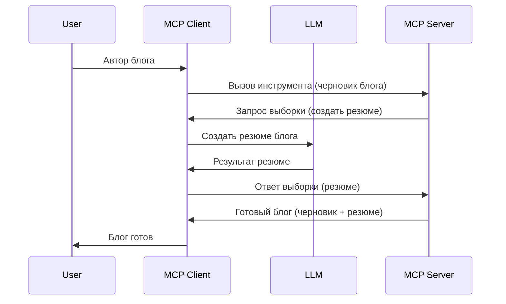

# Sampling - делегирование функций Клиенту

> **Уведомление об устаревании:** кандидат на выпуск спецификации MCP версии `2026-07-28` объявляет Sampling устаревшим в пользу прямой интеграции с API поставщиков LLM. Sampling продолжит работать в версии `2025-11-25` и как минимум год после формального устаревания, поэтому все примеры из этого урока остаются актуальными — но новые проекты серверов должны рассматривать заменяющий паттерн. См. [Что меняется в MCP: кандидат на выпуск 2026-07-28](../../01-CoreConcepts/mcp-2026-07-28-release-candidate.md).

Иногда требуется, чтобы MCP Клиент и MCP Сервер сотрудничали для достижения общей цели. Может возникнуть ситуация, когда Сервер нуждается в помощи LLM, работающего на клиенте. Для таких случаев нужно использовать Sampling.

Давайте рассмотрим несколько примеров использования и то, как построить решение с использованием Sampling.

## Обзор

В этом уроке мы сосредоточимся на объяснении, когда и где использовать Sampling, и как его настроить.

## Цели обучения

В этой главе мы:

- Объясним, что такое Sampling и когда его применять.
- Покажем, как настроить Sampling в MCP.
- Приведем примеры работы Sampling.

## Что такое Sampling и зачем его использовать?

Sampling — это продвинутая функция, работающая следующим образом:



### Запрос на Sampling

Хорошо, теперь у нас есть общее представление о правдоподобном сценарии, давайте поговорим о запросе на sampling, который сервер отправляет обратно клиенту. Вот как такой запрос может выглядеть в формате JSON-RPC:

```json
{
  "jsonrpc": "2.0",
  "id": 1,
  "method": "sampling/createMessage",
  "params": {
    "messages": [
      {
        "role": "user",
        "content": {
          "type": "text",
          "text": "Create a blog post summary of the following blog post: <BLOG POST>"
        }
      }
    ],
    "modelPreferences": {
      "hints": [
        {
          "name": "claude-3-sonnet"
        }
      ],
      "intelligencePriority": 0.8,
      "speedPriority": 0.5
    },
    "systemPrompt": "You are a helpful assistant.",
    "maxTokens": 100
  }
}
```

Здесь есть несколько важных моментов:

- Промпт, в content -> text, — это наша подсказка, инструктаж для LLM по суммированию контента блога.

- **modelPreferences**. Этот раздел содержит именно рекомендации, предпочтения по конфигурации для LLM. Пользователь может либо принять эти рекомендации, либо изменить их. В данном случае рекомендации касаются модели, скорости и приоритета интеллекта.
- **systemPrompt** — это обычный системный промпт, дающий вашей LLM характер и содержаший инструкции по работе.
- **maxTokens** — свойство, указывающее рекомендуемое количество токенов для выполнения задачи.

### Ответ на Sampling

Этот ответ отправляет MCP Клиент обратно MCP Серверу и является результатом вызова LLM клиентом, ожидания ответа и затем формирования этого сообщения. Вот как это может выглядеть в JSON-RPC:

```json
{
  "jsonrpc": "2.0",
  "id": 1,
  "result": {
    "role": "assistant",
    "content": {
      "type": "text",
      "text": "Here's your abstract <ABSTRACT>"
    },
    "model": "gpt-5",
    "stopReason": "endTurn"
  }
}
```

Обратите внимание, что ответ — это абстрактная версия блог-поста, как мы и просили. Также обратите внимание, что используемая модель — "gpt-5", а не "claude-3-sonnet", как запрашивалось. Это иллюстрирует, что пользователь может изменить своё мнение по поводу используемой модели, а ваш запрос sampling — всего лишь рекомендация.

Хорошо, теперь, когда мы понимаем основной поток и полезное применение задачи «создание блог-поста + аннотация», давайте посмотрим, что нужно сделать, чтобы это работало.

### Типы сообщений

Sampling сообщения не ограничиваются только текстом, вы также можете отправлять изображения и аудио. Вот как JSON-RPC выглядит для разных типов:

**Текст**

```json
{
  "type": "text",
  "text": "The message content"
}
```

**Изображение**

```json
{
  "type": "image",
  "data": "base64-encoded-image-data",
  "mimeType": "image/jpeg"
}
```

**Аудиоконтент**

```json
{
  "type": "audio",
  "data": "base64-encoded-audio-data",
  "mimeType": "audio/wav"
}
```

> NOTE: для более подробной информации о Sampling ознакомьтесь с [официальной документацией](https://modelcontextprotocol.io/specification/2025-11-25/client/sampling)

## Как настроить Sampling в Клиенте

> Примечание: если вы только разрабатываете сервер, здесь делать особо нечего.

В клиенте необходимо указать следующую функцию так:

```json
{
  "capabilities": {
    "sampling": {}
  }
}
```

Это будет автоматически учтено при инициализации выбранного клиента с сервером.

## Пример использования Sampling - Создание блог-поста

Давайте вместе напишем sampling сервер, нам понадобится сделать следующее:

1. Создать инструмент на Сервере.
1. Этот инструмент должен создавать запрос sampling.
1. Инструмент должен ждать ответа от клиента на sampling запрос.
1. После этого должен быть получен результат работы инструмента.

Рассмотрим код пошагово:

### -1- Создание инструмента

**python**

```python
@mcp.tool()
async def create_blog(title: str, content: str, ctx: Context[ServerSession, None]) -> str:
    """Create a blog post and generate a summary"""

```

### -2- Создание запроса на sampling

Расширьте ваш инструмент следующим кодом:

**python**

```python
post = BlogPost(
        id=len(posts) + 1,
        title=title,
        content=content,
        abstract=""
    )

prompt = f"Create an abstract of the following blog post: title: {title} and draft: {content} "

result = await ctx.session.create_message(
        messages=[
            SamplingMessage(
                role="user",
                content=TextContent(type="text", text=prompt),
            )
        ],
        max_tokens=100,
)

```

### -3- Ожидание ответа и возврат результата

**python**

```python
post.abstract = result.content.text

posts.append(post)

# вернуть полный продукт
return json.dumps({
    "id": post.title,
    "abstract": post.abstract
})
```

### -4- Полный код

**python**

```python
from starlette.applications import Starlette
from starlette.routing import Mount, Host

from mcp.server.fastmcp import Context, FastMCP

from mcp.server.session import ServerSession
from mcp.types import SamplingMessage, TextContent

import json


from uuid import uuid4
from typing import List
from pydantic import BaseModel


mcp = FastMCP("Blog post generator")

# app = FastAPI()

posts = []

class BlogPost(BaseModel):
    id: int
    title: str
    content: str
    abstract: str

posts: List[BlogPost] = []

@mcp.tool()
async def create_blog(title: str, content: str, ctx: Context[ServerSession, None]) -> str:
    """Create a blog post and generate a summary"""

    post = BlogPost(
        id=len(posts) + 1,
        title=title,
        content=content,
        abstract=""
    )

    prompt = f"Create an abstract of the following blog post: title: {title} and draft: {content} "

    result = await ctx.session.create_message(
        messages=[
            SamplingMessage(
                role="user",
                content=TextContent(type="text", text=prompt),
            )
        ],
        max_tokens=100,
    )

    post.abstract = result.content.text

    posts.append(post)

    # вернуть полный пост в блоге
    return json.dumps({
        "id": post.title,
        "abstract": post.abstract
    })

if __name__ == "__main__":
    print("Starting server...")
    # mcp.run()
    mcp.run(transport="streamable-http")

# запустить приложение командой: python server.py
```

### -5- Тестирование в Visual Studio Code

Чтобы проверить это в Visual Studio Code, сделайте следующее:

1. Запустите сервер в терминале
1. Добавьте его в *mcp.json* (и убедитесь, что он запущен), например так:

   ```json
   "servers": {
      "blog-server": {
        "type": "http",
        "url": "http://localhost:8000/mcp"
      }
   }
   ```

1. Введите запрос:

   ```text
   create a blog post named "Where Python comes from", the content is "Python is actually named after Monty Python Flying Circus"
   ```

1. Разрешите выполнение sampling. Впервые при тестировании вы увидите дополнительный диалог, который нужно принять, после чего появится обычное окно с запросом подтвердить запуск инструмента.

1. Просмотрите результаты. Вы увидите их как красиво отформатированные в GitHub Copilot Chat, но также можете просмотреть необработанный JSON ответ.

**Бонус.** Инструменты Visual Studio Code отлично поддерживают sampling. Вы можете настроить доступ Sampling для установленного сервера, сделав так:

1. Перейдите в раздел расширений.
1. Нажмите на иконку шестерёнки рядом с вашим установленным сервером в разделе «MCP SERVERS - INSTALLED».
1. Выберите «Configure Model Access» — здесь можно выбрать, к каким моделям GitHub Copilot может обращаться при выполнении sampling. Также здесь можно увидеть все недавние запросы sampling, нажав «Show Sampling requests».

## Задание

В этом задании вы создадите немного другой Sampling — интеграцию для генерации описания продукта. Вот ваш сценарий:

**Сценарий**: Работнику бэк-офиса в e-commerce требуется помощь, так как генерация описаний продуктов занимает слишком много времени. Ваша задача — построить решение, где вызывается инструмент "create_product" с аргументами "title" и "keywords", и он должен создавать полноценный продукт с заполненным полем "description", которое генерируется LLM на клиенте.

TIP: используйте то, что вы изучили ранее, чтобы построить этот сервер и инструмент с помощью запроса sampling.

## Решение

[Решение](./solution/README.md)

## Ключевые выводы

Sampling — мощная функция, которая позволяет серверу делегировать задачи клиенту, когда нужна помощь LLM.

## Что дальше

- [Глава 4 - Практическая реализация](../../04-PracticalImplementation/README.md)

---

<!-- CO-OP TRANSLATOR DISCLAIMER START -->
**Отказ от ответственности**:
Этот документ был переведен с использованием сервиса машинного перевода [Co-op Translator](https://github.com/Azure/co-op-translator). Несмотря на наши усилия по обеспечению точности, имейте в виду, что автоматический перевод может содержать ошибки или неточности. Оригинальный документ на его исходном языке следует считать авторитетным источником. Для получения критически важной информации рекомендуется обратиться к профессиональному человеческому переводу. Мы не несем ответственности за любые недоразумения или неправильные толкования, возникшие в результате использования этого перевода.
<!-- CO-OP TRANSLATOR DISCLAIMER END -->