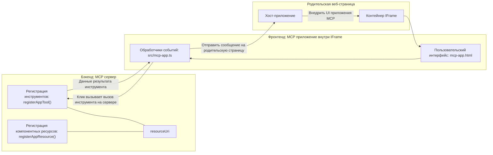
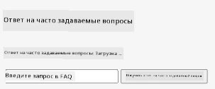
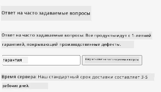
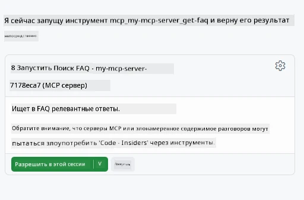

# MCP Apps

MCP Apps — это новая парадигма в MCP. Идея в том, что вы не только отвечаете данными после вызова инструмента, но и предоставляете информацию о том, как с этими данными следует взаимодействовать. Это означает, что результаты инструмента теперь могут содержать информацию о пользовательском интерфейсе. Зачем это нужно? Подумайте, как вы обычно работаете сегодня. Вы, вероятно, потребляете результаты MCP Server, размещая перед ним некоторый фронтенд, — это код, который нужно писать и поддерживать. Иногда это именно то, что нужно, но иногда было бы замечательно просто получить фрагмент информации, который является автономным и содержит всё — от данных до интерфейса пользователя.

## Обзор

Этот урок предоставляет практические рекомендации по работе с MCP Apps, как начать работу с ними и как интегрировать их в ваши существующие веб-приложения. MCP Apps — это очень новое дополнение к стандарту MCP.

## Цели обучения

К концу этого урока вы сможете:

- Объяснить, что такое MCP Apps.
- Понять, когда следует использовать MCP Apps.
- Создавать и интегрировать собственные MCP Apps.

## MCP Apps - как это работает

Идея MCP Apps — предоставлять ответ, который по сути является компонентом для отображения. Такой компонент может иметь как визуальные элементы, так и интерактивность, например, обработку нажатий кнопок, ввод пользователя и многое другое. Начнём с серверной части и нашего MCP Server. Чтобы создать компонент MCP App, необходимо создать инструмент, а также ресурс приложения. Эти две части связываются с помощью resourceUri.

Вот пример. Попробуем визуализировать, что включает в себя процесс и какие части за что отвечают:

```text
server.ts -- responsible for registering tools and the component as a UI component
src/
  mcp-app.ts -- wiring up event handlers
mcp-app.html -- the user interface
```

Эта схема описывает архитектуру создания компонента и его логику.


Далее попробуем описать обязанности бекенда и фронтенда соответственно.

### Бекенд

Здесь нам нужно выполнить две задачи:

- Зарегистрировать инструменты, с которыми мы хотим взаимодействовать.
- Определить компонент.

**Регистрация инструмента**

```typescript
registerAppTool(
    server,
    "get-time",
    {
      title: "Get Time",
      description: "Returns the current server time.",
      inputSchema: {},
      _meta: { ui: { resourceUri } }, // Связывает этот инструмент с его ресурсом пользовательского интерфейса
    },
    async () => {
      const time = new Date().toISOString();
      return { content: [{ type: "text", text: time }] };
    },
  );

```

Приведённый код описывает поведение, где открывается инструмент под названием `get-time`. Он не принимает входных данных, но в итоге выдаёт текущее время. Мы можем определить `inputSchema` для инструментов, которые должны принимать ввод пользователя.

**Регистрация компонента**

В том же файле нам нужно зарегистрировать компонент:

```typescript
const resourceUri = "ui://get-time/mcp-app.html";

// Зарегистрируйте ресурс, который возвращает упакованные HTML/JavaScript для пользовательского интерфейса.
registerAppResource(
  server,
  resourceUri,
  resourceUri,
  { mimeType: RESOURCE_MIME_TYPE },
  async () => {
    const html = await fs.readFile(path.join(DIST_DIR, "mcp-app.html"), "utf-8");

    return {
    contents: [
        { uri: resourceUri, mimeType: RESOURCE_MIME_TYPE, text: html },
    ],
    };
  },
);
```

Обратите внимание, как упоминается `resourceUri` для связи компонента с его инструментами. Также интересен колбэк, в котором загружается UI-файл и возвращается компонент.

### Фронтенд компонента

Так же, как и на бекенде, здесь две части:

- Фронтенд, написанный на чистом HTML.
- Код, обрабатывающий события и выполняющий действия, например, вызов инструментов или отправку сообщений родительскому окну.

**Пользовательский интерфейс**

Посмотрим на интерфейс пользователя.

```html
<!-- mcp-app.html -->
<!DOCTYPE html>
<html lang="en">
  <head>
    <meta charset="UTF-8" />
    <title>Get Time App</title>
  </head>
  <body>
    <p>
      <strong>Server Time:</strong> <code id="server-time">Loading...</code>
    </p>
    <button id="get-time-btn">Get Server Time</button>
    <script type="module" src="/src/mcp-app.ts"></script>
  </body>
</html>
```

**Подключение событий**

Последняя часть — это подключение событий. Это значит, что мы идентифицируем, какая часть UI нуждается в обработчиках событий и что делать при их возникновении:

```typescript
// mcp-app.ts

import { App } from "@modelcontextprotocol/ext-apps";

// Получить ссылки на элементы
const serverTimeEl = document.getElementById("server-time")!;
const getTimeBtn = document.getElementById("get-time-btn")!;

// Создать экземпляр приложения
const app = new App({ name: "Get Time App", version: "1.0.0" });

// Обработать результаты инструмента от сервера. Установить до `app.connect()`, чтобы избежать
// пропуска начального результата инструмента.
app.ontoolresult = (result) => {
  const time = result.content?.find((c) => c.type === "text")?.text;
  serverTimeEl.textContent = time ?? "[ERROR]";
};

// Подключить обработчик клика кнопки
getTimeBtn.addEventListener("click", async () => {
  // `app.callServerTool()` позволяет UI запросить свежие данные с сервера
  const result = await app.callServerTool({ name: "get-time", arguments: {} });
  const time = result.content?.find((c) => c.type === "text")?.text;
  serverTimeEl.textContent = time ?? "[ERROR]";
});

// Подключиться к хосту
app.connect();
```

Как видно из примера, это обычный код для привязки элементов DOM к событиям. Особенно стоит отметить вызов `callServerTool`, который фактически вызывает инструмент на бекенде.

## Работа с вводом пользователя

До этого мы видели компонент с кнопкой, которая при нажатии вызывает инструмент. Теперь попробуем добавить больше элементов UI, например, поле ввода, и посмотрим, как передать аргументы в инструмент. Реализуем функциональность FAQ. Вот как это должно работать:

- Должна быть кнопка и поле ввода, где пользователь вводит ключевое слово для поиска, например, "Shipping". Это вызывает инструмент на бекенде, который выполняет поиск в данных FAQ.
- Инструмент, поддерживающий упомянутый поиск по FAQ.

Для начала добавим необходимую поддержку на бекенде:

```typescript
const faq: { [key: string]: string } = {
    "shipping": "Our standard shipping time is 3-5 business days.",
    "return policy": "You can return any item within 30 days of purchase.",
    "warranty": "All products come with a 1-year warranty covering manufacturing defects.",
  }

registerAppTool(
    server,
    "get-faq",
    {
      title: "Search FAQ",
      description: "Searches the FAQ for relevant answers.",
      inputSchema: zod.object({
        query: zod.string().default("shipping"),
      }),
      _meta: { ui: { resourceUri: faqResourceUri } }, // Связывает этот инструмент с его ресурсом пользовательского интерфейса
    },
    async ({ query }) => {
      const answer: string = faq[query.toLowerCase()] || "Sorry, I don't have an answer for that.";
      return { content: [{ type: "text", text: answer }] };
    },
  );
```

Здесь мы видим, как заполняется `inputSchema` и задаётся схема `zod` следующим образом:

```typescript
inputSchema: zod.object({
  query: zod.string().default("shipping"),
})
```

В данной схеме мы объявляем входной параметр `query`, который является необязательным с значением по умолчанию "shipping".

Хорошо, перейдём к *mcp-app.html*, чтобы посмотреть, какой UI нам нужно создать:

```html
<div class="faq">
    <h1>FAQ response</h1>
    <p>FAQ Response: <code id="faq-response">Loading...</code></p>
    <input type="text" id="faq-query" placeholder="Enter FAQ query" />
    <button id="get-faq-btn">Get FAQ Response</button>
  </div>
```

Отлично, теперь у нас есть поле ввода и кнопка. Далее перейдём к *mcp-app.ts*, чтобы подключить эти события:

```typescript
const getFaqBtn = document.getElementById("get-faq-btn")!;
const faqQueryInput = document.getElementById("faq-query") as HTMLInputElement;

getFaqBtn.addEventListener("click", async () => {
  const query = faqQueryInput.value;
  const result = await app.callServerTool({ name: "get-faq", arguments: { query } });
  const faq = result.content?.find((c) => c.type === "text")?.text;
  faqResponseEl.textContent = faq ?? "[ERROR]";
});
```

В приведённом коде мы:

- Создаём ссылки на интересующие элементы UI.
- Обрабатываем нажатие кнопки, чтобы получить значение из поля ввода, а затем вызываем `app.callServerTool()` с `name` и `arguments`, где в последних передаётся параметр `query`.

Что происходит при вызове `callServerTool`: сообщение отправляется в родительское окно, которое в итоге вызывает MCP Server.

### Попробуйте сами

При попытке это проверить мы должны увидеть следующее:



Вот пример с вводом "warranty":



Чтобы запустить этот код, перейдите в раздел [Code section](./code/README.md)

## Тестирование в Visual Studio Code

Visual Studio Code отлично поддерживает MCP Apps и, вероятно, является одним из самых простых способов тестирования ваших MCP Apps. Чтобы использовать Visual Studio Code, добавьте запись сервера в *mcp.json* следующего вида:

```json
"my-mcp-server-7178eca7": {
    "url": "http://localhost:3001/mcp",
    "type": "http"
  }
```

Затем запустите сервер, и вы сможете взаимодействовать с вашим MVP App через окно чата, если у вас установлен GitHub Copilot.

Запуск через промпт, например, "#get-faq":



И так же, как при запуске в веб-браузере, он отображается следующим образом:


## Задание

Создайте игру камень-ножницы-бумага. Она должна включать следующее:

UI:

- выпадающий список с вариантами выбора
- кнопку для отправки выбора
- метку, показывающую, кто что выбрал и кто победил

Сервер:

- должен иметь инструмент камень-ножницы-бумага, который принимает "choice" как ввод. Он также должен генерировать выбор компьютера и определять победителя

## Решение

[Решение](./assignment/README.md)

## Итоги

Мы познакомились с новой парадигмой MCP Apps. Это новая концепция, которая позволяет MCP Server не только владеть данными, но и определять, как эти данные должны быть представлены.

Кроме того, мы узнали, что эти MCP Apps размещаются внутри IFrame, и для общения с MCP Server им нужно отправлять сообщения в родительское веб-приложение. Существует несколько библиотек как для чистого JavaScript, так и для React и других, которые упрощают эту коммуникацию.

## Основные выводы

Вот что вы узнали:

- MCP Apps — новый стандарт, который полезен, когда нужно доставлять и данные, и функции пользовательского интерфейса.
- Такие приложения запускаются в IFrame по соображениям безопасности.

## Что дальше

- [Глава 4](../../04-PracticalImplementation/README.md)

---

<!-- CO-OP TRANSLATOR DISCLAIMER START -->
**Отказ от ответственности**:  
Этот документ был переведен с помощью сервиса автоматического перевода [Co-op Translator](https://github.com/Azure/co-op-translator). Несмотря на наши усилия по обеспечению точности, просим учитывать, что автоматический перевод может содержать ошибки или неточности. Оригинальный документ на его исходном языке следует считать авторитетным источником. Для получения критически важной информации рекомендуется обращаться к профессиональному человеческому переводу. Мы не несем ответственности за любые недоразумения или неправильные толкования, возникшие в результате использования данного перевода.
<!-- CO-OP TRANSLATOR DISCLAIMER END -->