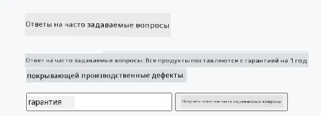
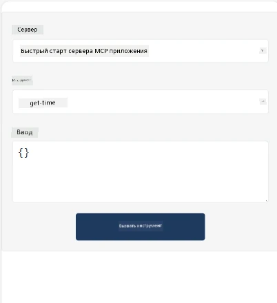
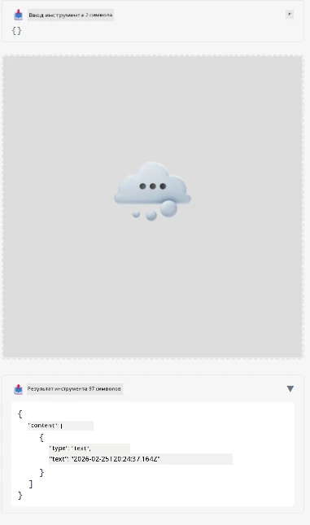

Вот пример, демонстрирующий MCP App

## Установка

1. Перейдите в папку *mcp-app*
1. Запустите `npm install`, это должно установить зависимости фронтенда и бэкенда

Проверьте компиляцию бэкенда, выполнив:

```sh
npx tsc --noEmit
```

Если всё в порядке, вывода не будет.

## Запуск бэкенда

> Это требует немного дополнительных действий, если вы используете Windows, так как решение MCP Apps использует библиотеку `concurrently`, для которой нужно найти замену. Вот проблемная строка в *package.json* MCP App:

    ```json
    "start": "concurrently \"cross-env NODE_ENV=development INPUT=mcp-app.html vite build --watch\" \"tsx watch main.ts\""
    ```

Это приложение состоит из двух частей: бэкенд и хост.

Запустите бэкенд, вызвав:

```sh
npm start
```

Это должно запустить бэкенд на `http://localhost:3001/mcp`.

> Обратите внимание, если вы используете Codespace, возможно, потребуется сделать порт публичным. Проверьте, можно ли открыть конечную точку в браузере по адресу https://<имя Codespace>.app.github.dev/mcp

## Вариант 1 — Тестирование приложения в Visual Studio Code

Чтобы протестировать решение в Visual Studio Code, выполните следующее:

- Добавьте запись сервера в `mcp.json`, вот так:

    ```json
    {
        "servers": {
            "my-mcp-server-7178eca7": {
                "url": "http://localhost:3001/mcp",
                "type": "http"
            }
        },
        "inputs": []
    }
    ```

1. Нажмите кнопку "start" в *mcp.json*
1. Убедитесь, что окно чата открыто, и введите `get-faq`, вы должны увидеть результат, например:

    

## Вариант 2 — Тестирование приложения с помощью хоста

Репозиторий <https://github.com/modelcontextprotocol/ext-apps> содержит несколько разных хостов, которые вы можете использовать для тестирования ваших MVP приложений.

Здесь мы представим два варианта:

### Локальная машина

- Перейдите в папку *ext-apps* после клонирования репозитория.

- Установите зависимости

   ```sh
   npm install
   ```

- В отдельном окне терминала перейдите в *ext-apps/examples/basic-host*

    > если вы используете Codespace, необходимо перейти к файлу serve.ts, строка 27, и заменить http://localhost:3001/mcp на URL вашего Codespace для бэкенда, например https://psychic-xylophone-657rpjgvxpc5g64-3001.app.github.dev/mcp

- Запустите хост:

    ```sh
    npm start
    ```

    Это должно соединить хост с бэкендом, и вы увидите, что приложение запущено, примерно так:

    

### Codespace

Настроить среду Codespace немного сложнее. Чтобы использовать хост через Codespace:

- Перейдите в директорию *ext-apps*, а затем в *examples/basic-host*.
- Запустите `npm install` для установки зависимостей
- Запустите `npm start` для запуска хоста.

## Тестирование приложения

Попробуйте использовать приложение следующим образом:

- Выберите кнопку "Call Tool", вы должны увидеть результаты, примерно так:

    

Отлично, всё работает.

---

<!-- CO-OP TRANSLATOR DISCLAIMER START -->
**Отказ от ответственности**:
Этот документ был переведен с помощью сервиса автоматического перевода [Co-op Translator](https://github.com/Azure/co-op-translator). Несмотря на наши усилия по обеспечению точности, имейте в виду, что автоматические переводы могут содержать ошибки или неточности. Оригинальный документ на его родном языке следует считать авторитетным источником. Для получения важной информации рекомендуется профессиональный перевод человеком. Мы не несем ответственности за какие-либо недоразумения или неправильные толкования, возникшие в результате использования данного перевода.
<!-- CO-OP TRANSLATOR DISCLAIMER END -->