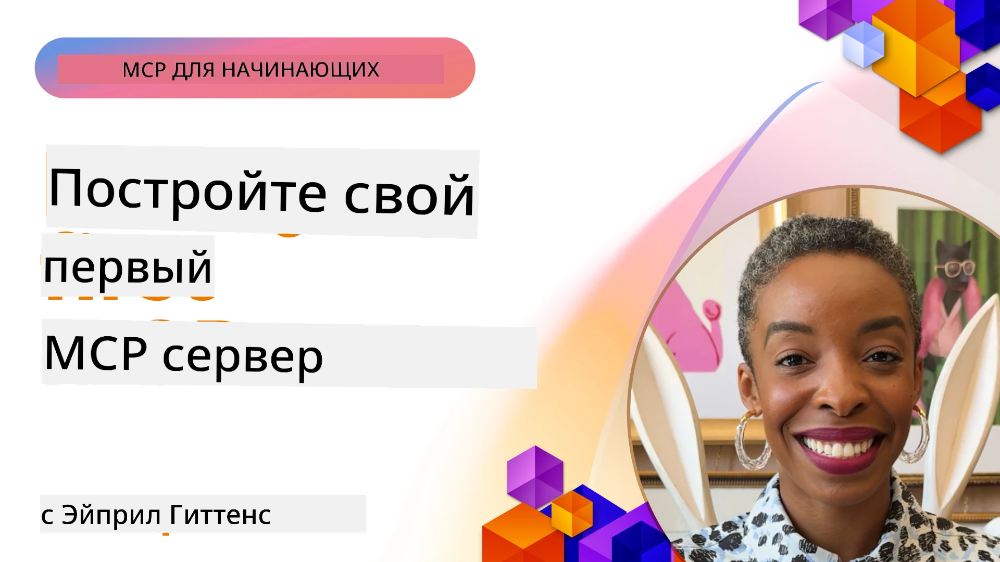

## Начало работы  

_(Кликните по изображению выше, чтобы посмотреть видео этого урока)_

Этот раздел состоит из нескольких уроков:

- **1 Ваш первый сервер**, в этом первом уроке вы научитесь создавать свой первый сервер и исследовать его с помощью инструмента инспектора — ценного средства для тестирования и отладки вашего сервера, [к уроку](01-first-server/README.md)

- **2 Клиент**, в этом уроке вы узнаете, как написать клиент, который может подключаться к вашему серверу, [к уроку](02-client/README.md)

- **3 Клиент с LLM**, еще лучший способ написания клиента — добавить к нему LLM, чтобы он мог «договариваться» с вашим сервером о действиях, [к уроку](03-llm-client/README.md)

- **4 Использование режима агента GitHub Copilot для сервера в Visual Studio Code**. Здесь мы изучаем запуск MCP сервера внутри Visual Studio Code, [к уроку](04-vscode/README.md)

- **5 Сервер с использованием транспортного протокола stdio**. stdio transport — рекомендуемый стандарт для локальной коммуникации MCP сервер-клиент, обеспечивающий безопасное взаимодействие на основе подпроцессов с встроенной изоляцией процессов [к уроку](05-stdio-server/README.md)

- **6 HTTP потоковая передача с MCP (Streamable HTTP)**. Узнайте о современном транспортном протоколе потокового HTTP (рекомендуемый подход для удаленных MCP серверов согласно [MCP Specification 2025-11-25](https://spec.modelcontextprotocol.io/specification/2025-11-25/basic/transports/#streamable-http)), уведомлениях о прогрессе, а также как создавать масштабируемые, реального времени MCP серверы и клиенты с использованием Streamable HTTP. [к уроку](06-http-streaming/README.md)

- **7 Использование AI Toolkit для VSCode** для работы с вашими MCP клиентами и серверами и их тестирования [к уроку](07-aitk/README.md)

- **8 Тестирование**. Здесь мы сосредоточимся на различных способах тестирования нашего сервера и клиента, [к уроку](08-testing/README.md)

- **9 Развертывание**. Эта глава рассмотрит различные способы развертывания ваших MCP решений, [к уроку](09-deployment/README.md)

- **10 Продвинутое использование сервера**. Эта глава посвящена продвинутому использованию сервера, [к уроку](./10-advanced/README.md)

- **11 Аутентификация**. Глава об основах аутентификации: от базовой до использования JWT и RBAC. Рекомендуется начать отсюда, затем изучить продвинутые темы в главе 5 и усилить безопасность согласно рекомендациям в главе 2, [к уроку](./11-simple-auth/README.md)

- **12 MCP Хосты**. Настройка и использование популярных хост-клиентов MCP, включая Claude Desktop, Cursor, Cline и Windsurf. Изучите типы транспортов и устранение неполадок, [к уроку](./12-mcp-hosts/README.md)

- **13 MCP Inspector**. Интерактивная отладка и тестирование ваших MCP серверов с помощью инструмента MCP Inspector. Изучите способы устранения неполадок, ресурсы и протокольные сообщения, [к уроку](./13-mcp-inspector/README.md)

- **14 Семплирование**. Создавайте MCP серверы, которые сотрудничают с MCP клиентами по задачам, связанным с LLM. [к уроку](./14-sampling/README.md)

- **15 MCP Приложения**. Создавайте MCP серверы, которые также отвечают с UI-инструкциями, [к уроку](./15-mcp-apps/README.md)

Model Context Protocol (MCP) — это открытый протокол, стандартизирующий способ предоставления контекста приложениям с LLM. Представьте MCP как USB-C порт для AI-приложений — он обеспечивает стандартизированный способ подключения AI моделей к различным источникам данных и инструментам.

## Цели обучения

К концу этого урока вы сможете:

- Настроить среду разработки для MCP на C#, Java, Python, TypeScript и JavaScript
- Создавать и разворачивать базовые MCP серверы с пользовательскими возможностями (ресурсы, подсказки и инструменты)
- Создавать хост-приложения, подключающиеся к MCP серверам
- Тестировать и отлаживать реализации MCP
- Понимать распространенные проблемы при настройке и их решения
- Подключать свои реализации MCP к популярным LLM сервисам

## Настройка вашей MCP среды

Прежде чем начать работать с MCP, важно подготовить среду разработки и понять базовый рабочий процесс. В этом разделе вы пройдете начальные шаги для плавного старта с MCP.

### Предварительные требования

Перед началом разработки MCP убедитесь, что у вас есть:

- **Среда разработки** для выбранного языка (C#, Java, Python, TypeScript или JavaScript)
- **IDE/Редактор**: Visual Studio, Visual Studio Code, IntelliJ, Eclipse, PyCharm или любой современный редактор кода
- **Менеджеры пакетов**: NuGet, Maven/Gradle, pip или npm/yarn
- **API ключи** для любых AI сервисов, которые вы планируете использовать в своих хост-приложениях

### Официальные SDK

В последующих главах вы увидите решения, построенные с использованием Python, TypeScript, Java и .NET. Ниже перечислены все официально поддерживаемые SDK.

MCP предоставляет официальные SDK для нескольких языков (в соответствии с [MCP Specification 2025-11-25](https://spec.modelcontextprotocol.io/specification/2025-11-25/)):
- [C# SDK](https://github.com/modelcontextprotocol/csharp-sdk) — поддерживается в сотрудничестве с Microsoft
- [Java SDK](https://github.com/modelcontextprotocol/java-sdk) — поддерживается совместно с Spring AI
- [TypeScript SDK](https://github.com/modelcontextprotocol/typescript-sdk) — официальная реализация на TypeScript
- [Python SDK](https://github.com/modelcontextprotocol/python-sdk) — официальная реализация на Python (FastMCP)
- [Kotlin SDK](https://github.com/modelcontextprotocol/kotlin-sdk) — официальная реализация на Kotlin
- [Swift SDK](https://github.com/modelcontextprotocol/swift-sdk) — поддерживается совместно с Loopwork AI
- [Rust SDK](https://github.com/modelcontextprotocol/rust-sdk) — официальная реализация на Rust
- [Go SDK](https://github.com/modelcontextprotocol/go-sdk) — официальная реализация на Go

## Основные выводы

- Настройка среды разработки MCP проста благодаря специализированным SDK для языков
- Создание MCP серверов включает создание и регистрацию инструментов с четкими схемами
- MCP клиенты подключаются к серверам и моделям для расширения возможностей
- Тестирование и отладка необходимы для надежных реализаций MCP
- Варианты развертывания варьируются от локальной разработки до облачных решений

## Практика

У нас есть набор примеров, дополняющих упражнения, которые вы найдете во всех главах этого раздела. Также каждая глава содержит собственные упражнения и задания.

- [Java калькулятор](./samples/java/calculator/README.md)
- [.Net калькулятор](../../../03-GettingStarted/samples/csharp)
- [JavaScript калькулятор](./samples/javascript/README.md)
- [TypeScript калькулятор](./samples/typescript/README.md)
- [Python калькулятор](../../../03-GettingStarted/samples/python)

## Дополнительные ресурсы

- [Создание агентов с использованием Model Context Protocol на Azure](https://learn.microsoft.com/azure/developer/ai/intro-agents-mcp)
- [Удаленный MCP с Azure Container Apps (Node.js/TypeScript/JavaScript)](https://learn.microsoft.com/samples/azure-samples/mcp-container-ts/mcp-container-ts/)
- [.NET OpenAI MCP Agent](https://learn.microsoft.com/samples/azure-samples/openai-mcp-agent-dotnet/openai-mcp-agent-dotnet/)

## Что дальше

Начните с первого урока: [Создание вашего первого MCP сервера](01-first-server/README.md)

После завершения этого модуля переходите к: [Модуль 4: Практическая реализация](../04-PracticalImplementation/README.md)

---

<!-- CO-OP TRANSLATOR DISCLAIMER START -->
**Отказ от ответственности**:  
Этот документ был переведен с использованием сервиса автоматического перевода [Co-op Translator](https://github.com/Azure/co-op-translator). Несмотря на то, что мы стремимся к точности, имейте в виду, что автоматический перевод может содержать ошибки или неточности. Оригинальный документ на его родном языке следует считать авторитетным источником. Для получения критически важной информации рекомендуется профессиональный перевод человеком. Мы не несем ответственности за любые недоразумения или неправильные толкования, возникшие в результате использования данного перевода.
<!-- CO-OP TRANSLATOR DISCLAIMER END -->