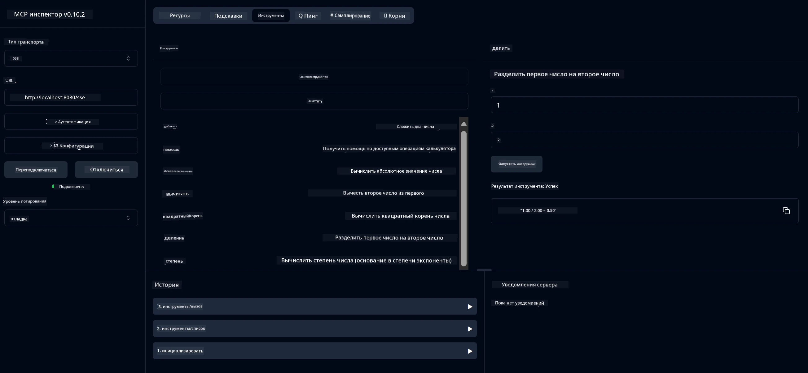

# Сервис базового калькулятора MCP

> [!NOTE]
> Этот пример использует устаревший транспорт HTTP+SSE и предназначен для SDK, совместимого с MCP `2025-11-25`. Новые удалённые серверы должны использовать поддержку Streamable HTTP версии `2026-07-28`.
>  


- Поддержку SSE (Server-Sent Events)
- Автоматическую регистрацию инструментов с помощью аннотации `@Tool` из Spring AI
- Базовые функции калькулятора:
  - Сложение, вычитание, умножение, деление
  - Вычисление степени и квадратного корня
  - Остаток от деления и абсолютное значение
  - Функция помощи для описания операций


   - Сложение двух чисел
   - Вычитание одного числа из другого
   - Умножение двух чисел
   - Деление одного числа на другое (с проверкой деления на ноль)


   - Вычисление степени (возведение основания в степень)
   - Вычисление квадратного корня (с проверкой на отрицательное число)
   - Вычисление остатка от деления
   - Вычисление абсолютного значения


   - Встроенная функция помощи, описывающая все доступные операции


- `subtract(a, b)`: Вычесть второе число из первого
- `multiply(a, b)`: Умножить два числа
- `divide(a, b)`: Разделить первое число на второе (с проверкой на ноль)
- `power(base, exponent)`: Вычислить степень числа
- `squareRoot(number)`: Вычислить квадратный корень (с проверкой на отрицательное число)
- `modulus(a, b)`: Вычислить остаток от деления
- `absolute(number)`: Вычислить абсолютное значение
- `help()`: Получить информацию о доступных операциях


   
   Для использования AI-моделей GitHub (например, phi-4) вам нужен личный токен доступа GitHub:


   
   б. Нажмите "Generate new token" → "Generate new token (classic)"
   
   в. Дайте своему токену описательное имя
   
   г. Выберите следующие области доступа:
      - `repo` (Полный контроль над приватными репозиториями)
      - `read:org` (Чтение членства в организациях и командах, чтение проектов)
      - `gist` (Создание гистов)
      

      - `user:email` (Доступ к адресам электронной почты пользователей (только для чтения))
   
   e. Нажмите «Generate token» и скопируйте ваш новый токен
   
   f. Установите его как переменную окружения:
      
      В Windows:
      ```
      set GITHUB_TOKEN=your-github-token
      ```
      
      В macOS/Linux:
      ```bash
      export GITHUB_TOKEN=your-github-token
      ```

   g. Для постоянной настройки добавьте его в переменные окружения через системные настройки

2. Добавьте зависимость LangChain4j GitHub в ваш проект (уже включена в pom.xml):
   ```xml
   <dependency>
       <groupId>dev.langchain4j</groupId>
       <artifactId>langchain4j-github</artifactId>
       <version>${langchain4j.version}</version>
   </dependency>
   ```

3. Убедитесь, что сервер калькулятора запущен на `localhost:8080`

### Запуск клиента LangChain4j

Этот пример демонстрирует:
- Подключение к серверу калькулятора MCP через транспорт SSE
- Использование LangChain4j для создания чат-бота с операциями калькулятора
- Интеграцию с AI-моделями GitHub (теперь используется модель phi-4)

Клиент отправляет следующие примерные запросы для демонстрации функционала:
1. Вычисление суммы двух чисел
2. Нахождение квадратного корня числа
3. Получение справочной информации о доступных операциях калькулятора

Запустите пример и проверьте вывод в консоли, чтобы увидеть, как AI-модель использует инструменты калькулятора для ответа на запросы.

### Конфигурация модели GitHub

Клиент LangChain4j сконфигурирован для использования модели phi-4 GitHub со следующими настройками:

```java
ChatLanguageModel model = GitHubChatModel.builder()
    .apiKey(System.getenv("GITHUB_TOKEN"))
    .timeout(Duration.ofSeconds(60))
    .modelName("phi-4")
    .logRequests(true)
    .logResponses(true)
    .build();
```

Чтобы использовать другие модели GitHub, просто измените параметр `modelName` на другую поддерживаемую модель (например, "claude-3-haiku-20240307", "llama-3-70b-8192" и т.д.).

## Зависимости

Для проекта требуются следующие ключевые зависимости:

```xml
<!-- For MCP Server -->
<dependency>
    <groupId>org.springframework.ai</groupId>
    <artifactId>spring-ai-starter-mcp-server-webflux</artifactId>
</dependency>

<!-- For LangChain4j integration -->
<dependency>
    <groupId>dev.langchain4j</groupId>
    <artifactId>langchain4j-mcp</artifactId>
    <version>${langchain4j.version}</version>
</dependency>

<!-- For GitHub models support -->
<dependency>
    <groupId>dev.langchain4j</groupId>
    <artifactId>langchain4j-github</artifactId>
    <version>${langchain4j.version}</version>
</dependency>
```

## Сборка проекта

Соберите проект с помощью Maven:
```bash
./mvnw clean install -DskipTests
```

## Запуск сервера

### Использование Java

```bash
java -jar target/calculator-server-0.0.1-SNAPSHOT.jar
```

### Использование MCP Inspector

MCP Inspector — это полезный инструмент для взаимодействия с сервисами MCP. Чтобы использовать его с этим калькулятором:

1. **Установите и запустите MCP Inspector** в новом окне терминала:
   ```bash
   npx @modelcontextprotocol/inspector
   ```

2. **Откройте веб-интерфейс** по URL, который отображается в приложении (обычно http://localhost:6274)

3. **Настройте подключение**:
   - Установите тип транспорта "SSE"
   - Установите URL к SSE-эндпоинту вашего запущенного сервера: `http://localhost:8080/sse`
   - Нажмите «Connect»

4. **Используйте инструменты**:
   - Нажмите «List Tools», чтобы увидеть доступные операции калькулятора
   - Выберите инструмент и нажмите «Run Tool», чтобы выполнить операцию



### Использование Docker

В проекте есть Dockerfile для контейнеризированного развёртывания:

1. **Соберите Docker-образ**:
   ```bash
   docker build -t calculator-mcp-service .
   ```

2. **Запустите Docker-контейнер**:
   ```bash
   docker run -p 8080:8080 calculator-mcp-service
   ```

Это:
- Соберёт многоступенчатый Docker-образ с Maven 3.9.9 и Eclipse Temurin 24 JDK
- Создаст оптимизированный образ контейнера
- Откроет сервис на порту 8080
- Запустит сервис калькулятора MCP внутри контейнера

Вы сможете получить доступ к сервису по адресу `http://localhost:8080`, когда контейнер запущен.

## Устранение неполадок

### Распространённые проблемы с GitHub токеном


1. **Проблемы с разрешениями токена**: Если вы получаете ошибку 403 Forbidden, проверьте, что у вашего токена есть правильные разрешения, как описано в предварительных требованиях.

2. **Токен не найден**: Если вы получаете ошибку "No API key found", убедитесь, что переменная окружения GITHUB_TOKEN установлена правильно.

3. **Ограничение скорости**: API GitHub имеет ограничения по количеству запросов. Если вы столкнулись с ошибкой ограничения скорости (код состояния 429), подождите несколько минут перед повторной попыткой.

4. **Истечение срока действия токена**: Токены GitHub могут истекать. Если после некоторого времени возникают ошибки аутентификации, создайте новый токен и обновите переменную окружения.

Если вам нужна дополнительная помощь, ознакомьтесь с [документацией LangChain4j](https://github.com/langchain4j/langchain4j) или [документацией GitHub API](https://docs.github.com/en/rest).

---

<!-- CO-OP TRANSLATOR DISCLAIMER START -->
**Отказ от ответственности**:
Этот документ был переведен с использованием сервиса машинного перевода [Co-op Translator](https://github.com/Azure/co-op-translator). Несмотря на наши усилия по обеспечению точности, имейте в виду, что автоматический перевод может содержать ошибки или неточности. Оригинальный документ на его исходном языке следует считать авторитетным источником. Для получения критически важной информации рекомендуется обратиться к профессиональному человеческому переводу. Мы не несем ответственности за любые недоразумения или неправильные толкования, возникшие в результате использования этого перевода.
<!-- CO-OP TRANSLATOR DISCLAIMER END -->