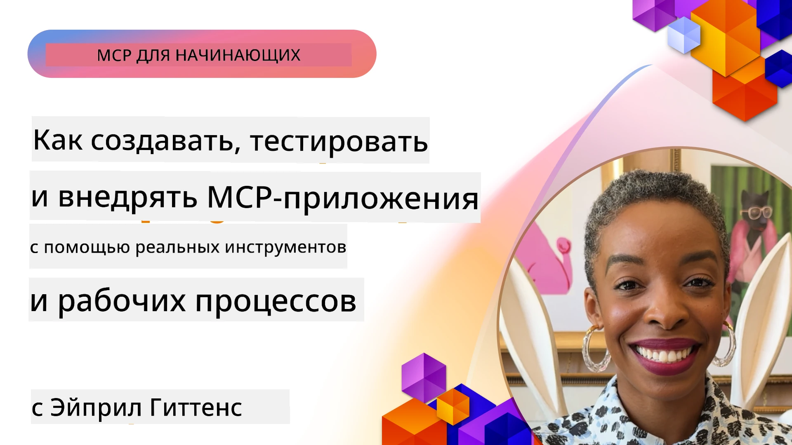

# Практическая реализация

[](https://youtu.be/vCN9-mKBDfQ)

_(Нажмите на изображение выше, чтобы посмотреть видео урока)_

Практическая реализация — это то место, где мощь протокола Model Context Protocol (MCP) становится осязаемой. Хотя понимание теории и архитектуры MCP важно, настоящая ценность возникает при применении этих концепций для создания, тестирования и развертывания решений, которые решают реальные задачи. Эта глава служит мостом между концептуальными знаниями и практической разработкой, руководя вас процессом воплощения приложений на базе MCP в жизнь.

Независимо от того, разрабатываете ли вы интеллектуальных помощников, интегрируете ИИ в бизнес-процессы или создаёте пользовательские инструменты для обработки данных, MCP предоставляет гибкую основу. Его языконезависимый дизайн и официальные SDK для популярных языков программирования делают его доступным для широкого круга разработчиков. Используя эти SDK, вы можете быстро создавать прототипы, итерации и масштабировать свои решения на разных платформах и в различных средах.

В следующих разделах вы найдёте практические примеры, образцы кода и стратегии развертывания, демонстрирующие, как реализовать MCP на C#, Java со Spring, TypeScript, JavaScript и Python. Вы также узнаете, как отлаживать и тестировать свои MCP-серверы, управлять API и развёртывать решения в облаке с помощью Azure. Эти практические материалы созданы, чтобы ускорить ваше обучение и помочь в уверенной разработке надёжных, готовых к производству MCP-приложений.

## Обзор

В этом уроке основное внимание уделяется практическим аспектам реализации MCP на различных языках программирования. Мы рассмотрим, как использовать MCP SDK на C#, Java со Spring, TypeScript, JavaScript и Python для создания надёжных приложений, отладки и тестирования MCP-серверов, а также создания повторно используемых ресурсов, подсказок и инструментов.

## Цели обучения

К концу урока вы сможете:

- Реализовывать решения MCP с использованием официальных SDK на разных языках программирования
- Систематически отлаживать и тестировать MCP-серверы
- Создавать и использовать функции сервера (Ресурсы, Подсказки и Инструменты)
- Проектировать эффективные рабочие процессы MCP для сложных задач
- Оптимизировать реализации MCP для производительности и надежности

## Официальные ресурсы SDK

Протокол Model Context Protocol предлагает официальные SDK для нескольких языков (согласованных с [спецификацией MCP 2025-11-25](https://spec.modelcontextprotocol.io/specification/2025-11-25/)):

- [C# SDK](https://github.com/modelcontextprotocol/csharp-sdk)
- [Java со Spring SDK](https://github.com/modelcontextprotocol/java-sdk) **Примечание:** требует зависимости от [Project Reactor](https://projectreactor.io). (Смотрите [обсуждение issue 246](https://github.com/orgs/modelcontextprotocol/discussions/246).)
- [TypeScript SDK](https://github.com/modelcontextprotocol/typescript-sdk)
- [Python SDK](https://github.com/modelcontextprotocol/python-sdk)
- [Kotlin SDK](https://github.com/modelcontextprotocol/kotlin-sdk)
- [Go SDK](https://github.com/modelcontextprotocol/go-sdk)

## Работа с MCP SDK

Этот раздел предоставляет практические примеры реализации MCP на разных языках программирования. Образцы кода расположены в каталоге `samples`, организованном по языкам.

### Доступные образцы

В репозитории включены [примерные реализации](../../../04-PracticalImplementation/samples) на следующих языках:

- [C#](./samples/csharp/README.md)
- [Java со Spring](./samples/java/containerapp/README.md)
- [TypeScript](./samples/typescript/README.md)
- [JavaScript](./samples/javascript/README.md)
- [Python](./samples/python/README.md)

Каждый образец демонстрирует ключевые концепции MCP и шаблоны реализации для конкретного языка и экосистемы.

### Практические руководства

Дополнительные руководства по практической реализации MCP:

- [Пагинация и большие наборы данных](./pagination/README.md) — Обработка пагинации с использованием курсоров для инструментов, ресурсов и больших наборов данных

## Основные функции сервера

MCP-серверы могут реализовывать любую комбинацию следующих функций:

### Ресурсы

Ресурсы предоставляют контекст и данные для использования пользователем или моделью ИИ:

- Хранилища документов
- Базы знаний
- Структурированные источники данных
- Файловые системы

### Подсказки

Подсказки — это шаблонные сообщения и рабочие процессы для пользователей:

- Предопределённые шаблоны диалогов
- Управляемые схемы взаимодействия
- Специализированные структуры диалогов

### Инструменты

Инструменты — это функции, которые модель ИИ выполняет:

- Утилиты обработки данных
- Интеграции внешних API
- Вычислительные возможности
- Функциональность поиска

## Образцы реализации: Реализация на C#

Официальный репозиторий SDK для C# содержит несколько примерных реализаций, демонстрирующих различные аспекты MCP:

- **Базовый MCP-клиент**: простой пример создания MCP-клиента и вызова инструментов
- **Базовый MCP-сервер**: минимальная реализация сервера с регистрацией базовых инструментов
- **Продвинутый MCP-сервер**: полнофункциональный сервер с регистрацией инструментов, аутентификацией и обработкой ошибок
- **Интеграция с ASP.NET**: примеры интеграции с ASP.NET Core
- **Шаблоны реализации инструментов**: различные паттерны с разным уровнем сложности

SDK MCP для C# находится в стадии предварительного просмотра, и API могут изменяться. Мы будем регулярно обновлять этот блог по мере развития SDK.

### Ключевые функции

- [C# MCP Nuget ModelContextProtocol](https://www.nuget.org/packages/ModelContextProtocol)
- Создание вашего [первого MCP-сервера](https://devblogs.microsoft.com/dotnet/build-a-model-context-protocol-mcp-server-in-csharp/).

Для полного набора примеров реализации на C# посетите [официальный репозиторий примеров C# SDK](https://github.com/modelcontextprotocol/csharp-sdk)

## Образцы реализации: Реализация на Java со Spring

SDK Java со Spring предлагает надёжные варианты реализации MCP с корпоративными возможностями.

### Ключевые функции

- Интеграция с Spring Framework
- Сильная типизация
- Поддержка реактивного программирования
- Полноценная обработка ошибок

Для полного примера реализации на Java со Spring смотрите [пример Java со Spring](samples/java/containerapp/README.md) в каталоге samples.

## Образцы реализации: Реализация на JavaScript

SDK JavaScript предоставляет лёгкий и гибкий подход к реализации MCP.

### Ключевые функции

- Поддержка Node.js и браузера
- API на основе промисов
- Простая интеграция с Express и другими фреймворками
- Поддержка WebSocket для потоковой передачи

Для полного примера реализации на JavaScript смотрите [пример JavaScript](samples/javascript/README.md) в каталоге samples.

## Образцы реализации: Реализация на Python

SDK Python предлагает питонический подход к реализации MCP с отличной интеграцией в ML-фреймворки.

### Ключевые функции

- Поддержка async/await с asyncio
- Интеграция FastAPI
- Простая регистрация инструментов
- Нативная интеграция с популярными ML-библиотеками

Для полного примера реализации на Python смотрите [пример Python](samples/python/README.md) в каталоге samples.

## Управление API

Azure API Management — отличное решение для обеспечения безопасности MCP-серверов. Идея заключается в том, чтобы разместить экземпляр Azure API Management перед вашим MCP-сервером и позволить ему обрабатывать такие функции, как:

- ограничение частоты запросов
- управление токенами
- мониторинг
- балансировка нагрузки
- безопасность

### Пример Azure

Вот пример на Azure, реализующий именно это, т.е. [создание MCP-сервера и его защита через Azure API Management](https://github.com/Azure-Samples/remote-mcp-apim-functions-python).

Посмотрите, как происходит поток авторизации на изображении ниже:


На приведённом изображении происходит следующее:

- Аутентификация/Авторизация производится с помощью Microsoft Entra.
- Azure API Management выступает как шлюз и использует политики для направления и управления трафиком.
- Azure Monitor ведёт журнал всех запросов для дальнейшего анализа.

#### Поток авторизации

Давайте рассмотрим поток авторизации подробнее:


#### Спецификация авторизации MCP

Узнайте больше о [спецификации авторизации MCP](https://spec.modelcontextprotocol.io/specification/2025-11-25/basic/authorization/)

## Развёртывание удалённого MCP-сервера в Azure

Давайте попробуем развернуть ранее упомянутый пример:

1. Клонируйте репозиторий

    ```bash
    git clone https://github.com/Azure-Samples/remote-mcp-apim-functions-python.git
    cd remote-mcp-apim-functions-python
    ```

1. Зарегистрируйте провайдера ресурсов `Microsoft.App`.

   - Если вы используете Azure CLI, выполните `az provider register --namespace Microsoft.App --wait`.
   - Если вы используете Azure PowerShell, выполните `Register-AzResourceProvider -ProviderNamespace Microsoft.App`. Затем через некоторое время выполните `(Get-AzResourceProvider -ProviderNamespace Microsoft.App).RegistrationState`, чтобы проверить, завершена ли регистрация.

1. Выполните эту команду [azd](https://aka.ms/azd) для создания сервиса управления API, функции приложения (с кодом) и всех других необходимых ресурсов Azure

    ```shell
    azd up
    ```

    Эта команда должна развернуть все облачные ресурсы в Azure

### Тестирование вашего сервера с MCP Inspector

1. В **новом окне терминала** установите и запустите MCP Inspector

    ```shell
    npx @modelcontextprotocol/inspector
    ```

    Вы должны увидеть интерфейс, похожий на:

    

1. Нажмите CTRL и кликните, чтобы открыть веб-приложение MCP Inspector по URL, отображаемому приложением (например, [http://127.0.0.1:6274/#resources](http://127.0.0.1:6274/#resources))
1. Установите тип транспорта в `SSE`
1. Введите URL вашего запущенного API Management SSE endpoint, отображаемый после `azd up`, и нажмите **Connect**:

    ```shell
    https://<apim-servicename-from-azd-output>.azure-api.net/mcp/sse
    ```

1. **Список инструментов**. Нажмите на инструмент и **Запустить инструмент**.

Если все шаги выполнены успешно, вы должны быть подключены к MCP-серверу и успешно вызвать инструмент.

## MCP-серверы для Azure

[Remote-mcp-functions](https://github.com/Azure-Samples/remote-mcp-functions-dotnet): Этот набор репозиториев является шаблоном быстрого старта для создания и развёртывания пользовательских удалённых MCP (Model Context Protocol) серверов с использованием Azure Functions на Python, C# .NET или Node/TypeScript.

Примеры предоставляют полноценное решение, позволяющее разработчикам:

- Разрабатывать и запускать локально: создавать и отлаживать MCP-сервер на локальной машине
- Разворачивать в Azure: легко разворачивать в облаке с помощью простой команды azd up
- Подключаться с клиентов: подключаться к MCP-серверу с различных клиентов, включая режим агента Copilot в VS Code и инструмент MCP Inspector

### Ключевые особенности

- Безопасность по умолчанию: MCP-сервер защищён с помощью ключей и HTTPS
- Варианты аутентификации: поддержка OAuth с использованием встроенной аутентификации и/или API Management
- Сетевой изоляция: позволяет изолировать сеть с использованием виртуальных сетей Azure (VNET)
- Безсерверная архитектура: использование Azure Functions для масштабируемого и событийно-ориентированного исполнения
- Локальная разработка: полная поддержка локальной разработки и отладки
- Простое развёртывание: оптимизированный процесс развёртывания в Azure

Репозиторий включает все необходимые конфигурационные файлы, исходный код и определения инфраструктуры для быстрого старта с производственным MCP-сервером.

- [Azure Remote MCP Functions Python](https://github.com/Azure-Samples/remote-mcp-functions-python) — пример реализации MCP с Azure Functions на Python

- [Azure Remote MCP Functions .NET](https://github.com/Azure-Samples/remote-mcp-functions-dotnet) — пример реализации MCP с Azure Functions на C# .NET

- [Azure Remote MCP Functions Node/Typescript](https://github.com/Azure-Samples/remote-mcp-functions-typescript) — пример реализации MCP с Azure Functions на Node/TypeScript.

## Основные выводы

- MCP SDK предоставляют инструменты, специфичные для языков, для реализации надёжных решений MCP
- Процесс отладки и тестирования критически важен для надёжных MCP-приложений
- Повторно используемые шаблоны подсказок обеспечивают последовательное взаимодействие с ИИ
- Хорошо спроектированные рабочие процессы могут оркестровать сложные задачи с использованием множества инструментов
- Реализация решений MCP требует учёта безопасности, производительности и обработки ошибок

## Упражнение

Спроектируйте практический рабочий процесс MCP, который решает реальную задачу в вашей области:

1. Определите 3-4 инструмента, которые будут полезны для решения этой задачи
2. Создайте диаграмму рабочего процесса, показывающую, как эти инструменты взаимодействуют
3. Реализуйте базовую версию одного из инструментов на предпочитаемом языке
4. Создайте шаблон подсказки, который поможет модели эффективно использовать ваш инструмент

## Дополнительные ресурсы

---

## Что дальше

Далее: [Расширенные темы](../05-AdvancedTopics/README.md)

---

<!-- CO-OP TRANSLATOR DISCLAIMER START -->
**Отказ от ответственности**:  
Этот документ был переведен с использованием сервиса автоматического перевода [Co-op Translator](https://github.com/Azure/co-op-translator). Несмотря на наши усилия обеспечить точность, имейте в виду, что машинный перевод может содержать ошибки или неточности. Оригинальный документ на исходном языке следует считать авторитетным источником. Для критически важной информации рекомендуется профессиональный перевод человеком. Мы не несем ответственности за любые недоразумения или неправильные толкования, возникшие в результате использования данного перевода.
<!-- CO-OP TRANSLATOR DISCLAIMER END -->