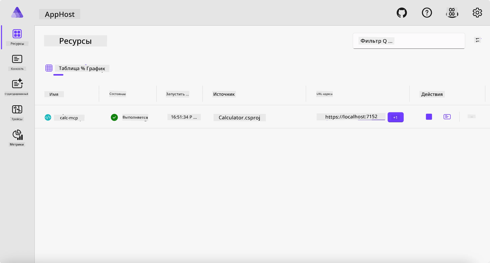
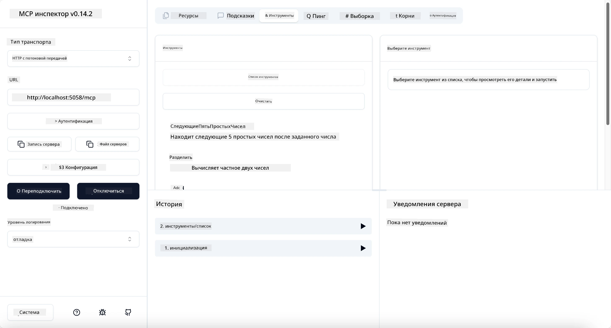

# Пример

Предыдущий пример показывает, как использовать локальный проект .NET с типом `stdio`. И как запустить сервер локально в контейнере. Это хорошее решение во многих ситуациях. Однако может быть полезно иметь сервер, работающий удалённо, например, в облачной среде. Вот где пригодится тип `http`.

Рассматривая решение в папке `04-PracticalImplementation`, оно может выглядеть гораздо сложнее предыдущего. Но на самом деле это не так. Если внимательно посмотреть на проект `src/Calculator`, вы увидите, что это в основном тот же код, что и в предыдущем примере. Единственное отличие — это использование другой библиотеки `ModelContextProtocol.AspNetCore` для обработки HTTP-запросов. Кроме того, мы меняем метод `IsPrime`, делая его приватным, просто чтобы показать, что в вашем коде могут быть приватные методы. Остальной код такой же, как и раньше.

Остальные проекты — из [Aspire](https://aspire.dev/get-started/what-is-aspire/). Наличие Aspire в решении улучшает опыт разработчика во время разработки и тестирования и помогает с наблюдаемостью. Для запуска сервера оно не обязательно, но хорошая практика иметь его в вашем решении.

## Запуск сервера локально

1. В VS Code (с расширением C# DevKit) перейдите в каталог `04-PracticalImplementation/samples/csharp`.
1. Выполните следующую команду для запуска сервера:

   ```bash
    dotnet watch run --project ./src/AppHost
   ```

1. Когда веб-браузер откроет панель управления Aspire, обратите внимание на URL `http`. Он должен выглядеть примерно как `http://localhost:5058/`.

   

## Тестирование Streamable HTTP с MCP Inspector

Если у вас установлен Node.js версии 22.7.5 и выше, вы можете использовать MCP Inspector для тестирования сервера.

Запустите сервер и выполните следующую команду в терминале:

```bash
npx @modelcontextprotocol/inspector http://localhost:5058
```



- Выберите `Streamable HTTP` в качестве типа транспорта.
- В поле URL введите ранее записанный URL сервера и добавьте к нему `/mcp`. Это должен быть `http` (не `https`), что-то вроде `http://localhost:5058/mcp`.
- Нажмите кнопку Connect.

Приятная особенность Inspector в том, что он обеспечивает хорошую видимость происходящего.

- Попробуйте вывести список доступных инструментов.
- Попробуйте несколько из них, они должны работать так же, как раньше.

## Тестирование MCP Server с GitHub Copilot Chat в VS Code

Чтобы использовать транспорт Streamable HTTP с GitHub Copilot Chat, измените конфигурацию сервера `calc-mcp`, созданного ранее, чтобы она выглядела так:

```jsonc
// .vscode/mcp.json
{
  "servers": {
    "calc-mcp": {
      "type": "http",
      "url": "http://localhost:5058/mcp"
    }
  }
}
```

Проведите несколько тестов:

- Попросите "3 простых числа после 6780". Обратите внимание, что Copilot будет использовать новые инструменты `NextFivePrimeNumbers` и вернет только первые 3 простых числа.
- Попросите "7 простых чисел после 111", чтобы увидеть результат.
- Попросите "У Джона 24 леденца, и он хочет раздать их своим 3 детям. Сколько леденцов у каждого ребенка?", чтобы посмотреть, что произойдет.

## Развертывание сервера в Azure

Давайте развернем сервер в Azure, чтобы больше людей могли им пользоваться.

В терминале перейдите в папку `04-PracticalImplementation/samples/csharp` и выполните следующую команду:

```bash
azd up
```

После завершения развертывания вы должны увидеть сообщение, похожее на это:


Скопируйте URL и используйте его в MCP Inspector и в GitHub Copilot Chat.

```jsonc
// .vscode/mcp.json
{
  "servers": {
    "calc-mcp": {
      "type": "http",
      "url": "https://calc-mcp.gentleriver-3977fbcf.australiaeast.azurecontainerapps.io/mcp"
    }
  }
}
```

## Что дальше?

Мы попробовали разные виды транспорта и инструменты тестирования. Мы также развернули ваш MCP сервер в Azure. Но что, если наш серверу нужно получить доступ к приватным ресурсам? Например, к базе данных или приватному API? В следующей главе мы рассмотрим, как можно улучшить безопасность нашего сервера.

---

<!-- CO-OP TRANSLATOR DISCLAIMER START -->
**Отказ от ответственности**:
Этот документ был переведен с использованием сервиса машинного перевода [Co-op Translator](https://github.com/Azure/co-op-translator). Несмотря на наши усилия по обеспечению точности, имейте в виду, что автоматический перевод может содержать ошибки или неточности. Оригинальный документ на его исходном языке следует считать авторитетным источником. Для получения критически важной информации рекомендуется обратиться к профессиональному человеческому переводу. Мы не несем ответственности за любые недоразумения или неправильные толкования, возникшие в результате использования этого перевода.
<!-- CO-OP TRANSLATOR DISCLAIMER END -->